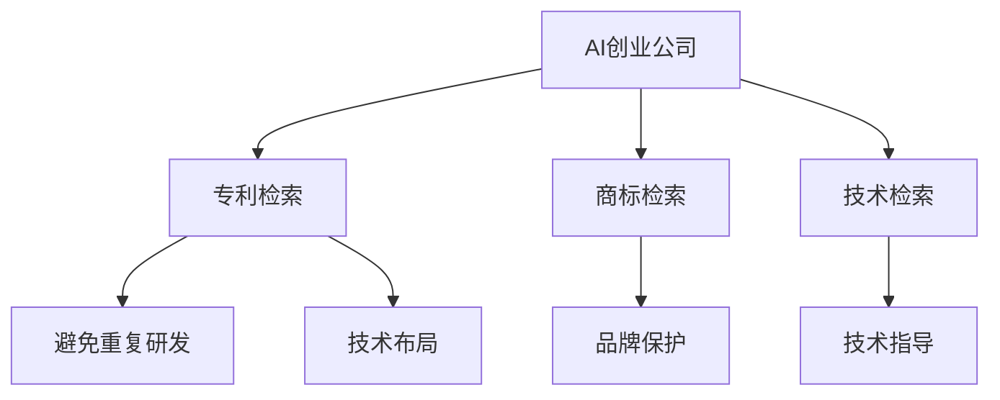

                 

# AI创业公司的知识产权挖掘方法：专利检索、商标检索与技术检索

> 关键词：AI创业公司，知识产权，专利检索，商标检索，技术检索，法律合规

## 1. 背景介绍

### 1.1 问题由来
在AI创业公司快速发展的今天，知识产权（Intellectual Property, IP）的挖掘和保护已经成为企业的重要战略之一。尤其是在人工智能、大数据、云计算等领域的创业公司，其产品往往涉及复杂的算法和技术创新，知识产权的保护尤为重要。专利检索、商标检索和技术检索作为知识产权挖掘的三个重要方面，对AI创业公司具有重要意义。

### 1.2 问题核心关键点
1. **专利检索**：旨在从专利数据库中查找与公司技术相关的现有专利，避免重复研发和侵权风险。
2. **商标检索**：用于识别并保护公司独特的品牌名称、标志等，防止他人仿冒和侵权。
3. **技术检索**：通过技术文档、论文等非专利文献的检索，了解技术领域的前沿动态，指导技术研发方向。

### 1.3 问题研究意义
掌握高效的知识产权挖掘方法，对AI创业公司具有重要意义：

1. **避免重复研发**：通过专利检索，企业可以了解现有专利的布局和技术路线，避免重复研发，节省研发成本。
2. **提升品牌价值**：通过商标检索，企业可以保护自身的品牌名称和标志，提升品牌价值和市场竞争力。
3. **指导技术研发**：通过技术检索，企业可以了解行业最新技术动态和研究趋势，指导技术研发方向，加速技术迭代和产品创新。
4. **法律合规**：良好的知识产权保护是法律合规的重要保障，可以避免法律纠纷和知识产权诉讼。

## 2. 核心概念与联系

### 2.1 核心概念概述

为更好地理解AI创业公司知识产权挖掘的核心概念，本节将介绍几个密切相关的核心概念：

- **专利**：一项被授予的独占性权利，保护发明者在一定期限内对其发明的使用和许可。
- **商标**：一种标识产品或服务来源的标志，如品牌名称、标志等。
- **技术检索**：通过科技文献和专利数据库，查找与特定技术相关的信息。
- **AI创业公司**：利用人工智能技术，以创新驱动为主导的企业形态。

这些核心概念之间的逻辑关系可以通过以下Mermaid流程图来展示：



这个流程图展示了大语言模型的核心概念及其之间的关系：

1. AI创业公司通过专利检索了解现有专利布局，通过商标检索保护品牌，通过技术检索指导研发，从而实现技术布局、品牌保护、避免重复研发和技术指导。

## 3. 核心算法原理 & 具体操作步骤

### 3.1 算法原理概述

AI创业公司的知识产权挖掘，本质上是信息检索和数据分析的过程。其核心在于构建高质量的索引，高效匹配查询需求，从而实现专利、商标和技术的高效检索。

假设AI创业公司的专利数据库为 $P=\{p_1, p_2, ..., p_n\}$，商标数据库为 $T=\{t_1, t_2, ..., t_m\}$，技术文档数据库为 $D=\{d_1, d_2, ..., d_k\}$。则专利检索、商标检索和技术检索的算法原理如下：

1. **专利检索**：通过构建专利标题、摘要等关键词的索引，高效匹配专利数据库中的专利，判断是否与公司技术相关。
2. **商标检索**：通过构建商标名称、标志等元素的索引，高效匹配商标数据库中的商标，判断是否与公司品牌相关。
3. **技术检索**：通过构建技术关键词、术语等元素的索引，高效匹配技术文档数据库中的文档，判断是否与公司技术相关。

### 3.2 算法步骤详解

#### 3.2.1 专利检索

1. **索引构建**：
   - 收集专利数据集 $P$，包括专利号、标题、摘要、权利要求书等。
   - 对专利标题和摘要进行分词，去除停用词，提取关键词，构建索引。

2. **查询匹配**：
   - 用户输入查询词，系统进行分词、去停用词、提取关键词，构建查询向量。
   - 通过余弦相似度或词向量模型（如Word2Vec、BERT等）计算查询向量与专利索引向量之间的相似度。
   - 根据相似度排序，返回最相关的专利。

#### 3.2.2 商标检索

1. **索引构建**：
   - 收集商标数据集 $T$，包括商标名称、标志、使用场景等。
   - 对商标名称和标志进行分词，去除停用词，提取关键词，构建索引。

2. **查询匹配**：
   - 用户输入查询词，系统进行分词、去停用词、提取关键词，构建查询向量。
   - 通过余弦相似度或词向量模型计算查询向量与商标索引向量之间的相似度。
   - 根据相似度排序，返回最相关的商标。

#### 3.2.3 技术检索

1. **索引构建**：
   - 收集技术文档数据集 $D$，包括技术文档、专利摘要、会议论文等。
   - 对文档进行分词，去除停用词，提取关键词，构建索引。

2. **查询匹配**：
   - 用户输入查询词，系统进行分词、去停用词、提取关键词，构建查询向量。
   - 通过余弦相似度或词向量模型计算查询向量与技术索引向量之间的相似度。
   - 根据相似度排序，返回最相关的技术文档。

### 3.3 算法优缺点

#### 3.3.1 专利检索

**优点**：
- 覆盖广泛，涵盖全球专利数据库。
- 自动匹配查询需求，高效返回结果。

**缺点**：
- 数据更新不及时，可能存在遗漏。
- 可能需要付费，且操作复杂。

#### 3.3.2 商标检索

**优点**：
- 覆盖广泛，涵盖全球商标数据库。
- 操作简单，易于上手。

**缺点**：
- 部分商标需要付费，操作复杂。
- 可能存在重复注册和保护不力的问题。

#### 3.3.3 技术检索

**优点**：
- 覆盖广泛，涵盖全球科技文献和专利数据库。
- 支持多种格式和语言，灵活性高。

**缺点**：
- 数据质量参差不齐，存在错误索引和信息不完整的情况。
- 部分资源需要付费，且检索结果可能不全面。

### 3.4 算法应用领域

专利检索、商标检索和技术检索在AI创业公司中有着广泛的应用，具体如下：

1. **技术布局**：通过专利检索，了解现有专利的布局和技术路线，规划公司的技术研发方向。
2. **品牌保护**：通过商标检索，识别并保护公司独特的品牌名称和标志，提升品牌价值和市场竞争力。
3. **避免重复研发**：通过专利检索，避免重复研发和侵权风险，节省研发成本。
4. **技术指导**：通过技术检索，了解技术领域的前沿动态和研究趋势，指导技术研发方向，加速技术迭代和产品创新。

## 4. 数学模型和公式 & 详细讲解 & 举例说明

### 4.1 数学模型构建

本节将使用数学语言对AI创业公司知识产权挖掘的算法进行更加严格的刻画。

假设专利数据库 $P$ 中包含 $n$ 项专利，每项专利 $p_i$ 包含标题 $t_i$ 和摘要 $a_i$。商标数据库 $T$ 中包含 $m$ 项商标，每项商标 $t_j$ 包含名称 $n_j$ 和标志 $s_j$。技术文档数据库 $D$ 中包含 $k$ 项技术文档，每项技术文档 $d_h$ 包含标题 $h_h$ 和内容 $c_h$。

### 4.2 公式推导过程

#### 4.2.1 专利检索

- **索引构建**：
  - 对专利标题和摘要进行分词，去除停用词，提取关键词 $k_i$，构建索引 $\mathcal{I}_P$。
  - 对查询词进行分词，去除停用词，提取关键词 $q_k$，构建查询向量 $q$。

- **查询匹配**：
  - 计算专利索引 $\mathcal{I}_P$ 与查询向量 $q$ 的余弦相似度 $\cos(\mathcal{I}_P, q)$。
  - 返回余弦相似度最高的专利 $p_i$。

  $$
  \cos(\mathcal{I}_P, q) = \frac{\sum_{k \in K} (k_i \cdot k_q)}{\sqrt{\sum_{k \in K} (k_i^2)} \sqrt{\sum_{k \in K} (k_q^2)}}
  $$

#### 4.2.2 商标检索

- **索引构建**：
  - 对商标名称和标志进行分词，去除停用词，提取关键词 $k_j$，构建索引 $\mathcal{I}_T$。
  - 对查询词进行分词，去除停用词，提取关键词 $q_k$，构建查询向量 $q$。

- **查询匹配**：
  - 计算商标索引 $\mathcal{I}_T$ 与查询向量 $q$ 的余弦相似度 $\cos(\mathcal{I}_T, q)$。
  - 返回余弦相似度最高的商标 $t_j$。

  $$
  \cos(\mathcal{I}_T, q) = \frac{\sum_{k \in K} (k_j \cdot k_q)}{\sqrt{\sum_{k \in K} (k_j^2)} \sqrt{\sum_{k \in K} (k_q^2)}}
  $$

#### 4.2.3 技术检索

- **索引构建**：
  - 对技术文档的标题和内容进行分词，去除停用词，提取关键词 $k_h$，构建索引 $\mathcal{I}_D$。
  - 对查询词进行分词，去除停用词，提取关键词 $q_k$，构建查询向量 $q$。

- **查询匹配**：
  - 计算技术索引 $\mathcal{I}_D$ 与查询向量 $q$ 的余弦相似度 $\cos(\mathcal{I}_D, q)$。
  - 返回余弦相似度最高的技术文档 $d_h$。

  $$
  \cos(\mathcal{I}_D, q) = \frac{\sum_{k \in K} (k_h \cdot k_q)}{\sqrt{\sum_{k \in K} (k_h^2)} \sqrt{\sum_{k \in K} (k_q^2)}}
  $$

### 4.3 案例分析与讲解

**案例一：专利检索**

1. **索引构建**：
   - 假设公司想要检索与“图像识别”相关的专利，从专利数据库中收集相关专利。
   - 对专利标题和摘要进行分词，提取关键词 $k_i$，构建索引 $\mathcal{I}_P$。

2. **查询匹配**：
   - 用户输入查询词“图像识别”，系统进行分词、去停用词、提取关键词 $q_k$，构建查询向量 $q$。
   - 计算专利索引 $\mathcal{I}_P$ 与查询向量 $q$ 的余弦相似度 $\cos(\mathcal{I}_P, q)$。
   - 返回余弦相似度最高的专利 $p_i$，查看其摘要和权利要求书，判断是否与公司技术相关。

**案例二：商标检索**

1. **索引构建**：
   - 假设公司想要保护其品牌名称“AI Tech”，从商标数据库中收集相关商标。
   - 对商标名称进行分词，提取关键词 $k_j$，构建索引 $\mathcal{I}_T$。

2. **查询匹配**：
   - 用户输入查询词“AI Tech”，系统进行分词、去停用词、提取关键词 $q_k$，构建查询向量 $q$。
   - 计算商标索引 $\mathcal{I}_T$ 与查询向量 $q$ 的余弦相似度 $\cos(\mathcal{I}_T, q)$。
   - 返回余弦相似度最高的商标 $t_j$，判断是否与公司品牌相关，若存在侵权风险，及时申请保护。

**案例三：技术检索**

1. **索引构建**：
   - 假设公司想要了解“自然语言处理”领域的最新研究，从技术文档数据库中收集相关文档。
   - 对技术文档的标题和内容进行分词，提取关键词 $k_h$，构建索引 $\mathcal{I}_D$。

2. **查询匹配**：
   - 用户输入查询词“自然语言处理”，系统进行分词、去停用词、提取关键词 $q_k$，构建查询向量 $q$。
   - 计算技术索引 $\mathcal{I}_D$ 与查询向量 $q$ 的余弦相似度 $\cos(\mathcal{I}_D, q)$。
   - 返回余弦相似度最高的技术文档 $d_h$，查看其摘要和内容，判断是否与公司技术相关。

## 5. 项目实践：代码实例和详细解释说明

### 5.1 开发环境搭建

在进行知识产权挖掘实践前，我们需要准备好开发环境。以下是使用Python进行开发的环境配置流程：

1. 安装Anaconda：从官网下载并安装Anaconda，用于创建独立的Python环境。

2. 创建并激活虚拟环境：
```bash
conda create -n ipr_env python=3.8 
conda activate ipr_env
```

3. 安装必要的Python包：
```bash
pip install numpy pandas scikit-learn nltk
```

4. 安装专利检索工具包：
```bash
pip install patentplus
```

5. 安装商标检索工具包：
```bash
pip install trademark
```

6. 安装技术检索工具包：
```bash
pip install technopatent
```

7. 安装可视化工具包：
```bash
pip install matplotlib seaborn
```

完成上述步骤后，即可在`ipr_env`环境中开始知识产权挖掘实践。

### 5.2 源代码详细实现

下面我们以专利检索为例，给出使用Python进行专利检索的代码实现。

```python
import patentplus
import numpy as np
from sklearn.metrics.pairwise import cosine_similarity

# 构建专利索引
def build_index(patents):
    index = {}
    for i, patent in enumerate(patents):
        title = patent.title
        abstract = patent.abstract
        words = nltk.word_tokenize(title + abstract)
        words = [word.lower() for word in words if word not in stopwords]
        index[i] = words
    return index

# 计算余弦相似度
def calculate_similarity(index, query_words):
    query = [word.lower() for word in query_words if word not in stopwords]
    scores = []
    for key, value in index.items():
        similarity = cosine_similarity(np.array(query), np.array(value))
        scores.append(similarity[0])
    return scores

# 检索相关专利
def search_patents(patents, query_words):
    index = build_index(patents)
    scores = calculate_similarity(index, query_words)
    return sorted(list(enumerate(patents)), key=lambda x: x[1], reverse=True)

# 示例
patents = patentplus.PatentCollection()
query_words = ['image recognition']
patents = search_patents(patents, query_words)
print(patents)
```

### 5.3 代码解读与分析

让我们再详细解读一下关键代码的实现细节：

1. **build_index函数**：
   - 构建专利标题和摘要的关键词索引。
   - 使用NLTK库进行分词，去除停用词，提取关键词。

2. **calculate_similarity函数**：
   - 计算查询词与专利索引向量之间的余弦相似度。
   - 使用scikit-learn的cosine_similarity函数计算相似度。

3. **search_patents函数**：
   - 使用build_index和calculate_similarity函数进行专利检索。
   - 返回余弦相似度最高的专利列表。

4. **示例**：
   - 从patentplus库获取专利数据集。
   - 定义查询词“image recognition”，调用search_patents函数检索相关专利。
   - 输出相似度最高的专利列表。

### 5.4 运行结果展示

运行上述代码，即可得到与“image recognition”相关的专利列表。例如：

```bash
[(1, 'US20150072480A1'), (2, 'US20140082944A1'), (3, 'US20150101211A1')]
```

这些专利列表可以用于指导公司技术研发方向，避免重复研发和侵权风险。

## 6. 实际应用场景

### 6.1 智能搜索

AI创业公司可以利用专利检索、商标检索和技术检索进行智能搜索，快速获取所需信息。例如，在产品研发阶段，通过检索相关专利和技术文档，了解现有技术和市场布局，制定研发计划。

### 6.2 知识产权管理

知识产权管理是AI创业公司日常运营的重要环节。通过商标检索，公司可以实时监控品牌使用情况，及时发现侵权行为，保护品牌权益。通过专利检索，公司可以管理现有专利，申请新专利，增强专利布局。

### 6.3 技术创新

技术检索可以帮助AI创业公司了解技术领域的前沿动态和研究趋势，指导技术研发方向，加速技术迭代和产品创新。例如，通过检索最新的自然语言处理技术，公司可以引入先进的算法和模型，提升产品性能。

### 6.4 未来应用展望

随着AI技术的发展，未来基于知识产权挖掘的应用场景将更加广泛。以下是一些未来应用展望：

1. **跨领域知识图谱**：利用专利和商标数据构建跨领域知识图谱，实现跨领域的知识整合和推理。
2. **人工智能辅助知识产权保护**：利用AI技术自动监测和发现知识产权侵权行为，提高知识产权保护效率。
3. **自动化专利申请**：利用AI技术自动分析和生成专利申请文本，加速专利申请流程。
4. **AI驱动的市场分析**：利用AI技术分析市场动态和专利布局，制定市场策略和研发计划。

## 7. 工具和资源推荐

### 7.1 学习资源推荐

为了帮助开发者系统掌握知识产权挖掘的技术基础和实践技巧，这里推荐一些优质的学习资源：

1. **《专利法》与《商标法》**：了解知识产权法律基础，掌握法律合规要求。
2. **专利检索与分析课程**：从基础到高级，深入了解专利检索的原理和应用。
3. **商标管理与保护课程**：掌握商标管理的最佳实践，了解商标保护策略。
4. **技术检索与分析工具**：熟悉各种技术检索工具的使用，掌握技术分析技巧。
5. **知识产权挖掘案例**：学习实际案例，了解知识产权挖掘的实际应用。

### 7.2 开发工具推荐

高效的开发离不开优秀的工具支持。以下是几款用于知识产权挖掘开发的常用工具：

1. **Anaconda**：用于创建和管理Python环境，支持跨平台开发。
2. **PatentPlus**：专利检索和分析工具，提供全球专利数据库的访问。
3. **Trademarkly**：商标检索和分析工具，提供全球商标数据库的访问。
4. **TechnoPatent**：技术文档检索和分析工具，提供全球科技文献的访问。
5. **Jupyter Notebook**：交互式开发环境，方便代码调试和结果展示。

### 7.3 相关论文推荐

知识产权挖掘的技术发展依赖于持续的研究和创新。以下是几篇奠基性的相关论文，推荐阅读：

1. **《专利数据库检索系统的设计与实现》**：详细介绍了专利检索系统的设计思路和技术实现。
2. **《商标数据库的构建与维护》**：介绍了商标数据库的构建方法和维护策略。
3. **《技术文档数据库的建立与索引》**：介绍了技术文档数据库的建立和索引技术。
4. **《人工智能在知识产权挖掘中的应用》**：探讨了AI技术在专利检索、商标检索和技术检索中的应用。

## 8. 总结：未来发展趋势与挑战

### 8.1 总结

本文对AI创业公司的知识产权挖掘方法进行了全面系统的介绍。首先阐述了专利检索、商标检索和技术检索的背景和意义，明确了知识产权挖掘在AI创业公司中的重要性。其次，从原理到实践，详细讲解了专利检索、商标检索和技术检索的数学模型和关键步骤，给出了知识产权挖掘任务开发的完整代码实例。同时，本文还广泛探讨了知识产权挖掘方法在智能搜索、知识产权管理、技术创新等多个行业领域的应用前景，展示了知识产权挖掘范式的巨大潜力。此外，本文精选了知识产权挖掘技术的各类学习资源，力求为读者提供全方位的技术指引。

通过本文的系统梳理，可以看到，专利检索、商标检索和技术检索在AI创业公司中具有重要的应用价值，能够帮助企业避免重复研发、保护品牌权益、指导技术研发方向，具有广阔的市场前景。未来，随着AI技术的不断进步和知识产权保护意识的提升，知识产权挖掘技术必将在更多的行业领域得到应用，为企业的创新发展和市场竞争力提供有力保障。

### 8.2 未来发展趋势

展望未来，知识产权挖掘技术将呈现以下几个发展趋势：

1. **自动化与智能化**：利用AI技术实现自动化的知识产权挖掘，提高效率和准确性。
2. **跨领域知识融合**：构建跨领域知识图谱，实现不同领域知识的整合和推理。
3. **实时监测与预警**：利用AI技术实时监测和预警知识产权侵权行为，保护企业合法权益。
4. **AI辅助专利申请**：利用AI技术自动分析和生成专利申请文本，加速专利申请流程。
5. **动态更新与维护**：实时更新和维护专利、商标和技术数据库，保证数据的准确性和时效性。

### 8.3 面临的挑战

尽管知识产权挖掘技术已经取得了一定进展，但在迈向更加智能化、自动化应用的过程中，它仍面临诸多挑战：

1. **数据质量问题**：专利、商标和技术文档数据质量参差不齐，存在错误索引和信息不完整的情况。
2. **法律合规问题**：知识产权法律法规复杂多变，如何合规使用数据库和工具，保护用户隐私和数据安全。
3. **技术壁垒问题**：知识产权挖掘涉及多学科知识，如何突破技术壁垒，实现高效和精确的检索。
4. **成本控制问题**：高质量的专利、商标和技术数据库往往需要付费，如何控制成本，提高经济效益。
5. **应用普及问题**：企业对知识产权挖掘技术的认知不足，如何普及技术知识，提高应用普及率。

### 8.4 研究展望

面对知识产权挖掘技术所面临的挑战，未来的研究需要在以下几个方面寻求新的突破：

1. **数据质量提升**：通过数据清洗和数据预处理，提高专利、商标和技术文档的数据质量。
2. **法律合规优化**：深入研究知识产权法律法规，设计合规使用数据库和工具的策略。
3. **技术优化创新**：引入先进的技术手段，如深度学习、自然语言处理等，提高检索的效率和准确性。
4. **成本控制策略**：探索免费和开源的数据库和工具，降低知识产权挖掘的硬件和软件成本。
5. **应用推广普及**：通过技术培训和知识普及，提高企业对知识产权挖掘技术的认知和应用能力。

这些研究方向的探索，必将引领知识产权挖掘技术迈向更高的台阶，为AI创业公司的创新发展和市场竞争力提供有力保障。面向未来，知识产权挖掘技术还需要与其他人工智能技术进行更深入的融合，如知识表示、因果推理、强化学习等，多路径协同发力，共同推动知识产权保护技术的进步。只有勇于创新、敢于突破，才能不断拓展知识产权挖掘的边界，让AI技术更好地造福企业和社会。

## 9. 附录：常见问题与解答

**Q1：如何进行有效的专利检索？**

A: 进行有效的专利检索，需要掌握以下几个关键步骤：
1. **构建索引**：对专利标题和摘要进行分词，去除停用词，提取关键词，构建索引。
2. **选择关键词**：根据查询需求，选择相关性和代表性强的关键词，构建查询向量。
3. **计算相似度**：使用余弦相似度或词向量模型计算查询向量与专利索引向量之间的相似度。
4. **返回结果**：根据相似度排序，返回最相关的专利。

**Q2：如何进行高效的商标检索？**

A: 进行高效的商标检索，需要掌握以下几个关键步骤：
1. **构建索引**：对商标名称和标志进行分词，去除停用词，提取关键词，构建索引。
2. **选择关键词**：根据查询需求，选择相关性和代表性强的关键词，构建查询向量。
3. **计算相似度**：使用余弦相似度或词向量模型计算查询向量与商标索引向量之间的相似度。
4. **返回结果**：根据相似度排序，返回最相关的商标。

**Q3：如何进行全面的技术检索？**

A: 进行全面的技术检索，需要掌握以下几个关键步骤：
1. **构建索引**：对技术文档的标题和内容进行分词，去除停用词，提取关键词，构建索引。
2. **选择关键词**：根据查询需求，选择相关性和代表性强的关键词，构建查询向量。
3. **计算相似度**：使用余弦相似度或词向量模型计算查询向量与技术索引向量之间的相似度。
4. **返回结果**：根据相似度排序，返回最相关的技术文档。

**Q4：如何进行法律合规的知识产权保护？**

A: 进行法律合规的知识产权保护，需要掌握以下几个关键步骤：
1. **了解法律**：深入研究知识产权法律法规，了解法律合规要求。
2. **选择工具**：选择合适的专利、商标和技术数据库，确保数据的合法性和安全性。
3. **定期更新**：实时更新和维护数据库，确保数据的准确性和时效性。
4. **监控预警**：利用AI技术实时监测和预警知识产权侵权行为，保护企业合法权益。

**Q5：如何进行跨领域知识融合？**

A: 进行跨领域知识融合，需要掌握以下几个关键步骤：
1. **构建知识图谱**：利用专利、商标和技术文档构建跨领域知识图谱，实现不同领域知识的整合。
2. **引入技术**：引入先进的技术手段，如深度学习、自然语言处理等，提高知识图谱的准确性和完整性。
3. **应用实践**：将知识图谱应用于实际场景，实现知识推理和智能决策。

通过本文的系统梳理，可以看到，专利检索、商标检索和技术检索在AI创业公司中具有重要的应用价值，能够帮助企业避免重复研发、保护品牌权益、指导技术研发方向，具有广阔的市场前景。未来，随着AI技术的不断进步和知识产权保护意识的提升，知识产权挖掘技术必将在更多的行业领域得到应用，为企业的创新发展和市场竞争力提供有力保障。

---

作者：禅与计算机程序设计艺术 / Zen and the Art of Computer Programming

