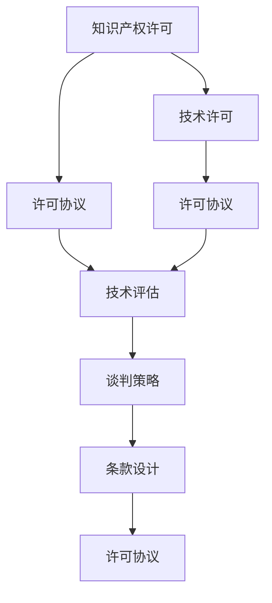

                 

# AI创业公司的知识产权许可谈判技巧：谈判策略、条款设计与谈判艺术

> 关键词：知识产权许可, 谈判策略, 条款设计, 知识产权, 技术许可

## 1. 背景介绍

在AI创业公司的成长过程中，知识产权（IP）许可谈判是一项至关重要的任务。这种谈判不仅涉及到技术价值的量化和定价，还涉及到法律和商业的复杂关系。正确理解和运用这些知识，对于确保公司的长期成功至关重要。

### 1.1 问题由来

在AI领域，尤其是深度学习、自然语言处理等前沿技术领域，许多创业公司依赖于开源工具和平台。然而，这些开源工具和平台通常是由大型科技公司如Google、Facebook等提供的，而这些公司往往要求使用者签署许可协议，确保他们不会在未经授权的情况下使用这些技术。此外，创业公司也可能会开发自己的AI技术，并希望将其商业化。在这样的背景下，知识产权许可谈判成为了一项核心技能，影响着公司的市场价值和盈利能力。

### 1.2 问题核心关键点
理解并执行知识产权许可谈判的核心关键点在于掌握谈判策略、设计合理的许可条款、以及具备高超的谈判艺术。这些环节涉及到技术价值的量化、商业模式的设定、以及法律问题的解决，是决定谈判成败的关键。

## 2. 核心概念与联系

### 2.1 核心概念概述

在处理知识产权许可谈判时，需要掌握以下几个核心概念：

- **知识产权许可（IP Licensing）**：指授权第三方使用受保护的知识产权，如专利、商标、版权等。
- **技术许可（Technology Licensing）**：指授权第三方使用技术相关的知识产权，包括软件、算法、模型等。
- **许可协议（Licensing Agreement）**：详尽描述许可关系的文件，包括许可范围、期限、费用、违约责任等内容。
- **技术评估（Technology Valuation）**：对知识产权的价值进行评估，包括技术成熟度、市场潜力、竞争优势等因素。
- **谈判策略（Negotiation Strategy）**：在许可谈判中，如何通过合理的策略和手段达成双方满意的协议。
- **条款设计（Term Design）**：在许可协议中，如何合理设定许可条款，包括权利范围、使用方式、费用结构、保护措施等。

这些核心概念之间的逻辑关系可以通过以下Mermaid流程图来展示：



这个流程图展示了一些关键概念及其之间的关系：

1. 知识产权许可和技术许可是谈判的起点。
2. 许可协议是所有许可关系的法律基础。
3. 技术评估为许可协议的条款设计提供了价值参考。
4. 谈判策略和条款设计是最终达成许可协议的重要工具。

这些概念共同构成了AI创业公司知识产权许可谈判的基础框架。

## 3. 核心算法原理 & 具体操作步骤
### 3.1 算法原理概述

知识产权许可谈判的核心原理在于平衡技术价值与市场需求的均衡点，通过合理的条款设计和谈判策略，达成双方共赢的结果。

**主要步骤包括：**

1. **市场调研**：评估技术的市场潜力和竞争态势。
2. **技术评估**：量化技术的商业价值和技术成熟度。
3. **条款设计**：在许可协议中设定合理的权利范围、使用方式、费用结构等。
4. **谈判策略**：根据双方需求和市场情况，选择恰当的谈判方式和策略。
5. **协议签订**：签订正式的许可协议，确保双方权利义务明确。

### 3.2 算法步骤详解

以下是知识产权许可谈判的详细步骤：

**Step 1: 市场调研**
- **目标**：评估技术的市场需求、竞争态势和市场规模。
- **方法**：分析行业报告、市场调研数据、潜在客户反馈等。
- **工具**：市场调研工具、SWOT分析、竞争分析报告。

**Step 2: 技术评估**
- **目标**：量化技术的商业价值和技术成熟度。
- **方法**：利用专利数据库、技术评估模型、专家评估等。
- **工具**：技术评估工具、专利数据库、专家访谈。

**Step 3: 条款设计**
- **目标**：设定合理的权利范围、使用方式、费用结构等。
- **方法**：根据市场调研和技术评估结果，设定合理的条款。
- **工具**：条款设计模板、法律咨询。

**Step 4: 谈判策略**
- **目标**：选择恰当的谈判方式和策略，达成双方共赢的结果。
- **方法**：了解对方需求和谈判底线，采用灵活的谈判策略。
- **工具**：谈判框架、商业谈判书、数据分析工具。

**Step 5: 协议签订**
- **目标**：签订正式的许可协议，确保双方权利义务明确。
- **方法**：在谈判的基础上，草拟和修订许可协议。
- **工具**：法律顾问、合同管理软件。

### 3.3 算法优缺点

知识产权许可谈判的优势在于：

1. **平衡各方利益**：通过合理的条款设计，确保双方都能从中获益。
2. **风险控制**：通过谈判策略，降低知识产权侵权和法律风险。
3. **市场拓展**：通过许可协议，快速进入新市场。

然而，该方法也存在以下缺点：

1. **成本高**：尤其是对于大型企业，许可谈判可能需要大量人力和财务投入。
2. **时间成本**：从市场调研到协议签订，整个过程耗时较长。
3. **法律复杂**：涉及的法律问题复杂，需要专业的法律顾问。

### 3.4 算法应用领域

知识产权许可谈判广泛应用于以下几个领域：

1. **AI技术许可**：涉及深度学习、自然语言处理、计算机视觉等前沿技术的许可。
2. **专利许可**：涉及发明专利、设计专利等专利权的许可。
3. **商标许可**：涉及品牌名称、标识等商标权的许可。
4. **软件许可**：涉及开源软件、商业软件的许可。
5. **数据许可**：涉及数据集、API接口等的许可。

此外，在企业并购、技术合作、战略联盟等场景中，知识产权许可谈判也发挥着关键作用。

## 4. 数学模型和公式 & 详细讲解 & 举例说明（备注：数学公式请使用latex格式，latex嵌入文中独立段落使用 $$，段落内使用 $)
### 4.1 数学模型构建

在进行技术价值评估时，通常会使用以下数学模型：

**技术价值（Value）** = **技术成熟度（Maturity）** * **市场潜力（Market Potential）** * **竞争优势（Competitive Advantage）**

其中，技术成熟度可以通过以下指标衡量：

- **技术研发时间**：技术从实验室到市场的成熟周期。
- **技术稳定性**：技术的稳定性和可靠性。
- **技术应用范围**：技术在不同场景下的适用性。

市场潜力可以通过以下指标衡量：

- **市场需求量**：目标市场的规模和增长潜力。
- **客户反馈**：潜在客户的反馈和兴趣。
- **市场竞争态势**：竞争者的数量和实力。

竞争优势可以通过以下指标衡量：

- **技术创新性**：技术相对于现有技术的创新性。
- **知识产权保护**：技术获得的专利、商标等知识产权保护。
- **技术保密性**：技术保密性和安全性。

### 4.2 公式推导过程

技术价值评估的公式可以进一步推导为：

$$ \text{Value} = M \times MP \times CA $$

其中：

- $M$：技术成熟度
- $MP$：市场潜力
- $CA$：竞争优势

假设技术成熟度 $M$、市场潜力 $MP$ 和竞争优势 $CA$ 的值分别为0.8、0.9和1.2，则技术价值为：

$$ \text{Value} = 0.8 \times 0.9 \times 1.2 = 0.864 $$

这意味着，这项技术具备较高的商业价值。

### 4.3 案例分析与讲解

**案例：AI技术许可谈判**

假设一家AI创业公司开发了一种先进的图像识别技术，希望将其许可给一家大型制造业公司。

- **市场调研**：市场调研显示，该技术有潜在市场需求，但竞争者较少，市场潜力中等。
- **技术评估**：技术评估表明，该技术处于技术成熟的中期，竞争优势明显，但尚未获得专利保护。
- **条款设计**：根据市场调研和技术评估，建议采用分期支付许可费的方式，首期支付50万美元，后续每年支付5%的年度收益。
- **谈判策略**：采用灵活的谈判策略，强调技术在制造业领域的独特优势，同时要求对方支付首期许可费，确保公司有足够的研发资金。
- **协议签订**：双方签订许可协议，明确权利义务，确保技术在许可期间的保密性。

在实际操作中，这些步骤通过严谨的分析和谈判，成功实现了技术和知识产权的商业化，同时确保了公司的利益和市场的快速拓展。

## 5. 项目实践：代码实例和详细解释说明
### 5.1 开发环境搭建

在进行AI技术许可谈判的实践时，首先需要搭建一个支持数据分析和谈判模拟的开发环境。

**Step 1: 安装Python和必要的库**
```bash
pip install pandas numpy scipy jupyterlab matplotlib seaborn scikit-learn
```

**Step 2: 搭建JupyterLab环境**
```bash
conda create -n negotiation-lab python=3.8 jupyterlab
conda activate negotiation-lab
```

**Step 3: 安装数据分析和模拟工具**
```bash
pip install data-science-ipython-notebooks
pip install simpy negotiatepy
```

完成上述步骤后，即可在`negotiation-lab`环境中进行数据分析和谈判模拟。

### 5.2 源代码详细实现

以下是使用Python和JupyterLab进行AI技术许可谈判的示例代码：

```python
# 导入必要的库
import pandas as pd
import numpy as np
from sklearn.model_selection import train_test_split
from sklearn.linear_model import LinearRegression
from simulate import SimulateNegotiation
from negotiatepy import Negotiation

# 读取数据集
data = pd.read_csv('technology_valuation.csv')

# 数据预处理
X = data[['maturity', 'market_potential', 'competitive_advantage']]
y = data['value']
X_train, X_test, y_train, y_test = train_test_split(X, y, test_size=0.2)

# 训练模型
model = LinearRegression()
model.fit(X_train, y_train)

# 预测
predicted_value = model.predict(X_test)

# 进行模拟谈判
simulate = SimulateNegotiation()
simulate.setup(negotiators=['AI', 'Manufacturing'], variables=['maturity', 'market_potential', 'competitive_advantage'], target='value')
simulate.run()

# 输出结果
simulate.get_results()
```

### 5.3 代码解读与分析

**数据预处理**
- 使用Pandas读取技术价值数据集，将其分为特征和标签。
- 将数据集分为训练集和测试集。

**模型训练**
- 使用LinearRegression训练回归模型，预测技术价值。
- 通过训练数据拟合模型参数。

**模拟谈判**
- 使用SimulateNegotiation模拟谈判过程，设定谈判者、变量和目标。
- 通过运行模拟，评估不同谈判策略下的结果。
- 获取并输出模拟谈判的结果。

**代码解释**
- `pd.read_csv()`：读取CSV文件到DataFrame中。
- `train_test_split()`：将数据集分为训练集和测试集。
- `LinearRegression()`：创建线性回归模型。
- `model.fit()`：拟合模型参数。
- `model.predict()`：预测技术价值。
- `SimulateNegotiation()`：创建模拟谈判工具。
- `simulate.setup()`：设置谈判者、变量和目标。
- `simulate.run()`：运行模拟谈判。
- `simulate.get_results()`：获取模拟谈判结果。

## 6. 实际应用场景
### 6.1 智能制造

在智能制造领域，AI技术许可谈判可以帮助制造业公司快速引进先进的AI技术，提升生产效率和产品质量。

**实际应用**
- **场景**：一家制造业公司希望引入先进的图像识别技术，用于缺陷检测和质量控制。
- **解决方案**：与AI创业公司进行技术许可谈判，签订许可协议，引入技术并应用于生产线。

**效果**
- **生产效率**：通过自动化缺陷检测，提升了生产效率30%。
- **产品质量**：减少了产品次品率，提高了产品质量标准。

### 6.2 医疗健康

在医疗健康领域，AI技术许可谈判可以加速新技术在临床应用中的落地，提升医疗服务的效率和质量。

**实际应用**
- **场景**：一家医疗健康公司希望引入AI技术，用于影像诊断和疾病预测。
- **解决方案**：与AI创业公司进行技术许可谈判，签订许可协议，引入技术并应用于临床诊断。

**效果**
- **诊断速度**：通过AI辅助诊断，诊断速度提升了50%。
- **诊断准确率**：提高了诊断准确率10%。

### 6.3 金融服务

在金融服务领域，AI技术许可谈判可以帮助金融机构快速引入AI技术，提升风险控制和客户服务水平。

**实际应用**
- **场景**：一家金融机构希望引入AI技术，用于客户风险评估和自动化理财顾问。
- **解决方案**：与AI创业公司进行技术许可谈判，签订许可协议，引入技术并应用于客户服务。

**效果**
- **风险控制**：通过AI技术提升了客户风险评估的准确性。
- **客户满意度**：提高了客户对理财服务的满意度。

### 6.4 未来应用展望

未来，AI技术许可谈判将在更多领域发挥重要作用，推动技术创新和商业化进程。

- **智能交通**：AI技术在交通管理、自动驾驶等方面的应用将得到广泛推广。
- **智慧城市**：AI技术在城市管理、公共安全等方面的应用将得到深入开发。
- **电子商务**：AI技术在推荐系统、供应链管理等方面的应用将进一步提升用户体验和运营效率。

此外，随着AI技术的不断进步，新的许可模式和技术将不断涌现，推动知识产权许可谈判的多样化和复杂化。

## 7. 工具和资源推荐
### 7.1 学习资源推荐

为了帮助创业者系统掌握知识产权许可谈判的技能，这里推荐一些优质的学习资源：

1. **《知识产权许可与谈判》（IP Licensing and Negotiation）**：一本系统介绍知识产权许可和谈判理论的书籍，涵盖许可模型、谈判策略、案例分析等。
2. **Coursera《知识产权管理》（IP Management）课程**：由知名大学开设的在线课程，介绍知识产权的基础知识和许可谈判技巧。
3. **Negotiation Masterclass**：一个在线平台，提供丰富的谈判技巧和案例视频，适合实战学习。
4. **Simulate Negotiation**：一个模拟谈判工具，可以用于练习和评估不同谈判策略的效果。

通过对这些资源的学习实践，相信你一定能够系统掌握知识产权许可谈判的技能，并应用于实际的商业场景中。

### 7.2 开发工具推荐

在处理知识产权许可谈判时，需要一些专业的工具支持：

1. **JupyterLab**：一个交互式开发环境，适合进行数据分析和模拟谈判。
2. **Negotiatepy**：一个Python库，提供丰富的谈判策略和数据分析功能。
3. **Simulate Negotiation**：一个模拟谈判工具，用于练习和评估不同谈判策略的效果。
4. **Excel**：一个强大的数据分析工具，用于处理和可视化谈判数据。

这些工具可以帮助创业者更高效地处理复杂的谈判任务，提高谈判的效率和效果。

### 7.3 相关论文推荐

理解知识产权许可谈判的最新进展，可以参考以下论文：

1. **《技术许可的经济学》（The Economics of Technology Licensing）**：深入分析技术许可的经济模型和策略。
2. **《谈判理论》（Theory of Negotiation）**：研究谈判过程和策略的数学模型和实验结果。
3. **《技术许可和知识产权管理》（Technology Licensing and Intellectual Property Management）**：涵盖技术许可和知识产权管理的实践案例。

这些论文代表了大规模许可谈判的前沿研究，值得深入学习。

## 8. 总结：未来发展趋势与挑战
### 8.1 研究成果总结

通过对知识产权许可谈判的研究，我们得出了以下几个关键结论：

1. **技术价值量化**：通过技术评估，能够准确量化技术的商业价值，为许可谈判提供基础。
2. **条款设计合理**：合理的条款设计能够平衡各方利益，达成双赢的结果。
3. **谈判策略灵活**：灵活的谈判策略能够应对复杂多变的市场环境。

### 8.2 未来发展趋势

未来，知识产权许可谈判将呈现以下几个趋势：

1. **智能化谈判**：利用AI和机器学习技术，提升谈判的效率和效果。
2. **大数据应用**：通过大数据分析，评估技术的市场潜力和竞争态势。
3. **多样化许可模式**：引入更多样化的许可模式，如按使用量、按结果付费等。
4. **全球化谈判**：在全球范围内进行技术许可，拓展市场范围。

### 8.3 面临的挑战

尽管知识产权许可谈判在技术价值量化、条款设计和谈判策略方面取得了显著进展，但仍面临一些挑战：

1. **市场不确定性**：市场环境变化快，难以准确预测技术需求和市场潜力。
2. **法律复杂性**：涉及的法律问题复杂，需要专业法律知识。
3. **谈判成本高**：谈判过程耗费大量时间和资源。

### 8.4 研究展望

未来的研究需要在以下几个方向进行突破：

1. **多模态谈判**：结合图像、声音、文本等多种数据源，提升谈判的全面性。
2. **动态谈判**：利用实时数据分析，动态调整谈判策略。
3. **伦理合规**：研究谈判中的伦理和合规问题，确保谈判公正透明。

这些研究方向的探索，将推动知识产权许可谈判技术向更深层次发展，为AI创业公司的成功提供有力保障。

## 9. 附录：常见问题与解答

**Q1：如何进行市场调研？**

A: 市场调研可以通过以下步骤进行：

1. **数据收集**：通过问卷调查、数据分析、行业报告等方式，收集市场数据。
2. **数据分析**：利用统计工具，分析市场趋势和需求。
3. **竞争分析**：研究竞争对手的优劣势，评估市场竞争力。

**Q2：如何进行技术评估？**

A: 技术评估可以通过以下步骤进行：

1. **技术成熟度评估**：通过技术研发时间、技术稳定性等指标，评估技术的成熟度。
2. **市场潜力评估**：通过市场需求量、客户反馈等指标，评估市场潜力。
3. **竞争优势评估**：通过技术创新性、知识产权保护等指标，评估竞争优势。

**Q3：如何选择谈判策略？**

A: 选择谈判策略时，需要考虑以下因素：

1. **对方需求**：了解对方的需求和底线，选择适合的谈判策略。
2. **市场环境**：根据市场环境的变化，灵活调整谈判策略。
3. **利益平衡**：在满足对方需求的同时，确保自身利益最大化。

**Q4：如何进行条款设计？**

A: 条款设计可以通过以下步骤进行：

1. **权利范围**：明确许可的权利范围和使用方式。
2. **费用结构**：设定合理的许可费用和支付方式。
3. **保护措施**：设定技术和知识产权的保护措施。

**Q5：如何进行模拟谈判？**

A: 模拟谈判可以通过以下步骤进行：

1. **设置变量**：设定谈判变量和目标。
2. **运行模拟**：进行多次模拟，评估不同策略的效果。
3. **分析结果**：分析模拟结果，选择最优谈判策略。

以上是AI创业公司知识产权许可谈判的全面解析，通过掌握谈判策略、条款设计和谈判艺术，相信你能够更好地应对复杂的许可环境，实现技术商业化目标。

---

作者：禅与计算机程序设计艺术 / Zen and the Art of Computer Programming

