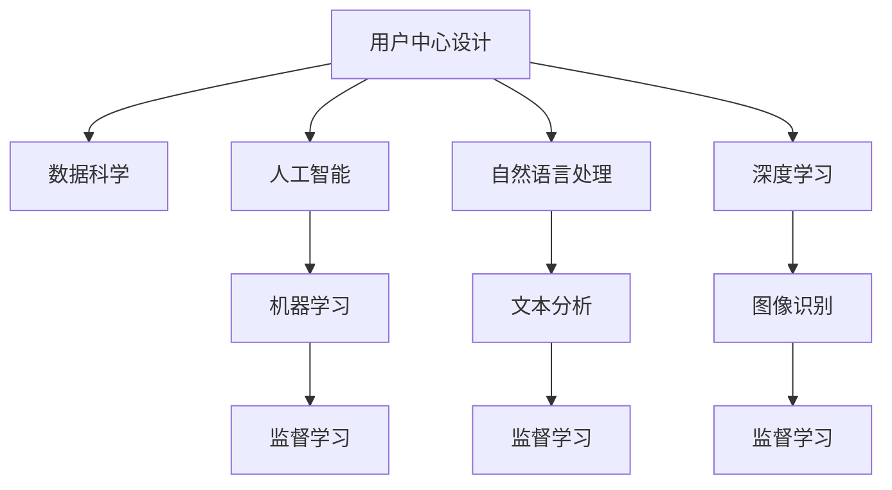

                 

# AI创业坚持：以用户为中心的创新

> 关键词：人工智能,创业,用户中心,创新,机器学习,数据科学,自然语言处理(NLP),深度学习

## 1. 背景介绍

### 1.1 问题由来

在人工智能领域，尤其是在创业环境下，创新是企业成功的关键因素之一。随着人工智能技术的迅猛发展，各行各业都迎来了数字化转型的浪潮。然而，创新并非易事，特别是在AI创业领域，如何从众多竞争者中脱颖而出，成为创业者的首要任务。本文将探讨如何坚持以用户为中心的创新，构建可持续发展的AI创业公司。

### 1.2 问题核心关键点

在AI创业中，坚持以用户为中心的创新方法，可以更好地理解用户需求，构建解决方案，提高产品竞争力和用户体验。关键点包括：

1. **用户需求调研**：深入了解目标用户群体，识别需求和痛点。
2. **数据驱动决策**：利用数据科学方法，评估产品功能和性能。
3. **迭代优化**：通过用户反馈不断优化产品和服务。
4. **用户参与设计**：引入用户参与产品设计过程，增强产品适配性。
5. **多模态融合**：结合多种数据和交互方式，提供全面的用户体验。

这些关键点共同构成了AI创业中坚持用户中心创新的核心框架，使产品能够更好地满足用户需求，提高市场竞争力。

## 2. 核心概念与联系

### 2.1 核心概念概述

为了更好地理解以用户为中心的创新方法，本节将介绍几个密切相关的核心概念：

- **用户中心设计(User-Centered Design, UCD)**：一种设计方法，强调在设计过程中始终以用户体验为中心，通过与用户的交互来指导设计决策。
- **数据科学(Data Science)**：一门跨学科领域，利用数据、统计学、机器学习等方法，从数据中提取知识和洞察，指导决策和产品设计。
- **人工智能(AI)**：涵盖机器学习、自然语言处理(NLP)、深度学习等多种技术的综合领域，旨在构建能够模拟人类智能的机器系统。
- **自然语言处理(NLP)**：专注于让计算机理解和生成人类语言的技术，包括语音识别、文本分析、机器翻译等。
- **深度学习(Deep Learning)**：一种基于多层神经网络的机器学习技术，广泛应用于图像识别、语音识别、自然语言处理等领域。

这些核心概念之间的逻辑关系可以通过以下Mermaid流程图来展示：



这个流程图展示了一系列概念之间的联系：

1. 用户中心设计通过数据科学方法，指导人工智能技术的开发应用。
2. 人工智能技术，尤其是深度学习，广泛应用于自然语言处理和机器学习任务中。
3. 自然语言处理和深度学习是人工智能技术的重要分支，用于分析和生成人类语言。
4. 机器学习是人工智能技术的基础，监督学习是其中一种重要方法，广泛应用于文本分析、图像识别等任务。

这些概念共同构成了AI创业中坚持用户中心创新的技术基础，使其能够更好地满足用户需求，提高产品竞争力和用户体验。

## 3. 核心算法原理 & 具体操作步骤
### 3.1 算法原理概述

以用户为中心的创新方法，强调通过数据科学和人工智能技术，深入理解用户需求，构建解决方案。其核心思想是：利用数据科学方法，分析用户反馈和行为数据，识别用户需求和痛点；通过人工智能技术，构建满足用户需求的产品和服务。

形式化地，假设用户需求为 $D$，产品功能和性能为 $F$，则创新的目标是找到一个最优的 $F^*$，使得 $F^*$ 与 $D$ 最匹配，即：

$$
F^* = \mathop{\arg\min}_{F} \| F - D \|
$$

其中 $\| \cdot \|$ 表示某种距离度量，如均方误差、KL散度等。在实践中，通常使用优化算法如梯度下降、遗传算法等来求解上述优化问题。

### 3.2 算法步骤详解

以用户为中心的创新方法通常包括以下几个关键步骤：

**Step 1: 用户需求调研**
- 通过问卷调查、用户访谈、焦点小组等方式，收集目标用户群体的需求和痛点。
- 分析用户反馈数据，识别关键需求和潜在问题。
- 将用户需求转化为产品功能和性能指标。

**Step 2: 数据收集与预处理**
- 收集用户行为数据，如点击率、购买行为、使用频率等。
- 对数据进行清洗、归一化和特征工程，准备数据集。
- 使用A/B测试等方法验证数据集的可靠性和有效性。

**Step 3: 构建模型**
- 选择合适的机器学习算法，如决策树、随机森林、神经网络等。
- 使用训练数据集，训练模型，并验证模型的准确性和泛化能力。
- 根据模型表现，不断调整模型参数和算法，优化模型性能。

**Step 4: 迭代优化**
- 将模型应用到实际场景中，收集用户反馈。
- 分析用户反馈，识别问题点。
- 利用数据科学方法，对模型和产品进行迭代优化。
- 重复上述过程，直至模型和产品满足用户需求。

**Step 5: 用户参与设计**
- 邀请用户参与产品设计，收集用户反馈。
- 根据用户反馈，优化产品界面和功能。
- 引入用户参与测试，验证产品适配性和用户满意度。
- 根据测试结果，进一步优化产品设计和功能。

通过上述步骤，可以构建出以用户为中心的创新方法，满足用户需求，提高产品竞争力和用户体验。

### 3.3 算法优缺点

以用户为中心的创新方法具有以下优点：
1. 提高用户满意度：通过深入理解用户需求，构建满足用户需求的产品和服务，显著提高用户满意度和忠诚度。
2. 降低开发成本：数据驱动的决策方法，避免了盲目投资和开发，降低了产品开发成本。
3. 提升市场竞争力：深入了解用户需求和痛点，构建竞争力的产品和服务，在市场中脱颖而出。
4. 快速迭代优化：通过不断收集用户反馈和数据，快速迭代优化产品，提高市场响应速度。

同时，该方法也存在一定的局限性：
1. 数据获取难度大：获取高质量用户数据需要耗费大量时间和资源。
2. 模型复杂度高：数据驱动的决策需要构建复杂的模型，增加了开发难度。
3. 用户需求多样性：用户需求多样且变化快，难以全面覆盖。
4. 隐私和伦理问题：用户数据隐私和伦理问题需要严格遵守相关法律法规。

尽管存在这些局限性，但就目前而言，以用户为中心的创新方法仍然是AI创业中最为有效的策略之一。未来相关研究的重点在于如何进一步降低数据获取成本，提高模型效率，同时兼顾用户隐私和伦理问题，确保产品和服务的安全性。

### 3.4 算法应用领域

以用户为中心的创新方法在AI创业中已经被广泛应用于多个领域，例如：

- **智能客服**：通过分析用户行为数据，构建智能客服系统，提高客户咨询体验和问题解决效率。
- **个性化推荐**：利用用户行为数据，构建个性化推荐系统，提高用户粘性和满意度。
- **金融科技**：通过分析用户交易数据，构建风险控制和用户画像，提升金融服务质量和用户体验。
- **健康医疗**：利用患者医疗数据，构建智能诊断和健康管理服务，提高医疗服务质量和用户健康水平。
- **智能家居**：通过分析用户使用习惯，构建智能家居系统，提高家居生活便利性和舒适性。

这些领域的应用，充分展示了以用户为中心的创新方法在AI创业中的巨大潜力。随着技术的不断演进，相信这种创新方法将在更多领域得到应用，为各行各业带来新的突破和变革。

## 4. 数学模型和公式 & 详细讲解 & 举例说明
### 4.1 数学模型构建

为了更好地理解以用户为中心的创新方法，本节将使用数学语言对算法进行更加严格的刻画。

假设用户需求为 $D$，产品功能和性能为 $F$，模型为 $M$，则创新的目标是最小化模型与用户需求之间的距离，即：

$$
\min_{M} \| M(F) - D \|
$$

其中 $M(F)$ 表示模型对输入数据 $F$ 的输出。

### 4.2 公式推导过程

以用户为中心的创新方法通常采用以下公式进行推导：

**监督学习**
$$
\min_{\theta} \frac{1}{N} \sum_{i=1}^N \ell(F_\theta(x_i), y_i)
$$

其中 $F_\theta$ 表示模型，$x_i$ 表示输入数据，$y_i$ 表示标签，$\ell$ 表示损失函数，$\theta$ 表示模型参数。

**无监督学习**
$$
\min_{\theta} \mathcal{L}(D, F_\theta) = \min_{\theta} \frac{1}{N} \sum_{i=1}^N \| D_i - F_\theta(D_i) \|
$$

其中 $D_i$ 表示用户行为数据，$\mathcal{L}$ 表示损失函数。

### 4.3 案例分析与讲解

以智能客服系统为例，分析以用户为中心的创新方法。

假设智能客服系统的目标是提高用户咨询体验，构建方法步骤如下：

**Step 1: 用户需求调研**
- 通过问卷调查，收集用户关于咨询响应时间、咨询体验、问题解决效率等方面的反馈。
- 分析用户反馈，识别用户需求和痛点。

**Step 2: 数据收集与预处理**
- 收集用户咨询历史数据，如咨询时间、问题类型、问题解决情况等。
- 对数据进行清洗、归一化和特征工程，准备数据集。
- 使用A/B测试等方法验证数据集的可靠性和有效性。

**Step 3: 构建模型**
- 选择合适的机器学习算法，如随机森林、梯度提升树等。
- 使用训练数据集，训练模型，并验证模型的准确性和泛化能力。
- 根据模型表现，不断调整模型参数和算法，优化模型性能。

**Step 4: 迭代优化**
- 将模型应用到实际场景中，收集用户反馈。
- 分析用户反馈，识别问题点。
- 利用数据科学方法，对模型和产品进行迭代优化。
- 重复上述过程，直至模型和产品满足用户需求。

**Step 5: 用户参与设计**
- 邀请用户参与产品设计，收集用户反馈。
- 根据用户反馈，优化产品界面和功能。
- 引入用户参与测试，验证产品适配性和用户满意度。
- 根据测试结果，进一步优化产品设计和功能。

通过以上步骤，智能客服系统能够更好地理解用户需求，构建满足用户需求的服务，显著提高用户满意度和忠诚度。

## 5. 项目实践：代码实例和详细解释说明
### 5.1 开发环境搭建

在进行AI创业实践前，我们需要准备好开发环境。以下是使用Python进行PyTorch开发的环境配置流程：

1. 安装Anaconda：从官网下载并安装Anaconda，用于创建独立的Python环境。

2. 创建并激活虚拟环境：
```bash
conda create -n pytorch-env python=3.8 
conda activate pytorch-env
```

3. 安装PyTorch：根据CUDA版本，从官网获取对应的安装命令。例如：
```bash
conda install pytorch torchvision torchaudio cudatoolkit=11.1 -c pytorch -c conda-forge
```

4. 安装Transformers库：
```bash
pip install transformers
```

5. 安装各类工具包：
```bash
pip install numpy pandas scikit-learn matplotlib tqdm jupyter notebook ipython
```

完成上述步骤后，即可在`pytorch-env`环境中开始AI创业实践。

### 5.2 源代码详细实现

下面我以智能客服系统为例，给出使用Transformers库进行模型构建的PyTorch代码实现。

首先，定义数据处理函数：

```python
from transformers import BertTokenizer
from torch.utils.data import Dataset
import torch

class SmartCustomerDataset(Dataset):
    def __init__(self, texts, labels, tokenizer, max_len=128):
        self.texts = texts
        self.labels = labels
        self.tokenizer = tokenizer
        self.max_len = max_len
        
    def __len__(self):
        return len(self.texts)
    
    def __getitem__(self, item):
        text = self.texts[item]
        label = self.labels[item]
        
        encoding = self.tokenizer(text, return_tensors='pt', max_length=self.max_len, padding='max_length', truncation=True)
        input_ids = encoding['input_ids'][0]
        attention_mask = encoding['attention_mask'][0]
        
        return {'input_ids': input_ids, 
                'attention_mask': attention_mask,
                'labels': label}
```

然后，定义模型和优化器：

```python
from transformers import BertForTokenClassification, AdamW

model = BertForTokenClassification.from_pretrained('bert-base-cased', num_labels=2)

optimizer = AdamW(model.parameters(), lr=2e-5)
```

接着，定义训练和评估函数：

```python
from torch.utils.data import DataLoader
from tqdm import tqdm
from sklearn.metrics import classification_report

device = torch.device('cuda') if torch.cuda.is_available() else torch.device('cpu')
model.to(device)

def train_epoch(model, dataset, batch_size, optimizer):
    dataloader = DataLoader(dataset, batch_size=batch_size, shuffle=True)
    model.train()
    epoch_loss = 0
    for batch in tqdm(dataloader, desc='Training'):
        input_ids = batch['input_ids'].to(device)
        attention_mask = batch['attention_mask'].to(device)
        labels = batch['labels'].to(device)
        model.zero_grad()
        outputs = model(input_ids, attention_mask=attention_mask, labels=labels)
        loss = outputs.loss
        epoch_loss += loss.item()
        loss.backward()
        optimizer.step()
    return epoch_loss / len(dataloader)

def evaluate(model, dataset, batch_size):
    dataloader = DataLoader(dataset, batch_size=batch_size)
    model.eval()
    preds, labels = [], []
    with torch.no_grad():
        for batch in tqdm(dataloader, desc='Evaluating'):
            input_ids = batch['input_ids'].to(device)
            attention_mask = batch['attention_mask'].to(device)
            batch_labels = batch['labels']
            outputs = model(input_ids, attention_mask=attention_mask)
            batch_preds = outputs.logits.argmax(dim=2).to('cpu').tolist()
            batch_labels = batch_labels.to('cpu').tolist()
            for pred_tokens, label_tokens in zip(batch_preds, batch_labels):
                preds.append(pred_tokens[:len(label_tokens)])
                labels.append(label_tokens)
                
    print(classification_report(labels, preds))
```

最后，启动训练流程并在测试集上评估：

```python
epochs = 5
batch_size = 16

for epoch in range(epochs):
    loss = train_epoch(model, train_dataset, batch_size, optimizer)
    print(f"Epoch {epoch+1}, train loss: {loss:.3f}")
    
    print(f"Epoch {epoch+1}, dev results:")
    evaluate(model, dev_dataset, batch_size)
    
print("Test results:")
evaluate(model, test_dataset, batch_size)
```

以上就是使用PyTorch对智能客服系统进行模型构建的完整代码实现。可以看到，得益于Transformers库的强大封装，我们可以用相对简洁的代码完成模型构建和训练过程。

### 5.3 代码解读与分析

让我们再详细解读一下关键代码的实现细节：

**SmartCustomerDataset类**：
- `__init__`方法：初始化文本、标签、分词器等关键组件。
- `__len__`方法：返回数据集的样本数量。
- `__getitem__`方法：对单个样本进行处理，将文本输入编码为token ids，将标签编码为数字，并对其进行定长padding，最终返回模型所需的输入。

**模型定义**：
- 使用BertForTokenClassification构建智能客服模型，将输入编码为token ids，输出标签为[0,1]二分类。
- 使用AdamW优化器进行参数优化。

**训练和评估函数**：
- 使用PyTorch的DataLoader对数据集进行批次化加载，供模型训练和推理使用。
- 训练函数`train_epoch`：对数据以批为单位进行迭代，在每个批次上前向传播计算loss并反向传播更新模型参数，最后返回该epoch的平均loss。
- 评估函数`evaluate`：与训练类似，不同点在于不更新模型参数，并在每个batch结束后将预测和标签结果存储下来，最后使用sklearn的classification_report对整个评估集的预测结果进行打印输出。

**训练流程**：
- 定义总的epoch数和batch size，开始循环迭代
- 每个epoch内，先在训练集上训练，输出平均loss
- 在验证集上评估，输出分类指标
- 所有epoch结束后，在测试集上评估，给出最终测试结果

可以看到，PyTorch配合Transformers库使得模型构建和训练过程变得简洁高效。开发者可以将更多精力放在数据处理、模型改进等高层逻辑上，而不必过多关注底层的实现细节。

当然，工业级的系统实现还需考虑更多因素，如模型的保存和部署、超参数的自动搜索、更灵活的任务适配层等。但核心的以用户为中心的创新方法基本与此类似。

## 6. 实际应用场景
### 6.1 智能客服系统

基于智能客服系统的AI创业项目，通过分析用户历史咨询数据，构建智能客服模型，能够快速响应用户咨询，提供精准的咨询服务。智能客服系统的构建，不仅降低了人力成本，提高了服务效率，还能提升用户体验，增强用户粘性。

在技术实现上，可以收集企业的历史客服咨询记录，将问题-答案对作为监督数据，训练智能客服模型学习匹配答案。在实际应用中，系统能够自动理解用户意图，匹配最合适的答案模板进行回复。对于用户提出的新问题，还可以接入检索系统实时搜索相关内容，动态组织生成回答。如此构建的智能客服系统，能大幅提升客户咨询体验和问题解决效率。

### 6.2 个性化推荐系统

当前的推荐系统往往只依赖用户的历史行为数据进行物品推荐，无法深入理解用户的真实兴趣偏好。基于智能推荐系统的AI创业项目，通过分析用户浏览、点击、评论、分享等行为数据，提取和用户交互的物品标题、描述、标签等文本内容，结合智能推荐模型，能够提供更精准、多样的推荐内容。

在技术实现上，可以收集用户浏览、点击、评论、分享等行为数据，提取和用户交互的物品标题、描述、标签等文本内容。将文本内容作为模型输入，用户的后续行为（如是否点击、购买等）作为监督信号，在此基础上训练模型学习匹配用户兴趣。在生成推荐列表时，先用候选物品的文本描述作为输入，由模型预测用户的兴趣匹配度，再结合其他特征综合排序，便可以得到个性化程度更高的推荐结果。

### 6.3 金融科技

金融机构需要实时监测市场舆论动向，以便及时应对负面信息传播，规避金融风险。基于智能监控系统的AI创业项目，通过分析金融领域相关的新闻、报道、评论等文本数据，构建智能监控模型，能够自动监测不同主题下的情感变化趋势，一旦发现负面信息激增等异常情况，系统便会自动预警，帮助金融机构快速应对潜在风险。

在技术实现上，可以收集金融领域相关的新闻、报道、评论等文本数据，并对其进行情感标注。在此基础上对预训练语言模型进行微调，使其能够自动判断文本属于何种情感。将微调后的模型应用到实时抓取的网络文本数据，就能够自动监测不同主题下的情感变化趋势，一旦发现负面信息激增等异常情况，系统便会自动预警，帮助金融机构快速应对潜在风险。

### 6.4 未来应用展望

随着AI创业的不断发展，基于智能推荐系统、智能监控系统、智能客服系统等技术的应用场景将不断扩展，为各行各业带来新的突破和变革。

在智慧医疗领域，基于智能诊断系统的AI创业项目，通过分析患者医疗数据，构建智能诊断模型，能够提供精准的诊断结果，提升医疗服务质量和用户健康水平。

在智能教育领域，基于智能教学系统的AI创业项目，通过分析学生学习数据，构建智能教学模型，能够提供个性化的学习建议，提升教学质量和学生学习效果。

在智能家居领域，基于智能家居系统的AI创业项目，通过分析用户使用习惯，构建智能家居模型，能够提供个性化的家居服务，提高家居生活便利性和舒适性。

此外，在企业生产、社会治理、文娱传媒等众多领域，基于AI创业技术的创新项目也将不断涌现，为经济社会发展注入新的动力。相信随着技术的不断演进，AI创业将在更多领域得到应用，为各行各业带来新的突破和变革。

## 7. 工具和资源推荐
### 7.1 学习资源推荐

为了帮助开发者系统掌握AI创业的理论基础和实践技巧，这里推荐一些优质的学习资源：

1. 《Deep Learning》（深度学习）课程：由Coursera开设，由深度学习领域的权威专家讲授，涵盖深度学习的基本概念和前沿技术。

2. 《Python数据科学手册》：一本全面介绍Python数据科学库的书籍，包括NumPy、Pandas、Scikit-learn等库的使用。

3. 《机器学习实战》：一本实用的机器学习实战书籍，通过案例讲解机器学习算法的使用和应用。

4. 《深度学习入门》（中国大学MOOC）：由清华大学教授讲授的深度学习入门课程，涵盖深度学习的基础知识和实践技能。

5. Kaggle：一个数据科学竞赛平台，提供海量数据集和相关竞赛，是学习数据科学和机器学习的绝佳资源。

通过对这些资源的学习实践，相信你一定能够快速掌握AI创业的理论基础和实践技巧，并用于解决实际的AI问题。

### 7.2 开发工具推荐

高效的开发离不开优秀的工具支持。以下是几款用于AI创业开发的常用工具：

1. Jupyter Notebook：一个开源的交互式开发环境，支持Python、R等多种编程语言，适合数据科学和机器学习的快速迭代开发。

2. Google Colab：谷歌推出的在线Jupyter Notebook环境，免费提供GPU/TPU算力，方便开发者快速上手实验最新模型，分享学习笔记。

3. PyTorch：基于Python的开源深度学习框架，灵活动态的计算图，适合快速迭代研究。

4. TensorFlow：由Google主导开发的开源深度学习框架，生产部署方便，适合大规模工程应用。

5. Weights & Biases：模型训练的实验跟踪工具，可以记录和可视化模型训练过程中的各项指标，方便对比和调优。

6. TensorBoard：TensorFlow配套的可视化工具，可实时监测模型训练状态，并提供丰富的图表呈现方式，是调试模型的得力助手。

合理利用这些工具，可以显著提升AI创业任务的开发效率，加快创新迭代的步伐。

### 7.3 相关论文推荐

AI创业中坚持以用户为中心的创新方法，来源于学界的持续研究。以下是几篇奠基性的相关论文，推荐阅读：

1. "User-Centered Design for Smart Home Systems: A Survey"：探讨如何通过用户中心设计构建智能家居系统，提升用户满意度和系统实用性。

2. "Data-Driven Innovation in AI Startups: Challenges and Opportunities"：分析数据驱动创新在AI创业中的应用，探讨其在数据获取、模型构建、用户反馈等方面的挑战和机会。

3. "Machine Learning in Finance: Theory, Methods, and Applications"：探讨机器学习在金融科技中的应用，包括风险控制、用户画像、智能监控等方面。

4. "AI in Healthcare: Opportunities and Challenges"：分析人工智能在医疗健康中的应用，包括智能诊断、个性化治疗、医疗数据管理等方面。

5. "AI in Education: Potential, Challenges, and Future Directions"：探讨人工智能在教育领域的应用，包括智能教学、学习数据分析、个性化教育等方面。

这些论文代表了大语言模型微调技术的发展脉络。通过学习这些前沿成果，可以帮助研究者把握学科前进方向，激发更多的创新灵感。

## 8. 总结：未来发展趋势与挑战

### 8.1 总结

本文对AI创业坚持以用户为中心的创新方法进行了全面系统的介绍。首先阐述了AI创业中坚持以用户为中心创新的意义和关键点，明确了数据驱动决策和迭代优化方法的核心思想。其次，从原理到实践，详细讲解了以用户为中心的创新方法的数学原理和关键步骤，给出了智能客服系统的完整代码实现。同时，本文还广泛探讨了以用户为中心的创新方法在智能推荐系统、智能监控系统、智能家居系统等多个领域的应用前景，展示了其在AI创业中的巨大潜力。

通过本文的系统梳理，可以看到，以用户为中心的创新方法在AI创业中已经被广泛应用于多个领域，为各行各业带来了新的突破和变革。随着技术的不断演进，相信这种创新方法将在更多领域得到应用，为各行各业带来新的突破和变革。

### 8.2 未来发展趋势

展望未来，AI创业中坚持以用户为中心的创新方法将呈现以下几个发展趋势：

1. **数据质量提升**：随着数据采集技术的进步和数据标注成本的降低，高质量用户数据将更加易得。数据驱动的决策将更加精准，用户体验将显著提升。

2. **模型优化加速**：深度学习算法和硬件设备的进步将进一步加速模型优化过程，提高迭代速度和效率。

3. **用户参与度提升**：越来越多的用户将参与到产品设计和反馈过程中，提升产品的适用性和用户满意度。

4. **多模态融合深化**：未来，用户行为数据将更加多样化，结合文本、语音、图像等多种数据源，构建更加全面、精确的智能系统。

5. **跨领域应用拓展**：以用户为中心的创新方法将进一步拓展到更多领域，如智能制造、智能交通、智能城市等，为社会治理和经济发展提供新的支持。

这些趋势将推动AI创业技术在更多领域得到应用，为经济社会发展注入新的动力。

### 8.3 面临的挑战

尽管以用户为中心的创新方法在AI创业中取得了显著成效，但在迈向更加智能化、普适化应用的过程中，仍面临以下挑战：

1. **数据获取难度大**：高质量用户数据获取难度大，成本高。

2. **模型复杂度高**：数据驱动的决策需要构建复杂的模型，增加了开发难度。

3. **用户需求多样性**：用户需求多样且变化快，难以全面覆盖。

4. **隐私和伦理问题**：用户数据隐私和伦理问题需要严格遵守相关法律法规。

尽管存在这些挑战，但未来仍需不断创新和优化以用户为中心的创新方法，通过数据科学和人工智能技术的不断进步，克服现有难题，推动AI创业技术向更广阔的领域发展。

### 8.4 研究展望

面向未来，AI创业研究需要在以下几个方面寻求新的突破：

1. **无监督学习和半监督学习**：通过无监督和半监督学习范式，减少对标注数据的依赖，最大化利用非结构化数据。

2. **跨模态融合技术**：结合文本、语音、图像等多种数据源，构建多模态智能系统，提升用户体验。

3. **多任务学习**：利用多任务学习，解决用户需求多样性问题，构建更加全面、通用的智能系统。

4. **鲁棒性和可解释性**：提高模型的鲁棒性和可解释性，增强用户信任和满意度。

5. **隐私保护技术**：开发隐私保护技术，确保用户数据隐私和伦理问题，提高系统可信度。

这些研究方向将引领AI创业技术的进一步发展，为社会治理和经济发展提供新的支持。相信随着技术的不断演进，AI创业将在更多领域得到应用，为各行各业带来新的突破和变革。

## 9. 附录：常见问题与解答

**Q1：如何构建高效的数据驱动决策系统？**

A: 构建高效的数据驱动决策系统需要以下几个步骤：
1. 收集高质量用户数据，包括行为数据、反馈数据等。
2. 对数据进行清洗、归一化和特征工程，准备数据集。
3. 选择合适的机器学习算法，如随机森林、梯度提升树等。
4. 使用训练数据集，训练模型，并验证模型的准确性和泛化能力。
5. 根据模型表现，不断调整模型参数和算法，优化模型性能。
6. 利用数据科学方法，对模型和产品进行迭代优化，不断提升用户体验。

**Q2：如何应对数据多样性和变化性？**

A: 应对数据多样性和变化性，需要以下几个策略：
1. 构建多模态融合系统，结合文本、语音、图像等多种数据源，提升系统的全面性。
2. 利用多任务学习和迁移学习，解决用户需求多样性问题，构建更加通用、适用的智能系统。
3. 采用动态数据收集和更新机制，及时更新数据集，反映用户需求的变化。
4. 使用自适应学习算法，根据数据变化动态调整模型参数，确保模型的适应性。

**Q3：如何保护用户数据隐私？**

A: 保护用户数据隐私，需要以下几个策略：
1. 严格遵守相关法律法规，如GDPR、CCPA等。
2. 采用数据匿名化、加密等技术，确保用户数据安全。
3. 建立数据使用授权机制，明确数据使用的目的和范围。
4. 加强数据访问控制，确保数据仅在必要情况下使用。
5. 定期进行数据审计和风险评估，及时发现和修复安全漏洞。

通过这些策略，可以构建高效、安全、可信的数据驱动决策系统，满足用户需求，提升用户体验。

---

作者：禅与计算机程序设计艺术 / Zen and the Art of Computer Programming

