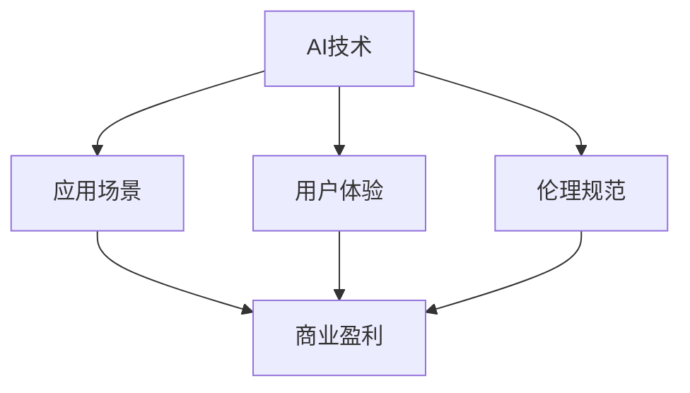

                 

# AI创业挑战：技术，应用与场景平衡

## 1. 背景介绍

### 1.1 问题由来

在人工智能(AI)的浪潮下，越来越多的AI创业公司涌现，致力于将AI技术应用到各个领域，创造商业价值。然而，AI创业并非易事，技术、应用与场景之间需要平衡，才能取得长期的商业成功。本文将深入探讨AI创业中的关键问题，从技术、应用与场景平衡的角度，为AI创业提供全面的指导。

### 1.2 问题核心关键点

AI创业的核心在于技术、应用与场景的平衡。以下是几个核心关键点：

- **技术基础**：构建强大的AI技术基础，是创业成功的前提。技术需要不断创新，以保持竞争力。
- **应用导向**：技术必须服务于实际应用，解决特定问题，创造用户价值。
- **场景匹配**：应用需适配特定场景，具备通用性和灵活性，以应对不同客户需求。
- **用户体验**：良好的用户体验是提升用户满意度和忠诚度的关键。
- **商业盈利**：实现商业盈利，确保公司的可持续发展。

本文将围绕这些核心点，深入分析AI创业中的技术、应用与场景平衡问题，探讨如何在商业实践中取得成功。

## 2. 核心概念与联系

### 2.1 核心概念概述

为更好地理解AI创业中的技术、应用与场景平衡，本节将介绍几个关键概念：

- **AI技术**：包括机器学习、深度学习、自然语言处理(NLP)、计算机视觉等技术领域，是AI创业的基础。
- **应用场景**：如智能客服、医疗诊断、金融分析、教育培训等，是AI技术应用的具体领域。
- **商业盈利**：包括广告收入、订阅服务、数据服务、软件即服务(SaaS)等多种商业模式。
- **用户体验**：包括易用性、可访问性、可理解性等方面，是用户对产品满意度的重要指标。
- **伦理规范**：包括数据隐私、算法透明性、偏见消除等，是AI创业必须遵守的道德规范。

这些概念之间的逻辑关系可以通过以下Mermaid流程图来展示：



这个流程图展示了AI技术、应用场景、商业盈利、用户体验和伦理规范之间的相互关系。

## 3. 核心算法原理 & 具体操作步骤
### 3.1 算法原理概述

AI创业中的技术、应用与场景平衡，涉及到机器学习、深度学习等多个技术领域。以下以机器学习为例，介绍其核心算法原理：

机器学习是一种通过数据训练模型，使其具备预测和决策能力的算法。其基本流程包括数据预处理、模型训练、模型评估和模型部署等步骤。

### 3.2 算法步骤详解

#### 3.2.1 数据预处理

数据预处理包括数据收集、清洗、特征提取和数据增强等步骤。具体步骤如下：

1. **数据收集**：从不同的数据源收集数据，如公开数据集、用户数据等。
2. **数据清洗**：去除噪声数据、处理缺失值等。
3. **特征提取**：选择或设计合适的特征，将原始数据转化为模型可用的形式。
4. **数据增强**：通过对数据进行变换，增加数据的多样性，提高模型的泛化能力。

#### 3.2.2 模型训练

模型训练是机器学习核心步骤，其基本流程如下：

1. **选择模型**：根据任务类型和数据特性，选择适合的模型，如线性回归、决策树、神经网络等。
2. **初始化模型参数**：随机初始化模型参数。
3. **前向传播**：将输入数据输入模型，得到模型输出。
4. **计算损失**：将模型输出与真实标签计算损失函数，如均方误差、交叉熵等。
5. **反向传播**：通过链式法则计算损失函数对模型参数的梯度。
6. **参数更新**：使用优化算法（如梯度下降、Adam等）更新模型参数。
7. **迭代训练**：重复上述步骤，直至模型收敛。

#### 3.2.3 模型评估

模型评估用于评估模型性能和泛化能力，其基本流程如下：

1. **划分数据集**：将数据集划分为训练集、验证集和测试集。
2. **计算指标**：使用测试集计算模型性能指标，如准确率、召回率、F1分数等。
3. **调参优化**：根据评估结果，调整模型参数，优化模型性能。

#### 3.2.4 模型部署

模型部署是将训练好的模型应用于实际场景的过程，其基本流程如下：

1. **选择部署平台**：根据应用需求，选择适合的部署平台，如云平台、边缘计算等。
2. **模型优化**：优化模型性能，如压缩模型大小、加速推理速度等。
3. **接口设计**：设计API接口，提供模型服务。
4. **监控和维护**：实时监控模型性能，及时修复问题。

### 3.3 算法优缺点

#### 3.3.1 优点

1. **高效性**：机器学习能够高效处理大规模数据，快速训练模型。
2. **泛化能力**：模型在训练集上表现优异，具有较强的泛化能力。
3. **灵活性**：模型可以根据具体任务进行调整，适应不同场景。

#### 3.3.2 缺点

1. **数据依赖**：机器学习高度依赖高质量的数据，数据质量差可能导致模型性能下降。
2. **模型复杂**：某些复杂模型需要大量的计算资源，部署和维护成本高。
3. **解释性差**：机器学习模型通常是"黑盒"模型，难以解释其内部决策过程。

### 3.4 算法应用领域

机器学习技术广泛应用于各个领域，如金融、医疗、教育、零售等。以下是几个典型的应用场景：

- **金融风控**：使用机器学习模型进行信用评分、欺诈检测等，提升金融风险控制能力。
- **医疗诊断**：使用机器学习模型进行影像分析、病历分析等，辅助医生进行诊断。
- **智能客服**：使用机器学习模型进行语音识别、情感分析等，提升客服系统的智能化水平。
- **推荐系统**：使用机器学习模型进行用户行为分析，推荐个性化产品或服务。

## 4. 数学模型和公式 & 详细讲解 & 举例说明
### 4.1 数学模型构建

以线性回归为例，其基本数学模型如下：

$$ y = \theta_0 + \theta_1 x_1 + \theta_2 x_2 + \ldots + \theta_n x_n $$

其中，$y$ 表示目标变量，$\theta_0, \theta_1, \ldots, \theta_n$ 表示模型参数，$x_1, x_2, \ldots, x_n$ 表示输入特征。

### 4.2 公式推导过程

#### 4.2.1 目标函数

目标函数是机器学习模型的核心，其形式如下：

$$ \min_{\theta} \frac{1}{2m} \sum_{i=1}^m (y_i - \theta^T x_i)^2 $$

其中，$m$ 表示样本数量，$y_i$ 表示第 $i$ 个样本的目标值，$x_i$ 表示第 $i$ 个样本的特征向量，$\theta^T$ 表示模型参数的转置。

#### 4.2.2 梯度下降算法

梯度下降算法用于求解目标函数的最小值，其基本步骤如下：

1. **初始化参数**：随机初始化模型参数 $\theta$。
2. **计算梯度**：计算目标函数对参数的梯度 $\nabla_{\theta} L(\theta)$。
3. **更新参数**：使用梯度下降公式更新模型参数 $\theta$。
4. **迭代训练**：重复上述步骤，直至收敛。

### 4.3 案例分析与讲解

以房价预测为例，其数据集和模型训练过程如下：

1. **数据收集**：从房地产网站收集历史房价数据。
2. **数据预处理**：去除噪声数据，提取房价、房屋面积、地理位置等特征。
3. **模型训练**：使用线性回归模型，训练模型参数 $\theta$。
4. **模型评估**：使用测试集计算模型性能指标，如均方误差。
5. **模型部署**：部署模型API，提供预测服务。

## 5. 项目实践：代码实例和详细解释说明
### 5.1 开发环境搭建

以下是使用Python进行机器学习项目开发的开发环境搭建流程：

1. **安装Python**：从官网下载并安装Python，配置环境变量。
2. **安装依赖库**：安装机器学习相关的Python库，如NumPy、SciPy、Scikit-Learn等。
3. **配置开发环境**：使用IDE或文本编辑器，配置项目目录和文件结构。

### 5.2 源代码详细实现

以下是使用Scikit-Learn进行线性回归模型训练的代码实现：

```python
from sklearn.linear_model import LinearRegression
from sklearn.model_selection import train_test_split
from sklearn.metrics import mean_squared_error
import pandas as pd

# 读取数据集
data = pd.read_csv('house_prices.csv')

# 数据预处理
X = data[['area', 'location']]
y = data['price']

# 划分数据集
X_train, X_test, y_train, y_test = train_test_split(X, y, test_size=0.2, random_state=42)

# 模型训练
model = LinearRegression()
model.fit(X_train, y_train)

# 模型评估
y_pred = model.predict(X_test)
mse = mean_squared_error(y_test, y_pred)

# 输出评估结果
print(f'均方误差: {mse:.2f}')
```

### 5.3 代码解读与分析

以下是关键代码的实现细节：

**数据预处理**：

- `data = pd.read_csv('house_prices.csv')`：读取CSV格式的数据集。
- `X = data[['area', 'location']]`：选择房价、房屋面积、地理位置等特征。
- `y = data['price']`：选择房价作为目标变量。

**模型训练**：

- `model = LinearRegression()`：实例化线性回归模型。
- `model.fit(X_train, y_train)`：训练模型。

**模型评估**：

- `y_pred = model.predict(X_test)`：预测测试集样本。
- `mse = mean_squared_error(y_test, y_pred)`：计算均方误差。

**输出评估结果**：

- `print(f'均方误差: {mse:.2f}')`：打印均方误差。

## 6. 实际应用场景
### 6.1 智能客服系统

智能客服系统是AI技术在客服领域的重要应用。通过机器学习模型，系统能够自动理解和回答客户问题，提升客服效率和用户体验。

在技术实现上，可以收集历史客服数据，使用机器学习模型训练自动回复系统。模型可以根据客户的提问，从知识库中匹配最合适的回答。对于复杂问题，系统可以自动转接人工客服，提供更专业的服务。

### 6.2 金融风险评估

金融领域面临巨大的风险，机器学习模型可以帮助金融机构进行风险评估和预测。

在实际应用中，可以收集历史交易数据，使用机器学习模型进行信用评分、欺诈检测等。模型可以分析客户行为特征，预测其违约概率或欺诈风险，为金融机构提供决策支持。

### 6.3 医疗影像诊断

医疗影像诊断是AI技术在医疗领域的重要应用。通过机器学习模型，系统能够自动分析和诊断医学影像，辅助医生进行诊断和治疗。

在实际应用中，可以收集大量医学影像数据，使用机器学习模型进行影像分析。模型可以自动识别和标记病变区域，提供辅助诊断建议。

### 6.4 推荐系统

推荐系统是AI技术在电商、娱乐等领域的经典应用。通过机器学习模型，系统可以分析用户行为数据，推荐个性化的产品或服务。

在实际应用中，可以收集用户浏览、购买、评价等行为数据，使用机器学习模型进行用户画像建模。模型可以分析用户偏好和需求，推荐相关产品或服务，提升用户满意度和转化率。

## 7. 工具和资源推荐
### 7.1 学习资源推荐

以下是几个优秀的学习资源，推荐阅读：

1. **《机器学习实战》**：详细介绍了机器学习的基本概念和算法实现，适合初学者入门。
2. **Coursera机器学习课程**：由斯坦福大学Andrew Ng教授主讲，系统讲解了机器学习的基本原理和应用。
3. **Kaggle**：提供大量公开数据集和比赛，是机器学习实践和竞赛的好平台。
4. **Google AI博客**：分享了Google AI团队在机器学习领域的最新研究和应用。

### 7.2 开发工具推荐

以下是几个常用的开发工具，推荐使用：

1. **Jupyter Notebook**：基于Web的交互式开发环境，适合编写和调试Python代码。
2. **PyCharm**：强大的IDE，支持机器学习、深度学习等开发。
3. **TensorFlow**：由Google开发的深度学习框架，适合构建复杂模型。
4. **Scikit-Learn**：基于NumPy的机器学习库，适合构建快速原型。

### 7.3 相关论文推荐

以下是几篇经典的机器学习论文，推荐阅读：

1. **《深度学习》**：Ian Goodfellow等著，系统介绍了深度学习的基本原理和应用。
2. **《机器学习》**：Tom Mitchell著，详细讲解了机器学习的基本理论和算法。
3. **《Pattern Recognition and Machine Learning》**：Christopher Bishop著，是机器学习领域的经典教材。
4. **《Neural Networks and Deep Learning》**：Michael Nielsen著，介绍了深度学习的基本概念和算法。

## 8. 总结：未来发展趋势与挑战
### 8.1 总结

本文对AI创业中的技术、应用与场景平衡进行了全面系统的探讨。首先阐述了AI创业的重要性，明确了技术、应用与场景平衡的核心点。其次，从原理到实践，详细讲解了机器学习的基本流程和算法原理，给出了完整的代码实现。同时，本文还广泛探讨了机器学习在智能客服、金融风控、医疗诊断、推荐系统等多个领域的应用前景，展示了其广阔的发展空间。最后，本文精选了机器学习的学习资源、开发工具和经典论文，力求为AI创业提供全方位的技术指引。

通过本文的系统梳理，可以看到，AI创业需要技术、应用与场景的深度结合，才能真正实现商业成功。机器学习提供了强大的技术基础，而如何将技术应用于实际场景，提升用户体验和商业盈利，是AI创业的关键所在。未来，伴随技术的不断进步和应用的不断拓展，机器学习必将在更多领域发挥重要作用，推动AI技术向更广阔的领域应用。

### 8.2 未来发展趋势

展望未来，机器学习的发展趋势如下：

1. **深度学习**：深度学习是机器学习的重要分支，未来将继续拓展应用场景，如自然语言处理、计算机视觉等。
2. **强化学习**：强化学习在机器人、游戏等领域的成功应用，将推动其在更多场景的应用。
3. **联邦学习**：联邦学习可以在保护数据隐私的前提下，实现分布式数据训练，提升机器学习模型的性能。
4. **可解释性**：机器学习的可解释性将是未来的研究重点，通过增强模型的透明性，提高用户的信任和接受度。
5. **自动化**：自动化机器学习(AutoML)将是未来的发展方向，通过自动化算法选择和调参，提升机器学习模型的开发效率。

### 8.3 面临的挑战

尽管机器学习已经取得了显著进展，但在实际应用中仍面临以下挑战：

1. **数据质量**：高质量的数据是机器学习模型的基础，但数据获取和预处理成本高，数据质量难以保证。
2. **模型复杂性**：深度学习模型参数量大，训练和推理复杂，需要强大的计算资源支持。
3. **可解释性**：机器学习模型通常是"黑盒"模型，难以解释其内部决策过程，影响用户信任。
4. **伦理规范**：数据隐私、算法透明性等伦理问题，需要制定相应的规范和标准。

### 8.4 研究展望

为了应对以上挑战，未来的研究需要在以下几个方面寻求新的突破：

1. **数据增强技术**：通过数据增强技术，提高数据的多样性和代表性，提升模型性能。
2. **模型压缩技术**：通过模型压缩技术，减小模型规模，提高计算效率和可部署性。
3. **可解释性研究**：通过可解释性研究，增强模型的透明性，提高用户信任。
4. **隐私保护技术**：通过隐私保护技术，保护用户数据隐私，提升数据安全。
5. **联邦学习研究**：通过联邦学习研究，实现分布式数据训练，提升模型性能和数据安全。

这些研究方向将为机器学习在AI创业中的应用提供新的思路和方法，推动AI技术向更广阔的领域应用。

## 9. 附录：常见问题与解答

**Q1: AI创业中的技术、应用与场景平衡如何实现？**

A: 实现技术、应用与场景的平衡需要以下几个步骤：
1. 理解用户需求，明确应用场景。
2. 选择合适的技术，构建技术基础。
3. 设计算法和模型，解决具体问题。
4. 测试和优化，提升用户体验。
5. 部署和维护，实现商业盈利。

**Q2: 机器学习模型的性能如何评估？**

A: 机器学习模型的性能可以通过以下指标进行评估：
1. 均方误差（MSE）：回归任务中的标准评估指标，表示预测值与真实值之间的平均误差。
2. 准确率（Accuracy）：分类任务中的标准评估指标，表示模型正确分类的样本比例。
3. F1分数（F1 Score）：同时考虑准确率和召回率的综合评估指标，适用于类别不平衡的情况。

**Q3: 机器学习在实际应用中需要注意哪些问题？**

A: 机器学习在实际应用中需要注意以下问题：
1. 数据质量：高质量的数据是模型性能的基础。
2. 模型复杂性：复杂模型需要更多的计算资源。
3. 可解释性：模型的透明性影响用户信任。
4. 伦理规范：数据隐私、算法透明性等伦理问题需要重视。
5. 数据隐私：保护用户数据隐私，提升数据安全。

通过不断优化和改进，机器学习可以在实际应用中取得更好的效果，实现技术、应用与场景的深度结合。

