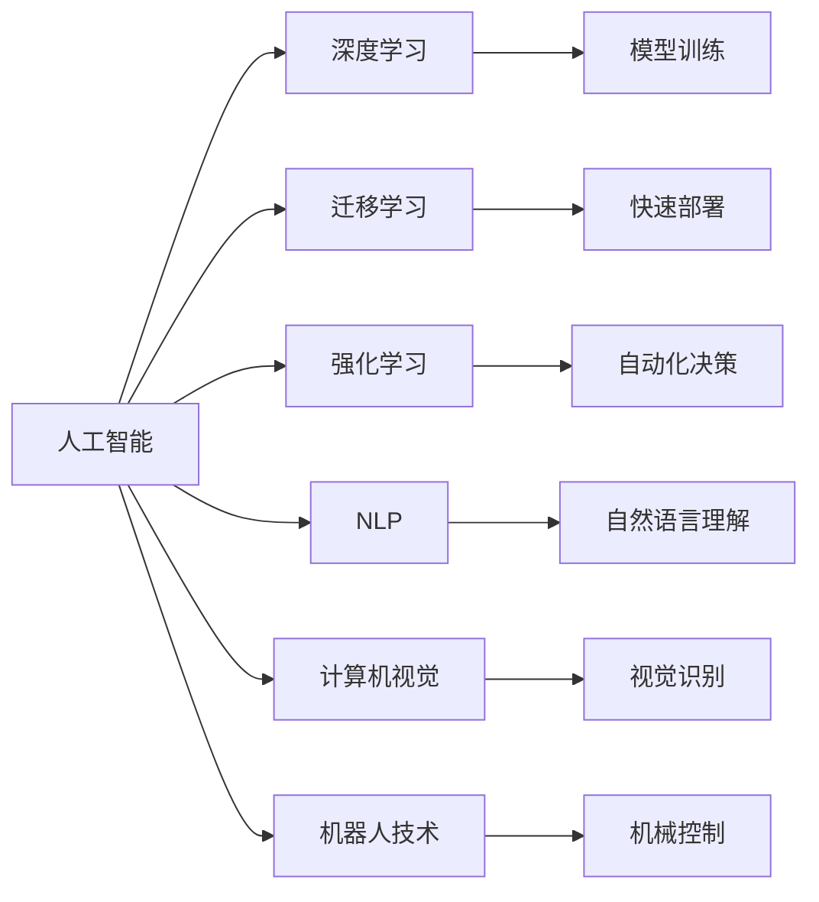

                 

# AI创业机遇：垂直领域无限可能

## 1. 背景介绍

### 1.1 问题由来

随着人工智能技术的不断进步，越来越多的创业者和企业开始将目光投向AI领域。AI不仅能带来颠覆性创新，也意味着巨大的商业机遇。然而，泛泛而谈的AI可能难以抓住真正的市场机会，如何将AI技术应用到具体业务场景中，成为企业创业的关键问题。

本文将聚焦于垂直领域的AI创业，探讨在医疗、金融、零售、制造等多个细分领域，如何结合行业知识，利用AI技术实现业务增值。通过对典型案例的深入分析，希望能为创业者提供实际可行的参考。

## 2. 核心概念与联系

### 2.1 核心概念概述

AI创业，即通过人工智能技术，结合行业知识，实现业务创新和增值的过程。与传统创业不同，AI创业的核心在于对数据和算法的依赖。AI创业的主要概念包括：

- **人工智能(AI)**：通过机器学习、深度学习等算法，模拟人类智能行为，实现信息处理、模式识别等任务。
- **深度学习(Deep Learning)**：一种基于神经网络的机器学习方法，通过多层非线性变换，实现复杂数据表示和预测。
- **迁移学习(Transfer Learning)**：通过将预训练模型的知识迁移到新任务上，快速提高模型的性能。
- **强化学习(Reinforcement Learning)**：通过与环境的交互，不断优化决策策略，实现自动化控制和决策。
- **自然语言处理(Natural Language Processing, NLP)**：让计算机能够理解和生成自然语言，应用场景广泛，如智能客服、语音识别等。
- **计算机视觉(Computer Vision)**：让计算机能够理解和处理视觉信息，应用场景包括自动驾驶、安防监控等。
- **机器人技术(Robotics)**：结合机械、电子、控制等技术，使机器人能够执行复杂任务，广泛应用于制造业、服务业等。

这些概念之间的联系可以通过以下Mermaid流程图来展示：



这个流程图展示了AI领域的各个分支和其间的联系：

1. 人工智能是核心，涵盖深度学习、迁移学习、强化学习等多个子领域。
2. 数据和算法是AI技术的两个关键要素，相辅相成。
3. NLP、计算机视觉、机器人技术等应用，都是基于AI技术实现的。
4. 模型训练、快速部署、自动化决策等过程，是AI应用的关键环节。
5. 自然语言理解和视觉识别等任务，是AI技术的重要应用方向。

通过理解这些核心概念，我们可以更好地把握AI技术的整体框架，为创业选择和应用提供指导。

## 3. 核心算法原理 & 具体操作步骤

### 3.1 算法原理概述

AI创业的关键在于选择合适的AI算法，并结合行业知识，解决具体业务问题。AI算法的选择通常基于以下考虑：

- **数据量和质量**：数据丰富的领域，如NLP、计算机视觉等，更适合使用深度学习方法。
- **任务性质**：预测、分类、回归等任务，适合使用深度学习；优化、搜索等任务，适合使用强化学习。
- **业务需求**：自动化控制、自动化决策、自然语言交互等任务，适合使用机器人技术和NLP技术。
- **计算资源**：高性能计算能力较强的领域，如自动驾驶、机器人技术等，适合使用复杂算法。

### 3.2 算法步骤详解

AI创业的核心步骤包括：

1. **数据收集与预处理**：从不同渠道收集数据，并进行清洗、标注、分割等预处理操作，形成可用于训练的数据集。
2. **模型选择与设计**：根据业务需求选择合适的AI算法，设计模型架构，并选择合适的超参数。
3. **模型训练与评估**：在标注数据集上训练模型，并使用验证集评估模型性能。根据评估结果调整模型超参数，进行多次迭代训练。
4. **模型部署与应用**：将训练好的模型部署到实际业务场景中，进行线上测试和优化。通过实际应用反馈，进一步优化模型。
5. **业务集成与优化**：将AI模型与现有业务系统集成，实现业务增值。结合业务需求，不断优化AI算法和数据处理流程。

### 3.3 算法优缺点

AI创业的优势在于：

- **高效性**：AI技术能够快速处理海量数据，实现自动化决策，提升业务效率。
- **灵活性**：AI算法能够根据业务需求灵活调整，实现个性化服务。
- **创新性**：AI技术能够探索新的业务模式，带来颠覆性创新。

同时，AI创业也面临以下挑战：

- **数据依赖**：AI创业需要高质量的数据支持，数据收集和标注成本较高。
- **技术门槛**：AI创业需要高水平的技术团队，对技术门槛较高。
- **伦理问题**：AI技术的广泛应用，可能带来隐私、公平等伦理问题。

## 4. 数学模型和公式 & 详细讲解

### 4.1 数学模型构建

以自然语言处理(NLP)领域的文本分类任务为例，我们可以构建如下的数学模型：

设文本 $x$ 包含 $n$ 个词，用 $\vec{x} \in \mathbb{R}^n$ 表示词向量，$y \in \{0, 1\}$ 表示分类标签。设 $\theta$ 为分类器的参数，则分类器的输出 $h_{\theta}(x)$ 可以表示为：

$$
h_{\theta}(x) = \sigma(\vec{w} \cdot \vec{x} + b)
$$

其中 $\sigma$ 为sigmoid函数，$\vec{w}$ 为分类器的权重向量，$b$ 为偏置项。分类器的预测结果 $\hat{y}$ 为：

$$
\hat{y} = \begin{cases}
1, & \text{if } h_{\theta}(x) > 0.5 \\
0, & \text{otherwise}
\end{cases}
$$

### 4.2 公式推导过程

在训练过程中，我们使用交叉熵损失函数对模型进行优化：

$$
\mathcal{L}(\theta) = -y \log h_{\theta}(x) - (1-y) \log (1-h_{\theta}(x))
$$

模型的参数更新规则为：

$$
\theta = \theta - \eta \nabla_{\theta} \mathcal{L}(\theta)
$$

其中 $\eta$ 为学习率，$\nabla_{\theta} \mathcal{L}(\theta)$ 为损失函数对参数 $\theta$ 的梯度。

### 4.3 案例分析与讲解

以智能客服系统为例，我们可以将客户咨询内容作为输入，使用LSTM等深度学习模型进行文本分类，预测客户咨询的意图和情感。训练过程中，我们可以使用交叉熵损失函数，并通过梯度下降算法不断调整模型参数，以最小化损失函数。模型训练完成后，可以将新的客户咨询输入模型，得到意图和情感的分类结果，从而实现自动化的客户服务。

## 5. 项目实践：代码实例和详细解释说明

### 5.1 开发环境搭建

要搭建AI创业项目，首先需要安装必要的Python开发环境。以下是在Linux系统上安装Python和必要的Python库的详细步骤：

1. 安装Python：
```bash
sudo apt-get update
sudo apt-get install python3.8
```

2. 安装必要的Python库：
```bash
pip install numpy pandas sklearn scikit-learn tensorflow keras transformers
```

3. 安装深度学习框架：
```bash
pip install torch torchvision torchaudio cudatoolkit -c https://docs.nvidia.com/cuda/archive/11.1.105/ubuntu11.04_usgalinux.cudatoolkit_11.1.105-1_amd64.deb
```

4. 安装TensorFlow：
```bash
pip install tensorflow==2.4
```

5. 安装Transformer库：
```bash
pip install transformers
```

### 5.2 源代码详细实现

以下是一个简单的文本分类示例，使用Keras实现基于深度学习的文本分类模型：

```python
from tensorflow.keras.models import Sequential
from tensorflow.keras.layers import Dense, LSTM, Embedding
from tensorflow.keras.preprocessing.text import Tokenizer
from tensorflow.keras.preprocessing.sequence import pad_sequences
import numpy as np

# 定义模型
model = Sequential()
model.add(Embedding(input_dim=10000, output_dim=128))
model.add(LSTM(units=64))
model.add(Dense(units=1, activation='sigmoid'))

# 编译模型
model.compile(loss='binary_crossentropy', optimizer='adam', metrics=['accuracy'])

# 数据预处理
tokenizer = Tokenizer(num_words=10000, oov_token='<OOV>')
tokenizer.fit_on_texts(texts)
sequences = tokenizer.texts_to_sequences(texts)
padded_sequences = pad_sequences(sequences, padding='post', maxlen=200)

# 训练模型
model.fit(padded_sequences, labels, epochs=10, batch_size=32)

# 测试模型
test_sequences = tokenizer.texts_to_sequences(test_texts)
padded_test_sequences = pad_sequences(test_sequences, padding='post', maxlen=200)
predictions = model.predict(padded_test_sequences)
```

### 5.3 代码解读与分析

这段代码实现了基于深度学习的文本分类模型。首先定义了模型结构，包括嵌入层、LSTM层和全连接层。然后使用编译器指定了损失函数、优化器和评估指标。接下来进行数据预处理，将文本转换为词向量，并进行填充。最后进行模型训练和测试，得到分类结果。

## 6. 实际应用场景

### 6.1 医疗影像诊断

AI技术在医疗领域的应用前景广阔。例如，使用深度学习算法对医疗影像进行分类和分析，可以快速、准确地辅助医生诊断疾病。

以肺癌筛查为例，我们可以使用卷积神经网络(CNN)对医学影像进行分类。训练过程中，使用交叉熵损失函数，并使用梯度下降算法优化模型参数。模型训练完成后，可以对新的医学影像进行分类，辅助医生诊断肺癌。

### 6.2 金融风险管理

金融领域对数据处理和决策分析的需求极高。使用AI技术可以对金融市场数据进行分析和预测，有效管理金融风险。

例如，使用深度学习算法对股票价格进行预测，可以在金融市场波动时进行风险预警。训练过程中，使用均方误差损失函数，并使用梯度下降算法优化模型参数。模型训练完成后，可以对新的股票价格进行预测，及时调整投资策略。

### 6.3 零售个性化推荐

零售行业对个性化推荐的需求极高。使用AI技术可以对用户行为数据进行分析，实现个性化推荐。

例如，使用协同过滤算法对用户的历史行为数据进行分析，对新产品进行推荐。训练过程中，使用均方误差损失函数，并使用梯度下降算法优化模型参数。模型训练完成后，可以对用户进行个性化推荐，提升用户体验和销售业绩。

### 6.4 未来应用展望

未来，AI技术将在更多领域得到应用。例如：

- **智能制造**：使用AI技术对生产设备进行监测和维护，提升生产效率和产品质量。
- **智慧农业**：使用AI技术对农田进行监测和管理，提高农业生产效率和可持续性。
- **自动驾驶**：使用AI技术实现无人驾驶车辆的控制和决策，推动自动驾驶技术的发展。
- **智能家居**：使用AI技术对家庭环境进行智能控制，提升居住体验和安全性。

## 7. 工具和资源推荐

### 7.1 学习资源推荐

为了帮助创业者掌握AI技术，推荐以下学习资源：

- **Coursera**：提供多门深度学习、机器学习等课程，涵盖理论基础和实际应用。
- **Udacity**：提供深度学习、计算机视觉等专业课程，注重实践和项目应用。
- **Fast.ai**：提供深度学习实践课程，重点关注实际应用和项目开发。
- **Kaggle**：提供数据科学竞赛平台，提供丰富的数据集和模型库，适合学习和实践。

### 7.2 开发工具推荐

以下是几款常用的AI开发工具：

- **TensorFlow**：由Google开发的深度学习框架，支持分布式计算和模型部署。
- **PyTorch**：由Facebook开发的深度学习框架，支持动态图和模型训练。
- **Keras**：基于TensorFlow和Theano的深度学习框架，易于使用和扩展。
- **Jupyter Notebook**：支持Python代码的交互式开发和展示，适合数据分析和模型开发。
- **GitHub**：提供代码托管和协作平台，方便开发者进行项目管理和版本控制。

### 7.3 相关论文推荐

以下是几篇经典的AI相关论文，推荐阅读：

- **AlphaGo**：Google DeepMind开发的围棋算法，展示了深度学习的强大能力。
- **BERT**：Google开发的预训练语言模型，在自然语言处理领域取得了突破性进展。
- **GANs**：由Ian Goodfellow提出的生成对抗网络，实现了高质量的图像生成和风格转换。
- **Transformers**：由Google开发的自然语言处理模型，在多个NLP任务上取得了领先效果。

## 8. 总结：未来发展趋势与挑战

### 8.1 研究成果总结

本文从背景介绍、核心概念与联系、核心算法原理与具体操作步骤、数学模型和公式详细讲解、项目实践与详细解释说明、实际应用场景、工具和资源推荐、总结与展望等方面，详细介绍了AI创业的理论和实践。通过对这些内容的系统梳理，可以为创业者提供全面的技术指引，帮助其在垂直领域实现AI创业。

### 8.2 未来发展趋势

未来，AI技术将在更多领域得到应用，呈现以下几个趋势：

1. **数据驱动的决策**：AI技术将广泛应用于数据分析和决策，帮助企业实现精准管理。
2. **自动化控制**：AI技术将实现自动化控制和决策，提高生产效率和产品质量。
3. **个性化服务**：AI技术将实现个性化推荐和服务，提升用户体验和满意度。
4. **跨领域融合**：AI技术将与其他技术进行深度融合，推动技术和业务的发展。
5. **智能助手**：AI技术将实现智能助手，提升人机交互的智能化水平。

### 8.3 面临的挑战

尽管AI技术在多个领域取得了显著成果，但仍面临以下挑战：

1. **数据依赖**：AI技术需要高质量的数据支持，数据收集和标注成本较高。
2. **技术门槛**：AI技术需要高水平的技术团队，对技术门槛较高。
3. **伦理问题**：AI技术的广泛应用，可能带来隐私、公平等伦理问题。
4. **资源消耗**：AI技术需要高性能计算资源，对硬件要求较高。
5. **安全问题**：AI技术的广泛应用，可能带来安全问题，如数据泄露、模型误用等。

### 8.4 研究展望

未来，AI技术将在多个领域得到广泛应用。例如：

1. **智能制造**：使用AI技术对生产设备进行监测和维护，提升生产效率和产品质量。
2. **智慧农业**：使用AI技术对农田进行监测和管理，提高农业生产效率和可持续性。
3. **自动驾驶**：使用AI技术实现无人驾驶车辆的控制和决策，推动自动驾驶技术的发展。
4. **智能家居**：使用AI技术对家庭环境进行智能控制，提升居住体验和安全性。
5. **医疗健康**：使用AI技术对医疗影像进行分类和分析，辅助医生诊断疾病。

## 9. 附录：常见问题与解答

### Q1：AI创业需要哪些关键资源？

A: AI创业需要以下关键资源：
1. **数据资源**：高质量的数据是AI创业的基础，需要构建或获取大量行业数据。
2. **技术资源**：AI创业需要高水平的技术团队，具备深度学习和算法优化等能力。
3. **计算资源**：AI创业需要高性能计算资源，支持大规模模型训练和推理。
4. **业务资源**：AI创业需要熟悉行业业务的专业人才，理解业务需求和挑战。
5. **市场资源**：AI创业需要强大的市场团队，进行产品推广和用户教育。

### Q2：AI创业有哪些典型应用场景？

A: AI创业在多个领域有典型的应用场景，例如：
1. **智能制造**：使用AI技术对生产设备进行监测和维护，提升生产效率和产品质量。
2. **智慧农业**：使用AI技术对农田进行监测和管理，提高农业生产效率和可持续性。
3. **自动驾驶**：使用AI技术实现无人驾驶车辆的控制和决策，推动自动驾驶技术的发展。
4. **智能家居**：使用AI技术对家庭环境进行智能控制，提升居住体验和安全性。
5. **医疗健康**：使用AI技术对医疗影像进行分类和分析，辅助医生诊断疾病。

### Q3：AI创业有哪些成功的案例？

A: 以下是几个成功的AI创业案例：
1. **TensorFlow**：由Google开发的深度学习框架，广泛应用于学术研究和工业应用。
2. **Kaggle**：提供数据科学竞赛平台，吸引全球数据科学家参与。
3. **Coursera**：提供在线课程平台，涵盖深度学习、机器学习等课程。
4. **AlphaGo**：Google DeepMind开发的围棋算法，展示了深度学习的强大能力。
5. **BERT**：Google开发的预训练语言模型，在自然语言处理领域取得了突破性进展。

### Q4：AI创业有哪些典型的工具和资源？

A: AI创业的典型工具和资源包括：
1. **TensorFlow**：由Google开发的深度学习框架，支持分布式计算和模型部署。
2. **PyTorch**：由Facebook开发的深度学习框架，支持动态图和模型训练。
3. **Keras**：基于TensorFlow和Theano的深度学习框架，易于使用和扩展。
4. **Jupyter Notebook**：支持Python代码的交互式开发和展示，适合数据分析和模型开发。
5. **GitHub**：提供代码托管和协作平台，方便开发者进行项目管理和版本控制。

### Q5：AI创业有哪些潜在风险？

A: AI创业的潜在风险包括：
1. **数据依赖**：AI创业需要高质量的数据支持，数据收集和标注成本较高。
2. **技术门槛**：AI创业需要高水平的技术团队，对技术门槛较高。
3. **伦理问题**：AI技术的广泛应用，可能带来隐私、公平等伦理问题。
4. **资源消耗**：AI创业需要高性能计算资源，对硬件要求较高。
5. **安全问题**：AI技术的广泛应用，可能带来安全问题，如数据泄露、模型误用等。

### Q6：AI创业需要哪些法律和道德考虑？

A: AI创业需要考虑以下法律和道德问题：
1. **隐私保护**：AI创业需要保护用户隐私，避免数据泄露。
2. **公平性**：AI创业需要保证模型公平，避免偏见和歧视。
3. **安全性**：AI创业需要保证系统安全，避免模型误用和攻击。
4. **透明性**：AI创业需要保证模型透明，便于解释和监管。
5. **合规性**：AI创业需要遵守相关法律法规，如数据隐私保护法、反垄断法等。

### Q7：AI创业有哪些商业化策略？

A: AI创业的商业化策略包括：
1. **产品化**：将AI技术产品化，形成完整的解决方案，满足用户需求。
2. **服务化**：提供AI技术服务，如API接口、数据分析等，提升用户体验。
3. **平台化**：构建AI技术平台，支持开发者和企业使用，实现资源共享。
4. **联盟化**：与其他企业和技术合作，形成战略联盟，提升市场竞争力。
5. **市场化**：通过市场营销和推广，提升品牌知名度和市场份额。

### Q8：AI创业有哪些常见的业务模式？

A: AI创业的常见业务模式包括：
1. **SaaS**：提供软件即服务，通过云计算平台提供AI解决方案。
2. **PaaS**：提供平台即服务，提供开发工具和平台支持。
3. **BaaS**：提供基础即服务，提供基础设施和资源支持。
4. **SMB**：面向中小企业，提供定制化解决方案。
5. **B2B**：面向企业客户，提供集成服务和解决方案。

### Q9：AI创业有哪些重要的成功因素？

A: AI创业的成功因素包括：
1. **技术创新**：持续进行技术创新，保持领先地位。
2. **商业模式**：选择合适的商业模式，满足市场需求。
3. **团队建设**：组建高效的团队，具备技术、业务和市场等多方面能力。
4. **市场推广**：进行有效的市场推广和用户教育。
5. **持续优化**：不断优化产品和服务，提升用户体验和满意度。

### Q10：AI创业有哪些失败案例？

A: AI创业的失败案例包括：
1. **数据质量差**：数据质量问题导致模型性能不佳，用户体验差。
2. **技术壁垒低**：技术壁垒低，容易被竞争对手超越。
3. **市场推广不足**：市场推广不足，用户认知度低。
4. **产品功能单一**：产品功能单一，无法满足用户需求。
5. **融资困难**：融资困难，资金链断裂。

总之，AI创业需要多方协同，结合技术、市场、业务等多方面资源，才能在垂直领域实现商业成功。

