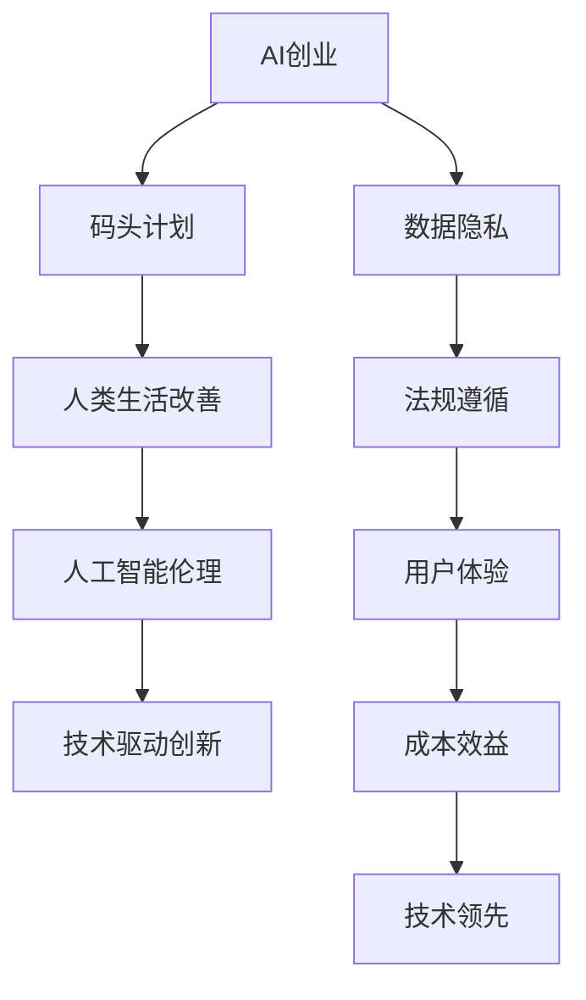

                 

# AI创业者的码头愿景：改善人类生活

> 关键词：AI创业, 码头计划, 人类生活改善, 人工智能伦理, 技术驱动创新

## 1. 背景介绍

### 1.1 问题由来
随着人工智能(AI)技术的迅猛发展，AI创业者们开始聚焦于如何利用AI改善人类生活。AI的潜力是巨大的，从医疗到教育，从农业到金融，每一个领域都有AI技术的身影。然而，在带来便利的同时，AI也带来了不少伦理和隐私问题，需要更多的规范和监管。因此，AI创业者不仅需要掌握先进的AI技术，还需要有道德和法律的意识，确保AI技术的健康发展。

### 1.2 问题核心关键点
AI创业者在改善人类生活的过程中，需要考虑以下几个核心关键点：

1. **技术领先性**：保持技术领先，提升AI系统的性能和效率。
2. **数据隐私和伦理**：保护用户数据隐私，避免数据滥用。
3. **社会影响**：评估AI系统对社会的长期影响，确保其正向影响。
4. **法规遵循**：遵循相关法律法规，确保AI技术的合法合规。
5. **用户体验**：提升用户体验，确保AI系统的易用性和接受度。
6. **成本效益**：平衡技术开发和应用成本，实现高效益。

## 2. 核心概念与联系

### 2.1 核心概念概述

为更好地理解AI创业者在改善人类生活方面的愿景，本节将介绍几个密切相关的核心概念：

- **AI创业**：指的是利用AI技术进行创业，旨在解决实际问题，提升人类生活质量。
- **码头计划**：借鉴海港码头的运作模式，比喻AI创业者应像港口的管理者一样，通过整合各种资源，确保AI技术落地应用的效果最大化。
- **人类生活改善**：指的是AI技术在医疗、教育、交通、金融等领域的实际应用，提升人类生活品质。
- **人工智能伦理**：涉及AI技术的开发、使用和影响，包括隐私保护、数据安全、责任归属等方面。
- **技术驱动创新**：指的是通过技术创新，推动各行各业的发展，提升效率和生产力。

这些核心概念之间的逻辑关系可以通过以下Mermaid流程图来展示：



这个流程图展示了一个从AI创业到改善人类生活，再到伦理和技术驱动创新的全链条关系：

1. AI创业者通过码头的整合管理，确保AI技术的实际应用效果。
2. AI技术的应用直接改善人类生活，提高生活质量。
3. 伦理保障数据隐私和法规遵循，确保AI系统的合法合规。
4. 用户体验和技术领先性，提升AI系统的易用性和性能。
5. 成本效益分析，平衡技术开发和应用的经济性。

## 3. 核心算法原理 & 具体操作步骤
### 3.1 算法原理概述

AI创业者在改善人类生活的过程中，需要利用各种AI算法和技术，进行数据处理、模型训练、系统部署等操作。以下是一些核心的算法原理：

- **机器学习**：通过训练数据集，让AI模型能够自动识别和预测数据。
- **深度学习**：使用神经网络模型，模拟人类大脑的神经元结构，进行图像、语音、文本等数据的处理。
- **自然语言处理(NLP)**：通过算法，让机器能够理解和处理人类语言，提升人机交互体验。
- **计算机视觉**：使用算法，让机器能够识别和理解图像、视频等内容。
- **强化学习**：通过奖励和惩罚机制，让AI模型通过不断尝试，优化决策过程。

### 3.2 算法步骤详解

以下是AI创业者在改善人类生活过程中，常见的算法步骤：

**Step 1: 数据收集与预处理**
- 收集相关的数据集，如医疗数据、教育数据、交通数据等。
- 对数据进行清洗、归一化、标注等预处理，确保数据的质量。

**Step 2: 模型选择与训练**
- 选择合适的算法模型，如卷积神经网络(CNN)、循环神经网络(RNN)、Transformer等。
- 使用训练集进行模型训练，通过优化算法调整模型参数，提升模型性能。

**Step 3: 模型评估与优化**
- 使用验证集对模型进行评估，选择最优模型。
- 在实际应用中，持续监控模型性能，不断优化模型参数。

**Step 4: 系统部署与迭代**
- 将训练好的模型部署到实际应用场景中。
- 根据用户反馈和实际效果，进行迭代优化，提升系统性能。

### 3.3 算法优缺点

AI创业者在改善人类生活时，常见的算法有以下优缺点：

**优点**：
- 自动化程度高，能够高效处理大量数据。
- 具备较强的泛化能力，适用于多种场景。
- 能够提供深度见解，提升决策质量。

**缺点**：
- 数据质量要求高，数据获取成本大。
- 模型复杂度高，计算资源消耗大。
- 模型可能存在偏见，需要持续监控和调整。

### 3.4 算法应用领域

AI创业者在改善人类生活时，常见的算法应用领域包括：

- **医疗**：利用AI技术进行疾病预测、影像诊断、药物研发等，提高医疗服务质量。
- **教育**：使用AI技术进行个性化教育、智能辅导、学习路径推荐等，提升教育效果。
- **交通**：通过AI技术进行交通流量分析、自动驾驶、智能调度等，提升交通效率。
- **金融**：利用AI技术进行风险评估、智能投顾、反欺诈检测等，提升金融服务水平。
- **农业**：通过AI技术进行农作物识别、病虫害预测、土壤监测等，提升农业生产效率。
- **环境**：使用AI技术进行污染监测、气候预测、资源管理等，保护生态环境。

## 4. 数学模型和公式 & 详细讲解 & 举例说明

### 4.1 数学模型构建

在本节中，我们将使用数学语言对AI创业者在改善人类生活方面的算法进行更加严格的刻画。

假设AI创业者使用深度学习算法，模型为 $M_{\theta}$，其中 $\theta$ 为模型参数。训练集为 $D=\{(x_i,y_i)\}_{i=1}^N, x_i \in \mathcal{X}, y_i \in \mathcal{Y}$，其中 $\mathcal{X}$ 为输入空间，$\mathcal{Y}$ 为输出空间。

定义模型 $M_{\theta}$ 在输入 $x$ 上的损失函数为 $\ell(M_{\theta}(x),y)$，则在数据集 $D$ 上的经验风险为：

$$
\mathcal{L}(\theta) = \frac{1}{N} \sum_{i=1}^N \ell(M_{\theta}(x_i),y_i)
$$

微调的优化目标是最小化经验风险，即找到最优参数：

$$
\theta^* = \mathop{\arg\min}_{\theta} \mathcal{L}(\theta)
$$

在实践中，我们通常使用基于梯度的优化算法（如SGD、Adam等）来近似求解上述最优化问题。设 $\eta$ 为学习率，则参数的更新公式为：

$$
\theta \leftarrow \theta - \eta \nabla_{\theta}\mathcal{L}(\theta)
$$

其中 $\nabla_{\theta}\mathcal{L}(\theta)$ 为损失函数对参数 $\theta$ 的梯度，可通过反向传播算法高效计算。

### 4.2 公式推导过程

以下我们以图像分类任务为例，推导交叉熵损失函数及其梯度的计算公式。

假设模型 $M_{\theta}$ 在输入 $x$ 上的输出为 $\hat{y}=M_{\theta}(x) \in [0,1]$，表示样本属于某个类别的概率。真实标签 $y \in \{0,1\}$。则二分类交叉熵损失函数定义为：

$$
\ell(M_{\theta}(x),y) = -[y\log \hat{y} + (1-y)\log (1-\hat{y})]
$$

将其代入经验风险公式，得：

$$
\mathcal{L}(\theta) = -\frac{1}{N}\sum_{i=1}^N [y_i\log M_{\theta}(x_i)+(1-y_i)\log(1-M_{\theta}(x_i))]
$$

根据链式法则，损失函数对参数 $\theta_k$ 的梯度为：

$$
\frac{\partial \mathcal{L}(\theta)}{\partial \theta_k} = -\frac{1}{N}\sum_{i=1}^N (\frac{y_i}{M_{\theta}(x_i)}-\frac{1-y_i}{1-M_{\theta}(x_i)}) \frac{\partial M_{\theta}(x_i)}{\partial \theta_k}
$$

其中 $\frac{\partial M_{\theta}(x_i)}{\partial \theta_k}$ 可进一步递归展开，利用自动微分技术完成计算。

## 5. 项目实践：代码实例和详细解释说明
### 5.1 开发环境搭建

在进行AI创业者改善人类生活的实践前，我们需要准备好开发环境。以下是使用Python进行PyTorch开发的环境配置流程：

1. 安装Anaconda：从官网下载并安装Anaconda，用于创建独立的Python环境。

2. 创建并激活虚拟环境：
```bash
conda create -n pytorch-env python=3.8 
conda activate pytorch-env
```

3. 安装PyTorch：根据CUDA版本，从官网获取对应的安装命令。例如：
```bash
conda install pytorch torchvision torchaudio cudatoolkit=11.1 -c pytorch -c conda-forge
```

4. 安装TensorFlow：
```bash
pip install tensorflow
```

5. 安装各类工具包：
```bash
pip install numpy pandas scikit-learn matplotlib tqdm jupyter notebook ipython
```

完成上述步骤后，即可在`pytorch-env`环境中开始AI创业者改善人类生活的实践。

### 5.2 源代码详细实现

下面我们以医疗影像分类为例，给出使用PyTorch对深度学习模型进行医疗影像分类的PyTorch代码实现。

首先，定义数据处理函数：

```python
import torch
from torchvision import transforms, datasets

# 定义数据预处理
transform = transforms.Compose([
    transforms.Resize((256, 256)),
    transforms.ToTensor(),
    transforms.Normalize(mean=[0.485, 0.456, 0.406], std=[0.229, 0.224, 0.225])
])

# 加载医疗影像数据集
train_dataset = datasets.ImageFolder(root='train_folder', transform=transform)
test_dataset = datasets.ImageFolder(root='test_folder', transform=transform)
```

然后，定义模型和优化器：

```python
from torchvision import models

# 使用预训练的ResNet模型
model = models.resnet50(pretrained=True)

# 冻结预训练模型的权重
for param in model.parameters():
    param.requires_grad = False

# 定义新的分类器
classifier = torch.nn.Sequential(
    torch.nn.Linear(2048, 512),
    torch.nn.ReLU(),
    torch.nn.Dropout(0.5),
    torch.nn.Linear(512, 2),
    torch.nn.Softmax(dim=1)
)

# 连接新分类器到ResNet模型
model.fc = classifier

# 定义优化器
optimizer = torch.optim.Adam(model.fc.parameters(), lr=0.001)
```

接着，定义训练和评估函数：

```python
from torch.utils.data import DataLoader
from tqdm import tqdm

# 定义训练函数
def train_epoch(model, train_loader, optimizer):
    model.train()
    loss_total = 0.0
    correct_total = 0
    with tqdm(train_loader, desc='Training') as tbar:
        for batch in tbar:
            inputs, labels = batch
            inputs, labels = inputs.to(device), labels.to(device)
            optimizer.zero_grad()
            outputs = model(inputs)
            loss = criterion(outputs, labels)
            loss.backward()
            optimizer.step()
            tbar.set_postfix(loss=loss.item())
            tbar.update()
    return loss_total / len(train_loader)

# 定义评估函数
def evaluate(model, test_loader):
    model.eval()
    loss_total = 0.0
    correct_total = 0
    with tqdm(test_loader, desc='Evaluating') as tbar:
        with torch.no_grad():
            for batch in tbar:
                inputs, labels = batch
                inputs, labels = inputs.to(device), labels.to(device)
                outputs = model(inputs)
                loss = criterion(outputs, labels)
                tbar.set_postfix(loss=loss.item())
                tbar.update()
    return loss_total / len(test_loader), correct_total / len(test_loader)

# 定义损失函数
criterion = torch.nn.CrossEntropyLoss()

# 定义训练轮数
epochs = 10
batch_size = 32

# 训练模型
device = torch.device('cuda' if torch.cuda.is_available() else 'cpu')
model.to(device)

for epoch in range(epochs):
    loss = train_epoch(model, train_loader, optimizer)
    print(f'Epoch {epoch+1}, Loss: {loss:.4f}')
    
    loss, acc = evaluate(model, test_loader)
    print(f'Epoch {epoch+1}, Test Loss: {loss:.4f}, Test Acc: {acc:.4f}')
```

以上就是使用PyTorch对深度学习模型进行医疗影像分类的完整代码实现。可以看到，借助PyTorch和TensorFlow等框架，AI创业者可以轻松地构建和训练深度学习模型，提升医疗影像分类的准确性和效率。

### 5.3 代码解读与分析

让我们再详细解读一下关键代码的实现细节：

**数据预处理**：
- 定义了数据预处理函数，包括图像大小归一化、数据标准化等操作。

**模型选择与训练**：
- 使用预训练的ResNet模型，并连接新定义的分类器。
- 冻结预训练模型的权重，避免过拟合。
- 定义新的分类器，包括全连接层、ReLU激活函数、Dropout和Softmax函数。
- 使用Adam优化器，设置学习率。

**模型评估与优化**：
- 定义训练和评估函数，使用DataLoader进行数据批次处理。
- 在每个批次上进行前向传播、计算损失、反向传播和参数更新。
- 在验证集上进行评估，输出平均损失和准确率。

**训练流程**：
- 定义训练轮数和批次大小，开始循环迭代。
- 在每个epoch内，先进行训练，输出平均损失。
- 在验证集上评估，输出平均损失和准确率。
- 所有epoch结束后，在测试集上评估，输出平均损失和准确率。

可以看到，PyTorch和TensorFlow等框架提供了强大的工具支持，使得AI创业者能够快速搭建和优化深度学习模型，提升AI系统的性能。

## 6. 实际应用场景
### 6.1 智能医疗系统

智能医疗系统通过AI技术，可以大幅度提升医疗服务的效率和质量。AI创业者可以利用AI技术改善人类生活，例如：

- **疾病预测**：通过分析患者的历史数据，预测潜在的健康风险，提前进行预防和干预。
- **影像诊断**：利用深度学习模型对医疗影像进行自动分析，提升诊断准确性。
- **药物研发**：通过AI技术加速药物筛选和试验，缩短新药上市时间。

在技术实现上，可以收集患者的医疗记录、基因数据、生活习惯等数据，构建医疗数据集，在此基础上进行深度学习模型的训练和微调。微调后的模型能够自动识别和预测疾病风险，提供个性化的诊疗方案。

### 6.2 教育个性化推荐系统

教育个性化推荐系统通过AI技术，可以提升教育的个性化和因材施教的效果。AI创业者可以利用AI技术改善人类生活，例如：

- **学习路径推荐**：通过分析学生的学习行为和成绩，推荐适合的学习路径和课程。
- **智能辅导**：利用AI技术进行实时答疑，提升学生的学习效果。
- **学习效果评估**：通过分析学生的学习数据，评估学习效果并进行针对性辅导。

在技术实现上，可以收集学生的学习数据、行为数据等，构建教育数据集，在此基础上进行深度学习模型的训练和微调。微调后的模型能够根据学生的学习情况，提供个性化的学习建议和辅导，提升学习效果。

### 6.3 智能交通系统

智能交通系统通过AI技术，可以提高交通效率和安全性。AI创业者可以利用AI技术改善人类生活，例如：

- **交通流量预测**：通过分析交通数据，预测交通流量，优化交通信号灯控制。
- **自动驾驶**：利用深度学习模型进行自动驾驶，提升驾驶安全性。
- **智能调度**：通过AI技术进行公共交通车辆调度，提升运输效率。

在技术实现上，可以收集交通数据、车辆位置、天气数据等，构建交通数据集，在此基础上进行深度学习模型的训练和微调。微调后的模型能够实时预测交通流量，优化交通信号灯控制，提升交通效率。

## 7. 工具和资源推荐
### 7.1 学习资源推荐

为了帮助AI创业者系统掌握AI改善人类生活的理论基础和实践技巧，这里推荐一些优质的学习资源：

1. **《深度学习》课程**：斯坦福大学开设的深度学习课程，涵盖深度学习的基本概念和算法。
2. **《TensorFlow官方文档》**：TensorFlow的官方文档，提供丰富的API和样例代码，方便开发者学习和实践。
3. **《PyTorch官方文档》**：PyTorch的官方文档，提供详细的API和样例代码，适合深度学习模型的构建和优化。
4. **Kaggle**：全球最大的数据科学竞赛平台，提供丰富的数据集和竞赛机会，适合学习和实践深度学习。
5. **AI创业加速营**：提供AI创业相关的课程和资源，涵盖AI创业的基础知识、技术实现、商业模型等。

通过对这些资源的学习实践，相信你一定能够快速掌握AI改善人类生活的精髓，并用于解决实际的AI创业问题。

### 7.2 开发工具推荐

高效的开发离不开优秀的工具支持。以下是几款用于AI创业者改善人类生活的常用工具：

1. **Jupyter Notebook**：Python的交互式编程环境，方便进行代码实验和数据分析。
2. **Google Colab**：谷歌提供的免费Jupyter Notebook环境，支持GPU/TPU算力，方便进行大规模深度学习实验。
3. **TensorBoard**：TensorFlow配套的可视化工具，实时监测模型训练状态，提供丰富的图表呈现方式。
4. **Weights & Biases**：模型训练的实验跟踪工具，记录和可视化模型训练过程中的各项指标，方便对比和调优。
5. **PyTorch Lightning**：PyTorch的快速实验框架，提供简单易用的接口，方便进行模型构建和训练。

合理利用这些工具，可以显著提升AI创业者改善人类生活的开发效率，加快创新迭代的步伐。

### 7.3 相关论文推荐

AI创业者在改善人类生活的过程中，可以参考以下几篇奠基性的相关论文：

1. **《深度学习》**：Ian Goodfellow等著，全面介绍了深度学习的基本概念、算法和应用。
2. **《机器学习实战》**：Peter Harrington著，详细讲解了机器学习的实现方法和案例。
3. **《强化学习》**：Richard S. Sutton等著，介绍了强化学习的原理、算法和应用。
4. **《计算机视觉：算法与应用》**：Ramin Zabih等著，涵盖了计算机视觉的基本概念、算法和应用。
5. **《自然语言处理综论》**：Daniel Jurafsky等著，介绍了自然语言处理的基本概念、算法和应用。

这些论文代表了大语言模型微调技术的发展脉络。通过学习这些前沿成果，可以帮助AI创业者把握学科前进方向，激发更多的创新灵感。

## 8. 总结：未来发展趋势与挑战

### 8.1 总结

本文对AI创业者在改善人类生活方面的愿景进行了全面系统的介绍。首先阐述了AI创业者在改善人类生活方面的使命和责任，明确了改善人类生活的关键技术和方法。其次，从原理到实践，详细讲解了AI创业者在改善人类生活过程中所涉及的核心算法和具体操作步骤，给出了AI创业者改善人类生活的完整代码实例。同时，本文还广泛探讨了AI创业者在改善人类生活方面的实际应用场景，展示了AI技术的广阔前景。此外，本文精选了AI创业者在改善人类生活方面的学习资源，力求为AI创业者提供全方位的技术指引。

通过本文的系统梳理，可以看到，AI创业者在改善人类生活方面，需要通过整合各种AI技术和资源，确保AI技术的实际应用效果最大化。AI技术在医疗、教育、交通、金融等领域的实际应用，将极大地提升人类生活品质，带来深远的影响。

### 8.2 未来发展趋势

展望未来，AI创业者在改善人类生活方面将呈现以下几个发展趋势：

1. **技术融合加速**：AI技术将与其他技术进行更深入的融合，如物联网、区块链等，提升系统的综合性能。
2. **多模态融合**：AI技术将更多地融合多模态数据，如视觉、语音、文本等，提升系统的感知和理解能力。
3. **隐私保护加强**：随着数据隐私问题的日益凸显，AI创业者将更加注重数据隐私和安全，开发隐私保护技术，确保数据安全。
4. **伦理规范完善**：随着AI技术的广泛应用，伦理规范将逐渐完善，确保AI技术的道德合规和社会接受度。
5. **社会影响评估**：AI创业者将更多地关注AI技术对社会的长期影响，进行全面的社会影响评估，确保AI技术的正向影响。
6. **国际合作加强**：AI技术是全球性的，AI创业者将加强国际合作，共同推动AI技术的发展和应用。

以上趋势凸显了AI创业者在改善人类生活方面的广阔前景。这些方向的探索发展，将进一步提升AI技术的综合性能，为人类社会带来更多的福祉。

### 8.3 面临的挑战

尽管AI创业者在改善人类生活方面已经取得了瞩目成就，但在迈向更加智能化、普适化应用的过程中，仍面临诸多挑战：

1. **数据获取困难**：高质量的数据获取成本高，数据获取难度大，是制约AI技术应用的重要因素。
2. **计算资源消耗大**：AI技术需要大量的计算资源，成本高，效率低，是制约AI技术落地的瓶颈。
3. **模型复杂度高**：AI模型复杂度高，训练和推理速度慢，是制约AI技术应用的重要因素。
4. **伦理和安全问题**：AI技术可能存在偏见和有害的输出，引发伦理和安全问题，需要更多的规范和监管。
5. **跨领域应用挑战**：AI技术在不同领域的应用效果差异大，需要更多的跨领域研究和技术积累。

这些挑战需要AI创业者不断创新和优化，才能确保AI技术的健康发展和应用。

### 8.4 研究展望

面对AI创业者在改善人类生活方面所面临的诸多挑战，未来的研究需要在以下几个方面寻求新的突破：

1. **数据获取和标注**：开发高效的数据获取和标注技术，降低数据获取和标注成本。
2. **计算资源优化**：优化计算资源，提高计算效率，降低计算成本。
3. **模型简化和优化**：简化AI模型结构，优化模型参数，提高模型效率。
4. **伦理和安全保障**：开发伦理和安全保障技术，确保AI技术的道德合规和社会接受度。
5. **跨领域研究**：加强跨领域研究，提升AI技术在不同领域的应用效果。

这些研究方向的探索，将引领AI创业者在改善人类生活方面迈向更高的台阶，为人类社会带来更多的福祉。

## 9. 附录：常见问题与解答

**Q1：AI创业者如何确保AI技术的实际应用效果？**

A: AI创业者需要整合各种AI技术和资源，确保AI技术的实际应用效果最大化。具体而言，可以通过以下方法：

1. 数据预处理：清洗、归一化、标注数据，确保数据质量。
2. 模型选择与训练：选择合适的算法模型，进行模型训练和微调，提升模型性能。
3. 模型评估与优化：在验证集上进行评估，优化模型参数，确保模型效果。
4. 系统部署与迭代：将训练好的模型部署到实际应用场景中，根据用户反馈进行迭代优化。

**Q2：AI创业者在改善人类生活时，需要注意哪些伦理问题？**

A: AI创业者在改善人类生活时，需要注意以下伦理问题：

1. 数据隐私：确保用户数据的隐私和安全，避免数据滥用。
2. 模型偏见：避免AI模型存在偏见和有害的输出，确保模型的公正性。
3. 公平性：确保AI技术对不同人群的公平性，避免歧视和偏见。
4. 透明度：确保AI系统的决策过程透明，增强系统的可解释性。
5. 责任归属：明确AI系统的责任归属，确保系统的合法合规。

**Q3：AI创业者在改善人类生活时，如何开发隐私保护技术？**

A: 开发隐私保护技术是AI创业者在改善人类生活时的重要任务。以下是几种常见的隐私保护技术：

1. 数据匿名化：对数据进行匿名化处理，确保用户隐私不被泄露。
2. 差分隐私：对数据进行差分隐私处理，确保个体数据的隐私不被泄露。
3. 联邦学习：在分布式环境下进行模型训练，确保数据不出本地。
4. 安全多方计算：在多方安全计算框架下进行模型训练，确保数据隐私。

这些隐私保护技术可以有效保护用户数据隐私，确保AI技术的合法合规。

**Q4：AI创业者在改善人类生活时，如何确保AI技术的道德合规？**

A: 确保AI技术的道德合规是AI创业者在改善人类生活时的重要责任。以下是几种常见的道德合规技术：

1. 伦理规范：制定和遵循AI技术的伦理规范，确保AI技术的道德合规。
2. 伦理评估：进行AI技术的伦理评估，确保AI技术的道德合规。
3. 伦理培训：对AI技术的开发和应用人员进行伦理培训，增强伦理意识。
4. 伦理监督：对AI技术的开发和应用过程进行伦理监督，确保伦理合规。

这些道德合规技术可以有效确保AI技术的道德合规，提升AI技术的社会接受度。

**Q5：AI创业者在改善人类生活时，如何开发伦理和安全保障技术？**

A: 开发伦理和安全保障技术是AI创业者在改善人类生活时的重要任务。以下是几种常见的伦理和安全保障技术：

1. 隐私保护：开发隐私保护技术，确保用户数据隐私。
2. 数据安全：开发数据安全技术，确保数据安全。
3. 模型公平：开发模型公平技术，确保AI模型的公正性。
4. 模型透明：开发模型透明技术，增强模型的可解释性。
5. 责任归属：开发责任归属技术，确保AI系统的责任归属。

这些伦理和安全保障技术可以有效确保AI技术的道德合规，提升AI技术的社会接受度。

---

作者：禅与计算机程序设计艺术 / Zen and the Art of Computer Programming

