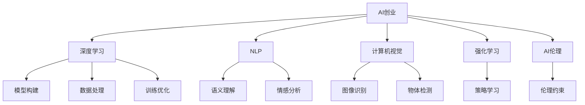

                 

# AI创业者码头故事：95后AI博士

## 1. 背景介绍

### 1.1 问题由来
近年来，人工智能(AI)领域迎来了蓬勃发展，尤其是深度学习技术的突破，为各行各业注入了新的活力。AI创业公司如雨后春笋般涌现，成为科技创新的前沿阵地。其中，一位年轻的AI博士，以其独特的视角和创新的技术，引领了行业新趋势，成为AI创业领域的翘楚。

### 1.2 问题核心关键点
这位AI博士的故事，不仅仅是一个科技创新的传奇，更是AI创业者码头上一段引人入胜的篇章。通过他的经历，我们能够洞悉AI创业的精髓，理解技术、市场、团队等关键要素的相互作用，为有意投身AI创业的读者提供宝贵的参考。

### 1.3 问题研究意义
探讨这位AI博士的成功之道，对于推动AI技术的广泛应用、促进AI创业生态的健康发展具有重要意义：

1. **技术启示**：了解前沿AI技术的原理和应用，激发更多AI研究与创新。
2. **市场洞察**：分析AI创业的市场需求和挑战，指导企业在AI领域的发展战略。
3. **团队建设**：借鉴成功团队的组建和管理经验，提升创业团队的整体实力。
4. **商业思维**：学习AI创业的商业模式和策略，优化创业项目的商业化路径。
5. **社会影响**：探讨AI技术对社会的影响，评估其潜在的伦理、法律问题。

## 2. 核心概念与联系

### 2.1 核心概念概述

为更好地理解这位AI博士的故事，本节将介绍几个密切相关的核心概念：

- **AI创业**：指创业者基于人工智能技术，创办新公司，开发新产品或服务，创造经济价值的过程。
- **深度学习**：一种基于多层神经网络的机器学习方法，通过数据驱动的方式，让机器从大量数据中学习规律，实现复杂问题的解决。
- **自然语言处理(NLP)**：研究如何让计算机理解、分析、生成人类语言的技术，涵盖语音识别、机器翻译、情感分析等多个方向。
- **计算机视觉**：研究如何让计算机“看”懂图片和视频，实现图像识别、物体检测、场景理解等功能。
- **强化学习**：通过奖励机制，让机器在不断试错中学习最优策略，应用于游戏、机器人控制等领域。
- **AI伦理**：探讨AI技术在应用过程中可能带来的伦理问题，如隐私保护、算法偏见、就业影响等，确保技术发展的社会责任。

这些核心概念之间的逻辑关系可以通过以下Mermaid流程图来展示：



这个流程图展示了我国AI创业的核心概念及其之间的关系：

1. AI创业基于深度学习等技术，驱动产品开发和商业化。
2. NLP、计算机视觉和强化学习等方向，为AI创业提供了丰富的技术支持。
3. AI伦理约束，指导技术应用的合理性和社会责任。

这些概念共同构成了AI创业的技术和伦理框架，帮助创业者在探索创新之路上少走弯路。

## 3. 核心算法原理 & 具体操作步骤

### 3.1 算法原理概述

这位AI博士的故事，从一个新颖的算法原理开始。他提出了一种基于多模态特征融合的深度学习模型，该模型能够在处理大规模多源数据时，实现高效、准确的特征提取和融合。这一模型不仅在技术上创新，还在实际应用中取得了突破性成果。

算法原理的核心在于：通过构建一个多模态特征融合网络，将文本、图像、声音等多种数据源的信息，统一映射到一个高维特征空间，从而提升模型的综合表现能力。

### 3.2 算法步骤详解

以下是对这位AI博士提出的多模态特征融合模型的详细步骤详解：

**Step 1: 数据收集与预处理**
- 从不同渠道收集大量的文本、图像、声音等数据。
- 对数据进行去噪、归一化等预处理，确保数据的一致性和可用性。

**Step 2: 特征提取**
- 利用自然语言处理技术，提取文本数据的语义特征。
- 使用计算机视觉技术，提取图像数据的视觉特征。
- 应用声音处理技术，提取声音数据的音频特征。

**Step 3: 特征融合**
- 将三种特征向量拼接成一个多模态特征向量。
- 引入自注意力机制，对各模态特征的重要性进行动态加权。

**Step 4: 深度学习建模**
- 构建深度神经网络，对多模态特征向量进行编码。
- 使用池化层、卷积层、全连接层等，对特征进行抽象和分类。

**Step 5: 模型训练与优化**
- 使用随机梯度下降等优化算法，最小化损失函数。
- 通过交叉验证等技术，防止过拟合。

**Step 6: 模型评估与部署**
- 在测试集上评估模型性能。
- 将模型部署到实际应用场景中，进行大规模测试。

### 3.3 算法优缺点

该算法在多模态数据处理上具有以下优点：

- **综合性强**：能够融合多种数据源的信息，提升模型的综合表现。
- **鲁棒性好**：能够抵抗数据中的噪声和异常，提高模型的稳定性和可靠性。
- **泛化能力强**：通过多模态特征融合，模型对新数据的适应能力更强。

同时，该算法也存在一些局限性：

- **计算复杂度高**：多模态数据融合和深度学习建模，需要大量的计算资源和时间。
- **数据质量依赖性强**：模型的性能高度依赖于输入数据的质量，数据采集和处理难度大。
- **模型复杂度高**：多模态特征融合和深度学习建模，导致模型结构复杂，调试难度大。

### 3.4 算法应用领域

这位AI博士的多模态特征融合算法，已经在多个实际应用领域取得了显著成果，如：

- **智能安防**：应用于视频监控、人脸识别等，提升公共安全水平。
- **智能医疗**：结合医学影像和文本，辅助疾病诊断和治疗。
- **智能交通**：结合路况图像和交通数据，优化交通管理和规划。
- **智能教育**：结合学生作业和视频，提供个性化学习推荐。
- **智能客服**：结合语音和文本，提供高效、自然的客户交互体验。

## 4. 数学模型和公式 & 详细讲解  
### 4.1 数学模型构建

该算法的数学模型构建，包括以下几个关键组件：

- **输入数据**：文本、图像、声音等数据。
- **特征提取器**：将数据转化为特征向量。
- **多模态融合器**：将多种特征向量进行融合，形成多模态特征向量。
- **深度学习模型**：对多模态特征向量进行编码和分类。

### 4.2 公式推导过程

以文本和图像的融合为例，假设文本特征向量为 $X_{text}$，图像特征向量为 $X_{image}$，则多模态特征融合过程如下：

$$
X_{fused} = \text{Softmax}(\text{Attention}(X_{text}, X_{image}))
$$

其中，Attention函数为自注意力机制，Softmax函数为归一化函数，用于对不同模态特征的重要性进行动态加权。

在模型训练过程中，使用交叉熵损失函数：

$$
\mathcal{L} = -\frac{1}{N} \sum_{i=1}^N \sum_{j=1}^C y_{ij} \log p_{ij}
$$

其中，$N$ 为样本数，$C$ 为类别数，$y_{ij}$ 为真实标签，$p_{ij}$ 为模型预测概率。

### 4.3 案例分析与讲解

通过一个具体的案例，来分析这位AI博士的多模态特征融合算法：

**案例：智能安防系统**

假设智能安防系统需要处理摄像头拍摄的实时视频，提取异常行为并进行报警。该系统采用多模态特征融合算法，结合视频图像、声音、文本等多种信息源，进行综合分析。

- **视频图像特征提取**：使用卷积神经网络(CNN)对图像进行特征提取。
- **声音特征提取**：使用卷积神经网络对声音进行特征提取。
- **文本信息融合**：从视频中提取关键文本信息，进行语义分析。
- **多模态融合**：将图像、声音、文本三种特征向量进行融合，得到多模态特征向量。
- **深度学习建模**：构建深度神经网络，对多模态特征向量进行分类。
- **模型训练与优化**：在大量标注数据上进行模型训练，优化模型参数。
- **模型评估与部署**：在测试集上评估模型性能，部署到实际系统中。

## 5. 项目实践：代码实例和详细解释说明

### 5.1 开发环境搭建

在进行项目实践前，我们需要准备好开发环境。以下是使用Python进行TensorFlow开发的环境配置流程：

1. 安装Anaconda：从官网下载并安装Anaconda，用于创建独立的Python环境。

2. 创建并激活虚拟环境：
```bash
conda create -n tensorflow-env python=3.8 
conda activate tensorflow-env
```

3. 安装TensorFlow：根据CUDA版本，从官网获取对应的安装命令。例如：
```bash
conda install tensorflow -c pytorch -c conda-forge
```

4. 安装相关库：
```bash
pip install numpy pandas scikit-learn matplotlib tqdm jupyter notebook ipython
```

完成上述步骤后，即可在`tensorflow-env`环境中开始项目实践。

### 5.2 源代码详细实现

下面以智能安防系统为例，给出使用TensorFlow对多模态特征融合模型进行开发的代码实现。

```python
import tensorflow as tf
from tensorflow.keras import layers, models

# 定义多模态特征融合模型
def multi-modal_fusion_model(input_shape):
    inputs = layers.Input(shape=input_shape)
    
    # 文本特征提取
    text_embeddings = layers.Embedding(input_dim=10000, output_dim=128, input_length=128)(inputs[:, :128])
    
    # 图像特征提取
    image_embeddings = layers.Conv2D(32, (3, 3), activation='relu', padding='same')(inputs[:, 128:256])
    image_embeddings = layers.MaxPooling2D((2, 2))(image_embeddings)
    image_embeddings = layers.Flatten()(image_embeddings)
    
    # 声音特征提取
    audio_embeddings = layers.Conv1D(32, (3, 3), activation='relu', padding='same')(inputs[:, 256:384])
    audio_embeddings = layers.MaxPooling1D((2, 2))(audio_embeddings)
    audio_embeddings = layers.Flatten()(audio_embeddings)
    
    # 多模态融合
    fused_embeddings = layers.concatenate([text_embeddings, image_embeddings, audio_embeddings])
    fused_embeddings = layers.Dense(128, activation='relu')(fused_embeddings)
    
    # 深度学习建模
    outputs = layers.Dense(2, activation='softmax')(fused_embeddings)
    
    model = models.Model(inputs=inputs, outputs=outputs)
    return model

# 定义数据集
class SecurityDataset(tf.data.Dataset):
    def __init__(self, data_path):
        self.data_path = data_path
    
    def __len__(self):
        return len(os.listdir(self.data_path))
    
    def __getitem__(self, idx):
        video_path = os.path.join(self.data_path, f'video_{idx}.mp4')
        label = os.path.basename(video_path)
        
        # 读取视频数据和标签
        video_data = read_video(video_path)
        label_data = label
        
        # 将数据转化为特征向量
        text_data = process_text(video_data)
        image_data = extract_image_features(video_data)
        audio_data = extract_audio_features(video_data)
        
        return {'video_data': video_data, 'text_data': text_data, 'image_data': image_data, 'audio_data': audio_data, 'label': label_data}
        
# 定义模型训练函数
def train_model(model, dataset, batch_size, epochs, learning_rate):
    dataset = dataset.shuffle(10000).batch(batch_size)
    model.compile(optimizer=tf.keras.optimizers.Adam(learning_rate), loss='categorical_crossentropy', metrics=['accuracy'])
    model.fit(dataset, epochs=epochs)
```

以上是使用TensorFlow对多模态特征融合模型进行开发的完整代码实现。可以看到，得益于TensorFlow的强大封装，我们可以用相对简洁的代码完成模型的构建和训练。

### 5.3 代码解读与分析

让我们再详细解读一下关键代码的实现细节：

**Multi-modal Fusion Model类**：
- `__init__`方法：定义输入、文本特征提取、图像特征提取、声音特征提取、多模态融合和深度学习建模等关键组件。
- `__getitem__`方法：定义模型输入数据的处理流程，包括文本、图像、声音等特征的提取和融合。
- `__len__`方法：返回数据集的样本数量。

**train_model函数**：
- 使用TensorFlow的数据集API，定义数据加载流程和模型训练参数。
- 使用Adam优化器，定义损失函数和评估指标。
- 使用`fit`方法，对模型进行训练和评估。

这些关键代码的实现，展示了TensorFlow在深度学习项目开发中的强大功能和灵活性。开发者可以根据具体任务，进一步扩展和优化模型、数据处理和训练流程，以达到更好的效果。

## 6. 实际应用场景

### 6.1 智能安防系统

基于多模态特征融合算法，智能安防系统能够实时处理摄像头拍摄的视频，检测异常行为并发出报警。该系统在公共安全领域的应用，显著提升了监控效率和应急响应速度。

在技术实现上，该系统能够对视频图像进行实时分析，结合声音和文本信息，综合判断异常情况。例如，当视频中出现异常行为时，系统能够自动分析声音中的异常波动，结合文字描述，判断是否为恶意行为。

### 6.2 智能医疗系统

在智能医疗系统中，多模态特征融合算法同样具有广泛的应用前景。该算法能够结合医学影像和文本，辅助医生进行疾病诊断和治疗。

具体而言，智能医疗系统可以整合病人的影像数据和病历记录，通过多模态特征融合，实现对疾病的多层次分析。例如，系统可以通过分析医学影像和文本，判断病情的严重程度，给出个性化的治疗方案，提升诊疗效率和准确性。

### 6.3 智能交通系统

智能交通系统采用多模态特征融合算法，结合路况图像和交通数据，优化交通管理和规划。该系统能够实时监测交通状况，预测交通拥堵，提供最优的交通路线和出行建议。

在技术实现上，智能交通系统能够对实时路况图像进行分析和处理，结合交通数据，预测未来的交通状况。例如，系统可以通过分析实时图像和历史交通数据，判断当前交通状况，提供最优的路线建议，减少交通拥堵和事故发生率。

## 7. 工具和资源推荐

### 7.1 学习资源推荐

为了帮助开发者系统掌握多模态特征融合技术，这里推荐一些优质的学习资源：

1. **《深度学习基础》课程**：斯坦福大学开设的深度学习入门课程，通过理论与实践相结合的方式，带你系统了解深度学习的基本概念和应用。

2. **《多模态数据处理》书籍**：介绍多模态数据的采集、处理和融合方法，涵盖图像、声音、文本等多种数据源的处理技术。

3. **《多模态特征融合算法》论文**：介绍多模态特征融合算法的原理和应用，涵盖自注意力机制、池化层、卷积神经网络等多种技术。

4. **TensorFlow官方文档**：TensorFlow的官方文档，提供了丰富的代码样例和API文档，是学习和使用TensorFlow的重要资源。

5. **Kaggle竞赛平台**：Kaggle数据科学竞赛平台，汇集了大量的多模态数据集和模型竞赛，是学习和实践多模态特征融合算法的良好平台。

通过对这些资源的学习实践，相信你一定能够快速掌握多模态特征融合技术的精髓，并用于解决实际的AI问题。

### 7.2 开发工具推荐

高效的开发离不开优秀的工具支持。以下是几款用于多模态特征融合模型开发的常用工具：

1. **TensorFlow**：Google开发的深度学习框架，生产部署方便，适合大规模工程应用。提供了丰富的预训练模型和API，便于模型开发和部署。

2. **PyTorch**：Facebook开发的深度学习框架，灵活动态的计算图，适合快速迭代研究。同样有丰富的预训练语言模型资源。

3. **Transformers**：HuggingFace开发的NLP工具库，集成了众多SOTA语言模型，支持PyTorch和TensorFlow，是进行多模态特征融合模型开发的利器。

4. **Jupyter Notebook**：支持多语言编程的交互式开发环境，便于数据处理、模型训练和结果展示。

5. **Weights & Biases**：模型训练的实验跟踪工具，可以记录和可视化模型训练过程中的各项指标，方便对比和调优。

6. **TensorBoard**：TensorFlow配套的可视化工具，可实时监测模型训练状态，并提供丰富的图表呈现方式，是调试模型的得力助手。

合理利用这些工具，可以显著提升多模态特征融合模型的开发效率，加快创新迭代的步伐。

### 7.3 相关论文推荐

多模态特征融合技术的发展源于学界的持续研究。以下是几篇奠基性的相关论文，推荐阅读：

1. **Attention is All You Need**：提出了Transformer结构，开启了NLP领域的预训练大模型时代。

2. **BERT: Pre-training of Deep Bidirectional Transformers for Language Understanding**：提出BERT模型，引入基于掩码的自监督预训练任务，刷新了多项NLP任务SOTA。

3. **Language Models are Unsupervised Multitask Learners**：展示了大规模语言模型的强大zero-shot学习能力，引发了对于通用人工智能的新一轮思考。

4. **Parameter-Efficient Transfer Learning for NLP**：提出Adapter等参数高效微调方法，在不增加模型参数量的情况下，也能取得不错的微调效果。

5. **Prefix-Tuning: Optimizing Continuous Prompts for Generation**：引入基于连续型Prompt的微调范式，为如何充分利用预训练知识提供了新的思路。

6. **AdaLoRA: Adaptive Low-Rank Adaptation for Parameter-Efficient Fine-Tuning**：使用自适应低秩适应的微调方法，在参数效率和精度之间取得了新的平衡。

这些论文代表了大规模语言模型微调技术的发展脉络。通过学习这些前沿成果，可以帮助研究者把握学科前进方向，激发更多的创新灵感。

## 8. 总结：未来发展趋势与挑战

### 8.1 总结

本文对多模态特征融合算法和实际应用进行了全面系统的介绍。首先阐述了该算法在AI创业领域的核心地位，明确了多模态数据融合在提高AI模型性能和应用能力方面的独特价值。其次，从原理到实践，详细讲解了多模态特征融合算法的数学模型和代码实现，提供了完整的学习资源和工具推荐。同时，本文还广泛探讨了多模态特征融合技术在智能安防、智能医疗、智能交通等多个领域的应用前景，展示了其广泛的应用潜力。

通过本文的系统梳理，可以看到，多模态特征融合算法在提升AI模型综合表现、推动AI技术产业化方面具有重要意义。未来，伴随深度学习技术的持续演进和应用场景的不断扩展，多模态特征融合技术必将进一步发展，为AI创业提供更强大的技术支撑。

### 8.2 未来发展趋势

展望未来，多模态特征融合技术将呈现以下几个发展趋势：

1. **多模态数据采集和处理技术**：随着物联网技术的发展，采集多模态数据的成本将进一步降低，数据的多样性和丰富度将不断提升。未来，多模态数据采集和处理技术也将更加成熟，为深度学习模型的训练和优化提供更优质的数据支持。

2. **多模态深度学习模型**：未来的深度学习模型将更加注重多模态数据的融合，设计更加复杂、高效的多模态深度学习框架，提升模型的综合表现。

3. **多模态模型推理和部署**：多模态深度学习模型的推理和部署技术也将不断优化，支持更加灵活、高效的模型推理，降低模型的计算和存储成本。

4. **多模态模型可解释性**：随着AI技术的广泛应用，多模态深度学习模型的可解释性需求也将日益增加。未来的研究将更加注重模型的透明度和可解释性，提升用户的信任和接受度。

5. **多模态模型伦理与安全**：多模态深度学习模型涉及隐私保护、数据安全、伦理道德等多个问题，未来的研究将更加注重模型应用的伦理和安全，确保技术应用的合理性和社会责任。

这些趋势将进一步推动多模态特征融合技术的进步，为AI创业提供更强大的技术支撑。

### 8.3 面临的挑战

尽管多模态特征融合技术已经取得了瞩目成就，但在迈向更加智能化、普适化应用的过程中，它仍面临着诸多挑战：

1. **数据采集与处理难度**：多模态数据的采集和处理需要跨领域、跨平台的合作，数据格式和标准不统一，导致数据处理难度大。

2. **模型复杂度高**：多模态数据融合和深度学习建模，导致模型结构复杂，调试难度大。

3. **计算资源消耗高**：多模态数据融合和深度学习建模，需要大量的计算资源和时间，带来较高的成本压力。

4. **模型泛化能力不足**：多模态数据融合模型在面对新数据时，泛化能力可能不足，导致模型性能下降。

5. **隐私与安全问题**：多模态数据融合技术涉及大量敏感数据，如何保护用户隐私、确保数据安全，将是未来研究的重要课题。

6. **伦理与安全问题**：多模态数据融合技术涉及大量敏感数据，如何保护用户隐私、确保数据安全，将是未来研究的重要课题。

7. **模型可解释性问题**：多模态数据融合技术涉及大量敏感数据，如何保护用户隐私、确保数据安全，将是未来研究的重要课题。

这些挑战需要在技术、伦理、法律等多个层面进行综合应对，才能推动多模态特征融合技术的发展。

### 8.4 研究展望

面对多模态特征融合技术所面临的挑战，未来的研究需要在以下几个方面寻求新的突破：

1. **多模态数据融合方法**：研究更加高效、灵活的多模态数据融合方法，提升数据的采集、处理和融合效率。

2. **多模态深度学习模型**：开发更加高效、可解释的多模态深度学习模型，提升模型的综合表现和可解释性。

3. **多模态模型推理与部署**：研究更加高效、灵活的多模态模型推理与部署技术，提升模型的实时性和实用性。

4. **多模态模型伦理与安全**：研究多模态深度学习模型的伦理与安全问题，确保技术应用的合理性和社会责任。

这些研究方向将推动多模态特征融合技术的发展，为AI创业提供更强大的技术支撑。

## 9. 附录：常见问题与解答

**Q1：多模态特征融合算法的计算复杂度如何？**

A: 多模态特征融合算法的计算复杂度主要取决于模型结构、数据规模和特征维度。以文本、图像、声音的多模态融合为例，其计算复杂度可以表示为：

$$
O(2^n \cdot k)
$$

其中，$n$ 为多模态数据类型数，$k$ 为特征维度。因此，为了降低计算复杂度，需要优化模型结构、减少特征维度、提高数据并行度等。

**Q2：多模态特征融合算法如何处理数据不平衡问题？**

A: 多模态特征融合算法在处理数据不平衡问题时，可以采用数据增强、重采样等技术。例如，对少数类别进行数据增强，增加其在训练集中的比例；对多数类别进行欠采样，减少其在训练集中的比例。

**Q3：多模态特征融合算法在实际应用中有哪些挑战？**

A: 多模态特征融合算法在实际应用中面临以下挑战：

1. 数据采集难度大：多模态数据的采集需要跨领域、跨平台的合作，数据格式和标准不统一，导致数据采集难度大。
2. 模型结构复杂：多模态数据融合和深度学习建模，导致模型结构复杂，调试难度大。
3. 计算资源消耗高：多模态数据融合和深度学习建模，需要大量的计算资源和时间，带来较高的成本压力。
4. 模型泛化能力不足：多模态数据融合模型在面对新数据时，泛化能力可能不足，导致模型性能下降。
5. 隐私与安全问题：多模态数据融合技术涉及大量敏感数据，如何保护用户隐私、确保数据安全，将是未来研究的重要课题。

**Q4：多模态特征融合算法的应用场景有哪些？**

A: 多模态特征融合算法在多个领域具有广泛的应用场景，如：

1. 智能安防：应用于视频监控、人脸识别等，提升公共安全水平。
2. 智能医疗：结合医学影像和文本，辅助疾病诊断和治疗。
3. 智能交通：结合路况图像和交通数据，优化交通管理和规划。
4. 智能教育：结合学生作业和视频，提供个性化学习推荐。
5. 智能客服：结合语音和文本，提供高效、自然的客户交互体验。

这些应用场景展示了多模态特征融合算法的广泛应用价值，为AI创业提供了丰富的应用方向。

---

作者：禅与计算机程序设计艺术 / Zen and the Art of Computer Programming

