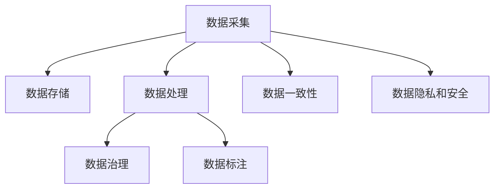

                 

## AI创业：数据管理的核心经验

> 关键词：数据管理,人工智能,创业,策略,优化

## 1. 背景介绍

在当今这个数据驱动的数字化时代，人工智能(AI)正迅速改变各行各业的运作方式。AI创业公司凭借其独特的创新理念和数据驱动的商业模式，成为了行业内的新贵。数据管理是AI创业成功的核心要素之一，本文将深入探讨AI创业中数据管理的核心经验，帮助创业者更好地理解和管理数据，提升AI产品的竞争力。

### 1.1 问题由来

数据是AI系统的基石，其在模型训练、推理、部署等各个环节都扮演着至关重要的角色。然而，随着数据量的激增和数据来源的多样化，AI创业公司面临着严峻的数据管理挑战。这些问题包括：

- **数据质量参差不齐**：数据标注不准确、不完整，影响模型训练和推理效果。
- **数据隐私和安全**：在收集和处理用户数据时，如何确保隐私保护和数据安全。
- **数据一致性**：分布式数据存储系统中的数据一致性问题，导致模型无法获取统一、连贯的数据视图。
- **数据治理**：如何高效管理海量数据，确保数据的可追溯性和可维护性。

这些问题直接关系到AI产品的性能和可靠性，对创业公司的发展具有重要影响。因此，数据管理成为了AI创业中不可忽视的核心经验。

### 1.2 问题核心关键点

数据管理的核心关键点包括：

- **数据采集**：从各种数据源中收集数据，并确保数据质量。
- **数据存储**：选择合适的存储技术，确保数据的一致性和可访问性。
- **数据处理**：清洗、转换和标注数据，确保数据可用性。
- **数据治理**：建立数据管理规范，确保数据安全和隐私。

这些关键点构成了AI创业中数据管理的全流程，每个环节都需要精心设计和实施，才能确保数据管理的有效性。

## 2. 核心概念与联系

### 2.1 核心概念概述

为了更好地理解数据管理的核心经验，本节将介绍几个密切相关的核心概念：

- **数据管理**：通过规划、控制和监督数据的采集、存储、处理、分析和传输，确保数据的完整性、一致性和可用性。
- **数据治理**：制定数据管理策略、政策和流程，确保数据的安全、合规和高效利用。
- **数据标注**：对数据进行人工标注，为机器学习模型的训练提供监督信号。
- **数据一致性**：确保数据在不同系统、不同时间点的一致性和连贯性。
- **数据隐私和安全**：保护个人隐私，确保数据在存储、处理和传输过程中不被非法访问和篡改。

这些核心概念之间的逻辑关系可以通过以下Mermaid流程图来展示：



这个流程图展示了大数据管理的核心流程，从数据采集到数据存储、处理、治理，再到数据一致性和隐私安全，每个环节都是环环相扣的，共同构成了一个完整的数据管理生态。

## 3. 核心算法原理 & 具体操作步骤

### 3.1 算法原理概述

AI创业中数据管理的核心算法原理主要包括：

- **数据清洗**：去除数据中的噪声和冗余，提升数据质量。
- **数据标注**：对数据进行人工标注，为模型训练提供监督信号。
- **数据一致性维护**：通过数据同步和版本控制技术，确保数据的连贯性和一致性。
- **数据安全与隐私保护**：采用加密、访问控制等技术，保护数据免受非法访问和篡改。

这些算法原理在大数据管理中具有基础性作用，确保了数据的质量、一致性和安全性。

### 3.2 算法步骤详解

AI创业中数据管理的具体操作步骤如下：

1. **数据采集**：从不同数据源（如互联网、传感器、API）收集数据，并对数据进行初步清洗和过滤。
   
2. **数据存储**：选择合适的数据存储技术（如Hadoop、Spark、MySQL等），对数据进行结构化存储。
   
3. **数据处理**：对存储的数据进行清洗、转换和标注，确保数据可用性。具体步骤包括：
   - **数据清洗**：去除重复、缺失、异常数据。
   - **数据转换**：将数据格式转换为模型所需的格式。
   - **数据标注**：对数据进行人工标注，生成标注集。

4. **数据治理**：建立数据管理规范，制定数据治理策略和流程，确保数据安全和隐私。

5. **数据一致性维护**：通过数据同步和版本控制技术，确保数据在不同系统、不同时间点的一致性和连贯性。

6. **数据安全与隐私保护**：采用加密、访问控制等技术，保护数据免受非法访问和篡改。

### 3.3 算法优缺点

AI创业中数据管理的核心算法具有以下优点：

- **提高数据质量**：通过数据清洗和转换，提升了数据的可用性和准确性。
- **促进模型训练**：通过数据标注，为模型训练提供监督信号，提高模型的泛化能力。
- **确保数据一致性**：通过数据同步和版本控制，保证了数据的连贯性和一致性。
- **保障数据安全**：通过加密和访问控制，确保数据的安全性和隐私保护。

同时，这些算法也存在一些缺点：

- **数据采集难度大**：不同数据源的数据格式、质量参差不齐，采集难度较大。
- **数据处理耗时**：数据清洗和标注需要大量人力和时间，处理成本较高。
- **数据一致性维护复杂**：数据一致性问题需要持续监控和维护，技术实现复杂。
- **数据隐私保护挑战**：数据隐私和安全保护是一个复杂且敏感的问题，需要不断更新和调整策略。

尽管存在这些局限性，但通过合理设计和管理，这些算法仍然可以高效地支撑AI创业公司的发展。

### 3.4 算法应用领域

AI创业中数据管理的应用领域包括：

- **医疗健康**：采集和处理医疗数据，为健康管理、疾病诊断提供支持。
- **金融服务**：收集和分析金融数据，为风险控制、投资决策提供依据。
- **智能制造**：采集和处理生产数据，优化生产流程和质量控制。
- **零售电商**：采集和分析消费者数据，优化商品推荐和营销策略。
- **智慧城市**：采集和处理城市数据，提升城市管理和公共服务水平。

这些领域对数据管理的需求各异，但数据管理的目标是一致的，即确保数据的质量、一致性和安全性，为AI应用提供坚实的数据基础。

## 4. 数学模型和公式 & 详细讲解 & 举例说明

### 4.1 数学模型构建

在大数据管理中，我们通常使用以下数学模型来描述数据管理过程：

1. **数据质量模型**：通过数据清洗、转换和标注，确保数据的质量和可用性。

2. **数据一致性模型**：通过版本控制和数据同步技术，确保数据在不同系统、不同时间点的一致性。

3. **数据隐私和安全模型**：通过加密和访问控制技术，保护数据免受非法访问和篡改。

### 4.2 公式推导过程

为了更好地理解这些模型，我们将进行简化的数学推导。

1. **数据质量模型**

设原始数据集为 $D$，经过数据清洗、转换和标注后，得到的干净数据集为 $D'$。数据质量模型可以通过以下公式描述：

$$
D' = f(D)
$$

其中 $f$ 为数据清洗、转换和标注函数，确保 $D'$ 数据质量和可用性。

2. **数据一致性模型**

设数据一致性维护的目标是确保数据在不同系统、不同时间点的一致性。假设原始数据集为 $D_0$，经过数据同步后，得到的数据集为 $D_t$。数据一致性模型可以通过以下公式描述：

$$
D_t = g(D_0)
$$

其中 $g$ 为数据同步函数，确保 $D_t$ 数据在不同时间点的一致性。

3. **数据隐私和安全模型**

设原始数据集为 $D$，通过加密和访问控制技术，得到的数据集为 $D_s$。数据隐私和安全模型可以通过以下公式描述：

$$
D_s = h(D)
$$

其中 $h$ 为数据加密和访问控制函数，确保 $D_s$ 数据的安全性和隐私保护。

### 4.3 案例分析与讲解

**案例分析**：

一家AI创业公司正在开发一款智能健康助手应用。该公司需要采集用户的健康数据，包括心率、血压、步数等。数据管理流程如下：

1. **数据采集**：通过智能手环和健康APP收集用户的健康数据。
   
2. **数据存储**：将采集到的数据存储到云数据库中，使用SQL数据库进行结构化存储。
   
3. **数据处理**：对数据进行清洗、转换和标注，去除异常数据，并将数据转换为模型所需的格式。
   
4. **数据治理**：建立数据管理规范，确保数据的质量和隐私保护。
   
5. **数据一致性维护**：通过数据同步技术，确保不同系统中的数据一致性。
   
6. **数据安全与隐私保护**：对数据进行加密，确保数据在存储、传输过程中的安全性。

**讲解**：

- **数据采集**：通过智能手环和健康APP，可以方便地收集用户的健康数据。但需要注意数据格式和数据质量，避免噪声和冗余。
   
- **数据存储**：使用SQL数据库进行结构化存储，可以快速进行数据查询和分析。但需要考虑数据扩展性和性能问题，避免数据丢失或损坏。
   
- **数据处理**：对数据进行清洗和标注，提升数据的可用性。例如，去除异常数据，进行格式转换，标注数据集。
   
- **数据治理**：建立数据管理规范，确保数据的质量和隐私保护。例如，制定数据采集标准，保护用户隐私。
   
- **数据一致性维护**：通过数据同步技术，确保不同系统中的数据一致性。例如，定期同步数据，更新版本信息。
   
- **数据安全与隐私保护**：对数据进行加密，确保数据在存储、传输过程中的安全性。例如，使用AES加密算法保护数据。

## 5. 项目实践：代码实例和详细解释说明

### 5.1 开发环境搭建

在进行数据管理实践前，我们需要准备好开发环境。以下是使用Python进行PyTorch开发的环境配置流程：

1. 安装Anaconda：从官网下载并安装Anaconda，用于创建独立的Python环境。

2. 创建并激活虚拟环境：
```bash
conda create -n pytorch-env python=3.8 
conda activate pytorch-env
```

3. 安装PyTorch：根据CUDA版本，从官网获取对应的安装命令。例如：
```bash
conda install pytorch torchvision torchaudio cudatoolkit=11.1 -c pytorch -c conda-forge
```

4. 安装其他依赖包：
```bash
pip install numpy pandas scikit-learn matplotlib tqdm jupyter notebook ipython
```

完成上述步骤后，即可在`pytorch-env`环境中开始数据管理实践。

### 5.2 源代码详细实现

下面我们以医疗健康领域的数据管理为例，给出使用PyTorch进行数据清洗、标注和同步的PyTorch代码实现。

首先，定义数据清洗函数：

```python
import pandas as pd

def clean_data(df):
    # 去除重复行
    df.drop_duplicates(inplace=True)
    # 处理缺失值
    df.fillna(method='ffill', inplace=True)
    # 去除异常值
    df = df[(df['心率'] > 60) & (df['心率'] < 200)]
    return df
```

然后，定义数据标注函数：

```python
def annotate_data(df):
    # 对数据进行人工标注，生成标注集
    annotated_df = pd.DataFrame({
        '心率': df['心率'],
        '血压': df['血压'],
        '步数': df['步数'],
        'label': df['标签']
    })
    return annotated_df
```

接着，定义数据同步函数：

```python
def sync_data(source, target):
    # 从源数据库同步数据到目标数据库
    source_df = pd.read_sql_query('SELECT * FROM source', source)
    target_df = pd.read_sql_query('SELECT * FROM target', target)
    # 同步数据
    target_df.append(source_df, ignore_index=True)
    target_df.to_sql('target', target, if_exists='append', index=False)
```

最后，启动数据管理流程：

```python
# 数据采集
source_df = pd.read_csv('source.csv')
target_df = pd.read_sql_query('SELECT * FROM target', 'target_db')

# 数据清洗
cleaned_df = clean_data(source_df)

# 数据标注
annotated_df = annotate_data(cleaned_df)

# 数据同步
sync_data('source', 'target')
```

以上就是使用PyTorch进行数据清洗、标注和同步的完整代码实现。可以看到，通过这些函数，我们能够轻松地对数据进行清洗、标注和同步，确保数据的质量和一致性。

### 5.3 代码解读与分析

让我们再详细解读一下关键代码的实现细节：

**clean_data函数**：
- 定义了数据清洗函数，包括去除重复行、处理缺失值和去除异常值等步骤。

**annotate_data函数**：
- 定义了数据标注函数，对数据进行人工标注，生成标注集。

**sync_data函数**：
- 定义了数据同步函数，从源数据库同步数据到目标数据库。

**启动数据管理流程**：
- 从源数据读取数据，进行清洗和标注，最后将数据同步到目标数据库。

这些函数都是数据管理实践中的关键工具，通过合理设计和调用，可以高效地管理海量数据，确保数据的质量和一致性。

## 6. 实际应用场景

### 6.1 智能健康助手应用

智能健康助手应用需要采集和管理大量的用户健康数据，通过数据管理技术，可以为健康管理、疾病诊断提供有力支持。具体应用场景包括：

1. **健康数据采集**：通过智能手环和健康APP，方便地收集用户的健康数据，并进行初步清洗和过滤。
   
2. **健康数据存储**：将采集到的数据存储到云数据库中，使用SQL数据库进行结构化存储。
   
3. **健康数据处理**：对数据进行清洗、转换和标注，确保数据的可用性和准确性。
   
4. **健康数据治理**：建立数据管理规范，确保数据的质量和隐私保护。
   
5. **健康数据一致性维护**：通过数据同步技术，确保不同系统中的数据一致性。
   
6. **健康数据安全与隐私保护**：对数据进行加密，确保数据在存储、传输过程中的安全性。

通过这些技术手段，智能健康助手应用可以高效地管理用户健康数据，提供准确的健康分析和建议，提升用户的健康管理水平。

### 6.2 金融数据分析平台

金融数据分析平台需要处理和分析大量的金融数据，通过数据管理技术，可以为风险控制、投资决策提供依据。具体应用场景包括：

1. **金融数据采集**：通过API接口和爬虫技术，采集金融市场数据和交易数据，并进行初步清洗和过滤。
   
2. **金融数据存储**：将采集到的数据存储到分布式数据库中，使用NoSQL数据库进行非结构化存储。
   
3. **金融数据处理**：对数据进行清洗、转换和标注，生成用于模型训练的数据集。
   
4. **金融数据治理**：建立数据管理规范，确保数据的质量和隐私保护。
   
5. **金融数据一致性维护**：通过数据同步技术，确保不同系统中的数据一致性。
   
6. **金融数据安全与隐私保护**：对数据进行加密，确保数据在存储、传输过程中的安全性。

通过这些技术手段，金融数据分析平台可以高效地处理和分析金融数据，提供精准的风险控制和投资决策，帮助金融机构优化业务流程和提升运营效率。

### 6.3 智能制造数据管理系统

智能制造数据管理系统需要处理和分析大量的生产数据，通过数据管理技术，可以为生产优化和质量控制提供依据。具体应用场景包括：

1. **生产数据采集**：通过传感器和物联网设备，采集生产数据，并进行初步清洗和过滤。
   
2. **生产数据存储**：将采集到的数据存储到分布式数据库中，使用NoSQL数据库进行非结构化存储。
   
3. **生产数据处理**：对数据进行清洗、转换和标注，生成用于模型训练的数据集。
   
4. **生产数据治理**：建立数据管理规范，确保数据的质量和隐私保护。
   
5. **生产数据一致性维护**：通过数据同步技术，确保不同系统中的数据一致性。
   
6. **生产数据安全与隐私保护**：对数据进行加密，确保数据在存储、传输过程中的安全性。

通过这些技术手段，智能制造数据管理系统可以高效地处理和分析生产数据，优化生产流程和质量控制，提升生产效率和产品质量。

## 7. 工具和资源推荐

### 7.1 学习资源推荐

为了帮助开发者系统掌握数据管理的核心经验，这里推荐一些优质的学习资源：

1. **《大数据管理基础》**：全面介绍了大数据管理的核心概念、技术框架和实践方法，适合初学者和高级开发者。
   
2. **《数据科学与机器学习》**：由斯坦福大学开设的在线课程，系统讲解数据科学与机器学习的理论和实践，包括数据管理技术。
   
3. **《数据治理实践》**：介绍了数据治理的最佳实践和案例，帮助企业建立数据治理规范。
   
4. **《数据清洗与处理》**：详细讲解了数据清洗和处理的技术方法，包括数据清洗、数据转换和数据标注。
   
5. **《数据同步技术》**：介绍了数据同步技术的实现原理和工具，帮助企业实现数据一致性管理。

通过对这些资源的学习实践，相信你一定能够快速掌握数据管理的精髓，并用于解决实际的数据管理问题。

### 7.2 开发工具推荐

高效的开发离不开优秀的工具支持。以下是几款用于数据管理开发的常用工具：

1. **PyTorch**：基于Python的开源深度学习框架，适合进行数据清洗、标注和同步等任务。
   
2. **Pandas**：开源数据分析工具，提供了强大的数据清洗和转换功能，支持数据结构和操作。
   
3. **SQL数据库**：如MySQL、PostgreSQL等，适合进行结构化数据的存储和管理。
   
4. **NoSQL数据库**：如MongoDB、HBase等，适合进行非结构化数据的存储和管理。
   
5. **ETL工具**：如Apache Nifi、Talend等，支持数据采集、清洗和同步等功能。
   
6. **数据可视化工具**：如Tableau、Power BI等，支持数据的可视化和分析，帮助企业进行数据治理。

合理利用这些工具，可以显著提升数据管理的开发效率，加快创新迭代的步伐。

### 7.3 相关论文推荐

数据管理的核心经验来自于学界的持续研究。以下是几篇奠基性的相关论文，推荐阅读：

1. **《大数据管理的挑战与解决方案》**：介绍了大数据管理的核心挑战和解决方案，为数据管理实践提供理论指导。
   
2. **《数据清洗与转换技术》**：详细介绍了数据清洗、转换和标注的技术方法，为数据管理实践提供技术支持。
   
3. **《数据同步技术与实践》**：介绍了数据同步技术的实现原理和工具，为数据一致性管理提供解决方案。
   
4. **《数据隐私与安全保护》**：介绍了数据隐私和安全保护的最佳实践和算法，为数据管理实践提供安全保障。

这些论文代表了大数据管理的发展脉络，通过学习这些前沿成果，可以帮助研究者把握学科前进方向，激发更多的创新灵感。

## 8. 总结：未来发展趋势与挑战

### 8.1 总结

本文对AI创业中数据管理的核心经验进行了全面系统的介绍。首先阐述了数据管理在AI创业中的重要性，明确了数据管理在数据采集、存储、处理、治理等方面的关键作用。其次，从原理到实践，详细讲解了数据清洗、标注、同步等核心算法的步骤和具体操作，给出了数据管理任务开发的完整代码实例。同时，本文还广泛探讨了数据管理技术在智能健康、金融、制造等诸多领域的应用前景，展示了数据管理技术的广阔应用空间。此外，本文精选了数据管理的各类学习资源，力求为读者提供全方位的技术指引。

通过本文的系统梳理，可以看到，数据管理是AI创业成功的核心要素之一，其重要性不亚于AI算法本身。高效的数据管理不仅能提升模型的性能，还能确保数据的可靠性和安全性，为AI创业公司提供坚实的数据基础。未来，随着数据规模的不断扩大和数据管理技术的持续演进，数据管理将在AI创业中发挥更加重要的作用。

### 8.2 未来发展趋势

展望未来，数据管理技术将呈现以下几个发展趋势：

1. **数据管理自动化**：通过机器学习算法自动化数据清洗和标注，提高数据处理的效率和准确性。
   
2. **数据治理智能化**：引入智能算法，自动化数据治理流程，提高数据管理的规范性和一致性。
   
3. **数据共享与互操作**：建立数据共享平台，促进数据在不同系统、不同企业之间的互操作性。
   
4. **数据隐私保护**：引入区块链等技术，确保数据在存储、传输和处理过程中的隐私保护。
   
5. **数据一致性保障**：通过分布式一致性算法，确保大规模数据环境中的数据一致性。
   
6. **数据治理框架**：建立统一的数据治理框架，为不同企业的数据管理提供标准化规范。

以上趋势凸显了数据管理技术的未来发展方向，这些方向的探索发展，将进一步提升数据管理的效率和安全性，为AI创业公司提供更加坚实的技术保障。

### 8.3 面临的挑战

尽管数据管理技术已经取得了显著成就，但在迈向更加智能化、普适化应用的过程中，它仍面临着诸多挑战：

1. **数据质量控制**：数据清洗和标注需要大量人力和时间，处理成本较高。如何在保证数据质量的同时，提高数据处理效率，是一个亟待解决的问题。
   
2. **数据一致性维护**：分布式数据存储系统中的数据一致性问题，需要持续监控和维护，技术实现复杂。

3. **数据隐私保护**：在数据存储、传输和处理过程中，如何确保数据的安全性和隐私保护，是一个复杂且敏感的问题。

4. **数据治理规范**：建立统一的数据治理规范，需要企业内部各部门的协作和支持，规范制定和执行难度较大。

5. **数据治理平台**：开发和部署数据治理平台，需要高昂的开发和运维成本，对企业的技术实力和资金实力提出较高要求。

这些挑战将随着数据规模的扩大和数据治理需求的增加，变得更加复杂和严峻。因此，数据管理技术的未来发展，需要进一步加强自动化、智能化、安全性等方面的研究，以应对日益复杂的数据治理需求。

### 8.4 研究展望

面对数据管理面临的挑战，未来的研究需要在以下几个方面寻求新的突破：

1. **数据管理自动化**：开发更加高效的数据清洗、标注和同步算法，提高数据处理的自动化水平。
   
2. **数据治理智能化**：引入智能算法，自动化数据治理流程，提高数据管理的规范性和一致性。
   
3. **数据共享与互操作**：建立数据共享平台，促进数据在不同系统、不同企业之间的互操作性。
   
4. **数据隐私保护**：引入区块链等技术，确保数据在存储、传输和处理过程中的隐私保护。
   
5. **数据一致性保障**：通过分布式一致性算法，确保大规模数据环境中的数据一致性。
   
6. **数据治理框架**：建立统一的数据治理框架，为不同企业的数据管理提供标准化规范。

这些研究方向将引领数据管理技术迈向更高的台阶，为AI创业公司提供更加坚实的技术保障。

## 9. 附录：常见问题与解答

**Q1：数据管理在大数据中扮演什么角色？**

A: 数据管理在大数据中扮演着核心角色，通过规划、控制和监督数据的采集、存储、处理、分析和传输，确保数据的完整性、一致性和可用性。数据管理是大数据生态系统中的重要组成部分，直接影响大数据应用的效果和可靠性。

**Q2：数据清洗和标注的主要目的是什么？**

A: 数据清洗和标注的主要目的是提升数据质量和可用性。数据清洗可以去除噪声和冗余，提升数据准确性和一致性。数据标注可以为机器学习模型的训练提供监督信号，提高模型的泛化能力和预测精度。

**Q3：数据同步和版本控制的主要作用是什么？**

A: 数据同步和版本控制的主要作用是确保数据在不同系统、不同时间点的一致性和连贯性。通过数据同步技术，可以及时更新和整合数据，确保数据的最新版本和一致性。版本控制技术可以记录和追踪数据的变更历史，方便数据追溯和审计。

**Q4：如何保护数据隐私和安全？**

A: 保护数据隐私和安全的主要措施包括数据加密、访问控制、匿名化处理等。数据加密可以确保数据在存储、传输和处理过程中的安全性。访问控制可以限制对数据的访问权限，防止非法访问和篡改。匿名化处理可以在不影响数据分析的前提下，保护用户隐私。

**Q5：数据管理技术在AI创业中有哪些应用？**

A: 数据管理技术在AI创业中有广泛的应用，包括智能健康助手应用、金融数据分析平台、智能制造数据管理系统等。通过数据管理技术，可以高效地收集、存储、处理和分析数据，提升AI产品的性能和可靠性。

这些问题的解答，展示了数据管理技术的核心价值和实际应用，帮助读者更深入地理解数据管理的重要性。

---

作者：禅与计算机程序设计艺术 / Zen and the Art of Computer Programming

