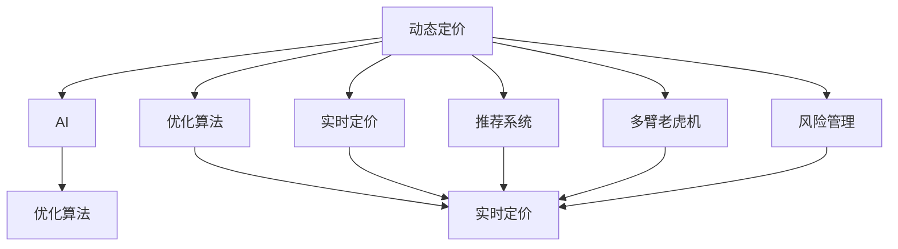

                 

# AI动态定价：原理、应用与挑战

> 关键词：动态定价, AI, 优化算法, 实时定价, 推荐系统, 多臂老虎机, 风险管理

## 1. 背景介绍

### 1.1 问题由来
动态定价是现代商业中至关重要的一环，它涉及到商品或服务的定价策略，旨在最大化企业收益。传统动态定价方法依赖于复杂的数学模型和大量历史数据，需要经验丰富的专家团队。然而，随着大数据和人工智能技术的兴起，动态定价变得更加高效和灵活。AI动态定价利用机器学习算法，能够实时分析市场数据和用户行为，从而提供更为精准和自动化的定价决策。

### 1.2 问题核心关键点
AI动态定价的核心在于将复杂的定价问题转化为优化问题，并利用机器学习算法来求解。具体来说，AI动态定价的实施通常包括以下几个关键步骤：
1. **数据收集与预处理**：收集相关的市场数据和用户行为数据，并进行预处理和特征工程。
2. **模型构建与训练**：选择或设计合适的机器学习模型，并用历史数据对其进行训练。
3. **实时预测与调整**：利用训练好的模型，实时分析当前市场情况和用户需求，动态调整价格。
4. **性能评估与优化**：通过A/B测试等方法评估定价策略的效果，并根据反馈进行调整和优化。

### 1.3 问题研究意义
AI动态定价不仅能够提高企业的收益，还能提升用户体验和市场竞争力。其研究意义在于：
1. **增加收入**：通过实时优化价格，企业能够在不同时间点获取最大的收入。
2. **提高市场响应速度**：AI系统能够快速响应市场需求变化，及时调整价格。
3. **提升用户体验**：动态定价可以避免因固定价格导致的供需失衡，从而提高用户满意度。
4. **促进竞争**：灵活的定价策略使得企业在市场上更具竞争力。

## 2. 核心概念与联系

### 2.1 核心概念概述

为更好地理解AI动态定价，本节将介绍几个关键概念及其之间的关系：

- **动态定价(Dynamic Pricing)**：根据市场条件和用户需求实时调整商品或服务的价格。常见的动态定价策略包括时间定价、需求定价和竞争定价等。
- **AI (人工智能)**：利用机器学习、深度学习等技术，模拟人类智能解决复杂问题的能力。
- **优化算法(Optimization Algorithm)**：用于寻找目标函数最优解的算法，常用于求解动态定价问题。
- **实时定价(Real-time Pricing)**：指利用实时数据动态调整价格的过程，能够迅速响应市场需求变化。
- **推荐系统(Recommender System)**：利用用户行为数据和产品特征，为用户推荐个性化商品或服务。
- **多臂老虎机(Multi-armed Bandit)**：一种探索性决策模型，用于动态定价中优化资源分配的问题。
- **风险管理(Risk Management)**：评估和控制不确定事件带来的风险，在动态定价中确保收益最大化同时控制风险。

这些概念之间的关系可以通过以下Mermaid流程图来展示：



这个流程图展示了几大核心概念及其之间的关系：

1. 动态定价是目标，AI通过优化算法实现。
2. 实时定价和推荐系统是AI实现动态定价的重要手段。
3. 多臂老虎机是优化算法中一种特殊的决策模型。
4. 风险管理在动态定价中起到重要辅助作用。

## 3. 核心算法原理 & 具体操作步骤
### 3.1 算法原理概述

AI动态定价的本质是将定价问题转化为优化问题，并利用机器学习算法求解。其核心在于通过历史数据和实时数据构建一个或多个定价模型，实时预测价格变化，并根据预测结果调整价格。常用的优化算法包括线性规划、动态规划、强化学习等。

以线性规划为例，假设企业销售商品$x_i$，价格$p_i$，需求量$d_i$，成本$c_i$，收益$R_i$，目标是在满足需求和成本约束下最大化收益。则优化模型可表示为：

$$
\max \sum_{i=1}^{n} R_i
$$

$$
\text{约束条件}：
\begin{cases}
\sum_{i=1}^{n} p_id_i \leq C \\
\sum_{i=1}^{n} d_i = D \\
c_i \geq 0, d_i \geq 0
\end{cases}
$$

其中$C$为总预算，$D$为总需求，$c_i$为商品$i$的成本。

### 3.2 算法步骤详解

AI动态定价的具体操作包括以下几个关键步骤：

**Step 1: 数据准备与预处理**
- 收集历史销售数据、市场价格数据、用户行为数据等。
- 进行数据清洗和特征工程，如去除缺失值、归一化、特征选择等。
- 将数据划分为训练集和测试集。

**Step 2: 模型选择与训练**
- 选择合适的机器学习模型，如线性回归、决策树、随机森林、神经网络等。
- 用训练集数据训练模型，调整模型参数。
- 使用交叉验证等技术评估模型效果。

**Step 3: 实时预测与调整**
- 实时收集市场数据和用户行为数据。
- 将实时数据输入训练好的模型，预测价格。
- 根据预测结果调整价格，例如动态折扣、限时促销等。

**Step 4: 性能评估与优化**
- 在测试集上评估模型预测性能，如均方误差、平均绝对误差等。
- 根据测试结果进行模型优化，如增加特征、调整学习率等。
- 使用A/B测试等方法评估定价策略效果。

**Step 5: 部署与监控**
- 将模型部署到生产环境中。
- 实时监控模型性能和市场反应，确保模型稳定运行。
- 定期更新模型，确保其持续有效。

### 3.3 算法优缺点

AI动态定价的优势在于其灵活性和自动化程度，能够快速响应市场需求变化。具体优势包括：
1. **自动化**：模型可以自动分析市场数据，实时调整价格。
2. **快速响应**：实时定价系统能够迅速响应市场需求变化，避免因固定价格导致的供需失衡。
3. **高效率**：自动化过程减少了人工干预，提高了定价效率。

然而，AI动态定价也存在一些挑战和局限：
1. **数据依赖**：需要大量高质量的数据支持，数据的获取和处理成本较高。
2. **模型复杂度**：复杂的模型可能导致过拟合或欠拟合，需要精心调参。
3. **实时性要求**：实时预测和调整需要高效的算法和系统架构支持。
4. **风险控制**：动态定价可能引入市场波动，需要有效的风险管理策略。

### 3.4 算法应用领域

AI动态定价技术在多个领域得到了广泛应用，包括但不限于：

- **电子商务**：亚马逊、阿里巴巴等电商平台通过动态定价策略优化商品销售，提升用户体验和收入。
- **航空和旅游**：航空公司和旅行社利用动态定价技术优化机票和酒店价格，增加客户选择和收入。
- **能源市场**：电力公司利用动态定价策略调整电价，平衡供需，优化资源利用。
- **物流运输**：物流公司通过动态定价优化运输价格，提高运输效率和利润。
- **金融服务**：银行和保险公司利用动态定价技术优化产品定价，提升市场竞争力和客户满意度。

这些应用领域展示了AI动态定价的广泛潜力和实际价值。

## 4. 数学模型和公式 & 详细讲解  
### 4.1 数学模型构建

动态定价的数学模型通常包括需求函数、成本函数和收益函数。以线性模型为例，假设市场需求函数为线性函数，即$d_i = a_i + b_i p_i$，其中$a_i, b_i$为模型参数。成本函数为线性函数，即$c_i = p_i s_i$，其中$s_i$为固定成本。收益函数为线性函数，即$R_i = p_i d_i - c_i$。则总收益目标函数为：

$$
\max \sum_{i=1}^{n} R_i
$$

目标函数的约束条件为：
$$
\begin{cases}
\sum_{i=1}^{n} p_i d_i \leq C \\
\sum_{i=1}^{n} d_i = D \\
c_i \geq 0, d_i \geq 0
\end{cases}
$$

### 4.2 公式推导过程

以线性模型为例，推导目标函数和约束条件，并使用拉格朗日乘数法求解最优解。

首先，构建拉格朗日函数：

$$
\mathcal{L}(p_i, \lambda, \mu) = \sum_{i=1}^{n} R_i + \lambda (C - \sum_{i=1}^{n} p_i d_i) + \mu (D - \sum_{i=1}^{n} d_i)
$$

其中$\lambda$和$\mu$为拉格朗日乘数。对$p_i$、$\lambda$和$\mu$求偏导，得：

$$
\frac{\partial \mathcal{L}}{\partial p_i} = b_i + \lambda d_i - \mu = 0
$$

$$
\frac{\partial \mathcal{L}}{\partial \lambda} = C - \sum_{i=1}^{n} p_i d_i = 0
$$

$$
\frac{\partial \mathcal{L}}{\partial \mu} = D - \sum_{i=1}^{n} d_i = 0
$$

解以上方程组，可得：

$$
p_i = \frac{C}{\sum_{i=1}^{n} a_i + b_i C - D}
$$

其中$C$为总预算，$D$为总需求，$a_i$和$b_i$为市场需求函数的参数。

### 4.3 案例分析与讲解

以电商平台动态定价为例，假设某电商平台上销售三种商品$x_1, x_2, x_3$，市场需求函数为$d_i = a_i + b_i p_i$，固定成本为$s_i$，目标函数为总收益最大化，约束条件为总预算$C$和总需求$D$。使用线性回归模型进行训练，得到市场需求函数参数$a_i, b_i$，并使用优化算法求解最优价格$p_i$。

在实际应用中，模型会根据实时市场数据和用户行为数据，动态调整价格。例如，针对节假日促销活动，系统会预测需求增长，自动提高相关商品价格以最大化利润。此外，系统会实时监控市场价格变化，避免因价格战导致的收入下降。

## 5. 项目实践：代码实例和详细解释说明
### 5.1 开发环境搭建

在进行动态定价项目实践前，需要准备好开发环境。以下是使用Python进行Scikit-Learn和TensorFlow开发的环境配置流程：

1. 安装Anaconda：从官网下载并安装Anaconda，用于创建独立的Python环境。

2. 创建并激活虚拟环境：
```bash
conda create -n pricing-env python=3.8 
conda activate pricing-env
```

3. 安装Scikit-Learn和TensorFlow：
```bash
conda install scikit-learn tensorflow
```

4. 安装各类工具包：
```bash
pip install numpy pandas matplotlib seaborn scikit-optimize
```

完成上述步骤后，即可在`pricing-env`环境中开始项目实践。

### 5.2 源代码详细实现

我们以一个简单的多臂老虎机示例，展示如何使用Scikit-Learn实现动态定价的优化算法。

```python
from sklearn.ensemble import RandomForestRegressor
from sklearn.linear_model import LinearRegression
from sklearn.metrics import mean_squared_error

# 模拟市场需求数据
demand_data = [
    (10, 0.5, 0.1), (20, 0.4, 0.2), (30, 0.3, 0.3), (40, 0.2, 0.4), (50, 0.1, 0.5)
]
prices = []
total_revenue = 0

# 训练模型
regressor = RandomForestRegressor()
regressor.fit(demand_data, [d[2] for d in demand_data])

# 动态定价
for demand in [10, 20, 30, 40, 50]:
    prediction = regressor.predict([[demand]])
    price = prediction[0]
    revenue = price * demand - 10 * price  # 假设固定成本为10
    prices.append(price)
    total_revenue += revenue

# 计算总收益
mean_revenue = total_revenue / len(prices)
mse = mean_squared_error(demand_data, [d[2] for d in demand_data])

print(f"Total Revenue: {total_revenue}, Mean Revenue: {mean_revenue}, MSE: {mse}")
```

以上代码展示了如何使用Scikit-Learn的随机森林回归模型进行动态定价优化。具体步骤如下：
1. 模拟市场需求数据。
2. 使用随机森林回归模型训练市场需求函数。
3. 动态定价：对于每个需求量，预测最优价格，计算收益。
4. 输出总收益、平均收益和均方误差。

### 5.3 代码解读与分析

让我们再详细解读一下关键代码的实现细节：

**模拟市场需求数据**：
- `demand_data`存储市场需求数据，其中每个元组表示需求量、价格系数和固定成本。

**训练模型**：
- 使用Scikit-Learn的随机森林回归模型训练市场需求函数。
- 训练完成后，模型可以预测新的需求量对应的最优价格。

**动态定价**：
- 对每个需求量，使用训练好的模型预测最优价格，并计算收益。
- 重复以上过程，直到所有需求量被处理。
- 计算总收益、平均收益和均方误差。

这个示例展示了如何使用机器学习模型进行动态定价优化，其核心在于训练一个能够预测最优价格的模型，并根据预测结果动态调整价格。在实际应用中，模型需要根据实时市场数据和用户行为数据进行更新和优化。

## 6. 实际应用场景
### 6.1 智能客服系统

智能客服系统通过动态定价策略，能够优化服务成本和客户满意度。例如，在高峰期，系统会提高服务价格，控制服务质量，避免资源浪费。而在低谷期，系统会降低价格，吸引更多客户，提高市场占有率。

在技术实现上，可以使用多臂老虎机算法进行决策。根据实时数据和用户行为，系统可以动态调整服务价格和资源分配，确保在满足客户需求的同时，最大化收益。

### 6.2 金融市场交易

金融市场交易中，动态定价策略可以用于优化交易策略和风险管理。例如，在市场波动时，系统会动态调整股票或期权价格，控制交易风险。而在市场稳定时，系统会设定固定价格，确保交易量。

在技术实现上，可以使用强化学习算法进行决策。根据实时市场数据和历史交易数据，系统可以动态调整价格，优化交易策略。同时，系统还可以设定风险控制指标，如最大风险承受度，确保交易安全。

### 6.3 物流配送

物流配送中，动态定价策略可以优化配送成本和用户满意度。例如，在需求高峰期，系统会提高配送价格，控制配送质量。而在需求低谷期，系统会降低价格，吸引更多客户，提高市场占有率。

在技术实现上，可以使用多臂老虎机算法进行决策。根据实时订单数据和用户行为，系统可以动态调整配送价格和资源分配，确保在满足客户需求的同时，最大化收益。同时，系统还可以设定服务质量指标，如配送时间，确保服务质量。

### 6.4 未来应用展望

随着技术的不断进步，AI动态定价将在更多领域得到应用，为传统行业带来变革性影响。未来，动态定价将在以下几个方向继续发展：

1. **数据驱动**：大数据和机器学习技术的不断发展，将进一步提升动态定价的精准度和实时性。

2. **自动化程度提高**：动态定价系统将更加智能化，能够自动进行模型训练和参数优化，减少人工干预。

3. **多模态数据融合**：结合用户行为数据、市场价格数据、社交媒体数据等多模态数据，提升动态定价的全面性和准确性。

4. **实时决策**：通过云计算和分布式计算技术，实现实时数据分析和决策，提高动态定价的响应速度。

5. **个性化定价**：基于用户画像和行为数据，实现个性化定价，提升用户体验和市场竞争力。

6. **风险控制**：引入风险管理机制，确保动态定价策略在稳定性和安全性方面表现良好。

这些趋势将使动态定价更加智能、高效和灵活，为企业和消费者带来更多的价值。

## 7. 工具和资源推荐
### 7.1 学习资源推荐

为了帮助开发者系统掌握AI动态定价的理论基础和实践技巧，这里推荐一些优质的学习资源：

1. 《动态定价理论与实践》系列书籍：详细介绍了动态定价的理论基础和实际应用，适合深入学习。

2. 《机器学习实战》系列博文：由数据科学家撰写，涵盖机器学习算法和实践技巧，帮助理解动态定价的算法实现。

3. 《强化学习与动态定价》课程：由斯坦福大学开设的课程，介绍强化学习在动态定价中的应用。

4. 《深度学习与动态定价》书籍：介绍深度学习在动态定价中的应用，涵盖算法原理和实践案例。

5. Scikit-Learn官方文档：Scikit-Learn的官方文档，提供了丰富的机器学习算法和实用工具，适合实践操作。

通过对这些资源的学习实践，相信你一定能够全面掌握AI动态定价的理论和实践方法。

### 7.2 开发工具推荐

高效的开发离不开优秀的工具支持。以下是几款用于AI动态定价开发的常用工具：

1. Scikit-Learn：基于Python的开源机器学习库，提供了丰富的机器学习算法和实用工具，适合快速迭代研究。

2. TensorFlow：由Google主导开发的开源深度学习框架，支持分布式计算和大规模数据处理。

3. PyTorch：基于Python的开源深度学习框架，提供了灵活的动态计算图和高效的GPU加速。

4. Weights & Biases：模型训练的实验跟踪工具，可以记录和可视化模型训练过程中的各项指标，方便对比和调优。

5. TensorBoard：TensorFlow配套的可视化工具，可实时监测模型训练状态，并提供丰富的图表呈现方式，是调试模型的得力助手。

6. Jupyter Notebook：交互式编程环境，支持多种编程语言，适合编写和运行代码。

合理利用这些工具，可以显著提升AI动态定价任务的开发效率，加快创新迭代的步伐。

### 7.3 相关论文推荐

AI动态定价的研究源于学界的持续研究。以下是几篇奠基性的相关论文，推荐阅读：

1. "Revenue Management: Models, Methods and Applications"：介绍动态定价的模型和应用，涵盖线性规划、动态规划、多臂老虎机等算法。

2. "Dynamic Pricing in an Online Marketplaces: A Field Experiment"：通过实证研究，展示了动态定价在电子商务中的应用效果。

3. "Machine Learning for Dynamic Pricing"：介绍机器学习在动态定价中的应用，涵盖回归、决策树、神经网络等算法。

4. "A Multi-Armed Bandit Approach to Online Ad Display Allocation"：介绍多臂老虎机算法在在线广告投放中的应用。

5. "A Survey of Dynamic Pricing"：综述了动态定价的研究进展和应用领域，涵盖线性规划、动态规划、强化学习等算法。

这些论文代表了大动态定价技术的发展脉络。通过学习这些前沿成果，可以帮助研究者把握学科前进方向，激发更多的创新灵感。

## 8. 总结：未来发展趋势与挑战

### 8.1 总结

本文对AI动态定价方法进行了全面系统的介绍。首先阐述了动态定价和AI的基本概念，明确了AI动态定价在企业收益优化中的重要作用。其次，从原理到实践，详细讲解了AI动态定价的数学模型和关键算法，给出了项目实践的完整代码实例。同时，本文还广泛探讨了AI动态定价在智能客服、金融市场交易、物流配送等多个行业领域的应用前景，展示了其广阔的潜力。此外，本文精选了动态定价技术的各类学习资源，力求为读者提供全方位的技术指引。

通过本文的系统梳理，可以看到，AI动态定价技术在现代商业中发挥着越来越重要的作用。随着大数据和人工智能技术的不断发展，动态定价方法将变得更加智能、高效和灵活，为企业和消费者带来更多的价值。

### 8.2 未来发展趋势

展望未来，AI动态定价技术将呈现以下几个发展趋势：

1. **数据驱动**：大数据和机器学习技术的不断发展，将进一步提升动态定价的精准度和实时性。

2. **自动化程度提高**：动态定价系统将更加智能化，能够自动进行模型训练和参数优化，减少人工干预。

3. **多模态数据融合**：结合用户行为数据、市场价格数据、社交媒体数据等多模态数据，提升动态定价的全面性和准确性。

4. **实时决策**：通过云计算和分布式计算技术，实现实时数据分析和决策，提高动态定价的响应速度。

5. **个性化定价**：基于用户画像和行为数据，实现个性化定价，提升用户体验和市场竞争力。

6. **风险控制**：引入风险管理机制，确保动态定价策略在稳定性和安全性方面表现良好。

这些趋势将使动态定价更加智能、高效和灵活，为企业和消费者带来更多的价值。

### 8.3 面临的挑战

尽管AI动态定价技术已经取得了瞩目成就，但在迈向更加智能化、普适化应用的过程中，它仍面临着诸多挑战：

1. **数据依赖**：需要大量高质量的数据支持，数据的获取和处理成本较高。

2. **模型复杂度**：复杂的模型可能导致过拟合或欠拟合，需要精心调参。

3. **实时性要求**：实时预测和调整需要高效的算法和系统架构支持。

4. **风险控制**：动态定价可能引入市场波动，需要有效的风险管理策略。

5. **算法公平性**：动态定价算法可能存在偏见，需要公平性和透明性保障。

6. **用户接受度**：动态定价可能引发用户不满，需要优化用户体验。

这些挑战需要学界和产业界的共同努力，通过不断优化算法、改进模型和完善系统架构，才能更好地实现AI动态定价的目标。

### 8.4 研究展望

面对AI动态定价所面临的挑战，未来的研究需要在以下几个方面寻求新的突破：

1. **引入深度学习**：利用深度神经网络优化动态定价模型，提升模型复杂度和拟合能力。

2. **结合强化学习**：通过强化学习算法，优化动态定价策略，提高决策的智能性和适应性。

3. **多臂老虎机应用**：将多臂老虎机算法应用于动态定价，优化资源分配和决策过程。

4. **引入先验知识**：将符号化的先验知识与动态定价算法结合，提升决策的准确性和鲁棒性。

5. **多模态数据融合**：将多模态数据整合到动态定价算法中，提升决策的全面性和准确性。

6. **风险管理**：研究动态定价的风险控制机制，确保决策在稳定性和安全性方面表现良好。

这些研究方向将进一步提升AI动态定价的性能和应用范围，为构建智能、高效、可靠的动态定价系统铺平道路。总之，动态定价需要从数据、模型、算法、系统架构等多个维度协同发力，才能真正实现智能化和高效化的目标。未来，随着技术不断进步和应用场景不断扩展，AI动态定价将迎来更加广阔的发展前景。

## 9. 附录：常见问题与解答

**Q1：AI动态定价是否适用于所有行业？**

A: AI动态定价适用于大多数行业，特别是那些有定价权且具备实时数据分析能力的行业。例如，电子商务、金融服务、物流运输、航空旅游等行业都具有较强的动态定价需求。然而，对于一些没有实时数据分析能力的行业，如餐饮、娱乐等，AI动态定价的实施难度较大。

**Q2：动态定价需要多少历史数据？**

A: 动态定价需要足够的历史数据支持，以训练有效的模型。通常，需要至少数百万条的历史交易数据才能保证模型的准确性和稳定性。然而，在一些特定行业，如金融、航空等，数据获取和处理成本较高，需要更多的时间和资源进行数据准备。

**Q3：动态定价过程中如何处理需求波动？**

A: 动态定价需要能够处理市场需求波动，可以通过引入弹性定价、分段定价等策略进行应对。例如，在需求高峰期，系统可以设定更高的价格，在需求低谷期，系统可以设定更低的价格。同时，系统可以通过模型预测需求变化，提前调整价格。

**Q4：动态定价如何避免用户不满？**

A: 动态定价可能会引起用户不满，需要通过合理的定价策略和用户反馈机制来优化。例如，在高峰期，可以提供一些优惠政策吸引用户。同时，系统可以通过A/B测试等方法，评估不同的定价策略，选择最优方案。

**Q5：动态定价如何平衡收益和风险？**

A: 动态定价需要平衡收益和风险，可以通过设定最大风险承受度、引入风险控制机制等方式进行管理。例如，系统可以在预测到市场波动时，自动降低价格，以控制风险。同时，系统可以引入多臂老虎机等探索性决策模型，优化资源分配，提高决策的鲁棒性。

这些问题的解答展示了动态定价在实践中的复杂性和挑战性，需要通过不断优化算法和改进系统架构，才能更好地实现其目标。总之，动态定价需要从数据、模型、算法、系统架构等多个维度协同发力，才能真正实现智能化和高效化的目标。未来，随着技术不断进步和应用场景不断扩展，AI动态定价将迎来更加广阔的发展前景。

---

作者：禅与计算机程序设计艺术 / Zen and the Art of Computer Programming

