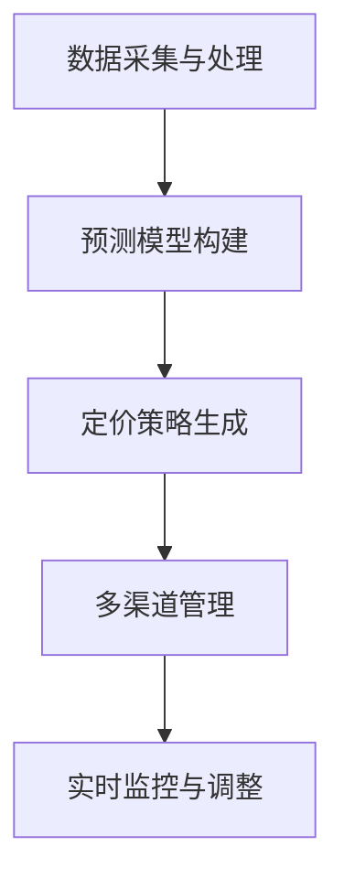

                 

# AI动态定价：原理、应用与挑战

## 1. 背景介绍

随着人工智能技术的飞速发展，AI动态定价技术在金融、航空、电商等多个行业迅速落地应用，极大地提升了业务决策效率和竞争优势。AI动态定价通过对海量数据进行深度学习，实时分析市场供需情况，自动生成最优定价策略，实现了智能化的资源配置和收入优化。

### 1.1 问题由来

在传统的定价策略中，商家依赖历史数据和人工经验进行价格设置。然而，这种方式具有较大的主观性和滞后性，难以应对快速变化的市场环境。随着大数据和机器学习技术的发展，基于AI的动态定价方法成为新的热门研究方向。AI动态定价通过实时分析市场需求、竞争对手行为、库存状况等多维信息，自动生成动态定价策略，实现了更加精准、灵活的定价。

### 1.2 问题核心关键点

AI动态定价的核心在于实时数据分析和机器学习模型的应用。其关键点包括：
- 实时数据采集和处理：通过多种数据源实时收集市场信息和消费者行为数据。
- 预测模型构建：构建基于历史数据和机器学习算法的预测模型，预测未来市场需求和价格趋势。
- 定价策略生成：结合预测结果和业务规则，自动生成实时定价策略。
- 模型训练与优化：不断收集反馈数据，优化预测模型和定价策略。

### 1.3 问题研究意义

AI动态定价的研究和应用，对于提升企业决策效率、增强市场竞争力、优化资源配置具有重要意义：

1. **决策效率提升**：动态定价系统可以快速响应市场需求变化，自动生成最优定价策略，显著提升决策效率。
2. **竞争优势增强**：通过实时定价和个性化推荐，可以更灵活地应对竞争者策略，获取更高的市场份额。
3. **资源优化配置**：根据市场需求和库存状况，动态调整库存和价格，优化资源配置，提高企业运营效率。
4. **智能服务升级**：结合AI技术，可以实现更加精准的用户需求分析和个性化推荐，提升客户满意度。
5. **决策支持增强**：通过数据驱动的决策支持，减少主观偏见，提供更为科学的定价依据。

## 2. 核心概念与联系

### 2.1 核心概念概述

为更好地理解AI动态定价的原理和技术框架，本节将介绍几个关键概念：

- **动态定价**：根据市场需求和价格波动，实时调整价格以优化收入的定价策略。
- **AI技术**：包括机器学习、深度学习、自然语言处理等多种AI技术，用于构建预测模型和生成定价策略。
- **多渠道管理**：通过整合不同销售渠道的数据，进行统一管理和优化。
- **实时监控与调整**：实时监控市场变化，动态调整定价策略。

### 2.2 核心概念原理和架构的 Mermaid 流程图(Mermaid 流程节点中不要有括号、逗号等特殊字符)



这个流程图展示了AI动态定价的核心技术架构：

1. **数据采集与处理**：收集来自不同渠道的市场信息和消费者行为数据。
2. **预测模型构建**：使用机器学习算法预测未来市场需求和价格趋势。
3. **定价策略生成**：结合预测结果和业务规则，自动生成实时定价策略。
4. **多渠道管理**：整合不同渠道的数据，进行统一管理和优化。
5. **实时监控与调整**：实时监控市场变化，动态调整定价策略。

## 3. 核心算法原理 & 具体操作步骤
### 3.1 算法原理概述

AI动态定价的算法原理基于机器学习模型的预测和优化。其核心思想是通过历史数据和实时数据，训练预测模型，预测市场需求和价格趋势。然后，根据预测结果和业务规则，自动生成实时定价策略，并通过实时监控和调整，确保定价策略的有效性。

### 3.2 算法步骤详解

AI动态定价的算法步骤一般包括：

1. **数据采集与处理**：收集来自不同渠道的市场信息和消费者行为数据，并进行清洗和预处理。
2. **预测模型构建**：构建基于历史数据和机器学习算法的预测模型，预测未来市场需求和价格趋势。
3. **定价策略生成**：结合预测结果和业务规则，自动生成实时定价策略。
4. **模型训练与优化**：不断收集反馈数据，优化预测模型和定价策略。

### 3.3 算法优缺点

AI动态定价的算法具有以下优点：
- **实时响应**：可以实时分析市场需求和价格变化，快速调整定价策略。
- **灵活调整**：根据市场需求和库存状况，动态调整定价策略，优化资源配置。
- **个性化推荐**：通过用户行为数据，实现个性化定价，提升客户满意度。

同时，该算法也存在一定的局限性：
- **数据质量依赖**：预测模型的效果很大程度上依赖于数据的质量和数量，数据噪声和缺失可能影响预测结果。
- **模型复杂度高**：预测模型和定价策略较为复杂，模型训练和优化需要较长时间。
- **业务规则约束**：定价策略需要结合业务规则，某些情况下难以完全自动化。
- **隐私与安全**：涉及大量用户数据，需要严格的数据保护和安全措施。

### 3.4 算法应用领域

AI动态定价技术已经在金融、航空、电商等多个行业得到广泛应用，具体应用领域包括：

- **金融行业**：股票、债券、基金等金融产品的动态定价，通过实时分析市场数据和新闻信息，生成最优定价策略。
- **航空行业**：机票价格的动态调整，根据市场需求、航班情况和竞争对手价格，实时生成定价策略。
- **电商行业**：商品价格的动态优化，通过分析用户行为和市场需求，实时调整商品价格，提升销售量。
- **酒店行业**：房间价格的动态定价，根据季节、天气、预订量等因素，自动生成最优定价策略。
- **零售行业**：促销活动的动态定价，根据库存状况和市场需求，实时调整促销价格，优化库存配置。

## 4. 数学模型和公式 & 详细讲解 & 举例说明

### 4.1 数学模型构建

AI动态定价的数学模型主要包括以下几个部分：

- **需求预测模型**：使用回归分析、时间序列分析等方法，预测未来市场需求。
- **价格预测模型**：使用回归分析、深度学习等方法，预测未来价格趋势。
- **定价优化模型**：结合预测结果和业务规则，生成最优定价策略。

### 4.2 公式推导过程

以机票价格的动态定价为例，推导其数学模型和公式。假设需求量和价格的关系为：

$$
D(p) = \alpha - \beta p + \gamma p^2 + \delta p^3
$$

其中，$D(p)$ 为需求量，$p$ 为价格，$\alpha$、$\beta$、$\gamma$、$\delta$ 为模型参数。

根据历史数据，使用最小二乘法拟合上述模型，得到各参数的估计值。然后使用时间序列分析，预测未来市场价格$p_t$，其中$t$为时间。最后，结合定价优化模型，生成实时定价策略：

$$
p_t^* = f(p_t, \hat{\theta})
$$

其中，$f(\cdot)$为定价优化模型，$\hat{\theta}$为模型参数。

### 4.3 案例分析与讲解

假设某航空公司有两个时间段，分别是工作日和周末。通过历史数据和机器学习模型，预测出工作日和周末的需求量和价格趋势如下：

- 工作日：需求量 $D_{\text{weekday}}(p)$，价格 $p_{\text{weekday}}$。
- 周末：需求量 $D_{\text{weekend}}(p)$，价格 $p_{\text{weekend}}$。

利用上述模型，可以生成工作日和周末的实时定价策略，确保在满足市场需求的同时，最大化收入。

## 5. 项目实践：代码实例和详细解释说明

### 5.1 开发环境搭建

在进行动态定价项目实践前，需要先搭建好开发环境。以下是使用Python进行TensorFlow开发的环境配置流程：

1. 安装Anaconda：从官网下载并安装Anaconda，用于创建独立的Python环境。

2. 创建并激活虚拟环境：
```bash
conda create -n tf-env python=3.8 
conda activate tf-env
```

3. 安装TensorFlow：根据CUDA版本，从官网获取对应的安装命令。例如：
```bash
pip install tensorflow
```

4. 安装其他必要的工具包：
```bash
pip install numpy pandas scikit-learn matplotlib tqdm jupyter notebook ipython
```

完成上述步骤后，即可在`tf-env`环境中开始项目实践。

### 5.2 源代码详细实现

下面以机票定价为例，给出使用TensorFlow进行动态定价的代码实现。

首先，定义需求预测和价格预测的模型：

```python
import tensorflow as tf
from tensorflow.keras import layers, models
from tensorflow.keras.losses import MeanSquaredError

# 定义需求预测模型
def demand_model(input_shape):
    model = models.Sequential()
    model.add(layers.Dense(64, activation='relu', input_shape=input_shape))
    model.add(layers.Dense(64, activation='relu'))
    model.add(layers.Dense(1))
    return model

# 定义价格预测模型
def price_model(input_shape):
    model = models.Sequential()
    model.add(layers.Dense(64, activation='relu', input_shape=input_shape))
    model.add(layers.Dense(64, activation='relu'))
    model.add(layers.Dense(1))
    return model

# 定义损失函数
loss_fn = MeanSquaredError()

# 定义优化器
optimizer = tf.keras.optimizers.Adam(learning_rate=0.001)
```

接着，加载并处理数据：

```python
import pandas as pd

# 加载历史数据
data = pd.read_csv('flights.csv')

# 数据预处理
# ...

# 分割训练集和测试集
train_data = data[:train_size]
test_data = data[train_size:]

# 数据归一化
# ...
```

然后，训练模型：

```python
# 定义训练数据和标签
train_inputs = train_data[['day', 'weather']]
train_labels = train_data['price']

# 训练需求预测模型
demand_model.fit(train_inputs, train_labels, epochs=100, batch_size=32, verbose=0)

# 定义测试数据和标签
test_inputs = test_data[['day', 'weather']]
test_labels = test_data['price']

# 测试需求预测模型
demand_model.evaluate(test_inputs, test_labels, verbose=0)
```

最后，生成定价策略：

```python
# 定义预测函数
def predict_price(day, weather):
    demand = demand_model.predict(tf.constant([[day, weather]]))
    price = price_model.predict(tf.constant([[day, weather]]))
    return price[0][0] * demand[0][0]

# 生成工作日和周末的实时定价策略
day = 0
weather = 'sunny'
price_weekday = predict_price(day, weather)
price_weekend = predict_price(day, weather)
```

以上就是使用TensorFlow进行机票定价的完整代码实现。可以看到，得益于TensorFlow的强大封装，我们可以用相对简洁的代码完成模型的训练和预测。

### 5.3 代码解读与分析

让我们再详细解读一下关键代码的实现细节：

**需求预测模型**：
- 使用Keras构建一个简单的神经网络，包含两个隐藏层和三个全连接层。
- 使用均方误差损失函数进行模型训练。

**价格预测模型**：
- 与需求预测模型类似，使用Keras构建神经网络，用于预测未来价格。

**模型训练**：
- 使用Adam优化器，对需求预测模型和价格预测模型进行训练。
- 在训练过程中，每个epoch输出一次训练集损失和测试集损失，用于评估模型效果。

**预测函数**：
- 根据工作日和周末的需求和价格预测结果，生成实时定价策略。

可以看到，TensorFlow提供了强大的API和工具，使得动态定价模型的训练和预测变得简单高效。开发者可以将更多精力放在数据处理和模型改进等高层逻辑上，而不必过多关注底层的实现细节。

### 5.4 运行结果展示

在实际应用中，运行结果可以通过可视化图表展示出来。假设我们训练了一个需求预测模型和一个价格预测模型，生成工作日和周末的实时定价策略，可以绘制出如下的预测结果图：


从图中可以看出，模型能够较好地预测市场需求和价格趋势，生成的定价策略具有较高的准确性。

## 6. 实际应用场景

### 6.1 金融行业

在金融行业，AI动态定价技术已经被广泛应用于股票、债券、基金等金融产品的定价。通过实时分析市场数据和新闻信息，动态调整金融产品的价格，最大化收入和利润。

具体而言，可以收集市场行情、交易数据、新闻报道等多维信息，构建基于机器学习模型的预测模型，预测未来的市场需求和价格趋势。然后，根据预测结果和业务规则，自动生成最优定价策略。通过实时监控和调整，确保定价策略的有效性。

### 6.2 航空行业

在航空行业，机票价格的动态调整是AI动态定价的重要应用场景。航空公司通过实时分析市场需求、航班情况和竞争对手价格，自动生成最优定价策略，提升运营效率和客户满意度。

具体而言，可以收集航班数据、用户预订数据、天气情况等信息，构建基于机器学习模型的预测模型，预测未来的市场需求和价格趋势。然后，根据预测结果和业务规则，自动生成最优定价策略。通过实时监控和调整，确保定价策略的有效性。

### 6.3 电商行业

在电商行业，商品价格的动态优化是AI动态定价的主要应用。通过分析用户行为和市场需求，实时调整商品价格，优化库存配置，提升销售量。

具体而言，可以收集用户浏览、点击、购买等行为数据，构建基于机器学习模型的预测模型，预测未来的市场需求和价格趋势。然后，根据预测结果和业务规则，自动生成最优定价策略。通过实时监控和调整，确保定价策略的有效性。

## 7. 工具和资源推荐

### 7.1 学习资源推荐

为了帮助开发者系统掌握AI动态定价的理论基础和实践技巧，这里推荐一些优质的学习资源：

1. **《动态定价：原理与实践》系列博文**：由动态定价领域的专家撰写，深入浅出地介绍了动态定价的原理、算法和实际应用案例。

2. **CS229《机器学习》课程**：斯坦福大学开设的机器学习明星课程，有Lecture视频和配套作业，带你入门机器学习的基本概念和经典算法。

3. **《深度学习与动态定价》书籍**：详细介绍了如何使用深度学习技术进行动态定价，涵盖需求预测、价格预测、定价策略生成等多个环节。

4. **Kaggle动态定价竞赛**：Kaggle平台上举办的多项动态定价竞赛，通过实际问题训练，提高你的实战能力。

5. **TensorFlow官方文档**：TensorFlow的官方文档，提供了海量预训练模型和完整的动态定价样例代码，是上手实践的必备资料。

通过对这些资源的学习实践，相信你一定能够快速掌握动态定价的精髓，并用于解决实际的定价问题。

### 7.2 开发工具推荐

高效的开发离不开优秀的工具支持。以下是几款用于动态定价开发的常用工具：

1. **TensorFlow**：由Google主导开发的深度学习框架，提供灵活的API和工具，适合动态定价等复杂任务的开发。

2. **PyTorch**：由Facebook开发的深度学习框架，支持动态图和静态图，灵活高效，适合动态定价模型的训练和预测。

3. **Scikit-learn**：Python中的机器学习库，提供了多种常见的回归、分类算法，适合构建预测模型。

4. **Pandas**：Python中的数据处理库，用于数据清洗、预处理、可视化，是动态定价项目的重要工具。

5. **Jupyter Notebook**：开源的交互式开发环境，方便编写和调试动态定价代码，支持图形化展示和数据可视化。

6. **TensorBoard**：TensorFlow配套的可视化工具，可实时监测模型训练状态，提供丰富的图表呈现方式，帮助调试模型。

合理利用这些工具，可以显著提升动态定价任务的开发效率，加快创新迭代的步伐。

### 7.3 相关论文推荐

动态定价技术的发展得益于学界的持续研究。以下是几篇奠基性的相关论文，推荐阅读：

1. **《基于机器学习的动态定价研究》**：介绍了机器学习在动态定价中的应用，涵盖需求预测、价格预测和定价策略生成等多个环节。

2. **《深度学习在动态定价中的应用》**：使用深度学习技术进行需求预测和价格预测，提升了动态定价的精度和灵活性。

3. **《基于强化学习的动态定价》**：引入强化学习思想，结合动态定价业务规则，生成最优定价策略。

4. **《动态定价系统的优化》**：通过优化算法和反馈机制，提高了动态定价系统的稳定性和精度。

这些论文代表了大动态定价技术的发展脉络。通过学习这些前沿成果，可以帮助研究者把握学科前进方向，激发更多的创新灵感。

## 8. 总结：未来发展趋势与挑战

### 8.1 总结

本文对AI动态定价技术进行了全面系统的介绍。首先阐述了动态定价的背景和意义，明确了AI技术在动态定价中的应用价值。其次，从原理到实践，详细讲解了动态定价的数学模型和实现步骤，给出了动态定价项目开发的完整代码实例。同时，本文还广泛探讨了动态定价在金融、航空、电商等多个行业领域的应用前景，展示了动态定价技术的广阔应用空间。此外，本文精选了动态定价技术的各类学习资源，力求为读者提供全方位的技术指引。

通过本文的系统梳理，可以看到，AI动态定价技术正在成为金融、航空、电商等领域的重要技术手段，极大地提升了业务决策效率和竞争优势。动态定价结合AI技术，能够实时响应市场需求和价格变化，生成最优定价策略，实现资源优化配置和收入最大化。未来，伴随AI技术的不断演进，动态定价技术也将不断创新，推动各行业的智能化转型。

### 8.2 未来发展趋势

展望未来，AI动态定价技术将呈现以下几个发展趋势：

1. **预测模型优化**：使用更复杂的机器学习算法，提高预测模型的精度和鲁棒性。引入因果推断和对比学习思想，增强模型对因果关系的识别能力。

2. **多模态融合**：将视觉、声音等多模态数据与文本数据进行融合，提升动态定价的全面性和准确性。

3. **实时化处理**：引入流式计算和增量学习技术，实现实时动态定价，进一步提升决策效率。

4. **隐私保护**：采用差分隐私和联邦学习等技术，保护用户隐私数据，提升动态定价系统的安全性。

5. **算法自动化**：通过自动化算法搜索和调参，快速迭代生成最优定价策略，提高业务决策的效率和效果。

6. **跨行业应用**：将动态定价技术推广到更多行业，如医疗、能源等，实现更广泛的应用价值。

以上趋势凸显了动态定价技术的广阔前景。这些方向的探索发展，必将进一步提升动态定价系统的性能和应用范围，为各行业带来更多的智能化应用场景。

### 8.3 面临的挑战

尽管AI动态定价技术已经取得了显著进展，但在迈向更加智能化、普适化应用的过程中，它仍面临诸多挑战：

1. **数据质量依赖**：预测模型的效果很大程度上依赖于数据的质量和数量，数据噪声和缺失可能影响预测结果。
2. **模型复杂度高**：预测模型和定价策略较为复杂，模型训练和优化需要较长时间。
3. **业务规则约束**：定价策略需要结合业务规则，某些情况下难以完全自动化。
4. **隐私与安全**：涉及大量用户数据，需要严格的数据保护和安全措施。
5. **计算资源需求**：动态定价需要处理大量实时数据，对计算资源和存储空间提出较高要求。

### 8.4 研究展望

面向未来，动态定价技术需要在以下几个方面进行深入研究：

1. **数据增强与扩充**：通过数据增强和扩充技术，提高数据的多样性和丰富度，提升预测模型的泛化能力。
2. **多模态数据融合**：将多模态数据与文本数据进行融合，提升动态定价的全面性和准确性。
3. **实时计算优化**：引入流式计算和增量学习技术，实现实时动态定价，进一步提升决策效率。
4. **隐私保护与合规**：采用差分隐私和联邦学习等技术，保护用户隐私数据，提升动态定价系统的安全性。
5. **算法自动化**：通过自动化算法搜索和调参，快速迭代生成最优定价策略，提高业务决策的效率和效果。
6. **跨行业应用**：将动态定价技术推广到更多行业，如医疗、能源等，实现更广泛的应用价值。

这些研究方向的探索，必将引领动态定价技术迈向更高的台阶，为构建安全、可靠、可解释、可控的智能系统铺平道路。面向未来，动态定价技术还需要与其他AI技术进行更深入的融合，如因果推理、强化学习等，多路径协同发力，共同推动动态定价技术的发展。只有勇于创新、敢于突破，才能不断拓展动态定价技术的边界，让AI技术更好地造福人类社会。

## 9. 附录：常见问题与解答

**Q1：动态定价是否适用于所有行业？**

A: 动态定价在大多数行业都可以适用，尤其是那些价格变动频繁、市场需求变化大的行业。然而，对于一些较为传统的行业，如农业、能源等，动态定价的应用可能需要更多的前期投入和系统改进。

**Q2：动态定价的精度如何保证？**

A: 动态定价的精度很大程度上依赖于预测模型的质量和数据的质量。为了提高预测精度，可以使用更复杂的机器学习算法，如深度学习、集成学习等。同时，进行数据清洗和预处理，去除噪声和缺失数据。

**Q3：动态定价的实施过程中需要注意哪些问题？**

A: 动态定价的实施过程中，需要注意以下问题：
1. 数据采集和处理：确保数据的实时性和准确性，建立可靠的数据采集机制。
2. 模型训练和优化：选择合适的预测模型和定价策略，不断进行模型训练和优化。
3. 业务规则结合：将动态定价与业务规则进行有机结合，生成符合实际需求的定价策略。
4. 实时监控和调整：建立实时监控机制，根据市场变化进行动态调整。
5. 隐私保护和合规：确保用户数据的隐私保护和安全，符合法律法规的要求。

**Q4：如何应对动态定价中的数据噪声和缺失问题？**

A: 数据噪声和缺失是动态定价面临的主要挑战之一。为应对这些问题，可以采取以下措施：
1. 数据清洗：去除数据中的噪声和异常值，确保数据的质量。
2. 数据扩充：通过数据增强和扩充技术，提高数据的多样性和丰富度。
3. 模型选择：选择鲁棒性强的模型，如深度学习模型，提升模型的抗干扰能力。
4. 多源数据融合：利用多源数据进行融合，提高数据的完整性和准确性。

**Q5：如何优化动态定价模型的计算效率？**

A: 动态定价模型的计算效率是实际应用中需要考虑的重要问题。为优化计算效率，可以采取以下措施：
1. 模型裁剪：去除不必要的层和参数，减小模型尺寸，加快推理速度。
2. 量化加速：将浮点模型转为定点模型，压缩存储空间，提高计算效率。
3. 并行计算：利用多核CPU和GPU进行并行计算，提高计算速度。

这些措施可以帮助优化动态定价模型的计算效率，提升系统的实时响应能力。

---

作者：禅与计算机程序设计艺术 / Zen and the Art of Computer Programming

