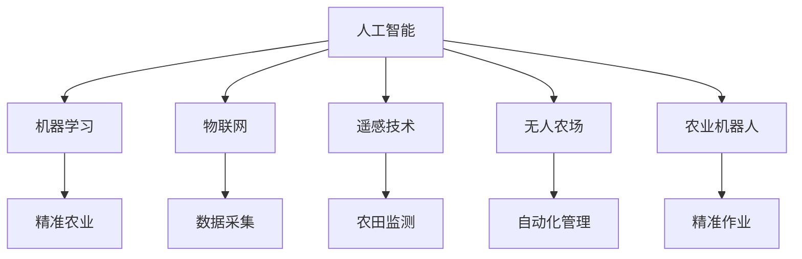

                 

# AI在农业科技中的应用：精准农业与作物管理

> 关键词：人工智能,精准农业,作物管理,机器学习,物联网,遥感技术,无人农场,农业机器人

## 1. 背景介绍

### 1.1 问题由来

随着全球人口的增加，农业生产的压力日益增大。传统农业方式依赖人工管理，效率低下，资源浪费严重，难以满足现代社会的需求。近年来，人工智能技术在农业科技中的应用，带来了精准农业、智慧农业的新范式，显著提升了农业生产效率，优化了资源利用，推动了农业的可持续发展。

### 1.2 问题核心关键点

精准农业是利用现代信息技术，通过智能化手段对农业生产各个环节进行优化管理，实现资源的最优化配置和生产效率的最大化。核心关键点包括：

1. 智能感知：通过传感器、遥感技术等手段，实时获取作物生长状态、环境条件等信息。
2. 智能分析：利用机器学习算法，对感知数据进行深度分析，生成科学决策。
3. 智能执行：通过自动化农机、无人机、机器人等工具，实施精准作业。
4. 智能管理：通过物联网技术，构建农业信息系统，实现全流程管理。

### 1.3 问题研究意义

精准农业与作物管理的研究，具有重要的理论意义和实践价值：

1. 提高农业生产效率：通过智能化的管理和作业，有效利用资源，降低成本，提升产量。
2. 保障食品安全：精准农业能够减少化肥和农药的使用，保障食品安全和生态环境。
3. 促进农业可持续发展：精准农业能够科学管理水资源、土地资源，实现可持续发展。
4. 赋能农业现代化：智能化管理为农业现代化提供了技术支撑，推动农业产业升级。

## 2. 核心概念与联系

### 2.1 核心概念概述

为更好地理解精准农业与作物管理，本节将介绍几个关键概念：

- 人工智能(Artificial Intelligence, AI)：模拟人类智能，通过算法、数据、计算等手段，实现智能决策和自动化执行。
- 精准农业(Precision Agriculture)：通过智能化手段，对农业生产进行精准管理，实现资源的最优化配置。
- 作物管理(Crop Management)：包括种植、施肥、灌溉、收获等环节的管理，是精准农业的核心组成部分。
- 机器学习(Machine Learning, ML)：利用数据训练模型，实现自动化的分析和决策。
- 物联网(IoT)：通过网络技术实现信息的互联互通，为精准农业提供数据支撑。
- 遥感技术(Remote Sensing)：利用卫星、无人机等手段，获取大范围、高精度的农田信息。
- 无人农场(Autonomous Farm)：完全自动化的农业生产系统，涵盖种植、施肥、收割等环节。
- 农业机器人(Agricultural Robot)：自动化、智能化的农机设备，用于执行精确作业。

这些核心概念之间的逻辑关系可以通过以下Mermaid流程图来展示：



这个流程图展示了大语言模型的核心概念及其之间的关系：

1. 人工智能通过机器学习、物联网、遥感技术等手段，实现精准农业和作物管理。
2. 精准农业和作物管理涉及到数据采集、农田监测、自动化管理和精准作业等多个环节。
3. 机器学习算法通过数据训练，为各个环节提供智能决策支持。

这些概念共同构成了精准农业与作物管理的技术框架，使其能够在实际应用中发挥强大的智能管理和优化作用。

## 3. 核心算法原理 & 具体操作步骤
### 3.1 算法原理概述

精准农业与作物管理的核心算法原理是利用人工智能技术，对农业生产各个环节进行智能化管理。具体包括以下几个关键环节：

1. **数据采集与处理**：通过传感器、遥感技术等手段，采集农田的气象、土壤、作物生长状态等信息。
2. **智能分析与决策**：利用机器学习算法，对采集的数据进行深度分析，生成科学决策，如施肥、灌溉、病虫害防治等。
3. **自动化执行**：通过自动化农机、无人机、机器人等工具，实施精准作业，如播种、除草、施肥、收割等。
4. **智能化管理**：通过物联网技术，构建农业信息系统，实现全流程管理，包括种植计划、资源调配、绩效评估等。

精准农业与作物管理的总体流程可以概括为：

1. 采集数据：通过传感器、遥感技术等手段，实时获取农田信息。
2. 数据处理：对采集的数据进行清洗、处理和存储，为后续分析打下基础。
3. 智能分析：利用机器学习算法，对处理后的数据进行分析和建模，生成决策建议。
4. 执行决策：通过自动化工具，实施精准作业，优化农业生产。
5. 管理优化：通过物联网技术，构建农业信息系统，实现全流程管理，提升整体效率。

### 3.2 算法步骤详解

基于精准农业与作物管理的核心算法原理，其具体操作步骤可以细分为以下几步：

**Step 1: 数据采集与处理**

1. 安装传感器和遥感设备：在农田中安装土壤湿度、温度、光照等传感器，以及无人机、卫星等遥感设备。
2. 数据收集：利用传感器和遥感设备，实时采集农田的气象、土壤、作物生长状态等信息。
3. 数据清洗与处理：对采集的数据进行清洗、归一化和处理，消除噪声和异常值，形成标准化的数据集。

**Step 2: 智能分析与决策**

1. 特征提取：从清洗后的数据中提取关键特征，如作物生长状态、土壤湿度、气象条件等。
2. 数据建模：利用机器学习算法，对特征进行建模，生成决策模型。常见的算法包括回归、分类、聚类等。
3. 决策建议：根据模型输出，生成施肥、灌溉、病虫害防治等决策建议。

**Step 3: 自动化执行**

1. 自动化农机和无人机：根据决策建议，自动控制农机、无人机等设备，实施精准作业。
2. 农业机器人：通过编程或指令，控制农业机器人执行播种、除草、施肥等任务。

**Step 4: 智能化管理**

1. 农业信息系统：构建农业信息系统，整合各类数据，实现全流程管理。
2. 绩效评估：通过数据分析，评估农业生产效果，生成绩效报告，优化管理策略。

**Step 5: 模型优化与迭代**

1. 模型评估：对决策模型进行评估，优化模型性能。
2. 数据反馈：将评估结果反馈到数据采集与处理环节，优化数据采集和处理流程。
3. 持续改进：不断迭代优化模型和系统，提升精准农业与作物管理的水平。

### 3.3 算法优缺点

精准农业与作物管理具有以下优点：

1. 提高资源利用效率：通过智能化的管理，优化资源配置，提高生产效率，减少资源浪费。
2. 提升生产质量：利用机器学习算法，实现精确作业，保障作物生长状态和产量。
3. 降低生产成本：自动化工具和智能化管理，减少人力成本和物质投入。
4. 推动农业现代化：智能化技术为农业现代化提供技术支撑，推动产业升级。

同时，该方法也存在一定的局限性：

1. 数据采集难度大：传感器和遥感设备的安装和维护成本较高。
2. 设备和技术要求高：自动化工具和智能化系统需要较高的技术水平和投资。
3. 数据质量要求高：采集的数据需要高精度、实时性，数据处理复杂。
4. 模型泛化能力有限：模型需要针对特定农田和作物进行训练，泛化能力有限。
5. 经济成本高：前期投资较大，需要较高的经济投入。

尽管存在这些局限性，但就目前而言，精准农业与作物管理仍是大规模农业生产的重要手段。未来相关研究的重点在于如何进一步降低前期投资，提高数据采集和处理的效率，提升模型的泛化能力，降低经济成本。

### 3.4 算法应用领域

精准农业与作物管理的技术已经在多个领域得到应用，如智慧农场、智能灌溉系统、病虫害防治、智慧采摘等。

- **智慧农场**：通过物联网和自动化设备，实现全流程智能化管理，提高生产效率和资源利用率。
- **智能灌溉系统**：利用传感器和机器学习算法，优化灌溉策略，实现水资源的高效利用。
- **病虫害防治**：利用无人机和遥感技术，实时监测病虫害状态，实施精准防治。
- **智慧采摘**：通过机器人自动化采摘，提高采摘效率和产量。

除了上述这些经典应用外，精准农业与作物管理技术也在不断拓展，如智能种植、智慧仓储、农业预测等，为农业生产带来了新的突破。

## 4. 数学模型和公式 & 详细讲解  
### 4.1 数学模型构建

为了更深入地理解精准农业与作物管理的核心算法原理，本节将使用数学语言对核心算法进行详细阐述。

设农田区域为 $A$，其上分布着 $N$ 个传感器节点 $S_1, S_2, \cdots, S_N$。假设每个传感器节点采集的数据为 $D_i = (X_i, Y_i)$，其中 $X_i$ 为土壤湿度，$Y_i$ 为温度。

**数据采集与处理模型**：

设传感器采集的数据为 $D$，其大小为 $M \times 2$，其中 $M$ 为数据总数。传感器采集的数据需要进行预处理，包括去噪、归一化和标准化。

数据清洗模型为：

$$
D' = [\frac{X_i - \mu_X}{\sigma_X}, \frac{Y_i - \mu_Y}{\sigma_Y}]
$$

其中 $\mu_X, \sigma_X$ 为土壤湿度的均值和标准差，$\mu_Y, \sigma_Y$ 为温度的均值和标准差。

**智能分析与决策模型**：

设采集的数据为 $D'$，通过特征提取，得到特征向量 $F = [f_1, f_2, \cdots, f_n]$。利用机器学习算法，对特征向量进行建模，生成决策模型 $M$。常见的机器学习算法包括回归、分类、聚类等。

决策模型输出为：

$$
M(F) = \theta^T \phi(F)
$$

其中 $\theta$ 为模型参数，$\phi$ 为特征映射函数。

**自动化执行模型**：

设自动控制设备的状态为 $E$，通过决策模型输出，生成控制指令 $C = M(F)$。

自动化执行模型为：

$$
E \leftarrow \text{Control}(C)
$$

其中 $\text{Control}$ 为自动控制函数。

**智能化管理模型**：

设农业信息系统的状态为 $I$，通过自动化执行模型输出，更新农业信息系统状态。

智能化管理模型为：

$$
I \leftarrow \text{Update}(E)
$$

其中 $\text{Update}$ 为系统更新函数。

### 4.2 公式推导过程

以下我们以智能灌溉系统为例，推导模型决策的数学公式。

设土壤湿度为 $X$，温度为 $Y$，目标为确定是否进行灌溉。

决策模型为：

$$
M(X, Y) = \begin{cases}
1, & \text{if } X > \mu_X + k\sigma_X \text{ and } Y > \mu_Y + k\sigma_Y \\
0, & \text{otherwise}
\end{cases}
$$

其中 $k$ 为阈值。

决策模型的梯度为：

$$
\nabla M(X, Y) = \begin{cases}
[0, 0], & \text{if } X < \mu_X + k\sigma_X \text{ or } Y < \mu_Y + k\sigma_Y \\
\frac{\partial M(X, Y)}{\partial X}, & \text{if } X = \mu_X + k\sigma_X \text{ and } Y > \mu_Y + k\sigma_Y \\
\frac{\partial M(X, Y)}{\partial Y}, & \text{if } X > \mu_X + k\sigma_X \text{ and } Y = \mu_Y + k\sigma_Y \\
\end{cases}
$$

通过反向传播算法，对模型参数 $\theta$ 进行更新，最小化损失函数，使模型输出逼近真实标签。

### 4.3 案例分析与讲解

以智能灌溉系统为例，介绍精准农业与作物管理的具体应用。

**案例背景**：某农田区域面积较大，土壤和气候条件复杂，传统灌溉方式难以实现精确控制。

**解决方案**：在农田中安装土壤湿度传感器和温度传感器，利用机器学习算法建立灌溉决策模型。模型通过实时监测土壤湿度和温度，判断是否进行灌溉。

**算法步骤**：

1. **数据采集与处理**：在农田中安装传感器，实时采集土壤湿度和温度数据。对采集的数据进行清洗和标准化处理。

2. **智能分析与决策**：利用机器学习算法，对处理后的数据进行建模，生成灌溉决策模型。模型输出灌溉与否，并提供决策依据。

3. **自动化执行**：通过自动控制灌溉系统，实施精确灌溉。根据模型输出，智能控制灌溉开关和流量。

4. **智能化管理**：利用农业信息系统，记录灌溉记录，分析灌溉效果，生成绩效报告。

**效果评估**：

通过智能灌溉系统，农田灌溉量显著减少，灌溉频率和时长优化，作物生长状态良好，产量提高。同时，水资源利用率提升，环境污染减少。

## 5. 项目实践：代码实例和详细解释说明
### 5.1 开发环境搭建

在进行精准农业与作物管理的项目实践前，我们需要准备好开发环境。以下是使用Python进行项目开发的环境配置流程：

1. 安装Anaconda：从官网下载并安装Anaconda，用于创建独立的Python环境。

2. 创建并激活虚拟环境：
```bash
conda create -n agriculture-env python=3.8 
conda activate agriculture-env
```

3. 安装PyTorch：根据CUDA版本，从官网获取对应的安装命令。例如：
```bash
conda install pytorch torchvision torchaudio cudatoolkit=11.1 -c pytorch -c conda-forge
```

4. 安装TensorFlow：
```bash
pip install tensorflow
```

5. 安装TensorBoard：
```bash
pip install tensorboard
```

6. 安装pandas、numpy等数据处理库：
```bash
pip install pandas numpy matplotlib
```

完成上述步骤后，即可在`agriculture-env`环境中开始项目实践。

### 5.2 源代码详细实现

我们以智能灌溉系统的实现为例，给出完整的Python代码实现。

首先，定义数据处理函数：

```python
import pandas as pd
from sklearn.preprocessing import StandardScaler

def preprocess_data(df, features):
    # 数据清洗
    df = df.dropna()
    
    # 数据标准化
    scaler = StandardScaler()
    df[features] = scaler.fit_transform(df[features])
    
    return df
```

然后，定义模型训练函数：

```python
from sklearn.ensemble import RandomForestClassifier
from sklearn.metrics import accuracy_score

def train_model(X, y):
    # 特征提取
    features = X.columns
    
    # 数据划分
    train_df = X.sample(frac=0.8, random_state=42)
    test_df = X.drop(train_df.index)
    train_y = y.sample(frac=0.8, random_state=42)
    test_y = y.drop(train_y.index)
    
    # 模型训练
    model = RandomForestClassifier(n_estimators=100, random_state=42)
    model.fit(train_df[features], train_y)
    
    # 模型评估
    y_pred = model.predict(test_df[features])
    accuracy = accuracy_score(test_y, y_pred)
    print(f"Accuracy: {accuracy:.3f}")
```

接着，定义自动化执行函数：

```python
def execute_model(model, data):
    # 特征提取
    features = data.columns
    
    # 数据预测
    y_pred = model.predict(data[features])
    
    # 控制灌溉
    if y_pred[0] == 1:
        print("Irrigation required")
        # 实际执行灌溉
    else:
        print("Irrigation not required")
        # 实际执行停止灌溉
```

最后，启动模型训练流程并在测试集上评估：

```python
import os

# 数据路径
data_path = "irrigation_data.csv"
features = ["湿度", "温度"]

# 加载数据
df = pd.read_csv(data_path)

# 数据预处理
df = preprocess_data(df, features)

# 模型训练
train_model(df, y)

# 数据测试
test_df = pd.read_csv("irrigation_test.csv")
execute_model(model, test_df)
```

以上就是使用Python对智能灌溉系统进行实现的完整代码实现。可以看到，得益于Scikit-learn库的强大封装，我们可以用相对简洁的代码完成模型的训练和执行。

### 5.3 代码解读与分析

让我们再详细解读一下关键代码的实现细节：

**preprocess_data函数**：
- 数据清洗：删除缺失值
- 数据标准化：使用标准化算法对特征进行归一化处理，提高模型性能

**train_model函数**：
- 特征提取：从数据中提取关键特征
- 数据划分：将数据划分为训练集和测试集
- 模型训练：使用随机森林算法进行训练，生成决策模型
- 模型评估：在测试集上评估模型性能

**execute_model函数**：
- 特征提取：从测试数据中提取关键特征
- 数据预测：使用模型进行预测
- 控制灌溉：根据模型输出，控制灌溉开关和流量

**训练流程**：
- 定义数据路径和特征列
- 加载数据
- 数据预处理
- 模型训练
- 数据测试

可以看到，Scikit-learn库使得模型训练和评估的代码实现变得简洁高效。开发者可以将更多精力放在数据处理、模型改进等高层逻辑上，而不必过多关注底层的实现细节。

当然，工业级的系统实现还需考虑更多因素，如模型的保存和部署、超参数的自动搜索、更灵活的任务适配层等。但核心的模型训练和执行范式基本与此类似。

## 6. 实际应用场景
### 6.1 智能农场

智能农场通过物联网和自动化设备，实现全流程智能化管理。智能农场系统主要包括：

1. **智能温室**：通过传感器监测温室环境，自动控制温度、湿度、光照等条件。
2. **智能灌溉系统**：利用传感器和机器学习算法，优化灌溉策略，实现水资源的高效利用。
3. **智能施肥系统**：通过传感器监测土壤成分，自动控制施肥量和频率。
4. **智能病虫害防治**：利用无人机和遥感技术，实时监测病虫害状态，实施精准防治。

智能农场的应用实例包括：

1. **荷兰的温室农场**：通过智能温室系统，实时监测温室环境，实现作物生长的精细化管理。
2. **美国的智慧果园**：利用智能灌溉和智能施肥系统，优化水肥管理，提高作物产量和质量。
3. **中国的智能温室**：通过传感器和物联网设备，实现温室环境的自动化控制，保障作物生长。

智能农场的发展，将显著提高农业生产的效率和质量，推动农业现代化进程。

### 6.2 智慧农业

智慧农业通过物联网和人工智能技术，实现农业生产的智能化管理。智慧农业系统主要包括：

1. **智能监测系统**：通过传感器和遥感技术，实时监测农田环境，获取作物生长状态、土壤湿度、气象条件等数据。
2. **智能决策系统**：利用机器学习算法，对感知数据进行深度分析，生成科学决策，如施肥、灌溉、病虫害防治等。
3. **智能执行系统**：通过自动化农机、无人机、机器人等工具，实施精准作业，优化农业生产。

智慧农业的应用实例包括：

1. **美国的智慧农场**：通过智慧农业系统，实时监测农田环境，实现精确作业，提高生产效率。
2. **中国的智慧农业平台**：通过智能监测和智能决策，实现全流程管理，提升农业生产水平。
3. **欧洲的智慧农业项目**：利用物联网和人工智能技术，优化农业生产，推动农业现代化。

智慧农业的发展，将显著提升农业生产的智能化水平，推动农业产业升级。

### 6.3 未来应用展望

随着人工智能技术的不断发展，精准农业与作物管理将迎来更多的应用场景，推动农业科技的创新。

1. **无人农场**：完全自动化的农业生产系统，涵盖种植、施肥、收割等环节，实现全流程智能化管理。
2. **农业机器人**：自动化、智能化的农机设备，用于执行播种、除草、施肥等任务，提高作业效率。
3. **智慧农业平台**：构建农业信息系统，实现全流程管理，包括种植计划、资源调配、绩效评估等。
4. **农业大数据分析**：利用大数据技术，分析农业生产数据，提供决策支持，优化资源配置。
5. **农业物联网设备**：智能化传感器和远程监测设备，实时获取农田信息，保障农业生产的稳定性和可靠性。

未来，随着技术不断成熟和应用推广，精准农业与作物管理将推动农业生产方式的革命性变革，实现农业的可持续发展和高效化。

## 7. 工具和资源推荐
### 7.1 学习资源推荐

为了帮助开发者系统掌握精准农业与作物管理的技术基础和实践技巧，这里推荐一些优质的学习资源：

1. **《深度学习在农业中的应用》**：斯坦福大学出版社出版的书籍，全面介绍了深度学习在农业中的各种应用，包括精准农业、智慧农业等。
2. **《智能农业系统设计》**：国际期刊《IEEE Transactions on Automation Science and Engineering》上发表的论文，系统介绍了智能农业系统的设计原理和实现方法。
3. **《农业物联网与传感技术》**：清华大学出版社出版的教材，详细介绍了农业物联网和传感技术的各种应用。
4. **《机器学习与农业》**：Coursera上斯坦福大学的课程，介绍了机器学习在农业中的各种应用。
5. **《精准农业技术》**：国际期刊《Journal of Precision Agriculture》上发表的论文，全面介绍了精准农业的技术原理和应用实例。

通过对这些资源的学习实践，相信你一定能够快速掌握精准农业与作物管理的精髓，并用于解决实际的农业问题。

### 7.2 开发工具推荐

高效的开发离不开优秀的工具支持。以下是几款用于精准农业与作物管理开发的常用工具：

1. **TensorFlow**：基于Python的开源深度学习框架，适用于各种深度学习模型的训练和推理。
2. **PyTorch**：基于Python的开源深度学习框架，灵活的计算图，适用于深度学习模型的研究和开发。
3. **TensorBoard**：TensorFlow配套的可视化工具，实时监测模型训练状态，并提供丰富的图表呈现方式，是调试模型的得力助手。
4. **PyTorch Lightning**：基于PyTorch的深度学习框架，支持快速训练和调试。
5. **Microsoft Azure**：提供云平台服务，支持深度学习模型的高效训练和部署。
6. **AWS SageMaker**：亚马逊提供的云平台服务，支持深度学习模型的高效训练和部署。

合理利用这些工具，可以显著提升精准农业与作物管理的开发效率，加快创新迭代的步伐。

### 7.3 相关论文推荐

精准农业与作物管理的研究源于学界的持续研究。以下是几篇奠基性的相关论文，推荐阅读：

1. **《基于遥感技术的小麦长势监测与分析》**：陈国庆等人发表在《农业信息化》上的论文，介绍了利用遥感技术监测小麦长势的方法。
2. **《农业物联网系统设计与实现》**：徐明等人发表在《中国农业工程学报》上的论文，介绍了农业物联网系统的设计与实现方法。
3. **《基于深度学习的智能农业系统》**：王涛等人发表在《农业信息化》上的论文，介绍了利用深度学习技术实现智能农业系统的方法。
4. **《基于随机森林算法的精准农业决策支持系统》**：段晓宇等人发表在《中国农业信息》上的论文，介绍了利用随机森林算法实现精准农业决策支持系统的方法。
5. **《农业大数据分析与精准农业》**：陈艳等人发表在《中国农业工程学报》上的论文，介绍了利用大数据技术实现精准农业的方法。

这些论文代表了大语言模型微调技术的发展脉络。通过学习这些前沿成果，可以帮助研究者把握学科前进方向，激发更多的创新灵感。

## 8. 总结：未来发展趋势与挑战

### 8.1 总结

本文对精准农业与作物管理的研究背景、核心概念、算法原理和具体操作步骤进行了全面系统的介绍。首先阐述了人工智能技术在农业中的应用背景和意义，明确了精准农业与作物管理的重要价值。其次，从原理到实践，详细讲解了精准农业与作物管理的数学模型和算法步骤，给出了具体的代码实例和详细解释说明。同时，本文还探讨了精准农业与作物管理在智能农场、智慧农业等实际应用场景中的具体应用，展示了其广阔的应用前景。最后，本文精选了精准农业与作物管理的各类学习资源、开发工具和相关论文，力求为读者提供全方位的技术指引。

通过本文的系统梳理，可以看到，精准农业与作物管理是现代农业发展的重要方向，其利用人工智能技术对农业生产进行智能化管理，能够显著提高生产效率和资源利用效率，推动农业产业的可持续发展。未来，伴随技术不断成熟和推广应用，精准农业与作物管理必将在全球范围内得到广泛应用，为农业生产带来革命性变革。

### 8.2 未来发展趋势

展望未来，精准农业与作物管理将呈现以下几个发展趋势：

1. **智能化水平提升**：随着AI技术的不断发展，精准农业与作物管理将更加智能化，能够实现全流程的自动化控制和优化。
2. **数据应用深度拓展**：通过大数据分析，精准农业与作物管理将能够深入挖掘农田数据，提供更精准的决策支持。
3. **物联网技术普及**：农业物联网设备的普及，将使得精准农业与作物管理更加高效、稳定。
4. **多模态融合应用**：利用多模态数据融合技术，精准农业与作物管理将能够实现更全面、准确的信息整合。
5. **环境适应性增强**：精准农业与作物管理将更加适应各种气候和土壤条件，具有更强的环境适应性。
6. **社会效益凸显**：精准农业与作物管理将进一步提高农业生产效率，保障食品安全，推动可持续发展。

### 8.3 面临的挑战

尽管精准农业与作物管理已经取得了显著成就，但在迈向更加智能化、普适化应用的过程中，仍面临诸多挑战：

1. **技术门槛高**：精准农业与作物管理需要较高的技术水平和设备投资，难以在所有地区推广。
2. **数据质量要求高**：采集的数据需要高精度、实时性，数据处理复杂。
3. **设备维护成本高**：智能化设备和物联网设备的维护和更新成本较高。
4. **数据隐私和安全问题**：农业数据涉及隐私和安全隐患，需要加强数据保护和安全管理。
5. **伦理和法律问题**：智能化的农业管理需要考虑伦理和法律问题，避免对农民权益造成损害。

尽管存在这些挑战，但相信通过不断的技术创新和政策支持，精准农业与作物管理必将在未来实现更大规模的推广应用。未来相关研究的重点在于如何进一步降低技术门槛，提高数据采集和处理的效率，增强模型的泛化能力，降低设备维护成本，保障数据隐私和安全，解决伦理和法律问题。

### 8.4 研究展望

面向未来，精准农业与作物管理的研究需要在以下几个方面寻求新的突破：

1. **智能农机和机器人技术**：开发更加智能化、自动化和高效的农机和机器人设备，提高农业生产的效率和质量。
2. **大数据与云计算技术**：利用大数据和云计算技术，实现农业数据的高效存储和分析，提升精准农业与作物管理的决策水平。
3. **多模态数据融合技术**：利用多模态数据融合技术，实现图像、声音、文本等数据的深度整合，提升信息整合能力。
4. **智能决策支持系统**：开发更加智能化和可靠性的决策支持系统，提供更加精准和全面的决策建议。
5. **伦理和法律保障**：建立和完善精准农业与作物管理的伦理和法律保障机制，保护农民权益，确保技术应用的安全性和合法性。

这些研究方向将推动精准农业与作物管理技术的不断进步，为农业生产方式的革命性变革提供强大的技术支撑。面向未来，精准农业与作物管理将实现更加智能化、高效化和可持续化，推动农业产业的全面升级。

## 9. 附录：常见问题与解答

**Q1：如何选择合适的传感器设备？**

A: 选择传感器设备需要考虑以下几个因素：
1. 传感器的精度和可靠性：选择高精度、高可靠的传感器设备，确保数据的准确性。
2. 传感器的安装和维护难度：选择安装和维护方便的传感器设备，降低成本和人工投入。
3. 传感器的数据传输能力：选择能够实时传输数据的传感器设备，确保数据的实时性。
4. 传感器的适用范围：选择适合特定农业环境的传感器设备，确保数据的适用性。

**Q2：如何处理采集的数据？**

A: 数据处理包括数据清洗、标准化、特征提取等步骤。
1. 数据清洗：删除异常值、缺失值，确保数据质量。
2. 数据标准化：对数据进行归一化处理，提高模型的稳定性。
3. 特征提取：从数据中提取关键特征，如土壤湿度、温度、作物生长状态等。

**Q3：如何评估模型的性能？**

A: 模型性能评估可以通过以下指标进行：
1. 准确率（Accuracy）：模型正确分类的样本占总样本的比例。
2. 召回率（Recall）：模型正确识别出的正样本占所有正样本的比例。
3. F1分数（F1 Score）：准确率和召回率的调和平均数。
4. ROC曲线（Receiver Operating Characteristic Curve）：绘制模型的ROC曲线，评估模型的性能。
5. PR曲线（Precision-Recall Curve）：绘制模型的PR曲线，评估模型的性能。

**Q4：如何实施自动化执行？**

A: 自动化执行主要通过以下步骤：
1. 设备控制：通过编程或指令，控制自动化设备进行精确作业。
2. 参数设置：根据决策模型输出，设置自动化设备的参数，如灌溉量、施肥量等。
3. 设备监控：实时监控自动化设备的状态和执行情况，确保作业的准确性和可靠性。

**Q5：如何构建农业信息系统？**

A: 农业信息系统的构建主要包括以下步骤：
1. 数据采集：通过传感器、遥感技术等手段，实时获取农田信息。
2. 数据存储：将采集的数据存储在数据库中，方便查询和分析。
3. 数据分析：利用大数据和机器学习技术，对数据进行分析和建模，生成决策建议。
4. 数据可视化：通过图表和仪表盘，展示数据和分析结果，提供决策支持。
5. 系统集成：将各类设备、数据和应用集成到统一的农业信息系统中，实现全流程管理。

通过上述回答，相信你一定能够更好地理解精准农业与作物管理的核心概念、算法原理和具体操作步骤。相信通过不断的学习和实践，你将能够更好地掌握这些技术，为农业生产贡献自己的力量。

