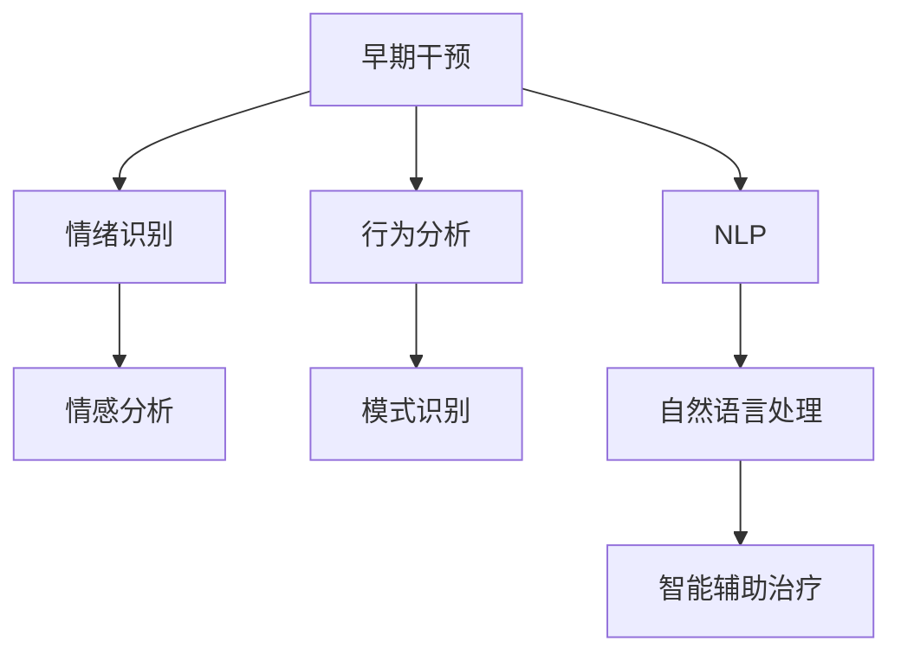

                 

# AI在心理健康领域的应用:早期干预与治疗

> 关键词：人工智能,心理健康,早期干预,心理治疗,机器学习,自然语言处理,情感分析,行为分析

## 1. 背景介绍

### 1.1 问题由来
随着现代生活节奏的加快和社会压力的增加，心理健康问题已逐渐成为影响人们生活质量的重要因素。传统的心理健康服务往往依赖于专业心理咨询师，但面对庞大的潜在需求，专业人员的短缺与需求之间存在着巨大的差距。而人工智能技术的进步，为心理健康领域的早期干预与治疗提供了新的可能性。

### 1.2 问题核心关键点
在心理健康领域，早期干预和心理治疗是两个重要的环节。早期干预旨在通过识别心理健康问题的早期迹象，及时提供必要的心理支持，防止问题的进一步恶化；心理治疗则是针对已出现心理问题的个体，通过各种心理疗法和技术手段，帮助其恢复心理健康。AI在早期干预和心理治疗中的应用，主要通过以下几个方面实现：

1. **情绪识别与情感分析**：通过分析个体的情绪表达和情感状态，早期识别心理健康问题的迹象。
2. **行为分析与模式识别**：通过分析个体的行为模式和活动轨迹，识别出可能的心理健康问题。
3. **自然语言处理**：通过处理个体的文本交流内容，识别其心理状态和需求。
4. **智能辅助治疗**：通过聊天机器人、虚拟助手等工具，为个体提供心理支持和治疗建议。

## 2. 核心概念与联系

### 2.1 核心概念概述

为更好地理解AI在心理健康领域的早期干预与治疗，本节将介绍几个密切相关的核心概念：

- **人工智能(AI)**：通过机器学习和深度学习技术，使计算机系统能够模拟人类智能，解决复杂问题。
- **心理健康**：涉及个体的心理状态、情绪和行为，以及如何通过各种手段和措施维持或改善这些状态。
- **早期干预**：在问题出现早期即采取措施，防止问题发展为更严重的心理障碍。
- **心理治疗**：通过专业方法，帮助个体解决心理问题，恢复心理健康。
- **机器学习(ML)**：一种利用数据训练模型，使计算机系统能够从数据中学习规律，进行预测和决策的技术。
- **自然语言处理(NLP)**：使计算机能够理解、处理和生成人类语言的技术。
- **情感分析**：通过分析文本、语音等形式的数据，识别和理解人类的情感状态。
- **行为分析**：通过分析个体的行为模式和轨迹，预测其心理状态和行为倾向。

这些核心概念之间的逻辑关系可以通过以下Mermaid流程图来展示：



这个流程图展示了大语言模型在心理健康领域的核心应用，从情绪识别到智能辅助治疗的各个环节，体现了AI在心理健康领域的多样性和深度。

## 3. 核心算法原理 & 具体操作步骤

### 3.1 算法原理概述

AI在心理健康领域的早期干预与治疗，主要是通过数据驱动的方法来实现的。具体而言，包括以下几个步骤：

1. **数据收集**：收集个体的情绪、行为、文本交流等数据。
2. **特征提取**：从收集的数据中提取有用的特征，如文本情感、行为模式等。
3. **模型训练**：使用机器学习算法，训练模型识别情绪和行为模式，预测心理健康问题。
4. **早期干预**：基于模型的预测结果，及时采取干预措施，防止问题恶化。
5. **心理治疗**：利用智能辅助治疗工具，如聊天机器人、虚拟助手等，为个体提供心理支持和治疗建议。

### 3.2 算法步骤详解

以情绪识别为例，以下是具体的算法步骤：

1. **数据准备**：收集个体的情绪数据，如文本、语音、表情等。
2. **特征工程**：将收集到的数据转换为可供机器学习模型处理的特征向量，如文本的情感得分、语音的音调等。
3. **模型训练**：使用机器学习算法，如支持向量机(SVM)、随机森林(Random Forest)、神经网络(NN)等，训练模型识别个体的情绪状态。
4. **模型评估**：在测试数据集上评估模型的性能，如准确率、召回率、F1分数等。
5. **部署应用**：将训练好的模型部署到实际应用中，实时分析个体的情绪状态，及时采取干预措施。

### 3.3 算法优缺点

AI在心理健康领域的早期干预与治疗具有以下优点：

1. **效率高**：AI系统可以24小时不间断地监测个体情绪和行为，及时识别心理健康问题的早期迹象。
2. **覆盖广**：AI系统可以处理大规模数据，适用于各种心理健康问题的识别和干预。
3. **数据驱动**：基于实际数据的训练和预测，使得AI系统的干预措施更具针对性和有效性。

同时，也存在一些缺点：

1. **隐私问题**：处理个体数据可能涉及隐私问题，需要谨慎处理和保护。
2. **数据质量**：模型的性能依赖于数据的质量和代表性，数据偏差可能导致预测不准确。
3. **解释性不足**：AI系统的决策过程往往是黑盒的，难以解释和理解。
4. **伦理问题**：AI系统的应用可能引发伦理和法律问题，需要仔细考虑。

### 3.4 算法应用领域

AI在心理健康领域的早期干预与治疗，已经在多个实际应用中取得了显著成效，包括：

1. **心理健康评估**：通过分析个体的情绪、行为和文本交流数据，评估其心理健康状况，提供相应的建议和支持。
2. **情感支持聊天机器人**：提供情感支持，帮助个体缓解压力，改善情绪状态。
3. **行为分析与干预**：通过分析个体的行为模式，识别心理问题的早期迹象，及时采取干预措施。
4. **心理治疗辅助**：结合虚拟助手、智能推荐系统等工具，提供个性化的心理治疗方案和建议。

## 4. 数学模型和公式 & 详细讲解

### 4.1 数学模型构建

以情感识别为例，情感识别模型可以通过以下数学模型构建：

设情绪数据为 $X=\{x_1,x_2,...,x_n\}$，其中 $x_i$ 是第 $i$ 个样本的特征向量，如文本情感得分、语音音调等。情绪状态 $Y$ 分为积极、消极、中性等类别。情感识别模型 $M$ 可以表示为：

$$
M(x) = f(W^Tx + b)
$$

其中 $W$ 为权重矩阵，$b$ 为偏置向量，$f$ 为激活函数。通过训练模型 $M$，使 $M(x)$ 与 $Y$ 尽可能接近。

### 4.2 公式推导过程

情感识别模型的训练过程可以表示为：

$$
\min_{W,b} \frac{1}{N}\sum_{i=1}^N L(y_i,f(W^Tx_i+b))
$$

其中 $L$ 为损失函数，如交叉熵损失。通过优化算法，如梯度下降法，最小化上述损失函数，得到最优的权重矩阵 $W$ 和偏置向量 $b$。

### 4.3 案例分析与讲解

假设某用户的一天情绪变化数据如下：

| 时间 | 情绪得分 |
|------|----------|
| 8:00  | -0.5     |
| 12:00 | -0.3     |
| 16:00 | -0.1     |
| 20:00 | 0.2      |
| 24:00 | 0.5      |

通过情感识别模型，可以得到该用户的情绪状态为积极。

## 5. 项目实践：代码实例和详细解释说明

### 5.1 开发环境搭建

在进行情感识别模型实践前，我们需要准备好开发环境。以下是使用Python进行TensorFlow开发的环境配置流程：

1. 安装Anaconda：从官网下载并安装Anaconda，用于创建独立的Python环境。

2. 创建并激活虚拟环境：
```bash
conda create -n tensorflow-env python=3.8 
conda activate tensorflow-env
```

3. 安装TensorFlow：根据CUDA版本，从官网获取对应的安装命令。例如：
```bash
conda install tensorflow -c pytorch -c conda-forge
```

4. 安装TensorFlow所需依赖：
```bash
pip install numpy pandas scikit-learn matplotlib tqdm jupyter notebook ipython
```

完成上述步骤后，即可在`tensorflow-env`环境中开始情感识别模型的开发。

### 5.2 源代码详细实现

以下是使用TensorFlow实现情感识别模型的代码实现。

```python
import tensorflow as tf
from sklearn.model_selection import train_test_split
from sklearn.metrics import classification_report
from sklearn.preprocessing import LabelEncoder

# 准备数据
X = ...
y = ...

# 数据划分
X_train, X_test, y_train, y_test = train_test_split(X, y, test_size=0.2, random_state=42)

# 定义模型
model = tf.keras.Sequential([
    tf.keras.layers.Dense(64, activation='relu'),
    tf.keras.layers.Dense(64, activation='relu'),
    tf.keras.layers.Dense(3, activation='softmax')
])

# 编译模型
model.compile(optimizer='adam', loss='categorical_crossentropy', metrics=['accuracy'])

# 训练模型
model.fit(X_train, y_train, epochs=10, batch_size=32, validation_data=(X_test, y_test))

# 评估模型
y_pred = model.predict(X_test)
print(classification_report(y_test, y_pred))
```

### 5.3 代码解读与分析

让我们再详细解读一下关键代码的实现细节：

**数据准备**：
- `X` 和 `y` 分别表示情感数据和情绪状态，需要从实际数据源获取。

**模型定义**：
- 使用 `tf.keras.Sequential` 定义一个三层神经网络，其中前两层为全连接层，最后一层为输出层，激活函数为 softmax。

**模型编译**：
- 使用 `model.compile` 指定优化器、损失函数和评价指标。

**模型训练**：
- 使用 `model.fit` 对模型进行训练，设置训练轮数和批次大小。

**模型评估**：
- 使用 `model.predict` 对测试集进行预测，使用 `classification_report` 评估模型性能。

## 6. 实际应用场景

### 6.1 心理健康评估

基于情感识别技术，可以实现对个体心理健康状况的实时评估。通过分析个体的情感变化，可以及时发现心理健康问题的早期迹象，并提供相应的建议和支持。例如，一个企业可以利用情感识别技术，对员工的情绪状态进行实时监测，及时发现情绪异常的员工，并为其提供心理咨询和支持。

### 6.2 情感支持聊天机器人

情感支持聊天机器人是AI在心理健康领域的重要应用之一。通过聊天机器人与个体进行实时互动，提供情感支持，帮助其缓解压力，改善情绪状态。例如，智能情感支持聊天机器人可以用于心理健康热线、企业员工心理健康支持等场景。

### 6.3 行为分析与干预

通过分析个体的行为模式，可以识别心理健康问题的早期迹象，及时采取干预措施。例如，一个心理健康应用程序可以分析用户的行为数据，识别出其心理健康问题的早期迹象，并提供相应的建议和干预措施。

### 6.4 心理治疗辅助

结合虚拟助手、智能推荐系统等工具，可以为个体提供个性化的心理治疗方案和建议。例如，一个心理健康平台可以根据用户的情感状态和行为模式，推荐相应的心理治疗方法，并提供个性化的治疗建议。

## 7. 工具和资源推荐

### 7.1 学习资源推荐

为了帮助开发者系统掌握情感识别和心理健康领域的技术，这里推荐一些优质的学习资源：

1. **《深度学习入门》系列博文**：由大模型技术专家撰写，深入浅出地介绍了深度学习的基础知识和技术应用。
2. **CS231n《深度学习视觉识别》课程**：斯坦福大学开设的深度学习课程，涵盖计算机视觉基础和应用，适合初学者和进阶学习者。
3. **《情感分析与情绪识别》书籍**：介绍情感分析和情绪识别的基本原理和技术，结合实际案例，易于理解。
4. **Kaggle情感分析竞赛**：通过参与情感分析竞赛，实战练习情感识别技术，积累经验。
5. **Coursera《机器学习》课程**：由斯坦福大学提供，涵盖机器学习基础和高级技术，适合全面学习。

通过对这些资源的学习实践，相信你一定能够快速掌握情感识别和心理健康领域的技术，并用于解决实际问题。

### 7.2 开发工具推荐

高效的开发离不开优秀的工具支持。以下是几款用于情感识别和心理健康领域开发的常用工具：

1. **TensorFlow**：谷歌开源的深度学习框架，支持分布式训练和部署，适合大规模工程应用。
2. **PyTorch**：由Facebook开发，灵活的动态计算图，适合快速迭代研究。
3. **Keras**：简单易用的深度学习框架，适合初学者和快速原型开发。
4. **Scikit-learn**：开源机器学习库，提供了丰富的模型和工具，适合数据预处理和特征工程。
5. **TensorBoard**：TensorFlow的可视化工具，实时监测模型训练状态，提供丰富的图表呈现方式，是调试模型的得力助手。

合理利用这些工具，可以显著提升情感识别和心理健康领域开发效率，加快创新迭代的步伐。

### 7.3 相关论文推荐

情感识别和心理健康领域的研究源于学界的持续研究。以下是几篇奠基性的相关论文，推荐阅读：

1. **Attention is All You Need**：Transformer原论文，提出了注意力机制，开启了深度学习的新纪元。
2. **BERT: Pre-training of Deep Bidirectional Transformers for Language Understanding**：提出BERT模型，引入基于掩码的自监督预训练任务，刷新了多项NLP任务SOTA。
3. **Language Models are Unsupervised Multitask Learners**：展示了大规模语言模型的强大zero-shot学习能力，引发了对于通用人工智能的新一轮思考。
4. **BERT Pretraining Approach to Natural Language Processing**：提出BERT预训练方法，通过大量无标签文本数据进行预训练，取得了显著的性能提升。
5. **A Survey on Emotion Recognition Systems**：综述情感识别技术的发展历程和应用现状，提供了丰富的案例和参考文献。

这些论文代表了大语言模型在心理健康领域的应用趋势和研究前沿。通过学习这些前沿成果，可以帮助研究者把握学科前进方向，激发更多的创新灵感。

## 8. 总结：未来发展趋势与挑战

### 8.1 总结

本文对AI在心理健康领域的早期干预与治疗进行了全面系统的介绍。首先阐述了AI在心理健康领域的背景和意义，明确了情感识别和心理健康评估的核心任务。其次，从原理到实践，详细讲解了情感识别模型的数学原理和关键步骤，给出了情感识别模型开发的完整代码实例。同时，本文还探讨了情感识别模型在心理健康评估、情感支持聊天机器人、行为分析与干预等多个领域的应用前景，展示了情感识别模型的广泛应用。

通过本文的系统梳理，可以看到，情感识别技术在心理健康领域的应用正在逐渐成熟，帮助人们更好地识别和管理心理健康问题，提升心理健康水平。未来，随着情感识别技术的不断进步，相信能够为更多人群提供心理支持，为心理健康事业贡献更多的力量。

### 8.2 未来发展趋势

展望未来，情感识别技术在心理健康领域将呈现以下几个发展趋势：

1. **模型规模持续增大**：随着算力成本的下降和数据规模的扩张，情感识别模型的参数量还将持续增长。超大规模情感识别模型蕴含的丰富情感知识，有望支撑更加复杂多变的心理健康应用。
2. **多模态情感识别**：情感识别技术将逐步从单一模态（如文本、语音）扩展到多模态数据（如文本、语音、图像），通过综合不同模态的信息，提升情感识别的准确性和鲁棒性。
3. **实时情感分析**：情感识别技术将从批处理向实时分析发展，实现对个体情感的实时监测和反馈，及时采取干预措施。
4. **智能情感支持系统**：结合情感识别技术和聊天机器人、虚拟助手等工具，构建智能情感支持系统，为个体提供全天候心理支持。
5. **跨领域应用拓展**：情感识别技术将在更多领域得到应用，如医疗、教育、金融等，为不同领域的心理健康问题提供解决方案。

这些趋势凸显了情感识别技术在心理健康领域的应用前景，未来将为更多人群提供心理支持，提升心理健康水平。

### 8.3 面临的挑战

尽管情感识别技术在心理健康领域已经取得了一定的成果，但在迈向更加智能化、普适化应用的过程中，仍面临着诸多挑战：

1. **数据质量与隐私问题**：情感识别技术的性能依赖于数据的质量和代表性，数据偏差可能导致预测不准确。同时，处理个体数据可能涉及隐私问题，需要谨慎处理和保护。
2. **模型泛化能力不足**：情感识别模型面对不同的个体和环境，泛化能力往往有限。如何在各种环境下保持一致性，是未来需要解决的重要问题。
3. **计算资源消耗大**：情感识别模型的计算资源消耗较大，如何在保持性能的同时，优化计算效率，是未来需要解决的重要问题。
4. **解释性与透明度不足**：情感识别模型的决策过程往往是黑盒的，难以解释和理解。如何提高模型的解释性和透明度，是未来需要解决的重要问题。
5. **伦理与法律问题**：情感识别技术的应用可能引发伦理和法律问题，如数据隐私、算法偏见等，需要仔细考虑和解决。

### 8.4 研究展望

面对情感识别技术面临的挑战，未来的研究需要在以下几个方面寻求新的突破：

1. **数据增强与数据集多样化**：通过数据增强技术，增加情感识别模型的数据量和多样性，提升模型的泛化能力。
2. **跨模态融合技术**：研究跨模态情感识别技术，结合不同模态的数据，提升情感识别的准确性和鲁棒性。
3. **实时分析与反馈系统**：开发实时情感分析系统，实现对个体情感的实时监测和反馈，及时采取干预措施。
4. **智能情感支持系统**：结合情感识别技术和聊天机器人、虚拟助手等工具，构建智能情感支持系统，为个体提供全天候心理支持。
5. **伦理与法律研究**：研究情感识别技术的伦理与法律问题，确保数据隐私和安全，避免算法偏见，提升社会信任。

这些研究方向的探索，必将引领情感识别技术迈向更高的台阶，为构建智能、普适的情感识别系统铺平道路。面向未来，情感识别技术还需要与其他人工智能技术进行更深入的融合，如知识表示、因果推理、强化学习等，多路径协同发力，共同推动情感识别技术的发展。

## 9. 附录：常见问题与解答

**Q1：情感识别技术在心理健康领域的应用前景如何？**

A: 情感识别技术在心理健康领域具有广阔的应用前景。通过实时监测个体的情绪和行为，可以及时发现心理健康问题的早期迹象，提供相应的建议和支持，提升心理健康水平。未来，随着情感识别技术的不断进步，有望为更多人群提供心理支持，成为心理健康事业的重要工具。

**Q2：情感识别技术的优势和局限性是什么？**

A: 情感识别技术的优势包括：
1. 实时监测：情感识别技术可以实时监测个体的情绪和行为，及时发现心理健康问题的早期迹象。
2. 自动化：情感识别技术自动化程度高，减少人为干预，提高工作效率。
3. 数据驱动：情感识别技术基于实际数据训练，具有较高的准确性和可靠性。

情感识别技术的局限性包括：
1. 数据质量：情感识别技术的性能依赖于数据的质量和代表性，数据偏差可能导致预测不准确。
2. 隐私问题：处理个体数据可能涉及隐私问题，需要谨慎处理和保护。
3. 泛化能力：情感识别模型面对不同的个体和环境，泛化能力有限。
4. 计算资源：情感识别模型的计算资源消耗较大，优化计算效率是未来需要解决的重要问题。

**Q3：情感识别技术在心理健康领域的应用场景有哪些？**

A: 情感识别技术在心理健康领域的应用场景包括：
1. 心理健康评估：通过分析个体的情绪变化，评估其心理健康状况，提供相应的建议和支持。
2. 情感支持聊天机器人：提供情感支持，帮助个体缓解压力，改善情绪状态。
3. 行为分析与干预：通过分析个体的行为模式，识别心理健康问题的早期迹象，及时采取干预措施。
4. 心理治疗辅助：结合虚拟助手、智能推荐系统等工具，为个体提供个性化的心理治疗方案和建议。

**Q4：如何提升情感识别技术的泛化能力？**

A: 提升情感识别技术的泛化能力可以通过以下方法：
1. 数据增强：通过增加数据量和多样性，提升模型的泛化能力。
2. 跨模态融合：结合不同模态的数据，提升情感识别的准确性和鲁棒性。
3. 模型优化：优化模型结构和超参数，提高模型的泛化能力。
4. 鲁棒性测试：通过鲁棒性测试，评估模型的泛化能力，并进行优化。

这些方法需要在实际应用中根据具体情况进行灵活组合，才能提升情感识别技术的泛化能力。

**Q5：如何在情感识别技术中保护用户隐私？**

A: 保护用户隐私可以通过以下方法：
1. 数据匿名化：对用户数据进行匿名化处理，避免暴露用户隐私。
2. 数据加密：对用户数据进行加密处理，防止数据泄露。
3. 访问控制：对用户数据进行严格的访问控制，确保只有授权人员才能访问数据。
4. 合规性审查：确保情感识别技术的应用符合相关法律法规和标准。

这些方法需要在实际应用中根据具体情况进行灵活组合，才能有效保护用户隐私。

---

作者：禅与计算机程序设计艺术 / Zen and the Art of Computer Programming

