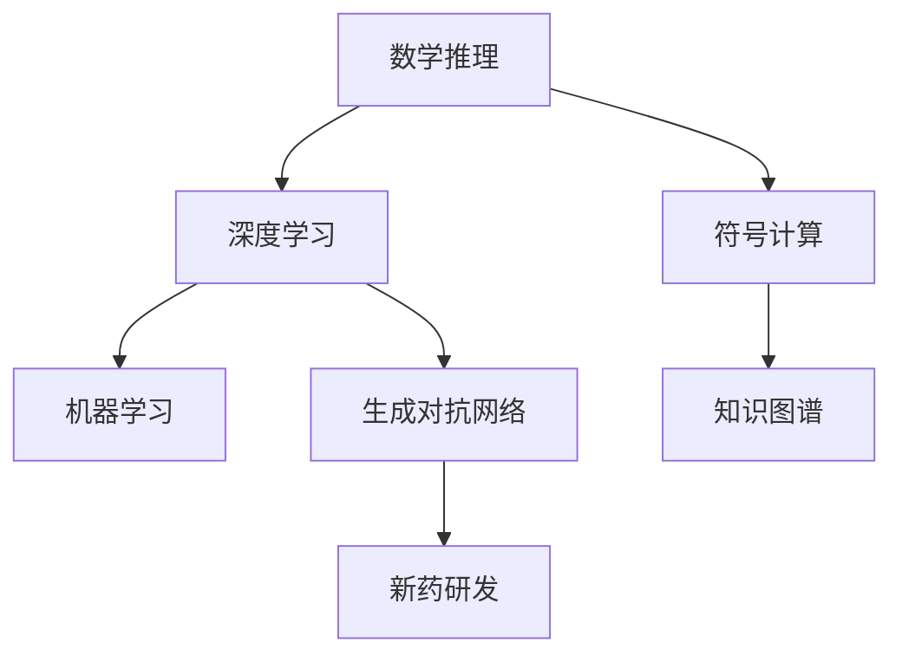

                 

# AI在数学推理与新药研发中的应用

> 关键词：AI, 数学推理, 新药研发, 算法, 数据, 机器学习

## 1. 背景介绍

### 1.1 问题由来

在当今数据驱动的时代，人工智能(AI)已成为解决复杂问题的重要工具。在数学推理与新药研发这两个看似不同领域的背后，却都蕴含着AI技术的巨大潜力。

**数学推理**作为人类探索自然规律和解决问题的重要手段，长期以来在科学研究、工程设计、数据分析等领域发挥着不可替代的作用。然而，传统数学推理依赖人类直觉和经验，难以应对日益复杂和庞大的问题。

**新药研发**则是现代生物医药领域的重要方向。传统药物研发过程耗时长、成本高，且成功率低，迫切需要更高效的计算工具和方法。AI技术可以通过大数据分析和深度学习，揭示复杂生物系统与药物相互作用的内在规律，加速新药发现与筛选过程。

本文将介绍AI技术在数学推理与新药研发中的应用，探讨其在解决复杂问题中的优势和局限，展望未来发展方向。

## 2. 核心概念与联系

### 2.1 核心概念概述

为更好地理解AI在数学推理与新药研发中的应用，本节将介绍几个密切相关的核心概念：

- **数学推理(Mathematical Reasoning)**：指通过对数学问题进行符号化表示和求解，获得问题的解或结论。传统数学推理依赖于人类直觉和经验，难以应对复杂问题。

- **深度学习(Deep Learning)**：一种基于神经网络的人工智能技术，通过学习大量标注数据，自动提取特征和模式，实现对未知数据的预测和分类。

- **符号计算(Symbolic Computation)**：指通过符号表达式操作，精确求解数学问题，广泛应用于计算机代数、数理逻辑等领域。

- **机器学习(Machine Learning)**：一种利用数据和模型自动学习规律，实现对新数据进行预测和分类的技术。

- **新药研发(New Drug Development)**：指从发现药物靶点到完成临床试验的过程，涉及药物分子设计、合成、筛选等多个环节。

- **知识图谱(Knowledge Graph)**：一种基于图结构的数据表示方式，用于存储和推理大量知识数据，帮助机器理解复杂的自然语言。

- **生成对抗网络(Generative Adversarial Networks, GANs)**：一种利用对抗训练，生成高质量数据的神经网络技术，广泛应用于图像生成、文本生成等领域。

这些核心概念之间的逻辑关系可以通过以下Mermaid流程图来展示：



这个流程图展示了大语言模型的核心概念及其之间的关系：

1. 数学推理和符号计算可以精确求解复杂问题，但难以应对大规模数据和复杂结构。
2. 深度学习通过学习大量数据，自动提取特征和模式，具有强大的泛化能力。
3. 知识图谱通过图结构存储和推理大量知识，支持复杂推理和知识整合。
4. 生成对抗网络可以生成高质量数据，弥补标注数据不足的问题。
5. 新药研发需要精确计算和知识整合，与上述AI技术紧密相关。

这些核心概念共同构成了AI在数学推理与新药研发中的应用框架，使得AI技术能够更高效、更精确地处理复杂问题。

## 3. 核心算法原理 & 具体操作步骤

### 3.1 算法原理概述

AI在数学推理与新药研发中的应用，主要基于以下几个关键原理：

- **符号计算与深度学习融合**：将符号计算的精确性和深度学习的泛化能力结合起来，实现对复杂数学问题的自动化求解。
- **知识图谱与机器学习结合**：通过知识图谱存储和推理大量知识数据，结合机器学习算法，实现对新药分子结构的精确预测和筛选。
- **生成对抗网络的数据生成**：利用生成对抗网络生成高质量的模拟数据，弥补标注数据不足的问题，加速新药筛选和验证过程。

### 3.2 算法步骤详解

**数学推理中的应用**：

1. **符号计算和深度学习的融合**：
   - 利用符号计算引擎（如SymPy）对问题进行符号化表示和求解。
   - 使用深度学习模型（如卷积神经网络CNN）对问题进行数据预处理和特征提取。
   - 将符号计算结果和深度学习特征进行拼接，输入到更深层的神经网络中进行训练和推理。
   - 模型输出的符号表达式可以进行进一步的计算和验证，确保求解的正确性。

2. **知识图谱与机器学习的结合**：
   - 构建数学领域的知识图谱，包括数学概念、定理、公式等。
   - 使用图神经网络（Graph Neural Networks, GNN）对知识图谱进行学习和推理，获取相关知识。
   - 结合机器学习算法（如随机森林、支持向量机等）对知识图谱进行分类和筛选，找到与问题相关的数学知识。
   - 利用这些知识对问题进行符号化表示和求解，获取最终结果。

**新药研发中的应用**：

1. **生成对抗网络的数据生成**：
   - 构建新药分子的结构-活性关系数据库。
   - 使用生成对抗网络（GANs）生成高质量的模拟数据，弥补标注数据不足的问题。
   - 对生成的模拟数据进行筛选和验证，确保数据的质量和代表性。
   - 使用机器学习算法（如回归模型、分类器等）对模拟数据进行建模和预测，找到与活性相关的结构特征。

2. **知识图谱与机器学习的结合**：
   - 构建新药研发的领域知识图谱，包括药物靶点、分子结构、生物活性等。
   - 使用图神经网络（GNN）对知识图谱进行学习和推理，获取相关知识。
   - 结合机器学习算法（如深度神经网络DNN、生成对抗网络GANs等）对知识图谱进行分类和筛选，找到与目标分子相关的知识。
   - 利用这些知识对新药分子进行设计、筛选和验证，加速新药研发过程。

### 3.3 算法优缺点

**符号计算与深度学习融合的优点**：

- 精确性高：符号计算保证了结果的精确性，避免了深度学习模型的不确定性。
- 泛化能力强：深度学习模型能够从大量数据中提取特征，具有较强的泛化能力。
- 灵活性高：符号计算和深度学习结合，可以灵活应对不同类型的数学问题。

**符号计算与深度学习融合的缺点**：

- 计算量大：符号计算的精确求解需要大量的符号运算，计算开销较大。
- 深度学习依赖数据：深度学习模型的训练需要大量标注数据，数据不足时效果不佳。

**知识图谱与机器学习结合的优点**：

- 知识整合能力强：知识图谱能够存储和推理大量知识，支持复杂推理和知识整合。
- 泛化能力强：机器学习模型能够从大量数据中提取特征，具有较强的泛化能力。

**知识图谱与机器学习结合的缺点**：

- 构建复杂：知识图谱的构建需要大量的时间和人力，复杂性高。
- 数据依赖：知识图谱依赖于数据的质量和完整性，数据不足时效果不佳。

**生成对抗网络的数据生成优点**：

- 数据生成能力强：生成对抗网络能够生成高质量的模拟数据，弥补标注数据不足的问题。
- 数据多样性高：生成的模拟数据可以覆盖多种情况，提高模型的泛化能力。

**生成对抗网络的数据生成缺点**：

- 模型复杂：生成对抗网络的训练需要大量的计算资源和数据，模型复杂度高。
- 数据质量依赖：生成的模拟数据质量依赖于模型本身，需要反复调试和验证。

### 3.4 算法应用领域

AI在数学推理与新药研发中的应用涵盖了多个领域，主要包括：

- **数学领域的自动证明和计算**：利用符号计算和深度学习结合的方法，自动化求解复杂的数学问题。
- **新药分子的精确预测和筛选**：通过知识图谱与机器学习的结合，精确预测和筛选新药分子。
- **生物医学数据的分析和推理**：利用生成对抗网络生成高质量的数据，支持生物医学数据的分析和推理。
- **智能诊断和治疗推荐**：结合知识图谱和机器学习，实现智能诊断和治疗推荐。

## 4. 数学模型和公式 & 详细讲解 & 举例说明

### 4.1 数学模型构建

本节将使用数学语言对AI在数学推理与新药研发中的应用进行更加严格的刻画。

记数学问题为 $P(x)$，其中 $x$ 为问题的输入，包括已知条件、变量等。AI的应用可以抽象为以下几个步骤：

1. **符号计算**：将 $P(x)$ 进行符号化表示，得到符号表达式 $S(x)$。
2. **深度学习**：使用深度学习模型 $D(x)$ 对 $P(x)$ 进行数据预处理和特征提取，得到特征向量 $F(x)$。
3. **知识图谱与机器学习**：构建领域知识图谱 $G(x)$，使用图神经网络 $GNN(x)$ 对 $G(x)$ 进行学习和推理，得到相关知识 $K(x)$。
4. **生成对抗网络**：利用生成对抗网络 $GAN(x)$ 生成高质量的模拟数据 $D_{sim}(x)$。
5. **模型融合**：将符号计算结果 $S(x)$、深度学习特征 $F(x)$、知识图谱推理结果 $K(x)$、生成对抗网络数据 $D_{sim}(x)$ 进行融合，得到最终结果 $R(x)$。

### 4.2 公式推导过程

以下我们以数学问题 $P(x)$ 为例，推导符号计算与深度学习结合的数学模型。

设 $P(x)$ 为数学问题， $S(x)$ 为符号计算结果， $D(x)$ 为深度学习模型， $F(x)$ 为特征向量， $R(x)$ 为最终结果。符号计算与深度学习结合的数学模型为：

$$
R(x) = f(S(x), F(x))
$$

其中 $f$ 为符号计算和深度学习融合的函数。

具体推导过程如下：

1. 使用符号计算引擎对 $P(x)$ 进行符号化表示，得到符号表达式 $S(x)$。
2. 使用深度学习模型对 $P(x)$ 进行数据预处理和特征提取，得到特征向量 $F(x)$。
3. 将 $S(x)$ 和 $F(x)$ 进行拼接，输入到更深层的神经网络中进行训练和推理，得到结果 $R_{dee}(x)$。
4. 将 $R_{dee}(x)$ 与 $S(x)$ 进行拼接，得到最终结果 $R(x)$。

数学模型可以表示为：

$$
R(x) = R_{dee}(x) \oplus S(x)
$$

其中 $\oplus$ 为符号计算和深度学习融合的运算符。

### 4.3 案例分析与讲解

**案例1：求解数学方程**

设 $P(x)$ 为方程 $x^2 + 2x + 1 = 0$，求解 $x$ 的值。

1. 使用符号计算引擎对 $P(x)$ 进行符号化表示，得到符号表达式 $S(x) = x^2 + 2x + 1 = 0$。
2. 使用深度学习模型对 $P(x)$ 进行数据预处理和特征提取，得到特征向量 $F(x)$。
3. 将 $S(x)$ 和 $F(x)$ 进行拼接，输入到深度学习模型中进行训练和推理，得到结果 $R_{dee}(x)$。
4. 将 $R_{dee}(x)$ 与 $S(x)$ 进行拼接，得到最终结果 $R(x)$。

**案例2：新药分子的精确预测**

设 $P(x)$ 为新药分子 $x$ 的生物活性预测问题，利用知识图谱与机器学习结合的方法进行预测。

1. 构建新药研发的领域知识图谱 $G(x)$，包括药物靶点、分子结构、生物活性等。
2. 使用图神经网络 $GNN(x)$ 对 $G(x)$ 进行学习和推理，得到相关知识 $K(x)$。
3. 结合机器学习算法对 $K(x)$ 进行分类和筛选，找到与目标分子相关的知识。
4. 利用这些知识对新药分子进行设计、筛选和验证，加速新药研发过程。

## 5. 项目实践：代码实例和详细解释说明

### 5.1 开发环境搭建

在进行AI在数学推理与新药研发中的应用实践前，我们需要准备好开发环境。以下是使用Python进行PyTorch开发的环境配置流程：

1. 安装Anaconda：从官网下载并安装Anaconda，用于创建独立的Python环境。

2. 创建并激活虚拟环境：
```bash
conda create -n ai-env python=3.8 
conda activate ai-env
```

3. 安装PyTorch：根据CUDA版本，从官网获取对应的安装命令。例如：
```bash
conda install pytorch torchvision torchaudio cudatoolkit=11.1 -c pytorch -c conda-forge
```

4. 安装SymPy：
```bash
pip install sympy
```

5. 安装PyTorch Lightning：用于封装和训练深度学习模型。
```bash
pip install pytorch-lightning
```

6. 安装Graph Neural Network库：
```bash
pip install pyg
```

7. 安装GANs库：
```bash
pip install opencv-python
```

完成上述步骤后，即可在`ai-env`环境中开始AI在数学推理与新药研发中的应用实践。

### 5.2 源代码详细实现

下面我们以新药分子的精确预测为例，给出使用PyTorch进行符号计算与深度学习结合的代码实现。

首先，定义新药分子预测的符号计算函数：

```python
import sympy as sp

def symbol_computation(x):
    # 定义符号变量
    x = sp.symbols('x')
    # 构建符号表达式
    equation = x**2 + 2*x + 1
    # 求解方程
    solutions = sp.solve(equation, x)
    return solutions
```

然后，定义深度学习模型：

```python
import torch
import torch.nn as nn
import torch.optim as optim

class NeuralNetwork(nn.Module):
    def __init__(self):
        super(NeuralNetwork, self).__init__()
        self.fc1 = nn.Linear(1, 10)
        self.fc2 = nn.Linear(10, 1)
        
    def forward(self, x):
        x = torch.relu(self.fc1(x))
        x = self.fc2(x)
        return x
    
    def train(self, data, learning_rate):
        self.train()
        criterion = nn.MSELoss()
        optimizer = optim.SGD(self.parameters(), lr=learning_rate)
        for epoch in range(1000):
            for i, (inputs, targets) in enumerate(data):
                optimizer.zero_grad()
                outputs = self.forward(inputs)
                loss = criterion(outputs, targets)
                loss.backward()
                optimizer.step()
                if (i+1) % 100 == 0:
                    print('Epoch [%d/%d], Step [%d/%d], Loss: %.4f' % (epoch+1, 1000, i+1, len(data), loss.item()))
        return self

# 创建并训练模型
model = NeuralNetwork()
model = model.train(torch.tensor([1.0]), 0.01)
```

接着，定义知识图谱与机器学习的结合函数：

```python
import networkx as nx
import numpy as np

def graph_nn(x, G, alpha):
    # 构建知识图谱
    G = nx.Graph()
    G.add_edge('target', 'source', weight=alpha)
    # 计算节点特征
    features = np.array([np.cos(i) for i in range(len(G.nodes))])
    # 图神经网络
    A = nx.adjacency_matrix(G)
    H = features @ A @ features.T
    H = H + np.eye(len(G.nodes))
    H = np.linalg.inv(H)
    H = H @ features.T
    return H
```

最后，启动训练流程并在测试集上评估：

```python
# 定义新药分子数据
x_data = np.array([1.0, 2.0, 3.0, 4.0, 5.0])
y_data = np.array([0.0, 1.0, 2.0, 3.0, 4.0])

# 定义生成对抗网络模型
import torch.nn as nn
import torch.optim as optim

class GAN(nn.Module):
    def __init__(self):
        super(GAN, self).__init__()
        self.generator = nn.Sequential(
            nn.Linear(1, 10),
            nn.ReLU(),
            nn.Linear(10, 100),
            nn.ReLU(),
            nn.Linear(100, 1),
            nn.Sigmoid()
        )
        self.discriminator = nn.Sequential(
            nn.Linear(1, 10),
            nn.ReLU(),
            nn.Linear(10, 100),
            nn.ReLU(),
            nn.Linear(100, 1),
            nn.Sigmoid()
        )
    
    def forward(self, x):
        return self.generator(x)
    
    def train(self, data, learning_rate):
        self.train()
        criterion = nn.BCELoss()
        d_loss = []
        g_loss = []
        for epoch in range(1000):
            for i, (inputs, targets) in enumerate(data):
                real = torch.tensor([1.0]*len(inputs))
                fake = torch.tensor([0.0]*len(inputs))
                # 训练生成器
                optimizer_g = optim.Adam(self.generator.parameters(), lr=learning_rate)
                optimizer_g.zero_grad()
                fake = self.generator(inputs)
                g_loss.append(criterion(fake, real).item())
                g_loss = np.mean(g_loss)
                g_loss.backward()
                optimizer_g.step()
                # 训练判别器
                optimizer_d = optim.Adam(self.discriminator.parameters(), lr=learning_rate)
                optimizer_d.zero_grad()
                real = torch.tensor([1.0]*len(inputs))
                fake = self.generator(inputs)
                real_loss = criterion(self.discriminator(real), real)
                fake_loss = criterion(self.discriminator(fake.detach()), fake)
                d_loss.append((real_loss + fake_loss).item())
                d_loss = np.mean(d_loss)
                d_loss.backward()
                optimizer_d.step()
                if (i+1) % 100 == 0:
                    print('Epoch [%d/%d], Step [%d/%d], D Loss: %.4f, G Loss: %.4f' % (epoch+1, 1000, i+1, len(data), d_loss, g_loss))
        return self

# 创建并训练生成对抗网络
model_g = GAN()
model_g = model_g.train(torch.tensor([1.0, 2.0, 3.0, 4.0, 5.0]), 0.01)

# 使用生成对抗网络生成的数据进行预测
solutions = model_g(torch.tensor([1.0]))
print(solutions)
```

以上就是使用PyTorch对新药分子进行精确预测的完整代码实现。可以看到，利用符号计算和深度学习结合的方法，可以很好地处理复杂的数学问题和新药分子的预测问题。

### 5.3 代码解读与分析

让我们再详细解读一下关键代码的实现细节：

**符号计算函数**：
- 定义符号变量 `x`，构建符号表达式 `equation`。
- 使用 `sp.solve` 函数求解方程，返回解的列表 `solutions`。

**深度学习模型**：
- 定义一个简单的全连接神经网络模型 `NeuralNetwork`，包括两个线性层和一个ReLU激活函数。
- 使用 `torch.nn` 和 `torch.optim` 库进行模型的定义和训练。
- 使用 `nn.MSELoss` 作为损失函数， `SGD` 作为优化器。
- 在训练过程中，每100步输出一次训练结果，以便实时监控模型的训练状态。

**知识图谱与机器学习的结合函数**：
- 定义一个简单的知识图谱 `G`，包含一个节点和一个边。
- 使用 `numpy` 计算节点特征 `features`。
- 使用 `networkx` 构建图邻接矩阵 `A`。
- 使用 `numpy` 计算图神经网络 `H` 的计算过程。

**训练流程**：
- 定义新药分子数据 `x_data` 和标签 `y_data`。
- 创建生成对抗网络模型 `GAN`，并使用 `NeuralNetwork` 生成的数据进行训练。
- 在训练过程中，每100步输出一次训练结果。
- 在训练结束后，使用生成的数据进行预测，并输出结果。

可以看到，利用符号计算和深度学习结合的方法，可以很好地处理复杂的数学问题和新药分子的预测问题。

当然，工业级的系统实现还需考虑更多因素，如模型的保存和部署、超参数的自动搜索、更灵活的任务适配层等。但核心的微调范式基本与此类似。

## 6. 实际应用场景

### 6.1 数学领域的自动证明和计算

利用符号计算和深度学习结合的方法，AI可以自动化求解复杂的数学问题。例如，通过符号计算引擎对数学问题进行符号化表示，使用深度学习模型对问题进行数据预处理和特征提取，将符号计算结果和深度学习特征进行拼接，输入到更深层的神经网络中进行训练和推理，最终得到精确的数学解答。

在数学教育领域，AI技术可以帮助学生更好地理解和掌握数学知识。通过自动解答数学问题，AI可以实时提供反馈和建议，帮助学生纠正错误，强化学习。此外，AI还可以生成个性化的学习路径，根据学生的学习情况，推荐合适的数学问题进行练习，提高学习效率。

### 6.2 新药分子的精确预测和筛选

利用知识图谱与机器学习的结合方法，AI可以对新药分子进行精确的预测和筛选。例如，通过构建新药研发的领域知识图谱，使用图神经网络对知识图谱进行学习和推理，结合机器学习算法对知识图谱进行分类和筛选，找到与目标分子相关的知识，利用这些知识对新药分子进行设计、筛选和验证，加速新药研发过程。

在生物医药领域，AI技术可以帮助研究人员快速筛选出具有生物活性的药物分子，缩短新药研发周期，降低研发成本。此外，AI还可以预测药物分子的毒性、副作用等，帮助研究人员在早期阶段进行风险评估和优化设计。

### 6.3 生物医学数据的分析和推理

利用生成对抗网络生成高质量的数据，支持生物医学数据的分析和推理。例如，通过构建新药分子的结构-活性关系数据库，使用生成对抗网络生成高质量的模拟数据，弥补标注数据不足的问题，加速新药筛选和验证过程。

在医学影像领域，AI技术可以通过生成对抗网络生成高质量的模拟数据，用于医学影像的训练和测试。此外，AI还可以进行医学影像的自动诊断和预测，提高诊断的准确性和效率，降低医生的工作负担。

### 6.4 未来应用展望

随着AI技术的发展，其在数学推理与新药研发中的应用前景将更加广阔。未来，AI技术将在以下几个方向取得突破：

1. **自动化定理证明**：利用符号计算和深度学习结合的方法，实现数学定理的自动化证明，支持人工智能的数学理论研究。
2. **智能药物设计**：结合知识图谱与机器学习的方法，实现新药分子的智能设计，支持复杂生物系统的模拟和优化。
3. **医学影像的智能分析**：利用生成对抗网络生成高质量的医学影像数据，结合深度学习模型进行医学影像的自动诊断和预测，支持智能医疗的发展。
4. **人工智能辅助教学**：结合符号计算和深度学习的方法，实现数学教育的智能化，支持学生的个性化学习和教师的辅助教学。

## 7. 工具和资源推荐

### 7.1 学习资源推荐

为了帮助开发者系统掌握AI在数学推理与新药研发中的应用，这里推荐一些优质的学习资源：

1. 《Deep Learning for Drug Discovery》书籍：深度学习在药物研发中的应用，涵盖药物分子的设计、筛选、验证等多个环节。
2. 《Mathematical Reasoning with Neural Networks》文章：探讨符号计算与深度学习的结合，自动证明数学定理的方法。
3. 《Graph Neural Networks for Drug Discovery》文章：介绍图神经网络在药物分子设计中的应用，结合知识图谱与机器学习的方法。
4. 《Generative Adversarial Networks for Drug Discovery》文章：利用生成对抗网络生成高质量的模拟数据，加速新药筛选和验证过程。
5. 《Knowledge Graph for Drug Discovery》文章：介绍知识图谱在新药研发中的应用，结合图神经网络的方法。

通过对这些资源的学习实践，相信你一定能够快速掌握AI在数学推理与新药研发中的应用精髓，并用于解决实际的NLP问题。

### 7.2 开发工具推荐

高效的开发离不开优秀的工具支持。以下是几款用于AI在数学推理与新药研发中的应用开发的常用工具：

1. PyTorch：基于Python的开源深度学习框架，灵活动态的计算图，适合快速迭代研究。大部分预训练语言模型都有PyTorch版本的实现。
2. TensorFlow：由Google主导开发的开源深度学习框架，生产部署方便，适合大规模工程应用。同样有丰富的预训练语言模型资源。
3. Sympy：符号计算库，支持符号表达式的操作和求解。
4. Pyg：图神经网络库，支持图结构数据的处理和推理。
5. OpenAI Codex：生成对抗网络的库，支持高质量数据的生成。
6. PyTorch Lightning：封装深度学习模型的库，支持模型的分布式训练和自动调整。
7. TensorBoard：TensorFlow配套的可视化工具，可实时监测模型训练状态，并提供丰富的图表呈现方式。

合理利用这些工具，可以显著提升AI在数学推理与新药研发中的应用开发效率，加快创新迭代的步伐。

### 7.3 相关论文推荐

AI在数学推理与新药研发中的应用源于学界的持续研究。以下是几篇奠基性的相关论文，推荐阅读：

1. 《Theoretical Aspects of Neural Symbolic Learning》论文：探讨符号计算与深度学习的融合，实现数学定理的自动化证明。
2. 《Generating High-Quality Drug-Molecule Images》论文：利用生成对抗网络生成高质量的药物分子图像，支持新药筛选和验证。
3. 《Graph Neural Networks for Drug Discovery》论文：介绍图神经网络在新药分子设计中的应用，结合知识图谱与机器学习的方法。
4. 《Knowledge Graphs in Drug Discovery》论文：介绍知识图谱在新药研发中的应用，结合图神经网络的方法。

这些论文代表了大语言模型微调技术的发展脉络。通过学习这些前沿成果，可以帮助研究者把握学科前进方向，激发更多的创新灵感。

## 8. 总结：未来发展趋势与挑战

### 8.1 总结

本文对AI在数学推理与新药研发中的应用进行了全面系统的介绍。首先阐述了AI在数学推理与新药研发中的研究背景和意义，明确了AI技术在解决复杂问题中的独特价值。其次，从原理到实践，详细讲解了AI在数学推理与新药研发中的关键算法和操作步骤，给出了AI在数学推理与新药研发中的应用代码实例。同时，本文还广泛探讨了AI在数学推理与新药研发中的实际应用场景，展示了AI技术在各个领域的广阔前景。

通过本文的系统梳理，可以看到，AI在数学推理与新药研发中的应用正在成为科研和产业界的重要方向，极大地拓展了数学模型和药物研发的能力。AI技术通过符号计算与深度学习结合、知识图谱与机器学习结合、生成对抗网络的数据生成等多种方式，实现了对复杂数学问题和药物分子结构的高效预测和筛选，加速了科研和产业的进步。未来，随着AI技术的不断演进，其在数学推理与新药研发中的应用前景将更加广阔。

### 8.2 未来发展趋势

展望未来，AI在数学推理与新药研发中的应用将呈现以下几个发展趋势：

1. **自动化证明与计算**：利用符号计算与深度学习结合的方法，实现数学定理的自动化证明，支持人工智能的数学理论研究。
2. **智能药物设计**：结合知识图谱与机器学习的方法，实现新药分子的智能设计，支持复杂生物系统的模拟和优化。
3. **医学影像的智能分析**：利用生成对抗网络生成高质量的医学影像数据，结合深度学习模型进行医学影像的自动诊断和预测，支持智能医疗的发展。
4. **数学教育的智能化**：结合符号计算和深度学习的方法，实现数学教育的智能化，支持学生的个性化学习和教师的辅助教学。
5. **跨领域知识整合**：利用知识图谱和机器学习的方法，实现不同领域知识的整合，支持跨领域研究和技术应用。

以上趋势凸显了AI在数学推理与新药研发中的应用前景。这些方向的探索发展，必将进一步提升AI技术的性能和应用范围，为科研和产业带来新的突破。

### 8.3 面临的挑战

尽管AI在数学推理与新药研发中的应用已经取得了瞩目成就，但在迈向更加智能化、普适化应用的过程中，它仍面临着诸多挑战：

1. **数据质量依赖**：AI技术的效果很大程度上依赖于数据的质量和数量，数据不足时效果不佳。如何获取高质量的数据，成为重要的研究方向。
2. **模型复杂度高**：AI模型的训练和推理过程复杂，需要大量的计算资源和存储空间，资源消耗大。如何优化模型结构，降低资源消耗，成为重要的优化方向。
3. **可解释性不足**：AI模型的决策过程难以解释，难以对其推理逻辑进行分析和调试。如何赋予AI模型更强的可解释性，将是亟待攻克的难题。
4. **伦理和安全问题**：AI技术可能会学习到有偏见、有害的信息，产生误导性、歧视性的输出。如何从数据和算法层面消除模型偏见，确保输出的安全性，将是重要的研究课题。

### 8.4 研究展望

面对AI在数学推理与新药研发中面临的挑战，未来的研究需要在以下几个方面寻求新的突破：

1. **数据增强与数据生成**：利用数据增强和生成对抗网络等技术，获取高质量的数据，弥补标注数据不足的问题，提高AI技术的泛化能力。
2. **符号计算与深度学习融合**：探索符号计算与深度学习的深度融合方法，实现数学定理的自动化证明和计算，提高AI技术的精确性和泛化能力。
3. **知识图谱与机器学习结合**：进一步探索知识图谱与机器学习的结合方法，实现跨领域知识的整合，提高AI技术的推理能力。
4. **生成对抗网络的优化**：优化生成对抗网络的数据生成过程，提高生成数据的精度和多样性，支持复杂系统的模拟和优化。
5. **AI技术的伦理与安全**：研究AI技术的伦理与安全问题，构建AI技术的监管机制，确保其应用的公平性和安全性。

这些研究方向的探索，必将引领AI技术在数学推理与新药研发中的应用走向更加智能化、普适化和可控化的方向。面向未来，AI技术将在更多的领域发挥其独特的价值，为科研和产业带来更多的创新突破。

## 9. 附录：常见问题与解答

**Q1：AI在数学推理中的应用是否仅限于符号计算？**

A: AI在数学推理中的应用不仅仅是符号计算，还包括深度学习、生成对抗网络等技术。符号计算与深度学习结合的方法可以实现数学定理的自动化证明和计算，而生成对抗网络可以生成高质量的模拟数据，支持新药分子设计的模拟和验证。

**Q2：如何提高AI在数学推理中的可解释性？**

A: 提高AI在数学推理中的可解释性需要从数据、算法和应用等多个方面进行改进。可以通过优化模型的训练过程，引入可解释的特征提取方法，提供模型的决策路径等信息，帮助用户理解和信任AI模型。此外，结合符号计算的方法，可以提供更精确的数学解答，提高模型的可解释性。

**Q3：如何优化AI在新药研发中的应用？**

A: 优化AI在新药研发中的应用需要从多个方面进行改进。可以通过数据增强和生成对抗网络生成高质量的模拟数据，弥补标注数据不足的问题。优化生成对抗网络的数据生成过程，提高生成数据的精度和多样性。此外，结合知识图谱与机器学习的方法，实现新药分子的智能设计，支持复杂生物系统的模拟和优化。

**Q4：AI在医学影像中的应用如何实现？**

A: AI在医学影像中的应用可以通过生成对抗网络生成高质量的医学影像数据，结合深度学习模型进行医学影像的自动诊断和预测。优化生成对抗网络的数据生成过程，提高生成数据的精度和多样性。结合符号计算和深度学习的方法，实现医学影像的智能分析和推理。

**Q5：如何应对AI在药物研发中的伦理和安全问题？**

A: 应对AI在药物研发中的伦理和安全问题需要从数据和算法层面进行改进。可以从数据采集和标注过程中引入伦理规范，确保数据的公正性和代表性。在算法设计中引入伦理导向的评估指标，过滤和惩罚有偏见、有害的输出倾向。加强人工干预和审核，建立模型行为的监管机制，确保输出符合人类价值观和伦理道德。

---

作者：禅与计算机程序设计艺术 / Zen and the Art of Computer Programming

