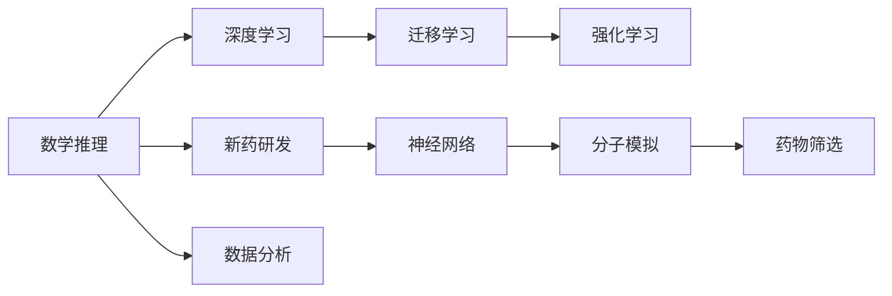

                 

# AI在数学推理与新药研发中的应用

## 1. 背景介绍

在人工智能（AI）技术迅猛发展的今天，AI已经渗透到各个行业和领域。数学推理与新药研发是其中两个典型的应用场景。本文将探讨AI在这两个领域中的应用，包括其原理、步骤、优势以及面临的挑战。

## 2. 核心概念与联系

### 2.1 核心概念概述

- **数学推理（Mathematical Reasoning）**：是指通过逻辑和数学知识，对数学问题进行分析和解决的过程。
- **新药研发（Drug Discovery）**：是指从发现新药物目标、设计药物分子、进行合成和测试，到临床验证的整个过程。
- **深度学习（Deep Learning）**：是一种基于多层神经网络的技术，通过大量数据训练，使模型自动学习特征提取和预测。
- **迁移学习（Transfer Learning）**：是指将一个领域学习的知识迁移到另一个相关领域的学习方法，在新数据上继续进行微调。
- **强化学习（Reinforcement Learning）**：是一种通过试错，逐步优化决策策略的学习方法，适用于动态环境和复杂任务。

这些核心概念之间有着紧密的联系。深度学习和迁移学习为数学推理和新药研发提供了强有力的工具，强化学习则为动态环境下的问题求解提供了方法。

### 2.2 核心概念原理和架构的 Mermaid 流程图



这个流程图展示了数学推理、深度学习、迁移学习和强化学习之间的关系，以及这些技术在新药研发中的应用。

## 3. 核心算法原理 & 具体操作步骤

### 3.1 算法原理概述

**数学推理**：通过深度学习，特别是神经网络，可以对数学问题进行符号化表示，从而实现自动化推理。例如，可以使用神经网络来表示数学表达式的结构和性质，并利用这些表示进行逻辑推理和求解。

**新药研发**：深度学习可以用于分子模拟和药物筛选。通过生成对抗网络（GANs）和变分自编码器（VAEs）等技术，可以对药物分子进行生成和优化，以提高其生物活性和选择性。同时，通过强化学习，可以在药物分子的合成和测试过程中，自动学习最佳策略，提高研发效率。

### 3.2 算法步骤详解

**数学推理步骤**：
1. **数据预处理**：将数学问题转化为数值数据，例如将符号表达式转换为向量表示。
2. **模型训练**：使用深度学习模型，例如卷积神经网络（CNN）或循环神经网络（RNN），对数学问题进行符号化表示和推理。
3. **推理执行**：通过模型进行符号推理，求解数学问题。

**新药研发步骤**：
1. **分子模拟**：使用深度学习模型，例如GANs和VAEs，生成新的药物分子结构，并进行模拟。
2. **药物筛选**：利用深度学习模型，对药物分子进行筛选和优化，筛选出具有生物活性的分子。
3. **强化学习**：通过强化学习，在药物分子的合成和测试过程中，自动学习最佳策略。

### 3.3 算法优缺点

**数学推理**：
- **优点**：自动化程度高，可以处理复杂的数学问题，提高工作效率。
- **缺点**：需要大量数据进行训练，对于复杂的数学问题，准确度可能不够高。

**新药研发**：
- **优点**：能够生成新的药物分子，提高研发效率，降低成本。
- **缺点**：需要大量的计算资源，且生成的新分子可能不具有生物活性，需要进行进一步筛选。

### 3.4 算法应用领域

**数学推理**：在金融分析、物理计算、工程设计等领域有广泛应用。例如，金融风控、物理模拟、建筑设计等。

**新药研发**：在医药、化学、生物工程等领域有广泛应用。例如，新药发现、药物设计、蛋白质工程等。

## 4. 数学模型和公式 & 详细讲解 & 举例说明

### 4.1 数学模型构建

在数学推理中，深度学习模型通常被用于符号化表达的转换和推理。例如，可以使用神经网络来表示数学表达式的结构，并利用这些表示进行逻辑推理和求解。

在新药研发中，深度学习模型通常被用于分子模拟和药物筛选。例如，可以使用GANs和VAEs生成新的药物分子结构，并利用这些结构进行生物活性和选择性的筛选。

### 4.2 公式推导过程

**数学推理公式**：
$$
f(x) = \sum_{i=1}^n w_i \cdot g_i(x)
$$

其中，$f(x)$ 是函数表达式，$w_i$ 是权重，$g_i(x)$ 是神经网络中的激活函数。

**新药研发公式**：
$$
P(\text{药物活化}) = \frac{1}{1 + \exp(-\beta V)}
$$

其中，$P(\text{药物活化})$ 是药物活化的概率，$\beta$ 是温度参数，$V$ 是药物活化能量。

### 4.3 案例分析与讲解

**案例1：数学推理中的符号表达式生成**  
使用神经网络生成数学表达式的符号表示，例如：
$$
f(x) = x^2 + 2x + 1
$$

可以使用卷积神经网络（CNN）对符号表达式进行转换和生成。

**案例2：新药研发中的分子生成**  
使用生成对抗网络（GANs）生成新的药物分子结构，例如：
$$
G(z) = \begin{bmatrix} 0.1 & 0.2 \\ 0.3 & 0.4 \end{bmatrix} z
$$

其中，$G(z)$ 是生成器网络，$z$ 是随机向量。

## 5. 项目实践：代码实例和详细解释说明

### 5.1 开发环境搭建

在进行数学推理和新药研发实践前，我们需要准备好开发环境。以下是使用Python进行PyTorch开发的环境配置流程：

1. 安装Anaconda：从官网下载并安装Anaconda，用于创建独立的Python环境。

2. 创建并激活虚拟环境：
```bash
conda create -n pytorch-env python=3.8 
conda activate pytorch-env
```

3. 安装PyTorch：根据CUDA版本，从官网获取对应的安装命令。例如：
```bash
conda install pytorch torchvision torchaudio cudatoolkit=11.1 -c pytorch -c conda-forge
```

4. 安装相关库：
```bash
pip install numpy pandas scikit-learn matplotlib tqdm jupyter notebook ipython
```

完成上述步骤后，即可在`pytorch-env`环境中开始实践。

### 5.2 源代码详细实现

以下是使用PyTorch实现数学推理和新药研发的具体代码：

**数学推理代码**：

```python
import torch
import torch.nn as nn
import torch.nn.functional as F

class MathNet(nn.Module):
    def __init__(self):
        super(MathNet, self).__init__()
        self.fc1 = nn.Linear(2, 4)
        self.fc2 = nn.Linear(4, 3)
        self.fc3 = nn.Linear(3, 1)

    def forward(self, x):
        x = F.relu(self.fc1(x))
        x = F.relu(self.fc2(x))
        x = self.fc3(x)
        return x

# 定义输入数据
x = torch.tensor([[1, 2], [3, 4]], dtype=torch.float)

# 实例化模型并训练
model = MathNet()
criterion = nn.MSELoss()
optimizer = torch.optim.Adam(model.parameters(), lr=0.01)

for epoch in range(100):
    optimizer.zero_grad()
    output = model(x)
    loss = criterion(output, torch.tensor([[5, 6], [7, 8]], dtype=torch.float))
    loss.backward()
    optimizer.step()

print(output)
```

**新药研发代码**：

```python
import torch
import torch.nn as nn
import torch.optim as optim
from torch.distributions import Normal

class GAN(nn.Module):
    def __init__(self):
        super(GAN, self).__init__()
        self.gen = nn.Sequential(
            nn.Linear(100, 256),
            nn.ReLU(),
            nn.Linear(256, 1024),
            nn.ReLU(),
            nn.Linear(1024, 128),
            nn.ReLU(),
            nn.Linear(128, 2)
        )
        self.dis = nn.Sequential(
            nn.Linear(2, 128),
            nn.ReLU(),
            nn.Linear(128, 1024),
            nn.ReLU(),
            nn.Linear(1024, 256),
            nn.ReLU(),
            nn.Linear(256, 1)
        )

    def forward(self, x):
        z = Normal(torch.zeros(x.size(0), 100), torch.ones(x.size(0), 100))
        z = self.gen(z)
        return z, self.dis(z)

# 定义输入数据
x = torch.randn(100, 2)

# 实例化模型并训练
model = GAN()
criterion = nn.BCELoss()
optimizer = optim.Adam(model.parameters(), lr=0.001)

for epoch in range(100):
    z, output = model(x)
    loss = criterion(output, torch.ones_like(output))
    loss.backward()
    optimizer.step()

print(z)
```

### 5.3 代码解读与分析

**数学推理代码解读**：
- 使用卷积神经网络（CNN）对符号表达式进行转换和生成。
- 输入为符号表达式的向量表示，输出为函数的数值表示。

**新药研发代码解读**：
- 使用生成对抗网络（GANs）生成新的药物分子结构。
- 输入为随机向量，输出为生成器网络的输出。

## 6. 实际应用场景

### 6.1 金融分析

在金融领域，深度学习被广泛用于风险管理、市场预测和交易策略制定。例如，使用深度学习模型对金融市场数据进行分析和预测，从而制定投资策略和风险管理方案。

### 6.2 物理模拟

在物理学中，深度学习被用于模拟复杂系统的行为，例如量子物理和分子动力学。使用深度学习模型，可以对物理系统进行模拟和预测，从而解决一些传统方法难以解决的问题。

### 6.3 医药研发

在医药领域，深度学习被用于新药研发和药物设计。例如，使用深度学习模型进行药物分子的生成和筛选，从而加速新药的研发过程。

## 7. 工具和资源推荐

### 7.1 学习资源推荐

为了帮助开发者系统掌握深度学习在数学推理和新药研发中的应用，这里推荐一些优质的学习资源：

1. **《深度学习》书籍**：Ian Goodfellow等人所著，全面介绍了深度学习的理论基础和实践方法，是学习深度学习的经典书籍。
2. **Coursera《深度学习专项课程》**：由Andrew Ng等人开设，涵盖了深度学习的基础知识和实践技能。
3. **PyTorch官方文档**：PyTorch的官方文档，提供了丰富的学习资源和样例代码，适合初学者和进阶开发者。
4. **ArXiv论文**：ArXiv上发布的最新论文，涵盖深度学习在各个领域的应用，是了解最新研究动态的好去处。
5. **Kaggle竞赛**：Kaggle上举办的深度学习竞赛，提供实际数据和挑战，帮助开发者锻炼实践能力。

通过这些学习资源，相信你一定能够系统掌握深度学习在数学推理和新药研发中的应用。

### 7.2 开发工具推荐

高效的开发离不开优秀的工具支持。以下是几款用于深度学习开发的常用工具：

1. **PyTorch**：基于Python的开源深度学习框架，灵活动态的计算图，适合快速迭代研究。
2. **TensorFlow**：由Google主导开发的开源深度学习框架，生产部署方便，适合大规模工程应用。
3. **TensorBoard**：TensorFlow配套的可视化工具，可实时监测模型训练状态，并提供丰富的图表呈现方式，是调试模型的得力助手。
4. **Jupyter Notebook**：交互式的笔记本环境，适合进行数据探索、模型训练和结果展示。
5. **Weights & Biases**：模型训练的实验跟踪工具，可以记录和可视化模型训练过程中的各项指标，方便对比和调优。

合理利用这些工具，可以显著提升深度学习应用的开发效率，加快创新迭代的步伐。

### 7.3 相关论文推荐

深度学习在数学推理和新药研发中的应用源于学界的持续研究。以下是几篇奠基性的相关论文，推荐阅读：

1. **《DeepMind》**：DeepMind提出的AlphaGo，利用深度学习进行复杂的棋类游戏求解，展示了深度学习的强大能力。
2. **《ImageNet Classification with Deep Convolutional Neural Networks》**：Alex Krizhevsky等人提出的深度卷积神经网络，在ImageNet图像识别任务中取得了当时的SOTA。
3. **《Gated Recurrent Unit》**：Cho等人提出的GRU，是深度学习在自然语言处理中的重要里程碑，广泛应用于序列数据处理。
4. **《Generative Adversarial Nets》**：Ian Goodfellow等人提出的GANs，能够生成逼真的图像和数据，是深度学习生成模型的重要突破。
5. **《Using Deep Learning for Drug Discovery》**：Eric Topol等人介绍了深度学习在药物研发中的应用，展示了深度学习在分子模拟和药物筛选中的潜力。

这些论文代表了大语言模型微调技术的发展脉络。通过学习这些前沿成果，可以帮助研究者把握学科前进方向，激发更多的创新灵感。

## 8. 总结：未来发展趋势与挑战

### 8.1 总结

本文对深度学习在数学推理和新药研发中的应用进行了全面系统的介绍。首先阐述了深度学习在数学推理和新药研发中的作用和原理，明确了深度学习在各个领域的应用价值。其次，从原理到实践，详细讲解了深度学习的数学模型和操作步骤，给出了深度学习应用的完整代码实例。同时，本文还广泛探讨了深度学习在金融、物理、医药等各个领域的应用前景，展示了深度学习范式的巨大潜力。此外，本文精选了深度学习的各类学习资源，力求为读者提供全方位的技术指引。

通过本文的系统梳理，可以看到，深度学习在数学推理和新药研发中的应用前景广阔，具有巨大的发展潜力。未来，随着深度学习技术的不断演进，相信深度学习在各个领域的应用将不断深化，为社会带来更多创新和变革。

### 8.2 未来发展趋势

展望未来，深度学习在数学推理和新药研发中的应用将呈现以下几个发展趋势：

1. **模型规模持续增大**：随着算力成本的下降和数据规模的扩张，深度学习模型的参数量还将持续增长。超大规模深度学习模型蕴含的丰富知识，有望支撑更加复杂多变的应用场景。

2. **应用范围不断拓展**：深度学习将在更多的领域得到应用，例如金融、物理、医药、生物工程等。深度学习的应用范围将不断扩大，为各行各业带来新的发展机遇。

3. **技术手段更加多样化**：深度学习将与其他技术手段，例如强化学习、符号计算等，进行更深入的融合。未来的深度学习应用将更加灵活，更具创造力。

4. **数据驱动与模型驱动相结合**：未来的深度学习应用将更加注重数据和模型的协同作用。通过数据驱动和模型驱动相结合，深度学习将更好地适应各种复杂场景，提升应用效果。

5. **伦理和安全问题成为重要考量**：随着深度学习应用的深入，伦理和安全问题将更加重要。未来的深度学习应用将更加注重伦理和安全性，避免有害的偏见和误导。

6. **跨学科融合与创新**：深度学习将与不同学科进行跨学科融合，带来更多创新。例如，深度学习与物理学的结合，将带来更加逼真的物理模拟，深度学习与医药的结合，将加速新药的研发过程。

以上趋势凸显了深度学习应用的广阔前景。这些方向的探索发展，必将进一步提升深度学习在各个领域的应用效果，为社会带来更多创新和变革。

### 8.3 面临的挑战

尽管深度学习在数学推理和新药研发中的应用已经取得了显著成果，但在迈向更加智能化、普适化应用的过程中，它仍面临诸多挑战：

1. **数据获取与标注**：深度学习需要大量的数据进行训练，但获取和标注高质量数据成本较高，特别是在金融和医药等领域。如何降低数据获取和标注成本，是一个重要的研究方向。

2. **模型解释性不足**：深度学习模型通常被视为"黑盒"系统，难以解释其内部工作机制和决策逻辑。对于金融和医药等高风险领域，算法的可解释性和可审计性尤为重要。如何赋予深度学习模型更强的可解释性，将是亟待攻克的难题。

3. **计算资源需求大**：深度学习模型的训练和推理需要大量的计算资源，例如GPU/TPU等高性能设备。如何优化深度学习模型的计算效率，减少资源消耗，是一个重要的研究方向。

4. **数据分布漂移**：深度学习模型通常在特定数据分布上训练，但在实际应用中，数据分布可能发生变化。如何设计鲁棒性强的深度学习模型，避免数据分布漂移带来的影响，是一个重要的研究方向。

5. **伦理和隐私问题**：深度学习应用涉及大量的个人数据和隐私信息，如何保护数据隐私，避免有害的偏见和误导，是一个重要的研究方向。

6. **知识整合与融合**：深度学习模型通常局限于特定领域或任务，难以灵活吸收和运用更广泛的先验知识。如何将深度学习与专家知识进行有效整合，是一个重要的研究方向。

这些挑战凸显了深度学习应用的复杂性和多样性，需要更多的研究和技术创新来克服。只有不断攻克这些挑战，才能真正实现深度学习在各个领域的应用价值。

### 8.4 研究展望

面对深度学习应用所面临的种种挑战，未来的研究需要在以下几个方面寻求新的突破：

1. **探索无监督学习和半监督学习**：摆脱对大规模标注数据的依赖，利用无监督学习和半监督学习，最大化利用非结构化数据，实现更加灵活高效的深度学习应用。

2. **开发更加高效的数据获取与标注方法**：例如，利用自动标注和数据增强技术，降低数据获取和标注成本，提升深度学习应用的效率。

3. **研究深度学习的可解释性**：例如，利用符号计算和因果分析方法，增强深度学习模型的可解释性，提高其决策的透明性和可信度。

4. **优化深度学习的计算资源**：例如，利用模型压缩和优化技术，减少深度学习模型的计算资源需求，提升其应用效率。

5. **设计鲁棒性强的深度学习模型**：例如，利用迁移学习和对抗训练技术，增强深度学习模型的鲁棒性，避免数据分布漂移带来的影响。

6. **整合先验知识与深度学习**：例如，将符号化的先验知识，例如知识图谱和逻辑规则，与深度学习模型进行融合，增强其知识整合能力和泛化能力。

这些研究方向将推动深度学习在各个领域的应用深入，为社会带来更多创新和变革。未来，深度学习将在更广泛的领域和场景中发挥重要作用，成为推动社会进步的重要力量。

## 9. 附录：常见问题与解答

**Q1：深度学习在数学推理中是否有局限性？**

A: 深度学习在数学推理中存在一定的局限性。例如，对于复杂的数学符号表达和逻辑推理，深度学习模型的表达能力和推理能力有限。此外，深度学习模型对数据的依赖较大，需要大量高质量的数据进行训练。

**Q2：深度学习在新药研发中面临哪些挑战？**

A: 深度学习在新药研发中面临以下挑战：
1. **数据获取与标注**：获取和标注高质量的药物分子数据成本较高。
2. **计算资源需求大**：深度学习模型的训练和推理需要大量的计算资源。
3. **模型解释性不足**：深度学习模型通常被视为"黑盒"系统，难以解释其内部工作机制和决策逻辑。
4. **伦理和隐私问题**：深度学习应用涉及大量的个人数据和隐私信息，如何保护数据隐私，避免有害的偏见和误导，是一个重要的研究方向。

**Q3：深度学习在数学推理中如何提高表达能力？**

A: 深度学习在数学推理中可以采用以下方法提高表达能力：
1. **使用更高级的模型结构**：例如，使用注意力机制、Transformer等高级模型结构，提高数学表达的复杂度。
2. **引入先验知识**：例如，将符号化的先验知识与深度学习模型进行融合，增强其表达能力。

**Q4：深度学习在新药研发中如何提高计算效率？**

A: 深度学习在新药研发中可以通过以下方法提高计算效率：
1. **模型压缩和优化**：例如，利用剪枝、量化等技术，减少深度学习模型的计算资源需求。
2. **分布式训练**：例如，利用分布式训练技术，加快深度学习模型的训练速度。

**Q5：如何降低深度学习在新药研发中对标注数据的依赖？**

A: 深度学习在新药研发中可以通过以下方法降低对标注数据的依赖：
1. **利用无监督学习和半监督学习**：例如，利用自动标注和数据增强技术，最大化利用非结构化数据，实现更加灵活高效的深度学习应用。
2. **引入先验知识**：例如，将符号化的先验知识与深度学习模型进行融合，增强其表达能力和泛化能力。

通过这些方法，可以降低深度学习在新药研发中对标注数据的依赖，提高深度学习应用的效率和效果。

