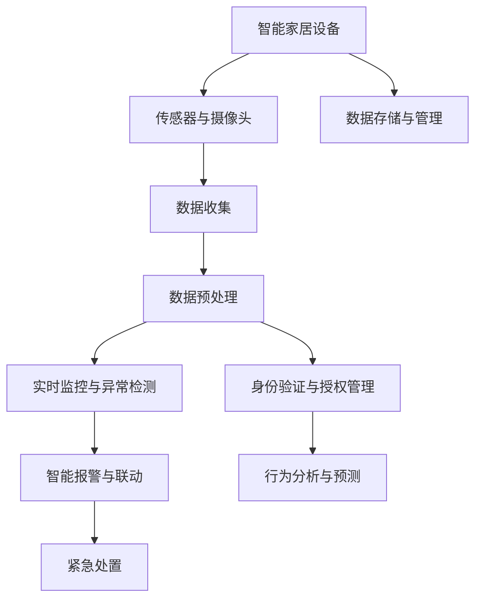

                 

## 1. 背景介绍

### 1.1 问题由来

随着物联网技术的飞速发展，智能家居逐渐成为人们生活的重要组成部分。然而，智能家居的安全问题也不断凸显，如网络入侵、数据泄露、设备损坏等事件层出不穷，给人们的生活带来了安全隐患。因此，提升智能家居的安全性成为了一个亟待解决的问题。

### 1.2 问题核心关键点

智能家居安防的核心在于通过多种传感器、摄像头和智能设备收集数据，然后通过AI技术对这些数据进行处理和分析，从而实现对家居环境的实时监控和预警。在传统的智能家居安防方案中，通常采用传统的安全监控系统，如视频监控、门窗传感器等，但这些系统往往存在以下问题：

1. **依赖人工监控**：需要人工24小时监控，消耗人力成本高，易疲劳。
2. **响应时间长**：一旦发生安全事件，需要人工介入才能进行处置，响应速度慢。
3. **数据安全问题**：数据存储和传输过程中容易遭到黑客攻击，造成数据泄露。
4. **设备安全性不足**：智能家居设备的安全性普遍较低，易受到恶意软件攻击。
5. **跨平台兼容性差**：不同品牌和型号的智能设备往往无法互通，难以实现统一管理。

## 2. 核心概念与联系

### 2.1 核心概念概述

在智能家居安防领域，AI技术主要应用于以下几个方面：

- **实时监控与异常检测**：通过传感器和摄像头实时收集家居环境数据，利用AI模型对数据进行分析，识别异常行为和事件，实现实时监控和预警。
- **身份验证与授权管理**：利用AI技术对家庭成员的身份进行验证，管理不同用户的权限，确保只有授权用户可以访问和控制家居设备。
- **智能报警与联动**：根据AI模型的分析结果，自动触发报警系统，并联动其他设备进行紧急处置，如自动关闭门窗、通知家庭成员等。
- **行为分析与预测**：通过对家庭成员的行为数据进行分析，预测未来可能的安全隐患，提前采取预防措施。

### 2.2 核心概念原理和架构的 Mermaid 流程图



这个流程图展示了智能家居安防系统的基本架构和数据流向。设备收集的数据经过预处理后，进入实时监控与异常检测模块，对异常行为进行识别。身份验证与授权管理模块对用户进行身份验证和权限管理。智能报警与联动模块根据检测结果触发报警和联动。行为分析与预测模块通过分析用户行为，预测潜在安全风险。数据存储与管理模块负责数据的存储和管理，确保数据的安全性和可靠性。

## 3. 核心算法原理 & 具体操作步骤

### 3.1 算法原理概述

智能家居安防中的AI算法主要基于机器学习（Machine Learning, ML）和深度学习（Deep Learning, DL）技术。以下是几种常用的算法原理：

- **异常检测（Anomaly Detection）**：通过训练一个异常检测模型，对家居环境中的传感器数据进行分析，识别异常行为和事件。常用的算法包括基于统计学的Z-score方法、基于神经网络的Autoencoder等。
- **身份验证（Identity Verification）**：通过人脸识别、指纹识别等生物特征识别技术，对家庭成员的身份进行验证，确保用户身份的真实性。常用的算法包括卷积神经网络（CNN）、支持向量机（SVM）等。
- **行为分析（Behavior Analysis）**：通过对家庭成员的行为数据进行分析，预测未来可能的安全隐患，提前采取预防措施。常用的算法包括时间序列分析、LSTM等。
- **智能报警与联动（Intelligent Alert and Linkage）**：根据异常检测和行为分析的结果，自动触发报警系统，并联动其他设备进行紧急处置。常用的算法包括规则引擎、决策树等。

### 3.2 算法步骤详解

#### 3.2.1 数据收集与预处理

智能家居安防系统需要收集大量的传感器和摄像头数据，包括温度、湿度、光线、门窗状态、视频帧等。这些数据需要经过预处理，如去噪、归一化、降维等，以提高模型的训练效率和效果。

#### 3.2.2 模型训练与验证

根据具体的任务需求，选择合适的算法模型进行训练。例如，对于异常检测任务，可以使用Autoencoder模型进行训练，对于身份验证任务，可以使用CNN模型进行训练。训练好的模型需要在验证集上进行测试，确保模型的泛化能力和准确性。

#### 3.2.3 模型部署与应用

将训练好的模型部署到智能家居系统中，实现实时监控和预警功能。例如，在异常检测模块，可以将传感器数据输入到训练好的Autoencoder模型中，模型输出异常得分，根据得分阈值进行预警。

### 3.3 算法优缺点

#### 3.3.1 优点

- **高准确性**：AI算法通常具有较高的准确性，特别是在异常检测和行为分析等任务中。
- **实时性**：AI算法可以实现实时监控和预警，提升响应的速度和效率。
- **自动化**：AI算法可以自动化地完成大部分监控和预警任务，减少人工介入。

#### 3.3.2 缺点

- **数据依赖性高**：AI算法的训练和效果很大程度上依赖于数据的质量和数量，数据不足或质量不高会导致模型性能下降。
- **计算资源消耗大**：深度学习模型通常需要较大的计算资源和存储空间，对于小型智能家居系统可能难以承受。
- **模型复杂度较高**：复杂的AI模型需要更多的计算资源和更高的技术门槛，增加了系统的开发和维护成本。

### 3.4 算法应用领域

AI算法在智能家居安防领域的应用非常广泛，包括但不限于以下几个方面：

- **智能门锁与门窗传感器**：通过传感器监测门窗的开闭状态，结合身份验证算法，实现智能门锁和门窗的自动控制。
- **视频监控与行为分析**：通过摄像头实时监控家居环境，结合行为分析算法，识别异常行为并进行预警。
- **智能报警与联动**：根据异常检测和行为分析的结果，自动触发报警系统，并联动其他设备进行紧急处置。
- **智能温控与节能**：通过传感器监测家居环境的温度和湿度，结合智能算法，实现节能和舒适性提升。
- **智能家居安全防护**：通过数据分析和预测，提前发现潜在的安全隐患，并进行预防措施。

## 4. 数学模型和公式 & 详细讲解 & 举例说明

### 4.1 数学模型构建

智能家居安防中的AI算法通常基于以下数学模型：

- **异常检测模型**：使用Autoencoder模型进行训练，模型的损失函数为重构误差（Reconstruction Error）：
$$
L = \frac{1}{N} \sum_{i=1}^N \sum_{j=1}^M (x_{ij} - \hat{x}_{ij})^2
$$
其中，$x_{ij}$为第$i$个样本的第$j$个特征，$\hat{x}_{ij}$为模型预测的结果。

- **身份验证模型**：使用卷积神经网络（CNN）进行训练，模型的损失函数为交叉熵损失（Cross-Entropy Loss）：
$$
L = -\frac{1}{N} \sum_{i=1}^N \sum_{j=1}^C y_{ij}\log\hat{y}_{ij} + (1-y_{ij})\log(1-\hat{y}_{ij})
$$
其中，$y_{ij}$为样本的真实标签，$\hat{y}_{ij}$为模型预测的结果。

- **行为分析模型**：使用长短期记忆网络（LSTM）进行训练，模型的损失函数为均方误差损失（Mean Square Error Loss）：
$$
L = \frac{1}{N} \sum_{i=1}^N (y_i - \hat{y}_i)^2
$$
其中，$y_i$为样本的真实标签，$\hat{y}_i$为模型预测的结果。

### 4.2 公式推导过程

以异常检测模型为例，推导Autoencoder的损失函数和重构误差：

设输入数据为 $x \in \mathbb{R}^d$，经过编码器得到隐层表示 $z = h(x)$，再经过解码器得到重构结果 $\hat{x} = g(z)$。重构误差为：
$$
L_{rec} = \frac{1}{N} \sum_{i=1}^N \frac{1}{d} \sum_{j=1}^d (x_{ij} - \hat{x}_{ij})^2
$$

其中，$x_{ij}$为第$i$个样本的第$j$个特征，$\hat{x}_{ij}$为模型预测的重构结果。

### 4.3 案例分析与讲解

以智能门锁为例，分析异常检测模型的应用：

假设智能门锁有传感器监测门窗的开闭状态，模型的输入为 $x = (x_1, x_2, \dots, x_d)$，其中 $x_i$ 表示第 $i$ 个传感器在某一时刻的状态。模型的编码器将输入数据 $x$ 映射到隐层表示 $z = h(x)$，解码器将隐层表示 $z$ 映射到重构结果 $\hat{x}$。

训练好的模型可以在实际应用中实时监测门窗状态，如果传感器检测到异常开门或关门事件，模型输出重构误差较大，从而触发报警系统。

## 5. 项目实践：代码实例和详细解释说明

### 5.1 开发环境搭建

智能家居安防系统通常需要具备以下开发环境：

- **Python 3.x**：用于数据分析和机器学习模型的训练和部署。
- **TensorFlow 或 PyTorch**：常用的深度学习框架，支持多种模型算法。
- **OpenCV 或 PyImageSearch**：用于视频监控和图像处理。
- **MQTT 或 HTTP**：用于设备间的通信协议。

### 5.2 源代码详细实现

以下是一个简单的异常检测模型的代码实现，使用TensorFlow：

```python
import tensorflow as tf
import numpy as np

# 定义模型结构
class Autoencoder(tf.keras.Model):
    def __init__(self, input_dim):
        super(Autoencoder, self).__init__()
        self.encoder = tf.keras.Sequential([
            tf.keras.layers.Dense(64, activation='relu', input_shape=(input_dim,)),
            tf.keras.layers.Dense(32, activation='relu'),
            tf.keras.layers.Dense(input_dim, activation='sigmoid')
        ])
        self.decoder = tf.keras.Sequential([
            tf.keras.layers.Dense(32, activation='relu'),
            tf.keras.layers.Dense(64, activation='relu'),
            tf.keras.layers.Dense(input_dim, activation='sigmoid')
        ])
    
    def call(self, x):
        encoded = self.encoder(x)
        decoded = self.decoder(encoded)
        return decoded

# 训练模型
def train_model(model, x_train, x_test, epochs=10, batch_size=32):
    # 设置损失函数和优化器
    loss_fn = tf.keras.losses.MeanSquaredError()
    optimizer = tf.keras.optimizers.Adam()
    
    # 定义训练过程
    for epoch in range(epochs):
        for i in range(0, len(x_train), batch_size):
            x_batch = x_train[i:i+batch_size]
            with tf.GradientTape() as tape:
                y_pred = model(x_batch)
                loss = loss_fn(x_batch, y_pred)
            grads = tape.gradient(loss, model.trainable_variables)
            optimizer.apply_gradients(zip(grads, model.trainable_variables))
        print(f'Epoch {epoch+1}/{epochs}, Loss: {loss:.4f}')

# 加载数据
x_train = np.random.randn(1000, 10)
x_test = np.random.randn(100, 10)

# 构建模型
model = Autoencoder(10)

# 训练模型
train_model(model, x_train, x_test)

# 保存模型
model.save('autoencoder.h5')
```

### 5.3 代码解读与分析

以上代码展示了如何训练一个简单的Autoencoder模型，用于异常检测任务。代码中使用了TensorFlow框架，通过定义编码器和解码器，构建了Autoencoder模型。在训练过程中，使用均方误差损失函数和Adam优化器，通过反向传播算法更新模型参数。

### 5.4 运行结果展示

训练完成后，可以加载模型进行预测和异常检测。例如，使用以下代码加载模型并测试：

```python
import numpy as np
from tensorflow.keras.models import load_model

# 加载模型
model = load_model('autoencoder.h5')

# 测试数据
x_test = np.random.randn(100, 10)

# 预测结果
y_pred = model.predict(x_test)
```

通过比较输入数据 $x$ 和重构结果 $y_{pred}$，可以计算重构误差，判断是否存在异常行为。

## 6. 实际应用场景

### 6.1 智能门锁与门窗传感器

智能门锁结合门窗传感器，可以实时监测门窗的开闭状态。当检测到异常开门或关门事件时，结合身份验证算法，可以自动锁定门窗或通知家庭成员。

### 6.2 视频监控与行为分析

通过摄像头实时监控家居环境，结合行为分析算法，可以识别异常行为并进行预警。例如，检测到儿童独自在家中，可以自动通知家长。

### 6.3 智能报警与联动

根据异常检测和行为分析的结果，自动触发报警系统，并联动其他设备进行紧急处置。例如，检测到烟雾传感器异常，可以自动关闭门窗、通知家庭成员并拨打报警电话。

### 6.4 智能温控与节能

通过传感器监测家居环境的温度和湿度，结合智能算法，可以实现节能和舒适性提升。例如，检测到室内温度过高或过低，可以自动调节空调或暖气。

### 6.5 智能家居安全防护

通过数据分析和预测，提前发现潜在的安全隐患，并进行预防措施。例如，检测到家庭成员的异常出行记录，可以自动提醒家庭成员和物业。

## 7. 工具和资源推荐

### 7.1 学习资源推荐

- **《深度学习入门：基于Python的理论与实现》**：详细介绍深度学习的基本概念和常用算法，适合初学者入门。
- **《机器学习实战》**：通过实际案例讲解机器学习的应用，涵盖多个经典算法和工具。
- **《Python机器学习基础教程》**：系统介绍机器学习的基本理论和实践技能，适合进阶学习。

### 7.2 开发工具推荐

- **TensorFlow**：常用的深度学习框架，支持多种模型算法。
- **PyTorch**：灵活高效的深度学习框架，支持动态计算图。
- **OpenCV**：用于视频监控和图像处理的开源库。
- **MQTT**：用于设备间通信的轻量级协议。

### 7.3 相关论文推荐

- **《深度学习在智能家居中的应用》**：综述深度学习在智能家居中的多方面应用。
- **《智能家居系统中的异常检测与行为分析》**：介绍异常检测和行为分析在智能家居中的应用。
- **《基于深度学习的智能门锁系统设计》**：设计实现基于深度学习的智能门锁系统。

## 8. 总结：未来发展趋势与挑战

### 8.1 研究成果总结

智能家居安防领域的AI技术已经取得了显著进展，提高了家居环境的安全性和便利性。通过异常检测、身份验证、行为分析等技术，可以实时监控和预警，实现智能家居设备的自动化控制和紧急处置。

### 8.2 未来发展趋势

- **多模态融合**：未来智能家居安防系统将更加注重多模态数据融合，结合视频、音频、传感器等多种数据，提升监测和预警的准确性和鲁棒性。
- **边缘计算**：随着5G技术的发展，智能家居安防系统将逐渐采用边缘计算，实现更高效的数据处理和实时响应。
- **人工智能芯片**：人工智能芯片的出现，将大大提升智能家居安防系统的计算能力和响应速度。
- **联邦学习**：在保护隐私的前提下，通过联邦学习技术，实现跨设备的数据共享和模型训练，提升模型的泛化能力和安全性。

### 8.3 面临的挑战

- **隐私保护**：智能家居安防系统需要处理大量的个人隐私数据，如何保护用户隐私是重要的挑战。
- **设备互操作性**：不同品牌和型号的智能家居设备之间互操作性较差，需要制定统一的标准和协议。
- **算法鲁棒性**：AI算法在面对异常数据和噪声时，容易产生误报警或漏报警，需要进一步提升算法的鲁棒性和准确性。
- **计算资源消耗**：深度学习模型的计算资源消耗较大，对于小型智能家居系统可能难以承受。
- **安全防护**：智能家居安防系统容易受到网络攻击和恶意软件的影响，需要加强安全防护措施。

### 8.4 研究展望

- **联邦学习**：通过联邦学习技术，实现跨设备的数据共享和模型训练，提升模型的泛化能力和安全性。
- **边缘计算**：采用边缘计算技术，实现更高效的数据处理和实时响应，提升系统的可靠性和稳定性。
- **多模态融合**：结合视频、音频、传感器等多种数据，提升监测和预警的准确性和鲁棒性。
- **隐私保护**：在保护隐私的前提下，通过差分隐私、同态加密等技术，保护用户隐私和数据安全。

## 9. 附录：常见问题与解答

**Q1: 什么是智能家居安防系统？**

A: 智能家居安防系统是指通过多种传感器、摄像头和智能设备收集数据，利用AI技术对这些数据进行处理和分析，实现对家居环境的实时监控和预警。

**Q2: 智能家居安防系统有哪些应用场景？**

A: 智能家居安防系统可以应用于智能门锁与门窗传感器、视频监控与行为分析、智能报警与联动、智能温控与节能等多个方面。

**Q3: 如何保护智能家居安防系统的数据隐私？**

A: 智能家居安防系统需要保护用户隐私，可以采用差分隐私、同态加密等技术，保护用户数据的安全性和隐私性。

**Q4: 智能家居安防系统在部署时需要注意哪些问题？**

A: 智能家居安防系统的部署需要注意数据安全、设备互操作性、计算资源消耗、安全防护等问题，确保系统的可靠性和稳定性。

**Q5: 智能家居安防系统如何实现实时监控和预警？**

A: 智能家居安防系统通过传感器和摄像头实时收集家居环境数据，利用AI模型对数据进行分析，识别异常行为和事件，实现实时监控和预警。

---

作者：禅与计算机程序设计艺术 / Zen and the Art of Computer Programming

