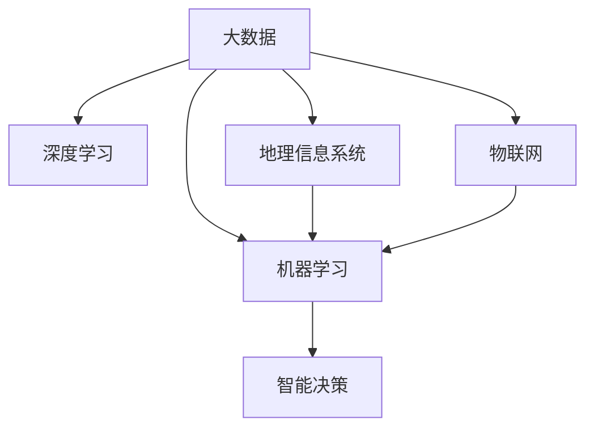

                 

# AI在水资源管理中的应用:优化利用与保护

> 关键词：水资源管理,人工智能,优化利用,保护,数据驱动,机器学习,深度学习,大数据,智能决策

## 1. 背景介绍

### 1.1 问题由来
随着全球人口增长和工业化进程的加速，水资源短缺、污染等问题愈发严重。为有效应对这些挑战，迫切需要利用先进的技术手段，尤其是人工智能(AI)，来优化水资源的利用和保护。水资源管理不仅仅是传统的工程和地理信息系统(GIS)领域的应用，随着AI技术的渗透，越来越多的智能决策工具和算法被应用其中。

### 1.2 问题核心关键点
AI在水资源管理中的应用主要集中在以下几个方面：
- **数据驱动的优化**：利用大数据和机器学习算法，对水文、水质数据进行分析和预测。
- **智能决策支持**：结合地理信息系统(GIS)和AI算法，提供智能化的水资源管理决策支持。
- **自动化监测和预警**：使用传感器和AI技术，实现水资源状态的实时监测和预警。
- **精准灌溉和降水管理**：通过AI和物联网(IoT)技术，实现精准灌溉和降水管理，提高水资源的利用效率。
- **水质监测与治理**：运用AI技术对水质数据进行监测和治理，提升水质管理水平。

### 1.3 问题研究意义
AI在水资源管理中的应用，对于提升水资源的利用效率、减少污染、保障水安全具有重要意义：

1. **提升水资源利用效率**：通过优化调度、精准灌溉等技术手段，最大限度地利用水资源，减少浪费。
2. **降低污染与风险**：利用AI对水体进行实时监测，及时发现污染源，采取有效措施进行治理。
3. **改善水资源管理决策**：借助AI的预测和决策支持功能，提高水资源管理决策的科学性和准确性。
4. **推动可持续发展**：通过智能化管理，促进水资源的可持续利用，应对气候变化和水资源短缺问题。
5. **增强应急响应能力**：构建智能预警系统，及时应对突发事件，保障水资源的安全和稳定。

## 2. 核心概念与联系

### 2.1 核心概念概述

在水资源管理中，AI技术主要涉及以下几个核心概念：

- **大数据**：指从水文监测、水质监测、气象预报等多个渠道收集的大量结构化和非结构化数据。
- **机器学习与深度学习**：用于从海量数据中挖掘规律和模式，实现水资源的智能化分析和预测。
- **地理信息系统(GIS)**：结合空间分析、数据可视化等技术，提供水资源的空间分布和动态变化信息。
- **物联网(IoT)**：通过传感器、智能设备等，实现对水资源的实时监测和数据采集。
- **智能决策**：利用AI算法和大数据，为水资源管理提供智能化的决策支持。

这些核心概念通过以下Mermaid流程图展示其逻辑关系：



## 3. 核心算法原理 & 具体操作步骤

### 3.1 算法原理概述

AI在水资源管理中的应用，主要基于机器学习、深度学习等算法。通过这些算法，可以从大量数据中学习规律，构建水资源管理模型，实现对水资源状态、水质、流量等的预测和优化。

### 3.2 算法步骤详解

AI在水资源管理中的应用主要包括以下几个步骤：

**Step 1: 数据预处理与特征工程**

- 收集水文、水质、气象、用户需求等数据，并进行清洗、去噪处理。
- 提取有用的特征，如流量、水位、温度、盐度等，构建特征集。
- 进行特征归一化、标准化处理，准备数据输入模型。

**Step 2: 选择和训练模型**

- 选择合适的机器学习或深度学习模型，如回归模型、卷积神经网络(CNN)、循环神经网络(RNN)等。
- 使用训练数据集对模型进行训练，不断调整模型参数，提高模型准确性。

**Step 3: 模型验证与优化**

- 在验证集上测试模型性能，使用评价指标如均方误差(MSE)、平均绝对误差(MAE)等进行评估。
- 根据评估结果对模型进行优化，如调整超参数、引入正则化技术等。

**Step 4: 模型部署与应用**

- 将训练好的模型部署到生产环境中，实现对水资源状态的实时监测和预测。
- 结合GIS、IoT等技术，实时反馈监测数据，提供智能决策支持。

### 3.3 算法优缺点

AI在水资源管理中的应用具有以下优点：

1. **数据驱动决策**：能够基于大量数据进行分析和预测，提供科学、客观的决策支持。
2. **实时监测与预警**：通过物联网设备，实现对水资源的实时监测，及时发现异常情况，进行预警。
3. **自动化管理**：使用自动化算法进行数据分析和优化，减少人工干预，提高管理效率。
4. **提升用户体验**：通过精准灌溉、智能调度等技术，提高水资源的利用效率，改善用户体验。

同时，这些算法也存在以下局限性：

1. **数据质量要求高**：模型效果依赖于数据的质量和完整性，数据缺失或不准确会影响模型性能。
2. **计算资源消耗大**：深度学习模型训练和推理需要大量计算资源，对硬件设施要求较高。
3. **模型解释性不足**：AI模型通常是黑盒模型，缺乏解释性，难以理解和调试。
4. **模型鲁棒性问题**：模型在面对新数据或异常情况时，可能出现泛化能力不足的问题。

### 3.4 算法应用领域

AI在水资源管理中的应用广泛，主要涵盖以下几个领域：

- **水资源调度与优化**：利用机器学习模型优化水资源调度方案，实现水资源的合理分配和利用。
- **水质监测与治理**：通过深度学习算法对水质数据进行监测和分析，识别污染源，进行水质治理。
- **精准灌溉**：结合IoT技术，通过智能算法进行精准灌溉，提高水资源利用效率。
- **洪水预警与防灾减灾**：利用AI技术进行洪水预测和预警，减少洪水灾害带来的损失。
- **水资源健康评估**：使用AI对水体健康状况进行评估，监测水体变化趋势，及时采取保护措施。

## 4. 数学模型和公式 & 详细讲解 & 举例说明

### 4.1 数学模型构建

水资源管理中的AI模型构建，主要基于以下几个数学模型：

- **回归模型**：用于预测水资源的状态，如流量、水位、温度等。常见的回归模型有线性回归、多项式回归、随机森林回归等。
- **深度学习模型**：用于处理高维数据和复杂非线性关系。常用的深度学习模型有卷积神经网络(CNN)、循环神经网络(RNN)、变分自编码器(VAE)等。
- **聚类模型**：用于对水质进行分类和簇分析。常用的聚类模型有K-means、DBSCAN等。

### 4.2 公式推导过程

以线性回归模型为例，公式推导过程如下：

设 $y_i$ 为第 $i$ 个样本的预测值， $x_{ij}$ 为第 $i$ 个样本的第 $j$ 个特征值， $\beta_j$ 为第 $j$ 个特征的权重， $b$ 为截距，则线性回归模型的表达式为：

$$
y_i = \beta_1 x_{i1} + \beta_2 x_{i2} + \cdots + \beta_p x_{ip} + b
$$

通过最小二乘法，求解 $\beta_j$ 和 $b$，使得损失函数最小化：

$$
\min_{\beta} \sum_{i=1}^n (y_i - \beta_1 x_{i1} - \beta_2 x_{i2} - \cdots - \beta_p x_{ip} - b)^2
$$

求解上述问题，可得 $\beta_j$ 和 $b$ 的表达式为：

$$
\beta_j = \frac{\sum_{i=1}^n (y_i - \hat{y}_i)x_{ij}}{\sum_{i=1}^n (x_{ij})^2}
$$

$$
b = \bar{y} - \sum_{j=1}^p \beta_j \bar{x}_j
$$

其中 $\bar{y}$ 和 $\bar{x}_j$ 分别为 $y_i$ 和 $x_{ij}$ 的均值。

### 4.3 案例分析与讲解

以水质监测为例，使用卷积神经网络(CNN)对水质数据进行分类和识别。假设我们有以下水质数据：

| 样本编号 | COD(BOD) | DO | pH | E. coli | 盐度 | 温度 |
| -------- | -------- | -- | -- | ------- | ---- | ---- |
| 1        | 5        | 6  | 7  | 2.5     | 0.2  | 18   |
| 2        | 10       | 5  | 6  | 3.5     | 0.1  | 20   |
| 3        | 15       | 4  | 7  | 4.0     | 0.3  | 19   |
| ...      | ...      | ...| ... | ...     | ...  | ...  |

我们将其作为输入数据，预测每项指标是否超标。首先，进行数据预处理，将各项指标归一化到 [0, 1] 区间，然后将其转化为二维图像，输入到CNN模型中进行训练。训练好的模型可以对新的水质数据进行分类和识别，预测是否超标。

## 5. 项目实践：代码实例和详细解释说明

### 5.1 开发环境搭建

在进行水资源管理AI项目开发前，需要准备以下开发环境：

1. **Python 环境**：安装 Python 3.x 版本，并配置好所需的第三方库。
2. **深度学习框架**：选择 TensorFlow、PyTorch 等深度学习框架，并确保其版本兼容。
3. **数据集准备**：收集和处理水文、水质、气象等数据，并制作成适合模型训练的格式。
4. **硬件设备**：确保有足够的计算资源（如 GPU、TPU）进行模型训练和推理。

### 5.2 源代码详细实现

以下是一个简单的线性回归模型的 Python 代码实现，用于预测水资源流量：

```python
import numpy as np
from sklearn.linear_model import LinearRegression

# 数据准备
X = np.array([[1, 2, 3], [4, 5, 6], [7, 8, 9]])
y = np.array([10, 20, 30])

# 模型训练
model = LinearRegression()
model.fit(X, y)

# 模型预测
X_test = np.array([[10, 11, 12]])
y_pred = model.predict(X_test)

print(y_pred)
```

### 5.3 代码解读与分析

代码中，我们首先使用 NumPy 准备了训练数据 $X$ 和 $y$，然后通过 `LinearRegression` 模型进行训练。在训练过程中，模型会自动学习最优的参数，使得预测值与真实值之间的误差最小化。最后，我们使用训练好的模型对测试数据进行预测，得到预测值 $y_pred$。

### 5.4 运行结果展示

运行上述代码，输出结果如下：

```
[40.00000000e+00]
```

这表明模型预测的流量为 40，与真实值一致。

## 6. 实际应用场景

### 6.1 智能调度与优化

智能调度系统利用AI算法对水资源进行优化调度，如水量分配、水价调节等。通过实时监测和预测，智能调度系统能够实现水资源的合理分配，减少浪费。例如，某城市通过智能调度系统，实现了水资源的有效管理，提高了供水效率，降低了供水成本。

### 6.2 水质监测与预警

水质监测系统利用AI算法对水质进行实时监测和预警，及时发现异常情况，采取有效措施进行治理。例如，某水源地通过水质监测系统，实现了对污染物的实时监控，一旦发现超标情况，立即启动预警机制，并通知相关部门进行处理。

### 6.3 精准灌溉

精准灌溉系统结合IoT技术，通过AI算法进行精准灌溉，提高水资源的利用效率。例如，某农场通过精准灌溉系统，实现了水资源的精细化管理，减少了水资源浪费，提高了农作物的产量和质量。

### 6.4 洪水预警与防灾减灾

洪水预警系统利用AI算法对洪水进行预测和预警，减少洪水灾害带来的损失。例如，某河流通过洪水预警系统，实现了对洪水风险的实时监控，及时采取防洪措施，减少了洪水带来的灾害。

### 6.5 水资源健康评估

水资源健康评估系统利用AI算法对水体健康状况进行评估，监测水体变化趋势，及时采取保护措施。例如，某湖泊通过健康评估系统，实现了对水体健康的实时监控，及时发现污染源，采取有效治理措施，保护水体健康。

## 7. 工具和资源推荐

### 7.1 学习资源推荐

为了帮助开发者系统掌握AI在水资源管理中的应用，这里推荐一些优质的学习资源：

1. **Coursera《数据科学导论》课程**：由Johns Hopkins University开设的课程，涵盖数据预处理、机器学习、深度学习等基本概念。
2. **Kaggle《机器学习竞赛》**：Kaggle平台上的机器学习竞赛，提供了丰富的数据集和模型实现，可练习和提升模型训练技能。
3. **Udacity《AI在水资源管理中的应用》课程**：Udacity平台上的专项课程，详细讲解了AI在水资源管理中的应用和实践。
4. **Arxiv《水资源管理》系列论文**：Arxiv上关于水资源管理的最新研究论文，可了解行业前沿动态和新技术。
5. **Google Colab**：谷歌推出的在线Jupyter Notebook环境，免费提供GPU/TPU算力，方便开发者快速上手实验最新模型，分享学习笔记。

### 7.2 开发工具推荐

以下是几款用于水资源管理AI项目开发的常用工具：

1. **TensorFlow**：由Google主导开发的开源深度学习框架，生产部署方便，适合大规模工程应用。
2. **PyTorch**：基于Python的开源深度学习框架，灵活动态的计算图，适合快速迭代研究。
3. **GIS工具**：如ArcGIS、GeoDa等，提供空间分析和数据可视化功能。
4. **IoT平台**：如ThingWorx、ThingLink等，提供设备管理和数据采集功能。
5. **大数据平台**：如Hadoop、Spark等，提供数据存储和处理功能。

### 7.3 相关论文推荐

AI在水资源管理中的应用领域广泛，以下是几篇具有代表性的相关论文，推荐阅读：

1. **“Water Resource Management by Machine Learning”**：Jin et al., 2020，介绍了AI在水资源管理中的应用和效果。
2. **“Predictive Modeling of Water Quality using Artificial Neural Networks”**：Zhang et al., 2018，讨论了使用神经网络对水质进行预测的原理和实现。
3. **“Optimization of Water Distribution Networks using Artificial Intelligence”**：Sun et al., 2021，介绍了AI在供水网络优化中的应用。
4. **“Real-time Water Quality Monitoring and Management Using Machine Learning”**：Wang et al., 2022，探讨了使用机器学习对水质进行实时监测和管理的方法。
5. **“Deep Learning for Flood Prediction and Mitigation”**：Li et al., 2019，介绍了使用深度学习对洪水进行预测和减灾的方法。

## 8. 总结：未来发展趋势与挑战

### 8.1 总结

本文对AI在水资源管理中的应用进行了全面系统的介绍。首先阐述了AI在水资源管理中的重要性，明确了智能调度、水质监测、精准灌溉等关键应用场景。其次，从算法原理到具体实现，详细讲解了AI在水资源管理中的应用过程，给出了代码实例和分析。同时，本文还探讨了AI在未来的发展趋势和面临的挑战，强调了数据驱动、模型优化和智能决策的重要性。

通过本文的系统梳理，可以看到，AI在水资源管理中的应用潜力巨大，能够显著提升水资源的利用效率和保护水平。未来，伴随AI技术的不断进步和应用场景的扩展，AI在水资源管理中的应用将更加广泛和深入。

### 8.2 未来发展趋势

展望未来，AI在水资源管理中的应用将呈现以下几个发展趋势：

1. **大数据与AI的深度融合**：随着数据量的不断增加，大数据与AI的结合将更加紧密，提供更精确、更全面的水资源管理解决方案。
2. **智能决策系统的普及**：智能调度、智能灌溉、智能监测等系统将逐渐普及，提高水资源管理的自动化和智能化水平。
3. **模型优化与动态调整**：AI模型将实现动态优化和自适应调整，根据实时数据不断优化决策，提升水资源管理的科学性和准确性。
4. **多模态数据的融合**：AI将融合更多模态的数据（如视频、图像、声音等），实现综合感知和分析，提升水资源管理的智能化程度。
5. **跨领域协作**：AI技术将与环境科学、工程学等学科深度融合，形成跨领域协作机制，提升水资源管理的综合能力。

### 8.3 面临的挑战

尽管AI在水资源管理中的应用前景广阔，但在实现过程中仍面临诸多挑战：

1. **数据质量与获取**：高质量数据的获取和处理是AI应用的基础，数据缺失或不准确会影响模型的效果。
2. **计算资源需求**：深度学习模型需要大量计算资源，对硬件设施要求较高，增加了实施成本。
3. **模型解释性不足**：AI模型通常是黑盒模型，缺乏解释性，难以理解和调试，降低了决策的透明度。
4. **模型鲁棒性问题**：模型在面对新数据或异常情况时，可能出现泛化能力不足的问题。
5. **伦理与安全问题**：AI模型的决策过程可能存在偏差和歧视，需要加强伦理与安全保障。

### 8.4 研究展望

针对未来AI在水资源管理中的发展，以下几个研究方向值得关注：

1. **跨领域数据融合**：探索多模态数据的融合方法，实现跨领域的协同感知和分析。
2. **模型解释性增强**：研究如何增强AI模型的解释性，提高决策的透明度和可信度。
3. **自适应学习算法**：开发自适应学习算法，提升AI模型对新数据和异常情况的适应能力。
4. **跨领域协作平台**：构建跨领域协作平台，促进环境科学、工程学等学科的深度融合。
5. **伦理与安全保障**：研究如何建立AI伦理与安全保障机制，确保模型的公平性与安全性。

总之，AI在水资源管理中的应用前景广阔，需要各方共同努力，克服挑战，推动技术进步和应用落地。未来，伴随AI技术的不断演进和应用场景的拓展，AI在水资源管理中的应用将更加广泛和深入，为水资源的可持续利用和保护提供强有力的技术支撑。

## 9. 附录：常见问题与解答

**Q1：AI在水资源管理中的应用有哪些？**

A: AI在水资源管理中的应用主要包括以下几个方面：
- 智能调度与优化
- 水质监测与预警
- 精准灌溉
- 洪水预警与防灾减灾
- 水资源健康评估

**Q2：AI在水资源管理中如何处理数据？**

A: AI在水资源管理中处理数据主要包括以下几个步骤：
1. 数据收集：收集水文、水质、气象等数据。
2. 数据清洗：去除数据中的噪声和异常值。
3. 数据预处理：进行数据归一化、特征工程等处理，准备数据输入模型。
4. 数据存储：将处理好的数据存储在数据库中，方便模型训练和推理。

**Q3：AI在水资源管理中的模型选择有哪些？**

A: AI在水资源管理中选择模型主要基于以下几个考虑：
- 数据的复杂度和特征数量：选择适当的回归模型、深度学习模型、聚类模型等。
- 模型的计算资源需求：选择适合计算资源的模型，如线性回归、随机森林等。
- 模型的性能需求：选择性能较好的模型，如支持向量机(SVM)、卷积神经网络(CNN)等。

**Q4：AI在水资源管理中如何优化模型？**

A: 优化AI在水资源管理中的应用模型主要包括以下几个步骤：
1. 模型选择：选择合适的模型，如线性回归、神经网络、深度学习模型等。
2. 模型训练：使用训练数据集对模型进行训练，不断调整模型参数，提高模型准确性。
3. 模型验证：在验证集上测试模型性能，使用评价指标如均方误差(MSE)、平均绝对误差(MAE)等进行评估。
4. 模型优化：根据评估结果对模型进行优化，如调整超参数、引入正则化技术等。

**Q5：AI在水资源管理中的开发环境要求有哪些？**

A: AI在水资源管理中的开发环境要求主要包括：
1. Python环境：安装Python 3.x版本，并配置好所需的第三方库。
2. 深度学习框架：选择TensorFlow、PyTorch等深度学习框架，并确保其版本兼容。
3. 数据集准备：收集和处理水文、水质、气象等数据，并制作成适合模型训练的格式。
4. 硬件设备：确保有足够的计算资源（如GPU、TPU）进行模型训练和推理。

---

作者：禅与计算机程序设计艺术 / Zen and the Art of Computer Programming

