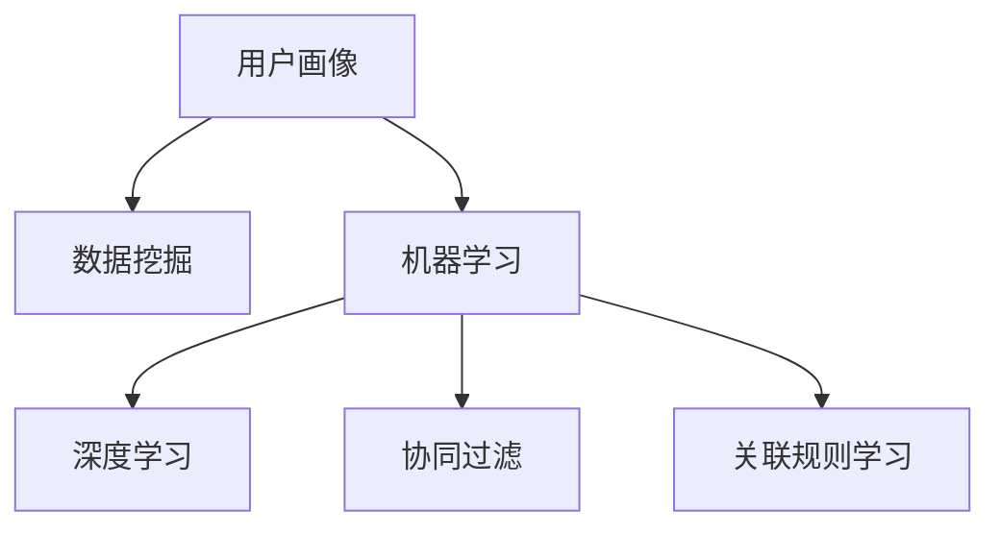

                 

## 1. 背景介绍

### 1.1 问题由来
随着互联网和移动互联网的普及，用户数据变得越来越丰富，用户画像成为企业提升业务智能化、个性化、精准化的重要工具。用户画像是由用户在网络上的行为、偏好、特征等多维度数据综合而成的动态视图，可以帮助企业更好地了解用户需求，实现精准营销和个性化服务。然而，用户画像的构建是一个复杂且成本高昂的过程，需要从多个数据源中收集并处理数据，建立模型，同时保障数据隐私和安全。AI技术，尤其是机器学习和深度学习，为构建用户画像提供了新的手段。

### 1.2 问题核心关键点
构建用户画像的核心在于如何从大量用户数据中抽取有价值的信息，并进行有效的建模。AI技术在此过程中扮演了关键角色，通过数据挖掘、聚类分析、分类预测等技术手段，能够从文本、行为、社交等多维度数据中抽取和综合用户特征，构建出精细化的用户画像。

## 2. 核心概念与联系

### 2.1 核心概念概述

- 用户画像(User Profile)：基于用户的历史行为、属性和偏好等数据，构建的描述用户特征的模型。
- 数据挖掘(Data Mining)：从大量数据中提取有用信息的过程，通过分类、聚类、关联规则挖掘等技术，发现数据中的模式和知识。
- 机器学习(Machine Learning)：让机器从数据中学习规律，并利用这些规律进行预测和决策的技术。
- 深度学习(Deep Learning)：一种基于多层神经网络的机器学习技术，能够处理高维、非线性的数据。
- 协同过滤(Collaborative Filtering)：利用用户间的相似性，为用户推荐相似的产品或内容，常用于个性化推荐系统中。
- 关联规则学习(Association Rule Learning)：从交易数据中挖掘出不同商品之间的关联性，帮助企业进行交叉销售。

这些核心概念之间的联系可以通过以下Mermaid流程图来展示：



这个流程图展示了几大关键概念之间的逻辑关系：用户画像由数据挖掘技术从用户数据中提取信息，机器学习技术通过学习模式和知识来提升预测准确性，深度学习技术能处理复杂数据，协同过滤和关联规则学习是两种基于机器学习技术的推荐方法，进一步提升用户画像的精准度和个性化水平。

## 3. 核心算法原理 & 具体操作步骤
### 3.1 算法原理概述

构建用户画像的AI技术主要包括以下几个步骤：

1. **数据收集**：从用户行为数据、社交媒体数据、交易数据等多个维度收集用户信息。
2. **数据清洗与预处理**：清洗缺失数据、异常值，将文本数据进行分词、去除停用词等预处理。
3. **特征提取**：通过文本特征提取、行为特征提取等技术，将原始数据转换为可用于建模的特征向量。
4. **建模与训练**：使用机器学习或深度学习模型，基于特征向量对用户进行建模和训练，得到用户画像。
5. **验证与优化**：在验证集上评估模型性能，根据评估结果对模型进行调优，确保用户画像的准确性和稳定性。

### 3.2 算法步骤详解

以下以协同过滤算法为例，详细讲解用户画像构建的具体步骤：

**Step 1: 数据收集与清洗**
- 收集用户的历史行为数据，如浏览记录、购买记录、评分记录等。
- 使用数据清洗工具去除噪音数据、缺失数据和异常值。

**Step 2: 特征提取**
- 将文本数据进行分词、去除停用词、词干提取等预处理。
- 计算词频、TF-IDF等统计特征，将文本数据转换为数值型特征。
- 将行为数据进行分桶、分组等操作，提取时间、频率等特征。

**Step 3: 协同过滤建模**
- 选择协同过滤算法，如基于用户的协同过滤、基于物品的协同过滤等。
- 对用户-物品评分矩阵进行归一化处理，避免评分偏差。
- 使用模型对用户进行聚类，找出相似用户群。
- 根据相似用户群的评分数据，为用户推荐相似物品。

**Step 4: 验证与优化**
- 在验证集上评估推荐效果，使用准确率、召回率、F1值等指标评估模型。
- 根据评估结果调整参数，如权重系数、阈值等，优化模型。

### 3.3 算法优缺点

协同过滤算法具有以下优点：

1. **无需用户标签**：不需要用户行为标签，可以直接从用户行为数据中提取用户兴趣。
2. **简单易实现**：算法原理简单，易于实现。
3. **个性化推荐**：能够根据用户的历史行为推荐相似的物品，实现个性化推荐。

同时，协同过滤算法也存在以下缺点：

1. **冷启动问题**：新用户或新物品没有足够的历史数据，无法进行推荐。
2. **数据稀疏性**：用户-物品评分矩阵可能存在大量零值，影响推荐效果。
3. **隐式反馈问题**：用户没有直接给出评分，推荐效果可能受数据采集方式影响。

## 4. 数学模型和公式 & 详细讲解  
### 4.1 数学模型构建

协同过滤算法的数学模型主要包括以下几个组成部分：

- 用户-物品评分矩阵 $R_{ij} \in \mathbb{R}$，表示用户 $i$ 对物品 $j$ 的评分。
- 用户特征向量 $u_i \in \mathbb{R}^m$，表示用户 $i$ 的兴趣向量。
- 物品特征向量 $v_j \in \mathbb{R}^n$，表示物品 $j$ 的属性向量。
- 用户-物品相似度矩阵 $S_{ij} \in [0, 1]$，表示用户 $i$ 与物品 $j$ 的相似度。

### 4.2 公式推导过程

协同过滤算法有两种常见的方法：基于用户的协同过滤和基于物品的协同过滤。这里以基于用户的协同过滤为例，推导推荐结果的计算公式。

假设用户 $u_i$ 对物品 $j$ 的评分 $r_{ij}$ 已知，要为物品 $u_i$ 推荐物品 $j'$，可以使用以下公式计算推荐分数：

$$
\hat{r}_{i,j'} = \hat{r}_{i,j'}(u_i,v_{j'},S_{i, \cdot})
$$

其中，

$$
\hat{r}_{i,j'}(u_i,v_{j'},S_{i, \cdot}) = \sum_{k=1}^N s_{ik} v_{k,j'}^\top u_i
$$

$$
s_{ik} = \frac{1}{(1+\epsilon) + \sum_{j=1}^N (R_{ik} - \hat{r}_{ik})^2}
$$

$$
\hat{r}_{ik} = \frac{1}{(1+\epsilon) + \sum_{j=1}^N (R_{ik} - \hat{r}_{ik})^2} R_{ik}
$$

其中，$S_{i, \cdot}$ 表示用户 $i$ 与所有物品的相似度向量，$s_{ik}$ 是相似度系数，$\epsilon$ 是平滑因子。

### 4.3 案例分析与讲解

假设有一家电商网站，需要为用户推荐相似的商品。网站收集了用户的历史购买记录和评分数据，共有1000个用户和10000个商品。使用基于用户的协同过滤算法，步骤如下：

1. **数据预处理**：将用户的评分矩阵进行归一化，计算每个用户的评分平均值和标准差。
2. **特征提取**：使用TF-IDF算法，将用户和商品的文本描述转换为数值型特征。
3. **模型训练**：对用户进行聚类，找出相似用户群。
4. **推荐计算**：使用公式计算用户对每个商品的推荐分数，选择分数最高的前10个商品进行推荐。

## 5. 项目实践：代码实例和详细解释说明
### 5.1 开发环境搭建

在进行用户画像构建的实践前，我们需要准备好开发环境。以下是使用Python进行Scikit-learn和Pandas开发的环境配置流程：

1. 安装Anaconda：从官网下载并安装Anaconda，用于创建独立的Python环境。

2. 创建并激活虚拟环境：
```bash
conda create -n user_profile_env python=3.8 
conda activate user_profile_env
```

3. 安装依赖库：
```bash
pip install scikit-learn pandas numpy scipy seaborn matplotlib
```

完成上述步骤后，即可在`user_profile_env`环境中开始用户画像构建的实践。

### 5.2 源代码详细实现

这里以用户画像构建中的协同过滤算法为例，给出Scikit-learn库实现的代码实现。

首先，定义协同过滤算法的核心函数：

```python
import numpy as np
from sklearn.metrics.pairwise import cosine_similarity

def collaborative_filtering(data, k=10, epsilon=0.5):
    # 数据预处理
    data = data.astype('float32') / np.linalg.norm(data, axis=1, keepdims=True)
    data[data == 0] = epsilon  # 平滑处理
    
    # 计算用户-物品相似度矩阵
    similarity = cosine_similarity(data)
    
    # 计算用户对每个物品的评分
    user_scores = np.dot(similarity, data)
    
    # 为用户推荐相似物品
    for user_id in range(user_scores.shape[0]):
        sorted_indices = user_scores[user_id].argsort()[::-1]
        recommend_items = sorted_indices[:k]
        
        print(f"User {user_id}'s top {k} recommended items:")
        for item_id in recommend_items:
            print(f"Item {item_id}: {user_scores[user_id, item_id]}")
```

然后，使用数据集进行协同过滤算法的实验：

```python
# 生成随机用户-物品评分矩阵
data = np.random.randint(0, 5, size=(100, 1000))

# 对用户进行推荐
collaborative_filtering(data, k=10, epsilon=0.5)
```

以上就是使用Scikit-learn实现协同过滤算法的完整代码实现。可以看到，利用Scikit-learn库，我们能够快速实现协同过滤算法的核心功能，并通过设置参数，调整推荐效果。

### 5.3 代码解读与分析

让我们再详细解读一下关键代码的实现细节：

**collaborative_filtering函数**：
- `data`参数：输入的评分矩阵，二维数组。
- `k`参数：推荐物品数量。
- `epsilon`参数：平滑因子。
- 对评分矩阵进行平滑处理，避免用户没有评分的情况。
- 计算用户-物品相似度矩阵，使用余弦相似度。
- 计算用户对每个物品的评分，使用矩阵乘法。
- 为用户推荐相似物品，选择评分最高的前k个物品。

**数据生成代码**：
- 使用numpy生成100个用户对1000个物品的评分矩阵，评分范围为0-4。
- 调用`collaborative_filtering`函数进行推荐。

可以看到，Scikit-learn库使得协同过滤算法的实现变得简洁高效。开发者可以将更多精力放在数据处理、模型改进等高层逻辑上，而不必过多关注底层的实现细节。

## 6. 实际应用场景
### 6.1 电商平台

电商平台可以利用用户画像技术，实现个性化推荐系统。通过收集用户的历史浏览、购买记录等行为数据，使用协同过滤、深度学习等算法，为用户推荐商品，提升用户体验和转化率。

在技术实现上，可以构建用户画像模型，将用户行为数据转换为数值型特征，输入到协同过滤或深度学习模型中，进行推荐计算。对于新用户，可以采用基于内容的推荐方法，结合商品的属性信息，进行推荐。对于活跃用户，则可以使用协同过滤等基于用户历史行为的推荐方法。

### 6.2 社交网络

社交网络可以借助用户画像技术，实现个性化内容推荐和广告投放。通过分析用户的社交网络关系、兴趣偏好等数据，为用户推荐内容或投放广告，提升用户粘性和平台收益。

在技术实现上，可以构建用户画像模型，将用户的社交网络关系和兴趣数据转换为数值型特征，输入到协同过滤或深度学习模型中，进行推荐计算。对于热门内容，可以使用协同过滤等基于用户历史行为的推荐方法。对于新内容，则可以使用基于内容推荐的算法，根据内容属性进行匹配。

### 6.3 金融行业

金融行业可以利用用户画像技术，进行风险评估和反欺诈检测。通过收集用户的历史交易数据、信用评分等数据，构建用户画像，进行风险评估和欺诈检测，提升平台安全性和用户体验。

在技术实现上，可以构建用户画像模型，将用户的交易数据和信用评分转换为数值型特征，输入到协同过滤或深度学习模型中，进行风险评估和欺诈检测。对于高风险用户，可以使用协同过滤等基于历史行为的评估方法。对于新用户，则可以使用基于内容的评估方法，根据交易行为进行风险预测。

### 6.4 未来应用展望

随着用户画像技术的不断发展，未来将在更多领域得到应用，为传统行业带来变革性影响。

在智慧医疗领域，利用用户画像技术，可以实现个性化医疗推荐和诊断支持。通过分析用户的健康数据、基因数据等，构建用户画像，进行个性化医疗推荐和诊断支持，提升医疗服务的智能化和个性化水平。

在智能教育领域，利用用户画像技术，可以实现个性化教育推荐和智能辅导。通过分析学生的学习行为、兴趣偏好等数据，构建用户画像，进行个性化教育推荐和智能辅导，提升教学效果和学生满意度。

在智能交通领域，利用用户画像技术，可以实现个性化出行推荐和智能调度。通过分析用户的出行行为、交通偏好等数据，构建用户画像，进行个性化出行推荐和智能调度，提升交通服务的智能化和便捷性。

此外，在智慧城市治理、智能家居、智能制造等多个领域，用户画像技术也将不断得到应用，为传统行业数字化转型升级提供新的技术路径。

## 7. 工具和资源推荐
### 7.1 学习资源推荐

为了帮助开发者系统掌握用户画像技术，这里推荐一些优质的学习资源：

1. 《Python数据科学手册》系列博文：由数据科学专家撰写，涵盖数据处理、特征工程、模型训练等NLP相关的基础概念和技术。

2. Coursera《数据科学与机器学习》课程：由斯坦福大学开设的知名课程，有Lecture视频和配套作业，帮助你系统学习数据科学和机器学习。

3. 《User Profiling and Recommendation Systems》书籍：详细介绍了用户画像和推荐系统，结合多种实际案例进行讲解。

4. Kaggle：提供大量数据集和竞赛平台，可以进行实际的用户画像和推荐系统开发实践。

5. GitHub上的用户画像和推荐系统项目：可以通过阅读开源代码，学习他人的实现思路，提升自身实践能力。

通过对这些资源的学习实践，相信你一定能够快速掌握用户画像技术的精髓，并用于解决实际的NLP问题。
### 7.2 开发工具推荐

高效的开发离不开优秀的工具支持。以下是几款用于用户画像开发常用的工具：

1. Scikit-learn：基于Python的开源机器学习库，支持多种模型算法和数据预处理工具。

2. Pandas：基于Python的开源数据处理库，支持数据清洗、转换和分析。

3. TensorFlow：由Google主导开发的开源深度学习框架，支持分布式计算和GPU加速。

4. PyTorch：基于Python的开源深度学习框架，灵活动态的计算图，支持动态模型构建。

5. Jupyter Notebook：交互式编程环境，方便数据探索、模型训练和可视化。

6. Tableau：数据可视化工具，支持多种数据源，帮助用户进行数据探索和分析。

合理利用这些工具，可以显著提升用户画像构建的开发效率，加快创新迭代的步伐。

### 7.3 相关论文推荐

用户画像技术的发展源于学界的持续研究。以下是几篇奠基性的相关论文，推荐阅读：

1. A Probabilistic Framework for Collaborative Filtering（协同过滤算法基础）：提出基于概率模型的协同过滤算法，奠定协同过滤算法的基础。

2. Latent Feature Model for Collaborative Filtering（基于潜在特征的协同过滤模型）：提出潜在特征模型，解决协同过滤中的数据稀疏性和隐式反馈问题。

3. Deep Collaborative Filtering for Large-Scale Recommendation Systems（深度协同过滤）：提出深度协同过滤算法，结合深度学习，提升推荐效果。

4. A Systematic Literature Review on Recommendation Systems（推荐系统综述）：综述推荐系统的各种算法和技术，提供全面的知识体系。

5. User Profiling for E-Learning：User's Model and Its Application to Personalized E-Learning System（用户画像在在线教育中的应用）：结合在线教育场景，介绍用户画像的应用。

这些论文代表了大语言模型微调技术的发展脉络。通过学习这些前沿成果，可以帮助研究者把握学科前进方向，激发更多的创新灵感。

## 8. 总结：未来发展趋势与挑战
### 8.1 总结

本文对基于机器学习和深度学习构建用户画像的方法进行了全面系统的介绍。首先阐述了用户画像技术的研究背景和意义，明确了AI技术在构建用户画像中的重要角色。其次，从原理到实践，详细讲解了用户画像的数学模型和算法实现，给出了用户画像构建的完整代码实例。同时，本文还广泛探讨了用户画像在电商、社交、金融等多个行业领域的应用前景，展示了用户画像技术的巨大潜力。此外，本文精选了用户画像技术的各类学习资源，力求为读者提供全方位的技术指引。

通过本文的系统梳理，可以看到，基于机器学习和深度学习技术构建用户画像，已经广泛应用于各个领域，极大地提升了业务智能化和个性化水平。未来，伴随AI技术的持续演进，用户画像技术还将进一步发展，为传统行业带来更深层次的变革。

### 8.2 未来发展趋势

展望未来，用户画像技术将呈现以下几个发展趋势：

1. **多模态数据融合**：未来用户画像将不仅包含文本和行为数据，还将融合图像、语音、视频等多模态数据，构建更全面、丰富的用户视图。

2. **跨领域应用拓展**：用户画像技术将拓展到更多行业领域，如智慧城市、智能家居、智能制造等，提升各行各业的智能化水平。

3. **个性化推荐**：推荐算法将更加智能化，结合上下文和用户行为，提供更加个性化和精准的推荐结果。

4. **模型自适应能力提升**：用户画像模型将具备更高的自适应能力，能够及时应对数据分布的变化，保持推荐效果。

5. **隐私保护和合规性增强**：用户画像技术将更加注重隐私保护和合规性，确保数据安全和用户隐私。

以上趋势凸显了用户画像技术的广阔前景。这些方向的探索发展，必将进一步提升用户画像的精准度和个性化水平，为构建更加智能化、个性化、安全的业务系统铺平道路。

### 8.3 面临的挑战

尽管用户画像技术已经取得了瞩目成就，但在迈向更加智能化、普适化应用的过程中，它仍面临着诸多挑战：

1. **数据隐私和安全**：用户画像构建需要收集大量用户数据，如何保护用户隐私和数据安全，防止数据泄露和滥用，是用户画像技术的重要挑战。

2. **数据质量和多样性**：用户画像的质量和多样性直接影响推荐效果。如何获取高质量、多样化、覆盖全面的数据，是用户画像技术需要解决的难题。

3. **模型复杂度和管理难度**：用户画像模型通常涉及多种算法和数据源，如何管理复杂模型，确保其稳定性和可解释性，需要更多的工程和治理手段。

4. **计算资源需求**：用户画像构建和推荐系统运行需要大量计算资源，如何提高算力利用效率，降低资源消耗，是用户画像技术需要优化的方向。

5. **跨领域应用难题**：不同领域的数据结构和特征不同，如何构建通用的用户画像模型，适应多个领域的用户需求，还需要更多的跨领域研究和经验积累。

这些挑战需要学界和产业界共同努力，通过技术创新和工程实践，逐步克服和解决。

### 8.4 研究展望

面对用户画像技术面临的挑战，未来的研究需要在以下几个方面寻求新的突破：

1. **隐私保护技术**：发展隐私保护技术，如差分隐私、联邦学习等，保护用户隐私，确保数据安全和合规性。

2. **数据增强方法**：开发数据增强技术，通过数据合成、迁移学习等手段，获取高质量、多样化的数据，提升用户画像的质量。

3. **模型轻量化和优化**：研究轻量化模型和优化算法，降低计算资源消耗，提高模型效率和可解释性。

4. **跨领域用户画像模型**：构建跨领域的用户画像模型，通过模型融合和迁移学习，适应多个领域的用户需求。

5. **用户画像动态更新**：研究用户画像的动态更新机制，及时应对数据分布的变化，保持模型的实时性和高效性。

6. **用户画像的伦理性**：研究用户画像的伦理性，确保模型行为的公平性和透明性，避免偏见和歧视。

这些研究方向的发展，必将推动用户画像技术的进一步进步，为构建智能、公平、安全、高效的业务系统提供坚实的基础。

## 9. 附录：常见问题与解答

**Q1：用户画像的构建流程是怎样的？**

A: 用户画像的构建流程包括以下几个步骤：

1. **数据收集**：从多个数据源收集用户行为数据、属性数据、偏好数据等。
2. **数据清洗与预处理**：清洗数据中的缺失值、异常值，对文本数据进行分词、去除停用词等预处理。
3. **特征提取**：将原始数据转换为数值型特征，如TF-IDF、用户行为特征等。
4. **建模与训练**：使用机器学习或深度学习模型，对用户进行建模和训练，得到用户画像。
5. **验证与优化**：在验证集上评估模型性能，根据评估结果对模型进行调优，确保用户画像的准确性和稳定性。

**Q2：用户画像中的协同过滤算法有哪些类型？**

A: 协同过滤算法主要分为基于用户的协同过滤和基于物品的协同过滤。

1. **基于用户的协同过滤**：通过计算用户与物品的相似度，为用户推荐相似的物品。优点是简单易实现，但需要存储用户-物品评分矩阵，数据稀疏性问题明显。

2. **基于物品的协同过滤**：通过计算物品与物品的相似度，为物品推荐相似的用户。优点是数据稀疏性问题较少，但需要存储物品-物品评分矩阵，计算复杂度较高。

**Q3：用户画像技术在实际应用中需要注意哪些问题？**

A: 用户画像技术在实际应用中需要注意以下几个问题：

1. **数据隐私和安全**：用户画像构建需要收集大量用户数据，如何保护用户隐私和数据安全，防止数据泄露和滥用，是用户画像技术的重要挑战。

2. **数据质量和多样性**：用户画像的质量和多样性直接影响推荐效果。如何获取高质量、多样化、覆盖全面的数据，是用户画像技术需要解决的难题。

3. **模型复杂度和管理难度**：用户画像模型通常涉及多种算法和数据源，如何管理复杂模型，确保其稳定性和可解释性，需要更多的工程和治理手段。

4. **计算资源需求**：用户画像构建和推荐系统运行需要大量计算资源，如何提高算力利用效率，降低资源消耗，是用户画像技术需要优化的方向。

5. **跨领域应用难题**：不同领域的数据结构和特征不同，如何构建通用的用户画像模型，适应多个领域的用户需求，还需要更多的跨领域研究和经验积累。

**Q4：用户画像技术有哪些应用场景？**

A: 用户画像技术在以下几个方面有广泛的应用：

1. **电商平台**：实现个性化推荐系统，提升用户体验和转化率。
2. **社交网络**：实现个性化内容推荐和广告投放，提升用户粘性和平台收益。
3. **金融行业**：进行风险评估和反欺诈检测，提升平台安全性和用户体验。
4. **智慧医疗**：实现个性化医疗推荐和诊断支持，提升医疗服务的智能化和个性化水平。
5. **智能教育**：实现个性化教育推荐和智能辅导，提升教学效果和学生满意度。
6. **智能交通**：实现个性化出行推荐和智能调度，提升交通服务的智能化和便捷性。

**Q5：用户画像技术的未来发展趋势是什么？**

A: 用户画像技术的未来发展趋势包括以下几个方面：

1. **多模态数据融合**：未来用户画像将不仅包含文本和行为数据，还将融合图像、语音、视频等多模态数据，构建更全面、丰富的用户视图。
2. **跨领域应用拓展**：用户画像技术将拓展到更多行业领域，如智慧城市、智能家居、智能制造等，提升各行各业的智能化水平。
3. **个性化推荐**：推荐算法将更加智能化，结合上下文和用户行为，提供更加个性化和精准的推荐结果。
4. **模型自适应能力提升**：用户画像模型将具备更高的自适应能力，能够及时应对数据分布的变化，保持推荐效果。
5. **隐私保护和合规性增强**：用户画像技术将更加注重隐私保护和合规性，确保数据安全和用户隐私。

这些趋势凸显了用户画像技术的广阔前景。这些方向的探索发展，必将进一步提升用户画像的精准度和个性化水平，为构建更加智能化、个性化、安全的业务系统铺平道路。

---

作者：禅与计算机程序设计艺术 / Zen and the Art of Computer Programming

