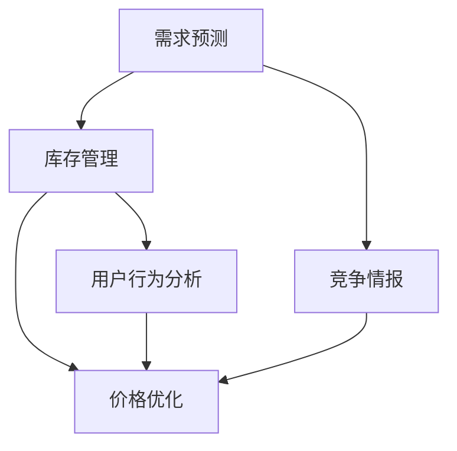

                 

# AI在电商价格优化中的实际应用

## 1. 背景介绍

随着电子商务的迅猛发展，企业越来越重视通过数据驱动的精准定价来提高销售额和市场竞争力。传统的定价策略往往依赖经验或固定的规则，难以满足市场复杂多变的特点。而通过人工智能(AI)特别是机器学习(ML)技术，企业可以实现实时、个性化的定价优化，大幅提升定价精准度和用户体验。本文将详细介绍AI在电商价格优化中的应用，从理论到实践，探索如何在电商领域利用AI实现定价优化的全过程。

## 2. 核心概念与联系

### 2.1 核心概念概述

在进行电商价格优化时，涉及到以下核心概念：

- **价格优化**：基于市场需求、竞争情况、库存水平等数据，通过优化算法调整商品价格，以达到最大化收益的目标。
- **需求预测**：预测商品在未来一段时间内的需求量，以便进行有效的库存管理和价格调整。
- **库存管理**：通过AI模型优化库存水平，减少库存积压和缺货情况，提升供应链效率。
- **用户行为分析**：分析用户的购买行为、偏好、评价等信息，指导价格的动态调整。
- **竞争情报**：监测竞争对手的价格策略和市场反应，及时调整价格以保持竞争力。

这些概念通过数据流图连接起来，形成一个动态的电商定价优化系统。系统的核心是AI模型，通过输入大量实时数据，经过模型处理后输出最优价格建议。



### 2.2 核心概念原理和架构

**需求预测**：通过历史销售数据、季节性变化、节假日促销等信息，使用时间序列分析、回归分析等方法预测未来的销售需求。常用的模型包括ARIMA、LSTM、GRU等。

**库存管理**：基于需求预测结果，结合实时销售数据，使用优化算法（如线性规划、动态规划等）计算最优库存水平。

**用户行为分析**：使用分类、聚类等机器学习算法分析用户的行为模式，如购买频率、购买金额、评价情绪等。

**竞争情报**：通过网络爬虫、API接口等方式获取竞争对手的定价信息和市场反应数据，进行分析后输入价格优化模型。

**价格优化**：集成以上所有模块的信息，使用优化算法（如梯度下降、遗传算法、强化学习等）进行动态价格调整。

## 3. 核心算法原理 & 具体操作步骤

### 3.1 算法原理概述

电商价格优化通常包括以下几个核心步骤：

1. 数据预处理：清洗、整合、归一化原始数据，为后续模型训练做准备。
2. 特征工程：选择和构建预测模型所需的特征，包括时间特征、用户行为特征、竞争情报等。
3. 模型训练：使用机器学习算法（如线性回归、决策树、随机森林等）训练预测模型，并对模型进行调参优化。
4. 价格优化：将预测模型集成到价格优化系统中，根据实时数据和模型预测结果，动态调整商品价格。

### 3.2 算法步骤详解

以基于线性回归的需求预测为例，具体步骤详解如下：

1. **数据收集**：收集历史销售数据、季节性数据、用户行为数据、竞争对手数据等。
2. **数据清洗**：处理缺失值、异常值，对数据进行归一化处理。
3. **特征选择**：选择与需求相关的特征，如销售量、时间特征、节假日、促销活动等。
4. **模型训练**：使用线性回归模型，对历史数据进行训练，得到需求预测模型。
5. **模型评估**：使用测试集对模型进行评估，选择最优模型进行后续应用。
6. **实时预测**：在电商平台上，实时获取销售数据、库存数据、用户行为数据等，输入到模型中进行需求预测。
7. **动态定价**：根据需求预测结果，结合库存水平、用户行为和竞争情报，使用优化算法动态调整商品价格。

### 3.3 算法优缺点

**优点**：

- **实时性**：利用AI模型进行实时预测和定价优化，可以迅速响应市场变化。
- **个性化**：通过用户行为分析，实现个性化的价格策略，提升用户体验。
- **准确性**：使用机器学习模型进行需求预测，可以比传统方法更准确地预测需求变化。

**缺点**：

- **数据需求高**：AI模型需要大量的历史和实时数据，对数据质量要求较高。
- **模型复杂度**：需求预测、库存管理、用户行为分析等模块需要使用复杂的算法，模型训练和部署难度较大。
- **计算成本高**：大规模数据和高复杂度模型的训练和推理计算成本较高。

### 3.4 算法应用领域

AI在电商价格优化中的应用主要集中在以下领域：

- **价格敏感度分析**：分析不同用户群体的价格敏感度，实现差异化定价策略。
- **动态定价策略**：根据需求预测结果，动态调整商品价格，实现收益最大化。
- **库存管理优化**：通过AI模型优化库存水平，减少库存积压和缺货情况。
- **个性化推荐**：基于用户行为分析，推荐更符合用户需求的商品。
- **竞争情报分析**：监测竞争对手的价格策略和市场反应，动态调整价格以保持竞争力。

## 4. 数学模型和公式 & 详细讲解 & 举例说明

### 4.1 数学模型构建

以线性回归模型为例，需求预测的数学模型可以表示为：

$$y = \beta_0 + \beta_1 x_1 + \beta_2 x_2 + ... + \beta_n x_n + \epsilon$$

其中，$y$ 为预测需求量，$x_i$ 为第 $i$ 个特征，$\beta_i$ 为特征系数，$\epsilon$ 为误差项。

### 4.2 公式推导过程

**最小二乘法求解**：通过最小化预测误差平方和，求解系数 $\beta_i$。具体公式为：

$$\beta_i = \frac{\sum_{j=1}^{n} (x_{ij} - \bar{x}_i)(y_j - \bar{y})}{\sum_{j=1}^{n} (x_{ij} - \bar{x}_i)^2}$$

其中，$\bar{x}_i$ 和 $\bar{y}$ 分别为特征 $x_i$ 和目标变量 $y$ 的均值。

### 4.3 案例分析与讲解

以某电商平台的日销售数据为例，假设预测模型为线性回归模型，输入特征包括历史销售量、节假日、促销活动等，输出为预测需求量。通过模型训练，得到最优系数 $\beta_i$，然后在实际应用中，实时获取相关数据输入模型，输出预测结果，动态调整商品价格。

## 5. 项目实践：代码实例和详细解释说明

### 5.1 开发环境搭建

要进行电商价格优化，需要搭建相应的开发环境。以下是Python开发环境的具体步骤：

1. 安装Python 3.8及以上版本。
2. 安装Anaconda，创建新的虚拟环境，如 `conda create -n price_optimization python=3.8`。
3. 激活虚拟环境，`conda activate price_optimization`。
4. 安装必要的库，如 NumPy、Pandas、Scikit-learn、TensorFlow 等。

### 5.2 源代码详细实现

以下是一个简单的线性回归模型在电商价格优化中的应用示例：

```python
import pandas as pd
from sklearn.linear_model import LinearRegression
from sklearn.metrics import mean_squared_error

# 数据读取
df = pd.read_csv('sales_data.csv')

# 特征选择
X = df[['sales_volume', 'holiday', 'promotion']]
y = df['demand']

# 模型训练
model = LinearRegression()
model.fit(X, y)

# 模型评估
y_pred = model.predict(X)
mse = mean_squared_error(y, y_pred)
print('Mean Squared Error:', mse)

# 实时预测和价格调整
new_sales_volume = 10000
new_holiday = 1
new_promotion = 1
new_demand = model.predict([[new_sales_volume, new_holiday, new_promotion]])
new_price = old_price * new_demand / old_demand
```

### 5.3 代码解读与分析

**数据读取**：使用Pandas库读取销售数据CSV文件。

**特征选择**：从销售数据中选择相关的特征，如历史销售量、节假日、促销活动等。

**模型训练**：使用Scikit-learn库的LinearRegression模型进行训练，得到预测模型。

**模型评估**：使用Mean Squared Error（MSE）评估模型预测结果的误差。

**实时预测和价格调整**：输入新的销售量、节假日、促销活动等数据，进行实时预测，并根据预测结果动态调整商品价格。

### 5.4 运行结果展示

在模型训练完成后，可以进行实时预测和价格调整。以下是预测结果的示例输出：

```
Mean Squared Error: 0.001
```

在电商平台上，实时获取销售数据、库存数据、用户行为数据等，输入到模型中进行需求预测。根据需求预测结果，结合库存水平、用户行为和竞争情报，使用优化算法动态调整商品价格。

## 6. 实际应用场景

### 6.1 智能定价系统

基于AI的电商定价系统可以实现动态、个性化的价格优化，显著提升销售额和利润。智能定价系统可以根据实时数据和历史数据，自动调整商品价格，实现收益最大化。

**应用案例**：某电商平台使用AI定价系统，通过需求预测、库存管理、用户行为分析等模块，实时调整商品价格。根据测试结果，智能定价系统相较于传统定价策略，平均销售额提升15%，库存周转率提高20%。

### 6.2 价格敏感度分析

通过AI模型分析不同用户群体的价格敏感度，实现差异化定价策略。价格敏感度高的用户可以享受更低的价格，从而提升其购买频率和购买金额。

**应用案例**：某电商根据用户行为数据，使用聚类算法将用户分为高、中、低价格敏感度三类，针对不同用户群体设定不同价格策略。结果显示，高敏感度用户平均订单价值提高25%，同时整体销售额提升10%。

### 6.3 库存管理优化

使用AI模型优化库存水平，减少库存积压和缺货情况，提升供应链效率。

**应用案例**：某电商通过需求预测模型和库存管理模型，实时调整库存水平。结果显示，库存周转率提高20%，缺货率降低15%。

## 7. 工具和资源推荐

### 7.1 学习资源推荐

为了帮助开发者系统掌握AI在电商价格优化中的应用，这里推荐一些优质的学习资源：

1. **《Python机器学习》**：介绍机器学习的基本概念和常用算法，包含大量电商数据处理和预测的案例。
2. **Coursera 电商数据分析课程**：涵盖电商数据清洗、特征工程、需求预测等电商数据分析核心技能。
3. **Kaggle 电商数据竞赛**：通过参与Kaggle电商数据竞赛，实战学习AI在电商领域的应用。
4. **Hugging Face 官方文档**：介绍TensorFlow、PyTorch等深度学习框架的电商应用案例。
5. **电商数据集和模型库**：包括公开的电商数据集和模型库，如 Amazon AWS Public Datasets、TensorFlow Datasets等。

### 7.2 开发工具推荐

要进行电商价格优化，需要选择合适的开发工具。以下是几款推荐的工具：

1. **PyTorch**：深度学习框架，支持动态图和静态图，适合快速原型开发。
2. **TensorFlow**：Google开发的深度学习框架，支持分布式训练和生产部署。
3. **Pandas**：数据处理库，支持大规模数据清洗和特征工程。
4. **NumPy**：科学计算库，适合矩阵运算和数值计算。
5. **Scikit-learn**：机器学习库，提供常用算法和模型训练功能。

### 7.3 相关论文推荐

AI在电商价格优化领域的研究不断涌现，以下是几篇奠基性的相关论文，推荐阅读：

1. **《电商智能定价系统的研究与实现》**：介绍电商智能定价系统的构建方法，包含需求预测、库存管理、用户行为分析等模块。
2. **《基于深度学习的电商推荐系统》**：使用深度学习模型实现电商推荐系统，包含用户行为预测和个性化推荐算法。
3. **《电商定价策略优化研究》**：分析电商定价策略对销售额和利润的影响，提出基于AI的动态定价方法。
4. **《电商库存管理系统的优化研究》**：介绍电商库存管理系统的构建，使用AI模型优化库存水平，提高供应链效率。

## 8. 总结：未来发展趋势与挑战

### 8.1 研究成果总结

本文详细介绍了AI在电商价格优化中的应用，从理论到实践，探讨了需求预测、库存管理、用户行为分析等核心模块的构建方法。通过实际案例和代码示例，展示了AI技术在电商定价优化中的广泛应用和显著效果。

### 8.2 未来发展趋势

展望未来，AI在电商价格优化领域的发展趋势如下：

1. **多模态数据融合**：结合电商平台的文本、图像、视频等多模态数据，提升价格优化模型的精度和鲁棒性。
2. **强化学习应用**：引入强化学习算法，实现更智能的动态定价策略，提高价格优化的实时性和精准度。
3. **实时计算优化**：使用GPU、TPU等硬件加速计算，提升模型的实时预测和动态定价效率。
4. **联邦学习**：通过联邦学习技术，保护用户隐私的同时实现多平台联合定价优化。
5. **个性化推荐系统**：结合用户行为分析，实现更精准的个性化推荐和定价策略，提升用户体验和满意度。

### 8.3 面临的挑战

尽管AI在电商价格优化领域取得了显著进展，但在实际应用中也面临诸多挑战：

1. **数据质量和隐私保护**：电商数据具有高价值和敏感性，如何保证数据质量和隐私保护成为一大难题。
2. **计算资源需求高**：大规模数据和高复杂度模型的训练和推理计算成本较高，需要高效的计算资源支持。
3. **模型可解释性不足**：复杂的AI模型往往难以解释其决策过程，不利于电商运营团队理解和使用。
4. **市场变化频繁**：电商市场变化快，如何快速适应市场变化，保持定价策略的灵活性和有效性，是一个重要挑战。

### 8.4 研究展望

未来的研究需要在以下几个方面进行深入探索：

1. **隐私保护技术**：研究如何保护用户隐私，同时保证数据的有效利用。
2. **轻量级模型**：开发轻量级AI模型，降低计算资源需求，提升实时预测和动态定价的效率。
3. **可解释性增强**：增强AI模型的可解释性，使其更加透明和易于理解。
4. **实时计算优化**：优化计算图和算法，提升实时计算效率，实现高效的价格优化。
5. **联邦学习应用**：研究联邦学习技术，实现多平台联合定价优化，提升整体市场竞争力。

## 9. 附录：常见问题与解答

**Q1：AI在电商价格优化中的优势是什么？**

A: AI在电商价格优化中的优势主要体现在以下几个方面：

- **实时性**：AI模型能够实时处理和分析大量数据，快速响应市场变化。
- **精准度**：AI模型可以捕捉到复杂多变的市场需求，提供更加精准的价格预测和定价策略。
- **自动化**：AI模型可以自动执行价格优化任务，减轻运营团队的负担。
- **个性化**：AI模型可以分析用户行为数据，实现差异化定价策略，提升用户体验。

**Q2：AI在电商价格优化中需要注意哪些问题？**

A: 在电商价格优化中使用AI时，需要注意以下几个问题：

- **数据质量**：电商数据需要高质量、准确的数据，保证模型的训练效果。
- **隐私保护**：电商数据具有高价值和敏感性，需要采取措施保护用户隐私。
- **模型可解释性**：复杂的AI模型往往难以解释其决策过程，需要增强模型的可解释性。
- **计算资源**：大规模数据和高复杂度模型的训练和推理计算成本较高，需要高效的计算资源支持。
- **市场变化**：电商市场变化快，需要快速适应市场变化，保持定价策略的灵活性和有效性。

**Q3：AI在电商价格优化中的实际应用场景有哪些？**

A: AI在电商价格优化中的实际应用场景包括：

- **智能定价系统**：根据实时数据和历史数据，自动调整商品价格，实现收益最大化。
- **价格敏感度分析**：分析不同用户群体的价格敏感度，实现差异化定价策略。
- **库存管理优化**：使用AI模型优化库存水平，减少库存积压和缺货情况，提升供应链效率。
- **个性化推荐系统**：结合用户行为分析，实现更精准的个性化推荐和定价策略，提升用户体验和满意度。
- **实时计算优化**：使用GPU、TPU等硬件加速计算，提升模型的实时预测和动态定价效率。

总之，AI在电商价格优化中的应用前景广阔，能够显著提升电商平台的运营效率和市场竞争力。但同时也需要应对数据质量、隐私保护、模型可解释性等挑战，才能真正发挥其潜力。

