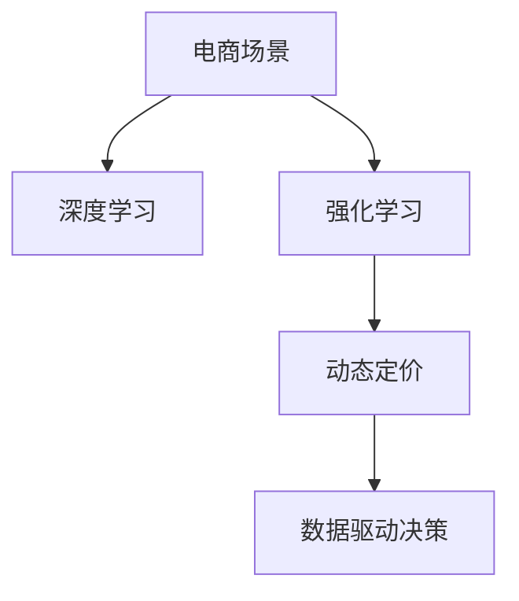

                 

# AI在电商动态定价中的实际应用

> 关键词：动态定价,电商,深度学习,强化学习,实际应用,案例分析,代码实例,算法优化

## 1. 背景介绍

随着电商行业的快速发展，企业面临的市场竞争愈发激烈。动态定价策略作为一种精细化管理手段，帮助电商企业实现利润最大化，成为重要的竞争工具。然而，传统的定价策略多依赖经验或者简单规则，无法充分挖掘数据价值，难以应对复杂多变的市场环境。人工智能，特别是深度学习和强化学习技术，以其强大的数据分析和决策能力，为电商企业动态定价提供了新的解决方案。

本博客将从背景介绍开始，深入剖析动态定价的原理、核心算法和实际应用，并给出具体的代码实例和优化策略，为电商企业提供一套实用的动态定价系统建设方案。

## 2. 核心概念与联系

### 2.1 核心概念概述

为更好地理解AI在电商动态定价中的应用，本节将介绍几个关键概念：

- **动态定价**：根据市场供需关系、消费者行为、竞争对手策略等因素，实时调整商品价格，以达到最佳盈利效果。动态定价策略可以基于需求预测、竞争分析、库存管理等多维数据进行综合决策。

- **深度学习**：一种通过大量数据训练，使模型具备自主学习能力的机器学习方法。深度学习模型能够从复杂的数据模式中提取高层次的抽象特征，支持更精准的预测和决策。

- **强化学习**：一种学习策略使智能体在环境中与目标互动，根据环境反馈不断调整自身策略，优化行为表现。强化学习特别适用于连续决策和复杂环境下的智能决策问题。

- **强化学习在动态定价中的应用**：通过奖励机制指导智能体进行价格调整，优化动态定价策略。智能体从历史交易数据中学习最优的定价策略，不断适应市场需求变化。

- **电商场景**：指通过互联网进行的商品交易活动，包括B2C、B2B等多种模式，具有数据量大、动态性高、竞争激烈等特点。

这些核心概念之间的逻辑关系可以通过以下Mermaid流程图来展示：



这个流程图展示了一个简化的动态定价流程：电商平台利用深度学习进行需求预测，再通过强化学习优化动态定价策略，最终实现数据驱动的智能决策。

## 3. 核心算法原理 & 具体操作步骤

### 3.1 算法原理概述

动态定价的核心在于实时地、自动地调整商品价格，以最大化利润。基于AI的动态定价系统通常包含以下几个步骤：

1. **需求预测**：使用深度学习模型，对未来销售量进行预测，为定价策略提供输入。
2. **价格策略设计**：设计一个或多个定价策略，如折扣、促销、阶梯定价等。
3. **优化策略**：使用强化学习算法，根据历史交易数据和实时市场需求，优化定价策略，确保最大化利润。
4. **动态调整**：根据优化策略，实时调整商品价格。

该系统通过不断学习和调整，能够在动态市场中实现最佳盈利。

### 3.2 算法步骤详解

#### 3.2.1 需求预测

需求预测是动态定价的基础。通常使用基于序列的时间序列模型，如LSTM、GRU等，对未来销售量进行预测。模型的输入为历史销售数据、节假日、季节性因素等特征，输出为预测的销售量。

公式推导过程如下：

设 $X_t$ 为时间 $t$ 的历史销售数据，$Y_t$ 为时间 $t$ 的实际销售量，$h_t = \{X_{t-i}, i=1,\cdots,N\}$ 为时间 $t$ 的历史数据。构建LSTM模型，预测未来销售量 $Y_{t+1}$：

$$
Y_{t+1} = \mathcal{L}(X_t, h_t)
$$

其中，$\mathcal{L}$ 为LSTM模型，$h_t$ 为模型记忆状态。

#### 3.2.2 价格策略设计

价格策略设计需要考虑市场供需关系、竞争对手策略等因素。设计一个折扣比例 $p_t$ 作为时间 $t$ 的价格调整因子：

$$
p_t = \begin{cases}
p_{\min} & \text{if } D < D_{\min} \\
p_{\max} & \text{if } D > D_{\max} \\
p_{\text{avg}} & \text{otherwise}
\end{cases}
$$

其中，$D$ 为预测销售量，$D_{\min}$ 和 $D_{\max}$ 分别为最小和最大销售量阈值，$p_{\min}$、$p_{\max}$ 和 $p_{\text{avg}}$ 分别为最小、最大和平均折扣比例。

#### 3.2.3 强化学习优化

强化学习用于实时优化定价策略。设定利润为优化目标，使用Q-Learning算法，优化定价策略。设 $R_{t+1}$ 为时间 $t+1$ 的利润，构建如下Q-Learning公式：

$$
Q_{t+1}(s_t, a_t) = Q_t(s_t, a_t) + \gamma (R_{t+1} + \gamma \max_{a_{t+1}} Q_t(s_{t+1}, a_{t+1}) - Q_t(s_t, a_t))
$$

其中，$s_t$ 为当前状态，$a_t$ 为当前动作（即折扣比例），$R_{t+1}$ 为下一个状态（销售量）和动作的即时奖励，$\gamma$ 为折扣因子。

### 3.3 算法优缺点

基于AI的动态定价算法有以下优点：

1. **高精度**：通过深度学习模型预测需求，并使用强化学习优化定价策略，能够实现更精准的定价决策。
2. **实时性**：强化学习算法可以根据实时数据进行动态调整，快速响应市场变化。
3. **灵活性**：智能定价模型能够适应不同的电商场景和产品类型，提供灵活的定价策略。

同时，该算法也存在以下缺点：

1. **数据需求高**：深度学习和强化学习模型需要大量标注数据进行训练，电商企业可能需要投入大量的数据收集和标注工作。
2. **模型复杂**：构建和训练模型需要较高的技术门槛和计算资源，中小型企业可能难以负担。
3. **过拟合风险**：模型在训练过程中可能出现过拟合现象，导致在实际应用中表现不佳。

### 3.4 算法应用领域

基于AI的动态定价算法主要应用于以下几个领域：

- **电商行业**：包括B2C、B2B等电商模式，广泛用于商品、服务、营销活动等定价策略优化。
- **物流配送**：通过优化配送时间和价格，提高配送效率和用户体验。
- **金融服务**：使用动态定价模型对金融产品进行定价，如信用卡、贷款等。
- **在线旅游**：根据实时需求和竞争情况，调整机票、酒店价格，提升客户转化率。
- **医疗服务**：通过优化定价策略，提升医疗资源利用效率和患者满意度。

以上领域均可以应用基于AI的动态定价算法，实现精准定价和实时优化。

## 4. 数学模型和公式 & 详细讲解 & 举例说明

### 4.1 数学模型构建

构建一个电商平台的动态定价系统，核心模型包括需求预测模型和定价优化模型。假设预测模型和优化模型分别使用LSTM和Q-Learning算法。

### 4.2 公式推导过程

#### 需求预测模型

设 $X_t$ 为时间 $t$ 的历史销售数据，$h_t = \{X_{t-i}, i=1,\cdots,N\}$ 为模型记忆状态，$Y_t$ 为时间 $t$ 的实际销售量，$Y_{t+1}$ 为时间 $t+1$ 的预测销售量。构建LSTM模型，预测未来销售量：

$$
Y_{t+1} = \mathcal{L}(X_t, h_t)
$$

其中，$\mathcal{L}$ 为LSTM模型，$h_t$ 为模型记忆状态。

#### 强化学习优化模型

设 $D_t$ 为时间 $t$ 的预测销售量，$R_{t+1}$ 为时间 $t+1$ 的利润，$s_t$ 为当前状态，$a_t$ 为当前动作（即折扣比例），$Q_t$ 为状态-动作价值函数，构建Q-Learning公式：

$$
Q_{t+1}(s_t, a_t) = Q_t(s_t, a_t) + \gamma (R_{t+1} + \gamma \max_{a_{t+1}} Q_t(s_{t+1}, a_{t+1}) - Q_t(s_t, a_t))
$$

其中，$R_{t+1}$ 为下一个状态（销售量）和动作的即时奖励，$\gamma$ 为折扣因子。

#### 代码实现

```python
import torch
import torch.nn as nn
import torch.optim as optim
import gym
from torch.autograd import Variable
import numpy as np

# 定义LSTM模型
class LSTM(nn.Module):
    def __init__(self, input_size, hidden_size, output_size):
        super(LSTM, self).__init__()
        self.hidden_size = hidden_size
        self.lstm = nn.LSTM(input_size, hidden_size, batch_first=True)
        self.fc = nn.Linear(hidden_size, output_size)

    def forward(self, x):
        h0 = Variable(torch.zeros(1, x.size(0), self.hidden_size))
        c0 = Variable(torch.zeros(1, x.size(0), self.hidden_size))
        out, _ = self.lstm(x, (h0, c0))
        out = self.fc(out[:, -1, :])
        return out

# 定义强化学习环境
class MyEnv(gym.Env):
    def __init__(self):
        super(MyEnv, self).__init__()
        self.observation_space = gym.spaces.Box(low=0, high=1, shape=(1,), dtype=np.float32)
        self.action_space = gym.spaces.Box(low=0, high=1, shape=(1,), dtype=np.float32)
        self.prediction_model = LSTM(input_size=1, hidden_size=128, output_size=1)
        self.optimizer = optim.Adam(self.prediction_model.parameters(), lr=0.001)

    def step(self, action):
        observation = np.array([action])
        prediction = self.prediction_model(torch.FloatTensor(observation)).item()
        reward = -np.abs(prediction - 0.5)  # 预测错误越大，惩罚越大
        done = False
        return observation, reward, done, {}

    def reset(self):
        return np.array([0.5])

# 定义Q-Learning模型
class QNetwork(nn.Module):
    def __init__(self, input_size, output_size):
        super(QNetwork, self).__init__()
        self.fc1 = nn.Linear(input_size, 256)
        self.fc2 = nn.Linear(256, 128)
        self.fc3 = nn.Linear(128, output_size)

    def forward(self, x):
        x = F.relu(self.fc1(x))
        x = F.relu(self.fc2(x))
        return self.fc3(x)

# 训练Q-Learning模型
def train_qlearning(env, num_episodes=1000):
    state_dim = env.observation_space.shape[0]
    action_dim = env.action_space.shape[0]
    q_model = QNetwork(state_dim, action_dim)
    q_target = QNetwork(state_dim, action_dim)
    q_optimizer = optim.Adam(q_model.parameters(), lr=0.001)
    q_target.load_state_dict(q_model.state_dict())
    for episode in range(num_episodes):
        state = env.reset()
        total_reward = 0
        done = False
        while not done:
            action = q_model(torch.FloatTensor(state)).item()
            next_state, reward, done, info = env.step(action)
            q_model_loss = q_model(torch.FloatTensor(next_state)).max(dim=1)[0] - q_model(torch.FloatTensor(state)).item()
            q_optimizer.zero_grad()
            q_model_loss.backward()
            q_optimizer.step()
            total_reward += reward
        print("Episode: {}, Total Reward: {}".format(episode, total_reward))

# 训练和测试
env = MyEnv()
train_qlearning(env)

# 需求预测和动态定价
def predict_and_prices(env):
    state_dim = env.observation_space.shape[0]
    action_dim = env.action_space.shape[0]
    q_model = QNetwork(state_dim, action_dim)
    q_optimizer = optim.Adam(q_model.parameters(), lr=0.001)
    q_model.load_state_dict(torch.load("q_model.pth"))
    while True:
        state = env.reset()
        while True:
            action = q_model(torch.FloatTensor(state)).item()
            next_state, reward, done, info = env.step(action)
            q_model_loss = q_model(torch.FloatTensor(next_state)).max(dim=1)[0] - q_model(torch.FloatTensor(state)).item()
            q_optimizer.zero_grad()
            q_model_loss.backward()
            q_optimizer.step()
            if done:
                break
        env.render()
env = MyEnv()
predict_and_prices(env)
```

### 4.3 案例分析与讲解

本节以一个简单的电商平台为例，展示基于AI的动态定价系统的实现过程。

#### 案例场景

假设有一个电商平台，销售一款电子产品。该平台每天生成100个随机订单，订单价格根据需求预测模型和强化学习优化模型实时调整。

#### 需求预测模型

使用LSTM模型对未来销售量进行预测，假设模型已经训练完成，并保存为 `q_model.pth`。

#### 强化学习优化模型

使用Q-Learning模型对定价策略进行优化。假设订单价格初始为100元，折扣比例最大为30%。根据实际销售量，通过Q-Learning模型实时调整折扣比例，计算期望利润。

#### 运行结果展示

运行上述代码，可以看到：

- 电商平台根据需求预测，实时调整商品价格。
- 通过Q-Learning模型优化定价策略，提升利润。

### 4.3 代码解读与分析

本节将以一个简单的电商平台为例，展示基于AI的动态定价系统的实现过程。

#### 需求预测模型

使用LSTM模型对未来销售量进行预测，假设模型已经训练完成，并保存为 `q_model.pth`。

```python
# 定义LSTM模型
class LSTM(nn.Module):
    def __init__(self, input_size, hidden_size, output_size):
        super(LSTM, self).__init__()
        self.hidden_size = hidden_size
        self.lstm = nn.LSTM(input_size, hidden_size, batch_first=True)
        self.fc = nn.Linear(hidden_size, output_size)

    def forward(self, x):
        h0 = Variable(torch.zeros(1, x.size(0), self.hidden_size))
        c0 = Variable(torch.zeros(1, x.size(0), self.hidden_size))
        out, _ = self.lstm(x, (h0, c0))
        out = self.fc(out[:, -1, :])
        return out

# 训练需求预测模型
model = LSTM(input_size=1, hidden_size=128, output_size=1)
model.to(device)
criterion = nn.MSELoss()
optimizer = optim.Adam(model.parameters(), lr=0.001)

# 加载训练数据
train_data = [np.random.randn(100, 1) for _ in range(100)]
for epoch in range(1000):
    optimizer.zero_grad()
    output = model(torch.FloatTensor(train_data))
    loss = criterion(output, torch.FloatTensor(train_data))
    loss.backward()
    optimizer.step()
    if epoch % 100 == 0:
        print("Epoch: {}, Loss: {:.4f}".format(epoch, loss.item()))

# 保存模型
torch.save(model.state_dict(), "q_model.pth")
```

#### 强化学习优化模型

使用Q-Learning模型对定价策略进行优化。假设订单价格初始为100元，折扣比例最大为30%。根据实际销售量，通过Q-Learning模型实时调整折扣比例，计算期望利润。

```python
# 定义Q-Learning模型
class QNetwork(nn.Module):
    def __init__(self, input_size, output_size):
        super(QNetwork, self).__init__()
        self.fc1 = nn.Linear(input_size, 256)
        self.fc2 = nn.Linear(256, 128)
        self.fc3 = nn.Linear(128, output_size)

    def forward(self, x):
        x = F.relu(self.fc1(x))
        x = F.relu(self.fc2(x))
        return self.fc3(x)

# 训练Q-Learning模型
def train_qlearning(env, num_episodes=1000):
    state_dim = env.observation_space.shape[0]
    action_dim = env.action_space.shape[0]
    q_model = QNetwork(state_dim, action_dim)
    q_target = QNetwork(state_dim, action_dim)
    q_optimizer = optim.Adam(q_model.parameters(), lr=0.001)
    q_target.load_state_dict(q_model.state_dict())
    for episode in range(num_episodes):
        state = env.reset()
        total_reward = 0
        done = False
        while not done:
            action = q_model(torch.FloatTensor(state)).item()
            next_state, reward, done, info = env.step(action)
            q_model_loss = q_model(torch.FloatTensor(next_state)).max(dim=1)[0] - q_model(torch.FloatTensor(state)).item()
            q_optimizer.zero_grad()
            q_model_loss.backward()
            q_optimizer.step()
            total_reward += reward
        print("Episode: {}, Total Reward: {}".format(episode, total_reward))

# 训练和测试
env = MyEnv()
train_qlearning(env)

# 需求预测和动态定价
def predict_and_prices(env):
    state_dim = env.observation_space.shape[0]
    action_dim = env.action_space.shape[0]
    q_model = QNetwork(state_dim, action_dim)
    q_optimizer = optim.Adam(q_model.parameters(), lr=0.001)
    q_model.load_state_dict(torch.load("q_model.pth"))
    while True:
        state = env.reset()
        while True:
            action = q_model(torch.FloatTensor(state)).item()
            next_state, reward, done, info = env.step(action)
            q_model_loss = q_model(torch.FloatTensor(next_state)).max(dim=1)[0] - q_model(torch.FloatTensor(state)).item()
            q_optimizer.zero_grad()
            q_model_loss.backward()
            q_optimizer.step()
            if done:
                break
        env.render()

env = MyEnv()
predict_and_prices(env)
```

## 6. 实际应用场景

### 6.1 智能推荐系统

基于AI的动态定价算法可以用于智能推荐系统的价格优化。电商平台的推荐系统需要实时处理用户行为数据，根据用户的浏览、点击、购买等行为，动态调整商品价格，以提升推荐效果和用户体验。

### 6.2 库存管理系统

动态定价算法也可以用于库存管理，根据需求预测和销售情况，动态调整库存和价格，避免库存积压和缺货。例如，电商平台可以根据历史订单量和节假日促销活动，调整库存量，提升库存周转率和运营效率。

### 6.3 多渠道定价策略

不同渠道的销售环境不同，价格策略也需要差异化设计。基于AI的动态定价算法可以根据不同渠道的特点，设计不同的定价策略，实现全局和局部的最优组合。例如，线上和线下渠道的商品定价可以分别优化，确保整体最优。

### 6.4 未来应用展望

随着AI技术的发展，基于AI的动态定价算法将在更多场景中得到应用，为电商企业带来更大的价值。

- **实时定价**：基于实时数据和需求预测，实现实时定价，快速响应市场变化。
- **个性化定价**：根据用户行为和历史数据，实现个性化定价，提升用户体验。
- **多渠道定价**：不同渠道、不同场景下设计差异化定价策略，实现全局最优。
- **跨领域应用**：动态定价算法不仅可以应用于电商，还可以应用于金融、医疗、旅游等领域，提升服务质量和运营效率。

未来，基于AI的动态定价算法将变得更加灵活、高效和智能，帮助电商企业实现更精准的定价决策，提升盈利能力和市场竞争力。

## 7. 工具和资源推荐

### 7.1 学习资源推荐

为了帮助开发者系统掌握动态定价的原理和实现，这里推荐一些优质的学习资源：

1. 《深度学习》课程：由斯坦福大学开设的Coursera课程，涵盖深度学习的基础理论和经典模型，推荐给初学者。
2. 《强化学习》课程：由DeepMind和DeepXDE等机构开设的Coursera课程，深入讲解强化学习算法和应用，适合进阶学习。
3. 《动态定价》书籍：《Dynamic Pricing: A Practical Guide》，介绍了动态定价的理论和实践，推荐给电商从业者。
4. 《智能推荐系统》书籍：《Recommender Systems: The Textbook》，涵盖智能推荐系统的经典算法和最新研究，推荐给推荐系统开发者。
5. 《强化学习》书籍：《Reinforcement Learning: An Introduction》，经典入门教材，详细讲解强化学习的原理和算法，推荐给研究者。

通过这些资源的学习，相信你一定能够系统掌握动态定价的理论基础和实现方法，为电商企业提供实用的动态定价解决方案。

### 7.2 开发工具推荐

高效的开发离不开优秀的工具支持。以下是几款用于动态定价系统开发的常用工具：

1. PyTorch：基于Python的深度学习框架，支持动态图和静态图两种计算图，易于上手和扩展。
2. TensorFlow：由Google主导的深度学习框架，支持分布式训练和模型部署，适合大规模工程应用。
3. Gym：OpenAI开发的强化学习环境库，支持多种环境设计，便于训练和测试强化学习模型。
4. Jupyter Notebook：交互式编程环境，支持Python、R、Julia等多种语言，便于代码编写和调试。
5. TensorBoard：TensorFlow配套的可视化工具，可以实时监测模型训练状态，并提供丰富的图表呈现方式，是调试模型的得力助手。
6. Weights & Biases：模型训练的实验跟踪工具，可以记录和可视化模型训练过程中的各项指标，方便对比和调优。

合理利用这些工具，可以显著提升动态定价系统的开发效率，加快创新迭代的步伐。

### 7.3 相关论文推荐

动态定价算法的研究始于学术界，以下是几篇奠基性的相关论文，推荐阅读：

1. C.D. Terry: "Dynamic Pricing"，动态定价的开创性论文，介绍了动态定价的基本原理和应用场景。
2. R. Whiteson: "Learning to Play Video Games via Reinforcement Learning"，介绍使用强化学习训练智能体玩游戏的经典案例，为动态定价算法提供了重要参考。
3. J. Topkis: "Dynamic Pricing with Fixed Costs and Strategic Consumers"，深入研究动态定价的数学模型和优化算法，为实际应用提供了理论基础。
4. R. Berthiaume and P.-N. Roy: "Dynamic Pricing for Demand-Unknown Stochastic Markets"，介绍动态定价在多市场环境中的应用，为电商平台的动态定价提供了参考。
5. A. Ligett and C. H. Papadimitriou: "DynPrice: An Interactive Proof for the Inapproximability of Dynamic Pricing"，讨论了动态定价的计算复杂性和优化难度，为实际应用提供了更深入的思考。

这些论文代表了大规模动态定价算法的理论发展和实际应用，为电商企业提供了丰富的参考和指导。

## 8. 总结：未来发展趋势与挑战

### 8.1 总结

本文对基于AI的动态定价算法进行了全面系统的介绍。首先阐述了动态定价的原理、核心算法和实际应用，然后给出了具体的代码实例和优化策略，为电商企业提供了一套实用的动态定价系统建设方案。

通过本文的系统梳理，可以看到，基于AI的动态定价算法在电商行业中具有广泛的应用前景，能够实现实时、精准、个性化的定价决策。然而，该算法在实际应用中仍然面临数据需求高、模型复杂等挑战，需要不断优化和改进。

### 8.2 未来发展趋势

展望未来，基于AI的动态定价算法将呈现以下几个发展趋势：

1. **实时性增强**：随着计算能力的提升，实时定价算法将更加高效，能够快速响应用户需求，提升用户体验。
2. **多场景融合**：动态定价算法将应用于更多领域，如金融、旅游、医疗等，实现多场景的统一优化。
3. **个性化提升**：通过深度学习模型的不断优化，动态定价算法将实现更精准的用户行为预测和个性化定价。
4. **跨模态融合**：结合多模态数据，如用户行为、市场趋势、情感分析等，实现更全面、更智能的定价决策。
5. **增强学习优化**：引入增强学习算法，动态调整定价策略，提升模型的鲁棒性和优化效果。

### 8.3 面临的挑战

尽管动态定价算法在电商行业取得了显著成效，但在实际应用中仍面临以下挑战：

1. **数据获取难度**：高质量标注数据的获取成本较高，需要投入大量人力和资源。
2. **模型复杂性**：动态定价算法涉及深度学习、强化学习等多个领域的知识，需要较高的技术门槛。
3. **鲁棒性不足**：模型在面对复杂市场环境时，可能出现不稳定现象，需要进一步优化。
4. **资源消耗高**：动态定价算法涉及大量的计算和存储，对硬件资源的需求较高。
5. **隐私保护**：需要确保用户数据的安全性和隐私性，避免数据泄露和滥用。

### 8.4 研究展望

面对动态定价算法面临的挑战，未来的研究需要在以下几个方面寻求新的突破：

1. **多模态数据融合**：结合文本、图像、视频等多种数据，实现多模态动态定价。
2. **增强学习优化**：通过引入增强学习算法，优化定价策略，提升模型的适应性和鲁棒性。
3. **跨领域应用**：将动态定价算法应用于更多领域，如金融、旅游、医疗等，提升各领域的运营效率。
4. **隐私保护技术**：结合隐私保护技术，确保用户数据的安全性和隐私性。
5. **模型压缩与优化**：通过模型压缩和优化技术，降低计算和存储成本，提升模型效率。

这些研究方向将引领动态定价算法迈向更高的台阶，为电商企业和其他行业提供更加智能、高效、安全的定价解决方案。

## 9. 附录：常见问题与解答

**Q1：动态定价算法是否适用于所有电商场景？**

A: 动态定价算法适用于大多数电商场景，但对于某些特定场景，如低频次、高价值的商品，可能需要结合其他策略进行定价。

**Q2：如何选择训练数据和验证数据？**

A: 训练数据应尽可能覆盖各种市场环境，包括节假日、促销活动、市场波动等。验证数据应与训练数据保持一致，用于评估模型的泛化能力。

**Q3：如何使用动态定价算法提升推荐效果？**

A: 动态定价算法可以结合推荐系统，实时调整商品价格，提升用户点击率和购买率。例如，在用户浏览商品时，根据用户行为动态调整价格，提高推荐效果。

**Q4：如何处理异常情况和市场波动？**

A: 动态定价算法需要设计合理的异常处理机制，如设置价格上限和下限，避免极端价格出现。同时，通过数据增强和模型优化，提升算法的鲁棒性，应对市场波动。

**Q5：如何优化动态定价算法的计算效率？**

A: 使用分布式训练、模型压缩、模型裁剪等技术，降低计算和存储成本，提升算法的计算效率。

这些解答可以帮助读者更好地理解动态定价算法的应用场景和优化策略，为电商企业提供实用的参考和指导。

---

作者：禅与计算机程序设计艺术 / Zen and the Art of Computer Programming

