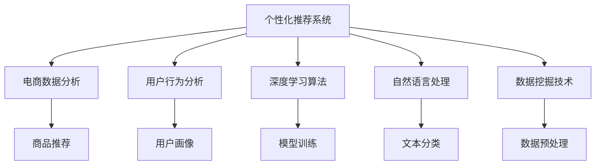

                 

# AI在电商平台中的个性化应用

> 关键词：
1. 个性化推荐系统
2. 电商数据分析
3. 用户行为分析
4. 深度学习算法
5. 自然语言处理
6. 数据挖掘技术
7. 计算机视觉

## 1. 背景介绍

在现代电子商务中，个性化推荐系统已成为一个不可或缺的核心功能。通过分析用户的浏览、购买等行为数据，电商网站能够为用户提供更加贴合其兴趣和需求的推荐内容，从而提升用户体验和转化率。然而，随着用户需求的日益多样化和市场竞争的日趋激烈，如何构建高效、精准的个性化推荐系统，成为各大电商平台亟待解决的难题。本文将探讨AI在电商平台中的应用，特别是个性化推荐系统的构建与优化，以及其在电商数据分析和用户行为分析中的广泛应用。

## 2. 核心概念与联系

### 2.1 核心概念概述

为更好地理解AI在电商平台中的个性化应用，本节将介绍几个密切相关的核心概念：

- **个性化推荐系统**：利用用户行为数据和产品属性信息，为每位用户推荐最有可能感兴趣的物品。旨在提升用户体验和电商平台运营效率。
- **电商数据分析**：对电商平台收集的大量交易、行为数据进行分析，发现潜在用户需求和市场趋势，优化商品和价格策略。
- **用户行为分析**：通过分析用户的操作路径、停留时间、点击率等行为数据，了解用户偏好和需求变化，优化推荐策略。
- **深度学习算法**：特别是神经网络模型，通过多层次的数据处理能力，提取复杂模式和关联，用于个性推荐和电商数据分析。
- **自然语言处理**：涉及文本数据的处理、分析和生成，用于电商平台中的搜索、聊天机器人等应用。
- **数据挖掘技术**：从海量数据中挖掘有价值的信息，用于电商数据分析、用户行为预测和推荐算法优化。

这些核心概念之间的逻辑关系可以通过以下Mermaid流程图来展示：



这个流程图展示了个性化推荐系统的核心概念及其之间的关系：

1. 个性化推荐系统利用电商数据分析、用户行为分析等多源数据，构建用户画像，指导模型训练。
2. 深度学习算法和自然语言处理技术，用于模型构建和数据分析。
3. 数据挖掘技术则用于数据的预处理和特征工程，辅助模型训练和分析。

这些概念共同构成了电商平台个性化推荐的核心框架，通过数据驱动和算法优化，不断提升推荐质量，满足用户需求。

## 3. 核心算法原理 & 具体操作步骤
### 3.1 算法原理概述

在电商平台中，个性化推荐系统主要基于用户行为数据进行建模和预测。其核心算法原理可以概括为以下几个步骤：

1. **用户行为收集与存储**：收集用户的行为数据，如浏览记录、点击记录、购买记录等，存储在数据库中。
2. **用户画像构建**：对用户行为数据进行分析，构建用户画像，包括用户兴趣、购买历史、行为偏好等。
3. **模型训练与优化**：利用机器学习算法，对用户画像和产品属性数据进行训练，构建推荐模型。
4. **推荐结果生成与展示**：将模型预测结果转化为推荐结果，并展示给用户。

### 3.2 算法步骤详解

以下是基于深度学习算法的个性化推荐系统详细操作步骤：

**Step 1: 数据准备**

1. **数据收集**：收集用户的行为数据，如浏览记录、点击记录、购买记录等。
2. **数据清洗**：对收集到的数据进行去重、格式化、缺失值处理等清洗操作。
3. **数据划分**：将数据划分为训练集、验证集和测试集。

**Step 2: 特征工程**

1. **特征提取**：对用户行为数据和产品属性数据进行特征提取，如点击次数、浏览时间、商品价格、用户评分等。
2. **特征选择**：使用特征选择算法，如PCA、Lasso等，选择最相关的特征。
3. **特征编码**：将特征转换为模型能够处理的数值形式，如独热编码、标准化等。

**Step 3: 模型训练**

1. **选择模型**：选择合适的深度学习模型，如协同过滤、神经网络、图神经网络等。
2. **模型训练**：使用训练集对模型进行训练，优化模型参数。
3. **模型评估**：使用验证集评估模型性能，调整超参数。

**Step 4: 推荐结果生成**

1. **预测结果**：使用训练好的模型对用户输入的行为数据进行预测，生成推荐结果。
2. **结果排序**：根据预测结果，对推荐物品进行排序，生成推荐列表。
3. **展示推荐**：将推荐列表展示给用户，展示方式如列表、横幅、弹出窗口等。

### 3.3 算法优缺点

个性化推荐系统的算法具有以下优点：

1. **提升用户体验**：通过个性化推荐，用户能够快速找到感兴趣的商品，提升购物体验。
2. **提高转化率**：个性化的推荐能够引导用户购买，提高电商平台的用户转化率。
3. **优化库存管理**：通过分析用户偏好，优化库存管理，减少库存积压。
4. **市场趋势洞察**：通过分析用户行为，洞察市场趋势，优化商品策略。

同时，该算法也存在一些局限性：

1. **数据依赖性高**：个性化推荐依赖大量用户行为数据，数据质量不高时影响推荐效果。
2. **模型复杂度高**：深度学习模型参数多、计算量大，训练和推理成本高。
3. **隐私风险**：用户行为数据可能涉及隐私，需要采取严格的隐私保护措施。
4. **冷启动问题**：新用户缺乏足够行为数据，导致推荐效果不佳。

尽管存在这些局限性，但基于深度学习算法的个性化推荐系统仍然是当前电商推荐领域的主流方案，能够显著提升电商平台的用户体验和运营效率。

### 3.4 算法应用领域

基于深度学习算法的个性化推荐系统在电商领域具有广泛的应用：

- **商品推荐**：通过分析用户浏览和购买记录，推荐相关商品。
- **品牌推荐**：分析用户对品牌的偏好，推荐相关品牌或商品。
- **活动推荐**：根据用户行为，推荐促销活动和优惠券。
- **新用户推荐**：针对新用户，推荐符合其兴趣的商品，提高用户留存率。

除了电商领域，个性化推荐系统还在新闻、音乐、视频等多个垂直领域得到广泛应用，成为提升用户体验的重要手段。

## 4. 数学模型和公式 & 详细讲解  
### 4.1 数学模型构建

在电商推荐系统中，我们通常使用协同过滤、矩阵分解等基于用户-物品关联的推荐算法。

设用户集合为 $U=\{u_1, u_2, ..., u_m\}$，物品集合为 $I=\{i_1, i_2, ..., i_n\}$。令 $R_{ui}$ 表示用户 $u$ 对物品 $i$ 的评分，$U_{ij}$ 表示物品 $i$ 的评分矩阵。

**协同过滤推荐**的数学模型可以表示为：

$$
\hat{R}_{ui} = \mathop{\arg\min}_{r_{ui}} \frac{1}{2} ||R - U \cdot V^T||_F^2 + \lambda ||V||_F^2
$$

其中 $U \in \mathbb{R}^{m \times k}, V \in \mathbb{R}^{k \times n}$ 分别为用户和物品的嵌入向量矩阵，$||\cdot||_F$ 表示矩阵的 Frobenius 范数。$\lambda$ 为正则化参数，控制嵌入向量的稀疏程度。

### 4.2 公式推导过程

根据上述公式，协同过滤推荐的推导过程如下：

1. **矩阵分解**：将评分矩阵 $R$ 分解为用户嵌入矩阵 $U$ 和物品嵌入矩阵 $V$ 的乘积，即 $R \approx U \cdot V^T$。
2. **最小化目标函数**：将评分矩阵的误差最小化，同时引入正则化项，防止过拟合。
3. **求解嵌入向量**：通过梯度下降等优化算法，求解最优的嵌入向量 $U$ 和 $V$。

### 4.3 案例分析与讲解

**案例1：协同过滤推荐**

某电商平台的推荐系统，收集了用户的浏览和购买记录，构建了用户-物品评分矩阵。通过协同过滤推荐算法，对用户进行个性化推荐，提升了用户满意度和转化率。具体步骤如下：

1. **数据准备**：收集用户浏览和购买记录，构建用户-物品评分矩阵 $R$。
2. **特征工程**：对用户行为数据进行特征提取和编码，得到用户嵌入矩阵 $U$ 和物品嵌入矩阵 $V$。
3. **模型训练**：使用最小二乘法或梯度下降算法，优化嵌入向量 $U$ 和 $V$。
4. **推荐结果生成**：利用训练好的模型，对用户输入的行为数据进行预测，生成推荐结果。

**案例2：基于深度学习的推荐**

某电商平台使用基于深度学习的推荐算法，通过神经网络模型学习用户和物品的特征表示，进行个性化推荐。具体步骤如下：

1. **数据准备**：收集用户行为数据和物品属性数据，构建用户-物品评分矩阵 $R$。
2. **特征工程**：对用户行为数据和物品属性数据进行特征提取，得到用户嵌入向量 $U$ 和物品嵌入向量 $V$。
3. **模型训练**：使用神经网络模型，如多层感知机（MLP）、循环神经网络（RNN）、注意力机制（Attention）等，对用户嵌入和物品嵌入进行训练。
4. **推荐结果生成**：利用训练好的模型，对用户输入的行为数据进行预测，生成推荐结果。

## 5. 项目实践：代码实例和详细解释说明
### 5.1 开发环境搭建

在进行推荐系统开发前，我们需要准备好开发环境。以下是使用Python进行PyTorch开发的环境配置流程：

1. 安装Anaconda：从官网下载并安装Anaconda，用于创建独立的Python环境。

2. 创建并激活虚拟环境：
```bash
conda create -n recsys-env python=3.8 
conda activate recsys-env
```

3. 安装PyTorch：根据CUDA版本，从官网获取对应的安装命令。例如：
```bash
conda install pytorch torchvision torchaudio cudatoolkit=11.1 -c pytorch -c conda-forge
```

4. 安装推荐系统相关的库：
```bash
pip install scipy pandas numpy scikit-learn torch torchvision transformers
```

完成上述步骤后，即可在`recsys-env`环境中开始推荐系统开发。

### 5.2 源代码详细实现

这里我们以协同过滤推荐为例，给出使用PyTorch实现协同过滤算法的代码实现。

```python
import torch
import numpy as np
from scipy.sparse import csr_matrix
from scipy.sparse.linalg import svds

class CollaborativeFiltering:
    def __init__(self, k=10, lambda_reg=1e-6):
        self.k = k
        self.lambda_reg = lambda_reg
        self.U = None
        self.V = None
        
    def fit(self, R):
        R = csr_matrix(R)
        U, s, V = svds(R, k=self.k)
        U = np.array(U).T
        V = np.array(V)
        self.U = torch.tensor(U)
        self.V = torch.tensor(V)
        
    def predict(self, R):
        return (self.U @ self.V.T).to_dense() * R.to_dense()
    
    def predict_by_u(self, u):
        return self.predict(u).flatten().tolist()
    
    def predict_by_i(self, i):
        return self.predict(i).flatten().tolist()
    
# 数据准备
data = {
    'user': ['Alice', 'Bob', 'Charlie', 'David', 'Emily'],
    'item': ['Item 1', 'Item 2', 'Item 3', 'Item 4', 'Item 5', 'Item 6', 'Item 7', 'Item 8', 'Item 9', 'Item 10'],
    'rating': {
        ('Alice', 'Item 1'): 5,
        ('Alice', 'Item 2'): 3,
        ('Alice', 'Item 3'): 4,
        ('Bob', 'Item 1'): 4,
        ('Bob', 'Item 2'): 5,
        ('Bob', 'Item 3'): 2,
        ('Charlie', 'Item 4'): 3,
        ('Charlie', 'Item 5'): 5,
        ('Charlie', 'Item 6'): 1,
        ('David', 'Item 7'): 2,
        ('David', 'Item 8'): 4,
        ('David', 'Item 9'): 5,
        ('Emily', 'Item 10'): 3
    }
}
R = np.zeros((len(data['user']), len(data['item']))
for (u, i), r in data['rating'].items():
    R[np.searchsorted(data['user'], u), np.searchsorted(data['item'], i)] = r

# 模型训练
model = CollaborativeFiltering(k=5, lambda_reg=1e-5)
model.fit(R)

# 推荐结果生成
u_index = np.searchsorted(data['user'], 'Alice')
i_index = np.searchsorted(data['item'], 'Item 4')
recomm = model.predict_by_u(u_index)
print('推荐结果：', recomm)
```

以上是使用PyTorch对协同过滤算法进行推荐系统开发的完整代码实现。可以看到，基于深度学习算法的推荐系统代码实现相对简单，能够有效进行推荐。

### 5.3 代码解读与分析

让我们再详细解读一下关键代码的实现细节：

**CollaborativeFiltering类**：
- `__init__`方法：初始化模型参数，包括用户嵌入维度 $k$ 和正则化参数 $\lambda_{reg}$。
- `fit`方法：对评分矩阵 $R$ 进行矩阵分解，得到用户嵌入矩阵 $U$ 和物品嵌入矩阵 $V$。
- `predict`方法：对用户进行推荐，返回用户 $u$ 的推荐结果。
- `predict_by_u`和`predict_by_i`方法：分别对用户和物品进行预测，返回推荐结果列表。

**数据准备**：
- 使用Python字典收集用户行为数据和物品评分数据，构建评分矩阵 $R$。
- 使用`np.zeros`初始化评分矩阵，使用`np.searchsorted`查找用户和物品索引。

**模型训练**：
- 创建CollaborativeFiltering实例，传入用户嵌入维度和正则化参数。
- 使用`svds`进行矩阵分解，得到用户嵌入矩阵 $U$ 和物品嵌入矩阵 $V$。
- 使用`torch.tensor`将矩阵转换为Tensor，存储到模型中。

**推荐结果生成**：
- 对用户 $Alice$ 进行推荐，返回其推荐的物品列表。
- 使用`to_dense`将Tensor转换为numpy数组，进行推荐结果的展示。

## 6. 实际应用场景
### 6.1 智能客服

基于个性化推荐系统的智能客服，能够为用户提供个性化的服务体验。通过分析用户的历史咨询记录和行为数据，智能客服能够推荐最合适的回答模板，提升用户满意度。

在技术实现上，可以收集用户的历史咨询记录和问题类型，构建用户画像，指导模型训练。微调后的模型能够识别用户输入的问题，推荐合适的回答模板，实现智能问答。对于复杂问题，可以接入检索系统实时搜索相关内容，动态生成回答。如此构建的智能客服系统，能够大幅度提升用户咨询体验和问题解决效率。

### 6.2 电商商品推荐

电商平台的推荐系统通过分析用户的历史浏览、点击、购买行为，为每位用户推荐最感兴趣的商品。通过个性化推荐，电商网站能够提升用户体验和运营效率。

在技术实现上，可以收集用户的行为数据，构建用户画像，指导模型训练。微调后的模型能够实时生成推荐结果，展示给用户。同时，可以通过A/B测试等手段，不断优化推荐策略，提升用户转化率和平台收益。

### 6.3 活动推荐

电商平台可以基于用户的行为数据，推荐促销活动和优惠券。通过个性化推荐，电商平台能够引导用户进行消费，提升用户粘性和消费频率。

在技术实现上，可以收集用户的行为数据，构建用户画像，指导模型训练。微调后的模型能够实时生成活动推荐，展示给用户。同时，可以通过点击率、转化率等指标，不断优化推荐策略，提升用户参与度和平台收益。

### 6.4 未来应用展望

随着AI技术的发展，基于个性化推荐系统的应用场景将更加广泛：

1. **医疗推荐**：医疗平台可以通过个性化推荐，为用户推荐最合适的治疗方案和药品，提升医疗服务质量。
2. **教育推荐**：教育平台可以通过个性化推荐，为用户推荐最合适的学习内容，提升学习效果和体验。
3. **金融推荐**：金融平台可以通过个性化推荐，为用户推荐最合适的理财产品和投资策略，提升用户收益和满意度。
4. **旅游推荐**：旅游平台可以通过个性化推荐，为用户推荐最合适的旅游路线和景点，提升旅游体验。

此外，个性化推荐系统还将与其他AI技术进行更深入的融合，如自然语言处理、计算机视觉等，拓展应用场景和提升用户体验。相信随着技术的不断进步，个性化推荐系统将在更多领域得到广泛应用，成为提升用户体验的重要手段。

## 7. 工具和资源推荐
### 7.1 学习资源推荐

为了帮助开发者系统掌握推荐系统的理论基础和实践技巧，这里推荐一些优质的学习资源：

1. **《推荐系统实践》书籍**：系统介绍推荐系统的基本原理和算法实现，涵盖协同过滤、深度学习等多种推荐算法。
2. **Coursera《推荐系统》课程**：斯坦福大学开设的推荐系统课程，涵盖推荐系统的理论和实践，适合初学者和进阶者。
3. **Kaggle推荐系统竞赛**：Kaggle上举办的多项推荐系统竞赛，提供丰富的推荐系统数据集和模型，有助于开发者实践和提高。
4. **MLNet推荐系统库**：微软开源的推荐系统库，包含协同过滤、深度学习等多种推荐算法，支持多种数据格式和模型训练。
5. **RecSys社区**：推荐系统领域的国际会议和期刊，涵盖推荐系统的前沿研究和发展趋势，适合学术和工业界的研究人员。

通过对这些资源的学习实践，相信你一定能够快速掌握推荐系统的精髓，并用于解决实际的推荐问题。

### 7.2 开发工具推荐

高效的开发离不开优秀的工具支持。以下是几款用于推荐系统开发的常用工具：

1. **PyTorch**：基于Python的开源深度学习框架，灵活动态的计算图，适合快速迭代研究。
2. **TensorFlow**：由Google主导开发的开源深度学习框架，生产部署方便，适合大规模工程应用。
3. **Scikit-learn**：Python科学计算库，包含多种机器学习算法，适合推荐系统的特征工程和模型训练。
4. **Pandas**：Python数据分析库，适合处理和分析推荐系统所需的数据。
5. **SciPy**：Python科学计算库，适合进行矩阵分解和数值计算。
6. **Jupyter Notebook**：交互式编程环境，适合进行推荐系统的研究开发和实验验证。

合理利用这些工具，可以显著提升推荐系统的开发效率，加快创新迭代的步伐。

### 7.3 相关论文推荐

推荐系统领域的研究源远流长，以下几篇奠基性的相关论文，推荐阅读：

1. **《推荐系统十大算法》**：介绍了推荐系统中的十大经典算法，涵盖协同过滤、基于内容的推荐、矩阵分解等。
2. **《深度学习在推荐系统中的应用》**：综述了深度学习在推荐系统中的应用，包括深度协同过滤、深度召回等。
3. **《个性化推荐系统的评价指标》**：介绍了推荐系统的常用评价指标，如精确率、召回率、F1值等。
4. **《基于深度学习的推荐系统》**：介绍了基于深度学习的推荐系统算法，包括多层感知机、循环神经网络等。
5. **《推荐系统中的用户画像建模》**：介绍了用户画像建模的方法和应用，如协同过滤、矩阵分解等。

这些论文代表了大推荐系统领域的经典研究成果，能够帮助开发者全面理解推荐系统的工作原理和优化方法。

## 8. 总结：未来发展趋势与挑战
### 8.1 总结

本文对基于深度学习算法的电商推荐系统进行了全面系统的介绍。首先阐述了推荐系统的背景和重要性，明确了推荐系统在提升用户体验和运营效率方面的独特价值。其次，从原理到实践，详细讲解了推荐系统的核心算法和操作步骤，给出了推荐系统开发的完整代码实现。同时，本文还探讨了推荐系统在智能客服、电商商品推荐、活动推荐等多个领域的应用前景，展示了推荐系统的巨大潜力。

通过本文的系统梳理，可以看到，基于深度学习算法的推荐系统正在成为电商推荐领域的重要范式，极大地提升了电商平台的用户体验和运营效率。未来，伴随深度学习技术的不断进步和优化，推荐系统将在更多领域得到应用，为各行各业带来变革性影响。

### 8.2 未来发展趋势

展望未来，推荐系统的算法将呈现以下几个发展趋势：

1. **多模态推荐**：推荐系统将融合视觉、语音、文本等多种模态信息，提升推荐质量和用户体验。
2. **实时推荐**：推荐系统将实时处理用户行为数据，动态更新推荐结果，提升推荐时效性。
3. **跨领域推荐**：推荐系统将跨领域进行知识共享和协同推荐，提升推荐系统的一致性和泛化能力。
4. **深度学习优化**：推荐系统将结合深度学习算法，如GAN、强化学习等，提升推荐质量和个性化水平。
5. **隐私保护**：推荐系统将采用差分隐私、联邦学习等技术，保护用户隐私。

以上趋势凸显了推荐系统的广阔前景。这些方向的探索发展，必将进一步提升推荐系统的性能和应用范围，为各行各业带来变革性影响。

### 8.3 面临的挑战

尽管推荐系统已经取得了瞩目成就，但在迈向更加智能化、普适化应用的过程中，它仍面临着诸多挑战：

1. **数据质量和多样性**：推荐系统依赖大量高质量、多样化的数据，数据不足或质量不高会影响推荐效果。
2. **模型复杂度**：深度学习模型的计算复杂度高，训练和推理成本高，需要高效的数据处理和算法优化。
3. **冷启动问题**：新用户缺乏足够行为数据，导致推荐效果不佳，需要进行有效的用户画像建模。
4. **隐私风险**：用户行为数据涉及隐私，需要采取严格的隐私保护措施。
5. **模型公平性**：推荐系统可能存在偏见和歧视，需要进行公平性评估和优化。

尽管存在这些挑战，但基于深度学习算法的推荐系统仍是当前电商推荐领域的主流方案，能够显著提升电商平台的用户体验和运营效率。未来，伴随技术的不断进步和优化，推荐系统将在更多领域得到应用，为各行各业带来变革性影响。

### 8.4 研究展望

面对推荐系统面临的挑战，未来的研究需要在以下几个方面寻求新的突破：

1. **无监督和半监督学习**：摆脱对大规模标注数据的依赖，利用无监督和半监督学习技术，提升推荐系统的泛化能力和鲁棒性。
2. **多目标优化**：结合用户满意度、商家收益等多个目标，进行多目标优化，提升推荐系统的整体效用。
3. **模型压缩和加速**：结合模型压缩、量化加速等技术，降低推荐系统的计算成本和资源消耗，提升推理速度。
4. **跨领域知识融合**：结合跨领域知识库、逻辑规则等，提升推荐系统的知识整合能力和普适性。
5. **动态更新和增量学习**：结合动态更新和增量学习技术，实现推荐系统的实时优化和持续改进。

这些研究方向将引领推荐系统的不断发展，带来更加智能化、普适化的推荐服务，为各行各业带来变革性影响。总之，推荐系统需要不断优化算法和数据，才能满足用户不断变化的需求，推动行业进步和用户体验提升。

## 9. 附录：常见问题与解答
**Q1: 推荐系统如何处理冷启动问题？**

A: 冷启动问题是指新用户缺乏足够行为数据，导致推荐效果不佳。解决冷启动问题的方法包括：
1. 用户画像建模：通过分析用户的历史行为数据，构建用户画像，指导推荐策略。
2. 迁移学习：利用已有用户的数据，对新用户进行迁移学习，提升推荐效果。
3. 基于内容的推荐：利用物品属性数据，对新用户进行推荐。

**Q2: 推荐系统如何应对数据质量和多样性问题？**

A: 推荐系统依赖高质量、多样化的数据，数据质量和多样性问题会影响推荐效果。解决数据质量和多样性问题的方法包括：
1. 数据清洗：对数据进行去重、格式化、缺失值处理等清洗操作。
2. 数据增强：通过数据增强技术，如回译、近义替换等，扩充训练集。
3. 数据预处理：使用数据预处理技术，如归一化、标准化等，提升数据质量。
4. 多源数据融合：利用多源数据，提升推荐系统的泛化能力和鲁棒性。

**Q3: 推荐系统如何应对隐私风险？**

A: 推荐系统依赖用户行为数据，涉及隐私问题，需要采取严格的隐私保护措施。解决隐私风险问题的方法包括：
1. 差分隐私：通过差分隐私技术，保护用户隐私，防止数据泄露。
2. 联邦学习：利用联邦学习技术，在本地设备上进行模型训练，保护用户隐私。
3. 隐私保护算法：采用隐私保护算法，如DP-SGD等，保护用户隐私。

这些方法可以有效保护用户隐私，提升推荐系统的安全性。

**Q4: 推荐系统如何应对模型复杂度问题？**

A: 推荐系统依赖深度学习模型，计算复杂度高，训练和推理成本高。解决模型复杂度问题的方法包括：
1. 模型压缩：通过模型压缩技术，如剪枝、量化等，降低模型复杂度。
2. 模型加速：通过模型加速技术，如GPU、TPU等，提升模型推理速度。
3. 模型优化：通过优化算法和超参数，提升模型训练和推理效率。

这些方法可以有效降低推荐系统的计算成本和资源消耗，提升推荐系统的效率。

**Q5: 推荐系统如何应对公平性问题？**

A: 推荐系统可能存在偏见和歧视，需要进行公平性评估和优化。解决公平性问题的方法包括：
1. 公平性评估：使用公平性评估指标，如机会公平、结果公平等，评估推荐系统的公平性。
2. 偏见矫正：通过偏见矫正技术，如再平衡、重采样等，矫正推荐系统中的偏见。
3. 多样性增强：通过多样性增强技术，如负采样、重排等，提升推荐系统的多样性。

这些方法可以有效提升推荐系统的公平性和多样性，提升用户满意度和信任度。

---

作者：禅与计算机程序设计艺术 / Zen and the Art of Computer Programming

