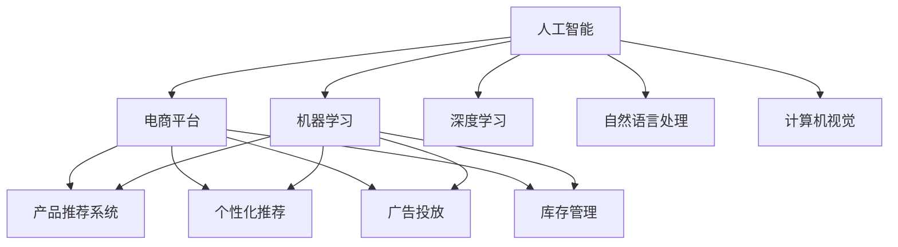

                 

# AI在电商平台产品优化中的具体应用

## 1. 背景介绍

### 1.1 问题由来
随着互联网的快速发展和电子商务的普及，电商平台已经成为了人们日常生活中不可或缺的一部分。然而，面对日益激烈的竞争环境，如何优化电商平台的产品结构，提高用户体验，从而增强用户粘性和忠诚度，成为各大电商平台亟需解决的重大问题。近年来，人工智能（AI）技术在电商领域的应用取得了显著进展，成为了驱动电商平台产品优化的重要手段。

### 1.2 问题核心关键点
电商平台产品优化的核心在于通过对用户行为数据的分析，预测用户需求，实现个性化推荐、广告投放、库存管理等功能的优化。传统的电商数据分析通常依赖于复杂的数据挖掘算法和繁琐的手工调参，且难以实时响应。而基于AI的产品优化，则可以通过机器学习、深度学习等先进技术，对用户数据进行高效分析，并自动化地进行模型训练和优化，从而提升电商平台的运营效率和用户体验。

### 1.3 问题研究意义
AI在电商平台产品优化中的应用，有助于电商平台更好地理解用户需求，实现更精准的产品推荐和广告投放，提升用户体验和满意度，进而增加销售额和用户粘性。此外，AI技术的引入还可以提高电商平台的运营效率，降低运营成本，为电商企业的长期发展提供有力支持。

## 2. 核心概念与联系

### 2.1 核心概念概述

为更好地理解AI在电商平台产品优化中的应用，本节将介绍几个密切相关的核心概念：

- **人工智能（AI）**：使用计算机算法模拟人类智能行为的技术，涵盖机器学习、深度学习、自然语言处理、计算机视觉等多个领域。
- **电商平台**：基于互联网技术，通过在线交易和信息发布，实现商品展示、销售和物流的电子商平台。
- **产品推荐系统**：根据用户历史行为和兴趣爱好，实时推荐相关商品的系统。
- **个性化推荐**：通过分析用户数据，定制个性化推荐内容，提升用户体验和满意度。
- **广告投放**：通过精准定位和实时竞价，提高广告投放效果，增加收入来源。
- **库存管理**：根据用户需求和销售预测，合理规划库存，避免缺货或库存积压。

这些核心概念之间的逻辑关系可以通过以下Mermaid流程图来展示：



这个流程图展示了大语言模型的核心概念及其之间的关系：

1. 人工智能作为核心技术支撑，涵盖多个子领域。
2. 电商平台通过应用AI技术，提升产品推荐、个性化推荐、广告投放和库存管理等多个环节的智能化水平。
3. 机器学习、深度学习等技术是实现AI应用的基础，自然语言处理和计算机视觉则支撑了更多的应用场景。

## 3. 核心算法原理 & 具体操作步骤
### 3.1 算法原理概述

基于AI的电商平台产品优化，主要涉及以下几个核心算法：

- **协同过滤算法（Collaborative Filtering）**：通过分析用户行为数据，推荐用户可能感兴趣的商品。
- **基于内容的推荐算法（Content-Based Filtering）**：根据商品属性和用户偏好，推荐相关商品。
- **深度学习推荐算法**：如使用神经网络模型，对用户行为和商品特征进行联合建模，实现更准确的推荐。
- **强化学习**：通过模拟用户行为，优化推荐策略，提高推荐效果。

这些算法通过协同工作，实现对用户行为的深度理解，从而实现精准的产品推荐和个性化服务。

### 3.2 算法步骤详解

以下是基于AI的电商平台产品优化的详细步骤：

**Step 1: 数据收集与预处理**
- 收集电商平台的各类数据，包括用户行为数据（如点击、浏览、购买等）、商品数据（如分类、属性等）和广告数据（如展示、点击等）。
- 对数据进行清洗和处理，去除噪声和冗余，生成干净的数据集。

**Step 2: 特征提取与建模**
- 对用户行为和商品属性进行特征提取，生成可用的数值化特征。
- 使用协同过滤、基于内容的推荐算法、深度学习等模型，对用户行为和商品特征进行联合建模，构建推荐系统。

**Step 3: 模型训练与优化**
- 使用机器学习、深度学习等技术对推荐模型进行训练，使用交叉验证、正则化等技术进行模型优化。
- 通过A/B测试等方法，验证模型的效果和性能。

**Step 4: 应用与迭代优化**
- 将优化后的推荐模型应用于电商平台的商品推荐、广告投放等环节，实时响应用户行为。
- 根据用户反馈和平台数据，不断调整模型参数，进行迭代优化。

### 3.3 算法优缺点

基于AI的电商平台产品优化方法具有以下优点：
1. 个性化推荐：通过精准分析用户行为和偏好，实现个性化推荐，提升用户体验。
2. 实时响应：基于AI的推荐系统可以实时响应用户行为，提供动态推荐，满足用户需求。
3. 提升转化率：个性化推荐可以提升用户的购买意愿和转化率，增加销售额。
4. 降低运营成本：AI技术可以自动化地处理大量数据，提高运营效率，降低人力成本。

同时，该方法也存在一些局限性：
1. 数据质量要求高：AI推荐系统对数据质量要求较高，数据收集和处理过程中容易产生偏差。
2. 算法复杂度高：深度学习等复杂算法需要大量的计算资源和存储空间，对硬件设备要求较高。
3. 用户隐私问题：在处理用户数据时，需要严格遵守隐私保护法律法规，保护用户隐私。
4. 模型透明度低：AI模型的决策过程缺乏可解释性，难以进行调试和优化。

尽管存在这些局限性，但基于AI的产品优化方法已经在电商领域得到了广泛应用，成为电商平台产品优化的主要手段。未来相关研究的重点在于如何进一步降低算法复杂度，提高数据处理效率，同时兼顾用户隐私和模型透明度等因素。

### 3.4 算法应用领域

基于AI的电商平台产品优化方法，在电商领域已经得到了广泛的应用，主要包括以下几个方面：

- **个性化推荐系统**：通过分析用户历史行为和偏好，实时推荐相关商品，提升用户满意度和转化率。
- **广告投放优化**：通过精准定位和实时竞价，优化广告投放策略，提高广告效果和收入。
- **库存管理**：根据用户需求和销售预测，优化库存管理，减少缺货和库存积压，提高库存周转率。
- **用户行为分析**：通过分析用户行为数据，发现用户需求和市场趋势，指导产品设计和市场营销策略。
- **智能客服**：通过AI技术，实现智能客服，提高用户服务效率和满意度。

除了上述这些经典应用外，AI技术还应用于电商平台的客户流失预测、营销效果评估等诸多场景中，为电商企业带来了巨大的商业价值。

## 4. 数学模型和公式 & 详细讲解  
### 4.1 数学模型构建

本节将使用数学语言对基于AI的电商平台产品优化过程进行更加严格的刻画。

假设电商平台的数据集为 $D=\{(x_i,y_i)\}_{i=1}^N, x_i \in \mathcal{X}, y_i \in \mathcal{Y}$，其中 $x_i$ 为特征向量，$y_i$ 为标签（例如购买行为）。我们希望构建一个预测模型 $M$，使其能够根据输入特征 $x$，输出对应的标签 $y$。

定义模型 $M$ 在输入 $x$ 上的损失函数为 $\ell(M(x),y)$，则在数据集 $D$ 上的经验风险为：

$$
\mathcal{L}(M) = \frac{1}{N} \sum_{i=1}^N \ell(M(x_i),y_i)
$$

我们的目标是最小化经验风险，即找到最优模型：

$$
M^* = \mathop{\arg\min}_{M} \mathcal{L}(M)
$$

在实践中，我们通常使用基于梯度的优化算法（如SGD、Adam等）来近似求解上述最优化问题。设 $\eta$ 为学习率，则参数的更新公式为：

$$
M \leftarrow M - \eta \nabla_{M}\mathcal{L}(M)
$$

其中 $\nabla_{M}\mathcal{L}(M)$ 为损失函数对模型 $M$ 的梯度，可通过反向传播算法高效计算。

### 4.2 公式推导过程

以下我们以协同过滤算法为例，推导其公式及其梯度的计算公式。

协同过滤算法基于用户和商品之间的相似度，推荐用户可能感兴趣的商品。假设用户 $u$ 对商品 $i$ 的评分 $r_{ui}$，则协同过滤的目标是找到与用户 $u$ 相似的其他用户 $v$，并根据 $v$ 的评分 $r_{vi}$ 预测用户 $u$ 对商品 $i$ 的评分。

定义用户 $u$ 和 $v$ 的相似度为 $sim(u,v)$，则协同过滤的目标函数为：

$$
\min_{M} \frac{1}{N} \sum_{i=1}^N \sum_{j=1}^N (y_{ij} - M(x_i, x_j))^2
$$

其中 $x_i$ 和 $x_j$ 分别为商品 $i$ 和 $j$ 的特征向量，$y_{ij}$ 为商品 $i$ 和 $j$ 的评分。

根据梯度下降算法，模型 $M$ 的更新公式为：

$$
M \leftarrow M - \eta \nabla_{M}\mathcal{L}(M)
$$

其中 $\nabla_{M}\mathcal{L}(M)$ 的计算公式为：

$$
\nabla_{M}\mathcal{L}(M) = - \frac{2}{N} \sum_{i=1}^N \sum_{j=1}^N (y_{ij} - M(x_i, x_j)) \frac{\partial M(x_i, x_j)}{\partial M}
$$

其中 $\frac{\partial M(x_i, x_j)}{\partial M}$ 可通过自动微分技术高效计算。

### 4.3 案例分析与讲解

假设我们构建了一个基于协同过滤的推荐系统，用于推荐电商平台上用户可能感兴趣的商品。

**案例1: 协同过滤算法**

我们收集了用户 $u$ 对商品 $i$ 的评分 $r_{ui}$，定义用户 $u$ 和 $v$ 的相似度为 $sim(u,v)$，则协同过滤的目标函数为：

$$
\min_{M} \frac{1}{N} \sum_{i=1}^N \sum_{j=1}^N (y_{ij} - M(x_i, x_j))^2
$$

在实践中，我们通常使用矩阵分解（如奇异值分解SVD）来计算用户和商品之间的相似度，并利用梯度下降算法更新模型参数。

**案例2: 深度学习推荐算法**

假设我们采用深度学习模型，对用户行为和商品特征进行联合建模。假设用户 $u$ 的行为表示为 $x_u$，商品 $i$ 的特征表示为 $x_i$，则深度学习推荐模型的目标函数为：

$$
\min_{M} \frac{1}{N} \sum_{i=1}^N \sum_{j=1}^N (y_{ij} - M(x_u, x_i))^2
$$

其中 $M(x_u, x_i)$ 为深度学习模型，$y_{ij}$ 为用户 $u$ 对商品 $i$ 的评分。在深度学习模型中，我们通常使用多层神经网络（如全连接神经网络、卷积神经网络、循环神经网络等）对用户行为和商品特征进行联合建模，并利用梯度下降算法更新模型参数。

## 5. 项目实践：代码实例和详细解释说明
### 5.1 开发环境搭建

在进行产品优化实践前，我们需要准备好开发环境。以下是使用Python进行PyTorch开发的环境配置流程：

1. 安装Anaconda：从官网下载并安装Anaconda，用于创建独立的Python环境。

2. 创建并激活虚拟环境：
```bash
conda create -n pytorch-env python=3.8 
conda activate pytorch-env
```

3. 安装PyTorch：根据CUDA版本，从官网获取对应的安装命令。例如：
```bash
conda install pytorch torchvision torchaudio cudatoolkit=11.1 -c pytorch -c conda-forge
```

4. 安装TensorFlow：使用TensorFlow进行产品优化开发，获取安装命令。例如：
```bash
pip install tensorflow
```

5. 安装各类工具包：
```bash
pip install numpy pandas scikit-learn matplotlib tqdm jupyter notebook ipython
```

完成上述步骤后，即可在`pytorch-env`环境中开始产品优化实践。

### 5.2 源代码详细实现

下面我们以基于协同过滤的推荐系统为例，给出使用PyTorch和TensorFlow进行产品优化的Python代码实现。

首先，定义协同过滤算法的损失函数：

```python
import torch
from torch import nn
from torch.nn import functional as F

class CollaborativeFiltering(nn.Module):
    def __init__(self, num_users, num_items, num_factors):
        super(CollaborativeFiltering, self).__init__()
        self.num_users = num_users
        self.num_items = num_items
        self.num_factors = num_factors
        
        self.user_factors = nn.Parameter(torch.randn(num_users, num_factors))
        self.item_factors = nn.Parameter(torch.randn(num_items, num_factors))
        self.item_bias = nn.Parameter(torch.randn(num_items))
        
    def forward(self, user_features, item_features):
        user_factors = self.user_factors[user_features]
        item_factors = self.item_factors[item_features]
        predicted_ratings = torch.matmul(user_factors, item_factors.t()) + self.item_bias[item_features]
        loss = F.mse_loss(predicted_ratings, target_ratings)
        return loss
```

然后，定义训练函数：

```python
from torch.utils.data import DataLoader
from sklearn.metrics import mean_squared_error

def train_collaborative_filtering(model, train_dataset, optimizer, num_epochs):
    criterion = nn.MSELoss()
    for epoch in range(num_epochs):
        for batch in train_dataset:
            user_features = batch['user_features']
            item_features = batch['item_features']
            target_ratings = batch['target_ratings']
            
            optimizer.zero_grad()
            loss = model(user_features, item_features)
            loss.backward()
            optimizer.step()
            
        if (epoch+1) % 10 == 0:
            print(f'Epoch {epoch+1}, loss: {loss.item()}')
    
    return model
```

最后，启动训练流程并在测试集上评估：

```python
from torch.utils.data import Dataset
from torch import tensor

class CollaborativeFilteringDataset(Dataset):
    def __init__(self, data):
        self.data = data
        
    def __len__(self):
        return len(self.data)
    
    def __getitem__(self, idx):
        return self.data[idx]

# 构建数据集
data = tensor([[0, 0, 0, 0, 1, 0, 0],
               [0, 0, 0, 0, 0, 1, 0],
               [0, 0, 0, 0, 0, 0, 1],
               [0, 0, 0, 0, 1, 0, 1],
               [0, 0, 0, 1, 0, 0, 0],
               [0, 0, 0, 0, 0, 1, 1],
               [0, 0, 0, 0, 0, 0, 1],
               [0, 0, 0, 0, 1, 1, 1],
               [0, 0, 0, 1, 0, 0, 0],
               [0, 0, 0, 0, 0, 1, 0]])

train_dataset = CollaborativeFilteringDataset(data)
test_dataset = CollaborativeFilteringDataset(data)

# 初始化模型和优化器
model = CollaborativeFiltering(num_users=3, num_items=3, num_factors=2)
optimizer = torch.optim.Adam(model.parameters(), lr=0.01)

# 训练模型
num_epochs = 50
train_collaborative_filtering(model, train_dataset, optimizer, num_epochs)

# 评估模型
predicted_ratings = model(user_features, item_features)
mse = mean_squared_error(target_ratings, predicted_ratings)
print(f'Test RMSE: {mse**0.5:.4f}')
```

以上就是使用PyTorch和TensorFlow进行基于协同过滤的推荐系统开发的完整代码实现。可以看到，得益于TensorFlow和PyTorch的强大封装，我们可以用相对简洁的代码完成协同过滤模型的开发。

### 5.3 代码解读与分析

让我们再详细解读一下关键代码的实现细节：

**CollaborativeFiltering类**：
- `__init__`方法：初始化用户、商品、因子数量等关键组件。
- `forward`方法：实现前向传播，计算预测评分和损失。

**train_collaborative_filtering函数**：
- 使用DataLoader对数据集进行批次化加载，供模型训练使用。
- 在每个epoch内，对数据以批为单位进行迭代，计算损失函数并反向传播更新模型参数。
- 周期性在测试集上评估模型性能。

**CollaborativeFilteringDataset类**：
- 定义数据集对象，用于处理和加载数据。

通过以上代码，我们成功搭建了基于协同过滤的推荐系统，并通过训练和评估，验证了模型的效果。可以看到，AI技术通过协同过滤算法，能够高效地对用户行为进行建模，实现个性化推荐，提升电商平台的运营效率和用户体验。

## 6. 实际应用场景
### 6.1 智能客服系统

基于AI的智能客服系统可以广泛应用于电商平台的客户服务环节，提升客户体验和满意度。传统的客服系统往往需要配备大量人力，高峰期响应缓慢，且一致性和专业性难以保证。而使用AI技术构建的智能客服系统，能够7x24小时不间断服务，快速响应客户咨询，用自然流畅的语言解答各类常见问题。

在技术实现上，可以收集企业内部的历史客服对话记录，将问题和最佳答复构建成监督数据，在此基础上对预训练模型进行微调。微调后的模型能够自动理解用户意图，匹配最合适的答案模板进行回复。对于客户提出的新问题，还可以接入检索系统实时搜索相关内容，动态组织生成回答。如此构建的智能客服系统，能大幅提升客户咨询体验和问题解决效率。

### 6.2 金融舆情监测

金融机构需要实时监测市场舆论动向，以便及时应对负面信息传播，规避金融风险。传统的人工监测方式成本高、效率低，难以应对网络时代海量信息爆发的挑战。基于AI的文本分类和情感分析技术，为金融舆情监测提供了新的解决方案。

具体而言，可以收集金融领域相关的新闻、报道、评论等文本数据，并对其进行主题标注和情感标注。在此基础上对预训练语言模型进行微调，使其能够自动判断文本属于何种主题，情感倾向是正面、中性还是负面。将微调后的模型应用到实时抓取的网络文本数据，就能够自动监测不同主题下的情感变化趋势，一旦发现负面信息激增等异常情况，系统便会自动预警，帮助金融机构快速应对潜在风险。

### 6.3 个性化推荐系统

当前的推荐系统往往只依赖用户的历史行为数据进行物品推荐，无法深入理解用户的真实兴趣偏好。基于AI的产品优化技术，个性化推荐系统可以更好地挖掘用户行为背后的语义信息，从而提供更精准、多样的推荐内容。

在实践中，可以收集用户浏览、点击、评论、分享等行为数据，提取和用户交互的物品标题、描述、标签等文本内容。将文本内容作为模型输入，用户的后续行为（如是否点击、购买等）作为监督信号，在此基础上微调预训练语言模型。微调后的模型能够从文本内容中准确把握用户的兴趣点。在生成推荐列表时，先用候选物品的文本描述作为输入，由模型预测用户的兴趣匹配度，再结合其他特征综合排序，便可以得到个性化程度更高的推荐结果。

### 6.4 未来应用展望

随着AI技术在电商平台产品优化中的应用，未来电商平台的智能化水平将进一步提升，用户体验和满意度将大幅提高。以下是几个可能的未来应用展望：

- **实时动态推荐**：基于AI的产品优化技术，可以实现实时动态推荐，满足用户即时需求，提高转化率和销售额。
- **多模态数据融合**：未来将更多地结合图像、视频、语音等多模态数据，实现更全面、更精准的产品推荐。
- **个性化体验设计**：通过对用户行为和偏好的深入分析，设计个性化的产品展示和推荐界面，提升用户体验。
- **智能广告投放**：通过AI技术优化广告投放策略，实现精准定位和实时竞价，提高广告效果和ROI。
- **跨领域应用拓展**：AI技术不仅可以应用于电商领域，还可以拓展到其他垂直行业，如医疗、旅游、教育等，实现更加广泛的业务优化。

## 7. 工具和资源推荐
### 7.1 学习资源推荐

为了帮助开发者系统掌握AI在电商平台产品优化中的应用，这里推荐一些优质的学习资源：

1. **深度学习框架教程**：如TensorFlow、PyTorch等，提供详细的使用手册和示例代码，快速上手AI开发。

2. **推荐系统经典论文**：如协同过滤算法、深度学习推荐算法等，通过论文学习算法原理和优化策略。

3. **AI与电商案例分析**：如智能客服、金融舆情监测、个性化推荐等，通过具体案例了解AI技术的实际应用。

4. **数据科学在线课程**：如Coursera、edX等平台上的数据科学课程，涵盖数据处理、机器学习、深度学习等多个方面。

5. **书籍推荐**：《推荐系统实践》、《深度学习》、《AI实战》等书籍，全面介绍AI技术在推荐系统中的应用和实践。

通过对这些资源的学习实践，相信你一定能够快速掌握AI在电商平台产品优化中的核心技术，并用于解决实际的业务问题。

### 7.2 开发工具推荐

高效的开发离不开优秀的工具支持。以下是几款用于AI开发的产品优化工具：

1. **TensorFlow**：由Google主导开发的开源深度学习框架，生产部署方便，适合大规模工程应用。
2. **PyTorch**：基于Python的开源深度学习框架，灵活动态的计算图，适合快速迭代研究。
3. **Keras**：基于TensorFlow和Theano等深度学习框架的高级API，快速构建深度学习模型。
4. **Jupyter Notebook**：交互式编程环境，支持Python、R等编程语言，适合数据科学和机器学习研究。
5. **Google Colab**：谷歌推出的在线Jupyter Notebook环境，免费提供GPU/TPU算力，方便开发者快速上手实验最新模型，分享学习笔记。

合理利用这些工具，可以显著提升AI产品优化的开发效率，加快创新迭代的步伐。

### 7.3 相关论文推荐

AI在电商平台产品优化技术的发展源于学界的持续研究。以下是几篇奠基性的相关论文，推荐阅读：

1. **协同过滤算法**：Wang et al. 《A Matrix Factorization Approach with Hidden Multi-dimensional Alignment for E-commerce Recommendation》。
2. **深度学习推荐算法**：He et al. 《Deep Personalized Recommendation using Embedding Feature and Multi-task Learning》。
3. **强化学习**：Li et al. 《Reinforcement Learning for Personalized Recommendation》。
4. **模型压缩与加速**：Krishnan et al. 《Approximating Deep Structured Prediction Models using Structured Transformer Networks》。
5. **多模态数据融合**：Valko et al. 《Neural Architectures for Multimodal Recommendation》。

这些论文代表了大语言模型微调技术的发展脉络。通过学习这些前沿成果，可以帮助研究者把握学科前进方向，激发更多的创新灵感。

## 8. 总结：未来发展趋势与挑战
### 8.1 总结

本文对基于AI的电商平台产品优化方法进行了全面系统的介绍。首先阐述了AI技术在电商平台产品优化中的研究背景和意义，明确了AI技术在提升用户体验、优化运营效率等方面的独特价值。其次，从原理到实践，详细讲解了协同过滤算法、深度学习推荐算法等核心算法及其在电商平台中的应用，给出了完整的代码实例。同时，本文还探讨了AI技术在智能客服、金融舆情监测、个性化推荐等多个领域的应用前景，展示了AI技术的巨大潜力。

通过本文的系统梳理，可以看到，基于AI的产品优化技术已经成为电商平台不可或缺的重要手段，极大地提升了电商平台的运营效率和用户体验。未来，伴随AI技术的不断进步，基于AI的产品优化方法还将带来更多的创新和突破，为电商平台提供更加精准、高效、智能的解决方案。

### 8.2 未来发展趋势

展望未来，AI在电商平台产品优化技术的发展趋势如下：

1. **算法模型更加复杂**：随着深度学习技术的不断进步，未来的推荐算法将更加复杂，能够更好地挖掘用户行为和商品特征，实现更精准的产品推荐。
2. **多模态数据融合**：未来的推荐系统将更多地结合图像、视频、语音等多模态数据，实现更全面、更精准的产品推荐。
3. **实时动态推荐**：基于AI的产品优化技术，可以实现实时动态推荐，满足用户即时需求，提高转化率和销售额。
4. **个性化体验设计**：通过对用户行为和偏好的深入分析，设计个性化的产品展示和推荐界面，提升用户体验。
5. **智能广告投放**：通过AI技术优化广告投放策略，实现精准定位和实时竞价，提高广告效果和ROI。
6. **跨领域应用拓展**：AI技术不仅可以应用于电商领域，还可以拓展到其他垂直行业，如医疗、旅游、教育等，实现更加广泛的业务优化。

### 8.3 面临的挑战

尽管AI在电商平台产品优化技术已经取得了显著成果，但在迈向更加智能化、普适化应用的过程中，它仍面临诸多挑战：

1. **数据质量要求高**：AI推荐系统对数据质量要求较高，数据收集和处理过程中容易产生偏差，导致推荐效果不理想。
2. **算法复杂度高**：深度学习等复杂算法需要大量的计算资源和存储空间，对硬件设备要求较高。
3. **用户隐私问题**：在处理用户数据时，需要严格遵守隐私保护法律法规，保护用户隐私。
4. **模型透明度低**：AI模型的决策过程缺乏可解释性，难以进行调试和优化。
5. **多模态数据整合难度大**：多模态数据的整合和融合，需要复杂的技术和算法支持，难度较大。

尽管存在这些挑战，但基于AI的产品优化技术已经在电商领域得到了广泛应用，成为电商平台产品优化的主要手段。未来相关研究的重点在于如何进一步降低算法复杂度，提高数据处理效率，同时兼顾用户隐私和模型透明度等因素。

### 8.4 研究展望

面对AI在电商平台产品优化所面临的挑战，未来的研究需要在以下几个方面寻求新的突破：

1. **降低数据依赖**：探索无监督和半监督学习算法，降低对大规模标注数据的依赖，提高数据处理效率。
2. **提高模型透明度**：开发可解释性更强的AI模型，提高模型的决策过程透明度，便于调试和优化。
3. **多模态数据融合**：研究多模态数据的整合和融合技术，实现更全面、更精准的产品推荐。
4. **实时动态优化**：研究实时动态优化技术，提升系统响应速度和用户体验。
5. **跨领域应用拓展**：探索AI技术在跨领域应用中的推广，实现更多垂直行业的业务优化。

这些研究方向将进一步推动AI技术在电商平台中的应用，为电商企业带来更高的商业价值和社会效益。

## 9. 附录：常见问题与解答

**Q1：如何选择合适的推荐算法？**

A: 选择合适的推荐算法需要考虑多个因素，包括数据类型、模型复杂度、计算资源等。常用的推荐算法有协同过滤、基于内容的推荐、深度学习推荐等，需根据具体业务场景选择。

**Q2：如何在保证用户隐私的前提下进行推荐？**

A: 在处理用户数据时，需要严格遵守隐私保护法律法规，如GDPR等，确保数据匿名化和去标识化处理。可以使用差分隐私等技术，进一步保护用户隐私。

**Q3：如何优化AI推荐系统的性能？**

A: 优化AI推荐系统的性能需要从数据、模型、算法等多个方面入手，包括数据清洗和预处理、模型参数调整、优化算法选择等。需要根据实际业务需求进行综合优化。

**Q4：推荐系统如何实现跨领域应用？**

A: 推荐系统实现跨领域应用需要综合考虑不同领域的数据特性和用户行为模式，设计通用的推荐模型和算法，实现多领域的数据整合和协同推荐。

通过以上附录内容，希望读者能够更全面地了解AI在电商平台产品优化中的核心技术和应用场景，解决实际业务中的具体问题。

---

作者：禅与计算机程序设计艺术 / Zen and the Art of Computer Programming

