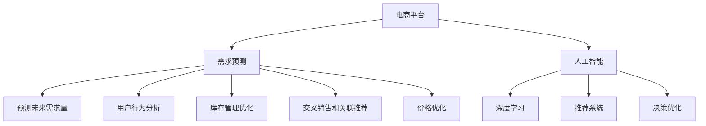

                 

# AI在电商平台精准需求预测中的作用

> 关键词：电商平台,需求预测,人工智能,深度学习,决策优化,推荐系统

## 1. 背景介绍

### 1.1 问题由来
随着互联网经济的快速发展，电商平台已成为众多消费者购买商品的主要渠道。然而，电商平台的运营挑战也日益凸显，尤其是如何精准预测用户需求，及时调整库存和运营策略，一直是电商平台面临的重要问题。传统的需求预测方法，如时间序列预测、统计回归等，存在诸多局限性，难以应对数据的多维度、非线性特性。

在这一背景下，人工智能（AI）技术的兴起，特别是深度学习技术，为电商平台提供了新的解决思路。通过AI模型对用户行为数据的深度挖掘和分析，电商平台可以实现更准确、更动态的需求预测，从而优化库存、提高用户体验，提升整体运营效率。

### 1.2 问题核心关键点
AI在电商平台需求预测中的应用，主要集中在以下几个方面：
- 预测未来需求量：通过AI模型预测特定商品在未来的时间区间内的销售量。
- 用户行为分析：分析用户行为数据，挖掘潜在需求，优化推荐策略。
- 库存管理优化：根据需求预测结果，调整库存水平，避免库存积压和缺货。
- 交叉销售和关联推荐：利用用户历史购买数据和行为数据，挖掘潜在交叉销售机会，提高客单价。
- 价格优化：预测不同价格下的销售量和利润，优化定价策略。

## 2. 核心概念与联系

### 2.1 核心概念概述

为了更好地理解AI在电商平台需求预测中的作用，本节将介绍几个密切相关的核心概念：

- 电商平台：以互联网为基础的商业交易平台，提供商品展示、搜索、购物车、支付等功能，连接供应商和消费者。
- 需求预测：利用历史数据和用户行为分析，预测未来某个时间区间内的商品需求量。
- 人工智能（AI）：通过模拟人类智能过程，如感知、推理、学习等，解决复杂问题的技术。
- 深度学习（DL）：一种基于人工神经网络的机器学习方法，通过多层非线性映射，从数据中自动提取特征。
- 推荐系统（Recommendation System）：根据用户历史行为数据和模型预测，为用户推荐相关商品和服务。
- 决策优化：利用数学和算法模型，优化决策过程，最大化目标函数。

这些概念之间的逻辑关系可以通过以下Mermaid流程图来展示：



这个流程图展示了大语言模型的核心概念及其之间的关系：

1. 电商平台通过深度学习等AI技术，进行需求预测和用户行为分析。
2. 预测结果可用于库存管理、交叉销售、关联推荐等环节，提升运营效率。
3. 推荐系统可进一步提升用户体验，增加转化率和客单价。
4. 价格优化系统通过预测模型，调整定价策略，提升盈利能力。

这些概念共同构成了电商平台的AI需求预测和优化框架，使其能够更好地满足用户需求，提高运营效率。

## 3. 核心算法原理 & 具体操作步骤
### 3.1 算法原理概述

AI在电商平台需求预测中的应用，主要基于深度学习模型。通过深度神经网络，模型能够从历史数据中自动提取特征，并预测未来需求量。其核心思想是：利用大规模用户行为数据，构建一个映射关系，将历史数据映射到未来需求量。

形式化地，假设电商平台的历史数据集为 $D=\{(x_i,y_i)\}_{i=1}^N$，其中 $x_i$ 为历史数据， $y_i$ 为实际销售量。需求预测的目标是找到最优预测模型 $M$，使得预测值 $\hat{y}$ 尽可能接近真实值 $y$。

常见的预测模型包括：
- 时间序列预测模型：如ARIMA、LSTM等，适用于时间序列数据。
- 回归模型：如线性回归、随机森林等，适用于连续性需求预测。
- 神经网络模型：如CNN、RNN、Transformer等，适用于高维度、复杂非线性需求预测。

### 3.2 算法步骤详解

AI在电商平台需求预测的通用流程包括：

**Step 1: 数据准备**
- 收集电商平台的历史数据，包括时间、商品类别、用户ID、购买量等。
- 对数据进行清洗、去重、缺失值处理，形成干净的训练集。
- 将数据划分为训练集和验证集。

**Step 2: 模型选择和构建**
- 选择合适的深度学习模型作为预测模型，如LSTM、GRU、Transformer等。
- 在模型中选择合适的层数、神经元数量、激活函数等超参数，进行模型构建。

**Step 3: 模型训练**
- 使用训练集数据对模型进行训练，通过前向传播和反向传播，优化模型参数。
- 在验证集上评估模型性能，防止过拟合。
- 选择最优模型，保存权重。

**Step 4: 模型评估和优化**
- 使用测试集对模型进行评估，计算预测误差。
- 利用交叉验证、超参数调优等技术，进一步提升模型性能。

**Step 5: 预测和应用**
- 将模型应用于实时数据，进行需求预测。
- 根据预测结果，调整库存水平、优化定价策略、提升推荐系统精准度等。

### 3.3 算法优缺点

AI在电商平台需求预测的方法具有以下优点：
1. 高精度预测：深度学习模型能够自动提取高维度特征，实现更精确的需求预测。
2. 实时动态调整：模型能够实时处理新数据，动态调整预测结果。
3. 自适应性强：模型可以通过在线学习，适应数据分布的变化。
4. 跨领域迁移：在多个平台和商品类别间，模型可进行迁移应用。

同时，该方法也存在一些局限性：
1. 数据依赖性强：模型预测的准确性依赖于历史数据的丰富性和代表性。
2. 模型复杂度高：深度学习模型的构建和训练需要大量计算资源。
3. 可解释性不足：黑盒模型难以解释其内部决策过程。
4. 数据质量要求高：历史数据的噪声和异常值会对预测结果产生较大影响。

尽管存在这些局限性，但就目前而言，AI在电商平台需求预测的方法仍是最主流范式。未来相关研究的重点在于如何进一步降低数据需求，提高模型效率，同时兼顾可解释性和数据质量控制。

### 3.4 算法应用领域

AI在电商平台需求预测的应用领域广泛，包括但不限于以下几个方面：

- 商品需求预测：预测各类商品的销售量，调整库存水平，避免库存积压和缺货。
- 用户行为分析：分析用户购买历史和行为数据，挖掘用户偏好和需求。
- 交叉销售和关联推荐：利用用户历史购买数据和行为数据，挖掘交叉销售和关联推荐机会，提升客单价。
- 价格优化：预测不同价格下的销售量和利润，优化定价策略，提升盈利能力。
- 供应链优化：预测供应链各环节的供需关系，优化物流和库存管理。

除了上述这些领域，AI在电商平台的需求预测还可以应用于个性化营销、异常检测、市场趋势分析等场景，为电商平台的运营提供更全面、精细的支持。

## 4. 数学模型和公式 & 详细讲解  
### 4.1 数学模型构建

本节将使用数学语言对AI在电商平台需求预测的数学模型进行更加严格的刻画。

假设电商平台的历史数据集为 $D=\{(x_i,y_i)\}_{i=1}^N$，其中 $x_i$ 为历史数据， $y_i$ 为实际销售量。定义预测模型的损失函数为均方误差：

$$
\mathcal{L}(\theta) = \frac{1}{N}\sum_{i=1}^N (y_i - \hat{y}_i)^2
$$

其中 $\theta$ 为模型参数， $\hat{y}_i$ 为模型预测值。

通过梯度下降等优化算法，最小化损失函数 $\mathcal{L}$，使得模型预测值 $\hat{y}_i$ 尽可能接近真实值 $y_i$。

### 4.2 公式推导过程

以线性回归模型为例，推导其预测公式和损失函数。

假设模型为线性回归模型 $y_i = \theta_0 + \theta_1 x_{i1} + \theta_2 x_{i2} + \cdots + \theta_p x_{ip} + \epsilon_i$，其中 $\theta_0,\theta_1,\cdots,\theta_p$ 为模型参数，$\epsilon_i$ 为误差项。则均方误差损失函数为：

$$
\mathcal{L}(\theta) = \frac{1}{N}\sum_{i=1}^N (y_i - \theta_0 - \theta_1 x_{i1} - \theta_2 x_{i2} - \cdots - \theta_p x_{ip})^2
$$

利用梯度下降算法，对损失函数求偏导数：

$$
\frac{\partial \mathcal{L}(\theta)}{\partial \theta_k} = \frac{2}{N}\sum_{i=1}^N (y_i - \theta_0 - \theta_1 x_{i1} - \theta_2 x_{i2} - \cdots - \theta_p x_{ip}) x_{ik}
$$

更新模型参数：

$$
\theta_k \leftarrow \theta_k - \eta \frac{\partial \mathcal{L}(\theta)}{\partial \theta_k}
$$

其中 $\eta$ 为学习率。

### 4.3 案例分析与讲解

以某电商平台的日销售额预测为例，展示线性回归模型的应用。

假设某电商平台每天有5000个商品，每天记录了商品的日销售额和相关特征，如日期、星期几、季节、天气、促销活动等。我们将其作为预测数据 $x_i$，将日销售额作为目标变量 $y_i$。

- 数据准备：收集5000个商品的历史销售数据，形成训练集 $D_{train}$，其中包含样本特征 $x_{train}$ 和目标变量 $y_{train}$。
- 模型选择：选择线性回归模型作为预测模型，设置10个特征维度。
- 模型训练：使用训练集 $D_{train}$ 对模型进行训练，最小化损失函数 $\mathcal{L}(\theta)$。
- 模型评估：使用验证集 $D_{valid}$ 评估模型性能，得到均方误差 $MSE_{valid}$。
- 模型应用：使用测试集 $D_{test}$ 对模型进行测试，计算均方误差 $MSE_{test}$。
- 结果分析：分析模型在不同季节、天气条件下的预测性能，优化模型参数。

通过不断迭代和优化，我们可以得到一组准确的预测模型，用于电商平台的日常运营决策。

## 5. 项目实践：代码实例和详细解释说明
### 5.1 开发环境搭建

在进行需求预测实践前，我们需要准备好开发环境。以下是使用Python进行TensorFlow开发的环境配置流程：

1. 安装Anaconda：从官网下载并安装Anaconda，用于创建独立的Python环境。

2. 创建并激活虚拟环境：
```bash
conda create -n tf-env python=3.8 
conda activate tf-env
```

3. 安装TensorFlow：根据CUDA版本，从官网获取对应的安装命令。例如：
```bash
conda install tensorflow==2.7
```

4. 安装各类工具包：
```bash
pip install numpy pandas scikit-learn matplotlib tqdm jupyter notebook ipython
```

完成上述步骤后，即可在`tf-env`环境中开始需求预测实践。

### 5.2 源代码详细实现

这里我们以线性回归模型为例，展示使用TensorFlow进行电商平台日销售额预测的代码实现。

首先，定义预测任务的数据处理函数：

```python
import tensorflow as tf
import numpy as np
from sklearn.metrics import mean_squared_error
import matplotlib.pyplot as plt

class SalesPrediction(tf.keras.Model):
    def __init__(self, feature_dim):
        super(SalesPrediction, self).__init__()
        self.linear_layer = tf.keras.layers.Dense(units=1, input_shape=(feature_dim,))

    def call(self, inputs):
        return self.linear_layer(inputs)

# 读取数据
train_data = np.loadtxt('train.csv', delimiter=',', skiprows=1, usecols=range(1, 6), dtype=float)
test_data = np.loadtxt('test.csv', delimiter=',', skiprows=1, usecols=range(1, 6), dtype=float)

# 分割数据集
from sklearn.model_selection import train_test_split
train_x, valid_x, train_y, valid_y = train_test_split(train_data[:, :5], train_data[:, 5], test_size=0.2, random_state=42)
```

然后，定义模型和优化器：

```python
# 构建模型
model = SalesPrediction(feature_dim=5)

# 定义优化器
optimizer = tf.keras.optimizers.Adam(learning_rate=0.01)

# 定义损失函数
loss_fn = tf.keras.losses.MeanSquaredError()
```

接着，定义训练和评估函数：

```python
# 定义训练函数
def train(model, x_train, y_train, x_valid, y_valid, epochs):
    batch_size = 32
    for epoch in range(epochs):
        for i in range(0, len(x_train), batch_size):
            batch_x = x_train[i:i+batch_size]
            batch_y = y_train[i:i+batch_size]
            with tf.GradientTape() as tape:
                predictions = model(batch_x)
                loss = loss_fn(y_train, predictions)
            gradients = tape.gradient(loss, model.trainable_variables)
            optimizer.apply_gradients(zip(gradients, model.trainable_variables))
            print(f"Epoch {epoch+1}, loss: {loss:.4f}")
    return model

# 定义评估函数
def evaluate(model, x_valid, y_valid):
    predictions = model(valid_x)
    loss = loss_fn(valid_y, predictions)
    mse = mean_squared_error(valid_y, predictions)
    print(f"MSE: {mse:.4f}")
    return mse
```

最后，启动训练流程并在测试集上评估：

```python
epochs = 100
mse_train = train(model, train_x, train_y, valid_x, valid_y, epochs)
mse_valid = evaluate(model, valid_x, valid_y)
print(f"Validation MSE: {mse_valid:.4f}")
```

以上就是使用TensorFlow对电商平台日销售额进行预测的完整代码实现。可以看到，得益于TensorFlow的强大封装，我们可以用相对简洁的代码完成线性回归模型的构建和训练。

### 5.3 代码解读与分析

让我们再详细解读一下关键代码的实现细节：

**SalesPrediction类**：
- `__init__`方法：初始化线性层，设置输入维度。
- `call`方法：定义模型的前向传播过程，输出预测结果。

**数据读取和分割**：
- 使用`numpy`读取数据，并将其分割为训练集和验证集。
- 使用`train_test_split`函数，以80%的数据作为训练集，20%的数据作为验证集。

**模型构建**：
- 选择线性回归模型，设置5个输入特征维度。
- 使用`tf.keras.layers.Dense`定义线性层，设置输出维度为1，表示预测结果。

**优化器和损失函数**：
- 选择Adam优化器，设置学习率为0.01。
- 选择均方误差损失函数。

**训练和评估函数**：
- 定义训练函数`train`，在每个epoch中，通过梯度下降算法更新模型参数。
- 定义评估函数`evaluate`，计算验证集上的均方误差。

**训练流程**：
- 设置总epoch数为100，启动训练函数。
- 在每个epoch中，打印训练损失，直到训练结束。
- 在验证集上评估模型，输出验证均方误差。

可以看到，TensorFlow使得模型构建和训练变得非常便捷，能够快速迭代和优化。同时，TensorFlow的自动微分机制也大大简化了反向传播的计算过程，提高了模型的训练效率。

当然，工业级的系统实现还需考虑更多因素，如模型的保存和部署、超参数的自动搜索、更灵活的任务适配层等。但核心的预测范式基本与此类似。

## 6. 实际应用场景
### 6.1 智能库存管理

电商平台的库存管理一直是运营中的重要环节。通过AI需求预测模型，可以及时调整库存水平，避免库存积压和缺货。具体来说，模型可以根据预测结果，提前进行补货或清理库存，确保商品供需平衡。

### 6.2 个性化营销策略

传统的营销策略往往以推广活动和优惠信息为主，难以精准触达用户需求。利用AI需求预测模型，电商平台可以深入挖掘用户行为数据，洞察用户偏好，设计个性化推荐和促销策略，提高营销效果和用户满意度。

### 6.3 精准定价策略

定价策略在电商运营中具有举足轻重的地位。AI需求预测模型可以根据历史数据和用户行为，预测不同价格下的销售量和利润，优化定价策略，提升整体盈利能力。

### 6.4 跨平台应用

电商平台的运营范围往往跨越多个平台和渠道，如何统一管理各平台的需求数据，实现跨平台需求预测和优化，是一个重要课题。AI需求预测模型可以在各平台数据的基础上进行统一建模，实现跨平台应用，提升整体运营效率。

### 6.5 异常检测和预警

异常检测在电商平台运营中，可以及时发现供应链异常、需求波动等问题，进行预警和处理。AI需求预测模型可以帮助电商平台预测未来需求量，识别异常波动，并及时进行预警，保障运营稳定。

### 6.6 市场趋势分析

电商平台的运营策略需要及时跟进市场趋势。AI需求预测模型可以基于历史数据和用户行为，预测市场趋势，提前进行资源配置和策略调整，确保市场竞争力。

## 7. 工具和资源推荐
### 7.1 学习资源推荐

为了帮助开发者系统掌握AI在电商平台需求预测的理论基础和实践技巧，这里推荐一些优质的学习资源：

1. 《深度学习基础》系列博文：由深度学习专家撰写，深入浅出地介绍了深度学习的基本概念和常用模型。

2. TensorFlow官方文档：TensorFlow的官方文档，提供了完整的API文档和代码示例，是学习深度学习模型的必备资料。

3. Keras官方文档：Keras的官方文档，提供了易用的API和丰富的示例，适合快速上手。

4. PyTorch官方文档：PyTorch的官方文档，提供了动态计算图的强大特性，适合研究深度学习模型。

5. 《Python深度学习》书籍：通过实例演示，介绍了深度学习模型的构建和应用。

6. Coursera《深度学习专项课程》：由深度学习领域权威机构和专家开设的系列课程，适合系统学习深度学习模型。

通过对这些资源的学习实践，相信你一定能够快速掌握AI在电商平台需求预测的精髓，并用于解决实际的运营问题。

### 7.2 开发工具推荐

高效的开发离不开优秀的工具支持。以下是几款用于AI需求预测开发的常用工具：

1. TensorFlow：基于Python的开源深度学习框架，生产部署方便，适合大规模工程应用。

2. PyTorch：基于Python的开源深度学习框架，灵活便捷，适合研究型应用。

3. Jupyter Notebook：一个轻量级的交互式编程环境，支持Python、R等编程语言，便于快速迭代开发。

4. Scikit-learn：基于Python的机器学习库，提供了丰富的算法和工具，适合快速原型开发。

5. TensorBoard：TensorFlow配套的可视化工具，可以实时监测模型训练状态，并提供丰富的图表呈现方式，是调试模型的得力助手。

6. Weights & Biases：模型训练的实验跟踪工具，可以记录和可视化模型训练过程中的各项指标，方便对比和调优。

合理利用这些工具，可以显著提升AI需求预测任务的开发效率，加快创新迭代的步伐。

### 7.3 相关论文推荐

AI在电商平台需求预测技术的发展，得益于学界的持续研究。以下是几篇奠基性的相关论文，推荐阅读：

1. "Long Short-Term Memory"（LSTM）论文：提出了LSTM网络，解决序列数据中的长期依赖问题。

2. "Generative Adversarial Nets"（GANs）论文：提出了GANs模型，解决数据生成和数据增强问题。

3. "XGBoost: A Scalable Tree Boosting System"论文：提出了XGBoost算法，解决复杂数据集的高效拟合问题。

4. "AdaBoost.R"论文：提出了AdaBoost算法，解决数据集的不平衡问题。

5. "Dropout: A Simple Way to Prevent Neural Networks from Overfitting"论文：提出了Dropout技术，解决过拟合问题。

6. "A Deep Learning Framework for Automatic Feature Engineering"论文：提出了自动特征工程方法，提高模型训练的自动化程度。

这些论文代表了大语言模型需求预测技术的发展脉络。通过学习这些前沿成果，可以帮助研究者把握学科前进方向，激发更多的创新灵感。

## 8. 总结：未来发展趋势与挑战

### 8.1 总结

本文对AI在电商平台需求预测中的应用进行了全面系统的介绍。首先阐述了AI在电商平台需求预测中的作用，明确了需求预测在电商运营中的重要地位。其次，从原理到实践，详细讲解了需求预测的数学模型和算法步骤，给出了预测任务开发的完整代码实例。同时，本文还广泛探讨了AI在电商平台需求预测的实际应用场景，展示了AI在电商运营中的广泛价值。

通过本文的系统梳理，可以看到，AI在电商平台需求预测技术正在成为电商运营的重要支撑，极大地提升了运营效率和用户满意度。未来，伴随AI技术的不断演进，电商平台的运营模式和用户体验必将发生深刻变革。

### 8.2 未来发展趋势

展望未来，AI在电商平台需求预测技术将呈现以下几个发展趋势：

1. 模型规模持续增大。随着算力成本的下降和数据规模的扩张，AI需求预测模型将不断增大，引入更多神经元和层数，提升预测精度。

2. 实时动态调整。AI需求预测模型将实现实时动态调整，能够根据实时数据进行预测，提升预测的时效性。

3. 多模态预测。AI需求预测模型将引入多模态数据，如图像、语音、行为数据等，实现更加全面和精准的预测。

4. 跨平台统一建模。AI需求预测模型将跨多个平台和渠道进行统一建模，实现跨平台应用，提升整体运营效率。

5. 无监督和半监督学习。AI需求预测模型将引入无监督和半监督学习方法，降低对标注数据的依赖，提高预测的灵活性和泛化能力。

6. 自适应和自优化。AI需求预测模型将实现自适应和自优化，能够根据数据分布的变化，自动调整模型参数，提升预测精度。

以上趋势凸显了AI需求预测技术的广阔前景。这些方向的探索发展，必将进一步提升电商平台的需求预测能力，为电商平台的运营提供更强大的决策支持。

### 8.3 面临的挑战

尽管AI在电商平台需求预测技术已经取得了瞩目成就，但在迈向更加智能化、普适化应用的过程中，它仍面临着诸多挑战：

1. 数据依赖性高。AI需求预测模型的预测精度依赖于历史数据的丰富性和代表性，如何获取高质量、多样化的历史数据，是一个重要课题。

2. 模型复杂度高。深度学习模型通常需要大量计算资源进行训练和优化，如何优化模型结构，提高训练效率，是一个重要挑战。

3. 可解释性不足。黑盒模型难以解释其内部决策过程，对于电商平台的运营决策，可解释性尤为重要，如何提升模型的可解释性，是一个亟待解决的问题。

4. 数据质量要求高。历史数据中的噪声和异常值对预测结果产生较大影响，如何清洗和处理数据，保障数据质量，是一个重要课题。

5. 跨平台一致性。电商平台跨多个平台和渠道运营，如何实现跨平台数据的一致性和统一建模，是一个重要课题。

6. 模型鲁棒性不足。面对新数据和新场景，AI需求预测模型容易发生灾难性遗忘，如何提高模型的鲁棒性，是一个重要课题。

正视AI需求预测面临的这些挑战，积极应对并寻求突破，将是大语言模型需求预测走向成熟的必由之路。相信随着学界和产业界的共同努力，这些挑战终将一一被克服，AI需求预测技术必将在构建高效、智能的电商运营中扮演越来越重要的角色。

### 8.4 研究展望

面向未来，大语言模型需求预测技术需要在以下几个方面寻求新的突破：

1. 探索多模态预测方法。引入多模态数据，如图像、语音、行为数据等，实现更加全面和精准的预测。

2. 研究无监督和半监督学习。引入无监督和半监督学习方法，降低对标注数据的依赖，提高预测的灵活性和泛化能力。

3. 引入因果分析和博弈论工具。将因果分析方法引入需求预测模型，识别出模型决策的关键特征，增强输出解释的因果性和逻辑性。

4. 结合知识表示和推理。将符号化的先验知识，如知识图谱、逻辑规则等，与神经网络模型进行巧妙融合，引导需求预测过程学习更准确、合理的语言模型。

5. 纳入伦理道德约束。在模型训练目标中引入伦理导向的评估指标，过滤和惩罚有偏见、有害的输出倾向，确保模型输出的安全性。

这些研究方向的探索，必将引领AI需求预测技术迈向更高的台阶，为构建高效、智能的电商运营系统铺平道路。面向未来，AI需求预测技术还需要与其他人工智能技术进行更深入的融合，如知识表示、因果推理、强化学习等，多路径协同发力，共同推动电商平台的运营效率和用户体验提升。只有勇于创新、敢于突破，才能不断拓展需求预测的边界，让AI技术更好地造福人类社会。

## 9. 附录：常见问题与解答

**Q1：AI需求预测模型为何需要大量历史数据？**

A: AI需求预测模型需要大量历史数据来训练和优化，以便模型能够从数据中学习到商品需求的相关模式和规律。历史数据量越大，模型的泛化能力和预测精度越高。但同时，过量的历史数据也会带来数据处理和存储上的挑战，需要合理地进行选择和管理。

**Q2：AI需求预测模型如何处理噪声和异常数据？**

A: AI需求预测模型通常使用数据清洗和异常值检测技术来处理噪声和异常数据。数据清洗技术包括去重、填充缺失值、异常值处理等。异常值检测技术包括基于统计学的方法（如Z-score、IQR）、基于机器学习的方法（如孤立森林、K-means等），以及基于深度学习的方法（如LSTM、Transformer等）。通过这些技术，可以有效地降低噪声和异常数据对预测结果的影响。

**Q3：AI需求预测模型为何需要实时动态调整？**

A: 电商平台的需求量和用户行为具有时变性，实时动态调整AI需求预测模型，可以及时响应市场变化，确保预测结果的实时性和准确性。比如，当某个促销活动或季节性因素发生变化时，实时动态调整模型，可以迅速适应新情况，提供更准确的预测结果。

**Q4：AI需求预测模型如何提高可解释性？**

A: 提高AI需求预测模型的可解释性，通常需要使用可解释性更高的模型，如决策树、线性回归等，或者引入可解释性技术，如LIME、SHAP等。此外，可以使用特征可视化技术，展示模型的输入特征对输出结果的影响，提升模型的透明度。同时，建立模型训练的透明流程，记录模型训练过程中的关键参数和决策路径，也有助于提高模型的可解释性。

**Q5：AI需求预测模型为何需要跨平台统一建模？**

A: 电商平台跨多个平台和渠道运营，数据格式和采集方式各不相同，单一平台的数据难以全面反映整体运营状况。跨平台统一建模，可以实现数据整合和分析，更全面地了解用户行为和市场需求，从而制定更精准的运营策略。

通过以上详细解释和回答，希望能帮助你更好地理解和掌握AI在电商平台需求预测中的应用，为实际的电商运营决策提供有力的技术支撑。

