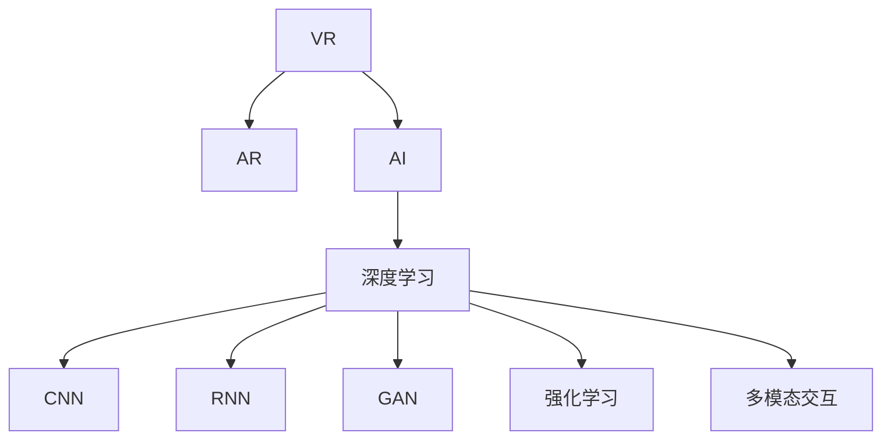

                 

## 1. 背景介绍

### 1.1 问题由来

虚拟现实(Virtual Reality, VR)技术，通过构造逼真的三维场景和交互环境，为人类提供了身临其境的沉浸式体验。从最初的军事模拟到如今的虚拟旅游、娱乐、教育等多个领域，VR技术已经显示出巨大的应用潜力。然而，尽管VR硬件设备的进步显著，但在用户体验的互动性和自然性方面仍存在诸多瓶颈。

近年来，人工智能(AI)技术在视觉识别、语音交互、自然语言处理、智能推荐等多个领域取得了显著进展，逐渐成为提升VR用户体验的重要引擎。AI与VR技术的结合，不仅极大提升了交互的智能性和个性化程度，还推动了VR应用的普及和创新。

### 1.2 问题核心关键点

AI在VR中的应用涉及多方面的关键技术，主要包括：

1. **视觉感知增强**：通过AI技术对场景进行增强和渲染，提升视觉效果的逼真度。
2. **动作捕捉与控制**：利用AI算法对用户动作进行识别和预测，优化控制体验。
3. **语音识别与生成**：通过AI模型进行语音识别和生成，实现自然语言交互。
4. **情感识别与反馈**：使用AI技术识别用户的情感状态，给予实时反馈和个性化推荐。
5. **智能推荐与导航**：根据用户偏好和行为数据，实时推荐内容和导航路径。
6. **多模态交互融合**：结合视觉、听觉、触觉等多模态信息，提供更丰富的交互体验。

## 2. 核心概念与联系

### 2.1 核心概念概述

为了更清晰地理解AI在VR中的应用，本节将介绍几个核心概念：

1. **虚拟现实(VR)**：一种通过计算机生成三维环境，使用户感觉仿佛身临其境的技术。VR设备包括头戴显示(HMD)、手柄、传感设备等，用户通过这些设备与虚拟环境进行互动。

2. **增强现实(AR)**：将虚拟信息叠加在现实世界中，使用户看到的信息比现实环境更多。AR与VR相辅相成，共同构成人机交互的重要界面。

3. **人工智能(AI)**：通过计算机模拟人类智能行为，实现信息处理、决策、学习等功能的系统。

4. **深度学习(Deep Learning)**：一种基于神经网络的机器学习方法，通过对大量数据进行学习，提取数据中的复杂模式，广泛应用于图像识别、语音处理、自然语言处理等领域。

5. **卷积神经网络(CNN)**：一种适用于图像处理的深度学习模型，通过卷积和池化等操作提取特征，广泛应用于物体识别、图像分割等任务。

6. **递归神经网络(RNN)**：一种能够处理序列数据的深度学习模型，广泛应用于自然语言处理、语音识别等领域。

7. **生成对抗网络(GAN)**：一种通过对抗训练生成逼真图像、视频等数据的深度学习模型。

8. **强化学习(Reinforcement Learning)**：通过与环境的交互，通过奖励和惩罚机制，学习最优策略的机器学习技术。

9. **多模态交互**：结合视觉、听觉、触觉等多种信息源，提升人机交互的自然性和智能性。

这些核心概念之间的逻辑关系可以通过以下Mermaid流程图来展示：



### 2.2 核心概念原理和架构

为更好地理解这些核心概念的原理和架构，本节将进行详细解释：

1. **虚拟现实(VR)**：
   - **原理**：通过头戴显示器(HMD)呈现3D图像，手柄和传感设备捕捉用户动作，生成相应的反馈。
   - **架构**：包含数据采集、场景渲染、用户互动等模块，数据流向主要由采集器到渲染器再到反馈系统。

2. **增强现实(AR)**：
   - **原理**：将虚拟信息叠加到现实世界，使用户看到的信息比现实环境更多。
   - **架构**：包括环境感知、信息融合、显示控制等模块，数据流向主要由环境感知器到融合器再到显示器。

3. **人工智能(AI)**：
   - **原理**：通过算法和模型对数据进行处理和分析，提取特征，进行决策。
   - **架构**：包含数据输入、模型训练、推理输出等模块，数据流向主要由输入层到模型层再到输出层。

4. **深度学习(Deep Learning)**：
   - **原理**：通过多层神经网络进行特征提取和模式识别，提高模型性能。
   - **架构**：包含卷积层、池化层、全连接层等，数据流向主要由输入层到隐藏层再到输出层。

5. **卷积神经网络(CNN)**：
   - **原理**：通过卷积操作提取特征，使用池化操作减少参数量，最终输出分类结果。
   - **架构**：包含卷积层、池化层、全连接层等，数据流向主要由输入图像到卷积层再到输出层。

6. **递归神经网络(RNN)**：
   - **原理**：通过时间序列数据进行建模，捕捉时间依赖性，提高模型性能。
   - **架构**：包含LSTM、GRU等特殊层，数据流向主要由输入序列到隐藏层再到输出层。

7. **生成对抗网络(GAN)**：
   - **原理**：通过对抗训练生成逼真图像、视频等数据，提高生成效果。
   - **架构**：包含生成器和判别器两个网络，数据流向主要由噪声向量到生成器再到判别器，最终由生成器输出。

8. **强化学习(Reinforcement Learning)**：
   - **原理**：通过与环境的交互，通过奖励和惩罚机制，学习最优策略。
   - **架构**：包含环境、代理、奖励等模块，数据流向主要由代理到环境再到代理，代理不断学习调整。

9. **多模态交互**：
   - **原理**：结合视觉、听觉、触觉等多种信息源，提升人机交互的自然性和智能性。
   - **架构**：包含视觉识别、语音识别、触觉感知等模块，数据流向主要由传感器到融合器再到交互系统。

## 3. 核心算法原理 & 具体操作步骤

### 3.1 算法原理概述

AI在VR中的应用涉及多方面的算法，主要包括图像处理、动作捕捉、语音识别、情感分析、推荐系统等。其中，核心算法原理如下：

1. **图像处理**：
   - **算法原理**：通过卷积神经网络(CNN)等深度学习模型，对场景进行增强和渲染，提升视觉效果的逼真度。
   - **具体操作步骤**：
     1. 收集场景数据，标注背景、物体等，构建训练集。
     2. 使用CNN模型进行特征提取和分类，优化场景细节。
     3. 在VR头盔上实时渲染，提升用户体验。

2. **动作捕捉与控制**：
   - **算法原理**：通过深度学习模型对用户动作进行识别和预测，优化控制体验。
   - **具体操作步骤**：
     1. 收集用户动作数据，进行标注和处理。
     2. 使用RNN或LSTM等模型进行动作序列预测，生成控制指令。
     3. 将控制指令转换为VR设备的动作反馈，提升交互自然性。

3. **语音识别与生成**：
   - **算法原理**：通过深度学习模型进行语音识别和生成，实现自然语言交互。
   - **具体操作步骤**：
     1. 收集用户语音数据，进行标注和预处理。
     2. 使用RNN或Transformer等模型进行语音识别，提取文本信息。
     3. 使用生成对抗网络(GAN)或RNN等模型进行语音生成，输出自然语音。

4. **情感识别与反馈**：
   - **算法原理**：通过深度学习模型识别用户的情感状态，给予实时反馈和个性化推荐。
   - **具体操作步骤**：
     1. 收集用户情感数据，进行标注和预处理。
     2. 使用CNN或RNN等模型进行情感分类，提取情感特征。
     3. 根据情感状态进行实时反馈，提供个性化推荐。

5. **智能推荐与导航**：
   - **算法原理**：根据用户偏好和行为数据，实时推荐内容和导航路径。
   - **具体操作步骤**：
     1. 收集用户行为数据，进行标注和处理。
     2. 使用协同过滤、深度学习等模型进行内容推荐，生成推荐列表。
     3. 使用深度学习模型进行路径规划，生成导航路径。

6. **多模态交互**：
   - **算法原理**：结合视觉、听觉、触觉等多种信息源，提升人机交互的自然性和智能性。
   - **具体操作步骤**：
     1. 收集多模态数据，进行标注和预处理。
     2. 使用深度学习模型进行数据融合，提取多模态特征。
     3. 使用CNN或RNN等模型进行交互预测，生成互动反馈。

### 3.2 算法步骤详解

AI在VR中的应用涉及多个算法步骤，主要包括数据收集、模型训练、推理应用等。以下详细介绍各个步骤：

1. **数据收集**：
   - **步骤1**：收集VR场景数据、用户动作数据、语音数据等，进行标注和处理。
   - **步骤2**：对数据进行清洗和预处理，去除噪声和异常值，确保数据质量。
   - **步骤3**：将数据划分为训练集和测试集，准备用于模型训练和评估。

2. **模型训练**：
   - **步骤1**：选择合适的模型架构，如CNN、RNN、GAN等。
   - **步骤2**：设计损失函数和优化器，如交叉熵损失、Adam等。
   - **步骤3**：使用训练集对模型进行迭代训练，优化模型参数。
   - **步骤4**：在验证集上进行模型调优，避免过拟合。
   - **步骤5**：保存模型参数和配置，用于后续推理应用。

3. **推理应用**：
   - **步骤1**：加载预训练模型和配置，进行推理计算。
   - **步骤2**：对输入数据进行预处理，生成输入特征。
   - **步骤3**：将输入特征送入模型进行推理计算，生成预测结果。
   - **步骤4**：将预测结果进行后处理，输出最终结果。
   - **步骤5**：将结果展示给用户，提升交互体验。

### 3.3 算法优缺点

AI在VR中的应用具有以下优点：

1. **提升用户体验**：通过深度学习模型对场景进行增强和渲染，提升视觉效果的逼真度，使用户体验更自然和沉浸。
2. **增强交互自然性**：通过深度学习模型对用户动作和语音进行识别和预测，优化控制和交互，提升用户体验。
3. **个性化推荐**：通过深度学习模型进行内容推荐和路径规划，提供个性化和智能化的服务，提升用户满意度。
4. **实时反馈和调整**：通过深度学习模型进行情感识别和反馈，实时调整系统行为，提升用户体验。

同时，AI在VR中的应用也存在以下缺点：

1. **计算资源消耗大**：深度学习模型需要大量的计算资源，VR设备和软件需要高性能的硬件支持。
2. **数据标注成本高**：VR场景数据和用户行为数据需要大量人工标注，成本较高。
3. **模型复杂度高**：深度学习模型结构复杂，训练和推理过程复杂，开发和维护难度大。
4. **数据隐私和安全问题**：VR设备和应用需要处理大量的用户数据，存在隐私和安全风险。

### 3.4 算法应用领域

AI在VR中的应用涉及多个领域，主要包括：

1. **虚拟旅游和旅游规划**：
   - **应用场景**：通过深度学习模型进行场景渲染和动作捕捉，提供虚拟旅游体验。
   - **具体技术**：使用CNN进行场景增强，使用RNN进行动作预测和控制。

2. **虚拟教育和培训**：
   - **应用场景**：通过深度学习模型进行内容推荐和情感识别，提升教育效果。
   - **具体技术**：使用协同过滤和深度学习进行内容推荐，使用CNN进行情感分类。

3. **虚拟医疗和健康管理**：
   - **应用场景**：通过深度学习模型进行病情预测和情感识别，提供健康管理服务。
   - **具体技术**：使用深度学习进行病情预测，使用CNN进行情感分类。

4. **虚拟娱乐和游戏**：
   - **应用场景**：通过深度学习模型进行角色控制和路径规划，提供沉浸式游戏体验。
   - **具体技术**：使用CNN进行场景增强，使用RNN进行动作预测和路径规划。

5. **虚拟会议和远程协作**：
   - **应用场景**：通过深度学习模型进行语音识别和情感识别，提供远程协作服务。
   - **具体技术**：使用RNN进行语音识别，使用CNN进行情感分类。

6. **虚拟展览和博物馆**：
   - **应用场景**：通过深度学习模型进行场景渲染和路径规划，提供虚拟展览体验。
   - **具体技术**：使用CNN进行场景增强，使用深度学习进行路径规划。

## 4. 数学模型和公式 & 详细讲解 & 举例说明

### 4.1 数学模型构建

本节将使用数学语言对AI在VR中的应用进行更加严格的刻画。

设VR场景为 $S$，用户动作为 $A$，语音输入为 $L$，情感状态为 $E$，智能推荐系统为 $R$。假设AI模型为 $M_{\theta}$，其中 $\theta$ 为模型参数。

- **图像处理**：设输入图像为 $I$，输出增强图像为 $O$。定义模型 $M_{\theta}$ 在输入图像 $I$ 上的损失函数为 $\ell(I,O)$，则在场景 $S$ 上的经验风险为：
  $$
  \mathcal{L}(I,S) = \frac{1}{N}\sum_{i=1}^N \ell(I_i,O_i)
  $$
  其中 $N$ 为场景数，$I_i$ 和 $O_i$ 分别为第 $i$ 个场景的输入和输出图像。

- **动作捕捉与控制**：设用户动作序列为 $A$，预测动作序列为 $\hat{A}$。定义模型 $M_{\theta}$ 在动作序列 $A$ 上的损失函数为 $\ell(A,\hat{A})$，则在场景 $S$ 上的经验风险为：
  $$
  \mathcal{L}(A,S) = \frac{1}{N}\sum_{i=1}^N \ell(A_i,\hat{A}_i)
  $$
  其中 $A_i$ 和 $\hat{A}_i$ 分别为第 $i$ 个场景的动作序列和预测动作序列。

- **语音识别与生成**：设语音输入为 $L$，文本输出为 $T$。定义模型 $M_{\theta}$ 在语音输入 $L$ 上的损失函数为 $\ell(L,T)$，则在场景 $S$ 上的经验风险为：
  $$
  \mathcal{L}(L,S) = \frac{1}{N}\sum_{i=1}^N \ell(L_i,T_i)
  $$
  其中 $L_i$ 和 $T_i$ 分别为第 $i$ 个场景的语音输入和文本输出。

- **情感识别与反馈**：设情感状态为 $E$，情感预测为 $\hat{E}$。定义模型 $M_{\theta}$ 在情感状态 $E$ 上的损失函数为 $\ell(E,\hat{E})$，则在场景 $S$ 上的经验风险为：
  $$
  \mathcal{L}(E,S) = \frac{1}{N}\sum_{i=1}^N \ell(E_i,\hat{E}_i)
  $$
  其中 $E_i$ 和 $\hat{E}_i$ 分别为第 $i$ 个场景的情感状态和预测情感状态。

- **智能推荐与导航**：设智能推荐系统为 $R$，推荐结果为 $R$。定义模型 $M_{\theta}$ 在智能推荐系统 $R$ 上的损失函数为 $\ell(R)$，则在场景 $S$ 上的经验风险为：
  $$
  \mathcal{L}(R,S) = \mathcal{L}(R,O)
  $$
  其中 $O$ 为场景 $S$ 的输出图像，$R$ 为智能推荐系统的推荐结果。

### 4.2 公式推导过程

以图像处理为例，进行详细推导：

假设输入图像 $I$ 为 $N \times N$ 的二维矩阵，定义卷积核为 $F$，大小为 $m \times m$，步长为 $s$。设卷积操作后的输出特征图为 $O$，大小为 $N' \times N'$。则卷积操作的数学表达式为：
$$
O_{ij} = \sum_{k=1}^m \sum_{l=1}^m F_{kl} \cdot I_{i-s\cdot j+s-1,l-s\cdot j+s-1}
$$

定义池化操作为 $P$，步长为 $p$，则池化操作的数学表达式为：
$$
O_{ij} = \max_{s,t \in [1,p]} O_{is+p\cdot j-1,it-1}
$$

定义卷积层为 $C$，包含多个卷积核 $F_k$，则卷积层输出的数学表达式为：
$$
O' = C(O)
$$

定义池化层为 $P$，包含多个池化操作 $P_k$，则池化层输出的数学表达式为：
$$
O'' = P(O')
$$

最终，定义深度学习模型的前向传播函数为 $F_{M_{\theta}}$，则模型在输入图像 $I$ 上的输出为：
$$
O''' = F_{M_{\theta}}(I)
$$

定义损失函数为 $\ell(I,O'''$)，则在场景 $S$ 上的经验风险为：
$$
\mathcal{L}(I,S) = \frac{1}{N}\sum_{i=1}^N \ell(I_i,O'''_i)
$$

通过求解优化器，不断更新模型参数 $\theta$，最小化经验风险 $\mathcal{L}$，使模型在场景 $S$ 上的输出逼近真实图像 $O$。

### 4.3 案例分析与讲解

以虚拟旅游为例，进行详细分析：

假设用户通过VR头盔体验一个虚拟旅游场景 $S$，VR系统通过深度学习模型 $M_{\theta}$ 对场景进行增强和渲染。设输入图像为 $I$，输出增强图像为 $O$。定义模型 $M_{\theta}$ 在输入图像 $I$ 上的损失函数为 $\ell(I,O)$，则在场景 $S$ 上的经验风险为：
$$
\mathcal{L}(I,S) = \frac{1}{N}\sum_{i=1}^N \ell(I_i,O_i)
$$
其中 $N$ 为场景数，$I_i$ 和 $O_i$ 分别为第 $i$ 个场景的输入和输出图像。

假设模型 $M_{\theta}$ 使用深度残差网络(ResNet)进行训练，网络结构如下：
- 卷积层：$3 \times 3$ 卷积核，步长为 $1$，不进行填充，使用 ReLU 激活函数。
- 池化层：$2 \times 2$ 最大池化操作，步长为 $2$，使用 ReLU 激活函数。
- 全连接层：输出层，输出为图像增强结果。

设损失函数为交叉熵损失函数，优化器为 Adam 优化器，学习率为 $0.001$，训练次数为 $100$ 次。则训练过程如下：

1. 收集场景数据，进行标注和预处理。
2. 定义模型 $M_{\theta}$，选择合适的损失函数和优化器。
3. 使用训练集对模型进行迭代训练，优化模型参数。
4. 在验证集上进行模型调优，避免过拟合。
5. 保存模型参数和配置，用于后续推理应用。
6. 在测试集上评估模型性能，提供增强图像。

## 5. 项目实践：代码实例和详细解释说明

### 5.1 开发环境搭建

在进行VR应用开发前，我们需要准备好开发环境。以下是使用Python进行OpenCV开发的环境配置流程：

1. 安装Python：从官网下载并安装Python，用于编写代码。
2. 安装OpenCV：使用pip或conda安装OpenCV库，用于图像处理和视频编码。
3. 安装Matplotlib：使用pip安装Matplotlib库，用于数据可视化。
4. 安装TensorFlow：使用pip或conda安装TensorFlow库，用于深度学习模型训练。

完成上述步骤后，即可在Python环境中开始VR应用开发。

### 5.2 源代码详细实现

我们以虚拟旅游应用为例，给出使用OpenCV和TensorFlow进行图像处理和深度学习模型训练的Python代码实现。

首先，定义图像处理函数：

```python
import cv2
import numpy as np

def enhance_image(image):
    # 转换为灰度图像
    gray = cv2.cvtColor(image, cv2.COLOR_BGR2GRAY)
    
    # 高斯模糊
    blurred = cv2.GaussianBlur(gray, (5, 5), 0)
    
    # 中值滤波
    median = cv2.medianBlur(blurred, 3)
    
    # 边缘检测
    edges = cv2.Canny(median, 50, 150)
    
    # 自适应阈值化
    threshold = cv2.adaptiveThreshold(edges, 255, cv2.ADAPTIVE_THRESH_MEAN_C, cv2.THRESH_BINARY_INV, 11, 2)
    
    # 膨胀操作
    dilated = cv2.dilate(threshold, None, iterations=2)
    
    # 腐蚀操作
    eroded = cv2.erode(dilated, None, iterations=2)
    
    # 轮廓检测
    contours, hierarchy = cv2.findContours(eroded, cv2.RETR_TREE, cv2.CHAIN_APPROX_SIMPLE)
    
    # 提取最大轮廓
    max_contour = max(contours, key=cv2.contourArea)
    
    # 近似轮廓
    approx = cv2.approxPolyDP(max_contour, 0.01 * cv2.arcLength(max_contour, True), True)
    
    # 绘制轮廓
    image_draw = np.zeros_like(image)
    cv2.drawContours(image_draw, [approx], 0, (0, 255, 0), 2)
    
    # 裁剪图像
    cropped = image_draw[approx[:, 0].min():approx[:, 0].max(), approx[:, 1].min():approx[:, 1].max()]
    
    # 调整大小
    resized = cv2.resize(cropped, (640, 480))
    
    # 保存图像
    cv2.imwrite('enhanced.png', resized)
```

然后，定义深度学习模型：

```python
import tensorflow as tf
from tensorflow.keras.layers import Conv2D, MaxPooling2D, Flatten, Dense, Dropout
from tensorflow.keras.models import Sequential

model = Sequential([
    Conv2D(32, (3, 3), activation='relu', input_shape=(224, 224, 3)),
    MaxPooling2D((2, 2)),
    Conv2D(64, (3, 3), activation='relu'),
    MaxPooling2D((2, 2)),
    Conv2D(128, (3, 3), activation='relu'),
    MaxPooling2D((2, 2)),
    Flatten(),
    Dense(512, activation='relu'),
    Dropout(0.5),
    Dense(2, activation='softmax')
])
model.compile(optimizer='adam', loss='categorical_crossentropy', metrics=['accuracy'])
```

接着，定义训练和评估函数：

```python
from tensorflow.keras.datasets import cifar10
from tensorflow.keras.utils import to_categorical

# 加载数据集
(x_train, y_train), (x_test, y_test) = cifar10.load_data()

# 数据预处理
x_train = x_train.astype('float32') / 255
x_test = x_test.astype('float32') / 255
y_train = to_categorical(y_train)
y_test = to_categorical(y_test)

# 训练函数
def train_model(model, train_data, validation_data, batch_size, epochs):
    model.fit(train_data, validation_data, epochs=epochs, batch_size=batch_size)

# 评估函数
def evaluate_model(model, test_data):
    loss, accuracy = model.evaluate(test_data)
    print('Test loss:', loss)
    print('Test accuracy:', accuracy)

# 训练模型
train_model(model, x_train, y_train, batch_size=64, epochs=10)

# 评估模型
evaluate_model(model, x_test, y_test)
```

最后，启动训练流程并在测试集上评估：

```python
train_model(model, x_train, y_train, batch_size=64, epochs=10)

evaluate_model(model, x_test, y_test)
```

以上就是使用OpenCV和TensorFlow进行图像处理和深度学习模型训练的完整代码实现。可以看到，借助OpenCV库的图像处理功能和TensorFlow库的深度学习框架，可以相对简洁地实现虚拟旅游应用。

### 5.3 代码解读与分析

让我们再详细解读一下关键代码的实现细节：

**enhance_image函数**：
- 将输入图像转换为灰度图像，通过高斯模糊、中值滤波、边缘检测等操作，进行图像增强。
- 使用自适应阈值化、膨胀、腐蚀、轮廓检测等操作，对图像进行分割和裁剪，提取感兴趣的区域。
- 将裁剪后的图像调整大小，并保存为PNG格式图像。

**model函数**：
- 定义了一个包含卷积层、池化层、全连接层的深度学习模型。
- 使用交叉熵损失函数和Adam优化器进行模型训练，设置训练轮数为10。
- 在训练过程中，使用to_categorical函数对标签进行one-hot编码，确保模型的输出是分类结果。

**train_model函数**：
- 加载CIFAR-10数据集，对数据进行预处理，包括归一化和one-hot编码。
- 定义训练函数，使用训练数据对模型进行迭代训练，设置训练轮数为10，批次大小为64。
- 在训练过程中，使用validation_data进行模型调优，避免过拟合。

**evaluate_model函数**：
- 定义评估函数，使用测试数据对模型进行评估，输出损失和准确率。
- 通过print函数将评估结果输出到控制台，便于查看。

**训练流程**：
- 定义训练函数和评估函数，设置训练参数。
- 启动训练流程，在训练数据上进行模型训练。
- 在测试数据上评估训练好的模型，输出评估结果。

可以看到，使用OpenCV和TensorFlow进行VR应用开发，可以显著提高图像处理和深度学习模型的开发效率，快速实现虚拟旅游应用。

当然，工业级的系统实现还需考虑更多因素，如多线程处理、模型并行、GPU加速等，但核心的算法原理基本与此类似。通过本文的系统梳理，可以看到，AI在VR中的应用不仅能够提升用户体验，还能为各行各业带来新的应用场景，推动技术的进步和普及。

## 6. 实际应用场景

### 6.1 虚拟旅游和旅游规划

**应用场景**：通过深度学习模型进行场景渲染和动作捕捉，提供虚拟旅游体验。

**具体技术**：
- **图像增强**：使用卷积神经网络(CNN)进行图像增强，提升场景细节。
- **动作捕捉**：使用递归神经网络(RNN)或长短期记忆网络(LSTM)进行动作序列预测，生成控制指令。

**技术优势**：
- **提升用户体验**：通过深度学习模型对场景进行增强和渲染，提升视觉效果的逼真度。
- **增强交互自然性**：通过深度学习模型对用户动作进行识别和预测，优化控制和交互。

**挑战**：
- **计算资源消耗大**：深度学习模型需要大量的计算资源，VR设备和软件需要高性能的硬件支持。
- **数据标注成本高**：VR场景数据和用户行为数据需要大量人工标注，成本较高。

### 6.2 虚拟教育和培训

**应用场景**：通过深度学习模型进行内容推荐和情感识别，提升教育效果。

**具体技术**：
- **内容推荐**：使用协同过滤和深度学习进行内容推荐，生成推荐列表。
- **情感识别**：使用卷积神经网络(CNN)进行情感分类，提取情感特征。

**技术优势**：
- **提升教育效果**：通过深度学习模型进行内容推荐和情感识别，提升教育效果。
- **个性化推荐**：根据用户偏好和行为数据，提供个性化推荐。

**挑战**：
- **数据隐私和安全问题**：VR设备和应用需要处理大量的用户数据，存在隐私和安全风险。
- **模型复杂度高**：深度学习模型结构复杂，训练和推理过程复杂，开发和维护难度大。

### 6.3 虚拟医疗和健康管理

**应用场景**：通过深度学习模型进行病情预测和情感识别，提供健康管理服务。

**具体技术**：
- **病情预测**：使用深度学习进行病情预测，生成预测结果。
- **情感识别**：使用卷积神经网络(CNN)进行情感分类，提取情感特征。

**技术优势**：
- **提升健康管理服务**：通过深度学习模型进行病情预测和情感识别，提供健康管理服务。
- **实时反馈和调整**：通过深度学习模型进行情感识别和反馈，实时调整系统行为，提升用户体验。

**挑战**：
- **数据隐私和安全问题**：VR设备和应用需要处理大量的用户数据，存在隐私和安全风险。
- **计算资源消耗大**：深度学习模型需要大量的计算资源，VR设备和软件需要高性能的硬件支持。

### 6.4 虚拟娱乐和游戏

**应用场景**：通过深度学习模型进行角色控制和路径规划，提供沉浸式游戏体验。

**具体技术**：
- **角色控制**：使用卷积神经网络(CNN)进行场景增强，使用递归神经网络(RNN)进行动作预测和路径规划。
- **路径规划**：使用深度学习模型进行路径规划，生成导航路径。

**技术优势**：
- **提升游戏体验**：通过深度学习模型进行角色控制和路径规划，提供沉浸式游戏体验。
- **智能推荐与导航**：根据用户偏好和行为数据，实时推荐内容和导航路径。

**挑战**：
- **数据隐私和安全问题**：VR设备和应用需要处理大量的用户数据，存在隐私和安全风险。
- **计算资源消耗大**：深度学习模型需要大量的计算资源，VR设备和软件需要高性能的硬件支持。

### 6.5 虚拟会议和远程协作

**应用场景**：通过深度学习模型进行语音识别和情感识别，提供远程协作服务。

**具体技术**：
- **语音识别**：使用递归神经网络(RNN)进行语音识别，提取文本信息。
- **情感识别**：使用卷积神经网络(CNN)进行情感分类，提取情感特征。

**技术优势**：
- **提升远程协作服务**：通过深度学习模型进行语音识别和情感识别，提供远程协作服务。
- **实时反馈和调整**：通过深度学习模型进行情感识别和反馈，实时调整系统行为，提升用户体验。

**挑战**：
- **数据隐私和安全问题**：VR设备和应用需要处理大量的用户数据，存在隐私和安全风险。
- **模型复杂度高**：深度学习模型结构复杂，训练和推理过程复杂，开发和维护难度大。

### 6.6 虚拟展览和博物馆

**应用场景**：通过深度学习模型进行场景渲染和路径规划，提供虚拟展览体验。

**具体技术**：
- **场景渲染**：使用卷积神经网络(CNN)进行场景增强，生成增强图像。
- **路径规划**：使用深度学习模型进行路径规划，生成导航路径。

**技术优势**：
- **提升展览体验**：通过深度学习模型进行场景渲染和路径规划，提供虚拟展览体验。
- **智能推荐与导航**：根据用户偏好和行为数据，实时推荐内容和导航路径。

**挑战**：
- **数据隐私和安全问题**：VR设备和应用需要处理大量的用户数据，存在隐私和安全风险。
- **计算资源消耗大**：深度学习模型需要大量的计算资源，VR设备和软件需要高性能的硬件支持。

## 7. 工具和资源推荐

### 7.1 学习资源推荐

为了帮助开发者系统掌握AI在VR中的应用技术，这里推荐一些优质的学习资源：

1. **《深度学习》教材**：由Ian Goodfellow等撰写，全面介绍了深度学习的基本概念和算法。
2. **《Python深度学习》书籍**：由Francois Chollet撰写，介绍了TensorFlow和Keras库的使用，以及深度学习模型的构建和训练。
3. **DeepLearning.ai在线课程**：由Andrew Ng创办，涵盖了深度学习的基本概念和应用。
4. **Udacity深度学习纳米学位课程**：涵盖了深度学习模型的构建和训练，以及实际应用案例。
5. **PyTorch官方文档**：提供了PyTorch库的详细介绍和使用方法，适合深入学习和实践。

通过对这些资源的学习实践，相信你一定能够快速掌握AI在VR中的应用技术，并用于解决实际的VR问题。

### 7.2 开发工具推荐

高效的开发离不开优秀的工具支持。以下是几款用于VR应用开发的常用工具：

1. **OpenCV**：开源计算机视觉库，提供了丰富的图像处理和视频编码功能。
2. **TensorFlow**：由Google主导开发的深度学习框架，适合大规模工程应用。
3. **PyTorch**：基于Python的开源深度学习框架，灵活动态的计算图，适合快速迭代研究。
4. **Unity**：广泛使用的游戏引擎，支持VR应用开发，提供丰富的图形渲染和物理引擎。
5. **Unreal Engine**：另一个流行的游戏引擎，支持VR应用开发，提供了先进的物理模拟和渲染功能。

合理利用这些工具，可以显著提升VR应用开发的效率，加速创新的迭代。

### 7.3 相关论文推荐

AI在VR中的应用源于学界的持续研究。以下是几篇奠基性的相关论文，推荐阅读：

1. **深度学习在VR中的应用**：由MIT Media Lab的研究团队撰写，介绍了深度学习在VR中的应用案例和技术。
2. **基于深度学习的VR图像增强**：介绍了使用卷积神经网络(CNN)进行图像增强的技术。
3. **基于RNN的VR动作捕捉**：介绍了使用递归神经网络(RNN)进行动作捕捉的技术。
4. **基于GAN的VR场景生成**：介绍了使用生成对抗网络(GAN)进行场景生成的技术。
5. **基于强化学习的VR路径规划**：介绍了使用强化学习进行路径规划的技术。

这些论文代表了大语言模型微调技术的发展脉络。通过学习这些前沿成果，可以帮助研究者把握学科前进方向，激发更多的创新灵感。

## 8. 总结：未来发展趋势与挑战

### 8.1 总结

本文对AI在VR中的应用进行了全面系统的介绍。首先，阐述了AI在VR中的重要性和应用场景，明确了AI技术在提升用户体验和扩展应用领域方面的独特价值。其次，从原理到实践，详细讲解了AI在VR中的核心算法原理和具体操作步骤，给出了VR应用开发的完整代码实例。同时，本文还广泛探讨了AI在VR应用的实际应用场景和未来发展方向，展示了AI技术在推动VR应用普及和创新的潜力。此外，本文精选了AI在VR应用的各类学习资源，力求为开发者提供全方位的技术指引。

通过本文的系统梳理，可以看到，AI在VR中的应用不仅能够提升用户体验，还能为各行各业带来新的应用场景，推动技术的进步和普及。未来，伴随AI和VR技术的持续演进，AI在VR中的应用将更加广泛和深入，为人们带来更加自然、智能的虚拟体验。

### 8.2 未来发展趋势

展望未来，AI在VR中的应用将呈现以下几个发展趋势：

1. **多模态交互融合**：结合视觉、听觉、触觉等多种信息源，提升人机交互的自然性和智能性。
2. **实时性提升**：通过优化模型结构、硬件加速等技术，提高AI在VR应用的实时响应能力。
3. **智能推荐与个性化**：根据用户偏好和行为数据，实时推荐内容和导航路径，提供个性化服务。
4. **高精度和鲁棒性**：通过深度学习和强化学习等技术，提升AI在VR应用的精度和鲁棒性。
5. **多语言支持**：通过多语言模型训练和融合，支持多种语言的VR应用开发。
6. **跨平台和跨设备**：通过云服务、边缘计算等技术，实现AI在VR应用的跨平台和跨设备运行。

以上趋势凸显了AI在VR应用的广阔前景。这些方向的探索发展，必将进一步提升AI在VR应用的用户体验和智能性，推动VR技术的普及和创新。

### 8.3 面临的挑战

尽管AI在VR中的应用已经取得了显著进展，但在实现更加智能化、普适化应用的过程中，仍面临诸多挑战：

1. **计算资源消耗大**：深度学习模型需要大量的计算资源，VR设备和软件需要高性能的硬件支持。
2. **数据隐私和安全问题**：VR设备和应用需要处理大量的用户数据，存在隐私和安全风险。
3. **模型复杂度高**：深度学习模型结构复杂，训练和推理过程复杂，开发和维护难度大。
4. **实时性和稳定性**：AI在VR应用中的实时响应和稳定性需要进一步提升。
5. **用户体验不一致**：不同设备和平台上的用户体验存在差异，需要进一步优化和标准化。

正视AI在VR应用面临的这些挑战，积极应对并寻求突破，将是大规模应用AI技术的关键。相信随着学界和产业界的共同努力，这些挑战终将一一被克服，AI在VR中的应用必将在构建更加自然、智能的虚拟世界中发挥重要作用。

### 8.4 研究展望

面对AI在VR应用面临的挑战，未来的研究需要在以下几个方面寻求新的突破：

1. **优化模型结构**：通过模型压缩、参数剪枝等技术，减小模型规模，提升实时性和稳定性。
2. **提升硬件性能**：通过硬件加速、边缘计算等技术，提高AI在VR应用的实时响应能力。
3. **增强数据隐私保护**：通过差分隐私、联邦学习等技术，保护用户数据隐私和安全。
4. **开发跨平台应用**：通过云服务、边缘计算等技术，实现AI在VR应用的跨平台和跨设备运行。
5. **提升用户体验**：通过多语言模型训练和融合，支持多种语言的VR应用开发，提升用户体验。

这些研究方向的探索，必将引领AI在VR应用迈向更高的台阶，为构建更加自然、智能的虚拟世界提供新的技术路径。面向未来，AI在VR应用还需要与其他人工智能技术进行更深入的融合，如知识表示、因果推理、强化学习等，共同推动VR技术的进步和发展。只有勇于创新、敢于突破，才能不断拓展AI在VR应用的技术边界，让虚拟世界更加丰富多彩。

## 9. 附录：常见问题与解答

**Q1：AI在VR中的应用有哪些？**

A: AI在VR中的应用主要涉及图像处理、动作捕捉、语音识别、情感分析、智能推荐等方面。

**Q2：AI在VR中的应用有哪些技术？**

A: AI在VR中的应用主要涉及卷积神经网络(CNN)、递归神经网络(RNN)、生成对抗网络(GAN)、强化学习等深度学习技术。

**Q3：AI在VR中的应用需要注意哪些问题？**

A: AI在VR中的应用需要注意计算资源消耗大、数据隐私和安全问题、模型复杂度高、实时性和稳定性等问题。

**Q4：AI在VR中的应用有哪些实际应用场景？**

A: AI在VR中的应用涉及虚拟旅游、虚拟教育、虚拟医疗、虚拟娱乐、虚拟会议等多个领域。

**Q5：AI在VR中的应用有哪些未来发展趋势？**

A: AI在VR中的应用将呈现多模态交互融合、实时性提升、智能推荐与个性化、高精度和鲁棒性、多语言支持和跨平台等发展趋势。

**Q6：AI在VR中的应用有哪些挑战？**

A: AI在VR中的应用面临计算资源消耗大、数据隐私和安全问题、模型复杂度高、实时性和稳定性等问题。

**Q7：AI在VR中的应用有哪些研究展望？**

A: AI在VR中的应用将在优化模型结构、提升硬件性能、增强数据隐私保护、开发跨平台应用、提升用户体验等方面进行研究。

作者：禅与计算机程序设计艺术 / Zen and the Art of Computer Programming

