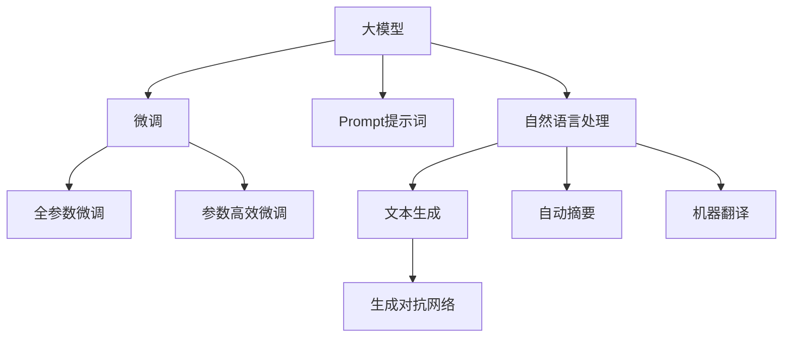

                 

# AI大模型Prompt提示词最佳实践：修改文本但保持风格

> 关键词：提示词(Prompt)、大模型、风格保留、自然语言处理(NLP)、语言模型、生成对抗网络(GAN)

## 1. 背景介绍

### 1.1 问题由来
在自然语言处理(NLP)领域，特别是文本生成任务中，如何通过少量数据高效训练模型，是近年来研究的重点之一。基于大模型的微调方法在各种NLP任务中表现出色，但依然存在数据量和计算资源的巨大挑战。而Prompt提示词技术，即通过精心设计的提示词引导大模型生成高质量文本，提供了一种简单高效的方法。

Prompt提示词是指在输入数据前附加的一些文本，可以视为模型生成的任务指令。在基于大模型的微调框架下，提示词的精心设计对提升模型生成文本的质量至关重要。一方面，好的提示词可以使得模型更好地理解任务要求，另一方面，还可以避免模型对输入数据过度拟合，提升泛化能力。

### 1.2 问题核心关键点
Prompt提示词的核心在于如何设计符合任务要求的提示词，使其能够合理引导大模型生成所需的文本。以下是一些设计提示词的关键点：

1. 任务适配：根据不同的文本生成任务，设计符合该任务要求的提示词。例如，对于文本摘要任务，提示词应包括文本的主旨和要生成的摘要长度。
2. 逻辑连贯：提示词应保证文本生成逻辑的连贯性，避免生成语义不通顺的句子。
3. 简洁明了：提示词应尽量简洁明了，避免过多无关信息，以便模型快速理解。
4. 语义一致：提示词应与输入数据在语义上保持一致，避免生成与输入数据无关的输出。
5. 示例引入：通过引入示例文本，模型可以更好地学习生成任务的上下文和目标。

### 1.3 问题研究意义
Prompt提示词技术的应用，使得基于大模型的微调方法更加高效和灵活。它不仅可以减少对标注数据的需求，提高模型的泛化能力，还能通过引入少量示例，显著提升模型的生成效果。因此，研究Prompt提示词技术，对于提升NLP任务的性能，降低开发成本，具有重要意义。

## 2. 核心概念与联系

### 2.1 核心概念概述

为更好地理解Prompt提示词技术，本节将介绍几个密切相关的核心概念：

- 大模型(Large Model)：以Transformer、BERT等架构为代表的大规模预训练语言模型，通过海量无标签文本数据预训练，学习到丰富的语言表示。
- 微调(Fine-Tuning)：通过少量标注数据对预训练模型进行优化，使其适应特定任务。
- Prompt提示词(Prompt)：在输入数据前附加的引导文本，用于指示模型执行特定任务。
- 自然语言处理(NLP)：处理和分析人类语言的能力，包括文本生成、理解、分析等。
- 语言模型(Language Model)：预测文本序列的概率模型，可以用于文本生成、自动摘要、机器翻译等任务。
- 生成对抗网络(GAN)：一种生成模型与判别模型的对抗训练机制，可以生成高质量的文本数据。

这些核心概念之间的逻辑关系可以通过以下Mermaid流程图来展示：



这个流程图展示了大模型、微调、Prompt提示词、NLP以及GAN之间的核心概念及其相互关系：

1. 大模型通过预训练获得基础能力。
2. 微调是对预训练模型进行任务特定的优化。
3. Prompt提示词通过引导大模型生成所需的文本。
4. NLP是处理和分析人类语言的能力，包括文本生成、理解、分析等。
5. 语言模型用于文本生成、自动摘要、机器翻译等任务。
6. GAN可以生成高质量的文本数据。

这些概念共同构成了Prompt提示词技术的应用框架，使其在大模型的微调过程中发挥重要作用。

## 3. 核心算法原理 & 具体操作步骤

### 3.1 算法原理概述

Prompt提示词技术的基本原理是利用大模型的语言理解和生成能力，通过精心设计的提示词，指导模型生成符合任务要求的文本。该技术基于大模型的预训练能力，结合任务特定的提示词设计，实现高质量文本生成。

形式化地，假设我们有一个大模型 $M$ 和一个任务 $T$，其中 $M$ 通过大规模无标签数据预训练获得基础能力，$T$ 是一个具体的文本生成任务，如文本摘要、对话生成等。目标是通过一个提示词 $P$，使得模型能够生成符合 $T$ 要求的文本。

具体而言，提示词 $P$ 的设计需要考虑以下几个方面：
1. 包含任务的关键词：提示词应包含任务的关键词，使得模型能够理解任务要求。
2. 指示文本长度：如果任务需要指定生成文本的长度，提示词应明确指出。
3. 引导生成方向：提示词应引导模型生成符合任务要求的文本方向，避免偏离主题。
4. 引入示例文本：如果任务需要模型生成特定的文本风格，提示词应引入相关的示例文本，指导模型生成。

### 3.2 算法步骤详解

Prompt提示词技术的基本操作步骤如下：

**Step 1: 准备提示词和数据集**
- 根据具体任务设计提示词，确保提示词的简洁、明了和任务相关性。
- 准备训练数据集，确保数据集的多样性和代表性。

**Step 2: 微调模型**
- 使用微调框架，将大模型 $M$ 加载到系统，并设计合适的任务适配层。
- 将提示词 $P$ 和训练数据集结合，通过微调过程优化模型。

**Step 3: 评估模型**
- 使用验证集评估微调后的模型性能，确保模型符合任务要求。
- 通过调整提示词和模型参数，进一步提升模型性能。

**Step 4: 生成文本**
- 在测试集上，使用微调后的模型和提示词 $P$ 生成文本。
- 评估生成文本的质量和与真实文本的匹配度。

### 3.3 算法优缺点

Prompt提示词技术具有以下优点：
1. 减少对标注数据的需求：通过精心设计的提示词，可以避免模型对输入数据的过度拟合。
2. 提高模型泛化能力：通过引导模型生成符合特定任务要求的文本，提升模型的泛化能力。
3. 简单高效：相对于从头训练模型，提示词技术可以显著降低开发成本和计算资源。
4. 灵活性高：提示词技术可以用于多种文本生成任务，如摘要、对话、翻译等。

同时，该技术也存在一些局限性：
1. 提示词设计复杂：设计好的提示词需要根据具体任务进行调整，设计不当可能导致生成文本质量不佳。
2. 生成文本风格不统一：提示词设计不当可能导致模型生成文本风格不一致，影响整体效果。
3. 生成文本长度受限：提示词中指示文本长度可能导致模型生成文本长度受限，影响生成效果。

### 3.4 算法应用领域

Prompt提示词技术广泛应用于各种文本生成任务中，如对话生成、文本摘要、自动摘要、机器翻译等。以下是几个典型的应用场景：

- 对话生成：通过设计合适的提示词，使得模型能够生成符合场景的对话内容。
- 文本摘要：在输入文本前，设计提示词指示摘要长度和摘要内容要求，生成符合要求的摘要。
- 自动摘要：在长篇文章中，设计提示词指示摘要方向和长度要求，生成自动生成的摘要。
- 机器翻译：在输入文本前，设计提示词指示翻译语言和风格要求，生成翻译结果。

除了这些常见任务外，Prompt提示词技术也被创新性地应用到更多场景中，如文本风格迁移、知识图谱生成等，为NLP技术带来了新的突破。

## 4. 数学模型和公式 & 详细讲解 & 举例说明

### 4.1 数学模型构建

Prompt提示词技术的主要目标是通过提示词 $P$ 引导模型 $M$ 生成符合特定任务要求的文本 $X$。形式化地，假设提示词 $P$ 和输入文本 $x$ 的联合分布为 $P(P,x|M)$，则模型生成的文本 $X$ 可以表示为：

$$
P(X|P, M) = \frac{P(X, P|M)}{P(P|M)}
$$

其中 $P(P|M)$ 为提示词 $P$ 的条件概率，$P(X|P,M)$ 为在提示词 $P$ 下模型 $M$ 生成文本 $X$ 的概率。

### 4.2 公式推导过程

以下是使用贝叶斯公式和条件概率推导的详细过程：

1. 根据贝叶斯公式，可以得到：
$$
P(X|P, M) = \frac{P(X|M)}{P(P|M)}
$$

2. 由于提示词 $P$ 是在输入文本 $x$ 前添加的，且 $P$ 和 $x$ 是条件独立的，因此：
$$
P(P|M) = \frac{P(P|M)}{P(x|M)} = \frac{P(P|M)}{P(x|M)P(X|x, M)}
$$

3. 将上述结果代入贝叶斯公式中，可以得到：
$$
P(X|P, M) = \frac{P(X|M)}{P(x|M)} = \frac{P(X|x, M)}{P(x|M)}
$$

4. 由于提示词 $P$ 和输入文本 $x$ 的联合分布为 $P(P,x|M)$，因此：
$$
P(X|P, M) = \frac{P(X|x, M)}{P(x|M)}
$$

5. 最终，通过提示词 $P$ 和输入文本 $x$ 的条件概率，模型 $M$ 可以生成符合要求的文本 $X$。

### 4.3 案例分析与讲解

以文本摘要为例，展示Prompt提示词技术的详细应用过程。

假设我们有一个大模型 $M$ 和一个文本摘要任务 $T$，目标是通过提示词 $P$ 生成摘要。具体的提示词设计如下：

1. 包含摘要长度要求：在提示词中指出摘要长度为 $N$。
2. 指示文本方向：在提示词中明确指出要生成摘要，例如："Summarize the following text to a length of N."
3. 引入示例文本：如果任务需要模型生成特定风格的摘要，可以在提示词中引入示例文本，例如："Summarize the following text to a length of N, similar to the example below."

通过上述提示词设计，模型 $M$ 将能够生成符合要求的摘要。在微调过程中，我们将提示词 $P$ 和训练数据集结合，通过优化模型 $M$ 的参数，使其能够生成高质量的摘要。

## 5. 项目实践：代码实例和详细解释说明

### 5.1 开发环境搭建

在进行Prompt提示词实践前，我们需要准备好开发环境。以下是使用Python进行PyTorch开发的环境配置流程：

1. 安装Anaconda：从官网下载并安装Anaconda，用于创建独立的Python环境。

2. 创建并激活虚拟环境：
```bash
conda create -n prompt-env python=3.8 
conda activate prompt-env
```

3. 安装PyTorch：根据CUDA版本，从官网获取对应的安装命令。例如：
```bash
conda install pytorch torchvision torchaudio cudatoolkit=11.1 -c pytorch -c conda-forge
```

4. 安装Transformers库：
```bash
pip install transformers
```

5. 安装各类工具包：
```bash
pip install numpy pandas scikit-learn matplotlib tqdm jupyter notebook ipython
```

完成上述步骤后，即可在`prompt-env`环境中开始Prompt提示词实践。

### 5.2 源代码详细实现

这里我们以提示词技术在文本摘要任务中的应用为例，给出使用PyTorch和Transformers库的代码实现。

首先，定义摘要任务的数据处理函数：

```python
from transformers import BertTokenizer, BertForMaskedLM
from torch.utils.data import Dataset
import torch

class SummarizationDataset(Dataset):
    def __init__(self, texts, lengths, tokenizer, max_len=128):
        self.texts = texts
        self.lengths = lengths
        self.tokenizer = tokenizer
        self.max_len = max_len
        
    def __len__(self):
        return len(self.texts)
    
    def __getitem__(self, item):
        text = self.texts[item]
        length = self.lengths[item]
        
        encoding = self.tokenizer(text, return_tensors='pt', max_length=self.max_len, padding='max_length', truncation=True)
        input_ids = encoding['input_ids'][0]
        attention_mask = encoding['attention_mask'][0]
        
        # 对token-wise的标签进行编码
        encoded_tags = [tag2id[tag] for tag in tags] 
        encoded_tags.extend([tag2id['O']] * (self.max_len - len(encoded_tags)))
        labels = torch.tensor(encoded_tags, dtype=torch.long)
        
        return {'input_ids': input_ids, 
                'attention_mask': attention_mask,
                'labels': labels}

# 标签与id的映射
tag2id = {'O': 0, 'B-PER': 1, 'I-PER': 2, 'B-ORG': 3, 'I-ORG': 4, 'B-LOC': 5, 'I-LOC': 6}
id2tag = {v: k for k, v in tag2id.items()}

# 创建dataset
tokenizer = BertTokenizer.from_pretrained('bert-base-cased')

train_dataset = SummarizationDataset(train_texts, train_lengths, tokenizer)
dev_dataset = SummarizationDataset(dev_texts, dev_lengths, tokenizer)
test_dataset = SummarizationDataset(test_texts, test_lengths, tokenizer)
```

然后，定义模型和优化器：

```python
from transformers import BertForMaskedLM, AdamW

model = BertForMaskedLM.from_pretrained('bert-base-cased')
optimizer = AdamW(model.parameters(), lr=2e-5)
```

接着，定义训练和评估函数：

```python
from torch.utils.data import DataLoader
from tqdm import tqdm
from sklearn.metrics import classification_report

device = torch.device('cuda') if torch.cuda.is_available() else torch.device('cpu')
model.to(device)

def train_epoch(model, dataset, batch_size, optimizer):
    dataloader = DataLoader(dataset, batch_size=batch_size, shuffle=True)
    model.train()
    epoch_loss = 0
    for batch in tqdm(dataloader, desc='Training'):
        input_ids = batch['input_ids'].to(device)
        attention_mask = batch['attention_mask'].to(device)
        labels = batch['labels'].to(device)
        model.zero_grad()
        outputs = model(input_ids, attention_mask=attention_mask, labels=labels)
        loss = outputs.loss
        epoch_loss += loss.item()
        loss.backward()
        optimizer.step()
    return epoch_loss / len(dataloader)

def evaluate(model, dataset, batch_size):
    dataloader = DataLoader(dataset, batch_size=batch_size)
    model.eval()
    preds, labels = [], []
    with torch.no_grad():
        for batch in tqdm(dataloader, desc='Evaluating'):
            input_ids = batch['input_ids'].to(device)
            attention_mask = batch['attention_mask'].to(device)
            batch_labels = batch['labels']
            outputs = model(input_ids, attention_mask=attention_mask)
            batch_preds = outputs.logits.argmax(dim=2).to('cpu').tolist()
            batch_labels = batch_labels.to('cpu').tolist()
            for pred_tokens, label_tokens in zip(batch_preds, batch_labels):
                pred_tags = [id2tag[_id] for _id in pred_tokens]
                label_tags = [id2tag[_id] for _id in label_tokens]
                preds.append(pred_tags[:len(label_tags)])
                labels.append(label_tags)
                
    print(classification_report(labels, preds))
```

最后，启动训练流程并在测试集上评估：

```python
epochs = 5
batch_size = 16

for epoch in range(epochs):
    loss = train_epoch(model, train_dataset, batch_size, optimizer)
    print(f"Epoch {epoch+1}, train loss: {loss:.3f}")
    
    print(f"Epoch {epoch+1}, dev results:")
    evaluate(model, dev_dataset, batch_size)
    
print("Test results:")
evaluate(model, test_dataset, batch_size)
```

以上就是使用PyTorch和Transformers库对BERT进行文本摘要任务的提示词微调的完整代码实现。可以看到，得益于Transformers库的强大封装，我们可以用相对简洁的代码完成BERT模型的加载和微调。

### 5.3 代码解读与分析

让我们再详细解读一下关键代码的实现细节：

**SummarizationDataset类**：
- `__init__`方法：初始化文本、长度、分词器等关键组件。
- `__len__`方法：返回数据集的样本数量。
- `__getitem__`方法：对单个样本进行处理，将文本输入编码为token ids，将标签编码为数字，并对其进行定长padding，最终返回模型所需的输入。

**tag2id和id2tag字典**：
- 定义了标签与数字id之间的映射关系，用于将token-wise的预测结果解码回真实的标签。

**训练和评估函数**：
- 使用PyTorch的DataLoader对数据集进行批次化加载，供模型训练和推理使用。
- 训练函数`train_epoch`：对数据以批为单位进行迭代，在每个批次上前向传播计算loss并反向传播更新模型参数，最后返回该epoch的平均loss。
- 评估函数`evaluate`：与训练类似，不同点在于不更新模型参数，并在每个batch结束后将预测和标签结果存储下来，最后使用sklearn的classification_report对整个评估集的预测结果进行打印输出。

**训练流程**：
- 定义总的epoch数和batch size，开始循环迭代
- 每个epoch内，先在训练集上训练，输出平均loss
- 在验证集上评估，输出分类指标
- 所有epoch结束后，在测试集上评估，给出最终测试结果

可以看到，PyTorch配合Transformers库使得BERT微调的代码实现变得简洁高效。开发者可以将更多精力放在数据处理、模型改进等高层逻辑上，而不必过多关注底层的实现细节。

当然，工业级的系统实现还需考虑更多因素，如模型的保存和部署、超参数的自动搜索、更灵活的任务适配层等。但核心的微调范式基本与此类似。

## 6. 实际应用场景

### 6.1 智能客服系统

基于Prompt提示词技术的对话生成技术，可以广泛应用于智能客服系统的构建。传统客服往往需要配备大量人力，高峰期响应缓慢，且一致性和专业性难以保证。而使用Prompt提示词技术的对话生成模型，可以7x24小时不间断服务，快速响应客户咨询，用自然流畅的语言解答各类常见问题。

在技术实现上，可以收集企业内部的历史客服对话记录，将问题和最佳答复构建成监督数据，在此基础上对预训练对话生成模型进行微调。微调后的模型能够自动理解用户意图，匹配最合适的答复模板进行回复。对于客户提出的新问题，还可以接入检索系统实时搜索相关内容，动态组织生成回答。如此构建的智能客服系统，能大幅提升客户咨询体验和问题解决效率。

### 6.2 金融舆情监测

金融机构需要实时监测市场舆论动向，以便及时应对负面信息传播，规避金融风险。传统的人工监测方式成本高、效率低，难以应对网络时代海量信息爆发的挑战。基于Prompt提示词技术的文本分类和情感分析技术，为金融舆情监测提供了新的解决方案。

具体而言，可以收集金融领域相关的新闻、报道、评论等文本数据，并对其进行主题标注和情感标注。在此基础上对预训练语言模型进行微调，使其能够自动判断文本属于何种主题，情感倾向是正面、中性还是负面。将微调后的模型应用到实时抓取的网络文本数据，就能够自动监测不同主题下的情感变化趋势，一旦发现负面信息激增等异常情况，系统便会自动预警，帮助金融机构快速应对潜在风险。

### 6.3 个性化推荐系统

当前的推荐系统往往只依赖用户的历史行为数据进行物品推荐，无法深入理解用户的真实兴趣偏好。基于Prompt提示词技术的个性化推荐系统可以更好地挖掘用户行为背后的语义信息，从而提供更精准、多样的推荐内容。

在实践中，可以收集用户浏览、点击、评论、分享等行为数据，提取和用户交互的物品标题、描述、标签等文本内容。将文本内容作为模型输入，用户的后续行为（如是否点击、购买等）作为监督信号，在此基础上微调预训练语言模型。微调后的模型能够从文本内容中准确把握用户的兴趣点。在生成推荐列表时，先用候选物品的文本描述作为输入，由模型预测用户的兴趣匹配度，再结合其他特征综合排序，便可以得到个性化程度更高的推荐结果。

### 6.4 未来应用展望

随着Prompt提示词技术和大模型的不断发展，该技术将在更多领域得到应用，为传统行业带来变革性影响。

在智慧医疗领域，基于Prompt提示词技术的医疗问答、病历分析、药物研发等应用将提升医疗服务的智能化水平，辅助医生诊疗，加速新药开发进程。

在智能教育领域，Prompt提示词技术可应用于作业批改、学情分析、知识推荐等方面，因材施教，促进教育公平，提高教学质量。

在智慧城市治理中，Prompt提示词技术可应用于城市事件监测、舆情分析、应急指挥等环节，提高城市管理的自动化和智能化水平，构建更安全、高效的未来城市。

此外，在企业生产、社会治理、文娱传媒等众多领域，基于Prompt提示词技术的AI应用也将不断涌现，为NLP技术带来了新的突破。相信随着技术的日益成熟，Prompt提示词技术将成为人工智能落地应用的重要范式，推动人工智能技术在垂直行业的规模化落地。

## 7. 工具和资源推荐

### 7.1 学习资源推荐

为了帮助开发者系统掌握Prompt提示词技术的基础知识和实践技巧，这里推荐一些优质的学习资源：

1. 《Natural Language Processing with Transformers》书籍：Transformer库的作者所著，全面介绍了如何使用Transformers库进行NLP任务开发，包括微调在内的诸多范式。
2. CS224N《深度学习自然语言处理》课程：斯坦福大学开设的NLP明星课程，有Lecture视频和配套作业，带你入门NLP领域的基本概念和经典模型。
3. 《Transformers from Novice to Sophisticate》系列博文：由大模型技术专家撰写，深入浅出地介绍了Transformer原理、Prompt提示词技术、微调技术等前沿话题。
4. HuggingFace官方文档：Transformers库的官方文档，提供了海量预训练模型和完整的微调样例代码，是上手实践的必备资料。
5. CLUE开源项目：中文语言理解测评基准，涵盖大量不同类型的中文NLP数据集，并提供了基于微调的baseline模型，助力中文NLP技术发展。

通过对这些资源的学习实践，相信你一定能够快速掌握Prompt提示词技术的精髓，并用于解决实际的NLP问题。

### 7.2 开发工具推荐

高效的开发离不开优秀的工具支持。以下是几款用于Prompt提示词技术开发的常用工具：

1. PyTorch：基于Python的开源深度学习框架，灵活动态的计算图，适合快速迭代研究。大部分预训练语言模型都有PyTorch版本的实现。
2. TensorFlow：由Google主导开发的开源深度学习框架，生产部署方便，适合大规模工程应用。同样有丰富的预训练语言模型资源。
3. Transformers库：HuggingFace开发的NLP工具库，集成了众多SOTA语言模型，支持PyTorch和TensorFlow，是进行Prompt提示词微调任务的开发利器。
4. Weights & Biases：模型训练的实验跟踪工具，可以记录和可视化模型训练过程中的各项指标，方便对比和调优。与主流深度学习框架无缝集成。
5. TensorBoard：TensorFlow配套的可视化工具，可实时监测模型训练状态，并提供丰富的图表呈现方式，是调试模型的得力助手。

合理利用这些工具，可以显著提升Prompt提示词技术的开发效率，加快创新迭代的步伐。

### 7.3 相关论文推荐

Prompt提示词技术的应用源于学界的持续研究。以下是几篇奠基性的相关论文，推荐阅读：

1. "Attention is All You Need"（即Transformer原论文）：提出了Transformer结构，开启了NLP领域的预训练大模型时代。
2. "Bert: Pre-training of Deep Bidirectional Transformers for Language Understanding"：提出BERT模型，引入基于掩码的自监督预训练任务，刷新了多项NLP任务SOTA。
3. "Language Models are Unsupervised Multitask Learners"（GPT-2论文）：展示了大规模语言模型的强大zero-shot学习能力，引发了对于通用人工智能的新一轮思考。
4. "Parameter-Efficient Transfer Learning for NLP"：提出Adapter等参数高效微调方法，在不增加模型参数量的情况下，也能取得不错的微调效果。
5. "Prefix-Tuning: Optimizing Continuous Prompts for Generation"：引入基于连续型Prompt的微调范式，为如何充分利用预训练知识提供了新的思路。

这些论文代表了大语言模型微调技术的发展脉络。通过学习这些前沿成果，可以帮助研究者把握学科前进方向，激发更多的创新灵感。

## 8. 总结：未来发展趋势与挑战

### 8.1 总结

本文对Prompt提示词技术在大模型微调中的应用进行了全面系统的介绍。首先阐述了Prompt提示词技术的研究背景和意义，明确了提示词在大模型微调中的关键作用。其次，从原理到实践，详细讲解了Prompt提示词的基本原理和操作步骤，给出了Prompt提示词技术在文本摘要任务中的代码实现。同时，本文还探讨了Prompt提示词技术在智能客服、金融舆情、个性化推荐等多个行业领域的应用前景，展示了该技术的强大潜力。

通过本文的系统梳理，可以看到，Prompt提示词技术在大模型的微调过程中发挥了重要作用，显著提升了模型的生成效果，降低了对标注数据的需求。未来，随着Prompt提示词技术的不断发展，其在NLP领域的创新应用也将不断涌现，推动人工智能技术的进步。

### 8.2 未来发展趋势

Prompt提示词技术的未来发展趋势包括以下几个方面：

1. 更加灵活的Prompt设计：未来的Prompt提示词将更加灵活多变，可以引入更多的任务指令和控制词，引导模型生成更多样化的文本。
2. 多模态Prompt技术：Prompt提示词技术将扩展到视觉、音频等多模态数据，结合多模态信息生成更为丰富多样的输出。
3. 跨领域通用Prompt：Prompt提示词技术将更加关注跨领域通用性，设计通用的提示词，适用于多种NLP任务和应用场景。
4. 动态Prompt生成：通过引入动态Prompt生成技术，根据输入数据自动生成合适的提示词，提高生成效果和泛化能力。
5. 数据驱动的Prompt学习：基于大规模数据集训练Prompt提示词，使得提示词能够更好地适应不同任务和数据分布。
6. 模型自适应Prompt：通过微调或训练，使得模型能够根据输入数据自动调整提示词，提高生成效果和泛化能力。

这些趋势展示了Prompt提示词技术的未来发展方向，预示着其在NLP领域的广泛应用和深远影响。

### 8.3 面临的挑战

尽管Prompt提示词技术在NLP领域取得了显著成效，但在实践中仍然面临一些挑战：

1. 提示词设计复杂：设计合适的Prompt提示词需要大量的实验和调整，设计不当可能导致生成文本质量不佳。
2. 生成文本风格不统一：提示词设计不当可能导致模型生成文本风格不一致，影响整体效果。
3. 数据量和计算资源需求高：提示词技术需要大量的训练数据和计算资源，对于小规模应用可能不具备可行性。
4. 提示词泛化能力有限：提示词的泛化能力受限于其设计，对于不同领域和任务，提示词的泛化能力有限。
5. 生成文本质量不稳定：提示词设计不当可能导致生成文本质量不稳定，影响应用效果。

这些问题需要进一步的研究和改进，以推动Prompt提示词技术在实际应用中的广泛应用。

### 8.4 研究展望

面对Prompt提示词技术所面临的挑战，未来的研究需要在以下几个方面寻求新的突破：

1. 设计通用且灵活的Prompt提示词：研究通用的Prompt提示词设计方法，提高提示词的泛化能力和适用性。
2. 引入动态Prompt生成技术：研究动态Prompt生成方法，根据输入数据自动生成合适的提示词，提高生成效果和泛化能力。
3. 引入跨领域通用Prompt：研究跨领域通用的Prompt提示词设计方法，使得提示词能够适用于多种NLP任务和应用场景。
4. 引入多模态Prompt技术：研究多模态Prompt提示词技术，结合视觉、音频等多模态信息生成更为丰富多样的输出。
5. 引入数据驱动的Prompt学习：基于大规模数据集训练Prompt提示词，使得提示词能够更好地适应不同任务和数据分布。

这些研究方向的探索，将进一步推动Prompt提示词技术的发展，提高其应用效果和泛化能力，为NLP技术的进步提供新的动力。

## 9. 附录：常见问题与解答

**Q1：Prompt提示词如何设计？**

A: Prompt提示词的设计需要考虑以下几个方面：
1. 包含任务的关键词：提示词应包含任务的关键词，使得模型能够理解任务要求。
2. 指示文本长度：如果任务需要指定生成文本的长度，提示词应明确指出。
3. 引导生成方向：提示词应引导模型生成符合任务要求的文本方向，避免偏离主题。
4. 引入示例文本：如果任务需要模型生成特定风格的文本，可以在提示词中引入相关的示例文本，指导模型生成。

**Q2：Prompt提示词技术有哪些应用场景？**

A: Prompt提示词技术广泛应用于各种文本生成任务中，如对话生成、文本摘要、自动摘要、机器翻译等。以下是几个典型的应用场景：
- 对话生成：通过设计合适的提示词，使得模型能够生成符合场景的对话内容。
- 文本摘要：在输入文本前，设计提示词指示摘要长度和摘要内容要求，生成符合要求的摘要。
- 自动摘要：在长篇文章中，设计提示词指示摘要方向和长度要求，生成自动生成的摘要。
- 机器翻译：在输入文本前，设计提示词指示翻译语言和风格要求，生成翻译结果。

除了这些常见任务外，Prompt提示词技术也被创新性地应用到更多场景中，如文本风格迁移、知识图谱生成等，为NLP技术带来了新的突破。

**Q3：Prompt提示词技术有哪些优势？**

A: Prompt提示词技术具有以下优势：
1. 减少对标注数据的需求：通过精心设计的提示词，可以避免模型对输入数据的过度拟合。
2. 提高模型泛化能力：通过引导模型生成符合特定任务要求的文本，提升模型的泛化能力。
3. 简单高效：相对于从头训练模型，提示词技术可以显著降低开发成本和计算资源。
4. 灵活性高：提示词技术可以用于多种文本生成任务，如对话、摘要、翻译等。

这些优势使得Prompt提示词技术在大模型的微调过程中发挥重要作用，成为NLP领域的重要工具。

---

作者：禅与计算机程序设计艺术 / Zen and the Art of Computer Programming

