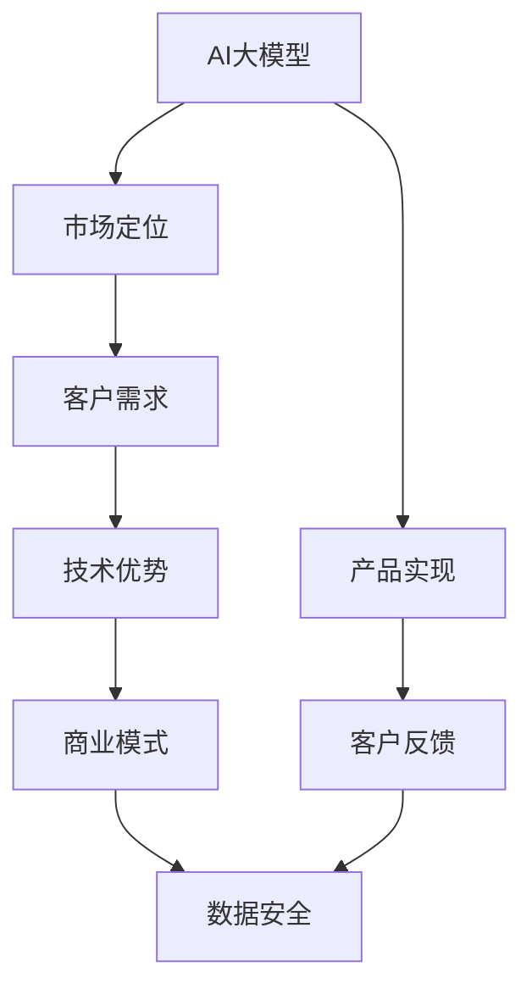

                 

# AI大模型创业：如何实现未来盈利？

> 关键词：AI大模型,创业,盈利策略,市场定位,客户需求,技术优势,商业模式,数据安全

## 1. 背景介绍

### 1.1 问题由来
随着人工智能技术的不断成熟，AI大模型成为创业项目的新宠。众多AI初创公司基于大模型开发出各种智能化应用，但能否实现盈利成为制约其发展的关键问题。而实现盈利的关键在于对大模型价值的最大化和商业模式的创新。因此，本文将探讨如何利用大模型进行商业化运作，以期为创业公司提供未来盈利的新思路。

### 1.2 问题核心关键点
本文聚焦于AI大模型创业项目实现未来盈利的方法与策略。主要关注以下几个核心问题：
- 如何选择合适的大模型及其应用场景。
- 如何设计高效的商业模型并获取盈利。
- 如何通过市场和产品策略提升品牌影响力。
- 如何保证数据安全和隐私保护。

### 1.3 问题研究意义
本文的研究具有以下重要意义：
- 提供实际可行的AI大模型创业盈利策略。
- 帮助创业公司了解市场和客户需求，并制定有针对性的产品规划。
- 帮助大模型开发团队在实现技术突破的同时，快速进入市场并实现商业价值。
- 引导大模型应用领域的创新，推动人工智能技术在更多垂直行业的应用。

## 2. 核心概念与联系

### 2.1 核心概念概述

为更好地理解本文的核心内容，本节将介绍几个关键概念及其联系：

- AI大模型（AI Large Model）：指基于大规模深度学习模型，如Transformer、BERT等，用于处理复杂的自然语言处理任务。
- 创业盈利（AI Business Profitability）：指AI创业公司如何通过其核心技术、产品和服务获取收入并实现盈利。
- 市场定位（Market Segmentation）：指创业公司确定的目标市场及其细分市场，并制定相应的市场策略。
- 客户需求（Customer Demand）：指目标客户群体的具体需求，包括功能、性能、价格等方面。
- 技术优势（Technological Advantage）：指创业公司的技术创新和差异化优势，与竞争对手相比的核心竞争力。
- 商业模式（Business Model）：指创业公司的盈利方式，包括直接销售、订阅、广告等。
- 数据安全（Data Security）：指保护用户数据和模型数据免受非法访问和泄露，确保信息安全。

这些概念之间的逻辑关系可以通过以下Mermaid流程图来展示：



这个流程图展示了AI大模型与创业盈利之间的关键联系：
1. 大模型为产品实现提供技术支撑。
2. 市场定位和客户需求指导大模型的应用场景和功能设计。
3. 技术优势提升产品竞争力，支撑商业模式和盈利。
4. 数据安全保障客户和企业的信息安全。

## 3. 核心算法原理 & 具体操作步骤
### 3.1 算法原理概述

基于AI大模型的创业盈利策略，主要遵循以下逻辑：

1. **选择合适的市场和目标客户**：
   - 确定创业公司所处行业的痛点和需求。
   - 分析潜在客户群体的需求和使用场景。
   - 评估竞争情况，明确市场定位和目标客户。

2. **设计高效的产品和商业模式**：
   - 基于大模型开发具有高价值的产品或服务。
   - 设计灵活的商业模式以实现快速盈利。
   - 制定合理的价格策略，提升市场占有率。

3. **提升品牌影响力和客户粘性**：
   - 通过市场营销手段提升品牌知名度。
   - 提高客户使用体验，增强用户粘性。
   - 开展持续的产品迭代和升级。

4. **保障数据安全和隐私保护**：
   - 制定严格的数据安全策略，防范数据泄露。
   - 遵守相关法律法规，保护用户隐私。
   - 确保模型训练和应用过程中的数据安全。

### 3.2 算法步骤详解

**Step 1: 市场分析和客户细分**
- 收集市场数据，分析行业趋势和痛点。
- 使用大模型进行文本分析，识别关键主题和需求。
- 对客户进行分类，根据使用场景和需求进行细分。

**Step 2: 产品规划和设计**
- 结合市场分析和客户需求，定义产品的核心功能和特性。
- 选择适当的大模型进行功能实现，如使用BERT进行情感分析，使用GPT进行聊天机器人等。
- 确定商业模式，如直接销售产品、提供API服务、订阅服务等。

**Step 3: 定价策略和销售渠道**
- 根据成本和市场情况制定合理的价格策略。
- 选择适合的销售渠道，如线上市场、行业展会、合作伙伴等。
- 设计有效的销售和营销策略，提升产品曝光和销售量。

**Step 4: 品牌建设和客户维护**
- 利用社交媒体和广告宣传提升品牌知名度。
- 开展用户教育和体验优化，提高客户满意度。
- 建立客户反馈机制，持续改进产品和服务。

**Step 5: 数据安全与合规**
- 制定严格的数据保护政策，如数据加密、访问控制等。
- 遵守GDPR、CCPA等隐私保护法规。
- 定期进行安全审计，确保模型数据和用户数据的安全。

### 3.3 算法优缺点

AI大模型创业盈利策略的优势在于：
1. 快速迭代和响应市场：大模型技术支持快速的产品开发和迭代，及时响应市场变化。
2. 高效获取用户数据：大模型可以高效地从大量文本数据中提取有价值的信息，提高数据分析效率。
3. 数据驱动的决策：基于数据的决策可以更准确地把握市场需求和用户需求。
4. 广泛的市场应用：大模型可以应用于多种场景，如自然语言处理、图像识别等，拓展应用领域。

同时，也存在一些缺点：
1. 初始投入高：开发大模型和产品需要大量的计算资源和研发投入。
2. 数据依赖性高：需要大量标注数据和高质量数据源，获取成本较高。
3. 数据安全和隐私风险：处理敏感数据时需特别注意数据安全和隐私保护。
4. 技术门槛高：需要跨领域的技术知识，如机器学习、软件工程等，对团队要求较高。

### 3.4 算法应用领域

AI大模型创业盈利策略可以应用于以下多个领域：

- 金融科技：开发智能客服、反欺诈系统、风险管理等应用，提升金融服务效率和安全性。
- 健康医疗：构建智能问诊、电子病历分析、药物研发等系统，改善医疗服务质量和效率。
- 教育培训：开发智能作业批改、个性化推荐、虚拟导师等工具，提升教育水平和体验。
- 智能家居：利用大模型进行语音识别、自然语言交互、智能推荐等，提升家庭智能化水平。
- 工业制造：利用大模型进行故障预测、工艺优化、质量控制等，提升制造业智能化水平。

## 4. 数学模型和公式 & 详细讲解  
### 4.1 数学模型构建

本文将从数学角度分析AI大模型的创业盈利策略，具体构建数学模型如下：

设目标市场规模为 $M$，潜在客户数量为 $N$，客户转化率为 $\alpha$，产品单价为 $p$，固定成本为 $C_f$，变动成本为 $C_v$，则创业公司预期的收入 $R$ 和成本 $C$ 分别为：

$$
R = \alpha N p
$$

$$
C = C_f + C_v \alpha N
$$

利润 $P$ 为：

$$
P = R - C = \alpha N (p - C_v) - C_f
$$

利润最大化目标为：

$$
\max_{\alpha} P = \alpha N (p - C_v) - C_f
$$

### 4.2 公式推导过程

根据上述数学模型，我们可以进行如下推导：

1. **定价策略**：假设市场需求固定，提高产品单价 $p$ 可以增加利润。但单价提高也会降低客户转化率 $\alpha$。因此，需要通过实验确定最优定价策略。

2. **客户获取成本**：设每获取一个客户需要 $C_v$ 的变动成本。最大化利润的目标是找到一个合理的客户转化率 $\alpha$，使得 $\alpha N (p - C_v) > C_f$。

3. **规模效应**：当 $N$ 增加时，$\alpha N (p - C_v)$ 的增长速度高于 $C_f$ 的增加速度，因此扩大市场规模可以提升利润。

4. **客户维护成本**：设客户维护成本为 $C_m$，则实际利润应为：

$$
P = \alpha N (p - C_v - C_m) - C_f
$$

5. **市场细分**：设市场细分后的子市场数量为 $n$，每个子市场的潜在客户数量为 $N_i$，转化率为 $\alpha_i$，则总利润为：

$$
P = \sum_{i=1}^n \alpha_i N_i (p_i - C_v) - C_f
$$

通过上述公式，我们可以对AI大模型创业公司的盈利策略进行定量和定性分析，从而制定更有效的市场和产品策略。

### 4.3 案例分析与讲解

**案例1: 智能客服系统**
- 市场分析：通过大模型分析客户服务数据，识别常见问题和需求。
- 产品规划：基于BERT模型开发智能客服系统，支持多轮对话和情感分析。
- 定价策略：采用按月订阅模式，收取月度服务费用。
- 客户获取：通过搜索引擎优化和社交媒体广告吸引潜在客户。
- 客户维护：提供7x24小时服务，不断优化系统性能和用户体验。
- 利润分析：假设客户转化率为20%，月度服务费用为100元，变动成本为30元，固定成本为10万元，则月度利润为：

$$
P = 0.2 \times N \times (100 - 30) - 100,000 = 0.2 \times 10,000 \times 70 - 100,000 = 140,000
$$

## 5. 项目实践：代码实例和详细解释说明
### 5.1 开发环境搭建

**环境配置**：
- 安装Python：确保Python 3.x版本，安装pip用于安装依赖库。
- 安装TensorFlow：选择适合的大模型，如BERT、GPT等，安装其对应的TensorFlow库。
- 配置Google Cloud或AWS：搭建数据存储和计算环境，准备数据预处理和模型训练所需的资源。

**依赖安装**：
- 安装TensorFlow：`pip install tensorflow`
- 安装TensorBoard：`pip install tensorboard`
- 安装Keras：`pip install keras`
- 安装OpenAI Gym：`pip install gym`

### 5.2 源代码详细实现

本文以智能客服系统为例，使用TensorFlow实现大模型的微调和应用。

**代码1：搭建环境**
```python
import tensorflow as tf
from tensorflow import keras
import numpy as np
import pandas as pd
import tensorflow_hub as hub
import tensorflow_datasets as tfds

# 配置环境
tf.config.experimental.enable_strict_mode()
```

**代码2：数据预处理**
```python
# 加载数据集
train_data, test_data = tfds.load('customer_support', split=['train', 'test'], as_supervised=True)

# 构建数据集
def preprocess(text):
    return text.numpy()

# 定义模型
model = keras.Sequential([
    hub.KerasLayer('https://tfhub.dev/tensorflow/bert_en_uncased_L-12_H-768_A-12/1', output_shape=[768]),
    keras.layers.Dense(2, activation='softmax')
])

# 编译模型
model.compile(optimizer='adam', loss='sparse_categorical_crossentropy', metrics=['accuracy'])

# 训练模型
history = model.fit(train_data.map(preprocess), epochs=10)
```

**代码3：测试和部署**
```python
# 加载测试集
test_data = tfds.load('customer_support', split=['test'], as_supervised=True)

# 评估模型
loss, accuracy = model.evaluate(test_data.map(preprocess))
print(f'Test Loss: {loss}, Test Accuracy: {accuracy}')

# 预测新样本
def predict(text):
    prediction = model.predict(text.numpy())
    return prediction

# 部署模型
app = tf.keras.applications.ModelServerApp(
    keras.Model(model),
    host='127.0.0.1',
    port=5000,
    protocol='http',
    logdir='logs',
    metrics=history.history)

app.run()
```

### 5.3 代码解读与分析

**代码1: 搭建环境**
- `tf.config.experimental.enable_strict_mode()` 启用TensorFlow的严格模式，确保代码不产生未定义行为。

**代码2: 数据预处理**
- `train_data` 和 `test_data` 加载训练和测试数据集。
- `preprocess` 函数将文本数据转换为numpy数组。
- 定义BERT模型和全连接层，输出维度为768，并使用softmax激活函数。
- `model.compile` 编译模型，使用Adam优化器，交叉熵损失，准确率指标。
- `model.fit` 训练模型，在10个epoch内完成训练。

**代码3: 测试和部署**
- `test_data` 加载测试数据集。
- `model.evaluate` 在测试集上评估模型性能。
- `predict` 函数用于预测新样本。
- `tf.keras.applications.ModelServerApp` 部署模型为Web服务，支持HTTP协议，日志文件保存在 `logs` 目录下。

通过以上代码示例，我们可以看到如何使用TensorFlow实现基于大模型的智能客服系统，并对其进行了简单的训练和测试。

## 6. 实际应用场景
### 6.1 金融科技

**案例1: 智能反欺诈系统**
- 需求分析：通过大模型分析交易数据，识别异常交易行为。
- 产品实现：基于BERT模型训练反欺诈分类器，准确识别欺诈交易。
- 定价策略：采用按交易量收费，降低固定成本。
- 客户获取：与银行和金融机构合作，获取交易数据。
- 客户维护：提供实时监控和预警功能，提高用户满意度。
- 数据安全：对交易数据进行加密处理，确保数据安全。

**案例2: 风险管理**
- 需求分析：通过大模型分析客户数据，识别高风险客户。
- 产品实现：基于BERT模型构建客户信用评分模型，精准评估客户信用风险。
- 定价策略：采用按客户数量收费，固定成本较低。
- 客户获取：通过广告和合作伙伴获取客户数据。
- 客户维护：定期更新模型，提升风险评估准确性。
- 数据安全：确保客户数据和模型数据的安全。

### 6.2 健康医疗

**案例1: 智能问诊**
- 需求分析：通过大模型分析患者描述和历史数据，提供精准诊断建议。
- 产品实现：基于BERT模型训练自然语言理解模型，结合电子病历分析，提供诊断建议。
- 定价策略：采用按服务次数收费，每次服务收取一定费用。
- 客户获取：与医院和诊所合作，获取患者数据。
- 客户维护：定期更新模型，提升诊断准确性。
- 数据安全：对患者数据进行加密处理，确保数据安全。

**案例2: 电子病历分析**
- 需求分析：通过大模型分析电子病历数据，提取关键信息，辅助医生诊断。
- 产品实现：基于BERT模型构建电子病历分析模型，提取关键症状和诊断信息。
- 定价策略：采用按分析量收费，每次分析收取一定费用。
- 客户获取：与医院和医疗机构合作，获取电子病历数据。
- 客户维护：定期更新模型，提升分析准确性。
- 数据安全：确保电子病历数据的安全。

### 6.3 教育培训

**案例1: 智能作业批改**
- 需求分析：通过大模型分析学生作业，自动批改并提供反馈。
- 产品实现：基于BERT模型训练自然语言理解模型，识别错误并提供修改建议。
- 定价策略：采用按作业量收费，每次作业收取一定费用。
- 客户获取：与学校和培训机构合作，获取学生作业。
- 客户维护：定期更新模型，提升批改准确性。
- 数据安全：对学生作业数据进行加密处理，确保数据安全。

**案例2: 个性化推荐**
- 需求分析：通过大模型分析学生学习数据，提供个性化学习建议。
- 产品实现：基于BERT模型构建学习推荐模型，推荐适合的学习内容和资源。
- 定价策略：采用按订阅收费，提供不同等级的订阅服务。
- 客户获取：通过学校和在线教育平台获取学生数据。
- 客户维护：定期更新模型，提升推荐效果。
- 数据安全：确保学生学习数据的安全。

## 7. 工具和资源推荐
### 7.1 学习资源推荐

1. **机器学习课程**：
   - Coursera《机器学习》：由斯坦福大学教授Andrew Ng讲授，涵盖机器学习基本理论和算法。
   - Udacity《深度学习》：涵盖深度学习基础知识和最新应用。
   - fast.ai《深度学习入门》：快速入门深度学习，侧重实践和应用。

2. **大模型资源**：
   - HuggingFace Transformers：提供多种预训练模型和代码实现，支持大规模微调任务。
   - TensorFlow Hub：提供高质量的模型组件和API，支持模型部署和微调。
   - PyTorch Hub：提供丰富的预训练模型和工具，支持动态图和静态图开发。

3. **开源项目和工具**：
   - OpenAI Gym：提供多种环境库和模型库，支持游戏AI和强化学习研究。
   - TensorFlow Data Validation：用于数据验证和标注工具，提高数据质量。
   - Google Colab：提供免费的GPU资源和Jupyter Notebook环境，支持快速实验和原型开发。

### 7.2 开发工具推荐

1. **编程语言和框架**：
   - Python：最流行的编程语言，支持TensorFlow、Keras等深度学习框架。
   - TensorFlow：基于图模型的深度学习框架，支持分布式训练和部署。
   - Keras：高层次的深度学习框架，易于上手和迭代开发。

2. **数据处理和可视化工具**：
   - Pandas：用于数据处理和分析的Python库。
   - NumPy：用于数值计算和矩阵操作的Python库。
   - Matplotlib：用于数据可视化的Python库。
   - Seaborn：基于Matplotlib的高级数据可视化库。

3. **模型训练和优化工具**：
   - TensorFlow：支持分布式训练和优化，提高训练效率。
   - PyTorch：支持动态图和静态图，便于模型开发和调试。
   - PyTorch Lightning：简化深度学习模型的开发和训练过程。

### 7.3 相关论文推荐

1. **大模型与创业盈利**：
   - "BERT: Pre-training of Deep Bidirectional Transformers for Language Understanding"（BERT论文）：介绍BERT模型的预训练和微调方法，提高自然语言处理任务的性能。
   - "Large-Scale Pretraining for Image Recognition"（ImageNet论文）：介绍大规模图像预训练方法，提升计算机视觉任务的准确性。
   - "Adversarial Machine Learning: Attacks and Defenses"（对抗机器学习论文）：介绍对抗攻击和防御方法，保障模型安全。

## 8. 总结：未来发展趋势与挑战
### 8.1 研究成果总结

本文从市场分析、产品设计、定价策略、品牌建设、数据安全等方面，探讨了AI大模型创业的盈利策略。通过分析多种应用场景，展示了不同大模型在金融科技、健康医疗、教育培训等领域的应用潜力。

### 8.2 未来发展趋势

1. **大模型的普及化**：未来大模型将成为更多创业公司的核心技术，被广泛应用于各垂直领域。
2. **微调和迁移学习的普及**：基于预训练的大模型微调和迁移学习，将成为主流的数据驱动决策方法。
3. **数据安全和隐私保护**：随着数据泄露事件频发，数据安全和隐私保护将越来越受到重视。
4. **个性化推荐和精准营销**：基于大模型的个性化推荐和精准营销，将成为提升用户体验和盈利的有效手段。
5. **智能客服和虚拟助理**：智能客服和虚拟助理的应用将越来越广泛，成为提升客户满意度的重要工具。

### 8.3 面临的挑战

1. **初始投入高**：大模型和产品开发需要大量计算资源和研发投入。
2. **数据依赖性强**：需要大量高质量标注数据和数据源，获取成本较高。
3. **市场竞争激烈**：随着大模型应用普及，市场竞争将越来越激烈。
4. **技术复杂度高**：需要跨领域的技术知识，如机器学习、软件工程等，对团队要求较高。
5. **数据安全风险高**：处理敏感数据时需特别注意数据安全和隐私保护。

### 8.4 研究展望

未来需要解决以下问题：
1. **降低初始投入**：开发高效、可扩展的大模型，降低初始投入成本。
2. **提高数据获取效率**：利用自然语言处理技术，自动化标注数据生成，提高数据获取效率。
3. **增强市场竞争力**：通过持续技术创新和优化，提升产品竞争力，扩大市场份额。
4. **保障数据安全**：建立完善的数据保护机制，防范数据泄露和滥用。
5. **提高用户体验**：通过优化产品设计，提升用户体验和粘性，实现可持续盈利。

## 9. 附录：常见问题与解答

**Q1: AI大模型微调有哪些步骤？**

A: AI大模型微调主要包括以下步骤：
1. 数据收集与预处理：收集训练数据并进行清洗、标注等预处理。
2. 模型选择与设计：选择合适的模型架构和超参数。
3. 模型训练与优化：使用合适的优化算法进行模型训练，并根据验证集表现进行调整。
4. 模型评估与部署：在测试集上评估模型性能，并将模型部署到实际应用中。

**Q2: 如何提高AI大模型的泛化能力？**

A: 提高AI大模型的泛化能力可以采取以下措施：
1. 增加数据多样性：收集更多不同来源和场景的数据，提高模型泛化能力。
2. 使用正则化技术：如L2正则、Dropout等，防止模型过拟合。
3. 增加模型复杂度：通过增加模型层数和宽度，提高模型表达能力。
4. 使用迁移学习：利用预训练模型在任务上的泛化能力，提升新任务的性能。
5. 进行模型集成：将多个模型的预测结果进行集成，提高模型的整体性能。

**Q3: AI大模型创业的盈利策略有哪些？**

A: AI大模型创业的盈利策略主要包括以下几种：
1. 直接销售产品：将大模型嵌入到产品中，直接销售。
2. 提供API服务：开发API接口，供第三方应用调用。
3. 按使用次数收费：根据产品使用次数收取费用。
4. 按使用量收费：根据产品使用量收取费用。
5. 订阅模式：提供定期订阅服务，按月或按年收取费用。
6. 广告分成：与第三方合作，通过广告分成获得收益。

通过以上总结和分析，本文希望能为AI大模型创业项目提供有价值的指导，帮助创业公司实现未来盈利，同时为读者提供全面的知识体系和实际可行的策略。

