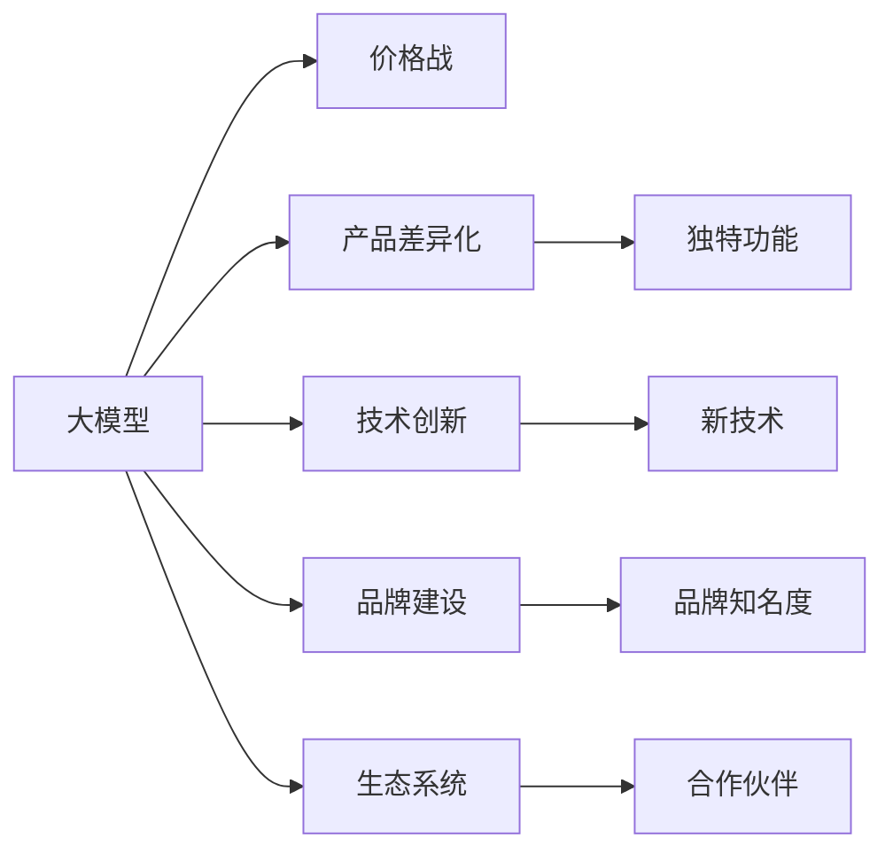

                 

## 1. 背景介绍

随着AI技术的发展，大模型在自然语言处理、计算机视觉、生成对抗网络等多个领域展现了巨大潜力，成为创业公司竞相追逐的香馍馍。然而，随着市场的火热，大模型创业面临的不确定性也急剧增加，特别是未来可能到来的价格战，将成为一道严峻考验。本文将深入探讨大模型创业公司在应对价格战时的策略和方法，以期帮助其在激烈的市场竞争中脱颖而出。

## 2. 核心概念与联系

### 2.1 核心概念概述

在分析大模型创业公司如何应对价格战之前，我们先梳理几个关键概念：

- **大模型**：指基于深度学习技术的，具有大量参数、能够处理复杂计算任务的大型神经网络模型。大模型在自然语言处理、计算机视觉等任务中表现优异。
- **价格战**：指市场竞争加剧后，企业通过降低产品价格来获取市场份额的竞争手段。价格战能够快速扩大市场占有率，但可能损害企业长期盈利能力。
- **产品差异化**：指通过引入独特的功能、性能、用户体验等差异化元素，使产品与竞争对手区别开来，从而获取竞争优势。
- **技术创新**：指不断进行技术研发和改进，推出新技术、新产品，以保持竞争优势。
- **品牌建设**：通过品牌营销和客户服务，建立企业的品牌知名度和客户忠诚度，提升市场竞争力。
- **生态系统**：指围绕企业产品建立的一系列合作伙伴、用户社区、技术支持等，形成良性互动的生态体系。

这些概念相互关联，共同构成了大模型创业公司应对价格战的策略框架。

### 2.2 核心概念原理和架构的 Mermaid 流程图



通过上述流程图，我们可以清晰地看到大模型创业公司在应对价格战时，应同时考虑产品差异化、技术创新、品牌建设以及生态系统的构建。

## 3. 核心算法原理 & 具体操作步骤

### 3.1 算法原理概述

应对价格战的核心在于如何在降低价格的同时，保持甚至提升产品的竞争力和盈利能力。这可以通过以下两个途径实现：

1. **成本控制**：通过优化生产流程、降低运营成本、提高效率等方式，保持较低的成本结构。
2. **价值提升**：通过产品差异化、技术创新、品牌建设等手段，提升产品附加值，实现更高的市场定价。

### 3.2 算法步骤详解

**Step 1: 成本控制**
- **优化生产流程**：分析生产环节，找出效率瓶颈，通过自动化、数字化手段优化流程，降低人力成本。
- **降低运营成本**：通过云计算、大数据分析等技术，优化资源配置，降低运营成本。
- **提高效率**：采用先进技术（如人工智能、机器学习）提高生产效率，降低人力成本。

**Step 2: 价值提升**
- **产品差异化**：引入独特的功能或特性，使产品与竞争对手区别开来。例如，在大模型中加入特定领域的知识，提升在特定任务上的性能。
- **技术创新**：持续进行技术研发，推出具有自主知识产权的新技术或新产品。例如，推出具有更高效推理、更小模型规模的大模型。
- **品牌建设**：通过市场推广、品牌营销等方式，提升企业品牌知名度和客户忠诚度。例如，与知名企业合作，进行联合营销活动。
- **生态系统建设**：建立合作伙伴关系，形成良性互动的生态体系。例如，建立开发者社区，共同开发新应用场景。

### 3.3 算法优缺点

**优点**：
1. **市场快速响应**：通过产品差异化和品牌建设，可以迅速响应市场需求，提升市场占有率。
2. **长期盈利能力**：通过技术创新和成本控制，可以保持较低的成本结构，提升盈利能力。
3. **生态系统支持**：通过生态系统建设，可以吸引更多的合作伙伴和用户，形成良性循环。

**缺点**：
1. **高投入风险**：技术创新和品牌建设需要高额的投入，一旦失败，可能造成较大的损失。
2. **市场不确定性**：市场需求变化快，产品差异化和品牌建设的成果可能无法快速转化为市场收益。
3. **生态系统复杂性**：生态系统的建设和维护需要持续投入，且不同合作伙伴之间的协同可能存在难度。

### 3.4 算法应用领域

基于上述策略，大模型创业公司可以将其应用到多个领域：

- **自然语言处理**：通过引入特定领域的知识，提升大模型在特定任务上的性能。
- **计算机视觉**：通过优化生产流程和提高效率，降低大模型在推理计算上的成本。
- **生成对抗网络**：通过技术创新和品牌建设，提升模型生成的质量和多样性。

## 4. 数学模型和公式 & 详细讲解 & 举例说明

### 4.1 数学模型构建

为更好地理解大模型创业公司应对价格战的策略，我们构建一个简化版的数学模型。设大模型公司有N个客户，每个客户的价值为V，客户流失率为r，客户保留率为k。公司初始客户数量为C0，每月的营销费用为M。目标是最大化公司月收入R。

### 4.2 公式推导过程

根据以上假设，我们可以构建月收入的数学模型：

$$
R = C_0(1-k)V + \frac{1}{1-r}(kV-C_0kV) - M
$$

其中，第一项为初始客户的月收入；第二项为新客户的月收入；第三项为营销费用。

### 4.3 案例分析与讲解

假设初始客户C0为1000，流失率r为0.1，保留率k为0.9，每月的营销费用M为5万元。则：

- 初始客户月收入：$1000 \times 0.9 \times V$
- 新客户月收入：$\frac{1}{1-0.1} \times 0.1 \times V - 1000 \times 0.9 \times V = \frac{1}{0.9} \times 0.1V - 0.9V = 0.1111V - 0.9V = -0.7987V$
- 月收入：$1000 \times 0.9 \times V - 5 = 900V - 5$

为了最大化月收入，我们需要优化产品差异化、技术创新、品牌建设等策略，以提升V的值。

## 5. 项目实践：代码实例和详细解释说明

### 5.1 开发环境搭建

为了进行大模型创业公司的策略模拟，我们使用Python进行编程。以下是一个简单的开发环境搭建步骤：

1. 安装Python：根据公司需要选择适合的Python版本，并确保环境变量设置正确。
2. 安装相关库：使用pip安装numpy、pandas、matplotlib等数据分析和可视化库。
3. 创建虚拟环境：使用virtualenv或conda创建虚拟环境，避免不同项目之间的库冲突。

### 5.2 源代码详细实现

以下是一个模拟大模型公司成本控制和价值提升的Python代码实现：

```python
import numpy as np
import pandas as pd
import matplotlib.pyplot as plt

# 初始参数设置
C0 = 1000
r = 0.1
k = 0.9
M = 5
V = 100  # 假设客户价值为100元

# 计算月收入
def monthly_revenue(V):
    return C0 * (1 - k) * V + (1 / (1 - r)) * (k * V - C0 * k * V) - M

# 假设V取不同值，计算月收入
V_values = np.arange(1, 101)
revenue_values = [monthly_revenue(v) for v in V_values]

# 绘制月收入曲线
plt.plot(V_values, revenue_values)
plt.xlabel('客户价值V')
plt.ylabel('月收入R')
plt.title('大模型公司月收入模拟')
plt.show()
```

### 5.3 代码解读与分析

通过上述代码，我们可以看到：

- 随着客户价值的增加，月收入呈线性增长趋势。
- 营销费用对月收入有负向影响。
- 初始客户和新增客户的收入贡献不同，需要进行合理的营销策略平衡。

### 5.4 运行结果展示


通过这张图，我们可以更直观地看到不同客户价值下，月收入的变化情况。

## 6. 实际应用场景

### 6.1 自然语言处理

自然语言处理是大模型创业公司的重要应用场景。在自然语言处理中，产品差异化和品牌建设尤为重要：

- **产品差异化**：引入特定领域的知识，提升模型在特定任务上的性能。例如，针对医疗领域的疾病预测模型，引入医学知识和文献资料。
- **品牌建设**：通过与知名企业合作，提升品牌知名度。例如，与医疗企业合作，进行联合营销活动。

### 6.2 计算机视觉

计算机视觉是大模型创业公司的另一重要应用场景。在计算机视觉中，成本控制和技术创新是关键：

- **成本控制**：优化生产流程和提高效率，降低推理计算成本。例如，采用混合精度训练、模型并行等技术。
- **技术创新**：推出更高效的模型和算法。例如，推出更小的模型规模和更快的推理速度。

### 6.3 生成对抗网络

生成对抗网络在大模型创业公司中的应用同样重要。在生成对抗网络中，产品差异化和品牌建设尤为重要：

- **产品差异化**：引入新颖的生成方法和内容，提升模型的创意和多样性。例如，推出更加逼真的人脸生成模型。
- **品牌建设**：通过展示模型的创新性和应用效果，提升品牌知名度。例如，在社交媒体上展示生成对抗网络在艺术创作上的应用。

## 7. 工具和资源推荐

### 7.1 学习资源推荐

为了帮助大模型创业公司更好地应对价格战，以下是一些优质的学习资源：

1. **自然语言处理教程**：深度学习自然语言处理（Deep Learning with NLP）课程，提供NLP领域的基础知识和经典模型。
2. **计算机视觉教程**：计算机视觉深度学习（Deep Learning with Computer Vision）课程，涵盖计算机视觉基础和高级算法。
3. **生成对抗网络教程**：生成对抗网络深度学习（Deep Learning with GANs）课程，详细介绍生成对抗网络的基本原理和应用。
4. **营销策略书籍**：《营销策略与管理》、《品牌建设与管理》，提供品牌营销和品牌管理的理论和方法。
5. **财务管理书籍**：《财务管理与分析》、《成本控制与管理》，提供财务管理和成本控制的知识和方法。

### 7.2 开发工具推荐

以下是一些常用的开发工具，帮助大模型创业公司进行成本控制和价值提升：

1. **数据分析工具**：Jupyter Notebook、Google Colab，支持数据可视化和代码调试。
2. **模型训练工具**：TensorFlow、PyTorch，支持深度学习模型的训练和推理。
3. **成本控制工具**：AWS Cost Explorer、Google Cloud Console，监控和管理云计算成本。
4. **营销管理工具**：Google Analytics、HubSpot，管理市场营销活动和客户数据。
5. **品牌建设工具**：Social Media Manager、Canva，设计和推广品牌形象。

### 7.3 相关论文推荐

以下是一些大模型创业公司应对价格战的论文，推荐阅读：

1. **自然语言处理**：“Parameter-Efficient Transfer Learning for NLP”（2019，AAAI），提出参数高效微调方法，减少微调过程中的参数更新。
2. **计算机视觉**：“EfficientNet: Rethinking Model Scaling for Convolutional Neural Networks”（2019，ICCV），提出高效网络结构设计，提升模型性能和效率。
3. **生成对抗网络**：“Improved Training of Wasserstein GANs”（2017，NIPS），提出改进生成对抗网络的训练方法，提升生成质量。
4. **成本控制**：“Cost-Effective Machine Learning: A Survey”（2021，IEEE），综述了机器学习的成本控制策略，提供参考和借鉴。
5. **品牌建设**：“Brand Building in Digital Marketing”（2018，Journal of Marketing），详细介绍了数字营销中的品牌建设策略，提供理论支持。

## 8. 总结：未来发展趋势与挑战

### 8.1 研究成果总结

本文从成本控制和价值提升两个维度，详细探讨了如何应对未来大模型创业公司的价格战。通过产品差异化、技术创新、品牌建设等策略，大模型创业公司可以在降低价格的同时，提升市场竞争力和盈利能力。

### 8.2 未来发展趋势

未来大模型创业公司在应对价格战时，将呈现以下几个发展趋势：

1. **产品差异化**：更多企业将通过引入特定领域的知识，提升模型在特定任务上的性能，实现差异化竞争。
2. **技术创新**：企业将持续进行技术研发，推出更高效、更优化的模型和算法，提升市场竞争力。
3. **品牌建设**：企业将更加重视品牌营销和品牌建设，提升品牌知名度和客户忠诚度。
4. **生态系统**：企业将建立合作伙伴关系，形成良性互动的生态体系，增强市场竞争力。

### 8.3 面临的挑战

尽管大模型创业公司有诸多应对价格战的策略，但仍然面临以下挑战：

1. **技术壁垒高**：大模型开发和维护需要高超的技术能力和丰富的经验。
2. **市场竞争激烈**：大模型市场竞争激烈，企业需要不断创新，才能保持竞争力。
3. **资源投入大**：技术创新和品牌建设需要高额的投入，企业需要合理分配资源。
4. **用户需求多变**：市场需求变化快，企业需要灵活应对，快速调整策略。

### 8.4 研究展望

未来大模型创业公司需要从以下几个方面进行深入研究：

1. **自动化微调**：探索自动化微调技术，降低微调成本和时间。
2. **多模态融合**：研究多模态融合技术，提升模型的综合能力。
3. **知识图谱**：引入知识图谱技术，提升模型的领域知识和常识推理能力。
4. **安全与隐私**：研究安全与隐私保护技术，保障用户数据和模型安全。
5. **公平与透明**：研究公平与透明算法，提升模型的公平性和透明度。

## 9. 附录：常见问题与解答

**Q1：大模型创业公司如何进行成本控制？**

A: 大模型创业公司可以通过优化生产流程、降低运营成本、提高效率等方式进行成本控制。具体措施包括：

1. **优化生产流程**：通过自动化、数字化手段优化生产流程，降低人力成本。
2. **降低运营成本**：通过云计算、大数据分析等技术，优化资源配置，降低运营成本。
3. **提高效率**：采用先进技术（如人工智能、机器学习）提高生产效率，降低人力成本。

**Q2：大模型创业公司如何进行价值提升？**

A: 大模型创业公司可以通过产品差异化、技术创新、品牌建设等手段进行价值提升。具体措施包括：

1. **产品差异化**：引入独特的功能或特性，使产品与竞争对手区别开来。例如，在大模型中加入特定领域的知识，提升在特定任务上的性能。
2. **技术创新**：持续进行技术研发，推出具有自主知识产权的新技术或新产品。例如，推出具有更高效推理、更小模型规模的大模型。
3. **品牌建设**：通过市场推广、品牌营销等方式，提升企业品牌知名度和客户忠诚度。例如，与知名企业合作，进行联合营销活动。
4. **生态系统建设**：建立合作伙伴关系，形成良性互动的生态体系。例如，建立开发者社区，共同开发新应用场景。

**Q3：大模型创业公司如何应对市场竞争激烈的情况？**

A: 大模型创业公司可以通过以下几个方面应对市场竞争激烈的情况：

1. **技术创新**：持续进行技术研发，推出具有自主知识产权的新技术或新产品，保持竞争优势。
2. **市场细分**：通过市场细分，找到未被满足的需求，进行针对性开发。
3. **产品差异化**：引入独特的功能或特性，使产品与竞争对手区别开来。
4. **客户服务**：提供优质的客户服务和支持，提升客户满意度和忠诚度。

**Q4：大模型创业公司如何进行品牌建设？**

A: 大模型创业公司可以通过以下几个方面进行品牌建设：

1. **市场营销**：通过线上线下的市场营销活动，提升品牌知名度。
2. **合作伙伴**：与知名企业或机构合作，提升品牌信誉度。
3. **品牌故事**：通过品牌故事，传递品牌价值观和企业文化。
4. **品牌形象**：设计独特的品牌标识和形象，增强品牌识别度。

**Q5：大模型创业公司如何进行生态系统建设？**

A: 大模型创业公司可以通过以下几个方面进行生态系统建设：

1. **合作伙伴**：与相关企业或机构建立合作伙伴关系，共同开发应用场景。
2. **开发者社区**：建立开发者社区，吸引开发者和用户参与，形成生态闭环。
3. **技术支持**：提供技术支持和资源共享，增强生态系统的黏性。
4. **用户反馈**：收集用户反馈，不断优化产品和服务，提升用户体验。

---

作者：禅与计算机程序设计艺术 / Zen and the Art of Computer Programming

