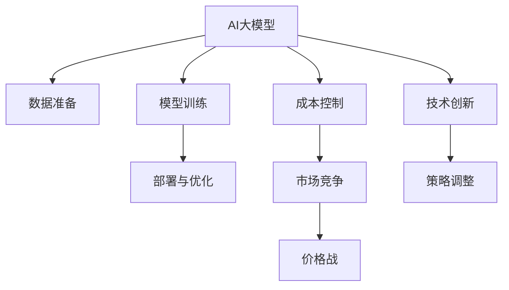

                 

# AI大模型创业：如何应对未来价格战？

在当前的技术与市场中，人工智能（AI）正处于高速发展阶段，尤其是大模型（AI大模型）的应用，正在迅速改变各个行业的运营模式。AI大模型以巨量的数据和复杂的算法为基础，能够处理复杂任务，甚至超越人类在某些领域的表现。然而，随着技术普及，AI大模型也面临着激烈的市场竞争，如何在未来价格战中站稳脚跟，是一个亟需探讨的问题。本文将深入分析AI大模型创业所面临的挑战和应对策略，希望能为创业者提供有价值的参考。

## 1. 背景介绍

### 1.1 行业概况
AI大模型在图像识别、自然语言处理、语音识别等多个领域中展示了强大的能力，推动了互联网、金融、医疗等多个行业的发展。根据行业研究，未来五年AI大模型市场将持续增长，成为信息技术和服务的核心力量。然而，伴随着市场规模的扩大，竞争也在加剧，价格战成为常见现象。

### 1.2 挑战与机遇
AI大模型的优势在于其算力强大和模型复杂，但这也意味着高昂的研发成本和维护成本。在大规模生产和应用中，如何平衡成本与收益成为关键问题。同时，价格战也可能导致市场环境恶化，影响企业利润。因此，在未来的竞争中，企业需要制定策略，以应对成本与市场双重的挑战，同时抓住技术革新的机遇。

## 2. 核心概念与联系

### 2.1 核心概念概述
- **AI大模型**：基于深度学习等技术，能够处理复杂任务的大型算法模型。
- **成本控制**：通过优化算法、降低硬件成本、提高生产效率等方式，减少产品成本。
- **市场竞争**：企业间通过降低价格、提升服务质量等方式，争夺市场份额。
- **技术创新**：通过研发新算法、改进模型、优化软件等方式，提升产品竞争力。
- **价格战**：在市场竞争中，企业通过降价等手段，争夺市场份额的策略。

### 2.2 核心概念原理和架构的 Mermaid 流程图



这个图表展示了AI大模型创业的基本流程，以及各环节之间的联系。数据准备、模型训练、部署与优化、成本控制、市场竞争、价格战、技术创新、策略调整构成了AI大模型创业的完整过程。其中，数据准备、模型训练和部署与优化是技术核心；成本控制和市场竞争是战略关键；技术创新和策略调整则是企业的长期动力。

## 3. 核心算法原理 & 具体操作步骤

### 3.1 算法原理概述
AI大模型的创业主要依赖于数据驱动和算法驱动。数据准备和模型训练是技术基础，而成本控制、市场竞争、技术创新和策略调整则是运营和战略重点。

### 3.2 算法步骤详解

#### 3.2.1 数据准备
数据准备是AI大模型的基础。企业需要收集、清洗和标注大量数据，用于模型的训练和测试。数据的质量直接影响模型的性能和准确度。

**步骤**：
1. **数据收集**：从公开数据集、合作机构、网络爬取等多种途径获取数据。
2. **数据清洗**：处理缺失值、异常值，确保数据质量。
3. **数据标注**：给数据打上标签，供模型训练。

#### 3.2.2 模型训练
模型训练是AI大模型的核心。通过训练，模型能够学习和理解数据的内在规律，完成特定任务。

**步骤**：
1. **选择算法**：选择合适的深度学习算法，如卷积神经网络（CNN）、循环神经网络（RNN）、Transformer等。
2. **搭建模型**：根据任务需求，设计模型结构和参数。
3. **训练优化**：使用GPU/TPU等高性能设备，优化模型训练过程，缩短训练时间。
4. **评估测试**：通过评估指标，如准确率、召回率、F1值等，测试模型效果。

#### 3.2.3 部署与优化
模型训练后，需要部署到实际应用中，并通过优化提升性能。

**步骤**：
1. **模型压缩**：通过剪枝、量化等技术，减少模型参数和计算量。
2. **分布式训练**：使用分布式计算框架，提高训练速度。
3. **在线优化**：根据用户反馈，持续优化模型性能。

#### 3.2.4 成本控制
成本控制是AI大模型创业的关键。通过优化算法和降低成本，提升产品竞争力。

**步骤**：
1. **算法优化**：采用高效的算法，减少资源消耗。
2. **硬件选择**：选择合适的硬件设备，如GPU、TPU等，降低成本。
3. **流程改进**：优化生产流程，减少人力和物力投入。

#### 3.2.5 市场竞争
市场竞争是AI大模型创业的战略重点。通过价格战、营销策略等方式，争取更多用户和市场份额。

**步骤**：
1. **定价策略**：制定合理的定价策略，确保利润。
2. **营销推广**：通过社交媒体、线上线下活动等，提高品牌知名度。
3. **客户服务**：提供优质的客户服务，增强用户黏性。

#### 3.2.6 技术创新
技术创新是AI大模型创业的长期动力。通过研发新算法、改进模型，提升产品竞争力。

**步骤**：
1. **研发投入**：加大研发投入，培养技术团队。
2. **合作交流**：与高校、研究机构合作，获取最新技术信息。
3. **专利申请**：申请专利保护技术成果。

#### 3.2.7 策略调整
策略调整是AI大模型创业的灵活应对方式。通过灵活的战略调整，应对市场变化和技术挑战。

**步骤**：
1. **市场调研**：定期进行市场调研，了解行业动态。
2. **风险评估**：评估风险，制定应对措施。
3. **团队优化**：优化团队结构，提升执行力。

### 3.3 算法优缺点
- **优点**：
  - **算法强大**：基于深度学习等先进算法，具备强大的数据处理能力。
  - **灵活应用**：适用于多个行业和任务，应用广泛。
  - **技术领先**：具备技术领先优势，能够快速占领市场。
- **缺点**：
  - **成本高昂**：需要巨量数据和计算资源，成本较高。
  - **资源消耗大**：对计算资源和人力资源的消耗较大。
  - **市场风险**：价格战可能导致利润下滑。

### 3.4 算法应用领域
AI大模型在多个领域有广泛应用，如医疗诊断、金融分析、自动驾驶、智能客服等。这些应用场景中的数据量和任务复杂度不断增加，使得AI大模型成为解决方案的首选。

## 4. 数学模型和公式 & 详细讲解 & 举例说明

### 4.1 数学模型构建
AI大模型的数学模型通常基于深度学习框架构建，如TensorFlow、PyTorch等。模型结构包括输入层、隐藏层、输出层等。

### 4.2 公式推导过程
以神经网络为例，其数学模型可以表示为：

$$
y = Wx + b
$$

其中 $y$ 为输出，$W$ 为权重矩阵，$x$ 为输入，$b$ 为偏置向量。训练过程通常使用反向传播算法，通过梯度下降等优化算法更新权重。

### 4.3 案例分析与讲解
假设我们要训练一个图像分类模型，其数学模型为：

$$
y = Wx + b
$$

其中 $x$ 为输入图像，$y$ 为输出类别。通过反向传播算法，我们可以计算出权重 $W$ 和偏置 $b$ 的更新公式：

$$
W \leftarrow W - \eta \frac{\partial L}{\partial W}
$$

$$
b \leftarrow b - \eta \frac{\partial L}{\partial b}
$$

其中 $\eta$ 为学习率，$L$ 为损失函数，$L$ 的计算公式为：

$$
L = \sum_{i=1}^n(y_i - Wx_i - b)^2
$$

在实际应用中，我们可以使用反向传播算法，不断更新权重和偏置，使损失函数最小化，从而训练出高精度的分类模型。

## 5. 项目实践：代码实例和详细解释说明

### 5.1 开发环境搭建
搭建AI大模型开发环境，需要以下步骤：

1. **安装编程语言**：Python是最常用的AI开发语言，需要安装Python 3.x版本。
2. **安装深度学习框架**：TensorFlow、PyTorch等深度学习框架是AI开发的基础工具，需要安装。
3. **配置开发环境**：安装必要的开发工具，如Jupyter Notebook、Anaconda等。

### 5.2 源代码详细实现

#### 5.2.1 数据准备
数据准备阶段需要处理大量数据，以下是一个数据清洗的Python代码示例：

```python
import pandas as pd

# 读取数据
data = pd.read_csv('data.csv')

# 处理缺失值
data = data.dropna()

# 处理异常值
data = data[data['feature'].between(min_val, max_val)]
```

#### 5.2.2 模型训练
模型训练阶段需要构建和训练模型，以下是一个基于TensorFlow的图像分类模型训练代码示例：

```python
import tensorflow as tf

# 定义模型
model = tf.keras.Sequential([
    tf.keras.layers.Conv2D(32, (3, 3), activation='relu', input_shape=(28, 28, 1)),
    tf.keras.layers.MaxPooling2D((2, 2)),
    tf.keras.layers.Flatten(),
    tf.keras.layers.Dense(10, activation='softmax')
])

# 编译模型
model.compile(optimizer=tf.keras.optimizers.Adam(0.001), loss='categorical_crossentropy', metrics=['accuracy'])

# 训练模型
model.fit(train_images, train_labels, epochs=10, validation_data=(test_images, test_labels))
```

#### 5.2.3 部署与优化
模型部署和优化阶段需要将模型部署到实际应用中，并进行优化，以下是一个基于TensorFlow的模型优化代码示例：

```python
# 模型压缩
quantized_model = tf.quantization.quantize(model)

# 分布式训练
distributed_train(model, data)
```

### 5.3 代码解读与分析
在代码实现中，数据处理、模型构建和训练是关键步骤。数据处理阶段需要进行数据清洗和标注，保证数据质量。模型构建阶段需要选择合适的算法和参数，确保模型性能。模型训练阶段需要进行反向传播，更新模型参数，提升模型准确度。模型部署和优化阶段需要减少资源消耗，提高模型效率。

### 5.4 运行结果展示
模型训练完成后，可以展示其性能，以下是一个简单的图像分类模型准确度展示代码：

```python
# 模型评估
test_loss, test_acc = model.evaluate(test_images, test_labels)
print(f'Test accuracy: {test_acc:.2f}%')
```

## 6. 实际应用场景

### 6.1 医疗诊断
AI大模型在医疗诊断中能够通过分析医学影像、病理切片等数据，帮助医生进行疾病诊断。然而，价格战可能导致市场竞争加剧，企业需要制定合理的定价策略，保证利润。

### 6.2 金融分析
AI大模型在金融分析中能够通过分析市场数据，预测股票价格、风险等，帮助投资者做出决策。然而，价格战可能导致企业利润下滑，需要通过技术创新提升产品竞争力。

### 6.3 自动驾驶
AI大模型在自动驾驶中能够通过分析传感器数据，实现自动驾驶。然而，价格战可能导致市场竞争加剧，企业需要提高产品性能，降低生产成本。

## 7. 工具和资源推荐

### 7.1 学习资源推荐
- **《深度学习》**：Ian Goodfellow等著，深度学习领域的经典教材。
- **《TensorFlow实战Google深度学习框架》**：Cahil Gupta等著，介绍TensorFlow的实战应用。
- **Coursera深度学习课程**：由斯坦福大学Andrew Ng教授授课，涵盖深度学习基础知识和应用。

### 7.2 开发工具推荐
- **PyTorch**：深度学习领域的领先框架，易用性高，支持动态图。
- **TensorFlow**：由Google开发的深度学习框架，支持静态图和动态图。
- **Jupyter Notebook**：常用的Python交互式编程环境，支持多种编程语言。

### 7.3 相关论文推荐
- **《深度学习》**：Goodfellow等著，介绍深度学习的基本原理和应用。
- **《分布式深度学习》**：Dean等著，介绍分布式深度学习的实现方法和应用。
- **《TensorFlow优化与模型压缩》**：Bolukbasi等著，介绍TensorFlow的优化和模型压缩技术。

## 8. 总结：未来发展趋势与挑战

### 8.1 研究成果总结
AI大模型的发展为各个行业带来了巨大的机遇，但也面临诸多挑战。在未来，AI大模型需要优化算法、降低成本、提升性能，才能在激烈的市场竞争中占据一席之地。

### 8.2 未来发展趋势
未来，AI大模型的发展趋势将更加注重技术创新和应用落地。通过不断优化算法和提升模型性能，AI大模型将在更多领域实现突破。

### 8.3 面临的挑战
AI大模型在未来发展过程中，将面临数据获取、算法优化、成本控制、市场竞争等多方面的挑战，需要制定合理的策略，确保企业可持续发展。

### 8.4 研究展望
未来，AI大模型需要进一步探索新的算法和技术，提升模型性能和应用效果。同时，需要建立完善的机制，保障数据安全和隐私保护，构建可持续发展的AI大模型生态。

## 9. 附录：常见问题与解答

### 9.1 问题1：AI大模型如何处理海量数据？
**解答**：AI大模型需要大量的数据进行训练，可以通过分布式存储和处理技术，如Hadoop、Spark等，高效地处理海量数据。

### 9.2 问题2：AI大模型如何优化算法？
**解答**：AI大模型需要优化算法以提升模型性能，可以通过算法优化、模型压缩等技术，减少资源消耗。

### 9.3 问题3：AI大模型如何降低成本？
**解答**：AI大模型需要降低成本以提高产品竞争力，可以通过优化生产流程、选择高效硬件等方式，降低生产成本。

### 9.4 问题4：AI大模型如何应对市场竞争？
**解答**：AI大模型需要应对市场竞争，可以通过制定合理的定价策略、加强营销推广等方式，提高市场份额。

### 9.5 问题5：AI大模型如何提升性能？
**解答**：AI大模型需要提升性能以增强产品竞争力，可以通过研发新算法、改进模型等方式，提升模型性能。

---

作者：禅与计算机程序设计艺术 / Zen and the Art of Computer Programming

