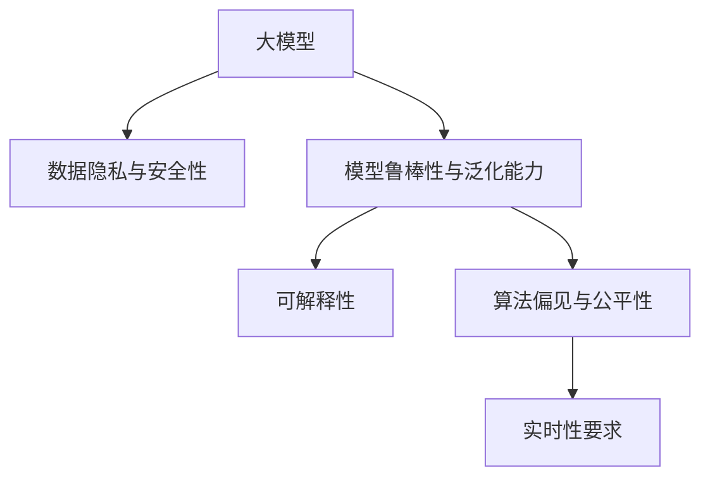
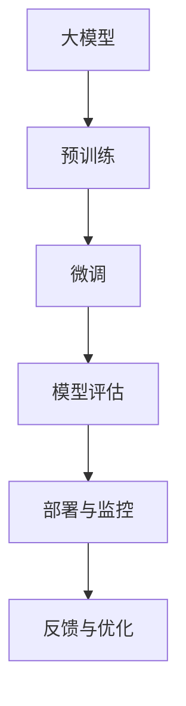

                 

# AI大模型创业：如何应对未来挑战？

## 1. 背景介绍

### 1.1 问题由来

随着人工智能技术的不断成熟，大模型（Large Model）在各个行业中的应用日益广泛，从自然语言处理（NLP）、计算机视觉（CV）到医疗、金融、教育等领域，大模型都展现出了巨大的潜力和价值。然而，与此同时，大模型的应用和发展也面临一系列的挑战和问题，例如数据隐私、模型鲁棒性、可解释性、算法偏见等，这些问题都亟需创业公司进行深度研究和技术突破。

### 1.2 问题核心关键点

在AI大模型创业过程中，以下问题是必须关注的：

- **数据隐私与安全性**：大模型需要大量的标注数据进行训练，如何保护用户隐私，确保数据的安全性，是一个核心问题。
- **模型鲁棒性与泛化能力**：模型在特定数据集上的表现优异，但面对真实世界的复杂环境，其鲁棒性和泛化能力如何？
- **可解释性**：模型的决策过程是否透明，是否可解释，对于高风险行业（如医疗、金融）尤为重要。
- **算法偏见与公平性**：模型是否存在潜在的算法偏见，如何确保模型在各种场景下的公平性？
- **实时性要求**：对于某些应用场景，模型的实时响应速度是一个硬性需求。

### 1.3 问题研究意义

了解和解决这些挑战，不仅能够帮助创业公司提升核心竞争力，更能够为人工智能技术的广泛应用奠定坚实的基础。通过深入研究和突破，能够更好地保障用户隐私、提升模型性能、增强系统的可靠性与安全性，从而推动AI技术的社会价值最大化。

## 2. 核心概念与联系

### 2.1 核心概念概述

为了更好地理解和应对未来挑战，需要清晰地定义核心概念及其相互关系：

- **大模型（Large Model）**：指的是拥有大量参数（通常以亿为单位）的深度学习模型，如BERT、GPT、ViT等，能够在特定任务上取得优异表现。
- **数据隐私与安全性**：涉及如何在保证用户数据隐私的前提下，确保模型训练和应用的安全性。
- **模型鲁棒性与泛化能力**：模型在面对未知数据和复杂环境时的鲁棒性和泛化能力。
- **可解释性**：模型能够提供清晰、可理解的输出，帮助用户理解模型决策的依据。
- **算法偏见与公平性**：模型是否存在潜在的偏见，如何确保模型在各种场景下的公平性。
- **实时性要求**：模型在响应时间上的需求，特别是在实时应用场景中。

这些概念通过以下Mermaid流程图进行联系展示：



### 2.2 核心概念原理和架构的 Mermaid 流程图

以下是核心概念原理和架构的 Mermaid 流程图：



## 3. 核心算法原理 & 具体操作步骤

### 3.1 算法原理概述

在AI大模型的创业过程中，核心算法包括但不限于：

- **预训练与微调**：通过在大规模数据上进行预训练，再针对特定任务进行微调，优化模型性能。
- **数据增强**：通过各种技术手段扩充训练数据集，增强模型泛化能力。
- **对抗训练**：使用对抗样本训练模型，提升模型的鲁棒性。
- **正则化**：通过L2正则化、Dropout等技术，避免模型过拟合。
- **可解释性模型**：通过注意力机制、LIME、SHAP等技术，增强模型的可解释性。
- **公平性算法**：通过调整损失函数、引入公平性约束等手段，确保模型在各种场景下的公平性。

### 3.2 算法步骤详解

核心算法的详细步骤如下：

1. **数据预处理**：收集和标注训练数据，进行数据清洗和预处理，确保数据的质量和多样性。
2. **模型预训练**：使用大规模数据集对模型进行预训练，学习通用的语言/视觉表示。
3. **模型微调**：选择适合任务的微调策略，针对特定任务进行微调，优化模型性能。
4. **模型评估**：在验证集和测试集上评估模型性能，确保模型泛化能力。
5. **模型部署**：将模型部署到生产环境中，进行实时推理和应用。
6. **模型监控与优化**：实时监控模型性能，收集反馈数据，进行模型优化。

### 3.3 算法优缺点

- **优点**：
  - **高效性**：大模型在特定任务上微调，能够快速提升性能，适用于多种NLP、CV任务。
  - **可解释性**：大模型的结构复杂，可解释性强，易于理解和调试。
  - **泛化能力强**：预训练模型能够学习到通用的表示，泛化能力强，适应性广。

- **缺点**：
  - **数据需求高**：模型训练需要大量的标注数据，获取成本高，且数据隐私问题严重。
  - **计算资源消耗大**：大模型训练和推理计算资源消耗大，硬件成本高。
  - **算法复杂**：模型结构和训练过程复杂，需要深入理解相关算法。

### 3.4 算法应用领域

大模型微调技术广泛应用于以下领域：

- **自然语言处理**：如情感分析、机器翻译、问答系统等。
- **计算机视觉**：如图像分类、目标检测、图像生成等。
- **医疗健康**：如疾病诊断、病历分析、医学图像识别等。
- **金融领域**：如信用评分、风险评估、智能投顾等。
- **教育领域**：如智能辅导、学习效果评估等。
- **工业制造**：如质量检测、故障诊断、供应链优化等。

## 4. 数学模型和公式 & 详细讲解 & 举例说明

### 4.1 数学模型构建

以自然语言处理中的文本分类任务为例，数学模型构建如下：

- **输入**：文本 $x_i$，$x_i \in \mathbb{R}^d$，其中 $d$ 为文本嵌入的维度。
- **模型**：$M_{\theta}$，其中 $\theta$ 为模型参数。
- **损失函数**：$L$，用于衡量模型预测输出与真实标签的差异。
- **优化器**：$O$，如Adam、SGD等，用于更新模型参数。

### 4.2 公式推导过程

以二分类任务为例，公式推导过程如下：

$$
\hat{y} = M_{\theta}(x_i) \\
L = -(y \log \hat{y} + (1-y) \log (1-\hat{y})) \\
\frac{\partial L}{\partial \theta} = -(y M_{\theta}(x_i) - (1-y) (1-M_{\theta}(x_i))) M_{\theta}'(x_i) \\
$$

其中 $M_{\theta}'(x_i)$ 为模型 $M_{\theta}$ 在输入 $x_i$ 上的导数。

### 4.3 案例分析与讲解

以BERT微调为例，其步骤包括：

1. **数据预处理**：对文本进行分词，转换为BERT模型所需的输入格式。
2. **模型微调**：在BERT模型的顶部添加一个全连接层，并使用交叉熵损失进行微调。
3. **模型评估**：在验证集上评估模型性能，如准确率、F1值等。
4. **模型部署**：将微调后的模型部署到实际应用中，进行实时推理。

## 5. 项目实践：代码实例和详细解释说明

### 5.1 开发环境搭建

以TensorFlow为例，开发环境搭建如下：

1. 安装Python、TensorFlow、Keras等。
2. 配置环境变量，确保依赖包正确安装。
3. 准备训练数据，进行数据预处理。

### 5.2 源代码详细实现

以文本分类为例，代码实现如下：

```python
import tensorflow as tf
from tensorflow.keras.preprocessing.text import Tokenizer
from tensorflow.keras.preprocessing.sequence import pad_sequences

# 数据预处理
texts = ["This is the first document.", "This is the second document.", ...]
labels = [0, 1, ..., 0, 1]
tokenizer = Tokenizer(num_words=10000)
tokenizer.fit_on_texts(texts)
sequences = tokenizer.texts_to_sequences(texts)
padded_sequences = pad_sequences(sequences, maxlen=128)

# 模型定义
model = tf.keras.Sequential([
    tf.keras.layers.Embedding(input_dim=10000, output_dim=128),
    tf.keras.layers.Bidirectional(tf.keras.layers.LSTM(128)),
    tf.keras.layers.Dense(1, activation='sigmoid')
])

# 模型编译
model.compile(optimizer='adam', loss='binary_crossentropy', metrics=['accuracy'])

# 模型训练
model.fit(padded_sequences, labels, epochs=10, batch_size=32)

# 模型评估
test_texts = ["This is the first document.", ...]
test_labels = [0, 1, ..., 0, 1]
test_sequences = tokenizer.texts_to_sequences(test_texts)
test_padded_sequences = pad_sequences(test_sequences, maxlen=128)
test_loss, test_acc = model.evaluate(test_padded_sequences, test_labels)

# 模型预测
new_text = ["This is a new document.", ...]
new_sequence = tokenizer.texts_to_sequences(new_text)
new_padded_sequence = pad_sequences(new_sequence, maxlen=128)
predictions = model.predict(new_padded_sequence)
```

### 5.3 代码解读与分析

以上代码实现中，首先进行了数据预处理，将文本转换为模型所需的输入格式。然后定义了包含嵌入层、双向LSTM和全连接层的简单模型，并进行编译。在训练过程中，使用交叉熵损失和Adam优化器。最后对模型进行评估和预测。

## 6. 实际应用场景

### 6.1 金融领域

在金融领域，大模型微调可以用于信用评分、风险评估、智能投顾等。通过分析用户的历史交易数据和行为数据，训练出能够预测用户信用风险、识别潜在欺诈行为的模型。

### 6.2 医疗领域

在医疗领域，大模型微调可以用于疾病诊断、病历分析、医学图像识别等。通过分析患者的症状、病史、医学影像等数据，训练出能够辅助医生进行诊断的模型。

### 6.3 教育领域

在教育领域，大模型微调可以用于智能辅导、学习效果评估等。通过分析学生的学习行为、成绩、作业等数据，训练出能够提供个性化学习建议、评估学习效果的模型。

### 6.4 未来应用展望

未来，大模型微调将在更多领域得到应用，例如工业制造、智能交通、智能家居等。随着技术的不断进步，大模型微调的应用场景将更加广泛，为各行各业带来深刻变革。

## 7. 工具和资源推荐

### 7.1 学习资源推荐

- **TensorFlow官方文档**：详细介绍了TensorFlow的使用方法、模型构建、训练优化等。
- **Keras官方文档**：提供了简单易用的API，适合初学者上手。
- **PyTorch官方文档**：深入讲解了PyTorch的使用方法和深度学习算法。
- **Coursera深度学习课程**：由斯坦福大学教授Andrew Ng主讲的深度学习课程，内容全面，适合深度学习初学者。
- **Deep Learning with Python**：由Ian Goodfellow、Yoshua Bengio和Aaron Courville合著的深度学习经典教材，适合深度学习进阶学习。

### 7.2 开发工具推荐

- **TensorBoard**：用于监控模型训练过程，提供了丰富的可视化图表。
- **Weights & Biases**：用于实验跟踪和管理，记录训练过程中的各项指标。
- **Jupyter Notebook**：用于编写和运行Python代码，支持实时调试和数据可视化。
- **Google Colab**：提供了免费的GPU资源，适合快速迭代实验。

### 7.3 相关论文推荐

- **Attention is All You Need**：Transformer论文，提出了注意力机制，开启了深度学习范式的新篇章。
- **BERT: Pre-training of Deep Bidirectional Transformers for Language Understanding**：BERT论文，提出了预训练语言模型，刷新了NLP任务的性能。
- **ImageNet Classification with Deep Convolutional Neural Networks**：AlexNet论文，奠定了卷积神经网络在图像识别领域的应用基础。
- **Deep Residual Learning for Image Recognition**：ResNet论文，提出了残差连接，解决了深度网络训练中的梯度消失问题。
- **The Google AI Language Model (GPT-3)**：GPT-3论文，展示了大规模语言模型在自然语言处理中的应用潜力。

## 8. 总结：未来发展趋势与挑战

### 8.1 研究成果总结

本文详细探讨了AI大模型创业中的核心概念和算法原理，通过系统化的分析，提供了清晰的解决思路和实际案例。通过了解大模型的应用前景和挑战，创业公司可以更好地把握方向，提升核心竞争力。

### 8.2 未来发展趋势

未来，大模型微调技术将呈现以下几个发展趋势：

- **自监督学习**：通过自监督学习范式，降低对标注数据的依赖，提升模型的泛化能力。
- **联邦学习**：通过分布式计算，保护数据隐私，提升模型安全性和可靠性。
- **可解释性模型**：通过增强模型的可解释性，提升系统的透明性和可信赖度。
- **多模态学习**：通过融合视觉、语音等多模态数据，提升模型的理解和生成能力。
- **实时计算优化**：通过优化模型结构和计算图，提升模型的推理速度和资源利用率。

### 8.3 面临的挑战

尽管大模型微调技术取得了显著进展，但以下挑战仍需关注：

- **数据隐私与安全**：如何保护用户隐私，确保数据安全。
- **模型鲁棒性**：面对未知数据和复杂环境，模型的鲁棒性如何保障。
- **算法偏见与公平性**：模型是否存在偏见，如何确保模型公平性。
- **计算资源消耗**：如何优化模型结构和计算，降低计算资源消耗。
- **实时响应速度**：如何提升模型的实时响应速度，满足实时应用的需求。

### 8.4 研究展望

未来的研究可以从以下几个方向进行突破：

- **数据增强技术**：提升数据多样性，增强模型泛化能力。
- **模型结构优化**：简化模型结构，提升模型推理速度和资源利用率。
- **模型公平性**：引入公平性约束，确保模型在不同场景下的公平性。
- **多模态融合**：融合多模态数据，提升模型的理解和生成能力。
- **隐私保护技术**：采用差分隐私、联邦学习等技术，保护用户隐私。

## 9. 附录：常见问题与解答

**Q1：大模型微调是否适用于所有NLP任务？**

A: 大模型微调在大多数NLP任务上都能取得不错的效果，但对于一些特定领域的任务，如医学、法律等，仅靠通用语料预训练的模型可能难以很好地适应。此时需要在特定领域语料上进一步预训练，再进行微调，才能获得理想效果。

**Q2：如何选择合适的学习率？**

A: 微调的学习率一般要比预训练时小1-2个数量级，如果使用过大的学习率，容易破坏预训练权重，导致过拟合。一般建议从1e-5开始调参，逐步减小学习率，直至收敛。也可以使用warmup策略，在开始阶段使用较小的学习率，再逐渐过渡到预设值。

**Q3：采用大模型微调时会面临哪些资源瓶颈？**

A: 大模型的计算资源消耗大，特别是在大规模训练和推理时，硬件成本较高。因此需要采用一些资源优化技术，如梯度积累、混合精度训练、模型并行等，来突破硬件瓶颈。同时，模型的存储和读取也可能占用大量时间和空间，需要采用模型压缩、稀疏化存储等方法进行优化。

**Q4：如何缓解微调过程中的过拟合问题？**

A: 过拟合是微调面临的主要挑战，尤其是在标注数据不足的情况下。常见的缓解策略包括：

- 数据增强：通过回译、近义替换等方式扩充训练集。
- 正则化：使用L2正则、Dropout、Early Stopping等避免过拟合。
- 对抗训练：引入对抗样本，提高模型鲁棒性。
- 参数高效微调：只调整少量参数(如Adapter、Prefix等)，减小过拟合风险。

这些策略往往需要根据具体任务和数据特点进行灵活组合。只有在数据、模型、训练、推理等各环节进行全面优化，才能最大限度地发挥大模型微调的威力。

**Q5：如何确保模型的公平性？**

A: 模型公平性是一个复杂的问题，涉及多个方面：

- 调整损失函数：引入公平性约束，避免模型对某些类别的歧视。
- 数据多样性：确保训练数据的多样性和代表性，避免数据偏差。
- 模型监控：实时监控模型输出，及时发现和纠正偏见。

通过这些手段，可以确保模型在各种场景下的公平性。

**Q6：大模型微调的部署和优化策略有哪些？**

A: 大模型微调的部署和优化策略包括：

- 模型裁剪：去除不必要的层和参数，减小模型尺寸，加快推理速度。
- 量化加速：将浮点模型转为定点模型，压缩存储空间，提高计算效率。
- 服务化封装：将模型封装为标准化服务接口，便于集成调用。
- 弹性伸缩：根据请求流量动态调整资源配置，平衡服务质量和成本。
- 监控告警：实时采集系统指标，设置异常告警阈值，确保服务稳定性。

通过这些策略，可以确保模型的实时性和稳定性，提升系统的性能和可靠性。

---

作者：禅与计算机程序设计艺术 / Zen and the Art of Computer Programming

