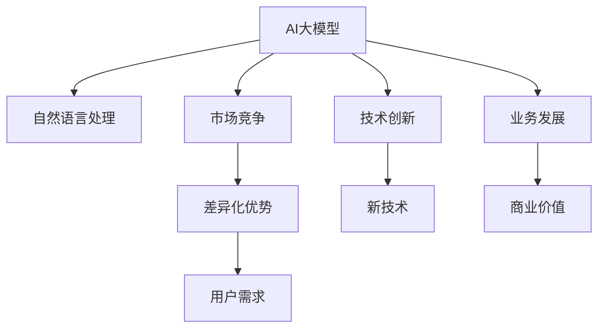

                 

# AI大模型创业：如何应对未来用户需求？

> 关键词：大模型创业,用户需求,未来趋势,技术创新,市场竞争,业务发展

## 1. 背景介绍

### 1.1 问题由来

随着人工智能技术的迅速发展，AI大模型在各行各业的应用日益广泛。AI大模型指的是基于深度学习模型的大规模预训练模型，如GPT-3、BERT、T5等，这些模型具备强大的语言理解能力和生成能力，能够处理各种自然语言处理（NLP）任务。然而，AI大模型的发展和应用也带来了一些新的挑战，特别是对于AI创业公司来说，如何应对不断变化的未来用户需求，是一个亟待解决的问题。

### 1.2 问题核心关键点

AI大模型创业的核心在于如何充分利用大模型的能力，满足用户不断变化的需求。以下是创业公司应对未来用户需求的关键点：

- 识别目标用户：明确目标用户群体及其需求，以便提供定制化的解决方案。
- 收集用户反馈：通过用户调研、数据分析等方式，获取用户需求的变化趋势。
- 技术创新：在现有大模型的基础上进行技术创新，开发新的应用场景和功能。
- 市场竞争：在激烈的市场竞争中寻找差异化竞争优势。
- 业务发展：制定明确的业务发展策略，确保技术的商业价值最大化。

## 2. 核心概念与联系

### 2.1 核心概念概述

为更好地理解AI大模型创业的策略和实施路径，本节将介绍几个密切相关的核心概念：

- AI大模型：基于深度学习模型的大规模预训练模型，具备强大的语言理解和生成能力。
- 自然语言处理（NLP）：研究计算机与人类自然语言交互的技术，包括语音识别、文本处理、机器翻译等。
- 市场竞争：在AI领域，各大科技公司不断争夺市场份额，形成了激烈的市场竞争。
- 技术创新：不断研发新技术、新算法，提升模型的性能和应用场景。
- 业务发展：如何将技术转化为商业价值，实现业务增长和盈利。

这些核心概念之间的逻辑关系可以通过以下Mermaid流程图来展示：



这个流程图展示了大模型创业的关键概念及其之间的关系：

1. 大模型通过NLP技术获取数据，从而进行预训练。
2. 在市场竞争中，通过技术创新和差异化优势获得竞争优势。
3. 业务发展依托于技术的商业价值，提升公司盈利能力。
4. 用户需求是驱动技术创新的重要因素。

## 3. 核心算法原理 & 具体操作步骤
### 3.1 算法原理概述

AI大模型创业的核心在于如何在大模型的基础上进行技术创新，以满足不同用户的需求。以下是基于AI大模型的核心算法原理：

- 数据预处理：收集和清洗用户数据，将其转化为适合大模型训练的格式。
- 模型训练：在大模型上进行微调，适应特定的应用场景。
- 模型评估：在验证集上评估模型的性能，并进行必要的调整。
- 模型部署：将训练好的模型部署到实际应用中。
- 用户反馈：收集用户反馈，进一步优化模型和应用。

### 3.2 算法步骤详解

以下是对AI大模型创业中关键步骤的详细介绍：

**Step 1: 数据收集与预处理**
- 收集用户数据：根据目标用户群体的特点，收集相关数据。
- 数据清洗：处理缺失值、异常值等，确保数据质量。
- 数据标注：对数据进行标注，包括文本、标签等。

**Step 2: 模型选择与微调**
- 选择合适的预训练模型：根据应用场景，选择适合的预训练模型。
- 微调模型：在大模型上进行微调，适应具体任务。
- 超参数调优：调整学习率、批大小等超参数，优化模型性能。

**Step 3: 模型评估与优化**
- 划分数据集：将数据集分为训练集、验证集和测试集。
- 模型评估：在验证集上评估模型性能，调整参数。
- 模型优化：根据评估结果，进一步优化模型。

**Step 4: 模型部署与应用**
- 模型部署：将训练好的模型部署到服务器或云端。
- 应用集成：将模型集成到实际应用中，提供API服务。
- 用户反馈：收集用户反馈，进一步优化模型。

### 3.3 算法优缺点

基于AI大模型的创业方法具有以下优点：

- 技术先进：利用大模型的强大能力，解决复杂任务。
- 用户定制：根据用户需求定制化解决方案。
- 市场竞争：在激烈的市场竞争中获得优势。

同时，该方法也存在一定的局限性：

- 数据依赖：需要大量的标注数据进行微调。
- 资源消耗：大规模预训练模型的训练和部署需要大量计算资源。
- 技术壁垒：需要具备强大的技术研发能力。

尽管如此，基于AI大模型的创业方法仍是当前AI技术应用的重要趋势，具有广阔的发展前景。

### 3.4 算法应用领域

AI大模型创业方法已在诸多领域得到应用，包括但不限于：

- 智能客服：通过大模型构建智能客服系统，提升客户体验。
- 自然语言处理：利用大模型进行文本分类、情感分析、机器翻译等。
- 医疗诊断：使用大模型进行疾病诊断、病历分析等。
- 金融科技：通过大模型进行风险评估、信用评分等。
- 教育培训：利用大模型进行个性化推荐、智能教学等。

## 4. 数学模型和公式 & 详细讲解 & 举例说明
### 4.1 数学模型构建

AI大模型创业的数学模型构建主要包括：

- 损失函数设计：选择合适的损失函数，如交叉熵、均方误差等。
- 优化算法选择：选择合适的优化算法，如SGD、Adam等。
- 模型评估指标：选择合适的评估指标，如准确率、召回率、F1值等。

### 4.2 公式推导过程

以下以文本分类任务为例，推导模型训练和评估的数学公式：

**损失函数**：
$$
\mathcal{L} = -\frac{1}{N}\sum_{i=1}^N \log p(y_i | x_i)
$$
其中 $N$ 为样本数，$x_i$ 为输入文本，$y_i$ 为标签，$p(y_i | x_i)$ 为模型预测的标签概率。

**优化算法**：
$$
\theta \leftarrow \theta - \eta \nabla_{\theta}\mathcal{L}
$$
其中 $\eta$ 为学习率，$\nabla_{\theta}\mathcal{L}$ 为损失函数对模型参数的梯度。

**模型评估指标**：
$$
\text{Accuracy} = \frac{1}{N}\sum_{i=1}^N \mathbb{I}(y_i = \hat{y}_i)
$$
其中 $\hat{y}_i$ 为模型预测的标签，$\mathbb{I}$ 为指示函数。

### 4.3 案例分析与讲解

假设我们要构建一个基于大模型的情感分析系统，步骤如下：

1. **数据收集与预处理**：
   - 收集用户评论数据，包括文本和情感标签。
   - 对数据进行清洗和标注，确保数据质量。

2. **模型选择与微调**：
   - 选择合适的预训练模型，如BERT。
   - 在大模型上进行微调，使用情感分析任务进行训练。

3. **模型评估与优化**：
   - 划分数据集，在验证集上评估模型性能。
   - 调整模型参数，优化模型性能。

4. **模型部署与应用**：
   - 将训练好的模型部署到服务器上。
   - 提供API接口，供其他应用调用。

## 5. 项目实践：代码实例和详细解释说明
### 5.1 开发环境搭建

在进行AI大模型创业项目时，需要搭建适合的技术环境。以下是使用Python和PyTorch搭建开发环境的步骤：

1. 安装Anaconda：从官网下载并安装Anaconda，用于创建独立的Python环境。
2. 创建并激活虚拟环境：
```bash
conda create -n pytorch-env python=3.8 
conda activate pytorch-env
```
3. 安装PyTorch：根据CUDA版本，从官网获取对应的安装命令。例如：
```bash
conda install pytorch torchvision torchaudio cudatoolkit=11.1 -c pytorch -c conda-forge
```
4. 安装Transformers库：
```bash
pip install transformers
```
5. 安装各类工具包：
```bash
pip install numpy pandas scikit-learn matplotlib tqdm jupyter notebook ipython
```

完成上述步骤后，即可在`pytorch-env`环境中进行开发实践。

### 5.2 源代码详细实现

以下是一个基于BERT进行情感分析任务的PyTorch代码实现：

```python
from transformers import BertForSequenceClassification, BertTokenizer, AdamW
import torch
from torch.utils.data import DataLoader, RandomSampler, SequentialSampler

device = torch.device('cuda' if torch.cuda.is_available() else 'cpu')

tokenizer = BertTokenizer.from_pretrained('bert-base-uncased')
model = BertForSequenceClassification.from_pretrained('bert-base-uncased', num_labels=2).to(device)
optimizer = AdamW(model.parameters(), lr=2e-5)

def train_epoch(model, data_loader, optimizer):
    model.train()
    total_loss = 0
    for batch in data_loader:
        input_ids = batch[0].to(device)
        attention_mask = batch[1].to(device)
        labels = batch[2].to(device)
        model.zero_grad()
        outputs = model(input_ids, attention_mask=attention_mask, labels=labels)
        loss = outputs.loss
        total_loss += loss.item()
        loss.backward()
        optimizer.step()
    return total_loss / len(data_loader)

def evaluate(model, data_loader):
    model.eval()
    total_preds, total_labels = [], []
    with torch.no_grad():
        for batch in data_loader:
            input_ids = batch[0].to(device)
            attention_mask = batch[1].to(device)
            labels = batch[2].to(device)
            outputs = model(input_ids, attention_mask=attention_mask)
            logits = outputs.logits
            batch_preds = logits.argmax(dim=1).to('cpu').tolist()
            batch_labels = labels.to('cpu').tolist()
            for preds, labels in zip(batch_preds, batch_labels):
                total_preds.append(preds[:len(labels)])
                total_labels.append(labels)
    
    print(classification_report(total_labels, total_preds))
```

### 5.3 代码解读与分析

让我们再详细解读一下关键代码的实现细节：

**训练函数**：
```python
def train_epoch(model, data_loader, optimizer):
    model.train()
    total_loss = 0
    for batch in data_loader:
        input_ids = batch[0].to(device)
        attention_mask = batch[1].to(device)
        labels = batch[2].to(device)
        model.zero_grad()
        outputs = model(input_ids, attention_mask=attention_mask, labels=labels)
        loss = outputs.loss
        total_loss += loss.item()
        loss.backward()
        optimizer.step()
    return total_loss / len(data_loader)
```
- `model.train()`：将模型设置为训练模式。
- `total_loss = 0`：初始化总损失。
- `for batch in data_loader`：遍历数据集。
- `model.zero_grad()`：清零梯度。
- `outputs = model(input_ids, attention_mask=attention_mask, labels=labels)`：前向传播计算输出。
- `loss = outputs.loss`：计算损失。
- `total_loss += loss.item()`：累加损失。
- `loss.backward()`：反向传播计算梯度。
- `optimizer.step()`：更新模型参数。
- `return total_loss / len(data_loader)`：返回平均损失。

**评估函数**：
```python
def evaluate(model, data_loader):
    model.eval()
    total_preds, total_labels = [], []
    with torch.no_grad():
        for batch in data_loader:
            input_ids = batch[0].to(device)
            attention_mask = batch[1].to(device)
            labels = batch[2].to(device)
            outputs = model(input_ids, attention_mask=attention_mask)
            logits = outputs.logits
            batch_preds = logits.argmax(dim=1).to('cpu').tolist()
            batch_labels = labels.to('cpu').tolist()
            for preds, labels in zip(batch_preds, batch_labels):
                total_preds.append(preds[:len(labels)])
                total_labels.append(labels)
    
    print(classification_report(total_labels, total_preds))
```
- `model.eval()`：将模型设置为评估模式。
- `total_preds = [], total_labels = []`：初始化预测和标签。
- `with torch.no_grad()`：关闭梯度计算，提高评估效率。
- `for batch in data_loader`：遍历数据集。
- `input_ids = batch[0].to(device)`：将输入数据转换为GPU张量。
- `attention_mask = batch[1].to(device)`：将注意力掩码转换为GPU张量。
- `labels = batch[2].to(device)`：将标签转换为GPU张量。
- `outputs = model(input_ids, attention_mask=attention_mask)`：前向传播计算输出。
- `logits = outputs.logits`：获取预测结果。
- `batch_preds = logits.argmax(dim=1).to('cpu').tolist()`：将预测结果转换为CPU数组。
- `batch_labels = labels.to('cpu').tolist()`：将标签转换为CPU数组。
- `for preds, labels in zip(batch_preds, batch_labels)`：遍历批次的预测和标签。
- `total_preds.append(preds[:len(labels)])`：将批次预测结果追加到总预测结果中。
- `total_labels.append(labels)`：将批次标签追加到总标签中。
- `print(classification_report(total_labels, total_preds))`：输出分类报告。

## 6. 实际应用场景
### 6.1 智能客服系统

基于大模型的智能客服系统已经在许多企业得到了广泛应用。智能客服系统能够自动处理用户的咨询问题，快速响应，提升客户体验。例如，电商平台可以通过智能客服系统解决用户的购买咨询、物流查询等问题，从而提高客户满意度和转化率。

### 6.2 金融科技

金融科技领域也需要借助大模型进行风险评估、信用评分等任务。例如，银行可以利用大模型分析客户的信用记录和行为数据，进行风险评估，帮助银行更好地管理风险。同时，大模型还可以用于客户情感分析，理解客户对金融产品的态度和需求，提升客户关系管理水平。

### 6.3 医疗诊断

医疗领域可以利用大模型进行疾病诊断、病历分析等任务。例如，通过分析病人的病历数据，大模型可以辅助医生诊断疾病，提供个性化的治疗建议，提升医疗服务水平。

### 6.4 未来应用展望

未来，AI大模型在各行各业的应用前景将更加广阔。随着技术的不断进步，AI大模型将能够处理更多复杂的任务，如自动驾驶、智能家居等。同时，大模型也将与其他AI技术进行深度融合，如机器学习、计算机视觉等，推动AI技术向更广泛的应用场景扩展。

## 7. 工具和资源推荐
### 7.1 学习资源推荐

为了帮助开发者系统掌握AI大模型的创业策略，以下是一些优质的学习资源：

1. 《深度学习入门：基于Python的理论与实现》系列博文：深入浅出地介绍了深度学习的理论基础和实践技巧，涵盖NLP、计算机视觉等多个领域。
2. Coursera《深度学习专项课程》：由吴恩达教授主讲，涵盖深度学习的理论和实践，包括NLP、计算机视觉等多个方向。
3. 《TensorFlow实战Google深度学习框架》书籍：详细介绍了TensorFlow的使用方法和深度学习的实践技巧。
4. PyTorch官方文档：提供了丰富的预训练模型和微调样例，是学习PyTorch的重要参考资料。
5. HuggingFace官方文档：提供了丰富的预训练模型和微调样例，是学习Transformer等模型的重要参考资料。

通过对这些资源的学习实践，相信你一定能够快速掌握AI大模型的创业策略，并用于解决实际的业务问题。

### 7.2 开发工具推荐

高效的开发离不开优秀的工具支持。以下是几款用于AI大模型创业开发的常用工具：

1. Jupyter Notebook：一个交互式的编程环境，支持Python、R等多种语言。
2. PyTorch：基于Python的开源深度学习框架，提供了丰富的预训练模型和微调样例。
3. TensorFlow：由Google主导开发的开源深度学习框架，提供了丰富的预训练模型和微调样例。
4. Weights & Biases：模型训练的实验跟踪工具，可以记录和可视化模型训练过程中的各项指标，方便对比和调优。
5. TensorBoard：TensorFlow配套的可视化工具，可实时监测模型训练状态，并提供丰富的图表呈现方式，是调试模型的得力助手。

合理利用这些工具，可以显著提升AI大模型创业项目的开发效率，加快创新迭代的步伐。

### 7.3 相关论文推荐

AI大模型创业的研究源于学界的持续研究。以下是几篇奠基性的相关论文，推荐阅读：

1. Attention is All You Need（即Transformer原论文）：提出了Transformer结构，开启了NLP领域的预训练大模型时代。
2. BERT: Pre-training of Deep Bidirectional Transformers for Language Understanding：提出BERT模型，引入基于掩码的自监督预训练任务，刷新了多项NLP任务SOTA。
3. Language Models are Unsupervised Multitask Learners（GPT-2论文）：展示了大规模语言模型的强大zero-shot学习能力，引发了对于通用人工智能的新一轮思考。
4. Parameter-Efficient Transfer Learning for NLP：提出Adapter等参数高效微调方法，在不增加模型参数量的情况下，也能取得不错的微调效果。
5. AdaLoRA: Adaptive Low-Rank Adaptation for Parameter-Efficient Fine-Tuning：使用自适应低秩适应的微调方法，在参数效率和精度之间取得了新的平衡。

这些论文代表了大模型创业技术的发展脉络。通过学习这些前沿成果，可以帮助研究者把握学科前进方向，激发更多的创新灵感。

## 8. 总结：未来发展趋势与挑战
### 8.1 研究成果总结

AI大模型创业方法在当前AI技术应用中扮演着重要角色。通过将大模型的能力应用于不同的应用场景，能够解决复杂的业务问题，提升用户体验。以下是几项重要的研究成果：

1. 基于大模型的智能客服系统：能够自动处理用户咨询，提升客户体验。
2. 基于大模型的金融科技：能够进行风险评估、信用评分等任务。
3. 基于大模型的医疗诊断：能够辅助医生进行疾病诊断、病历分析等。

### 8.2 未来发展趋势

展望未来，AI大模型创业方法将呈现以下几个发展趋势：

1. 模型规模持续增大：随着算力成本的下降和数据规模的扩张，预训练语言模型的参数量还将持续增长。超大模型的语言表示能力更强，能够处理更复杂的任务。
2. 微调方法日趋多样化：除了传统的全参数微调外，未来会涌现更多参数高效的微调方法，如Adapter、Prefix等，在节省计算资源的同时也能保证微调精度。
3. 持续学习成为常态：随着数据分布的不断变化，微调模型也需要持续学习新知识以保持性能。如何在不遗忘原有知识的同时，高效吸收新样本信息，将成为重要的研究课题。
4. 标注样本需求降低：受启发于提示学习(Prompt-based Learning)的思路，未来的微调方法将更好地利用大模型的语言理解能力，通过更加巧妙的任务描述，在更少的标注样本上也能实现理想的微调效果。
5. 多模态微调崛起：当前的微调主要聚焦于纯文本数据，未来会进一步拓展到图像、视频、语音等多模态数据微调。多模态信息的融合，将显著提升语言模型对现实世界的理解和建模能力。

### 8.3 面临的挑战

尽管AI大模型创业方法已经取得了瞩目成就，但在迈向更加智能化、普适化应用的过程中，它仍面临着诸多挑战：

1. 数据依赖：需要大量的标注数据进行微调，对于长尾应用场景，难以获得充足的高质量标注数据，成为制约微调性能的瓶颈。如何进一步降低微调对标注样本的依赖，将是一大难题。
2. 模型鲁棒性不足：当前微调模型面对域外数据时，泛化性能往往大打折扣。对于测试样本的微小扰动，微调模型的预测也容易发生波动。如何提高微调模型的鲁棒性，避免灾难性遗忘，还需要更多理论和实践的积累。
3. 推理效率有待提高：大规模语言模型虽然精度高，但在实际部署时往往面临推理速度慢、内存占用大等效率问题。如何在保证性能的同时，简化模型结构，提升推理速度，优化资源占用，将是重要的优化方向。
4. 可解释性亟需加强：当前微调模型更像是"黑盒"系统，难以解释其内部工作机制和决策逻辑。对于医疗、金融等高风险应用，算法的可解释性和可审计性尤为重要。如何赋予微调模型更强的可解释性，将是亟待攻克的难题。
5. 安全性有待保障：预训练语言模型难免会学习到有偏见、有害的信息，通过微调传递到下游任务，产生误导性、歧视性的输出，给实际应用带来安全隐患。如何从数据和算法层面消除模型偏见，避免恶意用途，确保输出的安全性，也将是重要的研究课题。

### 8.4 研究展望

面对AI大模型创业所面临的种种挑战，未来的研究需要在以下几个方面寻求新的突破：

1. 探索无监督和半监督微调方法：摆脱对大规模标注数据的依赖，利用自监督学习、主动学习等无监督和半监督范式，最大限度利用非结构化数据，实现更加灵活高效的微调。
2. 研究参数高效和计算高效的微调范式：开发更加参数高效的微调方法，在固定大部分预训练参数的同时，只更新极少量的任务相关参数。同时优化微调模型的计算图，减少前向传播和反向传播的资源消耗，实现更加轻量级、实时性的部署。
3. 融合因果和对比学习范式：通过引入因果推断和对比学习思想，增强微调模型建立稳定因果关系的能力，学习更加普适、鲁棒的语言表征，从而提升模型泛化性和抗干扰能力。
4. 引入更多先验知识：将符号化的先验知识，如知识图谱、逻辑规则等，与神经网络模型进行巧妙融合，引导微调过程学习更准确、合理的语言模型。同时加强不同模态数据的整合，实现视觉、语音等多模态信息与文本信息的协同建模。
5. 结合因果分析和博弈论工具：将因果分析方法引入微调模型，识别出模型决策的关键特征，增强输出解释的因果性和逻辑性。借助博弈论工具刻画人机交互过程，主动探索并规避模型的脆弱点，提高系统稳定性。
6. 纳入伦理道德约束：在模型训练目标中引入伦理导向的评估指标，过滤和惩罚有偏见、有害的输出倾向。同时加强人工干预和审核，建立模型行为的监管机制，确保输出符合人类价值观和伦理道德。

这些研究方向的探索，必将引领AI大模型创业技术迈向更高的台阶，为构建安全、可靠、可解释、可控的智能系统铺平道路。面向未来，AI大模型创业技术还需要与其他AI技术进行更深入的融合，如知识表示、因果推理、强化学习等，多路径协同发力，共同推动自然语言理解和智能交互系统的进步。只有勇于创新、敢于突破，才能不断拓展语言模型的边界，让智能技术更好地造福人类社会。

## 9. 附录：常见问题与解答

**Q1：大模型创业是否有稳定的市场需求？**

A: 大模型创业具有广阔的市场需求。随着AI技术在各行各业的渗透，企业对智能化解决方案的需求不断增加。大模型能够提供高效的解决方案，帮助企业提升效率、降低成本，因此具有巨大的市场需求。

**Q2：如何选择合适的预训练模型？**

A: 选择合适的预训练模型需要考虑以下因素：
1. 任务类型：根据具体任务类型选择合适的模型。如自然语言处理任务可以选择BERT、GPT等模型。
2. 参数规模：根据计算资源和业务需求选择合适的模型。如需要快速部署可以选择参数较少的模型。
3. 预训练数据：根据领域和数据特点选择合适的预训练数据集，如金融、医疗等领域有专门的大模型。

**Q3：如何降低大模型创业的成本？**

A: 降低大模型创业的成本可以从以下几个方面入手：
1. 数据共享：与已有数据平台合作，共享数据资源，减少数据收集成本。
2. 参数高效微调：使用参数高效微调方法，如Adapter、Prefix等，减小计算资源消耗。
3. 云计算：利用云平台提供的计算资源，按需使用，降低硬件成本。

**Q4：如何提高大模型的鲁棒性和泛化能力？**

A: 提高大模型的鲁棒性和泛化能力可以从以下几个方面入手：
1. 数据增强：通过数据增强技术，增加模型对不同输入的鲁棒性。
2. 对抗训练：引入对抗样本，提高模型对攻击的鲁棒性。
3. 迁移学习：利用迁移学习技术，在多个任务上进行训练，提升泛化能力。

**Q5：如何提高大模型的可解释性和可控性？**

A: 提高大模型的可解释性和可控性可以从以下几个方面入手：
1. 模型透明化：使用可解释模型，如决策树、规则模型等，提高模型的可解释性。
2. 模型监控：实时监控模型输出，及时发现和修复问题，提高模型的可控性。
3. 用户干预：引入人工干预机制，在模型决策过程中进行审核，确保输出符合用户需求。

**Q6：如何应对AI大模型的伦理和安全问题？**

A: 应对AI大模型的伦理和安全问题可以从以下几个方面入手：
1. 数据隐私：保护用户隐私，确保数据采集和使用符合伦理规范。
2. 模型公平性：训练公平模型，避免模型偏见和歧视。
3. 安全性：采用安全技术，防止模型被攻击和滥用。

---

作者：禅与计算机程序设计艺术 / Zen and the Art of Computer Programming

