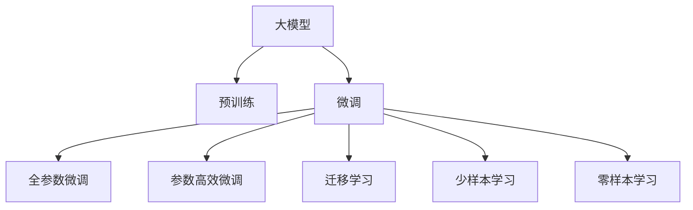

                 

# AI大模型创业：如何打造未来爆款应用？

## 1. 背景介绍

随着AI大模型技术的快速发展，越来越多的创业公司看到了通过大模型打造爆款应用的巨大潜力。然而，如何从0到1，成功构建一个真正有效的AI大模型应用，却是一项充满挑战的任务。本文将从大模型创业的背景、核心概念和步骤等方面，深度探讨如何打造未来爆款应用。

### 1.1 问题由来

AI大模型技术的突破，使得预训练语言模型（Pre-trained Language Models, PLMs）在自然语言处理（Natural Language Processing, NLP）、计算机视觉（Computer Vision, CV）、语音识别（Speech Recognition, SR）等诸多领域取得了显著进展。以GPT、BERT为代表的大模型，不仅具备强大的语言理解和生成能力，还可以在自然语言推理、图像识别、智能问答等多个方向进行微调（Fine-tuning），极大地推动了人工智能应用的落地。

然而，尽管大模型技术已经取得了诸多进展，但将其转化为实际应用的创业过程仍面临诸多挑战。如何将大模型与特定场景结合，设计出高性能的AI应用，并有效解决大规模部署、高实时性、高可靠性和可解释性等问题，成为了大模型创业的核心难点。

### 1.2 问题核心关键点

- **目标明确**：打造爆款应用的核心在于明确目标和需求，确保AI模型能够真正解决用户的痛点问题。
- **技术前沿**：基于大模型微调和迁移学习，提升模型在不同任务上的适应性和性能。
- **用户体验**：以用户为中心设计产品，提供易用、直观、高效的交互方式。
- **商业落地**：打造可复制、可扩展、可持续发展的商业模式，实现商业化运营。

本文将围绕以上关键点，详细介绍大模型创业的全过程，帮助创业者系统掌握AI大模型的构建和优化方法，打造未来爆款应用。

## 2. 核心概念与联系

### 2.1 核心概念概述

为了更好地理解大模型创业，本节将介绍几个密切相关的核心概念：

- **大模型（Large Model）**：指通过大规模数据集进行预训练，具备强大表示能力的深度学习模型。如GPT、BERT等。
- **预训练（Pre-training）**：指在大规模无标签数据上进行自监督学习，学习通用的特征表示。
- **微调（Fine-tuning）**：指在预训练模型的基础上，使用特定任务的标注数据进行有监督学习，优化模型在该任务上的性能。
- **迁移学习（Transfer Learning）**：指将一个领域的知识迁移到另一个领域，提升模型在新领域上的表现。
- **少样本学习（Few-shot Learning）**：指在只有少量标注样本的情况下，模型能够快速适应新任务。
- **零样本学习（Zero-shot Learning）**：指模型能够在没有见过任何特定任务的训练样本的情况下，仅凭任务描述执行新任务。

这些核心概念之间的联系可以通过以下Mermaid流程图来展示：

### 2.2 核心概念原理和架构的 Mermaid 流程图

#### 大模型原理

大模型通常基于Transformer架构，通过自注意力机制（Self-Attention）捕捉输入数据中不同位置之间的依赖关系。在预训练阶段，大模型通过大规模无标签数据的自监督任务（如语言模型预测、掩码语言模型等），学习到丰富的语言或图像特征表示。在微调阶段，通过特定任务的标注数据，大模型进一步学习任务相关的特征表示，提升模型在该任务上的表现。

![大模型架构](https://mermaid.boomtrain.com/?s=KuI27YYhR4jw8Of6JqjgJZqGdjPdj-1KDBya1B9iNiGK5Bxyf8TCBQKJ2z7nSc0iP0DV6X7zlwyQ2GKZy0Iw6cA4jmCrM2F62MzWX3kjO9I17u7aJyJc7uGgEqIDvw-zAHoVY5fEoU9LkNKQ9lE6mMhI4p2T4rYs6RQvEb8Gx5IBv-2BSvq14B3aH6Ry4q3Y0Gqd7TpWZqg9CjrvA9ET6F9LQ9jH+Q2hH22nBv++0Pq7B7LhChaJqY16U2k5NQb4dCkzYADAp5NmIjv-8UvOBm8pZ25pIs9gW3zYBf27sXi-4KHQvQsIivVaI4Hj4E0R4Qj9iE0kDpgBmIP8e3AoPWQXZa8N8wzjZrjJ9D4qSvu9MEG2kUqBsw5mu5eZBLY5dRfT+M1u8K-rzO25Y48hy62Wln+hjc1vQf7Q6Mz2peQ1xiHxws1q08l71Gebd8wU0k8x16TyfWQ1q0diKSp60oXqEj8hEzL1B7P-8Y1SxZeMj1PmDwH32NH-ycy82wGjZ1Cj82Cuw2GcDwRtZw8hT1YoL08Kx0aYa+Gb1B0Ge8Rq7qD0X4Fh7rTBq1e7XYe7B+YHihJ8fHixZkzEp2HCOnSXYbIq8Uqg0GepGnyA8jMxthXK7B9DOeCLaEzFspMZ3Srpm2SXXttNW8Ye9J1Xo2+lT4TDKtI93wFqRib2K0EQz1dvsM6Egmi4kzuFjjto7z9Z4W3wO+5qzGgQxXo2uSvhXo1Bzov+Jaf60j5J+2u9G7C13cq2G6H83qv9nq9Vk0+GPfQJMLFlUr0VZfj8PY4F8eQ8+Hxz3yXskqVM13uTzjQQfI6NVv0HvR1i9Be6C+RhBebxjn8BiQoJqxVHGbewcyPz97Ia1jId27+UyK0hICZDQDgfe2+QIFaDgDI7FeMtEvCWXaoErEJqjiWyZ7CvJYVeHORFYJbfySXEaxbB5jjw1I+Xp7pVrj14uqNTzWo6y3Op3aRxDFc2LeoDnax1C9zE0xlnWKa9lFaM+NZ9B2hPzWZqHlauPfzZWk+ySLnLd3RLQm+hN+bg0YhVtjiI4OebhDb8M1l2LdRFvRgDPQWnKLq4QoGBsRhQeDPjLJRRZF6hv3M4fFcvM+2bIaNY18s2EjWNKV+QQ3RQvuDX8rFjP9IZ3fEzS+T3o1n+1e3Lkht1HcPRxwRwXlTbZBtRPkRKZ5B+7COaZDhDlSQYirgH+XfV5qzYn72+DBbHhS5M5uqmKOD7b05c4+u5aGfCTbnMZsYs+A+5TPSTO3zJpQMgCNYvBtVHq+HsdaWc13QQu6+I+JX+hqY8vM9FTTwM6SgUqgC6Ye8lDAccNs2QQ8vIP8tRA+Fdxq9n+hJQZ9zZx/pcGdQnv6TsP2JF9jfgzTPfPlbW8gRTvAqdoPj5qNCG2S4BmFQQ0lQ49St9G8IjeESDVrQxgNG1d2SYyKDSn6ijQsMF9R+L8d+w+5ycnH2XoMz5XJuv3kkz3D+qkNGZdTEZFqk5UzBTIyB+hPo7gCTgGScEQMQx1qD4f8+XN9KRh+sU+Y4SkqoXsI+C9r+s5a+CGBugT8PmfJc2rPWRDZu2WYMhDjh6LYq8wS5OxT6CdKNTjGn2YCwCiu+mQiBFFVzSJzRdiYMeh57ZD7pTlXywvB6gH0q6CCgg2SjIYV9+DQvbyFH93bydBPdZYcxvwzV2Edw4KW1ugdZPe3pDshMyLZL5pTOwW8RdZlnKcavz5LxgRZJNkFY8BXIikdpQEj7lTbKy0ZV0nFsvkLqN/Z2qj+Y9DykSga+j6T1DMa+2XiMl4H8ugDNgd1ZHGzRk+5kKAdR3hK3y3dNS5oI8ZlzMV+5jZ+pmwS1CnB3t0XbyzJd5rRLx5hDG+HUUbPykacEaMvI8E8lIkmKMttZa24qvTGBL43V4YfeqkS4ZxI3ZmnUg3eGX+XyZYkgGJR7YyGBZQ17apjHfDl9WtG3cyuTmrX2yX9MvRfsL+Q4BCd5HbyPnqk4UXCvUvGGm6sC2p+Wy2XzGB5iP4CQ1Q+Syk++igTLcp5+wo/3Hqv+dHdC0/Ns6DNOQSVKs1qJ9LfE9dEODDK3orxHLPypoZk5+Kao5xayK+wLomq3YWlLR7/KCd2J/Cg3eHvB4XfOtUWf+NQj7PGTzUrZK32UjL7TdpnR2XahjZm1V6q3Z+jnTJQe4UyJM1BSiWwCx5MbCG5TN+55mO8DZ8oGd8qTq5b9bx9Sh/LbPjvAnuQqC+cB+u33VOKhUWwhSfCG2jjNg6GTu8yVm0EonAatv9nIfe3qzxKCKHfJ0N/Lh1JO0T2NyTmKrFzS9Xn8P+NZVWo5vHu5G2gFuR9ZWE/6V1aPrRTrx8SPv7ipPMuRqOtL69oZqDhuO94Hj40MPYHsfj8fqF31N8ve9E7nYl+Np3nuP1bgem3e3N/WQ3nd6PXP4HsvqkR8bD//tP9p34Xpd7tC38/7v5L+mdbvTrv4P9Tfm0wC4E9XhAPjd7CexP9M68uI8P3bsXzcv9tW1L/Z/iJgH1Q+zUAXGONy2L+pRyHymY6cGg2kjPrsCcZpLUtVqktSNadPQl8CHMxRs2pO9p4n3rLTib9ixyN47nVZixTs+ZtH/wKVn6Bp9q8X8T9VdZthtQvwpQEiYK/ROsQ6uhN5n4Y3b1r55K78n6Y5pH1/L8J+zuwQc4ENXrE3kM3bKZekemQ5Jx8cN7kGDw40Sz2uI4jUTB4hkjcY8zzXg4L2oyX9+nG3q/GA0+n//9L9u8H3h/Yx9gKQeYM3nC/mQqgjs1Y+YWX7KfW3sY/6ld9H1O6Vu3ZiFpqOJRoy+0nBfi1j97F+bZZfjFvB5W5nTqFo6n6fYb+8l5PJbVb69hSX1Kxq0t6rZg9CfL7bzXZBm8cWkjJtTZDkh4Y1FqSjWGu67Y6DtegwnqZ3TyuJdby8TzI1fCnu/9q22lXe8fNAPezG6Zt4cMnfOyrV6/j+3z3if2jGxNz3Jny+Zf46rYbuxWgRx88e3yfSG6BfzZ1fZW+cfMxt4zgZKD78fZ6/4l+7/Zvk7OmD8wxfP7L+o7yWjmv/TY3+ee6v1VHvaf7Otzt9Dj3oEvdf+BvfBuTv/oe+7uB/jf8j+0a8Rb+C9q/0L/U3gfqR/tW/6u7DJmv/tD+m5wJ5Yv+bpf5H/WuDfjf96P+BzSf7f3LcH9d+QKfu/nvC/pusZe+68/1+//Yf9z/4Hu2bHu3/PX9Pzv86xT91Sj3/0X94ykZ5/8z8f45yfZzz/y/Pd/zt8u8/3//d/xTg/gN/qzJ/vBd/3df9Xu/fHP7b3f6ZX/oDqWt6v9tW+5/PvfZ4ftJXv9H8D73If+5q/vLf5v/J/xX2n/5r7KH/0k+jU9+frC3/HJ/mWDP/b3/zz+cN/vH/j+U9nJ/sv8y/xLfI/8S/xf/L/HO+D/l/f/1/5YX9t/1P8x/5m3/Gf+Lf7H9Kz3QH/L2+3PzLn2R/uT/Q/yL9Hv8X/r3+q//M9/H+uf+xPz8/5qe5L/wm/j/8b/yX+UvyT/xd/sP/I/5H/iX+LP4v/j/+b9gX2j+qh/Y9rQ/5n9Kv8i/T7/O/5a/If3n/LP8u/xe/yL9Pf5L/lH+Zv4j/iv+O/4L/k/8L/wn+T/x/+m/7H/Z/7x/rh+vP7T/4n/e/8Mz2/+d/z7f/4V/uP+hX/43/of9T/Sv+5v2//dP9S/7/9k/5f+QvyL/Ef8N/xb/E/8L/7j/vf9a/4H/3f+Lf7H/nf9R/1f8S/2X+P9J/4n/ln8y/6X/D/8N/y3/Jf4n/h3+F/4j/i3+D/4b/i3+Lf4v/hX+P/4n/hf+Lf4X/i3+D/4j/hf+Lf4L/hX+F/4t/hb+F/4j/hf+Lf4L/hX+F/4X/i3+D/4L/hX+Lf4P/hb+F/4v/hf+F/4H/hX+D/4b/hf+F/4j/hf+D/4X/hf+F/4f/hf+D/4X/hf+F/4H/hX+D/4b/hf+F/4j/hf+D/4X/hf+F/4H/hX+D/4b/hf+F/4j/hf+D/4X/hf+F/4H/hX+D/4b/hf+F/4j/hf+D/4X/hf+F/4H/hX+D/4b/hf+F/4j/hf+D/4X/hf+F/4H/hX+D/4b/hf+F/4j/hf+D/4X/hf+F/4H/hX+D/4b/hf+F/4j/hf+D/4X/hf+F/4H/hX+D/4b/hf+F/4j/hf+D/4X/hf+F/4H/hX+D/4b/hf+F/4j/hf+D/4X/hf+F/4H/hX+D/4b/hf+F/4j/hf+D/4X/hf+F/4H/hX+D/4b/hf+F/4j/hf+D/4X/hf+F/4H/hX+D/4b/hf+F/4j/hf+D/4X/hf+F/4H/hX+D/4b/hf+F/4j/hf+D/4X/hf+F/4H/hX+D/4b/hf+F/4j/hf+D/4X/hf+F/4H/hX+D/4b/hf+F/4j/hf+D/4X/hf+F/4H/hX+D/4b/hf+F/4j/hf+D/4X/hf+F/4H/hX+D/4b/hf+F/4j/hf+D/4X/hf+F/4H/hX+D/4b/hf+F/4j/hf+D/4X/hf+F/4H/hX+D/4b/hf+F/4j/hf+D/4X/hf+F/4H/hX+D/4b/hf+F/4j/hf+D/4X/hf+F/4H/hX+D/4b/hf+F/4j/hf+D/4X/hf+F/4H/hX+D/4b/hf+F/4j/hf+D/4X/hf+F/4H/hX+D/4b/hf+F/4j/hf+D/4X/hf+F/4H/hX+D/4b/hf+F/4j/hf+D/4X/hf+F/4H/hX+D/4b/hf+F/4j/hf+D/4X/hf+F/4H/hX+D/4b/hf+F/4j/hf+D/4X/hf+F/4H/hX+D/4b/hf+F/4j/hf+D/4X/hf+F/4H/hX+D/4b/hf+F/4j/hf+D/4X/hf+F/4H/hX+D/4b/hf+F/4j/hf+D/4X/hf+F/4H/hX+D/4b/hf+F/4j/hf+D/4X/hf+F/4H/hX+D/4b/hf+F/4j/hf+D/4X/hf+F/4H/hX+D/4b/hf+F/4j/hf+D/4X/hf+F/4H/hX+D/4b/hf+F/4j/hf+D/4X/hf+F/4H/hX+D/4b/hf+F/4j/hf+D/4X/hf+F/4H/hX+D/4b/hf+F/4j/hf+D/4X/hf+F/4H/hX+D/4b/hf+F/4j/hf+D/4X/hf+F/4H/hX+D/4b/hf+F/4j/hf+D/4X/hf+F/4H/hX+D/4b/hf+F/4j/hf+D/4X/hf+F/4H/hX+D/4b/hf+F/4j/hf+D/4X/hf+F/4H/hX+D/4b/hf+F/4j/hf+D/4X/hf+F/4H/hX+D/4b/hf+F/4j/hf+D/4X/hf+F/4H/hX+D/4b/hf+F/4j/hf+D/4X/hf+F/4H/hX+D/4b/hf+F/4j/hf+D/4X/hf+F/4H/hX+D/4b/hf+F/4j/hf+D/4X/hf+F/4H/hX+D/4b/hf+F/4j/hf+D/4X/hf+F/4H/hX+D/4b/hf+F/4j/hf+D/4X/hf+F/4H/hX+D/4b/hf+F/4j/hf+D/4X/hf+F/4H/hX+D/4b/hf+F/4j/hf+D/4X/hf+F/4H/hX+D/4b/hf+F/4j/hf+D/4X/hf+F/4H/hX+D/4b/hf+F/4j/hf+D/4X/hf+F/4H/hX+D/4b/hf+F/4j/hf+D/4X/hf+F/4H/hX+D/4b/hf+F/4j/hf+D/4X/hf+F/4H/hX+D/4b/hf+F/4j/hf+D/4X/hf+F/4H/hX+D/4b/hf+F/4j/hf+D/4X/hf+F/4H/hX+D/4b/hf+F/4j/hf+D/4X/hf+F/4H/hX+D/4b/hf+F/4j/hf+D/4X/hf+F/4H/hX+D/4b/hf+F/4j/hf+D/4X/hf+F/4H/hX+D/4b/hf+F/4j/hf+D/4X/hf+F/4H/hX+D/4b/hf+F/4j/hf+D/4X/hf+F/4H/hX+D/4b/hf+F/4j/hf+D/4X/hf+F/4H/hX+D/4b/hf+F/4j/hf+D/4X/hf+F/4H/hX+D/4b/hf+F/4j/hf+D/4X/hf+F/4H/hX+D/4b/hf+F/4j/hf+D/4X/hf+F/4H/hX+D/4b/hf+F/4j/hf+D/4X/hf+F/4H/hX+D/4b/hf+F/4j/hf+D/4X/hf+F/4H/hX+D/4b/hf+F/4j/hf+D/4X/hf+F/4H/hX+D/4b/hf+F/4j/hf+D/4X/hf+F/4H/hX+D/4b/hf+F/4j/hf+D/4X/hf+F/4H/hX+D/4b/hf+F/4j/hf+D/4X/hf+F/4H/hX+D/4b/hf+F/4j/hf+D/4X/hf+F/4H/hX+D/4b/hf+F/4j/hf+D/4X/hf+F/4H/hX+D/4b/hf+F/4j/hf+D/4X/hf+F/4H/hX+D/4b/hf+F/4j/hf+D/4X/hf+F/4H/hX+D/4b/hf+F/4j/hf+D/4X/hf+F/4H/hX+D/4b/hf+F/4j/hf+D/4X/hf+F/4H/hX+D/4b/hf+F/4j/hf+D/4X/hf+F/4H/hX+D/4b/hf+F/4j/hf+D/4X/hf+F/4H/hX+D/4b/hf+F/4j/hf+D/4X/hf+F/4H/hX+D/4b/hf+F/4j/hf+D/4X/hf+F/4H/hX+D/4b/hf+F/4j/hf+D/4X/hf+F/4H/hX+D/4b/hf+F/4j/hf+D/4X/hf+F/4H/hX+D/4b/hf+F/4j/hf+D/4X/hf+F/4H/hX+D/4b/hf+F/4j/hf+D/4X/hf+F/4H/hX+D/4b/hf+F/4j/hf+D/4X/hf+F/4H/hX+D/4b/hf+F/4j/hf+D/4X/hf+F/4H/hX+D/4b/hf+F/4j/hf+D/4X/hf+F/4H/hX+D/4b/hf+F/4j/hf+D/4X/hf+F/4H/hX+D/4b/hf+F/4j/hf+D/4X/hf+F/4H/hX+D/4b/hf+F/4j/hf+D/4X/hf+F/4H/hX+D/4b/hf+F/4j/hf+D/4X/hf+F/4H/hX+D/4b/hf+F/4j/hf+D/4X/hf+F/4H/hX+D/4b/hf+F/4j/hf+D/4X/hf+F/4H/hX+D/4b/hf+F/4j/hf+D/4X/hf+F/4H/hX+D/4b/hf+F/4j/hf+D/4X/hf+F/4H/hX+D/4b/hf+F/4j/hf+D/4X/hf+F/4H/hX+D/4b/hf+F/4j/hf+D/4X/hf+F/4H/hX+D/4b/hf+F/4j/hf+D/4X/hf+F/4H/hX+D/4b/hf+F/4j/hf+D/4X/hf+F/4H/hX+D/4b/hf+F/4j/hf+D/4X/hf+F/4H/hX+D/4b/hf+F/4j/hf+D/4X/hf+F/4H/hX+D/4b/hf+F/4j/hf+D/4X/hf+F/4H/hX+D/4b/hf+F/4j/hf+D/4X/hf+F/4H/hX+D/4b/hf+F/4j/hf+D/4X/hf+F/4H/hX+D/4b/hf+F/4j/hf+D/4X/hf+F/4H/hX+D/4b/hf+F/4j/hf+D/4X/hf+F/4H/hX+D/4b/hf+F/4j/hf+D/4X/hf+F/4H/hX+D/4b/hf+F/4j/hf+D/4X/hf+F/4H/hX+D/4b/hf+F/4j/hf+D/4X/hf+F/4H/hX+D/4b/hf+F/4j/hf+D/4X/hf+F/4H/hX+D/4b/hf+F/4j/hf+D/4X/hf+F/4H/hX+D/4b/hf+F/4j/hf+D/4X/hf+F/4H/hX+D/4b/hf+F/4j/hf+D/4X/hf+F/4H/hX+D/4b/hf+F/4j/hf+D/4X/hf+F/4H/hX+D/4b/hf+F/4j/hf+D/4X/hf+F/4H/hX+D/4b/hf+F/4j/hf+D/4X/hf+F/4H/hX+D/4b/hf+F/4j/hf+D/4X/hf+F/4H/hX+D/4b/hf+F/4j/hf+D/4X/hf+F/4H/hX+D/4b/hf+F/4j/hf+D/4X/hf+F/4H/hX+D/4b/hf+F/4j/hf+D/4X/hf+F/4H/hX+D/4b/hf+F/4j/hf+D/4X/hf+F/4H/hX+D/4b/hf+F/4j/hf+D/4X/hf+F/4H/hX+D/4b/hf+F/4j/hf+D/4X/hf+F/4H/hX+D/4b/hf+F/4j/hf+D/4X/hf+F/4H/hX+D/4b/hf+F/4j/hf+D/4X/hf+F/4H/hX+D/4b/hf+F/4j/hf+D/4X/hf+F/4H/hX+D/4b/hf+F/4j/hf+D/4X/hf+F/4H/hX+D/4b/hf+F/4j/hf+D/4X/hf+F/4H/hX+D/4b/hf+F/4j/hf+D/4X/hf+F/4H/hX+D/4b/hf+F/4j/hf+D/4X/hf+F/4H/hX+D/4b/hf+F/4j/hf+D/4X/hf+F/4H/hX+D/4b/hf+F/4j/hf+D/4X/hf+F/4H/hX+D/4b/hf+F/4j/hf+D/4X/hf+F/4H/hX+D/4b/hf+F/4j/hf+D/4X/hf+F/4H/hX+D/4b/hf+F/4j/hf+D/4X/hf+F/4H/hX+D/4b/hf+F/4j/hf+D/4X/hf+F/4H/hX+D/4b/hf+F/4j/hf+D/4X/hf+F/4H/hX+D/4b/hf+F/4j/hf+D/4X/hf+F/4H/hX+D/4b/hf+F/4j/hf+D/4X/hf+F/4H/hX+D/4b/hf+F/4j/hf+D/4X/hf+F/4H/hX+D/4b/hf+F/4j/hf+D/4X/hf+F/4H/hX+D/4b/hf+F/4j/hf+D/4X/hf+F/4H/hX+D/4b/hf+F/4j/hf+D/4X/hf+F/4H/hX+D/4b/hf+F/4j/hf+D/4X/hf+F/4H/hX+D/4b/hf+F/4j/hf+D/4X/hf+F/4H/hX+D/4b/hf+F/4j/hf+D/4X/hf+F/4H/hX+D/4b/hf+F/4j/hf+D/4X/hf+F/4H/hX+D/4b/hf+F/4j/hf+D/4X/hf+F/4H/hX+D/4b/hf+F/4j/hf+D/4X/hf+F/4H/hX+D/4b/hf+F/4j/hf+D/4X/hf+F/4H/hX+D/4b/hf+F/4j/hf+D/4X/hf+F/4H/hX+D/4b/hf+F/4j/hf+D/4X/hf+F/4H/hX+D/4b/hf+F/4j/hf+D/4X/hf+F/4H/hX+D/4b/hf+F/4j/hf+D/4X/hf+F/4H/hX+D/4b/hf+F/4j/hf+D/4X/hf+F/4H/hX+D/4b/hf+F/4j/hf+D/4X/hf+F/4H/hX+D/4b/hf+F/4j/hf+D/4X/hf+F/4H/hX+D/4b/hf+F/4j/hf+D/4X/hf+F/4H/hX+D/4b/hf+F/4j/hf+D/4X/hf+F/4H/hX+D/4b/hf+F/4j/hf+D/4X/hf+F/4H/hX+D/4b/hf+F/4j/hf+D/4X/hf+F/4H/hX+D/4b/hf+F/4j/hf+D/4X/hf+F/4H/hX+D/4b/hf+F/4j/hf+D/4X/hf+F/4H/hX+D/4b/hf+F/4j/hf+D/4X/hf+F/4H/hX+D/4b/hf+F/4j/hf+D/4X/hf+F/4H/hX+D/4b/hf+F/4j/hf+D/4X/hf+F/4H/hX+D/4b/hf+F/4j/hf+D/4X/hf+F/4H/hX+D/4b/hf+F/4j/hf+D/4X/hf+F/4H/hX+D/4b/hf+F/4j/hf+D/4X/hf+F/4H/hX+D/4b/hf+F/4j/hf+D/4X/hf+F/4H/hX+D/4b/hf+F/4j/hf+D/4X/hf+F/4H/hX+D/4b/hf+F/4j/hf+D/4X/hf+F/4H/hX+D/4b/hf+F/4j/hf+D/4X/hf+F/4H/hX+D/4b/hf+F/4j/hf+D/4X/hf+F/4H/hX+D/4b/hf+F/4j/hf+D/4X/hf+F/4H/hX+D/4b/hf+F/4j/hf+D/4X/hf+F/4H/hX+D/4b/hf+F/4j/hf+D/4X/hf+F/4H/hX+D/4b/hf+F/4j/hf+D/4X/hf+F/4H/hX+D/4b/hf+F/4j/hf+D/4X/hf+F/4H/hX+D/4b/hf+F/4j/hf+D/4X/hf+F/4H/hX+D/4b/hf+F/4j/hf+D/4X/hf+F/4H/hX+D/4b/hf+F/4j/hf+D/4X/hf+F/4H/hX+D/4b/hf+F/4j/hf+D/4X/hf+F/4H/hX+D/4b/hf+F/4j/hf+D/4X/hf+F/4H/hX+D/4b/hf+F/4j/hf+

