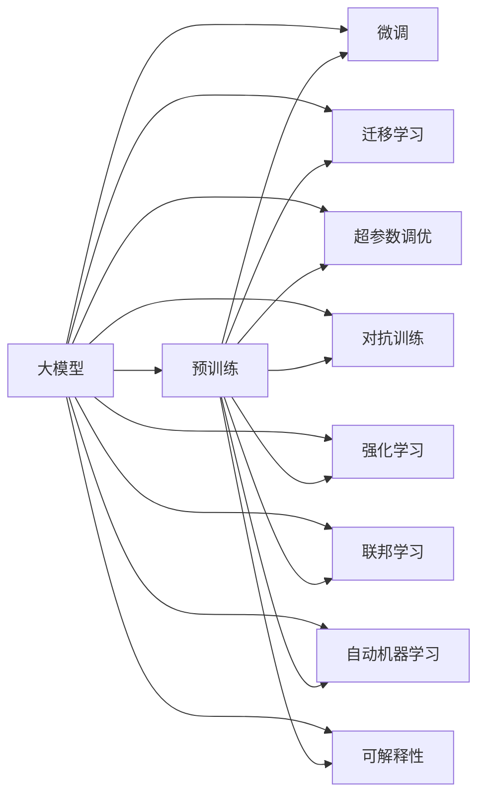

                 

## 1. 背景介绍

在人工智能（AI）领域，大模型的兴起引发了一波创业热潮。从自然语言处理（NLP）到计算机视觉（CV），从游戏生成到推荐系统，大模型技术在各个领域展现出巨大的潜力。大模型如GPT、BERT、DALL-E等，因其强大的表现力、广泛的适用性和巨大的商业潜力，吸引了众多创业者、科研人员和投资者的关注。

本文旨在从多个维度深入剖析大模型创业的机遇与挑战，帮助读者全面理解大模型创业的潜力、当前的主要模式和未来发展方向，为有意进入该领域的创业者提供有益的指导。

## 2. 核心概念与联系

### 2.1 核心概念概述

- **大模型（Large Model）**：指拥有数十亿或更多参数的深度学习模型，例如GPT-3、BERT、DALL-E等。这些模型在预训练阶段通过大规模数据进行训练，拥有广泛的语言、视觉等领域的知识和表示能力。

- **预训练（Pre-training）**：在大模型上进行的无监督学习过程，目的是学习通用的语言、视觉表示。预训练完成后，大模型可以应用于各种任务。

- **微调（Fine-tuning）**：在大模型的基础上，通过有监督的数据进一步训练模型，使其在特定任务上表现更优。微调通常使用小规模的标注数据。

- **迁移学习（Transfer Learning）**：利用预训练模型的知识，在目标任务上进行微调，可以显著减少训练时间和数据需求。

- **超参数调优（Hyperparameter Tuning）**：调整模型训练过程中的各种参数（如学习率、批大小等），以优化模型性能。

- **强化学习（Reinforcement Learning, RL）**：一种通过与环境交互，通过奖励机制学习策略的机器学习方式。

- **对抗训练（Adversarial Training）**：通过引入对抗样本，提高模型对噪音和攻击的鲁棒性。

- **联邦学习（Federated Learning）**：一种分布式学习方式，允许不同设备或服务器的用户数据本地化，而不需要共享模型参数。

- **自动机器学习（AutoML）**：利用自动化技术简化机器学习模型的构建和调优过程。

- **可解释性（Explainability）**：使机器学习模型的决策过程可以被人类理解和解释，减少模型“黑盒”问题。

这些核心概念构成了大模型创业的基础，了解这些概念将帮助创业者在复杂的技术环境中保持清晰的思路。

### 2.2 核心概念原理和架构的 Mermaid 流程图



## 3. 核心算法原理 & 具体操作步骤

### 3.1 算法原理概述

大模型创业的核心在于利用大模型的能力，通过微调、迁移学习等方式，在特定任务上实现高效、准确的模型构建和应用。

1. **预训练**：在大规模数据上训练大模型，学习通用的语言或视觉表示。例如，GPT-3在约1,757亿个标记的文本上进行了预训练。

2. **微调**：在特定任务上，使用小规模的标注数据对预训练模型进行微调，以优化模型在该任务上的性能。例如，使用微调后的BERT模型在新闻分类任务上，可以获得与从头训练模型相当的性能。

3. **迁移学习**：将预训练模型应用到不同的任务上，利用已有知识加速新任务的学习。例如，使用在图像分类上预训练的模型，可以在目标任务上获得更好的效果。

4. **超参数调优**：通过调整模型的训练参数，优化模型性能。例如，调整学习率、批大小等参数，以获得更好的收敛速度和性能。

5. **对抗训练**：通过引入对抗样本，增强模型对攻击的鲁棒性。例如，使用对抗样本来训练模型，使其更难被欺骗。

6. **强化学习**：通过与环境的交互，学习策略以优化模型在特定任务上的表现。例如，使用强化学习训练游戏生成模型，使其能够生成高质量的游戏角色。

7. **联邦学习**：在分布式环境中，利用本地数据训练模型，以保护隐私和数据安全。例如，各设备在本地训练模型，然后将模型参数汇总更新。

8. **自动机器学习**：利用自动化技术简化机器学习模型的构建和调优过程，加速模型开发。例如，使用AutoML工具自动选择最优模型和超参数。

9. **可解释性**：使机器学习模型的决策过程可以被人类理解和解释，减少模型“黑盒”问题。例如，通过可视化技术展示模型的推理过程。

### 3.2 算法步骤详解

1. **数据准备**：收集和预处理任务数据，标注数据，分为训练集、验证集和测试集。

2. **模型选择**：选择合适的大模型作为初始化参数，例如GPT-3、BERT等。

3. **模型微调**：在特定任务上，使用小规模的标注数据对预训练模型进行微调，优化模型在该任务上的性能。

4. **超参数调优**：调整模型的训练参数，优化模型性能。

5. **模型评估**：在验证集和测试集上评估模型的性能，调整模型参数和训练策略。

6. **模型部署**：将模型集成到应用系统中，进行在线或离线推理。

### 3.3 算法优缺点

**优点**：

- 可以显著减少从头训练模型的时间和成本。
- 能够利用大模型的通用知识和表示能力，提高模型性能。
- 可以跨多个任务进行迁移学习，提升模型泛化能力。
- 可以自动进行超参数调优，加速模型开发。
- 可以提升模型的鲁棒性和安全性。

**缺点**：

- 对标注数据的需求较高，获取高质量标注数据成本较高。
- 微调过程容易过拟合，需要大量正则化技术。
- 微调后的模型可能仍存在偏差和有害信息。
- 大模型需要大量计算资源，训练和推理成本较高。
- 模型的可解释性较差，难以解释模型决策过程。

### 3.4 算法应用领域

大模型创业可以在多个领域实现广泛应用：

- **自然语言处理（NLP）**：包括文本分类、命名实体识别、情感分析、机器翻译、对话系统等。
- **计算机视觉（CV）**：包括图像分类、目标检测、图像生成、人脸识别等。
- **游戏生成**：包括游戏角色、关卡、对话等生成。
- **推荐系统**：包括电商推荐、内容推荐、广告推荐等。
- **医疗健康**：包括医学影像分析、药物研发等。
- **金融服务**：包括风险评估、客户分析、投资建议等。
- **能源环保**：包括能源消耗分析、环境监测等。
- **自动驾驶**：包括路况分析、驾驶行为预测等。
- **智慧城市**：包括智能交通、公共安全、城市管理等。

## 4. 数学模型和公式 & 详细讲解 & 举例说明

### 4.1 数学模型构建

在自然语言处理任务中，可以使用Transformer模型作为预训练模型。Transformer模型的基本结构如下：

```text
Transformer Model = Multi-Head Attention + Positional Encoding + FFN + LayerNorm
```

其中，Multi-Head Attention用于捕捉输入序列中的相关性；Positional Encoding用于引入序列位置信息；FFN（Feed Forward Network）用于增强模型表达能力；LayerNorm用于归一化模型输出。

### 4.2 公式推导过程

以BERT模型为例，其预训练任务包括掩码语言模型（Masked Language Modeling, MLM）和下一句预测（Next Sentence Prediction, NSP）。

- MLM任务的目标是预测被掩盖的单词。假设输入序列为$X$，掩盖单词为$M(X)$，预训练目标函数为：

$$
L_{MLM} = -\frac{1}{N} \sum_{i=1}^N \sum_{j=1}^N \log(p_j)
$$

其中，$p_j$为预测正确概率。

- NSP任务的目标是预测两个句子是否连续。假设输入序列为$(X, Y)$，预训练目标函数为：

$$
L_{NSP} = -\frac{1}{N} \sum_{i=1}^N (\log(p_{X,Y}) + \log(p_{Y,X}))
$$

其中，$p_{X,Y}$为$X$和$Y$连续的概率。

### 4.3 案例分析与讲解

假设我们有一个二分类任务，使用BERT模型进行微调。

1. **数据准备**：收集标注数据，划分为训练集、验证集和测试集。

2. **模型选择**：选择BERT模型作为初始化参数。

3. **微调**：使用训练集进行微调，优化模型在该任务上的性能。

4. **模型评估**：在验证集和测试集上评估模型性能，调整模型参数和训练策略。

5. **模型部署**：将模型集成到应用系统中，进行在线或离线推理。

## 5. 项目实践：代码实例和详细解释说明

### 5.1 开发环境搭建

- **安装Python**：安装最新版本的Python，建议选择Anaconda或Miniconda。
- **安装TensorFlow**：使用pip安装TensorFlow和TensorFlow Hub。
- **安装BERT模型**：从TensorFlow Hub下载预训练的BERT模型。

### 5.2 源代码详细实现

以下是使用TensorFlow Hub进行BERT微调的代码实现：

```python
import tensorflow as tf
import tensorflow_hub as hub

# 加载预训练的BERT模型
model = hub.KerasLayer('https://tfhub.dev/google/bert_multi_cased_L-12_H-768_A-12/2')

# 定义微调模型
class BERTForSequenceClassification(tf.keras.Model):
    def __init__(self, num_classes):
        super(BERTForSequenceClassification, self).__init__()
        self.num_classes = num_classes
        self.bert = model
        self.classifier = tf.keras.layers.Dense(num_classes, activation='softmax')
        
    def call(self, inputs, training=False):
        sequence_output, pooled_output = self.bert(inputs, return_dict=True)
        output = self.classifier(pooled_output)
        return output
```

### 5.3 代码解读与分析

**代码解释**：
- 使用TensorFlow Hub加载预训练的BERT模型。
- 定义BERTForSequenceClassification模型，用于二分类任务。
- 模型调用时，首先通过BERT模型获取序列输出和池化输出，然后通过Dense层进行分类。

**分析**：
- 该代码实现了基于BERT的微调模型，通过TensorFlow Hub加载预训练模型，简化了模型构建过程。
- 使用自定义模型BERTForSequenceClassification，实现序列分类任务。
- 模型结构简单，易于理解和扩展。

### 5.4 运行结果展示

运行上述代码，可以得到模型在特定任务上的表现。例如，在二分类任务上，模型可以在验证集上获得较高的准确率。

## 6. 实际应用场景

### 6.1 金融服务

在金融服务领域，大模型可以用于客户行为分析、风险评估、投资建议等。例如，使用BERT模型对客户评论进行分析，提取情绪和情感，评估客户满意度，帮助银行制定更有针对性的服务策略。

### 6.2 医疗健康

在医疗健康领域，大模型可以用于医学影像分析、疾病诊断、药物研发等。例如，使用BERT模型对电子病历进行分析，提取医生的诊断建议，辅助临床决策。

### 6.3 智慧城市

在智慧城市领域，大模型可以用于智能交通、公共安全、城市管理等。例如，使用BERT模型对交通监控视频进行分析，识别违规行为，提高城市管理效率。

### 6.4 未来应用展望

未来，大模型将进一步扩展其应用领域，包括能源环保、自动驾驶、智能制造等。同时，大模型将与AI的其他技术（如强化学习、联邦学习）相结合，形成更加强大的AI系统。

## 7. 工具和资源推荐

### 7.1 学习资源推荐

- **自然语言处理基础**：斯坦福大学《自然语言处理》课程。
- **深度学习与机器学习基础**：Coursera《Deep Learning Specialization》。
- **AutoML工具**：Hugging Face的Transformers库。
- **联邦学习**：Google的Federated Learning with TensorFlow。
- **强化学习**：DeepMind的《Reinforcement Learning》课程。

### 7.2 开发工具推荐

- **Python**：作为数据科学和机器学习的首选编程语言，具有丰富的开源库和社区支持。
- **TensorFlow**：Google开源的深度学习框架，广泛应用于生产环境。
- **PyTorch**：Facebook开源的深度学习框架，以其动态计算图和易用性著称。
- **Jupyter Notebook**：用于数据科学和机器学习的交互式开发环境。
- **GitHub**：开源代码托管平台，方便版本控制和协作开发。

### 7.3 相关论文推荐

- **BERT**：《BERT: Pre-training of Deep Bidirectional Transformers for Language Understanding》。
- **GPT-3**：《Language Models are Unsupervised Multitask Learners》。
- **AutoML**：《AutoML: Towards Automated Machine Learning with Human-in-the-Loop》。
- **Federated Learning**：《Communication-Efficient Learning of Deep Models from Decentralized Data》。
- **Reinforcement Learning**：《Reinforcement Learning: An Introduction》。

## 8. 总结：未来发展趋势与挑战

### 8.1 研究成果总结

大模型创业以其高效的模型构建和应用能力，成为当前AI领域的重要发展方向。大模型在各个领域的应用展示了其强大的潜力和市场前景。然而，大模型的发展也面临诸多挑战，包括标注数据需求高、过拟合问题、可解释性不足等。

### 8.2 未来发展趋势

- **模型规模进一步增大**：预训练模型的参数量将不断增加，提升模型表示能力。
- **分布式训练**：随着数据量增大，分布式训练将变得更加重要。
- **可解释性增强**：未来的模型将更加注重可解释性，提升用户信任度。
- **跨领域应用扩展**：大模型将更多地应用于跨领域的知识整合和应用。
- **隐私保护**：联邦学习和差分隐私等技术将进一步发展，保障数据隐私。
- **伦理和公平性**：大模型将在设计中考虑伦理和公平性问题，减少偏见和歧视。

### 8.3 面临的挑战

- **数据获取和标注**：获取高质量的标注数据仍然是一个挑战，特别是在特定领域。
- **模型泛化能力**：大模型需要具备更强的泛化能力，以应对不同的数据分布。
- **过拟合问题**：大模型容易过拟合，需要更多正则化技术和优化策略。
- **可解释性**：大模型的决策过程难以解释，需要更多技术手段提升可解释性。
- **计算资源**：大模型的计算需求高，需要更多的计算资源和优化技术。

### 8.4 研究展望

- **跨领域知识整合**：将符号化的先验知识与神经网络模型结合，增强模型表示能力。
- **强化学习和联邦学习**：结合强化学习和联邦学习，提升模型的鲁棒性和隐私保护。
- **可解释性技术**：研究更有效的可解释性技术，提升用户信任度。
- **伦理和公平性**：研究伦理和公平性问题，减少偏见和歧视。
- **自动机器学习**：利用自动机器学习技术，简化模型构建和调优过程。

## 9. 附录：常见问题与解答

**Q1: 大模型创业的盈利模式有哪些？**

A: 大模型创业的盈利模式主要包括：

- **SaaS服务**：提供大模型的API接口，按使用量或用户数收费。
- **数据服务**：提供预训练数据集和微调数据集，按数量收费。
- **定制开发**：提供定制化的大模型开发服务，按项目收费。
- **咨询和培训**：提供大模型开发咨询和培训服务，按小时收费。

**Q2: 如何构建大模型创业团队？**

A: 构建大模型创业团队需要具备以下技能：

- **数据科学家**：负责数据处理和模型构建。
- **软件工程师**：负责系统开发和部署。
- **产品经理**：负责市场调研和产品规划。
- **市场推广**：负责市场推广和客户服务。
- **法律顾问**：负责法律合规和知识产权保护。

**Q3: 如何选择合适的预训练模型？**

A: 选择合适的预训练模型需要考虑以下因素：

- **任务相关性**：选择与目标任务相关性高的预训练模型。
- **模型规模**：根据资源限制选择合适的模型规模。
- **社区支持**：选择社区活跃、文档丰富的预训练模型。
- **性能表现**：根据任务需求选择性能表现优异的预训练模型。

**Q4: 大模型创业需要哪些核心技术？**

A: 大模型创业需要以下核心技术：

- **模型构建和微调**：包括模型选择、数据准备、超参数调优等。
- **分布式训练**：包括分布式系统设计、并行计算等。
- **模型优化**：包括量化加速、模型压缩等。
- **模型部署**：包括模型封装、服务化部署等。
- **自动机器学习**：包括自动化模型构建和调优等。

**Q5: 如何提高大模型的可解释性？**

A: 提高大模型的可解释性需要考虑以下方法：

- **可视化技术**：通过可视化技术展示模型推理过程。
- **特征重要性分析**：分析模型输入的特征重要性，帮助解释模型决策。
- **模型解释框架**：使用解释框架（如LIME、SHAP）生成模型解释。

---

作者：禅与计算机程序设计艺术 / Zen and the Art of Computer Programming

