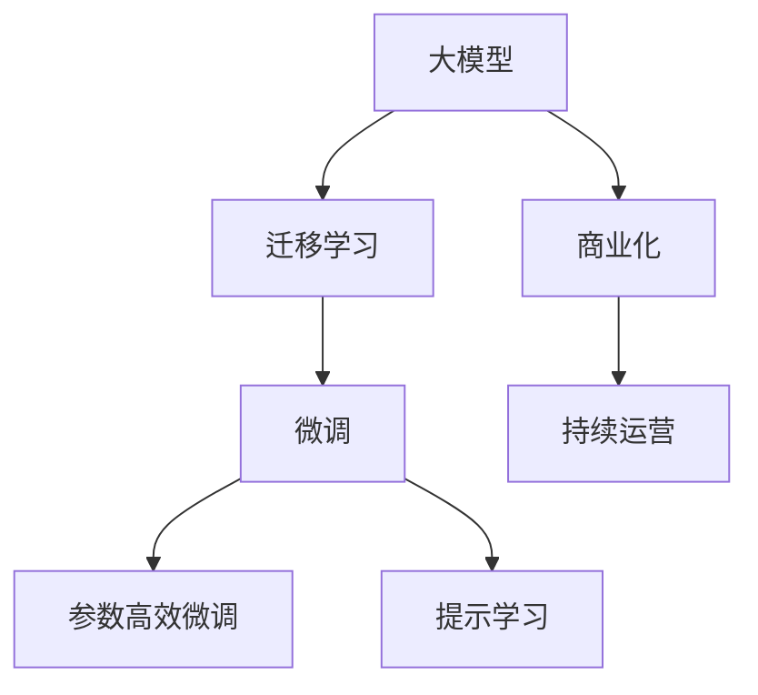

                 

# AI大模型创业：如何构建未来可持续的商业模式？

## 1. 背景介绍

近年来，随着人工智能技术的飞速发展，AI大模型逐渐成为各行各业数字化转型的重要推动力。然而，尽管大模型在技术上取得突破，但在商业化进程中，如何构建可持续的商业模式，依然是许多创业公司面临的巨大挑战。

**背景起因：**
大模型的应用潜力巨大，尤其在自然语言处理、图像识别、推荐系统等领域。但随着模型规模的扩大，数据量的增加，模型的训练和部署成本也在不断上升。尽管某些公司如OpenAI、Google等能够承担这些高昂成本，但对于大多数中小型创业公司而言，构建商业化模型变得异常困难。

## 2. 核心概念与联系

### 2.1 核心概念概述

为了更好地理解AI大模型的商业化过程，我们将介绍几个核心概念：

- **大模型（Large Models）：**指的是训练数据规模极大、模型参数数量极大的深度学习模型。
- **迁移学习（Transfer Learning）：**利用已有的大模型，通过微调等方法，适应特定的应用场景。
- **微调（Fine-Tuning）：**在大模型的基础上，对特定应用场景的数据进行有监督训练，以提升模型在该场景下的性能。
- **参数高效微调（Parameter-Efficient Fine-Tuning, PEFT）：**仅对模型的一部分参数进行微调，以降低计算成本。
- **提示学习（Prompt Learning）：**通过精心的输入设计，减少模型微调参数，实现零样本或少样本学习。
- **商业模式（Business Model）：**指公司如何通过其产品或服务创造、捕获和交付价值，并从中获得盈利的过程。
- **持续运营（Sustainable Operations）：**指企业能在长期运营中保持盈利能力，不断适应外部环境变化的能力。

这些概念之间的联系可以通过以下Mermaid流程图展示：



这个流程图展示了从大模型的研发，到模型应用，再到商业化，最后到持续运营的整个流程。

## 3. 核心算法原理 & 具体操作步骤

### 3.1 算法原理概述

AI大模型的商业化，主要通过迁移学习和微调实现。首先，公司需要收集特定应用场景的数据，然后利用已有的大模型，通过微调方法，使得模型在该场景下表现更好。参数高效微调和提示学习，进一步优化了微调过程，降低了计算成本。

**算法核心思想：**
- 利用大模型已有知识。
- 通过微调提升模型性能。
- 减少微调参数，提高效率。
- 精确定义输入，降低微调数据需求。

### 3.2 算法步骤详解

1. **数据收集与预处理**：
   - 收集应用场景的数据，并进行预处理，如去除噪音、归一化等。
   - 准备训练集、验证集和测试集。

2. **模型选择与适配**：
   - 选择合适的预训练模型，如BERT、GPT等。
   - 适配模型，添加适配层和损失函数。

3. **微调设置**：
   - 设置优化算法、学习率、批大小、迭代轮数等超参数。
   - 应用正则化技术，防止过拟合。
   - 选择参数高效微调方法，如使用Adapter等。

4. **模型训练与评估**：
   - 利用训练集进行模型训练，计算损失函数。
   - 在验证集上评估模型性能，防止过拟合。
   - 调整超参数，重新训练模型。

5. **模型部署与维护**：
   - 将模型部署到实际应用环境中。
   - 持续收集新数据，进行周期性微调。

### 3.3 算法优缺点

**优点：**
- 技术难度较低，易于实现。
- 能够快速适应新场景，提升模型性能。
- 降低计算成本，提高效率。

**缺点：**
- 数据依赖性大，获取成本高。
- 模型通用性差，难以应对特定问题。
- 无法避免模型过拟合和泛化能力不足。

### 3.4 算法应用领域

大模型微调已经在多个领域得到了广泛应用，如：

- **金融：**用于风险评估、欺诈检测等。
- **医疗：**用于疾病诊断、药物研发等。
- **零售：**用于客户推荐、价格预测等。
- **智能客服：**用于对话生成、情感分析等。
- **教育：**用于自动评分、智能辅导等。

## 4. 数学模型和公式 & 详细讲解

### 4.1 数学模型构建

考虑一个简单的分类任务，假设输入为 $x$，输出为 $y$，模型为 $M_{\theta}$，损失函数为 $\ell$。

数学模型可表示为：

$$
\hat{y} = M_{\theta}(x)
$$

### 4.2 公式推导过程

以二分类任务为例，假设模型输出 $\hat{y}$ 为样本属于正类的概率。损失函数 $\ell$ 为交叉熵损失：

$$
\ell(y, \hat{y}) = -[y \log \hat{y} + (1-y) \log (1-\hat{y})]
$$

微调目标为：

$$
\min_{\theta} \frac{1}{N} \sum_{i=1}^N \ell(y_i, M_{\theta}(x_i))
$$

其中 $N$ 为样本数。

### 4.3 案例分析与讲解

假设有一个公司，利用BERT模型进行金融风险评估，步骤如下：

1. 收集历史金融交易数据，进行预处理。
2. 使用微调方法，适配金融领域。
3. 选择AdaLoRA方法进行参数高效微调。
4. 在测试集上评估模型性能，调整超参数。
5. 将模型部署到实际应用中，持续收集新数据进行微调。

## 5. 项目实践：代码实例和详细解释说明

### 5.1 开发环境搭建

1. 安装Python和相关依赖，如TensorFlow、Keras等。
2. 准备数据集，如金融交易数据。
3. 预处理数据，如归一化、特征提取等。
4. 搭建模型，使用BERT作为基础模型。
5. 设置微调参数，如学习率、批大小等。

### 5.2 源代码详细实现

```python
import tensorflow as tf
from transformers import BertTokenizer, BertForSequenceClassification
import pandas as pd

# 数据预处理
train_df = pd.read_csv('train.csv')
test_df = pd.read_csv('test.csv')

# 数据集划分
train_data, test_data = train_df, test_df

# 分词器
tokenizer = BertTokenizer.from_pretrained('bert-base-uncased', do_lower_case=True)

# 定义模型
model = BertForSequenceClassification.from_pretrained('bert-base-uncased', num_labels=2)

# 微调参数
optimizer = tf.keras.optimizers.Adam(learning_rate=1e-5)
num_epochs = 10
batch_size = 32

# 训练集和验证集
train_dataset = train_data.map(lambda x: tokenizer(x['text'], truncation=True, padding='max_length', max_length=256))
train_dataset = train_dataset.shuffle(1000).batch(batch_size)

val_dataset = test_data.map(lambda x: tokenizer(x['text'], truncation=True, padding='max_length', max_length=256))
val_dataset = val_dataset.shuffle(1000).batch(batch_size)

# 微调过程
for epoch in range(num_epochs):
    model.compile(optimizer=optimizer, loss='sparse_categorical_crossentropy', metrics=['accuracy'])
    model.fit(train_dataset, validation_data=val_dataset)
```

### 5.3 代码解读与分析

上述代码展示了使用TensorFlow进行BERT微调的全过程。首先，进行数据预处理，然后搭建模型，设置微调参数，最后进行训练和验证。

## 6. 实际应用场景

### 6.1 智能客服系统

智能客服系统利用大模型进行对话生成、意图识别等，通过微调提高模型性能。

### 6.2 金融风险评估

公司利用BERT模型，通过微调进行金融交易风险评估，提高风险预测精度。

### 6.3 医疗疾病诊断

大模型通过微调，应用于医疗领域，进行疾病诊断和治疗方案推荐。

## 7. 工具和资源推荐

### 7.1 学习资源推荐

1. 《Deep Learning》课程：Coursera上的深度学习入门课程，涵盖大模型的基础和微调技术。
2. 《Natural Language Processing with Transformers》：作者为Hugging Face的Tomáš Mikolov，介绍了如何使用Transformers库进行微调。
3. 《Transformers for NLP》：Github上的Transformers库文档，详细介绍了如何使用大模型进行微调。
4. 《AI Challenges》：Github上的AI竞赛项目，涵盖了多个NLP任务，利用大模型进行微调。

### 7.2 开发工具推荐

1. TensorFlow：TensorFlow提供了丰富的工具和库，方便大模型微调。
2. PyTorch：PyTorch也提供了大模型的实现，易于微调。
3. Hugging Face：提供了大量的预训练模型和微调工具，方便开发者使用。

### 7.3 相关论文推荐

1. BERT: Pre-training of Deep Bidirectional Transformers for Language Understanding（BERT论文）。
2. Deep Residual Learning for Image Recognition（ResNet论文）。
3. End-to-End Learning in Conversational Agents（GPT-2论文）。

## 8. 总结：未来发展趋势与挑战

### 8.1 研究成果总结

当前，大模型微调技术在多个领域取得了显著成效。例如，在金融风险评估、医疗疾病诊断、智能客服等方面，利用大模型微调技术，提升了模型性能，降低了成本。

### 8.2 未来发展趋势

1. **数据多样性**：未来的数据将更加多样化，涵盖更多领域和场景。
2. **模型规模**：大模型规模将进一步增大，提升模型性能。
3. **微调技术**：未来将有更多参数高效微调技术，减少计算成本。
4. **模型集成**：大模型将与更多其他模型结合，形成更加强大的综合能力。
5. **模型部署**：未来的模型将更加轻量级，便于部署和优化。

### 8.3 面临的挑战

1. **数据获取**：获取高质量的数据仍然是一个挑战。
2. **模型泛化**：大模型需要更好的泛化能力，避免过拟合。
3. **计算资源**：大模型训练和微调需要大量的计算资源，需要持续投入。
4. **模型安全性**：大模型可能存在偏见和有害信息，需要加强监管。
5. **模型可解释性**：大模型需要更好的可解释性，方便开发者使用。

### 8.4 研究展望

未来的研究应集中在以下几方面：

1. **无监督学习**：减少对标注数据依赖，利用自监督学习提升模型性能。
2. **多模态学习**：将大模型与其他模型结合，提升模型综合能力。
3. **持续学习**：使模型具备更好的学习和适应能力。
4. **模型压缩**：提升模型的计算效率，降低计算成本。
5. **模型优化**：改进模型的可解释性和鲁棒性。

## 9. 附录：常见问题与解答

**Q1：如何降低数据获取成本？**

A: 可以采用半监督学习或无监督学习技术，利用已有的大模型进行迁移学习，减少标注数据需求。

**Q2：如何选择微调模型？**

A: 根据应用场景选择预训练模型，如BERT用于文本分类，ResNet用于图像识别。

**Q3：如何提高模型泛化能力？**

A: 利用更多数据进行微调，引入正则化技术，进行参数高效微调。

**Q4：如何处理模型偏见？**

A: 在模型训练中加入公平性指标，对有害信息进行过滤。

**Q5：如何提高模型可解释性？**

A: 引入可解释性技术，如LIME、SHAP等，对模型决策进行解释。

**Q6：如何优化模型部署？**

A: 使用模型裁剪、量化等技术，提升模型的计算效率。

**Q7：如何处理模型过拟合？**

A: 引入对抗训练、数据增强等技术，提升模型泛化能力。

**Q8：如何应对未来变化？**

A: 构建可持续的商业模式，利用云计算和自动化技术，不断优化模型。

作者：禅与计算机程序设计艺术 / Zen and the Art of Computer Programming

