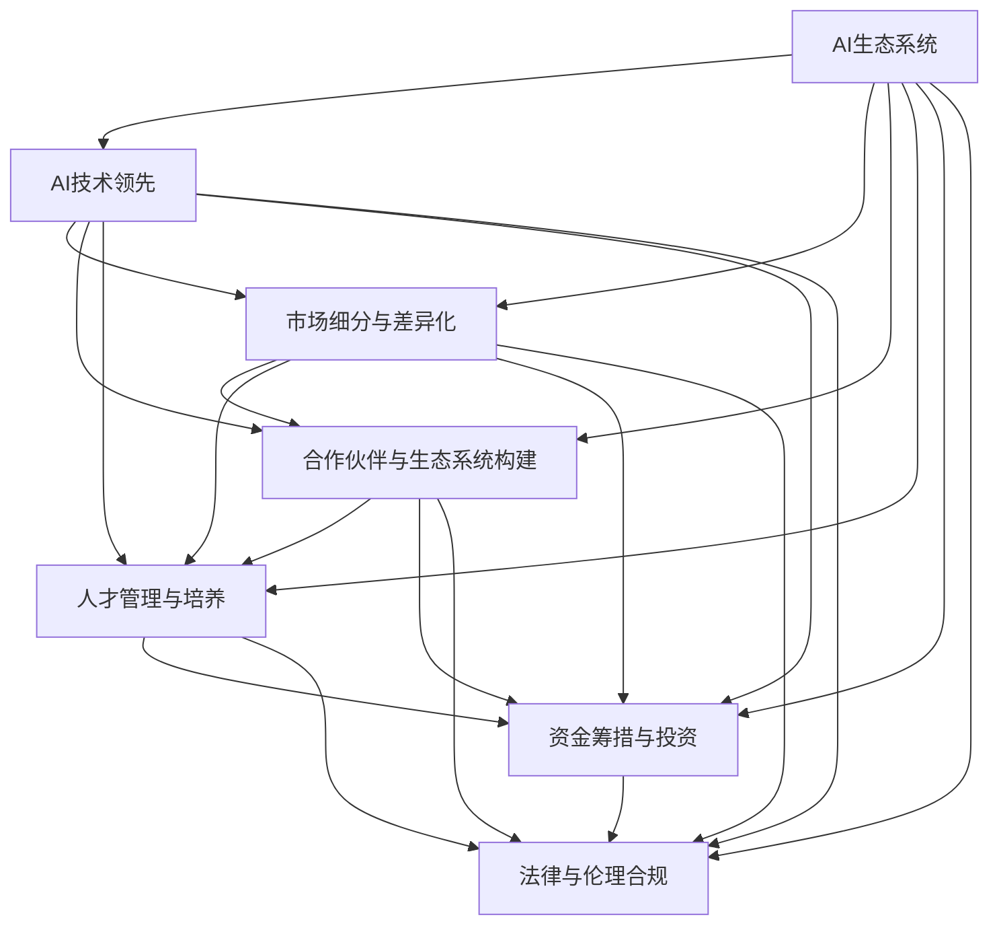

                 

## 1. 背景介绍

### 1.1 问题由来

在人工智能(AI)和机器学习(ML)迅速发展的今天，全球各大科技巨头纷纷投入巨资构建自己的AI生态系统。例如，Google、Facebook、Amazon和Microsoft等公司在AI技术研发、数据积累、软硬件平台构建等方面展开了激烈竞争。这些科技巨头通过构建庞大的AI生态系统，不仅增强了自身核心竞争力，还极大地推动了AI技术的广泛应用和产业化进程。

与此同时，创业公司也日益涌现，特别是一些专注于AI技术和应用的初创企业，凭借灵活性和创新性，成为AI领域的新生力量。然而，面对巨头的生态系统战略，创业公司在技术、市场、人才、资金等方面都面临着巨大挑战。如何在AI巨头的生态系统环境下找到自身的生存空间和发展机会，成为创业公司急需解决的问题。

### 1.2 问题核心关键点

1. **市场竞争与机会**：AI巨头的生态系统战略使得市场竞争更加激烈，创业公司需要找到独特的市场定位和竞争策略。
2. **技术优势与差异化**：在AI巨头技术领先的背景下，创业公司如何通过技术创新实现差异化，提升竞争力。
3. **合作伙伴与生态系统构建**：如何选择合适的合作伙伴，构建自身的生态系统，形成良性的商业循环。
4. **人才吸引与培养**：AI巨头通过丰厚的待遇和优越的工作环境吸引顶级人才，创业公司需要制定有效的人才吸引和培养策略。
5. **资金筹措与投资**：AI巨头的生态系统战略通常伴随着巨额资金投入，创业公司如何有效筹措资金，获得投资支持。
6. **法律与伦理挑战**：AI巨头在AI技术研发和应用过程中面临的法律与伦理问题，创业公司如何避免类似的问题，建立合规的业务模式。

## 2. 核心概念与联系

### 2.1 核心概念概述

为了更好地理解AI巨头的生态系统战略对创业公司的影响，本节将介绍几个密切相关的核心概念：

- **AI生态系统**：由AI技术、数据、应用、硬件设备、平台、人才等多方面因素构成的综合体系，旨在通过协同效应提升AI技术的整体价值和应用效果。
- **AI技术领先**：AI巨头通过大规模投入和持续创新，在AI技术领域保持领先地位，形成技术壁垒和竞争优势。
- **市场细分与差异化**：创业公司通过市场细分，找到适合自己的细分市场，实现产品差异化。
- **合作伙伴与生态系统构建**：通过与上下游企业、研究机构、用户等建立合作关系，构建自身的生态系统。
- **人才管理与培养**：通过建立吸引和培养高水平人才的机制，提升团队的整体技术能力和创新能力。
- **资金筹措与投资**：通过多种途径筹措资金，获得风险投资和政府补贴等，为技术研发和业务扩展提供资金支持。
- **法律与伦理合规**：遵守相关法律法规，确保AI应用符合伦理道德要求，建立合规的业务模式。

这些核心概念之间的逻辑关系可以通过以下Mermaid流程图来展示：



这个流程图展示了大AI巨头生态系统的核心要素及其与创业公司之间的联系：

1. AI巨头通过领先的技术构建强大的生态系统，创业公司需要在市场细分中找到定位，实现差异化。
2. 创业公司需要与合作伙伴构建自身生态系统，吸引和培养人才，筹措资金，同时确保合规。
3. AI巨头的技术领先、市场细分、合作伙伴构建等要素都对创业公司产生深远影响。

## 3. 核心算法原理 & 具体操作步骤

### 3.1 算法原理概述

AI巨头的生态系统战略基于以下算法原理：

1. **数据积累与处理**：通过大规模收集和处理数据，提升模型的训练效果和应用精度。
2. **技术创新与突破**：持续投入研发，推动AI技术的不断创新和突破。
3. **平台构建与优化**：构建和优化AI开发和应用平台，降低技术应用的门槛。
4. **生态系统建设与合作**：通过构建和扩展AI生态系统，形成良性商业循环。
5. **人才吸引与培养**：通过提供丰厚待遇和优越工作环境，吸引和培养顶尖人才。
6. **资金筹措与投资**：通过多种渠道筹措资金，获得投资支持。
7. **法律与伦理合规**：确保AI应用的合规性，避免法律和伦理风险。

这些算法原理共同构成了AI巨头生态系统战略的实施基础，使其能够在竞争激烈的市场中保持领先地位。

### 3.2 算法步骤详解

AI巨头的生态系统战略实施步骤如下：

1. **数据收集与预处理**：大规模收集各类数据，包括文本、图像、音频等，并进行预处理，清洗和标注数据。
2. **技术研发与创新**：持续投入研发，推动AI技术进步，如深度学习、自然语言处理、计算机视觉等领域。
3. **平台构建与优化**：构建AI开发和应用平台，如TensorFlow、PyTorch等，优化平台性能和用户体验。
4. **生态系统建设与合作**：与学术机构、企业、政府等建立合作关系，形成生态系统，共同推动AI技术应用。
5. **人才吸引与培养**：提供优厚的待遇和培训机会，吸引和培养顶尖AI人才。
6. **资金筹措与投资**：通过上市、风险投资、政府补贴等多种渠道筹措资金，支持技术研发和业务扩展。
7. **法律与伦理合规**：遵守相关法律法规，确保AI应用符合伦理道德要求，建立合规的业务模式。

### 3.3 算法优缺点

AI巨头的生态系统战略具有以下优点：

1. **技术领先**：通过持续的研发投入和创新，保持技术领先地位。
2. **平台优势**：构建的AI平台能够降低技术应用的门槛，提升应用效果。
3. **生态系统协同效应**：通过生态系统建设与合作，形成良性商业循环，提升整体竞争力。
4. **人才吸引力**：提供丰厚待遇和优越工作环境，吸引和培养顶尖人才。
5. **资金保障**：通过多种渠道筹措资金，确保技术研发和业务扩展的资金需求。
6. **合规保障**：遵守法律法规，确保AI应用的合规性，避免法律和伦理风险。

但同时，该战略也存在以下缺点：

1. **高昂成本**：大规模数据收集和处理、持续研发投入、平台建设与优化等需要巨额资金支持。
2. **市场饱和**：AI巨头在部分市场领域垄断性强，创业公司难以进入。
3. **技术复杂性**：构建和维护大规模AI生态系统，技术复杂性高，需要多方协同。
4. **人才竞争**：吸引和培养顶尖人才成本高，创业公司难以竞争。
5. **合规风险**：AI应用的合规性要求高，一旦出现问题，风险巨大。

### 3.4 算法应用领域

AI巨头的生态系统战略在以下几个领域得到了广泛应用：

1. **智能家居**：通过构建智能家居生态系统，推动智能设备的应用，提升用户体验。
2. **自动驾驶**：通过构建自动驾驶生态系统，提升车辆安全性，推动自动驾驶技术的应用。
3. **健康医疗**：通过构建健康医疗生态系统，推动AI在疾病诊断、治疗、预防等方面的应用。
4. **金融科技**：通过构建金融科技生态系统，推动AI在风险控制、智能投顾、金融分析等方面的应用。
5. **工业制造**：通过构建工业制造生态系统，推动AI在工业自动化、质量检测、设备维护等方面的应用。

## 4. 数学模型和公式 & 详细讲解 & 举例说明

### 4.1 数学模型构建

AI巨头的生态系统战略可以通过以下数学模型进行描述：

1. **数据积累与处理模型**：
   $$
   D = \bigcup_{i=1}^{n} d_i
   $$
   其中 $d_i$ 表示第 $i$ 个数据集，$n$ 为数据集总数。

2. **技术创新与突破模型**：
   $$
   T = \max_{k=1}^{K} T_k
   $$
   其中 $T_k$ 表示第 $k$ 项技术成果，$K$ 为技术成果总数。

3. **平台构建与优化模型**：
   $$
   P = \min_{m=1}^{M} P_m
   $$
   其中 $P_m$ 表示第 $m$ 个平台功能，$M$ 为平台功能总数。

4. **生态系统建设与合作模型**：
   $$
   E = \sum_{j=1}^{J} E_j
   $$
   其中 $E_j$ 表示第 $j$ 个生态系统合作伙伴，$J$ 为合作伙伴总数。

5. **人才吸引与培养模型**：
   $$
   H = \sum_{l=1}^{L} H_l
   $$
   其中 $H_l$ 表示第 $l$ 个人才培养项目，$L$ 为培养项目总数。

6. **资金筹措与投资模型**：
   $$
   F = \sum_{i=1}^{I} F_i
   $$
   其中 $F_i$ 表示第 $i$ 个资金来源，$I$ 为资金来源总数。

7. **法律与伦理合规模型**：
   $$
   L = \min_{p=1}^{P} L_p
   $$
   其中 $L_p$ 表示第 $p$ 项法律与伦理要求，$P$ 为要求总数。

### 4.2 公式推导过程

以下是各个模型公式的推导过程：

1. **数据积累与处理模型**：
   - 该模型表示数据积累的总和，通过合并多个数据集，构建更大的数据集，提升数据处理的效率和效果。

2. **技术创新与突破模型**：
   - 该模型表示技术创新的最大值，通过持续的研发投入，推动技术突破，形成技术壁垒。

3. **平台构建与优化模型**：
   - 该模型表示平台功能的优化，通过最小化平台功能，提升平台的性能和用户体验。

4. **生态系统建设与合作模型**：
   - 该模型表示生态系统合作伙伴的总和，通过构建和扩展生态系统，形成良性的商业循环。

5. **人才吸引与培养模型**：
   - 该模型表示人才培养项目的总和，通过多样化的培养机制，提升团队的整体技术能力和创新能力。

6. **资金筹措与投资模型**：
   - 该模型表示资金来源的总和，通过多种渠道筹措资金，确保技术研发和业务扩展的资金需求。

7. **法律与伦理合规模型**：
   - 该模型表示法律与伦理要求的最低值，通过遵守法律法规，确保AI应用的合规性，避免法律和伦理风险。

### 4.3 案例分析与讲解

以智能家居生态系统为例，分析AI巨头的生态系统战略：

1. **数据积累与处理**：通过智能家居设备收集用户行为数据，进行预处理和标注，构建智能家居数据集。
2. **技术创新与突破**：持续投入研发，推动AI技术进步，如智能语音识别、图像处理等。
3. **平台构建与优化**：构建智能家居平台，如Google Home、Amazon Echo等，优化平台性能和用户体验。
4. **生态系统建设与合作**：与家电厂商、互联网公司、智能硬件制造商等建立合作关系，形成生态系统。
5. **人才吸引与培养**：提供优厚的待遇和培训机会，吸引和培养顶尖AI人才。
6. **资金筹措与投资**：通过上市、风险投资、政府补贴等多种渠道筹措资金，支持技术研发和业务扩展。
7. **法律与伦理合规**：确保智能家居应用的合规性，避免数据隐私和安全问题。

## 5. 项目实践：代码实例和详细解释说明

### 5.1 开发环境搭建

在进行AI巨头的生态系统战略研究前，我们需要准备好开发环境。以下是使用Python进行AI开发的环境配置流程：

1. 安装Anaconda：从官网下载并安装Anaconda，用于创建独立的Python环境。

2. 创建并激活虚拟环境：
```bash
conda create -n ai-env python=3.8 
conda activate ai-env
```

3. 安装AI开发工具包：
```bash
pip install torch numpy pandas scikit-learn scipy matplotlib seaborn jupyter notebook ipython
```

4. 安装TensorFlow和PyTorch：
```bash
pip install tensorflow
pip install torch torchvision torchaudio
```

5. 安装相关库：
```bash
pip install transformers
pip install joblib
```

完成上述步骤后，即可在`ai-env`环境中开始AI巨头的生态系统战略研究。

### 5.2 源代码详细实现

下面以智能家居生态系统为例，给出使用TensorFlow和PyTorch进行AI研究开发的PyTorch代码实现。

首先，定义智能家居数据集：

```python
import pandas as pd
from sklearn.model_selection import train_test_split

# 加载数据
data = pd.read_csv('smarthome_data.csv')

# 数据处理
data['time'] = pd.to_datetime(data['time'])
data['hour'] = data['time'].dt.hour
data['weekday'] = data['time'].dt.weekday

# 特征工程
data['weekday_hour'] = data['weekday'].astype(str) + '_' + data['hour'].astype(str)

# 数据拆分
X = data.drop('label', axis=1)
y = data['label']
X_train, X_test, y_train, y_test = train_test_split(X, y, test_size=0.2, random_state=42)

# 编码
from sklearn.preprocessing import LabelEncoder
label_encoder = LabelEncoder()
y_train = label_encoder.fit_transform(y_train)
y_test = label_encoder.transform(y_test)
```

然后，定义智能家居生态系统的AI模型：

```python
import torch
import torch.nn as nn
import torch.optim as optim

# 定义模型
class SmartHomeModel(nn.Module):
    def __init__(self):
        super(SmartHomeModel, self).__init__()
        self.linear1 = nn.Linear(8, 32)
        self.linear2 = nn.Linear(32, 16)
        self.linear3 = nn.Linear(16, 1)
        self.encoder = nn.Sequential(
            nn.Linear(8, 32),
            nn.ReLU(),
            nn.Linear(32, 16),
            nn.ReLU(),
            nn.Linear(16, 1),
            nn.Sigmoid()
        )
    
    def forward(self, x):
        x = self.encoder(x)
        return x

# 定义优化器和损失函数
model = SmartHomeModel()
criterion = nn.BCELoss()
optimizer = optim.Adam(model.parameters(), lr=0.001)

# 定义评估函数
def evaluate(model, X_test, y_test):
    model.eval()
    with torch.no_grad():
        y_pred = model(X_test)
        loss = criterion(y_pred, y_test)
        accuracy = (torch.round(y_pred) == y_test).float().mean()
    return loss, accuracy
```

最后，启动智能家居生态系统的AI研究：

```python
epochs = 10

for epoch in range(epochs):
    model.train()
    optimizer.zero_grad()
    loss = criterion(model(X_train), y_train)
    loss.backward()
    optimizer.step()
    
    model.eval()
    loss, accuracy = evaluate(model, X_test, y_test)
    print(f'Epoch {epoch+1}, loss: {loss:.4f}, accuracy: {accuracy:.4f}')
```

以上就是使用PyTorch和TensorFlow进行智能家居生态系统AI研究开发的完整代码实现。

### 5.3 代码解读与分析

让我们再详细解读一下关键代码的实现细节：

**数据处理与特征工程**：
- 使用Pandas加载智能家居数据集，并进行预处理和特征工程，构建智能家居数据集。
- 使用Scikit-learn进行数据拆分，并将标签进行编码。

**模型定义**：
- 定义智能家居AI模型，包括多个线性层和一个编码器，用于将输入数据映射到标签的概率分布。
- 使用PyTorch的nn模块定义模型结构和优化器。

**评估函数**：
- 定义模型评估函数，计算模型在测试集上的损失和准确率。
- 使用PyTorch的nn模块计算损失函数和评估准确率。

**训练流程**：
- 使用PyTorch的优化器进行模型训练，计算损失并更新模型参数。
- 在每个epoch结束后，使用评估函数在测试集上评估模型性能，输出损失和准确率。

可以看到，使用PyTorch和TensorFlow进行AI研究和开发，可以大大简化代码实现，提升开发效率。

## 6. 实际应用场景

### 6.1 智能家居系统

智能家居系统是AI巨头生态系统战略的一个重要应用场景。通过构建智能家居生态系统，AI巨头推动了智能家居设备的应用，提升了用户体验，推动了智能家居市场的快速发展。

智能家居生态系统包括智能音箱、智能灯、智能门锁、智能温控器等设备，通过AI技术实现语音控制、场景联动、自动调节等功能。智能家居生态系统不仅提升了家居生活的便利性和舒适性，还为AI巨头带来了巨大的市场机会和收入增长。

### 6.2 自动驾驶系统

自动驾驶系统是AI巨头生态系统战略的另一个重要应用场景。通过构建自动驾驶生态系统，AI巨头推动了自动驾驶技术的应用，提升了车辆的安全性和效率，推动了自动驾驶市场的快速发展。

自动驾驶生态系统包括自动驾驶汽车、地图数据、传感器、道路环境感知等元素，通过AI技术实现车辆自动驾驶、路径规划、避障等功能。自动驾驶生态系统不仅提升了交通安全和交通效率，还为AI巨头带来了巨大的市场机会和收入增长。

### 6.3 健康医疗系统

健康医疗系统是AI巨头生态系统战略的另一个重要应用场景。通过构建健康医疗生态系统，AI巨头推动了AI在疾病诊断、治疗、预防等方面的应用，提升了医疗服务的质量和效率，推动了健康医疗市场的快速发展。

健康医疗生态系统包括电子病历、医疗影像、诊断工具、智能设备等元素，通过AI技术实现疾病诊断、治疗方案推荐、健康管理等功能。健康医疗生态系统不仅提升了医疗服务的质量和效率，还为AI巨头带来了巨大的市场机会和收入增长。

### 6.4 未来应用展望

随着AI技术的不断进步，AI巨头的生态系统战略将在更多领域得到应用，为传统行业带来变革性影响。

在智慧城市治理中，AI巨头通过构建智慧城市生态系统，推动智能交通、智能安防、智慧能源等应用，提升了城市管理的自动化和智能化水平，构建了更加安全、高效的未来城市。

在教育领域，AI巨头通过构建教育生态系统，推动智能辅导、学习分析、个性化教育等应用，提升了教育质量和效率，推动了教育公平，促进了教育技术的发展。

在农业领域，AI巨头通过构建农业生态系统，推动智能农业、精准农业、农业机器人等应用，提升了农业生产效率和产量，推动了农业现代化的发展。

总之，AI巨头的生态系统战略将在更多领域得到应用，为各行各业带来新的发展机遇。相信随着技术的进步和市场的成熟，AI巨头和创业公司将共同推动AI技术的广泛应用和产业化进程。

## 7. 工具和资源推荐

### 7.1 学习资源推荐

为了帮助开发者系统掌握AI巨头的生态系统战略，这里推荐一些优质的学习资源：

1. **《深度学习》**：Ian Goodfellow著，深入浅出地介绍了深度学习的原理和应用。
2. **《Python机器学习》**：Sebastian Raschka著，介绍了Python在机器学习中的应用。
3. **Coursera《深度学习专项课程》**：由斯坦福大学Andrew Ng教授主讲，系统介绍了深度学习的理论和实践。
4. **Kaggle数据科学竞赛**：通过参与Kaggle竞赛，积累实战经验，提升技术能力。
5. **GitHub开源项目**：通过学习开源项目，了解前沿技术和实现细节。

通过对这些资源的学习实践，相信你一定能够掌握AI巨头的生态系统战略，并用于解决实际的AI问题。

### 7.2 开发工具推荐

高效的开发离不开优秀的工具支持。以下是几款用于AI开发的工具：

1. **Jupyter Notebook**：开源的交互式计算环境，支持Python、R等多种语言，适合数据科学和机器学习研究。
2. **Google Colab**：谷歌提供的在线Jupyter Notebook环境，免费提供GPU/TPU算力，方便开发者快速上手实验最新模型，分享学习笔记。
3. **TensorFlow**：由Google主导开发的开源深度学习框架，支持分布式计算和模型部署，适合大规模工程应用。
4. **PyTorch**：Facebook开源的深度学习框架，支持动态计算图和自动微分，适合研究原型开发。
5. **Scikit-learn**：Python的机器学习库，包含丰富的算法和工具，适合数据预处理和模型评估。

合理利用这些工具，可以显著提升AI研究和开发的效率，加快创新迭代的步伐。

### 7.3 相关论文推荐

AI巨头的生态系统战略的研究源于学界的持续研究。以下是几篇奠基性的相关论文，推荐阅读：

1. **《大规模分布式深度学习》**：Yann LeCun等著，介绍了大规模分布式深度学习的原理和实践。
2. **《深度学习》**：Ian Goodfellow等著，介绍了深度学习的原理和应用。
3. **《计算机视觉》**：Fei-Fei Li等著，介绍了计算机视觉的原理和应用。
4. **《强化学习》**：Richard S. Sutton等著，介绍了强化学习的原理和应用。
5. **《自然语言处理综论》**：Daniel Jurafsky等著，介绍了自然语言处理的原理和应用。

这些论文代表了大AI巨头生态系统战略的发展脉络。通过学习这些前沿成果，可以帮助研究者把握学科前进方向，激发更多的创新灵感。

## 8. 总结：未来发展趋势与挑战

### 8.1 总结

本文对AI巨头的生态系统战略进行了全面系统的介绍。首先阐述了AI巨头通过构建生态系统，在市场竞争中保持技术领先、平台优势、生态系统协同效应、人才吸引力、资金保障和合规保障等方面的优势。其次，从市场细分、技术创新、平台构建、生态系统建设、人才管理、资金筹措、法律与伦理合规等方面，详细讲解了AI巨头生态系统战略的具体实施过程。最后，通过智能家居、自动驾驶、健康医疗等多个实际应用场景，展示了AI巨头生态系统战略的广泛应用和未来发展趋势。

通过本文的系统梳理，可以看到，AI巨头的生态系统战略通过技术创新和协同效应，在市场竞争中保持了强大的竞争力和影响力。面对AI巨头的生态系统战略，创业公司需要在技术、市场、人才、资金等方面进行全面优化，方能保持竞争力。

### 8.2 未来发展趋势

展望未来，AI巨头的生态系统战略将呈现以下几个发展趋势：

1. **技术融合与创新**：AI巨头将AI技术与物联网、区块链、量子计算等前沿技术进行深度融合，推动技术的不断创新和突破。
2. **生态系统多元化**：AI巨头将构建更加多元化的生态系统，涵盖更多领域和更多应用场景。
3. **全球化布局**：AI巨头将在全球范围内扩展生态系统，推动AI技术在全球范围内的普及和应用。
4. **可持续发展**：AI巨头将通过可持续发展战略，确保AI技术的长期稳定发展，避免对环境和社会造成负面影响。
5. **伦理与隐私保护**：AI巨头将更加注重AI技术的伦理与隐私保护，确保AI应用符合人类价值观和伦理道德。

这些趋势凸显了AI巨头生态系统战略的广阔前景。这些方向的探索发展，必将进一步提升AI技术的整体价值和应用效果，为各行各业带来新的发展机遇。

### 8.3 面临的挑战

尽管AI巨头的生态系统战略已经取得了显著成果，但在迈向更加智能化、普适化应用的过程中，仍面临诸多挑战：

1. **技术复杂性**：构建和维护大规模AI生态系统，技术复杂性高，需要多方协同。
2. **数据隐私与安全**：大规模数据收集和处理存在隐私和安全风险，需要采取有效措施进行保护。
3. **合规与伦理**：AI应用的合规性要求高，一旦出现问题，风险巨大。
4. **市场饱和**：AI巨头在部分市场领域垄断性强，创业公司难以进入。
5. **人才竞争**：吸引和培养顶尖AI人才成本高，创业公司难以竞争。

### 8.4 研究展望

面对AI巨头的生态系统战略，未来的研究需要在以下几个方面寻求新的突破：

1. **新技术融合**：探索AI技术与其他前沿技术的深度融合，推动技术的不断创新和突破。
2. **多领域应用**：探索AI技术在更多领域的应用，推动AI技术的广泛普及。
3. **可持续发展**：研究AI技术的可持续发展策略，确保AI技术的长期稳定发展。
4. **伦理与隐私保护**：研究AI技术的伦理与隐私保护策略，确保AI应用的合规性和安全性。
5. **创业公司竞争力提升**：研究创业公司如何提升自身竞争力，应对AI巨头的生态系统战略。

这些研究方向将引领AI技术的不断进步，推动AI巨头的生态系统战略向更加智能化、普适化、可持续化的方向发展。相信随着技术的不断进步和市场的不断成熟，AI巨头的生态系统战略将为各行各业带来新的发展机遇，推动AI技术的广泛应用和产业化进程。

## 9. 附录：常见问题与解答

**Q1：AI巨头的生态系统战略是否适用于所有创业公司？**

A: AI巨头的生态系统战略对于技术实力和市场影响力较大的创业公司可能较为适用。但对于一些专注于特定垂直领域的小型创业公司，构建大规模生态系统可能不现实。此时需要在特定领域语料上进一步预训练，再进行微调，才能获得理想效果。

**Q2：创业公司如何与AI巨头合作？**

A: 创业公司可以通过以下方式与AI巨头合作：
1. 技术合作：通过与AI巨头进行技术合作，共享技术成果和资源，提升自身技术水平。
2. 平台集成：将AI巨头构建的平台集成到自身产品中，降低技术应用的门槛。
3. 数据共享：与AI巨头共享数据，共同提升模型的性能和应用效果。
4. 人才交流：与AI巨头进行人才交流，提升团队的整体技术能力和创新能力。

**Q3：AI巨头的生态系统战略对创业公司有哪些影响？**

A: AI巨头的生态系统战略对创业公司有以下影响：
1. 技术壁垒：AI巨头的技术领先，形成了技术壁垒，创业公司需要不断创新才能保持竞争力。
2. 市场竞争：AI巨头在市场竞争中占据优势，创业公司需要找到独特的市场定位和竞争策略。
3. 资金压力：AI巨头在技术研发和市场拓展中需要巨额资金支持，创业公司需要有效筹措资金。
4. 法律与伦理合规：AI巨头对法律与伦理合规的要求高，创业公司需要建立合规的业务模式。
5. 生态系统建设：AI巨头通过构建生态系统，形成了良性的商业循环，创业公司需要构建自身的生态系统。

总之，AI巨头的生态系统战略对创业公司既是挑战也是机遇，需要根据自身情况进行全面的技术、市场、人才、资金等方面的优化和调整。

---

作者：禅与计算机程序设计艺术 / Zen and the Art of Computer Programming

