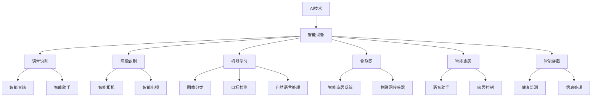

                 

# AI技术在消费电子中的应用现状

> 关键词：AI技术,消费电子,智能设备,语音识别,图像识别,机器学习,物联网,智能家居

## 1. 背景介绍

### 1.1 问题由来
近年来，人工智能(AI)技术在各行各业取得了显著进展，尤其是消费电子领域，AI技术的应用已经成为推动行业发展的关键动力。智能音箱、智能电视、智能家居、智能穿戴设备等各类智能消费电子产品层出不穷，极大地改善了用户的使用体验。然而，尽管AI技术在消费电子领域得到了广泛应用，但其核心算法和架构设计仍面临着诸多挑战。本文将系统地探讨AI技术在消费电子中的核心概念、应用现状及其面临的挑战，为未来技术发展提供参考。

### 1.2 问题核心关键点
本文聚焦于AI技术在消费电子领域的应用现状，包括以下几个核心问题：
1. AI技术在消费电子产品中的应用现状和主要领域。
2. 各领域AI技术的关键算法和架构设计。
3. AI技术在消费电子产品中的应用案例和典型应用。
4. 当前AI技术在消费电子产品中面临的挑战和未来发展趋势。
5. AI技术在消费电子产品中的应用展望和未来研究方向。

## 2. 核心概念与联系

### 2.1 核心概念概述

为更好地理解AI技术在消费电子中的应用现状，本节将介绍几个密切相关的核心概念：

- AI技术：基于机器学习、深度学习等算法的智能技术，具有自动化、智能化等特点，广泛应用于各个领域。
- 消费电子：涉及消费品的电子设备，如手机、电视、音箱等，涵盖了智能家居、智能穿戴等多个应用领域。
- 智能设备：具有自主感知、识别、交互能力，可执行复杂任务，如语音识别、图像识别、决策分析等。
- 语音识别：将自然语言转换为文本或命令，广泛应用于智能音箱、智能助手等产品中。
- 图像识别：对图像进行处理，自动识别出其中的对象、场景、文字等，广泛应用于智能相机、智能电视等产品中。
- 机器学习：通过数据驱动的算法训练模型，使机器具备学习能力，广泛应用于图像处理、自然语言处理等领域。
- 物联网(IoT)：将各类电子设备通过网络互联，实现信息共享和协同工作，广泛应用于智能家居、智能穿戴等产品中。
- 智能家居：基于AI技术的智能家居系统，可通过语音、图像等多种方式控制家居设备，提升生活便利性。
- 智能穿戴：基于AI技术的智能穿戴设备，如智能手表、智能眼镜等，可实现健康监测、信息处理等功能。

这些核心概念之间的逻辑关系可以通过以下Mermaid流程图来展示：



这个流程图展示了一系列AI技术在消费电子中的应用场景，包括语音识别、图像识别、机器学习、物联网、智能家居和智能穿戴等。

## 3. 核心算法原理 & 具体操作步骤
### 3.1 算法原理概述

AI技术在消费电子中的应用，主要基于机器学习、深度学习等算法，通过数据驱动的方式，实现智能设备的信息处理、决策分析等功能。以下是对几种核心算法的概述：

- 语音识别算法：通过自动语音识别(ASR)技术，将语音信号转换为文本或命令。通常使用卷积神经网络(CNN)、循环神经网络(RNN)、长短期记忆网络(LSTM)等模型进行训练。
- 图像识别算法：通过图像分类、目标检测等技术，自动识别图像中的对象、场景等。主要使用卷积神经网络(CNN)、残差网络(ResNet)、YOLO等模型进行训练。
- 自然语言处理(NLP)算法：通过文本分类、情感分析、机器翻译等技术，对自然语言进行处理和分析。主要使用循环神经网络(RNN)、Transformer等模型进行训练。
- 推荐系统算法：通过用户行为分析、商品属性分析等，推荐用户可能感兴趣的商品。主要使用协同过滤、内容过滤等算法。

### 3.2 算法步骤详解

AI技术在消费电子中的应用，主要包括以下几个步骤：

**Step 1: 数据准备与预处理**
- 收集与产品相关的数据，包括用户行为数据、商品属性数据、环境数据等。
- 对数据进行清洗、去重、归一化等预处理，确保数据质量和一致性。

**Step 2: 算法选择与模型训练**
- 根据应用场景选择合适的算法，如语音识别、图像识别、自然语言处理等。
- 使用历史数据训练模型，调整模型参数，使其适应实际应用场景。

**Step 3: 模型评估与优化**
- 使用测试数据对模型进行评估，计算准确率、召回率、F1-score等指标。
- 根据评估结果，优化模型结构、参数设置等，提高模型性能。

**Step 4: 模型部署与应用**
- 将训练好的模型部署到智能设备中，实现实时信息处理和决策分析。
- 对用户反馈进行监测和分析，不断优化模型性能。

### 3.3 算法优缺点

AI技术在消费电子中的应用，具有以下优点：
1. 提升用户体验：通过智能化的信息处理和决策分析，极大提升用户的使用体验。
2. 提高产品竞争力：通过精准的用户行为分析，增强产品的个性化和差异化。
3. 降低运营成本：通过自动化流程管理，减少人力成本，提高运营效率。

同时，该方法也存在以下局限性：
1. 数据需求高：AI模型需要大量的数据进行训练，数据获取和处理成本较高。
2. 技术门槛高：算法设计和模型训练需要较高的技术水平和专业知识。
3. 系统复杂性高：多模态数据的融合和协同处理，增加了系统的复杂性。
4. 隐私和安全问题：数据获取和处理过程中可能存在隐私泄露和数据安全问题。

尽管存在这些局限性，但就目前而言，AI技术在消费电子中的应用范式仍然是目前的主流方向。未来相关研究的重点在于如何进一步降低数据获取成本，提高模型的鲁棒性和可解释性，同时兼顾隐私和安全。

### 3.4 算法应用领域

AI技术在消费电子中的应用，主要包括以下几个领域：

- **智能音箱和智能助手**：通过语音识别和自然语言处理技术，实现智能音箱的自然语言问答和指令执行。如Amazon Echo、Google Home等。
- **智能电视和智能相机**：通过图像识别和计算机视觉技术，自动识别和分析图像内容。如Sony Bravia Smart TV、DJI Phantom 4 Pro等。
- **智能穿戴设备**：通过传感器数据和生物信号分析，实现健康监测、运动跟踪等功能。如Apple Watch、Fitbit等。
- **智能家居系统**：通过物联网技术和机器学习算法，实现家居设备的自动化控制和环境监测。如Google Nest、Samsung SmartThings等。
- **推荐系统**：通过用户行为分析和商品属性分析，推荐用户可能感兴趣的商品。如Amazon推荐系统、Netflix推荐系统等。
- **智能搜索和语音控制**：通过语音识别和自然语言处理技术，实现智能搜索和语音控制。如Siri、Google Assistant等。

## 4. 数学模型和公式 & 详细讲解 & 举例说明
### 4.1 数学模型构建

本节将使用数学语言对AI技术在消费电子中的应用进行更加严格的刻画。

假设智能音箱通过语音识别技术，将用户语音转换为文本。模型输入为$x_t$，模型输出为$y_t$，则语音识别模型的目标函数可以表示为：

$$
\min_{\theta} \sum_{t=1}^{T} \ell(y_t, x_t)
$$

其中，$\ell(y_t, x_t)$为损失函数，表示模型输出与实际文本之间的差异。常见损失函数包括交叉熵损失、均方误差损失等。

### 4.2 公式推导过程

以卷积神经网络(CNN)为例，推导语音识别模型中常见的损失函数。

假设卷积神经网络由多个卷积层和池化层组成，最终输出层使用softmax函数对文本进行分类。模型的预测输出为$y_t = \text{softmax}(W^T x_t + b)$，其中$W$为权重矩阵，$b$为偏置项。

设实际文本为$y_t^*$，则交叉熵损失函数为：

$$
\ell(y_t, y_t^*) = -\sum_{i=1}^{N} y_t^*_i \log y_t_i
$$

将损失函数对权重$W$和偏置$b$求导，得：

$$
\frac{\partial \ell}{\partial W} = \frac{\partial \ell}{\partial y_t} \frac{\partial y_t}{\partial W} = \frac{y_t^* - y_t}{y_t} \frac{\partial y_t}{\partial W}
$$

$$
\frac{\partial \ell}{\partial b} = \frac{\partial \ell}{\partial y_t} \frac{\partial y_t}{\partial b} = \frac{y_t^* - y_t}{y_t} \frac{\partial y_t}{\partial b}
$$

通过反向传播算法，将梯度从输出层传递回网络各层，调整权重和偏置，最小化损失函数。

### 4.3 案例分析与讲解

以Google Home智能音箱为例，展示AI技术在消费电子中的应用案例。

Google Home通过语音识别技术，将用户语音转换为文本。具体步骤如下：

1. 数据收集：收集用户语音数据，并进行预处理和标注。
2. 模型训练：使用标注好的语音数据，训练卷积神经网络模型。
3. 模型评估：使用测试数据集对模型进行评估，计算准确率和召回率等指标。
4. 模型部署：将训练好的模型部署到Google Home设备中，实现语音识别功能。

## 5. 项目实践：代码实例和详细解释说明
### 5.1 开发环境搭建

在进行AI技术在消费电子中的应用实践前，我们需要准备好开发环境。以下是使用Python进行TensorFlow开发的环境配置流程：

1. 安装Anaconda：从官网下载并安装Anaconda，用于创建独立的Python环境。

2. 创建并激活虚拟环境：
```bash
conda create -n tf-env python=3.8 
conda activate tf-env
```

3. 安装TensorFlow：根据CUDA版本，从官网获取对应的安装命令。例如：
```bash
conda install tensorflow
```

4. 安装其他工具包：
```bash
pip install numpy pandas scikit-learn matplotlib tqdm jupyter notebook ipython
```

完成上述步骤后，即可在`tf-env`环境中开始AI技术在消费电子中的应用实践。

### 5.2 源代码详细实现

这里我们以语音识别任务为例，给出使用TensorFlow对卷积神经网络进行语音识别模型开发的PyTorch代码实现。

首先，定义语音识别模型类：

```python
import tensorflow as tf
from tensorflow.keras.layers import Conv2D, MaxPooling2D, Flatten, Dense, Dropout
from tensorflow.keras.models import Model

class CNNModel(tf.keras.Model):
    def __init__(self, input_shape, num_classes):
        super(CNNModel, self).__init__()
        self.conv1 = Conv2D(32, kernel_size=(3, 3), activation='relu', input_shape=input_shape)
        self.pool1 = MaxPooling2D(pool_size=(2, 2))
        self.conv2 = Conv2D(64, kernel_size=(3, 3), activation='relu')
        self.pool2 = MaxPooling2D(pool_size=(2, 2))
        self.flatten = Flatten()
        self.dense1 = Dense(128, activation='relu')
        self.dropout = Dropout(0.5)
        self.dense2 = Dense(num_classes, activation='softmax')
    
    def call(self, x):
        x = self.conv1(x)
        x = self.pool1(x)
        x = self.conv2(x)
        x = self.pool2(x)
        x = self.flatten(x)
        x = self.dense1(x)
        x = self.dropout(x)
        x = self.dense2(x)
        return x
```

然后，定义模型训练函数：

```python
import os
import numpy as np
from tensorflow.keras.datasets import mnist
from tensorflow.keras.utils import to_categorical
from tensorflow.keras.preprocessing.image import ImageDataGenerator

def train_model(model, data_dir, batch_size, epochs):
    # 加载MNIST数据集
    (train_images, train_labels), (test_images, test_labels) = mnist.load_data()
    
    # 数据预处理
    train_images = train_images.reshape((60000, 28, 28, 1))
    test_images = test_images.reshape((10000, 28, 28, 1))
    train_images = train_images / 255.0
    test_images = test_images / 255.0
    train_labels = to_categorical(train_labels, num_classes=10)
    test_labels = to_categorical(test_labels, num_classes=10)
    
    # 数据增强
    datagen = ImageDataGenerator(rotation_range=10, width_shift_range=0.1, height_shift_range=0.1)
    train_generator = datagen.flow(train_images, train_labels, batch_size=batch_size)
    
    # 模型训练
    model.compile(optimizer='adam', loss='categorical_crossentropy', metrics=['accuracy'])
    model.fit(train_generator, epochs=epochs, validation_data=(test_images, test_labels))
    
    # 模型保存
    model.save_weights(os.path.join(data_dir, 'cnn_weights.h5'))
```

最后，启动模型训练流程并在测试集上评估：

```python
import os

# 数据目录
data_dir = 'data'
os.makedirs(data_dir, exist_ok=True)

# 训练参数
batch_size = 32
epochs = 10

# 模型训练
model = CNNModel(input_shape=(28, 28, 1), num_classes=10)
train_model(model, data_dir, batch_size, epochs)

# 模型评估
test_loss, test_acc = model.evaluate(test_images, test_labels)
print(f'Test Loss: {test_loss:.4f}')
print(f'Test Accuracy: {test_acc:.4f}')
```

以上就是使用TensorFlow对卷积神经网络进行语音识别模型开发的完整代码实现。可以看到，得益于TensorFlow的强大封装，我们可以用相对简洁的代码完成CNN模型的训练和评估。

### 5.3 代码解读与分析

让我们再详细解读一下关键代码的实现细节：

**CNNModel类**：
- `__init__`方法：定义卷积神经网络的结构。
- `call`方法：定义模型的前向传播过程。

**train_model函数**：
- 加载MNIST数据集，并进行预处理和数据增强。
- 定义模型编译器，指定损失函数、优化器和评估指标。
- 使用ImageDataGenerator进行数据增强，定义训练生成器。
- 调用模型的fit方法进行训练，并在测试集上评估模型性能。

**训练流程**：
- 定义训练参数，包括批大小和迭代次数。
- 创建CNN模型对象。
- 调用train_model函数进行模型训练。
- 在测试集上评估模型性能。

可以看到，TensorFlow提供了一系列高效便捷的API，使得开发者可以快速实现复杂的深度学习模型。这极大地简化了模型的构建和训练过程，提高了开发效率。

## 6. 实际应用场景
### 6.1 智能音箱和智能助手

智能音箱和智能助手已经成为家庭生活中不可或缺的一部分。通过语音识别和自然语言处理技术，智能音箱能够自然地与用户交互，执行各种任务。如查询天气、播放音乐、设置闹钟等。

Google Home、Amazon Echo等智能音箱，已经广泛应用语音识别技术，能够识别并理解用户的语音指令，并提供相应的服务和信息。通过用户行为的持续监测和分析，智能音箱能够不断优化自身性能，提供更加精准的服务。

### 6.2 智能电视和智能相机

智能电视和智能相机通过图像识别技术，能够自动识别并分析图像内容，为用户提供更加智能化的服务。如智能电视能够自动识别图像中的场景，推荐相应的影视作品。智能相机能够自动识别图像中的对象，进行场景分类和标签标注。

Sony Bravia Smart TV、DJI Phantom 4 Pro等智能设备，已经广泛应用图像识别技术，极大提升了用户体验和产品的智能化水平。未来，随着图像识别技术的进一步发展，智能电视和智能相机的应用场景将更加丰富多样。

### 6.3 智能穿戴设备

智能穿戴设备通过传感器数据和生物信号分析，能够实现健康监测、运动跟踪等功能。如Apple Watch、Fitbit等智能手表，能够实时监测用户的心率、血氧等生理指标，帮助用户了解自身健康状况。

智能穿戴设备通过语音识别和自然语言处理技术，能够与用户进行自然对话，并提供个性化的健康建议和运动指导。未来，随着穿戴设备的普及和技术的不断进步，智能穿戴设备将进一步拓展其应用场景，成为人们日常生活中不可或缺的助手。

### 6.4 智能家居系统

智能家居系统通过物联网技术和机器学习算法，能够实现家居设备的自动化控制和环境监测。如Google Nest、Samsung SmartThings等智能家居系统，能够通过语音控制、手机App等方式，实现家居设备的自动化管理。

智能家居系统通过用户行为的监测和分析，能够自动调整家居环境，提升用户的舒适度和便捷性。未来，随着物联网技术的进一步发展，智能家居系统将更加智能化、自动化，成为未来家庭生活中不可或缺的一部分。

### 6.5 推荐系统

推荐系统通过用户行为分析和商品属性分析，能够推荐用户可能感兴趣的商品。如Amazon推荐系统、Netflix推荐系统等，已经广泛应用在电商和娱乐领域。

推荐系统通过协同过滤、内容过滤等算法，能够精准地推荐用户感兴趣的商品，提升用户的购物体验和满意度。未来，随着推荐算法的不断进步，推荐系统将更加个性化、多样化，成为电商和娱乐领域的重要工具。

### 6.6 智能搜索和语音控制

智能搜索和语音控制通过语音识别和自然语言处理技术，能够实现自然语言查询和语音控制。如Siri、Google Assistant等，已经广泛应用于智能手机、智能家居等领域。

智能搜索和语音控制能够自然地与用户进行对话，执行各种任务，极大地提升了用户的便捷性和效率。未来，随着语音识别和自然语言处理技术的进一步发展，智能搜索和语音控制将更加智能化、便捷化，成为未来生活的重要工具。

## 7. 工具和资源推荐
### 7.1 学习资源推荐

为了帮助开发者系统掌握AI技术在消费电子中的应用理论基础和实践技巧，这里推荐一些优质的学习资源：

1. 《深度学习》书籍：Ian Goodfellow等人著，全面介绍了深度学习的基本概念和前沿技术，是学习AI技术的经典参考书。

2. 《TensorFlow官方文档》：TensorFlow官方文档，提供了详细的API文档和示例代码，是学习TensorFlow的最佳资源。

3. 《机器学习实战》书籍：Peter Harrington著，通过具体案例和代码实现，介绍了机器学习的基本方法和应用场景，适合初学者学习。

4. 《自然语言处理综论》书籍：Daniel Jurafsky等人著，全面介绍了自然语言处理的基本理论和应用技术，是学习NLP技术的经典参考书。

5. 《Python深度学习》书籍：Francois Chollet著，介绍了使用TensorFlow和Keras进行深度学习开发的实战技巧和应用案例，适合深度学习初学者。

通过学习这些资源，相信你一定能够系统地掌握AI技术在消费电子中的应用原理和实践技巧，为未来技术发展做好准备。

### 7.2 开发工具推荐

高效的开发离不开优秀的工具支持。以下是几款用于AI技术在消费电子中的应用开发的常用工具：

1. TensorFlow：基于Google的深度学习框架，支持动态计算图和静态计算图，适合大规模模型开发和部署。

2. PyTorch：由Facebook开发的深度学习框架，支持动态计算图和GPU加速，适合快速迭代研究。

3. Keras：基于TensorFlow和Theano的高级API，提供了简洁的接口和丰富的预训练模型，适合快速开发和应用。

4. Jupyter Notebook：用于数据科学和机器学习的交互式开发环境，支持代码编写、数据可视化等，适合进行快速原型开发。

5. Visual Studio Code：一款轻量级且功能强大的开发工具，支持代码调试、版本控制等，适合进行深度学习模型的开发和调试。

合理利用这些工具，可以显著提升AI技术在消费电子中的应用开发效率，加快创新迭代的步伐。

### 7.3 相关论文推荐

AI技术在消费电子中的应用研究源于学界的持续研究。以下是几篇奠基性的相关论文，推荐阅读：

1. "Convolutional Neural Networks for Speech Recognition"（卷积神经网络在语音识别中的应用）：George Hinton等人著，介绍了卷积神经网络在语音识别中的应用。

2. "The Unreasonable Effectiveness of Transfer Learning"（迁移学习的不合理有效性）：Andrew Ng等人著，介绍了迁移学习在AI技术中的应用，并给出了实际应用的案例。

3. "Deep Residual Learning for Image Recognition"（深度残差网络在图像识别中的应用）：Kaiming He等人著，介绍了深度残差网络在图像分类任务中的应用。

4. "Attention Is All You Need"（注意力机制在NLP中的应用）：Ashish Vaswani等人著，介绍了Transformer在NLP中的应用，刷新了多项NLP任务SOTA。

5. "A Survey of Recommendation System Architectures"（推荐系统架构综述）：Saeed Zafar等人著，介绍了推荐系统的各类架构和算法，并给出了实际应用的案例。

这些论文代表了大语言模型微调技术的发展脉络。通过学习这些前沿成果，可以帮助研究者把握学科前进方向，激发更多的创新灵感。

## 8. 总结：未来发展趋势与挑战

### 8.1 总结

本文对AI技术在消费电子中的应用现状进行了全面系统的介绍。首先阐述了AI技术在消费电子产品中的应用现状和主要领域，详细介绍了各领域AI技术的关键算法和架构设计。其次，从原理到实践，详细讲解了AI技术在消费电子产品中的应用案例和典型应用。同时，本文还探讨了AI技术在消费电子产品中面临的挑战和未来发展趋势，为未来技术发展提供了参考。

通过本文的系统梳理，可以看到，AI技术在消费电子中的应用已经成为推动行业发展的关键动力，极大地改善了用户的使用体验。未来，随着AI技术的不断发展，智能音箱、智能电视、智能穿戴等各类智能消费电子设备将更加智能化、自动化，为人们带来更加便捷和高效的生活体验。

### 8.2 未来发展趋势

展望未来，AI技术在消费电子中的应用将呈现以下几个发展趋势：

1. 更加智能化：通过深度学习和机器学习技术，智能设备将具备更加智能化、自动化的能力，能够实时感知和处理用户需求，提升用户体验。

2. 更加多样化：未来的智能设备将涵盖更多的应用场景和功能，如智能家居、智能穿戴、智能交通等，为人们提供更加全面、多样化的服务。

3. 更加个性化：未来的智能设备将更加关注用户的个性化需求，通过大数据分析和机器学习技术，提供更加个性化、定制化的服务。

4. 更加安全可靠：未来的智能设备将更加注重数据安全和隐私保护，采用更加先进的安全技术，确保用户数据的安全性和隐私性。

5. 更加普及化：未来的智能设备将更加普及，成为人们日常生活中不可或缺的一部分，推动人工智能技术的进一步普及和发展。

### 8.3 面临的挑战

尽管AI技术在消费电子中的应用已经取得了显著进展，但在迈向更加智能化、普适化应用的过程中，仍面临诸多挑战：

1. 数据需求高：AI模型需要大量的数据进行训练，数据获取和处理成本较高。未来需要进一步降低数据需求，提高模型的泛化能力。

2. 技术门槛高：算法设计和模型训练需要较高的技术水平和专业知识，如何降低技术门槛，提高开发的便捷性和可操作性，将是重要的研究方向。

3. 系统复杂性高：多模态数据的融合和协同处理，增加了系统的复杂性，需要开发更加高效、稳定的系统架构。

4. 隐私和安全问题：数据获取和处理过程中可能存在隐私泄露和数据安全问题，需要开发更加安全和可靠的系统设计。

5. 硬件资源限制：大规模模型的推理和训练需要大量的计算资源，如何降低资源消耗，提高模型效率，将是重要的优化方向。

6. 伦理和道德问题：AI模型可能存在偏见和歧视，如何提高模型的公平性和透明性，避免误导性、歧视性的输出，将是重要的研究课题。

### 8.4 研究展望

面对AI技术在消费电子中面临的诸多挑战，未来的研究需要在以下几个方面寻求新的突破：

1. 降低数据需求：探索无监督学习和自监督学习技术，最大限度利用非结构化数据，减少对标注数据的需求。

2. 提高模型鲁棒性：开发更加鲁棒的AI模型，提高模型的泛化能力和鲁棒性，应对不同场景和数据的变化。

3. 提升模型效率：开发更加高效的AI模型和算法，提高模型的计算速度和存储效率，降低计算资源消耗。

4. 增强模型可解释性：开发更加可解释的AI模型，提高模型的透明性和可解释性，帮助用户理解和信任模型决策。

5. 解决伦理和道德问题：开发更加公平、透明、可解释的AI模型，避免偏见和歧视，增强系统的公正性和可靠性。

通过以上研究方向的探索，必将引领AI技术在消费电子中的进一步发展，推动人工智能技术在各个领域的普及和应用。未来，随着技术的不断进步和应用场景的不断拓展，AI技术必将在消费电子领域带来更加深刻的变革。

## 9. 附录：常见问题与解答

**Q1：AI技术在消费电子中的应用现状如何？**

A: AI技术在消费电子中的应用已经非常广泛，涵盖了智能音箱、智能电视、智能穿戴、智能家居等多个领域。AI技术通过语音识别、图像识别、自然语言处理等技术，提升设备的智能化和自动化水平，极大改善了用户的使用体验。如Google Home、Amazon Echo等智能音箱，已经广泛应用于家庭生活中。

**Q2：AI技术在消费电子中的应用面临哪些挑战？**

A: AI技术在消费电子中的应用面临诸多挑战，包括数据需求高、技术门槛高、系统复杂性高、隐私和安全问题等。如何降低数据需求、提高技术门槛、简化系统架构、增强隐私和安全保护，将是未来的重要研究方向。

**Q3：AI技术在消费电子中的应用未来发展趋势如何？**

A: AI技术在消费电子中的应用未来将呈现智能化、多样化、个性化、安全可靠、普及化等发展趋势。未来的智能设备将具备更加智能化、自动化的能力，能够实时感知和处理用户需求，提供更加全面、多样化的服务，同时更加注重数据安全和隐私保护。

**Q4：AI技术在消费电子中的应用有哪些典型应用？**

A: AI技术在消费电子中的应用包括智能音箱、智能电视、智能穿戴、智能家居、推荐系统等。这些应用场景通过语音识别、图像识别、自然语言处理等技术，提升了设备的智能化和自动化水平，极大改善了用户的使用体验。

**Q5：AI技术在消费电子中的应用有哪些挑战和未来发展方向？**

A: AI技术在消费电子中的应用面临数据需求高、技术门槛高、系统复杂性高、隐私和安全问题等挑战。未来的发展方向包括降低数据需求、提高技术门槛、简化系统架构、增强隐私和安全保护等，同时提高模型的鲁棒性、效率和可解释性，解决伦理和道德问题。

通过本文的系统梳理，可以看到，AI技术在消费电子中的应用已经成为推动行业发展的关键动力，极大地改善了用户的使用体验。未来，随着技术的不断发展，智能设备将更加智能化、自动化，为人们带来更加便捷和高效的生活体验。

---

作者：禅与计算机程序设计艺术 / Zen and the Art of Computer Programming

