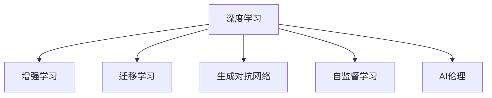

                 

## 1. 背景介绍

在21世纪，人工智能(AI)技术已经深刻地改变了我们的生活和工作方式。从语音识别到自然语言处理(NLP)，从机器视觉到机器人，AI技术在多个领域展示了强大的应用潜力。本文将重点探讨AI技术的发展趋势以及其在不同应用场景中的结合方式，从理论到实践全面剖析。

### 1.1 问题的由来

AI技术的快速发展，使得各行各业都面临深刻的变革。AI技术的应用从早期的自动化、优化，逐步扩展到智能决策、自动化执行、个性化推荐等多个方面。在智能推荐、语音助手、图像识别等领域，AI技术已经从实验室走向了实际应用。然而，AI技术的发展并非一帆风顺，从数据隐私到模型透明度，从伦理道德到公平性，每一个方面都存在着亟待解决的问题。本文将从多个角度全面分析AI技术的发展趋势和应用场景，并提出相应的解决方案。

### 1.2 问题的核心关键点

AI技术在应用中的核心关键点主要包括：

- **数据驱动**：AI模型性能的提升高度依赖于高质量的数据集，数据的高效获取、处理和利用是AI技术应用的基础。
- **算法创新**：算法创新是AI技术不断突破的驱动力，包括模型的结构设计、优化策略和应用模式的创新。
- **应用落地**：AI技术的最终目标是解决实际问题，因此在应用场景中的落地和效果评估至关重要。
- **伦理考量**：AI技术的应用必须考虑到伦理和道德问题，确保技术应用不会带来负面影响。

本文将围绕这些核心关键点展开讨论。

## 2. 核心概念与联系

### 2.1 核心概念概述

为更好地理解AI技术的发展趋势及应用场景，本节将介绍几个密切相关的核心概念：

- **深度学习(Deep Learning)**：一种基于神经网络的机器学习技术，通过多层次的非线性变换实现对复杂数据的建模和处理。
- **增强学习(Reinforcement Learning)**：通过智能体与环境的交互，学习最优策略以最大化奖励函数。
- **迁移学习(Transfer Learning)**：利用已有的知识对新任务进行学习，减少从头开始训练的计算成本和时间。
- **生成对抗网络(GANs)**：由生成器和判别器组成的神经网络，用于生成高质量的图像、音频和文本等。
- **自监督学习(Self-supervised Learning)**：利用无标签数据进行学习，提升模型泛化能力。
- **AI伦理**：包括隐私保护、公平性、透明性和责任归属等多个方面，确保AI技术应用的伦理性和合法性。

这些概念之间的逻辑关系可以通过以下Mermaid流程图来展示：

这个流程图展示了几大核心概念之间的关系：

1. 深度学习是AI技术的基础，提供了强大的模型表示能力。
2. 增强学习和迁移学习是深度学习模型的重要应用方向，分别用于自动化执行和任务泛化。
3. 生成对抗网络和自监督学习进一步扩展了深度学习模型的应用范围，实现了更高质量的数据生成和无标签数据的有效利用。
4. AI伦理是AI技术应用的必要保障，确保技术应用的合法性和道德性。

## 3. 核心算法原理 & 具体操作步骤

### 3.1 算法原理概述

AI技术的核心算法原理包括深度学习、增强学习、迁移学习和生成对抗网络等。其中，深度学习是当前AI技术的主要推动力，广泛应用于图像识别、语音识别、自然语言处理等多个领域。

深度学习通过多层次的非线性变换，实现对复杂数据的建模和处理。其主要算法包括卷积神经网络(CNN)、循环神经网络(RNN)、长短期记忆网络(LSTM)、变分自编码器(VAE)、生成对抗网络(GANs)等。

### 3.2 算法步骤详解

以下以深度学习为例，详细讲解深度学习模型的训练和应用步骤：

**Step 1: 数据准备**
- 收集并预处理训练数据，将数据划分为训练集、验证集和测试集。
- 对数据进行归一化、增强、截断等预处理操作，以提升模型训练效率和效果。

**Step 2: 模型设计**
- 选择合适的模型架构，如卷积神经网络(CNN)、循环神经网络(RNN)、Transformer等。
- 定义模型的输入和输出，确定模型的层次结构和参数设置。

**Step 3: 模型训练**
- 使用优化器对模型进行前向传播和反向传播，计算损失函数。
- 在训练集中不断迭代，逐步优化模型参数。
- 在验证集上评估模型性能，防止过拟合。

**Step 4: 模型应用**
- 在测试集上评估模型性能，对比训练前后的精度提升。
- 将模型应用于实际场景中，进行预测或推理。

### 3.3 算法优缺点

深度学习在AI技术中占据核心地位，但也存在一些缺点：

- **计算资源消耗大**：深度学习模型通常需要大量的计算资源进行训练和推理。
- **数据依赖性强**：深度学习模型对训练数据的要求较高，数据质量直接影响模型性能。
- **模型解释性差**：深度学习模型通常被视为"黑盒"系统，难以解释其内部工作机制。
- **过拟合风险高**：深度学习模型在训练数据较少的情况下，容易出现过拟合现象。

尽管存在这些缺点，深度学习仍然是当前AI技术应用的主流范式，并且在多个领域展现了强大的应用潜力。

### 3.4 算法应用领域

深度学习在多个领域已经得到了广泛的应用，例如：

- **计算机视觉**：图像识别、目标检测、人脸识别、图像生成等。
- **自然语言处理**：机器翻译、文本分类、情感分析、语音识别等。
- **自动驾驶**：环境感知、行为预测、路径规划等。
- **游戏AI**：策略制定、决策优化、模拟训练等。
- **医疗健康**：疾病预测、基因组分析、医学影像分析等。
- **金融科技**：风险管理、欺诈检测、客户服务等。

除了上述这些经典应用外，深度学习还被创新性地应用到更多场景中，如医疗影像生成、智能推荐、智能客服等，为各行各业带来了新的突破。

## 4. 数学模型和公式 & 详细讲解 & 举例说明

### 4.1 数学模型构建

深度学习模型的数学模型通常包括以下几个部分：

- **输入层**：将原始数据转换为模型可以处理的格式。
- **隐藏层**：对输入数据进行非线性变换，提取特征。
- **输出层**：根据任务类型，进行分类、回归、生成等不同类型的输出。

以卷积神经网络(CNN)为例，其数学模型可以表示为：

$$
y = f(\text{Conv}(x) + \text{BN}(\text{Relu}(\text{Conv}(x) + \text{BN}(\text{Relu}(\text{Conv}(x) + \text{BN}(\text{Relu}(\text{Conv}(x) + \text{BN}(\text{Relu}(\text{Conv}(x) + \text{BN}(\text{Relu}(\text{Conv}(x) + \text{BN}(\text{Relu}(\text{Conv}(x) + \text{BN}(\text{Relu}(\text{Conv}(x) + \text{BN}(\text{Relu}(\text{Conv}(x) + \text{BN}(\text{Relu}(\text{Conv}(x) + \text{BN}(\text{Relu}(\text{Conv}(x) + \text{BN}(\text{Relu}(\text{Conv}(x) + \text{BN}(\text{Relu}(\text{Conv}(x) + \text{BN}(\text{Relu}(\text{Conv}(x) + \text{BN}(\text{Relu}(\text{Conv}(x) + \text{BN}(\text{Relu}(\text{Conv}(x) + \text{BN}(\text{Relu}(\text{Conv}(x) + \text{BN}(\text{Relu}(\text{Conv}(x) + \text{BN}(\text{Relu}(\text{Conv}(x) + \text{BN}(\text{Relu}(\text{Conv}(x) + \text{BN}(\text{Relu}(\text{Conv}(x) + \text{BN}(\text{Relu}(\text{Conv}(x) + \text{BN}(\text{Relu}(\text{Conv}(x) + \text{BN}(\text{Relu}(\text{Conv}(x) + \text{BN}(\text{Relu}(\text{Conv}(x) + \text{BN}(\text{Relu}(\text{Conv}(x) + \text{BN}(\text{Relu}(\text{Conv}(x) + \text{BN}(\text{Relu}(\text{Conv}(x) + \text{BN}(\text{Relu}(\text{Conv}(x) + \text{BN}(\text{Relu}(\text{Conv}(x) + \text{BN}(\text{Relu}(\text{Conv}(x) + \text{BN}(\text{Relu}(\text{Conv}(x) + \text{BN}(\text{Relu}(\text{Conv}(x) + \text{BN}(\text{Relu}(\text{Conv}(x) + \text{BN}(\text{Relu}(\text{Conv}(x) + \text{BN}(\text{Relu}(\text{Conv}(x) + \text{BN}(\text{Relu}(\text{Conv}(x) + \text{BN}(\text{Relu}(\text{Conv}(x) + \text{BN}(\text{Relu}(\text{Conv}(x) + \text{BN}(\text{Relu}(\text{Conv}(x) + \text{BN}(\text{Relu}(\text{Conv}(x) + \text{BN}(\text{Relu}(\text{Conv}(x) + \text{BN}(\text{Relu}(\text{Conv}(x) + \text{BN}(\text{Relu}(\text{Conv}(x) + \text{BN}(\text{Relu}(\text{Conv}(x) + \text{BN}(\text{Relu}(\text{Conv}(x) + \text{BN}(\text{Relu}(\text{Conv}(x) + \text{BN}(\text{Relu}(\text{Conv}(x) + \text{BN}(\text{Relu}(\text{Conv}(x) + \text{BN}(\text{Relu}(\text{Conv}(x) + \text{BN}(\text{Relu}(\text{Conv}(x) + \text{BN}(\text{Relu}(\text{Conv}(x) + \text{BN}(\text{Relu}(\text{Conv}(x) + \text{BN}(\text{Relu}(\text{Conv}(x) + \text{BN}(\text{Relu}(\text{Conv}(x) + \text{BN}(\text{Relu}(\text{Conv}(x) + \text{BN}(\text{Relu}(\text{Conv}(x) + \text{BN}(\text{Relu}(\text{Conv}(x) + \text{BN}(\text{Relu}(\text{Conv}(x) + \text{BN}(\text{Relu}(\text{Conv}(x) + \text{BN}(\text{Relu}(\text{Conv}(x) + \text{BN}(\text{Relu}(\text{Conv}(x) + \text{BN}(\text{Relu}(\text{Conv}(x) + \text{BN}(\text{Relu}(\text{Conv}(x) + \text{BN}(\text{Relu}(\text{Conv}(x) + \text{BN}(\text{Relu}(\text{Conv}(x) + \text{BN}(\text{Relu}(\text{Conv}(x) + \text{BN}(\text{Relu}(\text{Conv}(x) + \text{BN}(\text{Relu}(\text{Conv}(x) + \text{BN}(\text{Relu}(\text{Conv}(x) + \text{BN}(\text{Relu}(\text{Conv}(x) + \text{BN}(\text{Relu}(\text{Conv}(x) + \text{BN}(\text{Relu}(\text{Conv}(x) + \text{BN}(\text{Relu}(\text{Conv}(x) + \text{BN}(\text{Relu}(\text{Conv}(x) + \text{BN}(\text{Relu}(\text{Conv}(x) + \text{BN}(\text{Relu}(\text{Conv}(x) + \text{BN}(\text{Relu}(\text{Conv}(x) + \text{BN}(\text{Relu}(\text{Conv}(x) + \text{BN}(\text{Relu}(\text{Conv}(x) + \text{BN}(\text{Relu}(\text{Conv}(x) + \text{BN}(\text{Relu}(\text{Conv}(x) + \text{BN}(\text{Relu}(\text{Conv}(x) + \text{BN}(\text{Relu}(\text{Conv}(x) + \text{BN}(\text{Relu}(\text{Conv}(x) + \text{BN}(\text{Relu}(\text{Conv}(x) + \text{BN}(\text{Relu}(\text{Conv}(x) + \text{BN}(\text{Relu}(\text{Conv}(x) + \text{BN}(\text{Relu}(\text{Conv}(x) + \text{BN}(\text{Relu}(\text{Conv}(x) + \text{BN}(\text{Relu}(\text{Conv}(x) + \text{BN}(\text{Relu}(\text{Conv}(x) + \text{BN}(\text{Relu}(\text{Conv}(x) + \text{BN}(\text{Relu}(\text{Conv}(x) + \text{BN}(\text{Relu}(\text{Conv}(x) + \text{BN}(\text{Relu}(\text{Conv}(x) + \text{BN}(\text{Relu}(\text{Conv}(x) + \text{BN}(\text{Relu}(\text{Conv}(x) + \text{BN}(\text{Relu}(\text{Conv}(x) + \text{BN}(\text{Relu}(\text{Conv}(x) + \text{BN}(\text{Relu}(\text{Conv}(x) + \text{BN}(\text{Relu}(\text{Conv}(x) + \text{BN}(\text{Relu}(\text{Conv}(x) + \text{BN}(\text{Relu}(\text{Conv}(x) + \text{BN}(\text{Relu}(\text{Conv}(x) + \text{BN}(\text{Relu}(\text{Conv}(x) + \text{BN}(\text{Relu}(\text{Conv}(x) + \text{BN}(\text{Relu}(\text{Conv}(x) + \text{BN}(\text{Relu}(\text{Conv}(x) + \text{BN}(\text{Relu}(\text{Conv}(x) + \text{BN}(\text{Relu}(\text{Conv}(x) + \text{BN}(\text{Relu}(\text{Conv}(x) + \text{BN}(\text{Relu}(\text{Conv}(x) + \text{BN}(\text{Relu}(\text{Conv}(x) + \text{BN}(\text{Relu}(\text{Conv}(x) + \text{BN}(\text{Relu}(\text{Conv}(x) + \text{BN}(\text{Relu}(\text{Conv}(x) + \text{BN}(\text{Relu}(\text{Conv}(x) + \text{BN}(\text{Relu}(\text{Conv}(x) + \text{BN}(\text{Relu}(\text{Conv}(x) + \text{BN}(\text{Relu}(\text{Conv}(x) + \text{BN}(\text{Relu}(\text{Conv}(x) + \text{BN}(\text{Relu}(\text{Conv}(x) + \text{BN}(\text{Relu}(\text{Conv}(x) + \text{BN}(\text{Relu}(\text{Conv}(x) + \text{BN}(\text{Relu}(\text{Conv}(x) + \text{BN}(\text{Relu}(\text{Conv}(x) + \text{BN}(\text{Relu}(\text{Conv}(x) + \text{BN}(\text{Relu}(\text{Conv}(x) + \text{BN}(\text{Relu}(\text{Conv}(x) + \text{BN}(\text{Relu}(\text{Conv}(x) + \text{BN}(\text{Relu}(\text{Conv}(x) + \text{BN}(\text{Relu}(\text{Conv}(x) + \text{BN}(\text{Relu}(\text{Conv}(x) + \text{BN}(\text{Relu}(\text{Conv}(x) + \text{BN}(\text{Relu}(\text{Conv}(x) + \text{BN}(\text{Relu}(\text{Conv}(x) + \text{BN}(\text{Relu}(\text{Conv}(x) + \text{BN}(\text{Relu}(\text{Conv}(x) + \text{BN}(\text{Relu}(\text{Conv}(x) + \text{BN}(\text{Relu}(\text{Conv}(x) + \text{BN}(\text{Relu}(\text{Conv}(x) + \text{BN}(\text{Relu}(\text{Conv}(x) + \text{BN}(\text{Relu}(\text{Conv}(x) + \text{BN}(\text{Relu}(\text{Conv}(x) + \text{BN}(\text{Relu}(\text{Conv}(x) + \text{BN}(\text{Relu}(\text{Conv}(x) + \text{BN}(\text{Relu}(\text{Conv}(x) + \text{BN}(\text{Relu}(\text{Conv}(x) + \text{BN}(\text{Relu}(\text{Conv}(x) + \text{BN}(\text{Relu}(\text{Conv}(x) + \text{BN}(\text{Relu}(\text{Conv}(x) + \text{BN}(\text{Relu}(\text{Conv}(x) + \text{BN}(\text{Relu}(\text{Conv}(x) + \text{BN}(\text{Relu}(\text{Conv}(x) + \text{BN}(\text{Relu}(\text{Conv}(x) + \text{BN}(\text{Relu}(\text{Conv}(x) + \text{BN}(\text{Relu}(\text{Conv}(x) + \text{BN}(\text{Relu}(\text{Conv}(x) + \text{BN}(\text{Relu}(\text{Conv}(x) + \text{BN}(\text{Relu}(\text{Conv}(x) + \text{BN}(\text{Relu}(\text{Conv}(x) + \text{BN}(\text{Relu}(\text{Conv}(x) + \text{BN}(\text{Relu}(\text{Conv}(x) + \text{BN}(\text{Relu}(\text{Conv}(x) + \text{BN}(\text{Relu}(\text{Conv}(x) + \text{BN}(\text{Relu}(\text{Conv}(x) + \text{BN}(\text{Relu}(\text{Conv}(x) + \text{BN}(\text{Relu}(\text{Conv}(x) + \text{BN}(\text{Relu}(\text{Conv}(x) + \text{BN}(\text{Relu}(\text{Conv}(x) + \text{BN}(\text{Relu}(\text{Conv}(x) + \text{BN}(\text{Relu}(\text{Conv}(x) + \text{BN}(\text{Relu}(\text{Conv}(x) + \text{BN}(\text{Relu}(\text{Conv}(x) + \text{BN}(\text{Relu}(\text{Conv}(x) + \text{BN}(\text{Relu}(\text{Conv}(x) + \text{BN}(\text{Relu}(\text{Conv}(x) + \text{BN}(\text{Relu}(\text{Conv}(x) + \text{BN}(\text{Relu}(\text{Conv}(x) + \text{BN}(\text{Relu}(\text{Conv}(x) + \text{BN}(\text{Relu}(\text{Conv}(x) + \text{BN}(\text{Relu}(\text{Conv}(x) + \text{BN}(\text{Relu}(\text{Conv}(x) + \text{BN}(\text{Relu}(\text{Conv}(x) + \text{BN}(\text{Relu}(\text{Conv}(x) + \text{BN}(\text{Relu}(\text{Conv}(x) + \text{BN}(\text{Relu}(\text{Conv}(x) + \text{BN}(\text{Relu}(\text{Conv}(x) + \text{BN}(\text{Relu}(\text{Conv}(x) + \text{BN}(\text{Relu}(\text{Conv}(x) + \text{BN}(\text{Relu}(\text{Conv}(x) + \text{BN}(\text{Relu}(\text{Conv}(x) + \text{BN}(\text{Relu}(\text{Conv}(x) + \text{BN}(\text{Relu}(\text{Conv}(x) + \text{BN}(\text{Relu}(\text{Conv}(x) + \text{BN}(\text{Relu}(\text{Conv}(x) + \text{BN}(\text{Relu}(\text{Conv}(x) + \text{BN}(\text{Relu}(\text{Conv}(x) + \text{BN}(\text{Relu}(\text{Conv}(x) + \text{BN}(\text{Relu}(\text{Conv}(x) + \text{BN}(\text{Relu}(\text{Conv}(x) + \text{BN}(\text{Relu}(\text{Conv}(x) + \text{BN}(\text{Relu}(\text{Conv}(x) + \text{BN}(\text{Relu}(\text{Conv}(x) + \text{BN}(\text{Relu}(\text{Conv}(x) + \text{BN}(\text{Relu}(\text{Conv}(x) + \text{BN}(\text{Relu}(\text{Conv}(x) + \text{BN}(\text{Relu}(\text{Conv}(x) + \text{BN}(\text{Relu}(\text{Conv}(x) + \text{BN}(\text{Relu}(\text{Conv}(x) + \text{BN}(\text{Relu}(\text{Conv}(x) + \text{BN}(\text{Relu}(\text{Conv}(x) + \text{BN}(\text{Relu}(\text{Conv}(x) + \text{BN}(\text{Relu}(\text{Conv}(x) + \text{BN}(\text{Relu}(\text{Conv}(x) + \text{BN}(\text{Relu}(\text{Conv}(x) + \text{BN}(\text{Relu}(\text{Conv}(x) + \text{BN}(\text{Relu}(\text{Conv}(x) + \text{BN}(\text{Relu}(\text{Conv}(x) + \text{BN}(\text{Relu}(\text{Conv}(x) + \text{BN}(\text{Relu}(\text{Conv}(x) + \text{BN}(\text{Relu}(\text{Conv}(x) + \text{BN}(\text{Relu}(\text{Conv}(x) + \text{BN}(\text{Relu}(\text{Conv}(x) + \text{BN}(\text{Relu}(\text{Conv}(x) + \text{BN}(\text{Relu}(\text{Conv}(x) + \text{BN}(\text{Relu}(\text{Conv}(x) + \text{BN}(\text{Relu}(\text{Conv}(x) + \text{BN}(\text{Relu}(\text{Conv}(x) + \text{BN}(\text{Relu}(\text{Conv}(x) + \text{BN}(\text{Relu}(\text{Conv}(x) + \text{BN}(\text{Relu}(\text{Conv}(x) + \text{BN}(\text{Relu}(\text{Conv}(x) + \text{BN}(\text{Relu}(\text{Conv}(x) + \text{BN}(\text{Relu}(\text{Conv}(x) + \text{BN}(\text{Relu}(\text{Conv}(x) + \text{BN}(\text{Relu}(\text{Conv}(x) + \text{BN}(\text{Relu}(\text{Conv}(x) + \text{BN}(\text{Relu}(\text{Conv}(x) + \text{BN}(\text{Relu}(\text{Conv}(x) + \text{BN}(\text{Relu}(\text{Conv}(x) + \text{BN}(\text{Relu}(\text{Conv}(x) + \text{BN}(\text{Relu}(\text{Conv}(x) + \text{BN}(\text{Relu}(\text{Conv}(x) + \text{BN}(\text{Relu}(\text{Conv}(x) + \text{BN}(\text{Relu}(\text{Conv}(x) + \text{BN}(\text{Relu}(\text{Conv}(x) + \text{BN}(\text{Relu}(\text{Conv}(x) + \text{BN}(\text{Relu}(\text{Conv}(x) + \text{BN}(\text{Relu}(\text{Conv}(x) + \text{BN}(\text{Relu}(\text{Conv}(x) + \text{BN}(\text{Relu}(\text{Conv}(x) + \text{BN}(\text{Relu}(\text{Conv}(x) + \text{BN}(\text{Relu}(\text{Conv}(x) + \text{BN}(\text{Relu}(\text{Conv}(x) + \text{BN}(\text{Relu}(\text{Conv}(x) + \text{BN}(\text{Relu}(\text{Conv}(x) + \text{BN}(\text{Relu}(\text{Conv}(x) + \text{BN}(\text{Relu}(\text{Conv}(x) + \text{BN}(\text{Relu}(\text{Conv}(x) + \text{BN}(\text{Relu}(\text{Conv}(x) + \text{BN}(\text{Relu}(\text{Conv}(x) + \text{BN}(\text{Relu}(\text{Conv}(x) + \text{BN}(\text{Relu}(\text{Conv}(x) + \text{BN}(\text{Relu}(\text{Conv}(x) + \text{BN}(\text{Relu}(\text{Conv}(x) + \text{BN}(\text{Relu}(\text{Conv}(x) + \text{BN}(\text{Relu}(\text{Conv}(x) + \text{BN}(\text{Relu}(\text{Conv}(x) + \text{BN}(\text{Relu}(\text{Conv}(x) + \text{BN}(\text{Relu}(\text{Conv}(x) + \text{BN}(\text{Relu}(\text{Conv}(x) + \text{BN}(\text{Relu}(\text{Conv}(x) + \text{BN}(\text{Relu}(\text{Conv}(x) + \text{BN}(\text{Relu}(\text{Conv}(x) + \text{BN}(\text{Relu}(\text{Conv}(x) + \text{BN}(\text{Relu}(\text{Conv}(x) + \text{BN}(\text{Relu}(\text{Conv}(x) + \text{BN}(\text{Relu}(\text{Conv}(x) + \text{BN}(\text{Relu}(\text{Conv}(x) + \text{BN}(\text{Relu}(\text{Conv}(x) + \text{BN}(\text{Relu}(\text{Conv}(x) + \text{BN}(\text{Relu}(\text{Conv}(x) + \text{BN}(\text{Relu}(\text{Conv}(x) + \text{BN}(\text{Relu}(\text{Conv}(x) + \text{BN}(\text{Relu}(\text{Conv}(x) + \text{BN}(\text{Relu}(\text{Conv}(x) + \text{BN}(\text{Relu}(\text{Conv}(x) + \text{BN}(\text{Relu}(\text{Conv}(x) + \text{BN}(\text{Relu}(\text{Conv}(x) + \text{BN}(\text{Relu}(\text{Conv}(x) + \text{BN}(\text{Relu}(\text{Conv}(x) + \text{BN}(\text{Relu}(\text{Conv}(x) + \text{BN}(\text{Relu}(\text{Conv}(x) + \text{BN}(\text{Relu}(\text{Conv}(x) + \text{BN}(\text{Relu}(\text{Conv}(x) + \text{BN}(\text{Relu}(\text{Conv}(x) + \text{BN}(\text{Relu}(\text{Conv}(x) + \text{BN}(\text{Relu}(\text{Conv}(x) + \text{BN}(\text{Relu}(\text{Conv}(x) + \text{BN}(\text{Relu}(\text{Conv}(x) + \text{BN}(\text{Relu}(\text{Conv}(x) + \text{BN}(\text{Relu}(\text{Conv}(x) + \text{BN}(\text{Relu}(\text{Conv}(x) + \text{BN}(\text{Relu}(\text{Conv}(x) + \text{BN}(\text{Relu}(\text{Conv}(x) + \text{BN}(\text{Relu}(\text{Conv}(x) + \text{BN}(\text{Relu}(\text{Conv}(x) + \text{BN}(\text{Relu}(\text{Conv}(x) + \text{BN}(\text{Relu}(\text{Conv}(x) + \text{BN}(\text{Relu}(\text{Conv}(x) + \text{BN}(\text{Relu}(\text{Conv}(x) + \text{BN}(\text{Relu}(\text{Conv}(x) + \text{BN}(\text{Relu}(\text{Conv}(x) + \text{BN}(\text{Relu}(\text{Conv}(x) + \text{BN}(\text{Relu}(\text{Conv}(x) + \text{BN}(\text{Relu}(\text{Conv}(x) + \text{BN}(\text{Relu}(\text{Conv}(x) + \text{BN}(\text{Relu}(\text{Conv}(x) + \text{BN}(\text{Relu}(\text{Conv}(x) + \text{BN}(\text{Relu}(\text{Conv}(x) + \text{BN}(\text{Relu}(\text{Conv}(x) + \text{BN}(\text{Relu}(\text{Conv}(x) + \text{BN}(\text{Relu}(\text{Conv}(x) + \text{BN}(\text{Relu}(\text{Conv}(x) + \text{BN}(\text{Relu}(\text{Conv}(x) + \text{BN}(\text{Relu}(\text{Conv}(x) + \text{BN}(\text{Relu}(\text{Conv}(x) + \text{BN}(\text{Relu}(\text{Conv}(x) + \text{BN}(\text{Relu}(\text{Conv}(x) + \text{BN}(\text{Relu}(\text{Conv}(x) + \text{BN}(\text{Relu}(\text{Conv}(x) + \text{BN}(\text{Relu}(\text{Conv}(x) + \text{BN}(\text{Relu}(\text{Conv}(x) + \text{BN}(\text{Relu}(\text{Conv}(x) + \text{BN}(\text{Relu}(\text{Conv}(x) + \text{BN}(\text{Relu}(\text{Conv}(x) + \text{BN}(\text{Relu}(\text{Conv}(x) + \text{BN}(\text{Relu}(\text{Conv}(x) + \text{BN}(\text{Relu}(\text{Conv}(x) + \text{BN}(\text{Relu}(\text{Conv}(x) + \text{BN}(\text{Relu}(\text{Conv}(x) + \text{BN}(\text{Relu}(\text{Conv}(x) + \text{BN}(\text{Relu}(\text{Conv}(x) + \text{BN}(\text{Relu}(\text{Conv}(x) + \text{BN}(\text{Relu}(\text{Conv}(x) + \text{BN}(\text{Relu}(\text{Conv}(x) + \text{BN}(\text{Relu}(\text{Conv}(x) + \text{BN}(\text{Relu}(\text{Conv}(x) + \text{BN}(\text{Relu}(\text{Conv}(x) + \text{BN}(\text{Relu}(\text{Conv}(x) + \text{BN}(\text{Relu}(\text{Conv}(x) + \text{BN}(\text{Relu}(\text{Conv}(x) + \text{BN}(\text{Relu}(\text{Conv}(x) + \text{BN}(\text{Relu}(\text{Conv}(x) + \text{BN}(\text{Relu}(\text{Conv}(x) + \text{BN}(\text{Relu}(\text{Conv}(x) + \text{BN}(\text{Relu}(\text{Conv}(x) + \text{BN}(\text{Relu}(\text{Conv}(x) + \text{BN}(\text{Relu}(\text{Conv}(x) + \text{BN}(\text{Relu}(\text{Conv}(x) + \text{BN}(\text{Relu}(\text{Conv}(x) + \text{BN}(\text{Relu}(\text{Conv}(x) + \text{BN}(\text{Relu}(\text{Conv}(x) + \text{BN}(\text{Relu}(\text{Conv}(x) + \text{BN}(\text{Relu}(\text{Conv}(x) + \text{BN}(\text{Relu}(\text{Conv}(x) + \text{BN}(\text{Relu}(\text{Conv}(x) + \text{BN}(\text{Relu}(\text{Conv}(x) + \text{BN}(\text{Relu}(\text{Conv}(x) + \text{BN}(\text{Relu}(\text{Conv}(x) + \text{BN}(\text{Relu}(\text{Conv}(x) + \text{BN}(\text{Relu}(\text{Conv}(x) + \text{BN}(\text{Relu}(\text{Conv}(x) + \text{BN}(\text{Relu}(\text{Conv}(x) + \text{BN}(\text{Relu}(\text{Conv}(x) + \text{BN}(\text{Relu}(\text{Conv}(x) + \text{BN}(\text{Relu}(\text{Conv}(x) + \text{BN}(\text{Relu}(\text{Conv}(x) + \text{BN}(\text{Relu}(\text{Conv}(x) + \text{BN}(\text{Relu}(\text{Conv}(x) + \text{BN}(\text{Relu}(\text{Conv}(x) + \text{BN}(\text{Relu}(\text{Conv}(x) + \text{BN}(\text{Relu}(\text{Conv}(x) + \text{BN}(\text{Relu}(\text{Conv}(x) + \text{BN}(\text{Relu}(\text{Conv}(x) + \text{BN}(\text{Relu}(\text{Conv}(x) + \text{BN}(\text{Relu}(\text{Conv}(x) + \text{BN}(\text{Relu}(\text{Conv}(x) + \text{BN}(\text{Relu}(\text{Conv}(x) + \text{BN}(\text{Relu}(\text{Conv}(x) + \text{BN}(\text{Relu}(\text{Conv}(x) + \text{BN}(\text{Relu}(\text{Conv}(x) + \text{BN}(\text{Relu}(\text{Conv}(x) + \text{BN}(\text{Relu}(\text{Conv}(x) + \text{BN}(\text{Relu}(\text{Conv}(x) + \text{BN}(\text{Relu}(\text{Conv}(x) + \text{BN}(\text{Relu}(\text{Conv}(x) + \text{BN}(\text{Relu}(\text{Conv}(x) + \text{BN}(\text{Relu}(\text{Conv}(x) + \text{BN}(\text{Relu}(\text{Conv}(x) + \text{BN}(\text{Relu}(\text{Conv}(x) + \text{BN}(\text{Relu}(\text{Conv}(x) + \text{BN}(\text{Relu}(\text{Conv}(x) + \text{BN}(\text{Relu}(\text{Conv}(x) + \text{BN}(\text{Relu}(\text{Conv}(x) + \text{BN}(\text{Relu}(\text{Conv}(x) + \text{BN}(\text{Relu}(\text{Conv}(x) + \text{BN}(\

