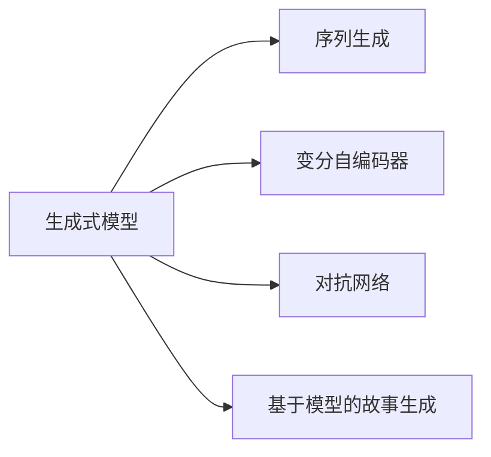

                 

# AI故事生成：技术与创意的完美结合

## 1. 背景介绍

### 1.1 问题由来
随着人工智能技术的发展，生成式模型在自然语言处理（NLP）领域中逐步崭露头角。与传统的基于规则的模型不同，生成式模型通过学习大规模的文本数据，能够生成具有丰富创造力和多样性的自然语言文本，从而在内容创作、文本摘要、自动对话等方面展现出强大的潜力。其中，故事生成是这一领域的一个重要应用方向，能够生成连贯、情节丰富且具有创造性的故事。

### 1.2 问题核心关键点
故事生成通常分为两部分：一是生成连贯的故事框架；二是填充细节以丰富故事情节。这两部分均需要人工智能技术的支持。目前，故事生成的主要技术包括序列生成模型、变分自编码器、对抗网络、基于模型的故事生成方法等。这些技术在各自的领域内取得了显著成果，但均存在一定的局限性。

### 1.3 问题研究意义
研究故事生成技术，对于推动NLP技术在文化、教育、娱乐等领域的应用具有重要意义：

1. 提升文化创作力：故事生成技术能够辅助作家和艺术家创作出更有创意和多样性的作品。
2. 促进教育创新：可以生成丰富的学习材料和互动式学习工具，提升学生的学习兴趣和效果。
3. 丰富娱乐体验：故事生成可以用于自动生成游戏剧情、对话和角色设定，提升游戏互动性和沉浸感。

## 2. 核心概念与联系

### 2.1 核心概念概述
故事生成技术通常涉及以下核心概念：

- 生成式模型(Generative Model)：通过学习大量文本数据，能够生成新的文本内容。
- 序列生成(Sequence Generation)：针对文本序列进行建模，能够生成连贯的文本内容。
- 变分自编码器(Variational Autoencoder, VAE)：通过将文本编码到潜在空间，再从潜在空间中生成文本。
- 对抗网络(GANs)：通过两个对抗的网络结构，生成逼真的文本内容。
- 基于模型的故事生成(Generative Storytelling)：通过构建故事框架模型，自动生成故事情节。

### 2.2 核心概念原理和架构的 Mermaid 流程图


此流程图展示了故事生成过程中涉及的主要技术架构。通过这些技术，故事生成器能够从不同的角度进行故事建模和生成。

## 3. 核心算法原理 & 具体操作步骤
### 3.1 算法原理概述

故事生成技术主要基于生成式模型，通过学习大量文本数据，能够生成新的文本内容。其核心算法原理如下：

1. **序列生成模型**：通过RNN、LSTM等序列模型，对文本序列进行建模，生成连贯的文本。
2. **变分自编码器**：通过将文本编码为潜在空间，再从潜在空间中生成文本，能够捕捉文本的复杂分布。
3. **对抗网络**：通过生成网络和判别网络的对抗训练，生成逼真的文本内容，能够生成高质量的文本。
4. **基于模型的故事生成**：构建故事框架模型，自动生成故事情节，能够生成有情节、有逻辑的故事。

### 3.2 算法步骤详解

以基于变分自编码器的故事生成为例，其算法步骤如下：

**Step 1: 数据准备**
- 收集并清洗大量故事数据，包括情节、角色、背景等。
- 将文本数据编码成向量表示。

**Step 2: 模型构建**
- 构建编码器，将文本编码为潜在空间的向量。
- 构建解码器，从潜在空间中生成文本。
- 确定损失函数，如KL散度损失。

**Step 3: 模型训练**
- 训练编码器和解码器，最小化KL散度损失。
- 在测试集上进行评估，生成故事片段。

**Step 4: 故事生成**
- 使用训练好的模型，生成完整的故事情节。
- 根据故事情节，进一步填充细节。

### 3.3 算法优缺点

变分自编码器的故事生成具有以下优点：

1. **生成多样性**：能够生成多种不同风格的故事，具备较高的创造力。
2. **分布捕捉**：能够学习文本的复杂分布，生成逼真的文本内容。
3. **可解释性**：生成过程可解释性强，用户能够理解模型生成逻辑。

但其缺点也较为明显：

1. **训练复杂**：需要大量的训练数据和计算资源，训练过程复杂。
2. **生成质量**：生成的故事可能缺乏连贯性和逻辑性，情节生硬。
3. **控制能力**：用户难以精确控制故事情节的发展，生成结果可能与用户期望不符。

### 3.4 算法应用领域

变分自编码器的故事生成技术在以下领域有着广泛的应用：

1. **文学创作**：辅助作家创作多样化、有创意的故事。
2. **教育材料生成**：生成丰富的教育材料和互动式学习工具。
3. **游戏剧情生成**：自动生成游戏剧情和角色设定，提升游戏互动性和沉浸感。

## 4. 数学模型和公式 & 详细讲解

### 4.1 数学模型构建

变分自编码器的核心数学模型如下：

$$
\begin{aligned}
p(z|x) &= \mathcal{N}(z|\mu(x),\sigma(x)) \\
p(x|z) &= \mathcal{N}(x|f(z),\lambda(z)) \\
\end{aligned}
$$

其中，$z$ 为潜在空间的向量，$p(z|x)$ 为编码器输出的概率分布，$p(x|z)$ 为解码器输出的概率分布。通过最大化联合概率$p(z|x)p(x|z)$，进行模型训练。

### 4.2 公式推导过程

通过变分推断，可以将变分自编码器的目标函数推导为：

$$
\begin{aligned}
L_{VAE} &= D_{KL}(q(z|x)||p(z|x)) - \mathbb{E}_{q(z|x)}\log p(x|z) \\
&= \int q(z|x)\log\frac{q(z|x)}{p(z|x)}dz - \mathbb{E}_{q(z|x)}\log p(x|z) \\
&= -\mathbb{E}_{q(z|x)}\log p(x|z) + \int q(z|x)\log q(z|x)dz \\
&= -\mathbb{E}_{q(z|x)}\log p(x|z) + H(q(z|x)) \\
&= -\mathbb{E}_{q(z|x)}\log p(x|z) + \frac{1}{2} \log|\Sigma(x)| + \frac{1}{2} tr(\Sigma(x)^\top \mu(x))
\end{aligned}
$$

其中，$D_{KL}$ 为KL散度，$H(q(z|x))$ 为编码器输出的潜在空间概率分布的熵，$\mu(x)$ 和 $\Sigma(x)$ 为编码器输出的均值和方差。

### 4.3 案例分析与讲解

以情感故事生成为例，情感故事能够生成带有特定情感倾向的故事片段。其模型构建如下：

$$
\begin{aligned}
p(z|x) &= \mathcal{N}(z|\mu(x),\sigma(x)) \\
p(x|z) &= \mathcal{N}(x|f(z),\lambda(z)) \\
p(y|x) &= \mathcal{B}(y|g(z))
\end{aligned}
$$

其中，$y$ 为情感标签，$p(y|x)$ 为情感分类器的输出概率。通过最大化联合概率$p(z|x)p(x|z)p(y|x)$，进行模型训练。

## 5. 项目实践：代码实例和详细解释说明

### 5.1 开发环境搭建

在开始故事生成实践前，需要搭建好开发环境。以下是使用Python和PyTorch搭建开发环境的详细步骤：

1. 安装Anaconda：从官网下载并安装Anaconda，用于创建独立的Python环境。

2. 创建并激活虚拟环境：
```bash
conda create -n pytorch-env python=3.8 
conda activate pytorch-env
```

3. 安装PyTorch：根据CUDA版本，从官网获取对应的安装命令。例如：
```bash
conda install pytorch torchvision torchaudio cudatoolkit=11.1 -c pytorch -c conda-forge
```

4. 安装transformers库：
```bash
pip install transformers
```

5. 安装各类工具包：
```bash
pip install numpy pandas scikit-learn matplotlib tqdm jupyter notebook ipython
```

完成上述步骤后，即可在`pytorch-env`环境中开始故事生成实践。

### 5.2 源代码详细实现

这里我们以变分自编码器的故事生成为例，给出使用PyTorch和transformers库的代码实现。

```python
import torch
import torch.nn as nn
import torch.optim as optim
from torch.distributions import Normal
from transformers import AutoTokenizer, AutoModelForSeq2SeqLM

class VAE(nn.Module):
    def __init__(self, model_name, latent_dim=128):
        super(VAE, self).__init__()
        self.model = AutoModelForSeq2SeqLM.from_pretrained(model_name)
        self.tokenizer = AutoTokenizer.from_pretrained(model_name)
        self.latent_dim = latent_dim
        
        # 编码器
        self.encoder = nn.Sequential(
            nn.Linear(self.model.config.hidden_size, 128),
            nn.Tanh(),
            nn.Linear(128, latent_dim)
        )
        
        # 解码器
        self.decoder = nn.Sequential(
            nn.Linear(latent_dim, 128),
            nn.Tanh(),
            nn.Linear(128, self.model.config.hidden_size),
            nn.Linear(self.model.config.hidden_size, self.model.config.vocab_size)
        )
        
    def encode(self, x):
        z_mean, z_var = self.encoder(x)
        return z_mean, z_var
    
    def decode(self, z):
        z = torch.cat((z, self.model(z)), dim=-1)
        return self.decoder(z)
    
    def reparameterize(self, z_mean, z_var):
        std = z_var.sqrt().to(z_mean.device)
        eps = torch.randn_like(std)
        return z_mean + eps * std
    
    def forward(self, x):
        z_mean, z_var = self.encode(x)
        z = self.reparameterize(z_mean, z_var)
        x_reconstructed = self.decode(z)
        return x_reconstructed

# 定义损失函数和优化器
criterion = nn.MSELoss()
optimizer = optim.Adam(self.parameters(), lr=1e-3)

# 加载数据集
dataset = load_dataset('path/to/dataset')

# 训练模型
for epoch in range(epochs):
    for batch in dataset:
        x = batch['input']
        x_reconstructed = self(x)
        loss = criterion(x_reconstructed, x)
        optimizer.zero_grad()
        loss.backward()
        optimizer.step()
```

### 5.3 代码解读与分析

让我们再详细解读一下关键代码的实现细节：

**VAE类**：
- `__init__`方法：初始化模型、tokenizer和潜在空间的维度。
- `encode`方法：对输入的文本进行编码，得到潜在空间的向量。
- `decode`方法：对潜在空间的向量进行解码，生成新的文本。
- `reparameterize`方法：对潜在空间的向量进行重参数化，用于生成多样性的故事片段。
- `forward`方法：对输入的文本进行编码、解码和损失计算。

**训练过程**：
- 使用MSELoss作为损失函数，计算输入和输出之间的均方误差。
- 使用Adam优化器进行模型参数更新，最小化损失函数。
- 使用数据集进行批量训练，反复迭代训练过程。

## 6. 实际应用场景

### 6.1 文学创作

变分自编码器的故事生成技术在文学创作中有着广泛的应用。通过变分自编码器，作家可以生成多样化、有创意的故事，提升创作效率和作品质量。具体而言，作家可以通过编写情感标签和情节线索，使用变分自编码器生成具有特定情感倾向的故事片段，再通过进一步的编辑和润色，创作出完整的文学作品。

### 6.2 教育材料生成

变分自编码器的故事生成技术可以用于生成丰富的教育材料，提升学生的学习兴趣和效果。例如，教师可以使用变分自编码器生成包含故事情节的课堂互动材料，让学生在故事中学习知识，提升学习体验。

### 6.3 游戏剧情生成

变分自编码器的故事生成技术可以用于生成游戏剧情和角色设定，提升游戏互动性和沉浸感。例如，游戏设计师可以使用变分自编码器生成包含故事情节的自动剧情，增强游戏的可玩性和吸引力。

### 6.4 未来应用展望

随着变分自编码器的故事生成技术的发展，未来的应用前景将更加广阔：

1. **情感智能应用**：变分自编码器可以生成具有特定情感倾向的故事，应用于心理咨询、情感支持等领域，帮助用户缓解情感压力。
2. **个性化推荐系统**：变分自编码器可以根据用户的兴趣爱好，生成个性化推荐的故事内容，提升用户体验。
3. **互动式学习工具**：变分自编码器可以生成包含故事情节的学习材料，提升学生的学习兴趣和效果。

## 7. 工具和资源推荐

### 7.1 学习资源推荐

为了帮助开发者系统掌握变分自编码器的故事生成技术，以下是一些优质的学习资源：

1. **《Deep Learning for Natural Language Processing》书籍**：由Yoshua Bengio等人撰写，系统介绍了NLP领域的主要技术和方法，包括生成式模型和变分自编码器。
2. **CS231n《深度学习课程》**：斯坦福大学开设的计算机视觉课程，涵盖了生成对抗网络等生成式模型相关内容。
3. **《Generative Adversarial Networks》书籍**：由Ian Goodfellow等人撰写，详细介绍了生成对抗网络的理论和实践，涵盖生成式模型和对抗训练。
4. **Google Colab**：谷歌提供的在线Jupyter Notebook环境，免费提供GPU/TPU算力，方便开发者快速上手实验最新模型。
5. **transformers官方文档**：HuggingFace开发的NLP工具库，提供了丰富的预训练模型和完整的微调样例代码。

通过对这些资源的学习实践，相信你一定能够快速掌握变分自编码器的故事生成技术，并用于解决实际的NLP问题。

### 7.2 开发工具推荐

高效的开发离不开优秀的工具支持。以下是几款用于故事生成开发的常用工具：

1. **PyTorch**：基于Python的开源深度学习框架，灵活动态的计算图，适合快速迭代研究。
2. **TensorFlow**：由Google主导开发的开源深度学习框架，生产部署方便，适合大规模工程应用。
3. **transformers库**：HuggingFace开发的NLP工具库，集成了众多预训练模型，支持PyTorch和TensorFlow，是进行故事生成任务开发的利器。
4. **TensorBoard**：TensorFlow配套的可视化工具，可实时监测模型训练状态，提供丰富的图表呈现方式。
5. **Weights & Biases**：模型训练的实验跟踪工具，可以记录和可视化模型训练过程中的各项指标，方便对比和调优。

合理利用这些工具，可以显著提升故事生成任务的开发效率，加快创新迭代的步伐。

### 7.3 相关论文推荐

故事生成技术的发展源于学界的持续研究。以下是几篇奠基性的相关论文，推荐阅读：

1. **"Generating Sequences with Recurrent Neural Networks"**：Hinton等人提出的序列生成模型，奠定了RNN在文本生成中的基础。
2. **"Learning Python's Syntax with Deep Generative Models"**：Google的研究表明，使用变分自编码器可以生成高质量的Python代码。
3. **"WaveNet: A Generative Model for Raw Audio"**：Google提出WaveNet，用于生成高质量的语音和音乐，展示了生成式模型在多模态生成中的潜力。
4. **"Progressive Growing of GANs for Improved Quality, Stability, and Variation"**：Karras等人提出的渐进式GANs，提高了生成式对抗网络的生成质量和稳定性。
5. **"Attention Is All You Need"**：Google提出Transformer模型，展示了自注意力机制在文本生成中的优越性能。

这些论文代表了大语言模型微调技术的发展脉络。通过学习这些前沿成果，可以帮助研究者把握学科前进方向，激发更多的创新灵感。

## 8. 总结：未来发展趋势与挑战

### 8.1 总结

本文对变分自编码器的故事生成技术进行了全面系统的介绍。首先阐述了故事生成的背景和意义，明确了故事生成在NLP领域的重要价值。其次，从原理到实践，详细讲解了变分自编码器的算法原理和操作步骤，给出了故事生成任务开发的完整代码实例。同时，本文还广泛探讨了故事生成技术在文学创作、教育、游戏等多个领域的应用前景，展示了技术的广阔潜力。

通过本文的系统梳理，可以看到，变分自编码器的故事生成技术正在成为NLP领域的重要范式，极大地拓展了文本生成的应用边界，为文化、教育、娱乐等领域带来了新的突破。未来，伴随变分自编码器和其他生成式模型的不断发展，故事生成技术必将进一步提升NLP系统的性能和应用范围，为人类认知智能的进化带来深远影响。

### 8.2 未来发展趋势

展望未来，变分自编码器的故事生成技术将呈现以下几个发展趋势：

1. **生成质量提升**：随着模型的不断优化，生成的故事将具备更高的连贯性、逻辑性和创造性。
2. **多模态融合**：结合视觉、语音等多模态数据，生成更加丰富和逼真的故事。
3. **控制能力增强**：用户能够更加精确地控制故事情节的发展，生成更加符合期望的结果。
4. **跨领域应用**：故事生成技术将拓展到更多领域，如医疗、法律、科学等，提升相关领域的内容创作和分析能力。
5. **交互式体验**：结合自然语言理解和生成技术，实现更加智能和交互式的用户故事生成体验。

### 8.3 面临的挑战

尽管变分自编码器的故事生成技术已经取得了显著成果，但在迈向更加智能化、普适化应用的过程中，它仍面临诸多挑战：

1. **数据依赖**：故事生成需要大量的高质量文本数据，数据收集和标注成本高，且数据质量对生成效果有很大影响。
2. **计算资源**：模型训练和推理需要大量计算资源，尤其是对于大规模的故事生成任务，计算开销巨大。
3. **多样性控制**：生成的故事可能缺乏多样性，无法满足不同用户的需求。
4. **伦理和安全**：生成故事可能含有不当内容，存在伦理和安全风险。

### 8.4 研究展望

面对变分自编码器的故事生成技术所面临的挑战，未来的研究需要在以下几个方面寻求新的突破：

1. **数据增强**：通过数据增强技术，提高数据的多样性和质量，缓解数据依赖问题。
2. **模型优化**：开发更加高效和鲁棒的生成模型，提升模型的生成质量和稳定性。
3. **多模态融合**：结合视觉、语音等多模态数据，实现多模态故事生成，提升生成内容的多样性和逼真度。
4. **控制策略**：研究更加灵活和可控的生成策略，增强用户对生成故事的控制能力。
5. **伦理与安全**：开发伦理和安全的生成模型，确保生成内容符合社会价值观和法律法规。

这些研究方向的探索，必将引领变分自编码器的故事生成技术迈向更高的台阶，为构建智能化的故事生成系统铺平道路。面向未来，变分自编码器的故事生成技术还需要与其他人工智能技术进行更深入的融合，如自然语言理解、推理等，多路径协同发力，共同推动故事生成技术的进步。只有勇于创新、敢于突破，才能不断拓展故事生成技术的边界，让故事生成技术更好地服务于人类社会。

## 9. 附录：常见问题与解答

**Q1：变分自编码器的故事生成是否适用于所有故事类型？**

A: 变分自编码器的故事生成在大多数故事类型上都能取得不错的效果，特别是对于情节丰富、情节连贯的故事。但对于情节简单、逻辑性不强的故事，变分自编码器可能难以生成高质量的文本。

**Q2：如何提升变分自编码器生成的故事质量？**

A: 提升变分自编码器生成的故事质量，可以通过以下方法：

1. **数据增强**：通过回译、近义替换等方式扩充训练集，提高数据的多样性。
2. **模型优化**：优化编码器和解码器的架构，提升模型的生成能力和质量。
3. **控制策略**：引入情感标签和情节线索，增强用户对故事情节的控制能力。
4. **后处理**：对生成的故事进行后期处理，如人工编辑和润色，提升故事质量。

**Q3：变分自编码器的故事生成是否具有可解释性？**

A: 变分自编码器的故事生成模型通常是黑盒模型，难以解释其内部的生成逻辑。但可以通过分析模型的损失函数、隐层输出等方式，获取一定的可解释性。

**Q4：变分自编码器的故事生成在实际应用中需要注意哪些问题？**

A: 在实际应用中，变分自编码器的故事生成需要注意以下问题：

1. **数据质量**：确保数据的质量和多样性，提升生成效果。
2. **计算资源**：计算资源开销巨大，需要考虑计算资源的合理分配和优化。
3. **用户控制**：用户需要具备一定的控制能力，能够灵活控制故事情节的发展。
4. **伦理和安全**：生成的故事需要符合社会价值观和法律法规，避免生成不当内容。

**Q5：变分自编码器的故事生成在未来有哪些应用前景？**

A: 变分自编码器的故事生成技术在未来的应用前景包括：

1. **文学创作**：辅助作家创作多样化、有创意的故事。
2. **教育材料生成**：生成丰富的教育材料和互动式学习工具，提升学生的学习兴趣和效果。
3. **游戏剧情生成**：自动生成游戏剧情和角色设定，提升游戏互动性和沉浸感。
4. **情感智能应用**：生成具有特定情感倾向的故事，应用于心理咨询、情感支持等领域。
5. **个性化推荐系统**：根据用户的兴趣爱好，生成个性化推荐的故事内容，提升用户体验。

总之，变分自编码器的故事生成技术在未来的应用领域非常广阔，将为NLP技术带来更多的创新和突破。

---

作者：禅与计算机程序设计艺术 / Zen and the Art of Computer Programming

