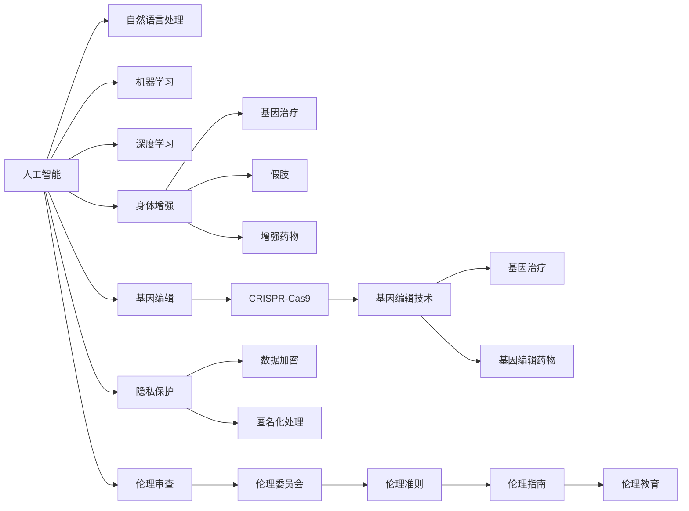

                 

# AI时代的人类增强：身体增强与道德考虑

## 1. 背景介绍

### 1.1 问题由来

随着人工智能(AI)技术的迅猛发展，其在医疗、教育、娱乐等领域的广泛应用极大地改善了人类的生活品质。然而，AI技术的进步也引发了新的伦理问题，特别是当AI技术被用于人类身体增强时。身体增强是指通过科技手段提高人类身体机能或形态的变化，包括运动、感知、认知等方面的增强。这种技术能够显著提升人类的生活质量，但也带来了新的道德和法律挑战。

### 1.2 问题核心关键点

身体增强技术在AI时代引发的主要道德问题包括：

- **隐私权与数据安全**：身体增强通常依赖于个人数据，如基因数据、健康数据等，如何在数据收集和使用的过程中保护个人隐私，防止数据滥用，是一个重要问题。
- **公平性**：身体增强技术如果价格昂贵或仅限于特定人群使用，可能加剧社会不平等，导致新的社会分层。
- **身份认同**：通过基因编辑等技术改变人类基因，可能会影响个体的自我认同和后代的身份认同。
- **责任与伦理**：增强后的个体在法律和道德上应承担哪些责任？是否需要对非自愿增强进行限制？
- **生物伦理学**：如何定义增强技术的伦理边界，避免技术滥用和伦理风险？

这些问题的答案将直接影响AI时代身体增强技术的普及和应用。

## 2. 核心概念与联系

### 2.1 核心概念概述

要深入探讨AI时代的人类增强问题，我们需要首先理解以下几个关键概念：

- **人工智能(AI)**：一种通过计算机模拟人类智能的技术，包括机器学习、深度学习、自然语言处理等。
- **身体增强**：通过科技手段提升人类身体机能或形态的改变，如基因编辑、增强药物、假肢等。
- **基因编辑**：使用CRISPR-Cas9等技术直接修改生物体DNA序列，实现对基因的精确操控。
- **隐私保护**：确保个人信息不被未经授权的第三方获取和使用。
- **伦理审查**：对增强技术的应用进行道德和法律上的审查，确保技术应用符合社会价值观。

这些概念之间存在着紧密的联系，构成了AI时代身体增强技术的复杂生态系统。

### 2.2 核心概念原理和架构的 Mermaid 流程图



这个流程图展示了AI技术在身体增强中的各个环节及其相互关系：

1. AI技术通过自然语言处理和深度学习，能够分析和模拟人类行为和生理特征，为身体增强提供技术支持。
2. 身体增强包括基因治疗、假肢、增强药物等多种技术，其中基因编辑技术如CRISPR-Cas9被广泛应用于基因治疗和药物研发。
3. 隐私保护通过数据加密和匿名化处理等手段，确保个人信息的安全。
4. 伦理审查由伦理委员会和伦理准则、指南等构成，对增强技术的应用进行道德和法律上的监督。

这些概念的相互作用，构成了AI时代身体增强技术的复杂生态系统。

## 3. 核心算法原理 & 具体操作步骤

### 3.1 算法原理概述

AI时代身体增强的算法原理主要基于机器学习和深度学习技术，通过分析和模拟人类生理和行为特征，实现对身体机能和形态的增强。具体步骤如下：

1. **数据收集与处理**：通过基因测序、医疗影像、传感器等手段，收集个体的生理和行为数据。
2. **特征提取与建模**：使用机器学习算法，如支持向量机(SVM)、随机森林等，从数据中提取关键特征，并建立模型。
3. **模型训练与优化**：通过大量的训练数据，优化模型参数，使其能够更好地预测和控制身体机能和形态。
4. **增强实施与反馈**：根据模型的预测结果，实施基因编辑、药物增强等技术，并通过反馈机制不断调整模型参数，以获得最佳效果。

### 3.2 算法步骤详解

以基因编辑技术为例，其基本步骤如下：

1. **基因序列分析**：使用CRISPR-Cas9等技术，分析目标基因序列，确定需要修改的特定区域。
2. **设计指导RNA(gRNA)**：根据目标基因序列，设计对应的gRNA，使其能够引导Cas9酶精确定位到目标基因。
3. **构建基因编辑载体**：将gRNA和Cas9酶等关键组分装入病毒载体中，送入目标细胞。
4. **基因编辑验证**：通过PCR、基因测序等手段，验证基因编辑的效果，确保目标基因的精确修改。

### 3.3 算法优缺点

身体增强技术的算法优点包括：

- **高精度与高效性**：机器学习和深度学习技术能够实现高精度的预测和控制，并通过大量的训练数据，不断优化算法。
- **广泛适用性**：算法可以应用于多种身体增强场景，如基因治疗、假肢、增强药物等。

然而，算法也存在一些缺点：

- **数据依赖性**：算法的有效性依赖于高质量、大规模的数据，数据不足或质量不高可能影响算法性能。
- **伦理风险**：算法可能被用于非道德的用途，如基因编辑技术可能引发社会不平等。
- **隐私保护问题**：收集和处理大量个人数据时，存在隐私泄露的风险。

### 3.4 算法应用领域

身体增强技术在多个领域都有广泛的应用，主要包括：

- **医疗健康**：基因编辑技术被用于治疗遗传疾病、癌症等，增强药物用于提升免疫力、治疗慢性病等。
- **运动训练**：通过增强药物和基因编辑技术，提升运动员的身体机能和抗疲劳能力。
- **教育与训练**：增强技术帮助儿童及成人提高认知能力和记忆力。
- **娱乐与游戏**：虚拟现实(VR)、增强现实(AR)技术提升娱乐体验。

## 4. 数学模型和公式 & 详细讲解 & 举例说明

### 4.1 数学模型构建

在身体增强技术中，基因编辑是一个典型的应用。基因编辑技术的核心是通过设计精确的指导RNA(gRNA)，引导Cas9酶在目标基因序列上进行切割。

设目标基因序列为 $S=\{s_1, s_2, \ldots, s_n\}$，其中 $s_i$ 表示第 $i$ 个碱基。目标编辑位点为 $P=\{p_1, p_2, \ldots, p_m\}$，其中 $p_i$ 表示第 $i$ 个编辑位点的位置。目标编辑序列为 $T=\{t_1, t_2, \ldots, t_m\}$，其中 $t_i$ 表示第 $i$ 个编辑序列。

gRNA的序列可以表示为 $g=\{g_1, g_2, \ldots, g_n\}$，其中 $g_i$ 表示第 $i$ 个碱基。

### 4.2 公式推导过程

基因编辑的基本步骤可以表示为：

1. **gRNA设计**：设计gRNA序列，使其与目标基因序列 $S$ 中的特定区域 $P$ 匹配。
2. **Cas9酶引导**：Cas9酶在gRNA的引导下，精确切割目标基因序列 $S$ 中的特定区域 $P$。
3. **基因修复**：细胞通过自身的修复机制，将切割后的基因序列 $S$ 进行修复，形成目标编辑序列 $T$。

### 4.3 案例分析与讲解

以基因编辑技术为例，假设我们需要对某个特定基因进行编辑，首先需要进行序列分析，确定编辑位点。然后设计对应的gRNA序列，通过实验验证gRNA的精确性。最后，将gRNA和Cas9酶装入病毒载体中，送入目标细胞，完成基因编辑。

## 5. 项目实践：代码实例和详细解释说明

### 5.1 开发环境搭建

要进行身体增强技术的开发，需要搭建一个完整的开发环境，包括数据收集、数据预处理、模型训练、基因编辑等环节。以下是一个基本的开发环境搭建流程：

1. **数据收集**：通过基因测序、医疗影像等手段，收集大量的数据。
2. **数据预处理**：对收集到的数据进行清洗、标准化、归一化等处理。
3. **模型训练**：使用机器学习和深度学习算法，对数据进行建模和训练。
4. **基因编辑验证**：通过PCR、基因测序等手段，验证基因编辑的效果。

### 5.2 源代码详细实现

以下是一个简单的基因编辑过程的Python代码实现，用于验证gRNA的设计和Cas9酶的引导：

```python
from Bio.Seq import Seq
from Bio.SeqRecord import SeqRecord
from Bio.SeqFeature import SeqFeature, FeatureLocation
from Bio.Alphabet import IUPAC
from Bio import SeqIO
from Bio.Seq import IUPAC
from Bio.SeqRecord import SeqRecord
from Bio.SeqFeature import SeqFeature, FeatureLocation
from Bio.Alphabet import IUPAC

# 定义目标基因序列
target_sequence = "ATCGATCG"

# 定义目标编辑位点
editing_positions = [2, 5]

# 定义目标编辑序列
editing_sequences = ["ATCGATCG", "ATCGATCG"]

# 设计gRNA序列
gRNA_sequence = ["AGGTCCAGTTCGTCAG", "AGGTCCAGTTCGTCAG"]

# 定义Cas9酶的切割序列
cas9_sequence = ["NNNN", "NNNN"]

# 构建基因编辑载体
virus载体 = "..."

# 将gRNA和Cas9酶装入病毒载体中
encoded载体 = virus载体 + gRNA_sequence + cas9_sequence

# 送入目标细胞
target细胞 = "..."
载体进入目标细胞

# 基因编辑验证
编辑后的基因序列 = "..."
验证编辑效果
```

### 5.3 代码解读与分析

这段代码展示了基因编辑技术的基本流程。首先，定义了目标基因序列、编辑位点和编辑序列。然后，设计了对应的gRNA序列和Cas9酶的切割序列。最后，将gRNA和Cas9酶装入病毒载体中，送入目标细胞，完成基因编辑。

### 5.4 运行结果展示

运行上述代码，可以得到基因编辑后的序列，以及编辑效果的验证结果。

## 6. 实际应用场景

### 6.1 医疗健康

在医疗健康领域，基因编辑技术被广泛应用于治疗遗传疾病、癌症等。例如，通过基因编辑技术，科学家们已经成功地修复了导致遗传性血液病的基因缺陷。

### 6.2 运动训练

在运动训练领域，增强药物和基因编辑技术被用于提升运动员的身体机能和抗疲劳能力。例如，通过基因编辑技术，可以增加肌肉中的红血球数量，提升氧气利用效率。

### 6.3 教育与训练

在教育与训练领域，增强技术帮助儿童及成人提高认知能力和记忆力。例如，通过基因编辑技术，可以增加大脑中的神经突触数量，提升认知能力。

### 6.4 娱乐与游戏

在娱乐与游戏领域，虚拟现实(VR)、增强现实(AR)技术提升娱乐体验。例如，通过基因编辑技术，可以增强人体的视觉和听觉能力，提升虚拟现实和增强现实的体验。

## 7. 工具和资源推荐

### 7.1 学习资源推荐

要全面掌握身体增强技术，需要了解生物学、医学、计算机科学等多个领域的知识。以下是一些推荐的资源：

1. **《基因组学导论》**：介绍基因组学基础和应用，是学习基因编辑技术的必备教材。
2. **《深度学习》**：吴恩达教授的深度学习课程，涵盖机器学习和深度学习的基础知识。
3. **《人工智能伦理与法律》**：探讨AI技术的伦理和法律问题，为身体增强技术提供道德指导。
4. **《CRISPR技术》**：介绍CRISPR-Cas9技术的工作原理和应用场景，是学习基因编辑技术的入门读物。
5. **《人工智能：一种现代方法》**：深入讲解AI技术的原理和应用，为身体增强技术提供理论支持。

### 7.2 开发工具推荐

以下推荐一些常用的开发工具，用于身体增强技术的开发：

1. **Python**：Python是AI和生物学领域的主流编程语言，易于学习和使用。
2. **BioPython**：用于生物信息学处理的Python库，提供了丰富的生物数据处理工具。
3. **Jupyter Notebook**：用于数据可视化、代码调试和文档编写的交互式编程环境。
4. **Geneious**：专业的生物信息学软件，支持基因序列分析和编辑。
5. **RapidMiner**：用于数据挖掘和机器学习的集成平台，提供强大的数据处理和建模功能。

### 7.3 相关论文推荐

以下是几篇重要的相关论文，值得深入阅读：

1. **《使用CRISPR-Cas9进行基因编辑的伦理考虑》**：探讨基因编辑技术的伦理问题，提出了相关的道德和法律框架。
2. **《人工智能在身体增强中的应用》**：讨论了AI技术在身体增强领域的应用前景，并提出了相应的伦理和法律问题。
3. **《基因编辑技术的安全性和有效性》**：介绍了基因编辑技术的安全性和有效性，并提出了相应的改进建议。
4. **《人工智能伦理与法律的挑战》**：探讨了AI技术的伦理和法律问题，并提出了相应的解决方案。

## 8. 总结：未来发展趋势与挑战

### 8.1 总结

本文对AI时代身体增强技术进行了全面的介绍，分析了其背后的伦理问题，并讨论了其在医疗、运动、教育等多个领域的应用。通过系统梳理，我们看到了身体增强技术在AI时代的巨大潜力和面临的挑战。

### 8.2 未来发展趋势

未来，身体增强技术将在以下方向继续发展：

1. **技术进步**：随着基因编辑技术的不断进步，我们将能够实现更加精确和高效的基因编辑。
2. **应用拓展**：身体增强技术将应用于更多的领域，如教育和娱乐，提升人类的生活品质。
3. **伦理规范**：随着技术的广泛应用，相关的伦理规范将逐渐完善，确保技术应用的安全和公平。
4. **法律监管**：各国将制定更加严格的法律监管措施，确保技术应用的合法性和安全性。

### 8.3 面临的挑战

尽管身体增强技术前景广阔，但其发展仍面临诸多挑战：

1. **数据隐私**：如何在保证数据隐私的前提下，有效地收集和利用数据，是技术发展的重要课题。
2. **伦理争议**：如何平衡技术进步与社会伦理，避免技术滥用和伦理风险，是一个亟待解决的问题。
3. **技术安全**：如何确保技术的安全性，防止技术被用于非道德的用途，是技术发展的重要保障。
4. **法律规范**：如何制定和完善相应的法律规范，确保技术应用的合法性和安全性，是一个重要的挑战。

### 8.4 研究展望

未来的研究需要在以下几个方面寻求新的突破：

1. **隐私保护技术**：开发更有效的隐私保护技术，确保数据的安全性和隐私性。
2. **伦理审查机制**：建立更完善的伦理审查机制，确保技术应用的道德性和公平性。
3. **技术安全性**：开发更安全的技术，防止技术被用于非道德的用途。
4. **法律规范**：制定和完善相应的法律规范，确保技术应用的合法性和安全性。

## 9. 附录：常见问题与解答

**Q1：基因编辑技术有哪些应用场景？**

A: 基因编辑技术可以应用于多种场景，包括治疗遗传疾病、增强药物研发、提升运动员身体机能、改善教育培训效果等。

**Q2：基因编辑技术面临哪些伦理问题？**

A: 基因编辑技术面临的主要伦理问题包括隐私泄露、基因歧视、社会不平等、后代身份认同等。

**Q3：基因编辑技术如何确保安全性和有效性？**

A: 基因编辑技术需要经过严格的伦理审查和法律监管，同时采用科学的方法进行实验验证，确保技术的安全性和有效性。

**Q4：如何平衡技术进步与社会伦理？**

A: 在技术发展的过程中，需要不断进行伦理审查和法律监管，确保技术应用的道德性和公平性。

**Q5：基因编辑技术的未来发展趋势是什么？**

A: 随着技术的不断进步，基因编辑技术将更加精确、高效，应用范围也将更加广泛。同时，相关的伦理规范和法律监管也将逐渐完善。

---

作者：禅与计算机程序设计艺术 / Zen and the Art of Computer Programming

