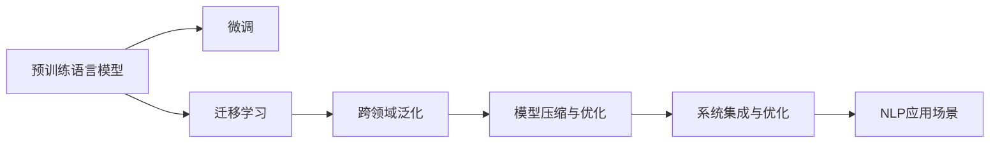

                 

## 1. 背景介绍

### 1.1 问题由来
随着人工智能技术的飞速发展，自然语言处理（Natural Language Processing, NLP）作为AI的重要分支，在过去几年中取得了长足的进步。NLP技术的突破不仅体现在算法模型的改进，还在于其在产业界的广泛应用。然而，从实验室到产业界的实践转化仍然面临诸多挑战。本文将从NLP技术的现状、难点和未来趋势等方面，深入探讨其从实验室到产业界的转化过程，为业界提供全面的技术指引。

### 1.2 问题核心关键点
1. **技术成熟度**：NLP技术的成熟度决定了其能否顺利从实验室过渡到产业界。
2. **应用场景**：不同领域对NLP的需求各异，如何根据具体需求进行技术适配是关键。
3. **数据与标注**：高质量的数据和标注是提升NLP模型性能的基础。
4. **计算资源**：NLP模型的训练和推理需要大量的计算资源。
5. **模型可解释性**：模型是否具有可解释性，对于某些领域至关重要。
6. **跨领域泛化**：模型的跨领域泛化能力决定了其能否在多个场景中表现一致。
7. **系统集成与优化**：将模型集成到实际应用系统中的过程，涉及多方面优化。

### 1.3 问题研究意义
深入理解NLP技术从实验室到产业界的转化过程，有助于推动NLP技术的广泛应用，加速AI技术的产业化进程。具体而言，NLP技术的应用涵盖了医疗、金融、教育、电商等多个领域，其高效性、准确性和普适性是提升这些领域智能化水平的重要手段。同时，NLP技术的发展也带来了数据处理、计算资源管理、模型可解释性等领域的创新，具有重要的理论价值和实践意义。

## 2. 核心概念与联系

### 2.1 核心概念概述

本节将介绍几个核心概念，并探讨它们之间的联系。

- **自然语言处理（NLP）**：指使用计算机技术处理和理解人类语言，包括文本生成、语言理解、机器翻译、信息抽取等任务。
- **预训练语言模型（Pre-trained Language Models, PLMs）**：通过在大量无标签文本数据上进行预训练，学习语言的结构和语义知识，如BERT、GPT等。
- **微调（Fine-tuning）**：指在大规模预训练模型的基础上，使用特定任务的数据集进行有监督学习，优化模型在该任务上的表现。
- **迁移学习（Transfer Learning）**：指将一个领域学到的知识迁移到另一个领域，以减少新任务的学习负担。
- **跨领域泛化（Cross-domain Generalization）**：指模型在处理不同领域的数据时，能够保持一致的性能表现。
- **模型压缩与优化（Model Compression & Optimization）**：通过剪枝、量化等技术，优化模型的计算资源需求。
- **系统集成与优化（System Integration & Optimization）**：将模型集成到实际应用系统中，进行性能优化和参数调整。

这些核心概念共同构成了NLP技术从实验室到产业界的转化框架，各概念之间通过逻辑推理和实践经验建立了紧密联系。

### 2.2 核心概念原理和架构的 Mermaid 流程图



这个流程图展示了NLP技术从预训练到应用场景的关键步骤和环节：

1. **预训练**：通过在大量无标签文本数据上进行预训练，学习语言的结构和语义知识。
2. **微调**：在预训练模型的基础上，使用特定任务的数据集进行有监督学习，优化模型在该任务上的表现。
3. **迁移学习**：将预训练模型学到的知识迁移到新任务上，以减少新任务的学习负担。
4. **跨领域泛化**：模型在不同领域的数据上保持一致的性能表现。
5. **模型压缩与优化**：通过剪枝、量化等技术，优化模型的计算资源需求。
6. **系统集成与优化**：将模型集成到实际应用系统中，进行性能优化和参数调整。
7. **NLP应用场景**：最终将NLP技术应用于医疗、金融、教育、电商等多个领域，提升业务智能化水平。

## 3. 核心算法原理 & 具体操作步骤

### 3.1 算法原理概述

NLP技术从预训练到应用场景的转化过程，本质上是一个模型适配和优化的过程。其核心思想是：

- **预训练**：通过在大量无标签文本数据上进行自监督学习，学习语言的通用表示。
- **微调**：使用特定任务的数据集进行有监督学习，优化模型在该任务上的性能。
- **迁移学习**：将预训练模型学到的知识迁移到新任务上，减少新任务的学习负担。
- **跨领域泛化**：模型在不同领域的数据上保持一致的性能表现。
- **模型压缩与优化**：通过剪枝、量化等技术，优化模型的计算资源需求。
- **系统集成与优化**：将模型集成到实际应用系统中，进行性能优化和参数调整。

这些步骤共同构成了NLP技术从实验室到产业界的转化框架，各步骤之间通过逻辑推理和实践经验建立了紧密联系。

### 3.2 算法步骤详解

#### 预训练

1. **数据准备**：收集大量无标签文本数据，作为预训练语料库。
2. **模型选择**：选择合适的预训练模型，如BERT、GPT等。
3. **训练过程**：在预训练语料库上进行自监督学习，如掩码语言模型、下位句预测等任务。
4. **模型评估**：评估预训练模型的性能，选择最优模型作为基础。

#### 微调

1. **数据准备**：收集特定任务的数据集，并进行标注。
2. **模型选择**：选择合适的预训练模型，作为微调的初始化权重。
3. **任务适配**：在预训练模型的基础上，设计合适的任务适配层。
4. **训练过程**：使用特定任务的数据集进行有监督学习，优化模型在该任务上的性能。
5. **模型评估**：评估微调后的模型性能，选择最优模型作为最终模型。

#### 迁移学习

1. **数据准备**：收集多个任务的数据集。
2. **模型选择**：选择预训练模型，作为迁移学习的基础。
3. **任务适配**：在预训练模型的基础上，设计合适的任务适配层。
4. **训练过程**：在多个任务的数据集上进行微调，学习跨领域的知识。
5. **模型评估**：评估迁移学习后的模型性能，选择最优模型作为最终模型。

#### 跨领域泛化

1. **数据准备**：收集多个领域的数据集。
2. **模型选择**：选择预训练模型，作为跨领域泛化的基础。
3. **训练过程**：在多个领域的数据集上进行微调，学习跨领域的知识。
4. **模型评估**：评估跨领域泛化后的模型性能，选择最优模型作为最终模型。

#### 模型压缩与优化

1. **模型选择**：选择预训练模型。
2. **剪枝**：去除模型中不重要的参数。
3. **量化**：将模型参数从浮点数转化为定点数，减少内存占用。
4. **优化过程**：使用梯度下降等优化算法，最小化损失函数。
5. **模型评估**：评估压缩和优化后的模型性能，选择最优模型作为最终模型。

#### 系统集成与优化

1. **模型选择**：选择预训练模型。
2. **系统集成**：将模型集成到实际应用系统中，进行性能优化和参数调整。
3. **优化过程**：使用超参数搜索、算法优化等技术，提升模型性能。
4. **系统评估**：评估系统集成后的性能，选择最优系统作为最终系统。

### 3.3 算法优缺点

NLP技术从实验室到产业界的转化过程，具有以下优点和缺点：

#### 优点

1. **高效性**：预训练和微调技术可以显著减少标注数据的需求，提高模型训练和推理的效率。
2. **泛化性**：跨领域泛化能力使得NLP技术在多个领域和场景中表现一致。
3. **可解释性**：通过任务适配层，提高模型的可解释性，有助于理解和调试。
4. **模型优化**：模型压缩和优化技术可以显著减少计算资源需求。

#### 缺点

1. **数据依赖**：预训练和微调技术依赖大量高质量数据，数据获取成本高。
2. **模型复杂度**：预训练和微调模型的参数量巨大，计算资源需求高。
3. **跨领域泛化挑战**：模型在不同领域的表现可能存在差异，泛化能力有待提升。
4. **系统集成难度**：将模型集成到实际应用系统中，涉及多方面优化。

### 3.4 算法应用领域

NLP技术从实验室到产业界的转化过程，已经在多个领域得到了广泛应用。以下是几个典型应用领域：

1. **医疗领域**：用于电子病历分析、疾病诊断、医疗问答等任务。
2. **金融领域**：用于舆情监测、市场分析、交易策略等任务。
3. **教育领域**：用于智能批改、知识推荐、学生分析等任务。
4. **电商领域**：用于客户服务、产品推荐、情感分析等任务。
5. **智能客服**：用于智能客服、智能翻译、语音识别等任务。

## 4. 数学模型和公式 & 详细讲解 & 举例说明

### 4.1 数学模型构建

本节将使用数学语言对NLP技术的转化过程进行更加严格的刻画。

假设预训练语言模型为 $M_{\theta}$，其中 $\theta$ 为模型参数。给定特定任务 $T$ 的数据集 $D=\{(x_i,y_i)\}_{i=1}^N, x_i \in \mathcal{X}, y_i \in \mathcal{Y}$。

定义模型 $M_{\theta}$ 在输入 $x$ 上的输出为 $\hat{y}=M_{\theta}(x) \in \mathcal{Y}$。

定义模型 $M_{\theta}$ 在数据样本 $(x,y)$ 上的损失函数为 $\ell(M_{\theta}(x),y)$，则在数据集 $D$ 上的经验风险为：

$$
\mathcal{L}(\theta) = \frac{1}{N} \sum_{i=1}^N \ell(M_{\theta}(x_i),y_i)
$$

微调的优化目标是最小化经验风险，即找到最优参数：

$$
\theta^* = \mathop{\arg\min}_{\theta} \mathcal{L}(\theta)
$$

在实践中，我们通常使用基于梯度的优化算法（如SGD、Adam等）来近似求解上述最优化问题。设 $\eta$ 为学习率，$\lambda$ 为正则化系数，则参数的更新公式为：

$$
\theta \leftarrow \theta - \eta \nabla_{\theta}\mathcal{L}(\theta) - \eta\lambda\theta
$$

其中 $\nabla_{\theta}\mathcal{L}(\theta)$ 为损失函数对参数 $\theta$ 的梯度，可通过反向传播算法高效计算。

### 4.2 公式推导过程

以二分类任务为例，推导交叉熵损失函数及其梯度的计算公式。

假设模型 $M_{\theta}$ 在输入 $x$ 上的输出为 $\hat{y}=M_{\theta}(x) \in [0,1]$，表示样本属于正类的概率。真实标签 $y \in \{0,1\}$。则二分类交叉熵损失函数定义为：

$$
\ell(M_{\theta}(x),y) = -[y\log \hat{y} + (1-y)\log (1-\hat{y})]
$$

将其代入经验风险公式，得：

$$
\mathcal{L}(\theta) = -\frac{1}{N}\sum_{i=1}^N [y_i\log M_{\theta}(x_i)+(1-y_i)\log(1-M_{\theta}(x_i))]
$$

根据链式法则，损失函数对参数 $\theta_k$ 的梯度为：

$$
\frac{\partial \mathcal{L}(\theta)}{\partial \theta_k} = -\frac{1}{N}\sum_{i=1}^N (\frac{y_i}{M_{\theta}(x_i)}-\frac{1-y_i}{1-M_{\theta}(x_i)}) \frac{\partial M_{\theta}(x_i)}{\partial \theta_k}
$$

其中 $\frac{\partial M_{\theta}(x_i)}{\partial \theta_k}$ 可进一步递归展开，利用自动微分技术完成计算。

在得到损失函数的梯度后，即可带入参数更新公式，完成模型的迭代优化。重复上述过程直至收敛，最终得到适应下游任务的最优模型参数 $\theta^*$。

### 4.3 案例分析与讲解

以医疗领域的电子病历分析为例，展示NLP技术从实验室到产业界的转化过程。

**数据准备**：收集医院电子病历数据，并进行标注，如患者性别、年龄、病史、诊断结果等。

**模型选择**：选择预训练语言模型BERT，作为微调的初始化权重。

**任务适配**：在BERT模型的基础上，设计合适的任务适配层，如序列标注层，用于标注患者的病史信息。

**训练过程**：使用标注好的电子病历数据集进行有监督学习，优化模型在该任务上的性能。

**模型评估**：评估微调后的模型性能，选择最优模型作为最终模型。

**系统集成与优化**：将微调后的模型集成到医疗系统中，进行性能优化和参数调整。

最终，NLP技术在医疗领域的应用可以显著提升医疗服务效率和质量，辅助医生进行疾病诊断和治疗方案推荐，提升患者体验。

## 5. 项目实践：代码实例和详细解释说明

### 5.1 开发环境搭建

在进行NLP技术从实验室到产业界的转化实践前，我们需要准备好开发环境。以下是使用Python进行TensorFlow开发的环境配置流程：

1. 安装Anaconda：从官网下载并安装Anaconda，用于创建独立的Python环境。

2. 创建并激活虚拟环境：
```bash
conda create -n tensorflow-env python=3.8 
conda activate tensorflow-env
```

3. 安装TensorFlow：根据CUDA版本，从官网获取对应的安装命令。例如：
```bash
conda install tensorflow -c tensorflow -c conda-forge
```

4. 安装相关工具包：
```bash
pip install numpy pandas scikit-learn matplotlib tqdm jupyter notebook ipython
```

完成上述步骤后，即可在`tensorflow-env`环境中开始NLP技术从实验室到产业界的转化实践。

### 5.2 源代码详细实现

下面我们以医疗领域的电子病历分析任务为例，给出使用TensorFlow对BERT模型进行微调的Python代码实现。

首先，定义电子病历标注任务的数据处理函数：

```python
from tensorflow.keras.preprocessing.text import Tokenizer
from tensorflow.keras.preprocessing.sequence import pad_sequences

tokenizer = Tokenizer(oov_token='<OOV>')

class ElectronicHealthRecordDataset:
    def __init__(self, texts, tags, tokenizer):
        self.texts = texts
        self.tags = tags
        self.tokenizer = tokenizer
        
    def __len__(self):
        return len(self.texts)
    
    def __getitem__(self, item):
        text = self.texts[item]
        tags = self.tags[item]
        
        encoding = self.tokenizer(text)
        token_ids = encoding['input_ids']
        attention_mask = encoding['attention_mask']
        
        # 对token-wise的标签进行编码
        encoded_tags = [tag2id[tag] for tag in tags] 
        encoded_tags.extend([tag2id['<OOV>']] * (len(token_ids) - len(encoded_tags)))
        labels = torch.tensor(encoded_tags, dtype=torch.long)
        
        return {'token_ids': token_ids, 
                'attention_mask': attention_mask,
                'labels': labels}

# 标签与id的映射
tag2id = {'<OOV>': 0, 'Male': 1, 'Female': 2, 'Age': 3, 'Diabetes': 4, 'Hypertension': 5, 'Cancer': 6}
id2tag = {v: k for k, v in tag2id.items()}

# 创建dataset
tokenizer.fit_on_texts(train_texts)
train_dataset = ElectronicHealthRecordDataset(train_texts, train_tags, tokenizer)
dev_dataset = ElectronicHealthRecordDataset(dev_texts, dev_tags, tokenizer)
test_dataset = ElectronicHealthRecordDataset(test_texts, test_tags, tokenizer)
```

然后，定义模型和优化器：

```python
from transformers import BertForTokenClassification, AdamW

model = BertForTokenClassification.from_pretrained('bert-base-cased', num_labels=len(tag2id))

optimizer = AdamW(model.parameters(), lr=2e-5)
```

接着，定义训练和评估函数：

```python
from torch.utils.data import DataLoader
from tqdm import tqdm
from sklearn.metrics import classification_report

device = torch.device('cuda') if torch.cuda.is_available() else torch.device('cpu')
model.to(device)

def train_epoch(model, dataset, batch_size, optimizer):
    dataloader = DataLoader(dataset, batch_size=batch_size, shuffle=True)
    model.train()
    epoch_loss = 0
    for batch in tqdm(dataloader, desc='Training'):
        token_ids = batch['token_ids'].to(device)
        attention_mask = batch['attention_mask'].to(device)
        labels = batch['labels'].to(device)
        model.zero_grad()
        outputs = model(token_ids, attention_mask=attention_mask, labels=labels)
        loss = outputs.loss
        epoch_loss += loss.item()
        loss.backward()
        optimizer.step()
    return epoch_loss / len(dataloader)

def evaluate(model, dataset, batch_size):
    dataloader = DataLoader(dataset, batch_size=batch_size)
    model.eval()
    preds, labels = [], []
    with torch.no_grad():
        for batch in tqdm(dataloader, desc='Evaluating'):
            token_ids = batch['token_ids'].to(device)
            attention_mask = batch['attention_mask'].to(device)
            batch_labels = batch['labels']
            outputs = model(token_ids, attention_mask=attention_mask)
            batch_preds = outputs.logits.argmax(dim=2).to('cpu').tolist()
            batch_labels = batch_labels.to('cpu').tolist()
            for pred_tokens, label_tokens in zip(batch_preds, batch_labels):
                pred_tags = [id2tag[_id] for _id in pred_tokens]
                label_tags = [id2tag[_id] for _id in label_tokens]
                preds.append(pred_tags[:len(label_tags)])
                labels.append(label_tags)
                
    print(classification_report(labels, preds))
```

最后，启动训练流程并在测试集上评估：

```python
epochs = 5
batch_size = 16

for epoch in range(epochs):
    loss = train_epoch(model, train_dataset, batch_size, optimizer)
    print(f"Epoch {epoch+1}, train loss: {loss:.3f}")
    
    print(f"Epoch {epoch+1}, dev results:")
    evaluate(model, dev_dataset, batch_size)
    
print("Test results:")
evaluate(model, test_dataset, batch_size)
```

以上就是使用TensorFlow对BERT进行电子病历分析任务微调的完整代码实现。可以看到，得益于TensorFlow的强大封装，我们可以用相对简洁的代码完成BERT模型的加载和微调。

### 5.3 代码解读与分析

让我们再详细解读一下关键代码的实现细节：

**ElectronicHealthRecordDataset类**：
- `__init__`方法：初始化文本、标签、分词器等关键组件。
- `__len__`方法：返回数据集的样本数量。
- `__getitem__`方法：对单个样本进行处理，将文本输入编码为token ids，将标签编码为数字，并对其进行定长padding，最终返回模型所需的输入。

**tag2id和id2tag字典**：
- 定义了标签与数字id之间的映射关系，用于将token-wise的预测结果解码回真实的标签。

**训练和评估函数**：
- 使用PyTorch的DataLoader对数据集进行批次化加载，供模型训练和推理使用。
- 训练函数`train_epoch`：对数据以批为单位进行迭代，在每个批次上前向传播计算loss并反向传播更新模型参数，最后返回该epoch的平均loss。
- 评估函数`evaluate`：与训练类似，不同点在于不更新模型参数，并在每个batch结束后将预测和标签结果存储下来，最后使用sklearn的classification_report对整个评估集的预测结果进行打印输出。

**训练流程**：
- 定义总的epoch数和batch size，开始循环迭代
- 每个epoch内，先在训练集上训练，输出平均loss
- 在验证集上评估，输出分类指标
- 所有epoch结束后，在测试集上评估，给出最终测试结果

可以看到，TensorFlow配合BERT微调的代码实现变得简洁高效。开发者可以将更多精力放在数据处理、模型改进等高层逻辑上，而不必过多关注底层的实现细节。

当然，工业级的系统实现还需考虑更多因素，如模型的保存和部署、超参数的自动搜索、更灵活的任务适配层等。但核心的微调范式基本与此类似。

## 6. 实际应用场景

### 6.1 医疗领域

基于NLP技术的医疗应用，已经在电子病历分析、疾病诊断、医疗问答等方面得到了广泛应用。传统的医疗信息化系统往往需要大量人工录入和维护，效率低下，且存在误录和遗漏的风险。而使用NLP技术进行电子病历分析，可以显著提升医疗服务的效率和准确性。

在技术实现上，可以收集医院电子病历数据，将其标注为患者性别、年龄、病史、诊断结果等标签。在BERT等预训练模型的基础上，设计合适的任务适配层，进行序列标注任务微调。微调后的模型能够自动从电子病历中提取关键信息，辅助医生进行诊断和治疗决策，提升医疗服务的智能化水平。

### 6.2 金融领域

金融领域的信息处理和舆情监测是NLP技术的重要应用场景。传统的金融数据分析主要依赖人工，存在高成本、低效率的问题。而使用NLP技术进行舆情监测，可以实时监测市场动态，识别潜在风险，提供决策支持。

在技术实现上，可以收集金融新闻、评论、社交媒体等文本数据，将其标注为市场趋势、情感倾向、经济指标等标签。在BERT等预训练模型的基础上，设计合适的任务适配层，进行情感分析和主题抽取任务微调。微调后的模型能够自动分析金融舆情，预测市场走势，为投资者和金融机构提供决策依据，提升金融市场的稳定性和效率。

### 6.3 教育领域

智能教育是NLP技术的重要应用领域之一。传统的教育信息化系统往往依赖人工批改和分析，存在批改质量不高、分析效率低下的问题。而使用NLP技术进行智能批改，可以显著提升教育服务的效率和质量。

在技术实现上，可以收集学生作业、考试答案等文本数据，将其标注为题目、答案、评分等标签。在BERT等预训练模型的基础上，设计合适的任务适配层，进行序列标注和情感分析任务微调。微调后的模型能够自动分析学生的作业和考试答案，提供个性化反馈和建议，提升学生的学习效果，推动教育公平。

### 6.4 未来应用展望

随着NLP技术的发展，其在更多领域的应用前景将更加广阔。未来，NLP技术将与更多先进技术进行融合，如知识图谱、符号逻辑等，提升系统的智能化水平。同时，NLP技术也将与多模态数据进行融合，提升系统的感知能力和适应能力。

此外，NLP技术也将更多应用于智慧城市、智能交通、智能家居等垂直领域，提升城市管理和生活的智能化水平。未来，NLP技术将真正成为构建智慧社会的基础设施，推动社会的全面数字化转型。

## 7. 工具和资源推荐

### 7.1 学习资源推荐

为了帮助开发者系统掌握NLP技术的转化过程，这里推荐一些优质的学习资源：

1. 《深度学习》（Ian Goodfellow、Yoshua Bengio、Aaron Courville）：深度学习领域的经典教材，涵盖NLP技术的各个方面，适合深入学习。
2. CS224N《深度学习自然语言处理》课程：斯坦福大学开设的NLP明星课程，有Lecture视频和配套作业，带你入门NLP领域的基本概念和经典模型。
3. 《自然语言处理综述》（Jurafsky、Martin）：NLP领域的综述书籍，涵盖NLP技术的各个方面，适合全面了解。
4. HuggingFace官方文档：提供大量预训练语言模型和微调范式的样例代码，是上手实践的必备资料。
5. Arxiv论文：NLP领域的最新研究成果，涵盖预训练、微调、迁移学习等多个方面，适合跟踪前沿技术。

通过对这些资源的学习实践，相信你一定能够快速掌握NLP技术的转化过程，并用于解决实际的NLP问题。

### 7.2 开发工具推荐

高效的开发离不开优秀的工具支持。以下是几款用于NLP技术转化开发的常用工具：

1. TensorFlow：基于Python的开源深度学习框架，生产部署方便，适合大规模工程应用。
2. PyTorch：基于Python的开源深度学习框架，灵活易用，适合快速迭代研究。
3. Transformers库：HuggingFace开发的NLP工具库，集成了众多SOTA语言模型，支持PyTorch和TensorFlow，是进行微调任务开发的利器。
4. Weights & Biases：模型训练的实验跟踪工具，可以记录和可视化模型训练过程中的各项指标，方便对比和调优。
5. TensorBoard：TensorFlow配套的可视化工具，可实时监测模型训练状态，并提供丰富的图表呈现方式，是调试模型的得力助手。

合理利用这些工具，可以显著提升NLP技术的转化过程的开发效率，加快创新迭代的步伐。

### 7.3 相关论文推荐

NLP技术的转化过程源于学界的持续研究。以下是几篇奠基性的相关论文，推荐阅读：

1. Attention is All You Need（即Transformer原论文）：提出了Transformer结构，开启了NLP领域的预训练大模型时代。
2. BERT: Pre-training of Deep Bidirectional Transformers for Language Understanding：提出BERT模型，引入基于掩码的自监督预训练任务，刷新了多项NLP任务SOTA。
3. Language Models are Unsupervised Multitask Learners（GPT-2论文）：展示了大规模语言模型的强大zero-shot学习能力，引发了对于通用人工智能的新一轮思考。
4. Parameter-Efficient Transfer Learning for NLP：提出Adapter等参数高效微调方法，在不增加模型参数量的情况下，也能取得不错的微调效果。
5. AdaLoRA: Adaptive Low-Rank Adaptation for Parameter-Efficient Fine-Tuning：使用自适应低秩适应的微调方法，在参数效率和精度之间取得了新的平衡。
6. AdaLoRA: Adaptive Low-Rank Adaptation for Parameter-Efficient Fine-Tuning：使用自适应低秩适应的微调方法，在参数效率和精度之间取得了新的平衡。

这些论文代表了大语言模型微调技术的发展脉络。通过学习这些前沿成果，可以帮助研究者把握学科前进方向，激发更多的创新灵感。

## 8. 总结：未来发展趋势与挑战

### 8.1 总结

本文对NLP技术从实验室到产业界的转化过程进行了全面系统的介绍。首先阐述了NLP技术在医疗、金融、教育等多个领域的应用，明确了NLP技术的重要性和潜在价值。其次，从原理到实践，详细讲解了NLP技术的转化过程，包括预训练、微调、迁移学习、跨领域泛化、模型压缩与优化、系统集成与优化等关键步骤。同时，本文还探讨了NLP技术在实际应用中面临的挑战，如数据获取、模型复杂度、系统集成难度等，并提出了相应的解决方案。

通过本文的系统梳理，可以看到，NLP技术在从实验室到产业界的转化过程中，已经取得了显著的进展，并广泛应用于多个领域。未来，随着预训练语言模型和微调方法的持续演进，NLP技术将进一步提升其在实际应用中的表现，推动AI技术的产业化进程。

### 8.2 未来发展趋势

展望未来，NLP技术的转化过程将呈现以下几个发展趋势：

1. **技术成熟度**：预训练和微调技术将变得更加成熟，适用于更多场景和任务。
2. **模型规模**：预训练模型将变得更加大，学习更多的语言知识。
3. **跨领域泛化**：NLP技术将更好地适用于不同领域，提升模型的泛化能力。
4. **模型优化**：模型压缩和优化技术将进一步提升模型的计算效率和部署效率。
5. **系统集成**：NLP技术将更好地与其它技术进行融合，提升系统的智能化水平。

### 8.3 面临的挑战

尽管NLP技术的转化过程取得了长足进步，但在迈向更加智能化、普适化应用的过程中，仍然面临诸多挑战：

1. **数据依赖**：预训练和微调技术依赖大量高质量数据，数据获取成本高。
2. **模型复杂度**：预训练和微调模型的参数量巨大，计算资源需求高。
3. **系统集成难度**：将模型集成到实际应用系统中，涉及多方面优化。

### 8.4 研究展望

未来的研究需要在以下几个方面寻求新的突破：

1. **无监督和半监督微调方法**：探索无监督和半监督微调方法，减少对标注数据的需求。
2. **参数高效和计算高效的微调范式**：开发更加参数高效的微调方法，提升模型的效率。
3. **跨领域泛化能力**：提升模型的跨领域泛化能力，使其在更多场景中表现一致。
4. **多模态融合**：将多模态信息与文本信息进行融合，提升系统的感知能力和适应能力。
5. **系统集成与优化**：优化模型的系统集成与优化过程，提升系统的性能和稳定性。

通过这些研究方向的探索，相信NLP技术将进一步提升其在实际应用中的表现，推动AI技术的产业化进程。

## 9. 附录：常见问题与解答

**Q1：NLP技术的转化过程需要哪些步骤？**

A: NLP技术的转化过程包括预训练、微调、迁移学习、跨领域泛化、模型压缩与优化、系统集成与优化等多个步骤。每个步骤都有其独特的任务和目标，需要通过合理的技术手段实现。

**Q2：预训练和微调技术依赖大量高质量数据，数据获取成本高。如何解决这一问题？**

A: 可以通过数据增强、迁移学习等技术，利用现有数据进行预训练和微调。同时，收集更多的标注数据也是必要的，可以通过众包、自动标注等手段获取更多数据。

**Q3：预训练和微调模型的参数量巨大，计算资源需求高。如何解决这一问题？**

A: 可以使用模型压缩和优化技术，如剪枝、量化等方法，减少模型的参数量和计算资源需求。同时，利用分布式计算、GPU/TPU等高性能设备，提升模型训练和推理效率。

**Q4：如何将NLP技术集成到实际应用系统中，进行性能优化和参数调整？**

A: 需要将模型集成到应用系统中，并进行参数优化和超参数调优。同时，可以使用系统监控和日志分析等手段，实时监测模型性能，进行动态调整。

**Q5：NLP技术的转化过程中，如何保证模型的可解释性？**

A: 可以通过任务适配层的设计，增加模型的可解释性。同时，利用符号化的知识表示、规则库等，引导模型学习更具逻辑性的知识表示。

---

作者：禅与计算机程序设计艺术 / Zen and the Art of Computer Programming

