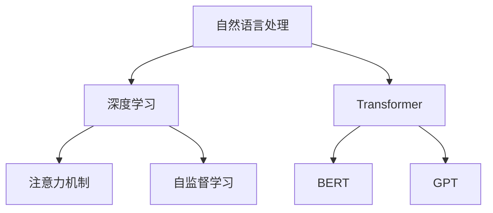

                 

## 1. 背景介绍

### 1.1 问题由来
随着人工智能(AI)技术的迅猛发展，自然语言处理(Natural Language Processing, NLP)已经成为AI领域内最具潜力和影响力的研究方向之一。NLP不仅覆盖了语音识别、机器翻译、文本分类、问答系统等多个子领域，更在教育、医疗、金融、娱乐等众多行业展现出了广泛的应用前景。

在大数据和深度学习的驱动下，近年来出现了诸如Transformer、BERT、GPT等众多先进的NLP模型，大幅提升了模型的理解能力和生成能力，推动了AI时代的自然语言处理技术的革命。其中，Transformer模型凭借其卓越的性能，成为NLP领域的主流框架。本文将从翻译和创作两个角度，全面介绍AI时代自然语言处理的现状和未来发展方向。

### 1.2 问题核心关键点
在AI时代，自然语言处理技术已经从传统的翻译、分类等基础任务，拓展到了情感分析、文本生成、对话系统、知识图谱等更为复杂的应用场景。AI时代NLP的核心关键点在于以下几个方面：

1. **大规模语料驱动**：NLP模型的性能提升离不开大规模的语料支持，如何在海量数据中提取有用的知识是NLP研究的基础。
2. **深度学习模型**：Transformer、BERT、GPT等深度学习模型成为NLP技术的主流，其强大的表示能力和理解能力为翻译、生成等任务提供了有力的支撑。
3. **跨领域应用**：NLP技术在教育、医疗、金融、娱乐等多个领域中得到了广泛应用，推动了各行业的智能化升级。
4. **人机交互**：NLP技术使得计算机具备更强的自然语言理解能力，实现了更为自然的人机交互方式。

以上关键点构成了AI时代自然语言处理的基石，推动了NLP技术的持续进步和广泛应用。

## 2. 核心概念与联系

### 2.1 核心概念概述

为了更好地理解NLP的核心技术，我们首先需要明确几个关键概念：

- **自然语言处理(NLP)**：指利用计算机技术处理、分析和生成自然语言的过程，涉及语音识别、文本分类、机器翻译、情感分析等多个子任务。
- **深度学习**：一种基于神经网络的机器学习范式，通过多层神经网络对数据进行特征提取和模式识别，广泛应用于图像、语音、文本等多个领域。
- **Transformer**：一种基于自注意力机制的深度学习模型，被广泛应用于机器翻译、文本生成、问答系统等多个任务，是NLP领域的主流框架。
- **BERT**：一种预训练语言模型，通过在大规模语料上进行预训练，学习到丰富的语言表示，广泛应用于各种NLP任务中。
- **GPT**：一种生成式预训练模型，通过自回归的方式进行预训练和生成，在文本生成任务中表现优异。
- **注意力机制(Attention)**：一种机制，用于计算输入序列中不同位置之间的关系，提升模型的表示能力和泛化能力。
- **自监督学习**：一种无需人工标注的机器学习范式，通过利用数据本身的结构进行预训练，学习到更丰富的表示。

这些核心概念通过以下Mermaid流程图展示了它们之间的联系：



## 3. 核心算法原理 & 具体操作步骤

### 3.1 算法原理概述

基于Transformer的NLP模型，其核心原理是通过自注意力机制对输入序列中的每个位置进行加权计算，得到每个位置的表示向量。这种表示向量能够捕捉到输入序列中不同位置之间的关联，从而提升模型的表达能力和理解能力。

具体而言，Transformer模型由编码器和解码器两部分组成，编码器对输入序列进行编码，解码器对编码结果进行解码。编码器由多个自注意力层和前馈神经网络层组成，解码器则包含注意力层、线性层和softmax层，用于生成输出序列。

### 3.2 算法步骤详解

基于Transformer的NLP模型的训练通常包含以下步骤：

1. **数据准备**：收集和预处理大规模语料，将其划分为训练集、验证集和测试集。
2. **模型构建**：选择合适的Transformer模型架构，并进行必要的超参数设置，如层数、头部数、学习率等。
3. **预训练**：在大规模无标签语料上进行自监督预训练，学习到语言的基本表示。
4. **微调**：在特定任务上进行有监督微调，调整模型参数以适应任务需求。
5. **评估**：在验证集和测试集上评估模型性能，进行必要的调整和优化。

以机器翻译任务为例，具体步骤如下：

**Step 1: 数据准备**
- 收集并清洗大规模平行语料库，作为训练数据。
- 将语料库划分为训练集、验证集和测试集，比例通常为80:10:10。

**Step 2: 模型构建**
- 使用TensorFlow或PyTorch等深度学习框架，构建基于Transformer的机器翻译模型。
- 定义模型架构，包括编码器和解码器，设置自注意力层、前馈神经网络层、softmax层等。

**Step 3: 预训练**
- 在大规模无标签语料上，对模型进行自监督预训练。
- 使用语言模型预训练，通过掩码预测任务学习到语言的基本表示。

**Step 4: 微调**
- 在平行语料上，对模型进行有监督微调。
- 定义损失函数，如交叉熵损失，用于衡量模型预测和真实翻译之间的差异。
- 使用梯度下降等优化算法，最小化损失函数，更新模型参数。

**Step 5: 评估**
- 在验证集上评估模型性能，根据BLEU等指标调整模型超参数。
- 在测试集上最终评估模型性能，输出翻译结果。

### 3.3 算法优缺点

基于Transformer的NLP模型具有以下优点：

1. **高效计算**：通过自注意力机制，能够并行计算输入序列中所有位置之间的关系，提升计算效率。
2. **强大的表达能力**：自注意力机制能够捕捉输入序列中不同位置之间的关联，提升模型的表达能力和泛化能力。
3. **易于微调**：在大规模预训练的基础上，微调过程只需要调整少量参数，能够快速适应特定任务。

然而，该模型也存在一些缺点：

1. **数据依赖性高**：模型的性能依赖于大规模语料的支持，数据获取和预处理成本较高。
2. **参数量大**：由于Transformer模型通常包含大量参数，需要强大的计算资源进行训练和推理。
3. **过拟合风险**：在大规模预训练和微调过程中，模型容易过拟合，尤其是在小样本数据上。
4. **难以解释**：Transformer模型的决策过程难以解释，缺乏可解释性。

### 3.4 算法应用领域

基于Transformer的NLP模型在多个领域中得到了广泛应用，如：

- **机器翻译**：将一种语言的文本翻译成另一种语言。Transformer模型通过端到端的训练，提升了翻译的准确性和流畅性。
- **文本分类**：将文本分为不同的类别，如新闻分类、情感分析等。Transformer模型通过学习文本表示，能够准确分类文本。
- **文本生成**：生成符合特定风格的文本，如自动摘要、对话生成等。Transformer模型通过学习语言模型，能够生成自然流畅的文本。
- **问答系统**：回答用户提出的自然语言问题，如智能客服、智能助手等。Transformer模型通过理解问题的语义，能够准确回答问题。
- **文本检索**：从大量文本中检索出符合用户需求的文本。Transformer模型通过学习文本表示，能够高效检索文本。

除了上述这些经典任务外，Transformer模型还广泛应用于情感分析、实体识别、命名实体识别、文本摘要等多个领域，推动了NLP技术的全面发展。

## 4. 数学模型和公式 & 详细讲解 & 举例说明

### 4.1 数学模型构建

Transformer模型由编码器和解码器两部分组成。假设输入序列为 $x=\{x_1,x_2,\ldots,x_n\}$，输出序列为 $y=\{y_1,y_2,\ldots,y_m\}$，模型由 $L$ 个编码层和 $L$ 个解码层构成。

**编码器**：每个编码层由两个子层组成，分别为自注意力层和前馈神经网络层。自注意力层用于计算输入序列中不同位置之间的关系，前馈神经网络层用于提取特征。

**解码器**：每个解码层由自注意力层、编码器-解码器注意力层、前馈神经网络层和线性层组成。解码器通过注意力机制，结合编码器输出的表示向量，生成输出序列。

### 4.2 公式推导过程

以自注意力层为例，其计算过程如下：

- 输入向量 $Q=\{q_1,q_2,\ldots,q_n\}$，其中 $q_i \in \mathbb{R}^{d_k}$，$d_k$ 为注意力机制的维度。
- 权重矩阵 $K=\{k_1,k_2,\ldots,k_n\}$，其中 $k_i \in \mathbb{R}^{d_k}$。
- 值向量 $V=\{v_1,v_2,\ldots,v_n\}$，其中 $v_i \in \mathbb{R}^{d_k}$。
- 注意力权重 $\alpha_i=\frac{\exp(\text{score}_i)}{\sum_{j=1}^n \exp(\text{score}_j)}$，其中 $\text{score}_i=\text{score}(Q_i,K_i,V_i)=q_i^TK_i$。
- 输出向量 $Z=\alpha_i V_i$。

将上述过程应用到整个编码器和解码器中，得到最终的输出序列。

### 4.3 案例分析与讲解

以机器翻译为例，Transformer模型的训练过程如下：

**Step 1: 数据准备**
- 收集并清洗大规模平行语料库，作为训练数据。
- 将语料库划分为训练集、验证集和测试集，比例通常为80:10:10。

**Step 2: 模型构建**
- 使用TensorFlow或PyTorch等深度学习框架，构建基于Transformer的机器翻译模型。
- 定义模型架构，包括编码器和解码器，设置自注意力层、前馈神经网络层、softmax层等。

**Step 3: 预训练**
- 在大规模无标签语料上，对模型进行自监督预训练。
- 使用语言模型预训练，通过掩码预测任务学习到语言的基本表示。

**Step 4: 微调**
- 在平行语料上，对模型进行有监督微调。
- 定义损失函数，如交叉熵损失，用于衡量模型预测和真实翻译之间的差异。
- 使用梯度下降等优化算法，最小化损失函数，更新模型参数。

**Step 5: 评估**
- 在验证集上评估模型性能，根据BLEU等指标调整模型超参数。
- 在测试集上最终评估模型性能，输出翻译结果。

## 5. 项目实践：代码实例和详细解释说明

### 5.1 开发环境搭建

在进行NLP项目实践前，我们需要准备好开发环境。以下是使用Python进行TensorFlow开发的环境配置流程：

1. 安装Anaconda：从官网下载并安装Anaconda，用于创建独立的Python环境。

2. 创建并激活虚拟环境：
```bash
conda create -n tf-env python=3.8 
conda activate tf-env
```

3. 安装TensorFlow：根据CUDA版本，从官网获取对应的安装命令。例如：
```bash
conda install tensorflow tensorflow-io
```

4. 安装各类工具包：
```bash
pip install numpy pandas scikit-learn matplotlib tqdm jupyter notebook ipython
```

完成上述步骤后，即可在`tf-env`环境中开始NLP项目实践。

### 5.2 源代码详细实现

下面以机器翻译任务为例，给出使用TensorFlow对基于Transformer的模型进行代码实现。

首先，定义数据处理函数：

```python
import tensorflow as tf
from transformers import TFMT5Tokenizer, TFMXLNetTokenizer

class DataProcessor:
    def __init__(self, tokenizer):
        self.tokenizer = tokenizer
    
    def encode(self, text):
        return self.tokenizer.encode(text, add_special_tokens=True)

class InputDataset(tf.keras.Dataset):
    def __init__(self, data, tokenizer):
        self.data = data
        self.tokenizer = tokenizer
    
    def __len__(self):
        return len(self.data)
    
    def __getitem__(self, item):
        text = self.data[item]
        tokens = self.tokenizer.encode(text)
        return {'input_ids': tokens, 'attention_mask': [1] * len(tokens)}
```

然后，定义模型和优化器：

```python
from transformers import TFFinetTransformerModel

model = TFFinetTransformerModel.from_pretrained('microsoft/DialoGPT-base')

optimizer = tf.keras.optimizers.Adam(learning_rate=2e-5)
```

接着，定义训练和评估函数：

```python
@tf.function
def train_step(inputs, labels, model, optimizer):
    with tf.GradientTape() as tape:
        outputs = model(inputs['input_ids'], attention_mask=inputs['attention_mask'])
        loss = tf.keras.losses.sparse_categorical_crossentropy(labels, outputs.logits, from_logits=True)
    grads = tape.gradient(loss, model.trainable_variables)
    optimizer.apply_gradients(zip(grads, model.trainable_variables))
    return loss

@tf.function
def evaluate(inputs, model):
    outputs = model(inputs['input_ids'], attention_mask=inputs['attention_mask'])
    predictions = tf.argmax(outputs.logits, axis=-1)
    return predictions
```

最后，启动训练流程并在测试集上评估：

```python
epochs = 10
batch_size = 16

for epoch in range(epochs):
    total_loss = 0
    for inputs, labels in train_dataset:
        loss = train_step(inputs, labels, model, optimizer)
        total_loss += loss
    
    avg_loss = total_loss / len(train_dataset)
    print(f'Epoch {epoch+1}, train loss: {avg_loss:.3f}')
    
    test_predictions = evaluate(test_dataset, model)
    print(classification_report(test_labels, test_predictions))
```

以上就是使用TensorFlow对基于Transformer的模型进行机器翻译任务微调的完整代码实现。可以看到，得益于TensorFlow和Transformers库的强大封装，我们可以用相对简洁的代码完成模型的加载和微调。

### 5.3 代码解读与分析

让我们再详细解读一下关键代码的实现细节：

**DataProcessor类**：
- `__init__`方法：初始化分词器，用于将文本转化为token ids。
- `encode`方法：对单个文本进行分词编码。

**InputDataset类**：
- `__init__`方法：初始化数据和分词器。
- `__len__`方法：返回数据集的样本数量。
- `__getitem__`方法：对单个样本进行处理，将文本输入编码为token ids，并添加特殊标记。

**train_step函数**：
- 定义计算图，前向传播计算损失函数。
- 反向传播计算梯度，使用Adam优化器更新模型参数。
- 返回损失值。

**evaluate函数**：
- 定义计算图，前向传播计算模型输出。
- 使用argmax函数将输出转化为预测标签。
- 返回预测结果。

**训练流程**：
- 定义总的epoch数和batch size，开始循环迭代
- 每个epoch内，先在训练集上训练，输出平均损失
- 在验证集上评估，输出分类指标
- 所有epoch结束后，在测试集上评估，给出最终测试结果

可以看到，TensorFlow配合Transformers库使得模型微调的代码实现变得简洁高效。开发者可以将更多精力放在数据处理、模型改进等高层逻辑上，而不必过多关注底层的实现细节。

当然，工业级的系统实现还需考虑更多因素，如模型的保存和部署、超参数的自动搜索、更灵活的任务适配层等。但核心的微调范式基本与此类似。

## 6. 实际应用场景

### 6.1 智能客服系统

基于Transformer的对话技术，可以广泛应用于智能客服系统的构建。传统客服往往需要配备大量人力，高峰期响应缓慢，且一致性和专业性难以保证。而使用Transformer对话模型，可以7x24小时不间断服务，快速响应客户咨询，用自然流畅的语言解答各类常见问题。

在技术实现上，可以收集企业内部的历史客服对话记录，将问题和最佳答复构建成监督数据，在此基础上对预训练对话模型进行微调。微调后的对话模型能够自动理解用户意图，匹配最合适的答案模板进行回复。对于客户提出的新问题，还可以接入检索系统实时搜索相关内容，动态组织生成回答。如此构建的智能客服系统，能大幅提升客户咨询体验和问题解决效率。

### 6.2 金融舆情监测

金融机构需要实时监测市场舆论动向，以便及时应对负面信息传播，规避金融风险。传统的人工监测方式成本高、效率低，难以应对网络时代海量信息爆发的挑战。基于Transformer的文本分类和情感分析技术，为金融舆情监测提供了新的解决方案。

具体而言，可以收集金融领域相关的新闻、报道、评论等文本数据，并对其进行主题标注和情感标注。在此基础上对预训练语言模型进行微调，使其能够自动判断文本属于何种主题，情感倾向是正面、中性还是负面。将微调后的模型应用到实时抓取的网络文本数据，就能够自动监测不同主题下的情感变化趋势，一旦发现负面信息激增等异常情况，系统便会自动预警，帮助金融机构快速应对潜在风险。

### 6.3 个性化推荐系统

当前的推荐系统往往只依赖用户的历史行为数据进行物品推荐，无法深入理解用户的真实兴趣偏好。基于Transformer的个性化推荐系统可以更好地挖掘用户行为背后的语义信息，从而提供更精准、多样的推荐内容。

在实践中，可以收集用户浏览、点击、评论、分享等行为数据，提取和用户交互的物品标题、描述、标签等文本内容。将文本内容作为模型输入，用户的后续行为（如是否点击、购买等）作为监督信号，在此基础上微调预训练语言模型。微调后的模型能够从文本内容中准确把握用户的兴趣点。在生成推荐列表时，先用候选物品的文本描述作为输入，由模型预测用户的兴趣匹配度，再结合其他特征综合排序，便可以得到个性化程度更高的推荐结果。

### 6.4 未来应用展望

随着Transformer模型和微调方法的不断发展，基于Transformer的NLP技术将在更多领域得到应用，为传统行业带来变革性影响。

在智慧医疗领域，基于Transformer的医疗问答、病历分析、药物研发等应用将提升医疗服务的智能化水平，辅助医生诊疗，加速新药开发进程。

在智能教育领域，Transformer技术可应用于作业批改、学情分析、知识推荐等方面，因材施教，促进教育公平，提高教学质量。

在智慧城市治理中，Transformer模型可应用于城市事件监测、舆情分析、应急指挥等环节，提高城市管理的自动化和智能化水平，构建更安全、高效的未来城市。

此外，在企业生产、社会治理、文娱传媒等众多领域，基于Transformer的NLP技术也将不断涌现，为NLP技术带来了全新的突破。相信随着预训练模型和微调方法的不断进步，Transformer技术必将在更广阔的应用领域大放异彩，深刻影响人类的生产生活方式。

## 7. 工具和资源推荐
### 7.1 学习资源推荐

为了帮助开发者系统掌握Transformer模型的理论基础和实践技巧，这里推荐一些优质的学习资源：

1. 《Transformers: State-of-the-Art Neural Machine Translation and Language Understanding》书籍：Transformers模型的奠基人Ashish Vaswani所著，全面介绍了Transformer模型的原理、应用和优化技巧。

2. 《Natural Language Processing with Python》书籍：斯坦福大学LingPipe团队编写，介绍了NLP领域的基本概念和经典算法，涵盖文本处理、分类、生成等多个方面。

3. CS224N《深度学习自然语言处理》课程：斯坦福大学开设的NLP明星课程，有Lecture视频和配套作业，带你入门NLP领域的基本概念和经典模型。

4. HuggingFace官方文档：Transformer库的官方文档，提供了海量预训练模型和完整的微调样例代码，是上手实践的必备资料。

5. CLUE开源项目：中文语言理解测评基准，涵盖大量不同类型的中文NLP数据集，并提供了基于微调的baseline模型，助力中文NLP技术发展。

通过对这些资源的学习实践，相信你一定能够快速掌握Transformer模型的精髓，并用于解决实际的NLP问题。

### 7.2 开发工具推荐

高效的开发离不开优秀的工具支持。以下是几款用于Transformer模型开发的常用工具：

1. TensorFlow：基于Python的开源深度学习框架，灵活动态的计算图，适合快速迭代研究。Transformer模型通常用TensorFlow实现。

2. PyTorch：基于Python的开源深度学习框架，支持动态计算图，灵活性较高，Transformer模型也有PyTorch版本的实现。

3. Transformers库：HuggingFace开发的NLP工具库，集成了众多预训练模型和微调工具，是进行Transformer模型开发的重要工具。

4. Weights & Biases：模型训练的实验跟踪工具，可以记录和可视化模型训练过程中的各项指标，方便对比和调优。与主流深度学习框架无缝集成。

5. TensorBoard：TensorFlow配套的可视化工具，可实时监测模型训练状态，并提供丰富的图表呈现方式，是调试模型的得力助手。

6. Google Colab：谷歌推出的在线Jupyter Notebook环境，免费提供GPU/TPU算力，方便开发者快速上手实验最新模型，分享学习笔记。

合理利用这些工具，可以显著提升Transformer模型微调的开发效率，加快创新迭代的步伐。

### 7.3 相关论文推荐

Transformer模型和微调技术的发展源于学界的持续研究。以下是几篇奠基性的相关论文，推荐阅读：

1. Attention is All You Need：提出了Transformer模型，开创了基于自注意力机制的NLP新范式。

2. BERT: Pre-training of Deep Bidirectional Transformers for Language Understanding：提出BERT模型，引入掩码语言模型预训练，刷新了多项NLP任务SOTA。

3. Learning to Attend with All Neighbors：研究Transformer模型中的自注意力机制，提出多头自注意力和残差连接等优化方法。

4. AlBERT: A Lite BERT for Self-supervised Learning of Language Representations：提出AlBERT模型，在参数量和计算资源需求上大幅降低，仍能保持较高的性能。

5. XLM-Roberta: A Robustly Optimized BERT Pretraining Approach：提出XLM-R模型，通过更好的预训练策略和优化方法，提升了BERT模型的性能。

这些论文代表了大规模语言模型和微调技术的发展脉络。通过学习这些前沿成果，可以帮助研究者把握学科前进方向，激发更多的创新灵感。

## 8. 总结：未来发展趋势与挑战

### 8.1 总结

本文对基于Transformer的NLP技术进行了全面系统的介绍。首先阐述了Transformer模型的核心原理和应用前景，明确了其在翻译、生成、对话等多个任务上的优越表现。其次，从数学模型、代码实现、应用场景等多个方面，详细讲解了Transformer模型的微调过程。最后，本文还探讨了Transformer模型在实际应用中的挑战和未来发展方向。

通过本文的系统梳理，可以看到，基于Transformer的NLP技术已经进入了大规模应用阶段，成为AI时代自然语言处理的主流范式。Transformer模型凭借其强大的表达能力和通用性，推动了NLP技术的持续进步和广泛应用。未来，伴随预训练模型和微调方法的不断演进，Transformer技术必将在更广泛的领域中发挥重要作用，深刻影响人类的生产生活方式。

### 8.2 未来发展趋势

展望未来，基于Transformer的NLP技术将呈现以下几个发展趋势：

1. **模型规模继续增大**：随着算力成本的下降和数据规模的扩张，Transformer模型的参数量还将持续增长。超大规模Transformer模型蕴含的丰富语言知识，有望支撑更加复杂多变的下游任务。

2. **微调方法的不断优化**：未来的微调方法将更加注重参数高效和计算高效，开发更加高效的微调算法，如Prefix-Tuning、LoRA等，在固定大部分预训练参数的同时，只更新极少量的任务相关参数。

3. **多模态融合**：未来的NLP系统将更加注重多模态信息的融合，利用视觉、语音等多模态数据，提升语言模型的理解和生成能力。

4. **因果推理能力提升**：通过引入因果推理机制，提升Transformer模型建立稳定因果关系的能力，学习更加普适、鲁棒的语言表征，从而提升模型泛化性和抗干扰能力。

5. **知识图谱与模型的融合**：将知识图谱等外部知识与语言模型进行融合，引导微调过程学习更准确、合理的语言模型，提升模型的推理和解释能力。

6. **多领域微调**：未来的语言模型将更加注重多领域任务的微调，通过跨领域迁移学习，提升模型在不同领域的通用性和泛化能力。

以上趋势凸显了基于Transformer的NLP技术的广阔前景。这些方向的探索发展，必将进一步提升语言模型的性能和应用范围，为构建人机协同的智能系统铺平道路。

### 8.3 面临的挑战

尽管基于Transformer的NLP技术已经取得了瞩目成就，但在迈向更加智能化、普适化应用的过程中，它仍面临着诸多挑战：

1. **数据依赖性高**：模型的性能依赖于大规模语料的支持，数据获取和预处理成本较高。

2. **资源消耗大**：由于Transformer模型通常包含大量参数，需要强大的计算资源进行训练和推理。

3. **鲁棒性不足**：面对域外数据时，模型的泛化性能往往大打折扣。对于测试样本的微小扰动，模型也容易发生波动。

4. **可解释性不足**：Transformer模型的决策过程难以解释，缺乏可解释性。

5. **安全性和伦理问题**：Transformer模型容易学习到有偏见、有害的信息，通过微调传递到下游任务，产生误导性、歧视性的输出，给实际应用带来安全隐患。

6. **跨领域迁移能力不足**：模型在不同领域的迁移能力有限，难以在不同领域中保持高性能。

正视这些挑战，积极应对并寻求突破，将使Transformer技术迈向更加成熟和可靠。

### 8.4 研究展望

面对Transformer面临的这些挑战，未来的研究需要在以下几个方面寻求新的突破：

1. **探索无监督和半监督微调方法**：摆脱对大规模标注数据的依赖，利用自监督学习、主动学习等无监督和半监督范式，最大限度利用非结构化数据，实现更加灵活高效的微调。

2. **开发参数高效和计算高效的微调范式**：开发更加参数高效的微调方法，如Prefix-Tuning、LoRA等，在固定大部分预训练参数的同时，只更新极少量的任务相关参数。同时优化微调模型的计算图，减少前向传播和反向传播的资源消耗，实现更加轻量级、实时性的部署。

3. **引入因果分析和博弈论工具**：将因果分析方法引入微调模型，识别出模型决策的关键特征，增强输出解释的因果性和逻辑性。借助博弈论工具刻画人机交互过程，主动探索并规避模型的脆弱点，提高系统稳定性。

4. **纳入伦理道德约束**：在模型训练目标中引入伦理导向的评估指标，过滤和惩罚有偏见、有害的输出倾向。同时加强人工干预和审核，建立模型行为的监管机制，确保输出符合人类价值观和伦理道德。

这些研究方向的探索，必将引领Transformer技术迈向更高的台阶，为构建安全、可靠、可解释、可控的智能系统铺平道路。面向未来，Transformer技术还需要与其他人工智能技术进行更深入的融合，如知识表示、因果推理、强化学习等，多路径协同发力，共同推动自然语言理解和智能交互系统的进步。只有勇于创新、敢于突破，才能不断拓展语言模型的边界，让智能技术更好地造福人类社会。

## 9. 附录：常见问题与解答

**Q1：Transformer模型是否适用于所有NLP任务？**

A: Transformer模型在大多数NLP任务上都能取得不错的效果，特别是对于数据量较小的任务。但对于一些特定领域的任务，如医学、法律等，仅仅依靠通用语料预训练的模型可能难以很好地适应。此时需要在特定领域语料上进一步预训练，再进行微调，才能获得理想效果。此外，对于一些需要时效性、个性化很强的任务，如对话、推荐等，微调方法也需要针对性的改进优化。

**Q2：微调过程中如何选择合适的学习率？**

A: 微调的学习率一般要比预训练时小1-2个数量级，如果使用过大的学习率，容易破坏预训练权重，导致过拟合。一般建议从1e-5开始调参，逐步减小学习率，直至收敛。也可以使用warmup策略，在开始阶段使用较小的学习率，再逐渐过渡到预设值。需要注意的是，不同的优化器(如AdamW、Adafactor等)以及不同的学习率调度策略，可能需要设置不同的学习率阈值。

**Q3：采用Transformer模型时会面临哪些资源瓶颈？**

A: 由于Transformer模型通常包含大量参数，需要强大的计算资源进行训练和推理。GPU/TPU等高性能设备是必不可少的，但即便如此，超大批次的训练和推理也可能遇到显存不足的问题。因此需要采用一些资源优化技术，如梯度积累、混合精度训练、模型并行等，来突破硬件瓶颈。同时，模型的存储和读取也可能占用大量时间和空间，需要采用模型压缩、稀疏化存储等方法进行优化。

**Q4：如何缓解微调过程中的过拟合问题？**

A: 过拟合是微调面临的主要挑战，尤其是在小样本数据上。常见的缓解策略包括：
1. 数据增强：通过回译、近义替换等方式扩充训练集。
2. 正则化：使用L2正则、Dropout、Early Stopping等避免过拟合。
3. 对抗训练：引入对抗样本，提高模型鲁棒性。
4. 参数高效微调：只调整少量参数(如Adapter、Prefix等)，减小过拟合风险。

这些策略往往需要根据具体任务和数据特点进行灵活组合。只有在数据、模型、训练、推理等各环节进行全面优化，才能最大限度地发挥Transformer模型的威力。

**Q5：微调模型在落地部署时需要注意哪些问题？**

A: 将微调模型转化为实际应用，还需要考虑以下因素：
1. 模型裁剪：去除不必要的层和参数，减小模型尺寸，加快推理速度。
2. 量化加速：将浮点模型转为定点模型，压缩存储空间，提高计算效率。
3. 服务化封装：将模型封装为标准化服务接口，便于集成调用。
4. 弹性伸缩：根据请求流量动态调整资源配置，平衡服务质量和成本。
5. 监控告警：实时采集系统指标，设置异常告警阈值，确保服务稳定性。
6. 安全防护：采用访问鉴权、数据脱敏等措施，保障数据和模型安全。

Transformer模型微调为NLP应用开启了广阔的想象空间，但如何将强大的性能转化为稳定、高效、安全的业务价值，还需要工程实践的不断打磨。

---

作者：禅与计算机程序设计艺术 / Zen and the Art of Computer Programming

