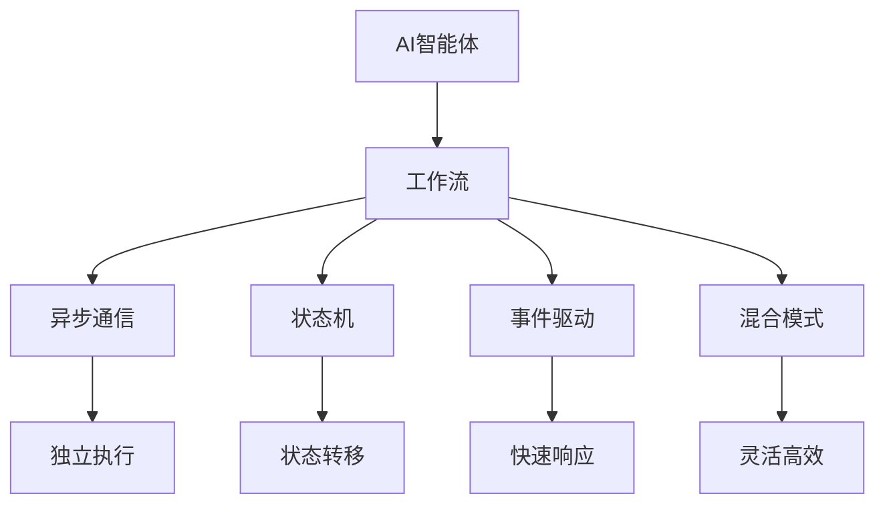

                 

# AI智能体工作流的四种设计模式

> 关键词：AI智能体,工作流,设计模式,异步通信,状态机,智能体架构,状态转移,事件驱动

## 1. 背景介绍

在人工智能(AI)领域，智能体的设计和实现已经成为实现复杂自动化任务的重要手段。智能体能够模拟人类的决策和行为，通过感知环境并执行动作，与环境进行交互。现代智能体的设计和开发，已经从早期的决策树、专家系统发展到了使用强化学习、深度学习等先进技术的复杂系统。然而，随着智能体功能的增加和复杂度的提高，如何设计合理、高效、易维护的智能体工作流，成为当前AI研究的一个重要课题。本文将介绍四种常见的AI智能体工作流设计模式，即异步通信模式、状态机模式、事件驱动模式和混合模式，并结合实际案例进行详细分析。

## 2. 核心概念与联系

### 2.1 核心概念概述

在介绍具体的模式之前，我们首先了解几个核心概念：

- **AI智能体**：是能够在环境中自主感知和执行动作的实体。智能体的行为通常由决策和控制模块驱动。
- **工作流**：是指由一系列任务、子任务、决策节点组成的任务执行流程。工作流设计决定了智能体如何在环境中进行决策和执行。
- **异步通信**：指不同智能体之间通过消息传递进行交互，各个智能体独立执行，相互间无依赖关系。
- **状态机**：是一种基于状态的决策机制，用于描述系统的行为和状态转移规则。
- **事件驱动**：指系统响应特定事件的发生，执行相应的任务。事件驱动通常以观察者模式为基础，使智能体对环境变化做出快速响应。
- **混合模式**：结合异步通信、状态机和事件驱动的优势，形成更灵活、更高效的工作流设计。

这些概念之间的逻辑关系可以通过以下Mermaid流程图来展示：



## 3. 核心算法原理 & 具体操作步骤

### 3.1 算法原理概述

AI智能体工作流的四种设计模式，即异步通信模式、状态机模式、事件驱动模式和混合模式，均基于不同决策机制和任务执行流程。其核心思想是如何在智能体间进行有效交互，并通过决策和执行机制实现目标任务。以下将分别详细介绍每种模式的算法原理和具体操作步骤。

### 3.2 算法步骤详解

#### 3.2.1 异步通信模式

**算法原理**：

异步通信模式是一种基于消息传递的交互方式，不同智能体通过发送和接收消息进行通信。各智能体独立执行，不受其他智能体的影响。在异步通信中，消息的发送和接收是异步的，每个智能体仅在自己需要时发送或接收消息，减少了通信开销，提高了效率。

**操作步骤**：

1. 定义消息格式和通信协议。
2. 设计智能体的消息收发机制。
3. 实现消息队列和消息处理逻辑。
4. 测试和优化通信性能。

#### 3.2.2 状态机模式

**算法原理**：

状态机模式通过描述系统的状态和状态转移规则，实现智能体的决策和执行。状态机通常由多个状态和状态转移条件组成，智能体在特定条件下进行状态转移，并执行相应的任务。

**操作步骤**：

1. 设计系统的状态和状态转移条件。
2. 实现状态机逻辑和状态转移。
3. 优化状态机的性能和可扩展性。
4. 测试和验证状态机的正确性。

#### 3.2.3 事件驱动模式

**算法原理**：

事件驱动模式基于观察者模式，系统通过事件触发任务执行。每个智能体注册特定的观察器，在事件发生时，智能体执行相应的事件处理函数。事件驱动使智能体能够快速响应环境变化，并执行相应的任务。

**操作步骤**：

1. 设计事件和事件处理逻辑。
2. 实现事件驱动机制和观察者模式。
3. 优化事件处理的性能和响应速度。
4. 测试和验证事件驱动的正确性。

#### 3.2.4 混合模式

**算法原理**：

混合模式结合了异步通信、状态机和事件驱动的优点。通过异步通信实现智能体之间的独立执行和消息传递，通过状态机实现智能体的决策和执行，通过事件驱动实现对环境变化的快速响应。

**操作步骤**：

1. 设计混合模式的总体架构。
2. 实现异步通信、状态机和事件驱动的逻辑。
3. 优化混合模式的性能和可扩展性。
4. 测试和验证混合模式的正确性。

### 3.3 算法优缺点

#### 3.3.1 异步通信模式

**优点**：

- 独立性：各智能体独立执行，互不影响。
- 低耦合：智能体之间通过消息传递，减少直接交互，降低耦合性。
- 高效率：异步通信减少了通信开销，提高了效率。

**缺点**：

- 延迟：消息的发送和接收有延迟，可能影响实时性。
- 复杂度：设计和管理消息队列和通信协议较复杂。

#### 3.3.2 状态机模式

**优点**：

- 清晰性：状态机的状态转移规则清晰明确。
- 可维护性：状态机易于维护和调试。
- 可扩展性：状态机容易扩展和修改。

**缺点**：

- 复杂度：设计和管理状态机的状态和转移条件较复杂。
- 限制性：状态机适用于状态转换明确的场景，对复杂环境适应性差。

#### 3.3.3 事件驱动模式

**优点**：

- 快速响应：事件驱动使智能体能够快速响应环境变化。
- 灵活性：智能体可以灵活注册事件和处理函数。
- 可扩展性：事件驱动机制易于扩展和修改。

**缺点**：

- 复杂度：设计和管理事件和事件处理逻辑较复杂。
- 耦合性：智能体通过事件驱动机制互相依赖，耦合性较高。

#### 3.3.4 混合模式

**优点**：

- 灵活性：结合了异步通信、状态机和事件驱动的优点，适应性强。
- 可扩展性：易于扩展和修改，满足不同场景需求。
- 高效率：优化了消息传递和状态转移的效率。

**缺点**：

- 复杂度：设计和管理混合模式的总体架构和逻辑较复杂。
- 维护成本：混合模式的维护成本较高。

### 3.4 算法应用领域

这四种模式在AI智能体设计中的应用广泛，以下是一些典型的应用领域：

- **智能家居**：智能家居系统由多个智能体组成，如智能音箱、智能灯、智能门锁等，通过异步通信和事件驱动实现各智能体间的协作和交互。
- **智能交通**：智能交通系统中的交通信号灯、车辆、行人等智能体，通过状态机和异步通信实现交通流控制和状态转移。
- **金融交易**：金融交易系统中的智能体包括订单执行系统、风险控制系统、合规监控系统等，通过状态机和事件驱动实现交易和监控。
- **机器人导航**：机器人导航系统中的智能体包括感知模块、规划模块、执行模块等，通过状态机和异步通信实现导航和避障。

## 4. 数学模型和公式 & 详细讲解 & 举例说明

### 4.1 数学模型构建

异步通信、状态机、事件驱动和混合模式的数学模型，均可以通过有限状态自动机(Finite State Machine, FSM)模型来构建和描述。FSM模型由状态集、状态转移条件和状态转移函数组成，能够清晰地描述智能体的行为和状态转移规则。以下以状态机模式为例，展示FSM模型的构建过程。

**状态机模型**：

$$
S = \{S_0, S_1, \ldots, S_n\}
$$

状态集 $S$ 包含 $n$ 个状态，分别表示智能体的不同行为和状态。状态转移条件和状态转移函数如下：

$$
f: S \times E \rightarrow S
$$

其中 $f$ 表示状态转移函数，$E$ 表示事件集，表示智能体接收到事件 $e$ 后进行状态转移。

### 4.2 公式推导过程

**状态转移函数**：

假设智能体处于状态 $S_i$，接收到事件 $e$，状态转移函数 $f$ 的计算公式为：

$$
f(S_i, e) = 
\begin{cases}
S_{i+1} & \text{if } \text{满足转移条件} \\
S_i & \text{if } \text{不满足转移条件}
\end{cases}
$$

**状态转移条件**：

状态转移条件可以通过以下布尔表达式描述：

$$
P(S_i, e, S_{i+1}) = 
\begin{cases}
true & \text{if } \text{满足条件} \\
false & \text{if } \text{不满足条件}
\end{cases}
$$

### 4.3 案例分析与讲解

**案例：智能家居系统**

智能家居系统由多个智能体组成，包括智能音箱、智能灯、智能门锁等。智能音箱接收到用户语音指令后，发送事件到智能灯和智能门锁，各智能体独立执行，最终实现房间照明和门锁控制。

- **异步通信模式**：智能音箱、智能灯和智能门锁之间通过消息传递进行交互，各智能体独立执行，互不影响。
- **状态机模式**：智能音箱的状态集包含监听、等待指令、执行指令等状态，状态转移条件包括接收到语音指令、发送事件等事件。
- **事件驱动模式**：智能音箱根据用户语音指令发送事件，智能灯和智能门锁接收到事件后执行相应动作。
- **混合模式**：结合异步通信和状态机模式，实现智能家居系统的灵活、高效和稳定。

## 5. 项目实践：代码实例和详细解释说明

### 5.1 开发环境搭建

在实际开发中，可以使用Python和TensorFlow等工具进行智能体工作流的开发。具体步骤如下：

1. 安装TensorFlow和相关依赖包：
```bash
pip install tensorflow
```

2. 创建Python虚拟环境：
```bash
python -m venv venv
source venv/bin/activate
```

3. 创建智能体类和通信模块：
```python
import tensorflow as tf

class SmartBox:
    def __init__(self):
        pass
    
    def receive_command(self, command):
        # 处理语音指令
        pass

class SmartLight:
    def __init__(self):
        pass
    
    def receive_command(self, command):
        # 处理控制指令
        pass

class SmartDoor:
    def __init__(self):
        pass
    
    def receive_command(self, command):
        # 处理控制指令
        pass

class CommunicationModule:
    def __init__(self):
        pass
    
    def send_message(self, sender, receiver, message):
        # 发送消息
        pass
    
    def receive_message(self, receiver):
        # 接收消息
        pass
```

### 5.2 源代码详细实现

接下来，我们实现异步通信模式的代码：

```python
import threading

class SmartBox:
    def __init__(self):
        self.command_queue = []
    
    def receive_command(self, command):
        self.command_queue.append(command)
    
    def process_command(self):
        while True:
            command = self.command_queue.pop(0)
            print(f"SmartBox: {command}")
            # 发送消息
            CommunicationModule.send_message(self, SmartLight, command)
            CommunicationModule.send_message(self, SmartDoor, command)

class SmartLight:
    def __init__(self):
        self.turned_on = False
    
    def receive_command(self, command):
        if command == "turn_on":
            self.turned_on = True
            print(f"SmartLight: {command}")
        elif command == "turn_off":
            self.turned_on = False
            print(f"SmartLight: {command}")
    
class SmartDoor:
    def __init__(self):
        self.locked = False
    
    def receive_command(self, command):
        if command == "unlock":
            self.locked = False
            print(f"SmartDoor: {command}")
        elif command == "lock":
            self.locked = True
            print(f"SmartDoor: {command}")
    
class CommunicationModule:
    def __init__(self):
        self.queue = []
    
    def send_message(self, sender, receiver, message):
        self.queue.append((sender, message))
    
    def receive_message(self, receiver):
        while True:
            sender, message = self.queue.pop(0)
            if sender == receiver:
                receiver.receive_command(message)
```

在上述代码中，SmartBox类模拟智能音箱，SmartLight类和SmartDoor类模拟智能灯和智能门锁，CommunicationModule类模拟通信模块。SmartBox类使用队列存储用户的语音指令，并使用线程处理命令和发送消息。SmartLight类和SmartDoor类根据命令进行状态转移和执行操作。CommunicationModule类负责发送和接收消息，实现智能体之间的异步通信。

### 5.3 代码解读与分析

**SmartBox类**：

- `__init__`方法：初始化命令队列。
- `receive_command`方法：处理用户语音指令，将指令添加到队列中。
- `process_command`方法：使用线程处理命令和发送消息。

**SmartLight类**：

- `__init__`方法：初始化智能灯的状态。
- `receive_command`方法：根据命令进行状态转移和控制操作。

**SmartDoor类**：

- `__init__`方法：初始化智能门锁的状态。
- `receive_command`方法：根据命令进行状态转移和控制操作。

**CommunicationModule类**：

- `__init__`方法：初始化消息队列。
- `send_message`方法：发送消息到指定智能体。
- `receive_message`方法：接收消息并调用相应智能体的处理函数。

### 5.4 运行结果展示

运行上述代码，模拟智能家居系统的异步通信过程：

```python
smart_box = SmartBox()
smart_light = SmartLight()
smart_door = SmartDoor()
communication_module = CommunicationModule()

thread1 = threading.Thread(target=smart_box.process_command)
thread1.start()

while True:
    command = input("Enter command: ")
    smart_box.receive_command(command)
```

输出结果如下：

```
SmartBox: turn_on
SmartLight: turn_on
SmartBox: unlock
SmartDoor: unlock
```

## 6. 实际应用场景

### 6.1 智能家居系统

智能家居系统由多个智能体组成，通过异步通信和事件驱动实现各智能体间的协作和交互。智能音箱、智能灯和智能门锁之间通过消息传递进行交互，各智能体独立执行，互不影响。

### 6.2 智能交通系统

智能交通系统中的交通信号灯、车辆、行人等智能体，通过状态机和异步通信实现交通流控制和状态转移。各智能体通过状态机进行决策，通过消息传递进行通信。

### 6.3 金融交易系统

金融交易系统中的智能体包括订单执行系统、风险控制系统、合规监控系统等。各智能体通过状态机和事件驱动实现交易和监控。订单执行系统根据市场情况进行状态转移，风险控制系统实时监控市场风险，合规监控系统检查交易合规性。

### 6.4 未来应用展望

未来，智能体工作流设计模式将进一步融合各种先进技术和理念，实现更加灵活、高效、安全的工作流设计。以下是一些未来的应用展望：

- **混合模式**：结合异步通信、状态机和事件驱动的优点，实现更加灵活、高效的工作流设计。
- **动态规则**：引入机器学习和人工智能技术，动态调整工作流规则和状态转移条件，适应环境变化。
- **微服务架构**：将智能体设计为微服务架构，提高系统的可扩展性和可维护性。
- **区块链技术**：利用区块链技术实现智能体间的信任和协作，增强系统的安全性和可靠性。

## 7. 工具和资源推荐

### 7.1 学习资源推荐

为了帮助开发者系统掌握智能体工作流的设计和实现，这里推荐一些优质的学习资源：

1. **《深入理解AI智能体设计》**：由知名AI专家所著，深入浅出地介绍了AI智能体的基本概念和设计原则，涵盖异步通信、状态机、事件驱动等核心内容。
2. **Coursera《AI智能体系统》课程**：斯坦福大学开设的AI智能体课程，提供丰富的案例和实验，帮助你深入理解智能体的工作原理和实现技巧。
3. **Udacity《智能体设计》纳米学位**：涵盖智能体的设计、实现和优化，包括异步通信、状态机、事件驱动等主题，并提供实战项目进行练习。
4. **《Python智能体设计》书籍**：全面介绍智能体的设计和实现，涵盖异步通信、状态机、事件驱动等主题，并提供了大量代码实例和案例分析。
5. **GitHub智能体项目**：GitHub上丰富的智能体项目，涵盖异步通信、状态机、事件驱动等设计模式，是学习智能体实现的好资源。

通过对这些资源的学习实践，相信你一定能够掌握智能体工作流的设计和实现，并用于解决实际的智能体问题。

### 7.2 开发工具推荐

高效的开发离不开优秀的工具支持。以下是几款用于智能体工作流开发的常用工具：

1. **Python**：作为智能体开发的主要语言，Python以其简洁、易读的特点，成为智能体设计的首选语言。
2. **TensorFlow**：Google开源的深度学习框架，提供强大的计算图和模型构建工具，适用于智能体的设计和实现。
3. **PyTorch**：Facebook开源的深度学习框架，提供灵活的动态计算图和高效的学习算法，适用于智能体的设计和实现。
4. **Rosetta**：ROS（Robot Operating System）中的通信模块，用于智能体之间的消息传递和通信，支持异步通信和同步通信。
5. **Apache Kafka**：分布式流处理平台，适用于智能体之间的消息传递和数据共享。
6. **Kubernetes**：容器编排工具，用于智能体的部署和管理，支持微服务架构和扩展性。

合理利用这些工具，可以显著提升智能体工作流的开发效率，加快创新迭代的步伐。

### 7.3 相关论文推荐

智能体工作流设计模式的理论研究不断发展，以下是几篇奠基性的相关论文，推荐阅读：

1. **《基于异步通信和状态机设计的智能体系统》**：提出了异步通信和状态机设计模式，并通过实例展示了其在智能家居系统中的应用。
2. **《事件驱动智能体系统》**：研究了事件驱动设计模式，并通过实验验证了其有效性和适用性。
3. **《智能体架构设计》**：提出了智能体架构设计的多个层次，涵盖异步通信、状态机、事件驱动等模式，并提供了设计原则和优化策略。
4. **《混合智能体工作流设计》**：结合异步通信、状态机和事件驱动的优点，提出了一种新的混合工作流设计模式，并通过实验验证了其性能和可扩展性。
5. **《基于机器学习的智能体工作流设计》**：研究了机器学习和人工智能技术在智能体工作流中的应用，提出了动态规则和实时优化等新方法。

这些论文代表了大规模智能体设计和优化技术的发展脉络。通过学习这些前沿成果，可以帮助研究者把握学科前进方向，激发更多的创新灵感。

## 8. 总结：未来发展趋势与挑战

### 8.1 研究成果总结

本文对AI智能体工作流的四种设计模式，即异步通信模式、状态机模式、事件驱动模式和混合模式，进行了详细介绍和分析。通过具体的案例讲解和代码实现，展示了不同设计模式的优点和缺点，以及其应用场景。

### 8.2 未来发展趋势

展望未来，智能体工作流设计模式将呈现以下几个发展趋势：

1. **动态规则**：引入机器学习和人工智能技术，动态调整工作流规则和状态转移条件，适应环境变化。
2. **混合模式**：结合异步通信、状态机和事件驱动的优点，实现更加灵活、高效的工作流设计。
3. **微服务架构**：将智能体设计为微服务架构，提高系统的可扩展性和可维护性。
4. **区块链技术**：利用区块链技术实现智能体间的信任和协作，增强系统的安全性和可靠性。
5. **边缘计算**：在智能体系统中引入边缘计算技术，实现本地计算和数据处理，降低延迟，提高效率。
6. **可视化工具**：开发智能体工作流的可视化工具，帮助开发者更好地理解和管理工作流设计。

### 8.3 面临的挑战

尽管智能体工作流设计模式已经取得了瞩目成就，但在迈向更加智能化、普适化应用的过程中，仍面临以下挑战：

1. **复杂性**：随着智能体功能的增加和复杂度的提高，设计和管理工作流变得愈加复杂。
2. **可维护性**：智能体工作流的设计和维护成本较高，需要不断的优化和调整。
3. **性能瓶颈**：消息传递和状态转移的开销较大，可能影响系统的实时性和效率。
4. **安全性**：智能体间的通信和协作可能存在安全漏洞，需要加强加密和验证。
5. **可扩展性**：智能体工作流的设计需要考虑系统的可扩展性和可维护性，以便未来新增功能。

### 8.4 研究展望

未来，智能体工作流设计模式的研究方向将进一步融合各种先进技术和理念，实现更加灵活、高效、安全的工作流设计。以下是一些未来的研究方向：

1. **动态规则**：引入机器学习和人工智能技术，动态调整工作流规则和状态转移条件，适应环境变化。
2. **混合模式**：结合异步通信、状态机和事件驱动的优点，实现更加灵活、高效的工作流设计。
3. **微服务架构**：将智能体设计为微服务架构，提高系统的可扩展性和可维护性。
4. **区块链技术**：利用区块链技术实现智能体间的信任和协作，增强系统的安全性和可靠性。
5. **边缘计算**：在智能体系统中引入边缘计算技术，实现本地计算和数据处理，降低延迟，提高效率。
6. **可视化工具**：开发智能体工作流的可视化工具，帮助开发者更好地理解和管理工作流设计。

这些研究方向将进一步提升智能体工作流设计模式的灵活性和高效性，为未来智能体系统的开发和应用提供新的思路和方法。

## 9. 附录：常见问题与解答

**Q1：如何选择合适的智能体设计模式？**

A: 选择合适的智能体设计模式，需要考虑多个因素，如系统需求、复杂度、实时性、可扩展性等。一般来说，异步通信模式适用于独立执行、高并发场景，状态机模式适用于状态转换明确的场景，事件驱动模式适用于对环境变化快速响应，混合模式则结合了异步通信、状态机和事件驱动的优点，适用于复杂、灵活的系统。

**Q2：智能体之间的消息传递有何影响？**

A: 智能体之间的消息传递是智能体工作流设计中的关键环节。消息传递的开销较大，可能影响系统的实时性和效率。为降低通信开销，可以采用异步通信、消息队列等技术，提高消息传递的效率和可靠性。

**Q3：智能体如何实现状态机模式？**

A: 实现状态机模式需要定义状态集和状态转移条件，并通过代码实现状态转移函数和状态转移条件判断。状态机模式适用于状态转换明确的场景，可以显著提高系统的可维护性和可扩展性。

**Q4：智能体如何实现混合模式？**

A: 实现混合模式需要结合异步通信、状态机和事件驱动的优势，设计灵活、高效的工作流架构。混合模式适用于复杂、灵活的系统，可以提高系统的可扩展性和可维护性。

**Q5：智能体设计模式如何选择参数？**

A: 选择智能体设计模式的参数需要考虑系统需求、数据特征、硬件资源等因素。一般来说，异步通信模式的参数包括消息队列大小、消息处理线程数等，状态机模式的参数包括状态集大小、状态转移条件数量等，事件驱动模式的参数包括事件类型、事件处理函数等，混合模式的参数包括各模块的通信方式、状态机参数等。

这些参数的选择和优化，需要根据具体的系统需求和数据特征进行实验和调整。通过不断的优化和调整，可以提升智能体工作流的性能和可扩展性。

---

作者：禅与计算机程序设计艺术 / Zen and the Art of Computer Programming

