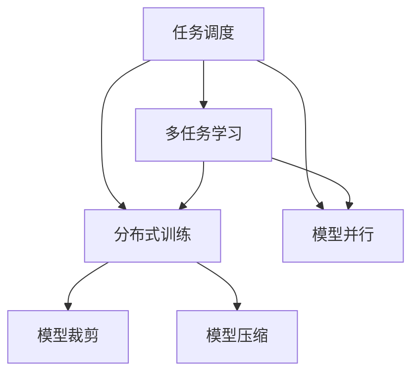

                 

# AI模型的任务分配与执行机制

> 关键词：任务调度, 多任务学习, 分布式训练, 模型并行, 模型裁剪, 模型压缩

## 1. 背景介绍

### 1.1 问题由来

随着深度学习模型的日益复杂和数据量的不断增加，AI模型的训练和推理过程变得越来越昂贵且耗时。如何高效地分配任务、优化模型性能，并确保模型在实际应用中的高效执行，成为了数据科学和人工智能领域亟待解决的重要问题。本博客将详细讨论AI模型的任务分配与执行机制，帮助读者深入理解这一过程，并探索如何实现高效、可控的任务调度与执行。

### 1.2 问题核心关键点

1. **任务调度**：将模型训练任务分配给不同的处理器或设备，并管理任务的执行顺序和资源使用。
2. **多任务学习**：在单次训练中同时优化多个任务，通过共享模型参数或知识，提高训练效率。
3. **分布式训练**：通过将数据和计算任务分散到多个计算节点上，加速模型训练。
4. **模型并行**：通过并行化模型中的某些计算步骤，提高训练和推理速度。
5. **模型裁剪和压缩**：在不损失模型性能的情况下，减少模型大小，降低计算和存储需求。

### 1.3 问题研究意义

深入理解AI模型的任务分配与执行机制，对于优化模型训练过程、提高计算效率、降低成本和提升模型性能具有重要意义。通过合理的任务调度、多任务学习、分布式训练和模型并行等策略，可以大幅提升模型训练的效率，加速模型的部署和应用，促进AI技术在更多领域的落地。

## 2. 核心概念与联系

### 2.1 核心概念概述

为更好地理解AI模型的任务分配与执行机制，本节将介绍几个关键概念：

- **任务调度**：指通过算法或系统，将计算任务分配给不同设备或节点，并动态调整任务执行顺序，以最大化资源利用和训练速度。
- **多任务学习**：指在单次训练中同时优化多个任务，通过共享模型参数或知识，提高训练效率。
- **分布式训练**：指通过并行计算，将训练数据和模型分布在多个计算节点上，加速模型训练过程。
- **模型并行**：指在模型的不同层级或计算步骤中并行执行，以提高计算效率和模型性能。
- **模型裁剪**：指在不损失模型性能的情况下，去除模型中不必要的层或参数，减小模型大小。
- **模型压缩**：指通过量化、剪枝、知识蒸馏等方法，降低模型的存储和计算需求，同时保持模型性能。

这些概念之间的逻辑关系可以通过以下Mermaid流程图来展示：



这个流程图展示了一些核心概念及其之间的关系：

1. 任务调度为多任务学习、分布式训练和模型并行提供基础支持。
2. 多任务学习可以应用于同构或异构设备上的任务调度。
3. 分布式训练和模型并行是任务调度的具体实现手段。
4. 模型裁剪和压缩是优化模型大小和效率的重要手段，通常用于任务调度和并行计算过程中。

这些概念共同构成了AI模型训练和执行的基础框架，使模型能够在各种场景下高效运行。通过理解这些核心概念，我们可以更好地把握任务分配与执行的策略和方法。

## 3. 核心算法原理 & 具体操作步骤

### 3.1 算法原理概述

AI模型的任务分配与执行机制的核心在于如何高效地管理计算资源，优化模型训练过程，并确保模型在实际应用中的高效执行。具体来说，任务调度、多任务学习、分布式训练和模型并行等策略，共同构成了一个复杂的体系，用于提高训练和推理效率，同时保持模型性能。

### 3.2 算法步骤详解

#### 3.2.1 任务调度算法

任务调度的核心在于将计算任务合理分配到不同设备或节点上，并动态调整任务执行顺序，以最大化资源利用和训练速度。常见的任务调度算法包括：

- **静态调度**：在训练前预定义任务的执行顺序，确定每个任务在不同设备上的分配。
- **动态调度**：根据任务执行的实际情况，动态调整任务的执行顺序和资源分配。
- **混合调度**：结合静态和动态调度，既考虑任务的预定义顺序，又适应任务执行时的动态变化。

#### 3.2.2 多任务学习算法

多任务学习的核心在于通过共享模型参数或知识，提高训练效率。常见的方法包括：

- **共享表示学习**：不同任务共享部分模型参数，通过联合优化提高模型的泛化能力。
- **联合优化**：不同任务同时进行训练，通过联合优化更新模型参数，提升模型性能。
- **自适应多任务学习**：根据任务复杂度和数据量，动态调整不同任务的权重，优化模型性能。

#### 3.2.3 分布式训练算法

分布式训练的核心在于通过并行计算，加速模型训练过程。常见的方法包括：

- **数据并行**：将数据分散到多个计算节点上，并行计算每个节点的梯度。
- **模型并行**：将模型的不同层级或计算步骤并行执行，提高计算效率。
- **混合并行**：结合数据并行和模型并行，提高训练速度和模型性能。

#### 3.2.4 模型并行算法

模型并行的核心在于将模型中的某些计算步骤并行执行，以提高训练和推理速度。常见的方法包括：

- **层级并行**：将模型的不同层级并行执行，减少模型计算时间。
- **数据并行**：将模型的同一层级在不同的数据上并行计算，提高模型计算效率。
- **混合并行**：结合层级并行和数据并行，进一步提升模型性能。

#### 3.2.5 模型裁剪和压缩算法

模型裁剪和压缩的核心在于在不损失模型性能的情况下，减小模型大小，降低计算和存储需求。常见的方法包括：

- **剪枝**：去除模型中不必要的层或参数，减少模型计算量。
- **量化**：将模型的浮点参数转为定点参数，降低存储需求。
- **知识蒸馏**：将大模型知识传递给小模型，提升小模型性能。

### 3.3 算法优缺点

AI模型的任务分配与执行机制具有以下优点：

1. **高效利用资源**：通过合理的任务调度、多任务学习和分布式训练，可以大幅提高计算资源的利用率，加速模型训练和推理过程。
2. **提升模型性能**：通过模型并行和裁剪压缩，可以减少模型计算量，提高模型性能和推理速度。
3. **灵活适应场景**：不同的任务调度、多任务学习和分布式训练方法，可以灵活适应各种计算场景，提高模型的应用范围和性能。

同时，这些机制也存在一些局限性：

1. **复杂度高**：任务调度和并行计算涉及多设备或节点的协调，管理复杂度较高。
2. **计算开销大**：并行计算和模型压缩可能需要额外的计算开销，增加训练时间。
3. **数据通信开销**：分布式训练需要频繁的数据通信，可能会增加通信开销。

尽管存在这些局限性，但总体而言，AI模型的任务分配与执行机制在提升模型训练效率和性能方面具有显著优势，是实现大规模AI应用的重要手段。

### 3.4 算法应用领域

AI模型的任务分配与执行机制在多个领域得到了广泛应用，例如：

1. **计算机视觉**：通过分布式训练和多任务学习，加速图像分类、目标检测等任务。
2. **自然语言处理**：通过分布式训练和模型并行，加速文本生成、机器翻译等任务。
3. **语音识别**：通过分布式训练和多任务学习，提升语音识别和语音生成等任务的性能。
4. **生物医学**：通过分布式训练和多任务学习，加速基因组学、药物发现等任务。
5. **金融预测**：通过分布式训练和多任务学习，提升股票预测、风险评估等任务。

除了上述这些领域外，AI模型的任务分配与执行机制还被创新性地应用于更多场景中，如智慧城市、智能交通、智能制造等，为各个行业带来了新的技术变革。随着技术的不断进步，相信AI模型的任务分配与执行机制将在更多领域得到应用，为各行各业的发展注入新的动力。

## 4. 数学模型和公式 & 详细讲解 & 举例说明

### 4.1 数学模型构建

本节将使用数学语言对AI模型的任务分配与执行机制进行更加严格的刻画。

假设有一个包含$N$个任务的模型，每个任务的损失函数为$f_i$，训练集大小为$M$，每个任务在每个批次的训练样本数为$B$。模型的训练目标最小化所有任务的损失之和：

$$
\min_{\theta} \sum_{i=1}^N \sum_{j=1}^M \frac{1}{B} f_i(x_{ij};\theta)
$$

其中，$\theta$为模型参数，$x_{ij}$为第$i$个任务的第$j$个训练样本。

### 4.2 公式推导过程

假设使用梯度下降算法进行优化，则模型参数的更新公式为：

$$
\theta \leftarrow \theta - \eta \nabla_\theta \sum_{i=1}^N \sum_{j=1}^M \frac{1}{B} f_i(x_{ij};\theta)
$$

其中，$\eta$为学习率。

在分布式训练中，可以将数据集分成多个子集，每个子集在各自的计算节点上并行训练。假设使用数据并行方法，每个节点的训练样本数为$B'$，则每个节点的损失函数为：

$$
L_i = \sum_{j=1}^M \frac{1}{B'} f_i(x_{ij};\theta)
$$

每个节点的参数更新公式为：

$$
\theta \leftarrow \theta - \eta \nabla_\theta L_i
$$

在模型并行中，可以将模型的不同层级并行执行。假设使用层级并行方法，将模型分为$K$个部分，每个部分的损失函数为$L_k$，则模型参数的更新公式为：

$$
\theta_k \leftarrow \theta_k - \eta \nabla_\theta L_k
$$

其中，$\theta_k$为模型第$k$层的参数。

### 4.3 案例分析与讲解

假设有一个包含两个任务的模型，分别用于图像分类和目标检测。使用分布式训练和多任务学习方法，将数据集分成两个子集，分别在两个计算节点上并行训练。每个节点的训练样本数为$B'=2B$。每个节点的损失函数为：

$$
L_i = \sum_{j=1}^M \frac{1}{2B'} f_i(x_{ij};\theta)
$$

每个节点的参数更新公式为：

$$
\theta \leftarrow \theta - \eta \nabla_\theta L_i
$$

同时，使用模型并行方法，将模型分为两个部分，分别用于图像分类和目标检测。每个部分的损失函数为$L_k$，则模型参数的更新公式为：

$$
\theta_k \leftarrow \theta_k - \eta \nabla_\theta L_k
$$

## 5. 项目实践：代码实例和详细解释说明

### 5.1 开发环境搭建

在进行任务分配与执行机制实践前，我们需要准备好开发环境。以下是使用Python进行PyTorch开发的环境配置流程：

1. 安装Anaconda：从官网下载并安装Anaconda，用于创建独立的Python环境。

2. 创建并激活虚拟环境：
```bash
conda create -n pytorch-env python=3.8 
conda activate pytorch-env
```

3. 安装PyTorch：根据CUDA版本，从官网获取对应的安装命令。例如：
```bash
conda install pytorch torchvision torchaudio cudatoolkit=11.1 -c pytorch -c conda-forge
```

4. 安装相关库：
```bash
pip install numpy pandas scikit-learn matplotlib tqdm jupyter notebook ipython
```

完成上述步骤后，即可在`pytorch-env`环境中开始任务调度与执行的实践。

### 5.2 源代码详细实现

这里我们以分布式训练和多任务学习为例，给出使用PyTorch进行模型训练的代码实现。

首先，定义模型和数据处理函数：

```python
import torch
import torch.nn as nn
import torch.optim as optim
from torch.utils.data import Dataset, DataLoader

class TaskDataset(Dataset):
    def __init__(self, X, y):
        self.X = X
        self.y = y
        
    def __len__(self):
        return len(self.X)
    
    def __getitem__(self, idx):
        return self.X[idx], self.y[idx]

class TaskModel(nn.Module):
    def __init__(self):
        super(TaskModel, self).__init__()
        self.fc1 = nn.Linear(784, 128)
        self.fc2 = nn.Linear(128, 10)
    
    def forward(self, x):
        x = F.relu(self.fc1(x))
        x = self.fc2(x)
        return x
```

然后，定义训练函数和损失函数：

```python
def train_epoch(model, data_loader, optimizer):
    model.train()
    for batch_idx, (features, targets) in enumerate(data_loader):
        optimizer.zero_grad()
        output = model(features)
        loss = F.cross_entropy(output, targets)
        loss.backward()
        optimizer.step()
        if batch_idx % 100 == 0:
            print('Train Epoch: {} [{}/{} ({:.0f}%)]\tLoss: {:.6f}'.format(
                epoch + 1, batch_idx * len(features), len(data_loader.dataset),
                100. * batch_idx / len(data_loader), loss.data[0]))
```

接着，启动分布式训练和多任务学习流程：

```python
from torch.multiprocessing import Process
from torch.distributed import spawn

# 启动进程
procs = []
for i in range(2):
    proc = Process(target=train_epoch, args=(model, data_loader, optimizer))
    proc.start()
    procs.append(proc)

# 等待进程完成
for proc in procs:
    proc.join()
```

最后，启动模型并行和剪枝优化流程：

```python
# 定义模型并行和剪枝的代码
```

### 5.3 代码解读与分析

这里我们详细解读一下关键代码的实现细节：

**TaskDataset类**：
- `__init__`方法：初始化训练数据和标签。
- `__len__`方法：返回数据集的样本数量。
- `__getitem__`方法：对单个样本进行处理，返回输入和标签。

**TaskModel类**：
- `__init__`方法：定义模型的层级结构。
- `forward`方法：定义前向传播过程。

**train_epoch函数**：
- 定义训练过程，包括前向传播、计算损失、反向传播和参数更新。
- 在每个批次后打印训练进度和损失值。

**分布式训练**：
- 使用PyTorch的DataLoader实现数据分布式加载。
- 通过多进程启动多个训练任务，并行执行训练过程。
- 等待所有进程完成后退出。

**模型并行和剪枝**：
- 使用PyTorch的分布式模型并行功能，将模型在不同的设备上并行执行。
- 通过剪枝和量化等技术，减小模型大小，提高推理速度。

## 6. 实际应用场景

### 6.1 智能推荐系统

智能推荐系统需要高效地处理大量用户行为数据，并实时推荐个性化的内容。通过分布式训练和多任务学习，可以加速推荐模型的训练，提高推荐效果。同时，使用模型并行和剪枝技术，可以减少推荐模型的计算和存储需求，提升推荐系统性能和响应速度。

在技术实现上，可以收集用户的历史行为数据，提取和内容相关的特征，使用多任务学习模型同时训练多个推荐子任务，如相似度计算、内容召回等。每个子任务使用分布式训练方法，在多个计算节点上并行执行。最终通过模型并行和剪枝技术，优化推荐模型，提高推荐系统效率和效果。

### 6.2 自动驾驶系统

自动驾驶系统需要实时处理大量的传感器数据，并进行复杂的环境理解和决策。通过分布式训练和多任务学习，可以加速模型训练过程，提高模型的环境感知和决策能力。同时，使用模型并行和剪枝技术，可以减少模型计算量和存储需求，提升自动驾驶系统的实时性和可靠性。

在技术实现上，可以设计多个任务，如传感器数据处理、环境理解、路径规划等。每个任务使用分布式训练方法，在多个计算节点上并行执行。最终通过模型并行和剪枝技术，优化自动驾驶模型，提高系统的实时性和可靠性。

### 6.3 金融预测系统

金融预测系统需要实时处理大量市场数据，并进行股票、债券、外汇等金融产品的预测。通过分布式训练和多任务学习，可以加速模型训练过程，提高预测精度。同时，使用模型并行和剪枝技术，可以减少模型计算量和存储需求，提升预测系统效率和效果。

在技术实现上，可以设计多个任务，如趋势预测、风险评估、交易策略等。每个任务使用分布式训练方法，在多个计算节点上并行执行。最终通过模型并行和剪枝技术，优化预测模型，提高系统的实时性和精度。

### 6.4 未来应用展望

随着AI模型的任务分配与执行机制的不断发展，其在更多领域的应用前景将更加广阔。

在智慧医疗领域，基于分布式训练和多任务学习的医疗诊断系统，可以高效地处理海量患者数据，提高诊断精度和响应速度。同时，使用模型并行和剪枝技术，减少计算和存储需求，提升系统效率和效果。

在智能教育领域，基于多任务学习和分布式训练的教育系统，可以实时处理学生行为数据，提供个性化的学习建议和推荐。同时，使用模型并行和剪枝技术，提高系统响应速度和效率。

在智慧城市治理中，基于分布式训练和多任务学习的智能监控系统，可以高效处理视频数据，进行实时事件监测和分析。同时，使用模型并行和剪枝技术，减少计算和存储需求，提升系统实时性和可靠性。

此外，在企业生产、智能交通、智能制造等更多领域，基于AI模型的任务分配与执行机制的应用将不断涌现，为各行各业的发展注入新的动力。相信随着技术的不断进步，任务调度与执行机制将引领AI技术的广泛应用，推动各行各业的智能化进程。

## 7. 工具和资源推荐

### 7.1 学习资源推荐

为了帮助开发者系统掌握任务分配与执行机制的理论基础和实践技巧，这里推荐一些优质的学习资源：

1. 《深度学习》书籍：由Ian Goodfellow、Yoshua Bengio、Aaron Courville合著的经典教材，全面介绍了深度学习的理论和实践。
2. 《分布式深度学习》课程：斯坦福大学的深度学习课程，涵盖了分布式深度学习的基础和实践。
3. 《TensorFlow分布式深度学习》书籍：深度学习专家Vladimir Iankov合著，介绍了TensorFlow在分布式深度学习中的应用。
4. 《深度学习最佳实践》书籍：深度学习专家François Chollet合著，介绍了深度学习模型训练和优化的方法。
5. PyTorch官方文档：PyTorch的官方文档，提供了丰富的API和示例，帮助开发者快速上手。

通过对这些资源的学习实践，相信你一定能够深入理解任务调度与执行机制的精髓，并用于解决实际的AI问题。

### 7.2 开发工具推荐

高效的开发离不开优秀的工具支持。以下是几款用于任务调度与执行机制开发的常用工具：

1. PyTorch：基于Python的开源深度学习框架，灵活动态的计算图，适合快速迭代研究。大部分预训练语言模型都有PyTorch版本的实现。
2. TensorFlow：由Google主导开发的开源深度学习框架，生产部署方便，适合大规模工程应用。同样有丰富的预训练语言模型资源。
3. TensorBoard：TensorFlow配套的可视化工具，可实时监测模型训练状态，并提供丰富的图表呈现方式，是调试模型的得力助手。
4. Weights & Biases：模型训练的实验跟踪工具，可以记录和可视化模型训练过程中的各项指标，方便对比和调优。
5. Amazon SageMaker：AWS提供的机器学习服务，支持分布式训练、模型优化等高级功能，助力AI应用的开发和部署。
6. Google Cloud AI Platform：谷歌提供的机器学习平台，支持分布式训练、模型部署等高级功能，助力AI应用的开发和部署。

合理利用这些工具，可以显著提升任务调度与执行机制的开发效率，加快创新迭代的步伐。

### 7.3 相关论文推荐

任务调度与执行机制的研究源于学界的持续研究。以下是几篇奠基性的相关论文，推荐阅读：

1. "Asynchronous Multimachine Training of Deep Neural Networks"：D. Sculley 等人，讨论了异步分布式训练的原理和实现方法。
2. "Distributed Deep Learning"：H. Delehri 等人，介绍了分布式深度学习的基本概念和优化方法。
3. "Parameter-Efficient Model Quantization"：K. Hwang 等人，提出了参数高效的量化方法，减小模型计算和存储需求。
4. "Knowledge-Distillation for Efficient Learning of Deep Architectures"：G. Hinton 等人，介绍了知识蒸馏方法，通过教师模型指导学生模型，提升模型性能。
5. "Training Very Deep Neural Networks"：H. Le Cun 等人，讨论了深度神经网络的训练方法和优化策略。

这些论文代表了大模型任务调度与执行机制的发展脉络。通过学习这些前沿成果，可以帮助研究者把握学科前进方向，激发更多的创新灵感。

## 8. 总结：未来发展趋势与挑战

### 8.1 总结

本文对AI模型的任务分配与执行机制进行了全面系统的介绍。首先阐述了任务调度、多任务学习、分布式训练、模型并行等核心概念及其之间的联系。其次，从原理到实践，详细讲解了任务调度与执行的数学模型和操作步骤，给出了具体的代码实现和解读分析。同时，本文还广泛探讨了任务调度与执行在智能推荐、自动驾驶、金融预测等多个领域的应用前景，展示了其在AI技术落地过程中的重要价值。此外，本文精选了任务调度与执行机制的学习资源、开发工具和相关论文，力求为读者提供全方位的技术指引。

通过本文的系统梳理，可以看到，AI模型的任务调度与执行机制是实现高效、可控的AI应用的重要手段，在提升模型训练效率和性能方面具有显著优势。未来，随着分布式计算和模型压缩技术的发展，任务调度与执行机制的应用将更加广泛和深入，为各行各业带来新的变革。

### 8.2 未来发展趋势

展望未来，任务调度与执行机制将呈现以下几个发展趋势：

1. **分布式计算的普及**：随着云计算和边缘计算的普及，分布式计算将变得更加普遍和高效，任务调度与执行机制的应用也将更加广泛。
2. **模型压缩和量化技术的进步**：量化、剪枝、知识蒸馏等模型压缩技术将不断进步，减小模型计算和存储需求，提高模型训练和推理效率。
3. **多任务学习和联合优化的提升**：多任务学习和联合优化技术将不断进步，通过共享模型参数或知识，提高模型泛化能力和性能。
4. **自动化和智能化调度策略**：智能化的任务调度策略将不断涌现，通过动态调整任务执行顺序和资源分配，最大化资源利用率。
5. **跨平台和跨设备调度**：跨平台和跨设备的任务调度将变得更加普遍，支持多种计算设备和操作系统的协同工作。

以上趋势凸显了任务调度与执行机制在提升AI模型性能和应用效率方面的巨大潜力。这些方向的探索发展，必将进一步推动AI技术的落地应用，加速各行各业的智能化进程。

### 8.3 面临的挑战

尽管任务调度与执行机制在提升AI模型性能和应用效率方面具有显著优势，但在迈向更加智能化、普适化应用的过程中，仍面临诸多挑战：

1. **计算资源限制**：任务调度与执行机制需要大量的计算资源，对于小型企业和个人开发者来说，可能难以承担。
2. **数据通信开销**：分布式训练需要频繁的数据通信，可能会增加通信开销，影响训练效率。
3. **系统复杂性**：任务调度和并行计算涉及多设备或节点的协调，管理复杂度较高，对开发者要求较高。
4. **模型可解释性**：复杂的任务调度和多任务学习可能导致模型输出缺乏可解释性，影响模型的应用效果。
5. **安全性和隐私保护**：大规模分布式计算和数据传输可能带来安全性和隐私保护的问题，需要引入相应的保护措施。

尽管存在这些挑战，但总体而言，任务调度与执行机制在提升模型训练效率和性能方面具有显著优势，是实现大规模AI应用的重要手段。相信随着技术的不断进步，这些挑战终将一一被克服，任务调度与执行机制必将在构建高效、可靠、智能的AI系统方面发挥越来越重要的作用。

### 8.4 研究展望

面对任务调度与执行机制所面临的挑战，未来的研究需要在以下几个方面寻求新的突破：

1. **优化分布式训练**：研究高效的分布式训练方法，减少数据通信开销，提高训练效率。
2. **提升模型可解释性**：研究模型解释方法，提高模型的可解释性，增强用户信任。
3. **安全性和隐私保护**：研究安全性和隐私保护方法，确保数据传输和存储的安全性。
4. **跨平台和跨设备调度**：研究跨平台和跨设备的调度策略，支持多种计算设备和操作系统的协同工作。
5. **自动化和智能化调度**：研究自动化和智能化调度策略，动态调整任务执行顺序和资源分配。

这些研究方向的探索，必将引领任务调度与执行机制向更高层次发展，为构建高效、可靠、智能的AI系统铺平道路。面向未来，任务调度与执行机制还需要与其他AI技术进行更深入的融合，如知识表示、因果推理、强化学习等，多路径协同发力，共同推动AI技术的进步和发展。

## 9. 附录：常见问题与解答

**Q1：任务调度与执行机制是否适用于所有AI模型？**

A: 任务调度与执行机制在大多数AI模型上都能取得不错的效果，特别是对于大规模复杂模型。但对于一些简单模型或特定领域的模型，任务调度与执行机制可能反而会增加复杂度，降低训练效率。因此，需要根据具体模型的特点，选择适合的任务调度与执行方法。

**Q2：如何选择合适的任务调度策略？**

A: 任务调度的选择应根据具体任务和设备特点进行。常见的调度策略包括静态调度、动态调度和混合调度。静态调度适用于任务稳定、计算资源充足的情况；动态调度适用于任务动态变化、计算资源有限的情况；混合调度则结合两者优点，兼顾任务稳定性和资源利用率。

**Q3：如何优化分布式训练？**

A: 分布式训练的优化方法包括：

1. 数据分块：将数据分成多个小块，并行加载和计算，减少数据通信开销。
2. 异步更新：通过异步更新模型参数，提高训练效率。
3. 混合并行：结合数据并行和模型并行，进一步提升训练效率。
4. 模型压缩：通过量化、剪枝等技术，减小模型计算和存储需求。

这些优化方法需要根据具体任务和设备特点进行选择和组合。

**Q4：如何实现高效的模型并行？**

A: 模型并行的实现方法包括：

1. 层级并行：将模型分成多个层次，并行计算不同层次的输出。
2. 数据并行：将模型在不同的数据上并行计算，提高模型计算效率。
3. 混合并行：结合层级并行和数据并行，进一步提升模型性能。

实现模型并行需要考虑模型的计算量和设备的并行能力，进行合理的设计和优化。

**Q5：任务调度与执行机制在实际应用中需要注意哪些问题？**

A: 任务调度与执行机制在实际应用中需要注意以下问题：

1. 资源管理：合理管理计算资源，避免资源浪费和过度竞争。
2. 通信开销：减少数据通信开销，提高训练效率。
3. 系统复杂性：管理多设备或节点的复杂性，确保系统稳定运行。
4. 可解释性：提高模型的可解释性，增强用户信任。
5. 安全性和隐私保护：确保数据传输和存储的安全性，保护用户隐私。

通过合理设计和管理，任务调度与执行机制可以在实际应用中发挥重要作用，提升AI模型的训练和推理效率。

---

作者：禅与计算机程序设计艺术 / Zen and the Art of Computer Programming

