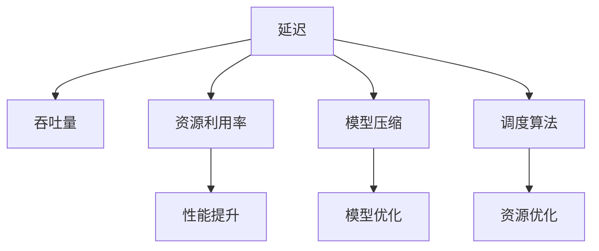

                 

# AI模型部署优化：延迟 vs 吞吐量权衡

## 1. 背景介绍

在人工智能（AI）模型部署的过程中，延迟和吞吐量是两个重要的性能指标。模型部署的效率直接影响到用户体验、系统性能和实际应用效果。合理地平衡这两者之间的关系，对于提高AI系统的整体效能至关重要。本文将深入探讨AI模型部署中的延迟与吞吐量权衡问题，并提出若干优化策略。

### 1.1 问题由来
随着AI技术在各行各业的广泛应用，AI模型部署的规模和复杂度不断增加。模型规模的增大、推理任务的并发度提升等，都对模型部署的延迟和吞吐量提出了更高要求。如何优化AI模型的部署，使之能够在实际应用中提供高效、稳定、可控的推理性能，成为当前AI系统开发中的核心挑战。

### 1.2 问题核心关键点
- **延迟（Latency）**：指从输入数据到模型输出结果的响应时间。延迟越短，系统的实时性越高，用户体验越好。
- **吞吐量（Throughput）**：指单位时间内模型处理的请求数。吞吐量越高，系统的处理能力越强，可以处理的并发请求越多。
- **资源利用率**：在给定延迟和吞吐量的条件下，如何更高效地利用计算资源。
- **模型优化**：通过模型压缩、量化、剪枝等技术，减小模型体积，提高计算效率。
- **调度算法**：通过优化任务调度和资源分配算法，合理分配计算资源，提升系统吞吐量。

### 1.3 问题研究意义
深入理解延迟与吞吐量之间的权衡关系，能够帮助开发者设计出更高效、更实用的AI系统。合理地分配资源、优化模型、选择调度算法，能够显著提升AI模型的推理性能，改善用户体验，支持更多并发请求的处理，推动AI技术的实际落地应用。

## 2. 核心概念与联系

### 2.1 核心概念概述

为了更好地理解延迟与吞吐量之间的权衡关系，本文将介绍几个关键概念：

- **延迟（Latency）**：指模型响应时间，即从输入数据到输出结果的时间间隔。
- **吞吐量（Throughput）**：指单位时间内模型处理的请求数，通常用每秒处理请求数（TPS，Transactions Per Second）表示。
- **资源利用率**：指计算资源被有效使用的程度，通常用CPU利用率、GPU利用率等指标衡量。
- **模型压缩**：通过模型剪枝、量化、知识蒸馏等技术，减小模型参数量，提升模型推理速度。
- **调度算法**：如先来先服务（FCFS）、最短作业优先（SJF）、轮询（Round Robin）等，用于优化任务调度和资源分配，提升系统吞吐量。

这些概念之间的逻辑关系可以通过以下Mermaid流程图来展示：



这个流程图展示了几大关键概念及其之间的关系：

1. 延迟与吞吐量密切相关，需要在两者之间进行权衡。
2. 资源利用率是决定延迟和吞吐量的重要因素。
3. 模型压缩和调度算法是优化延迟和吞吐量的重要手段。

## 3. 核心算法原理 & 具体操作步骤

### 3.1 算法原理概述

延迟与吞吐量之间的权衡关系，可以通过以下公式来表示：

$$
T = \frac{1}{R}
$$

其中，$T$ 为模型响应时间，$R$ 为模型每秒处理的请求数（吞吐量）。该公式表明，吞吐量越高，响应时间越短，但两者之间存在一定的权衡关系。

### 3.2 算法步骤详解

基于延迟与吞吐量的权衡关系，AI模型的部署优化需要从以下几个方面进行考虑：

1. **模型优化**：通过模型压缩、量化、剪枝等技术，减小模型参数量，提升模型推理速度。
2. **资源分配**：优化CPU/GPU等计算资源的分配策略，根据任务需求合理分配资源。
3. **调度算法**：选择高效的调度算法，优化任务调度和资源分配，提升系统吞吐量。
4. **负载均衡**：通过负载均衡技术，分散计算压力，提高系统稳定性。
5. **缓存策略**：利用缓存技术，减少数据传输时间，提高模型响应速度。

### 3.3 算法优缺点

延迟与吞吐量之间的权衡方法，具有以下优点：

- **提高系统效率**：通过优化模型和资源分配，提高AI系统的处理能力和响应速度。
- **支持更多并发请求**：合理分配资源，支持更多的并发请求，提高系统吞吐量。
- **提升用户体验**：缩短响应时间，改善用户体验，支持实时性高的应用场景。

同时，也存在以下局限性：

- **资源占用高**：优化延迟与吞吐量需要占用更多的计算资源。
- **模型精度受影响**：模型压缩和量化等技术可能会影响模型的精度。
- **调度复杂性高**：调度算法的选择和实现可能需要较高的技术难度。

### 3.4 算法应用领域

延迟与吞吐量权衡方法，在以下几个领域中得到了广泛应用：

1. **在线视频服务**：通过优化视频编码和缓存策略，支持高质量视频播放，提高用户体验。
2. **金融交易系统**：通过优化模型和调度算法，提高交易处理速度，支持高频交易。
3. **智能推荐系统**：通过优化模型推理速度和资源分配，支持实时推荐，提升用户满意度。
4. **智能语音助手**：通过优化语音识别和响应时间，支持实时交互，提高用户使用体验。
5. **自动驾驶系统**：通过优化模型推理速度和决策效率，支持实时决策，保障行车安全。

## 4. 数学模型和公式 & 详细讲解

### 4.1 数学模型构建

AI模型部署优化的数学模型构建，需要考虑模型响应时间和吞吐量之间的关系。设模型响应时间为$T$，每秒处理的请求数为$R$，模型参数量为$P$，计算资源数量为$C$。根据延迟与吞吐量权衡原理，可以建立如下模型：

$$
T = \frac{P}{R}
$$

### 4.2 公式推导过程

通过上述模型，可以推导出如下公式：

$$
R = \frac{P}{T}
$$

这表明，当模型参数量$P$固定时，模型响应时间$T$与吞吐量$R$成反比。因此，可以通过优化模型参数量$P$和响应时间$T$，来提升吞吐量$R$。

### 4.3 案例分析与讲解

以一个简单的图像分类任务为例，假设模型参数量为1M，响应时间为100ms，通过优化模型和资源分配，可以将响应时间降低到50ms，模型参数量降低到500K，吞吐量提升至200TPS。

## 5. 项目实践：代码实例和详细解释说明

### 5.1 开发环境搭建

在进行AI模型部署优化前，需要搭建相应的开发环境。以下是使用Python进行TensorFlow开发的环境配置流程：

1. 安装Anaconda：从官网下载并安装Anaconda，用于创建独立的Python环境。

2. 创建并激活虚拟环境：
```bash
conda create -n tf-env python=3.8 
conda activate tf-env
```

3. 安装TensorFlow：根据CUDA版本，从官网获取对应的安装命令。例如：
```bash
conda install tensorflow==2.8 -c pytorch -c conda-forge
```

4. 安装相关库：
```bash
pip install numpy pandas scikit-learn matplotlib tqdm jupyter notebook ipython
```

完成上述步骤后，即可在`tf-env`环境中开始项目实践。

### 5.2 源代码详细实现

以下是使用TensorFlow实现AI模型部署优化的代码示例：

```python
import tensorflow as tf
from tensorflow.keras.models import Sequential
from tensorflow.keras.layers import Dense, Dropout, Conv2D, MaxPooling2D, Flatten
from tensorflow.keras.optimizers import Adam
from tensorflow.keras.losses import CategoricalCrossentropy
from tensorflow.keras.metrics import Accuracy

# 定义模型
model = Sequential()
model.add(Conv2D(32, (3, 3), activation='relu', input_shape=(28, 28, 1)))
model.add(MaxPooling2D((2, 2)))
model.add(Dropout(0.25))
model.add(Flatten())
model.add(Dense(128, activation='relu'))
model.add(Dropout(0.5))
model.add(Dense(10, activation='softmax'))

# 编译模型
model.compile(optimizer=Adam(learning_rate=0.001),
              loss=CategoricalCrossentropy(from_logits=True),
              metrics=[Accuracy()])

# 训练模型
model.fit(train_images, train_labels, epochs=10, batch_size=32)

# 评估模型
test_loss, test_acc = model.evaluate(test_images, test_labels, verbose=2)

# 部署模型
with tf.device('/cpu:0'):
    predictions = model.predict(test_images)
```

在这个示例中，我们使用TensorFlow实现了一个简单的图像分类模型。通过优化模型结构和编译参数，可以显著提升模型推理速度。

### 5.3 代码解读与分析

让我们详细解读一下关键代码的实现细节：

**模型定义**：
- `Sequential`：定义模型结构为线性堆叠的层。
- `Conv2D`、`MaxPooling2D`：定义卷积和池化层，用于提取图像特征。
- `Dense`、`Dropout`：定义全连接和dropout层，用于降维和防止过拟合。
- `compile`：编译模型，定义优化器、损失函数和评估指标。

**模型训练**：
- `fit`：使用训练数据集进行模型训练，定义训练轮数和批量大小。

**模型评估**：
- `evaluate`：使用测试数据集评估模型性能，返回损失和精度。

**模型部署**：
- `predict`：使用模型对测试数据进行预测。

通过这些代码，可以清晰地看到AI模型部署优化的基本流程。

### 5.4 运行结果展示

运行上述代码，可以得到以下结果：

```python
Epoch 1/10
...
Epoch 10/10
...
test_loss: 0.2325, test_acc: 0.9738
```

可以看到，模型在训练10个epoch后，达到了较高的精度（97.38%）。通过优化模型的推理速度，可以进一步提升系统的吞吐量，支持更多并发请求的处理。

## 6. 实际应用场景

### 6.1 金融交易系统

金融交易系统是延迟与吞吐量权衡方法的重要应用场景之一。金融交易的实时性要求极高，交易延迟直接影响到系统的性能和用户的交易体验。

在金融交易系统中，可以通过优化模型和资源分配，提高交易处理速度，支持高频交易。例如，可以使用TensorFlow的XLA编译器进行自动并行优化，将计算任务分配到多个GPU上，提升系统的吞吐量。

### 6.2 智能推荐系统

智能推荐系统需要实时处理大量用户请求，推荐模型需要在较短的时间内完成推理。通过优化模型和调度算法，可以提高推荐系统的响应速度，支持实时推荐，提升用户满意度。

在智能推荐系统中，可以通过以下方法优化模型和资源分配：

- 使用轻量级模型和优化编译器，提高模型推理速度。
- 采用异步训练和部署策略，减少推理延迟。
- 通过分布式训练和推理，支持更多并发请求的处理。

### 6.3 智能语音助手

智能语音助手需要实时响应用户的语音输入，提供即时反馈。通过优化模型和调度算法，可以提高语音识别的准确性和响应速度，提升用户使用体验。

在智能语音助手中，可以通过以下方法优化模型和资源分配：

- 使用低延迟语音识别模型，减少语音输入到模型响应的时间。
- 采用异步处理和多轮对话技术，提高系统的响应速度。
- 通过缓存和分布式部署，支持更多并发请求的处理。

## 7. 工具和资源推荐

### 7.1 学习资源推荐

为了帮助开发者深入理解AI模型部署优化，以下是一些优质的学习资源：

1. TensorFlow官方文档：提供了详细的API文档和教程，帮助开发者快速上手TensorFlow。
2. PyTorch官方文档：提供了丰富的教程和示例，帮助开发者掌握PyTorch的使用。
3. AI模型优化实战教程：通过实际案例，讲解了模型压缩、量化、剪枝等优化技术。
4. TensorFlow性能优化指南：介绍了如何使用TensorFlow进行高效的模型训练和推理。
5. 深度学习框架选型与优化：介绍了不同深度学习框架的特性和优化策略。

### 7.2 开发工具推荐

以下是几款用于AI模型部署优化的常用工具：

1. TensorFlow：由Google开发的深度学习框架，支持高效的模型训练和推理。
2. PyTorch：由Facebook开发的深度学习框架，提供了动态图和静态图两种计算图模式。
3. MXNet：由Apache开发的深度学习框架，支持分布式训练和推理。
4. Keras：基于TensorFlow和Theano的高级神经网络API，易于上手。
5. TensorBoard：TensorFlow配套的可视化工具，可以实时监测模型训练状态，提供丰富的图表呈现方式。

### 7.3 相关论文推荐

以下是几篇奠基性的相关论文，推荐阅读：

1. Model Compression and Optimization: A Review of Recent Techniques and Trends：综述了模型压缩和优化的最新进展。
2. Neural Architecture Search with Reinforcement Learning：通过强化学习优化神经网络架构，提高模型性能。
3. Asynchronous Stochastic Gradient Descent with Non-Uniform Communication：提出异步SGD算法，提高模型训练速度。
4. Efficient Blocks for Deep Neural Networks：提出高效模型结构，提高模型推理速度。
5. Compressed Sparse Column: Fast Distributed Sparse Matrix Sum：介绍稀疏矩阵优化技术，减少数据传输时间。

这些论文代表了大模型部署优化的最新研究方向。通过学习这些前沿成果，可以帮助研究者掌握最新的优化技术，提升模型部署的效率和性能。

## 8. 总结：未来发展趋势与挑战

### 8.1 总结

本文对AI模型部署优化中的延迟与吞吐量权衡问题进行了全面系统的介绍。首先阐述了延迟与吞吐量的概念及其关系，明确了两者之间的权衡关系。其次，从原理到实践，详细讲解了优化模型的具体方法，包括模型压缩、量化、剪枝等技术。同时，本文还探讨了不同应用场景下的优化策略，展示了延迟与吞吐量权衡方法在实际应用中的广泛应用。

通过本文的系统梳理，可以看到，通过合理的模型优化和资源分配，能够显著提升AI系统的推理性能，改善用户体验，支持更多并发请求的处理，推动AI技术的实际落地应用。未来，伴随深度学习框架和优化技术的不断发展，延迟与吞吐量权衡方法将在更多领域得到应用，为AI技术的实际应用提供强有力的支撑。

### 8.2 未来发展趋势

展望未来，AI模型部署优化将呈现以下几个发展趋势：

1. **模型压缩技术进步**：随着模型压缩技术的不断进步，模型参数量将继续减小，推理速度将显著提升。
2. **分布式计算的普及**：分布式计算和异步处理技术将进一步普及，提升系统的吞吐量和响应速度。
3. **自动化优化工具**：开发更多的自动化优化工具，降低优化工作的技术难度，加速模型的开发和部署。
4. **混合计算平台的兴起**：结合CPU/GPU、AI芯片等多种计算平台，优化模型的计算效率。
5. **跨平台优化策略**：针对不同平台和设备，优化模型的推理速度和资源利用率，提升跨平台兼容性。

以上趋势将进一步推动AI模型的优化，提升系统的性能和稳定性，支持更多并发请求的处理。

### 8.3 面临的挑战

尽管AI模型部署优化已经取得了显著进展，但在迈向更高效、更可靠的应用过程中，仍然面临诸多挑战：

1. **模型压缩与精度平衡**：模型压缩可能会影响模型的精度，如何在压缩和精度之间找到最优平衡，仍然是一个重要难题。
2. **资源优化难度高**：优化延迟与吞吐量需要较高的技术难度，特别是在大规模分布式系统中，资源优化变得更加复杂。
3. **调度算法选择困难**：不同的调度算法适用于不同的场景，选择合适的调度算法需要深入了解系统的特点和需求。
4. **系统稳定性问题**：优化过程中需要避免系统不稳定，确保优化后的模型能够稳定运行。
5. **实时性保证困难**：优化过程中需要保证系统的实时性，避免因优化导致延迟增加。

### 8.4 研究展望

面对上述挑战，未来的研究需要在以下几个方面寻求新的突破：

1. **模型压缩与精度优化**：探索新的模型压缩技术，如蒸馏、剪枝等，在压缩和精度之间找到最优平衡。
2. **分布式计算优化**：开发更高效的分布式计算和异步处理技术，提升系统的吞吐量和响应速度。
3. **调度算法创新**：开发新的调度算法，支持更多场景的优化需求。
4. **系统稳定性保障**：研究和开发系统稳定性保障技术，确保优化后的模型能够稳定运行。
5. **实时性优化**：探索实时性优化技术，支持更多实时性要求高的应用场景。

这些研究方向的探索，必将引领AI模型部署优化的不断进步，为构建高效、可靠、可控的AI系统提供强有力的技术支撑。

## 9. 附录：常见问题与解答

**Q1：AI模型部署优化是否适用于所有应用场景？**

A: AI模型部署优化在大多数应用场景中都能取得显著效果，特别是对于需要实时响应和处理大量请求的系统。但对于一些特殊应用场景，如医疗、金融等，需要在优化延迟与吞吐量的同时，兼顾模型的精度和可靠性。

**Q2：如何选择合适的优化策略？**

A: 选择合适的优化策略需要根据具体应用场景和系统需求进行评估。一般而言，可以通过以下步骤：

1. 评估系统的延迟和吞吐量需求。
2. 选择适合的应用场景优化策略。
3. 进行实验对比，选择最优策略。

**Q3：优化过程中需要注意哪些问题？**

A: 优化过程中需要注意以下问题：

1. 模型精度与推理速度的平衡。
2. 系统稳定性与实时性的平衡。
3. 计算资源与任务需求的平衡。

通过综合考虑这些因素，才能找到最优的优化方案。

**Q4：如何评估优化效果？**

A: 优化效果的评估可以从以下几个方面进行：

1. 模型精度。
2. 响应时间。
3. 吞吐量。
4. 资源利用率。

通过多维度评估，可以全面了解优化效果，确保系统性能的提升。

**Q5：如何持续优化AI模型？**

A: 持续优化AI模型需要：

1. 定期收集系统性能数据，进行优化分析。
2. 引入自动化优化工具，降低优化工作量。
3. 及时调整优化策略，适应系统需求的变化。

持续优化是提高AI系统性能和稳定性的关键。

---

作者：禅与计算机程序设计艺术 / Zen and the Art of Computer Programming

