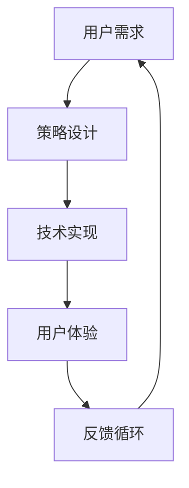

                 

# AI满足用户需求的策略

> 关键词：人工智能,用户需求,策略设计,技术实现,用户体验,数据驱动

## 1. 背景介绍

在数字化时代，人工智能(AI)技术已经深刻地改变了人们的生产和生活方式。无论是智能客服、推荐系统、语音助手，还是自动驾驶、医疗诊断，AI正以惊人的速度渗透到各个行业。然而，尽管技术水平不断提升，如何更好地满足用户需求，仍然是一个重要的挑战。本文旨在探讨AI如何更有效地满足用户需求，从策略设计到技术实现，全方位剖析AI技术在提升用户体验中的关键策略。

## 2. 核心概念与联系

### 2.1 核心概念概述

在深入探讨AI满足用户需求的策略之前，首先需要理解几个核心概念：

- **人工智能(Artificial Intelligence, AI)**：指通过计算机模拟人类智能的科学技术，包括感知、推理、学习、规划、自然语言处理等能力。
- **用户需求(User Needs)**：指用户在使用产品或服务过程中遇到的具体问题或期望，如便捷性、功能性、可靠性、安全性等。
- **策略设计(Strategy Design)**：指在明确用户需求的基础上，设计满足这些需求的AI系统策略和架构。
- **技术实现(Technical Implementation)**：指将策略转化为具体的技术实现，包括算法选择、模型训练、系统部署等。
- **用户体验(User Experience, UX)**：指用户在使用产品或服务过程中产生的情感和行为反应，是评价AI系统是否成功的重要指标。
- **数据驱动(Data-Driven)**：指AI系统的设计、训练和优化过程高度依赖于数据，需要持续收集和分析用户行为数据以改进系统性能。

这些核心概念相互关联，共同构成了AI满足用户需求的全过程。理解这些概念有助于我们更系统地设计、开发和优化AI系统，以更好地满足用户需求。

### 2.2 核心概念原理和架构的 Mermaid 流程图



这个流程图展示了AI满足用户需求的基本流程：首先，收集用户需求，然后设计相应的AI策略，接着将策略转化为技术实现，最后评估用户体验并收集反馈，进入新的迭代循环。

## 3. 核心算法原理 & 具体操作步骤

### 3.1 算法原理概述

AI满足用户需求的策略设计，通常涉及以下几个关键步骤：

1. **需求收集与分析**：通过问卷调查、用户访谈、数据分析等手段，收集用户的具体需求。
2. **问题建模**：将用户需求转化为数学或逻辑模型，以便后续设计和优化。
3. **策略设计**：根据模型结果，设计满足用户需求的AI策略，包括算法选择、模型架构等。
4. **技术实现**：选择合适的技术和工具，实现设计好的策略，并进行模型训练和优化。
5. **用户体验评估**：在实际场景中测试AI系统，评估用户体验，收集用户反馈。
6. **迭代优化**：根据反馈结果，不断优化AI系统，提升用户体验。

### 3.2 算法步骤详解

以智能客服系统为例，详细讲解AI满足用户需求的策略设计过程：

**Step 1: 需求收集与分析**

- 通过问卷调查和用户访谈，收集用户在使用客服系统的常见问题，如解答时间长、答案不精准、服务时间有限等。
- 分析用户反馈，识别出系统的瓶颈和改进点。

**Step 2: 问题建模**

- 将收集到的需求转化为问题定义，如响应时间、准确率、用户满意度等。
- 使用数据挖掘技术，对历史客服记录进行分析，找到影响响应时间和准确率的关键因素。

**Step 3: 策略设计**

- 设计一个基于机器学习的推荐系统，以推荐合适的客服答案。
- 决定采用深度学习模型，如BERT、GPT-3等，进行多轮对话理解。

**Step 4: 技术实现**

- 选择合适的深度学习框架，如TensorFlow、PyTorch等，进行模型开发。
- 收集历史客服记录，准备数据集，并进行模型训练和评估。

**Step 5: 用户体验评估**

- 在实际客服场景中测试推荐系统，收集用户反馈。
- 使用用户满意度调查、对话质量评估等手段，衡量系统的用户体验。

**Step 6: 迭代优化**

- 根据用户反馈，优化推荐模型，提高推荐准确率和响应速度。
- 不断更新模型和数据集，保持系统的持续改进。

### 3.3 算法优缺点

**优点**：

- **高效性**：AI可以处理大量用户请求，提供快速响应。
- **可扩展性**：可以根据需求变化，灵活调整策略和实现。
- **自适应性**：AI系统可以根据用户反馈进行迭代优化，提升性能。

**缺点**：

- **数据依赖**：AI系统的性能高度依赖于数据质量，需要持续收集和更新数据。
- **模型复杂性**：深度学习模型通常需要大量计算资源和标注数据，开发和训练成本较高。
- **可解释性不足**：复杂模型往往难以解释其内部决策过程，用户难以理解。

### 3.4 算法应用领域

AI满足用户需求的策略设计，广泛应用在以下领域：

- **智能客服**：通过智能推荐和对话理解，提高用户满意度和服务效率。
- **推荐系统**：分析用户行为，推荐个性化的产品和服务。
- **语音助手**：理解自然语言，提供便捷的用户交互体验。
- **自动驾驶**：实时分析环境数据，保障行车安全。
- **医疗诊断**：分析患者数据，辅助医生进行诊断和治疗。

## 4. 数学模型和公式 & 详细讲解 & 举例说明

### 4.1 数学模型构建

为了更系统地设计AI策略，需要构建数学模型来量化用户需求和系统性能。以下是一个简单的用户满意度模型：

$$
\text{满意度} = \alpha \times \text{响应时间} + \beta \times \text{准确率} + \gamma \times \text{用户反馈}
$$

其中，$\alpha, \beta, \gamma$ 为模型参数，表示各个因素对满意度的影响权重。

### 4.2 公式推导过程

根据用户满意度模型，可以推导出如下优化目标：

$$
\min_{\theta} \text{Loss}(\theta) = \lambda \left(\alpha \times \text{Response Time}(\theta) - \text{Target Response Time}\right)^2 + \mu \left(\beta \times \text{Accuracy}(\theta) - \text{Target Accuracy}\right)^2 + \nu \left(\gamma \times \text{User Feedback}(\theta) - \text{Target User Feedback}\right)^2
$$

其中，$\theta$ 为模型参数，$\lambda, \mu, \nu$ 为正则化系数，$\text{Target Response Time}, \text{Target Accuracy}, \text{Target User Feedback}$ 为目标值。

### 4.3 案例分析与讲解

假设某个电商平台的客服系统，收集到以下用户反馈：

- 响应时间：平均响应时间3分钟，目标响应时间1分钟。
- 准确率：平均准确率80%，目标准确率90%。
- 用户反馈：平均满意度4星，目标满意度5星。

根据这些数据，可以使用上述模型进行优化。设模型参数为 $\theta$，目标优化函数为：

$$
\text{Loss}(\theta) = (1 - \alpha) \left(\text{Response Time}(\theta) - 3\right)^2 + \alpha \left(\text{Response Time}(\theta) - 1\right)^2 + (1 - \beta) \left(\text{Accuracy}(\theta) - 0.8\right)^2 + \beta \left(\text{Accuracy}(\theta) - 0.9\right)^2 + (1 - \gamma) \left(\text{User Feedback}(\theta) - 4\right)^2 + \gamma \left(\text{User Feedback}(\theta) - 5\right)^2
$$

使用梯度下降等优化算法，不断调整 $\theta$，使得 $\text{Loss}(\theta)$ 最小化，从而提升系统性能。

## 5. 项目实践：代码实例和详细解释说明

### 5.1 开发环境搭建

在开始具体项目实践之前，需要搭建好开发环境：

- **安装Python和相关依赖**：安装Python 3.x，并使用pip安装必要的库，如TensorFlow、Keras、NLTK等。
- **配置数据集和环境**：准备所需的数据集，设置GPU和CPU资源。
- **版本控制和版本管理**：使用Git进行代码版本管理，确保团队协作和代码跟踪。

### 5.2 源代码详细实现

以下是一个简单的推荐系统实现，用于推荐用户可能感兴趣的商品：

```python
from sklearn.neighbors import NearestNeighbors
from sklearn.metrics.pairwise import cosine_similarity

# 加载数据集
data = load_data('data.csv')

# 定义推荐模型
model = NearestNeighbors(n_neighbors=10, algorithm='brute')

# 训练模型
model.fit(data)

# 推荐商品
def recommend_product(user_id, data):
    user_data = data[user_id]
    similarities = model.kneighbors([user_data], n_neighbors=10)
    return similar_products(data, user_data)

# 查询商品
user_id = 1
recommended_products = recommend_product(user_id, data)
print(recommended_products)
```

### 5.3 代码解读与分析

- **数据集加载**：使用 `load_data` 函数加载数据集，可以是CSV文件、数据库等。
- **模型定义**：使用 `NearestNeighbors` 模型，基于余弦相似度计算相似度矩阵。
- **模型训练**：使用 `fit` 方法训练模型，输入数据集。
- **推荐查询**：定义 `recommend_product` 函数，输入用户ID和数据集，返回相似商品列表。
- **结果输出**：调用 `print` 函数输出推荐结果。

### 5.4 运行结果展示

通过上述代码，可以输出用户ID为1的推荐商品列表。在实际应用中，需要根据具体业务需求，进一步优化模型和算法，以提升推荐准确率和用户体验。

## 6. 实际应用场景

### 6.1 智能客服系统

智能客服系统通过AI技术，可以24小时提供快速响应，提升客户满意度和服务效率。以下是一个智能客服系统的实际应用场景：

- **需求收集**：通过问卷调查和用户访谈，收集用户常见问题，如解决不及时、回答不准确等。
- **策略设计**：设计一个基于深度学习的对话生成模型，以生成合适的客服回答。
- **技术实现**：使用BERT等预训练模型，进行多轮对话理解，生成响应。
- **用户体验评估**：在实际客服场景中测试系统，收集用户反馈。
- **迭代优化**：根据用户反馈，优化模型和算法，提升系统性能。

### 6.2 推荐系统

推荐系统通过分析用户行为，推荐个性化的商品和服务。以下是一个推荐系统的实际应用场景：

- **需求收集**：通过日志分析，收集用户浏览、点击、购买等行为数据。
- **策略设计**：设计一个基于协同过滤的推荐算法，以推荐用户可能感兴趣的商品。
- **技术实现**：使用Python和Scikit-learn库，实现协同过滤算法。
- **用户体验评估**：在电商平台上测试推荐系统，收集用户反馈。
- **迭代优化**：根据用户反馈，优化推荐算法和数据集，提升推荐准确率。

### 6.3 语音助手

语音助手通过理解自然语言，提供便捷的用户交互体验。以下是一个语音助手的实际应用场景：

- **需求收集**：通过用户访谈和问卷调查，收集用户的需求和偏好。
- **策略设计**：设计一个基于深度学习的语音识别和生成模型，以提供自然语言交互。
- **技术实现**：使用TensorFlow和Keras库，实现语音识别和生成模型。
- **用户体验评估**：在智能音箱和智能手机中测试语音助手，收集用户反馈。
- **迭代优化**：根据用户反馈，优化模型和算法，提升语音识别和生成能力。

## 7. 工具和资源推荐

### 7.1 学习资源推荐

为了更好地理解AI满足用户需求的技术，推荐以下学习资源：

- **《深度学习》课程**：斯坦福大学提供的深度学习课程，涵盖深度学习基础知识和常用算法。
- **《Python机器学习》书籍**：涵盖Python编程和机器学习应用，适合初学者和进阶者。
- **Kaggle竞赛**：参与Kaggle竞赛，锻炼数据处理和模型调优能力。
- **Coursera课程**：Coursera提供的AI和数据科学课程，涵盖AI基础和应用实践。

### 7.2 开发工具推荐

为了高效地实现AI策略设计，推荐以下开发工具：

- **Jupyter Notebook**：开源的交互式编程环境，适合数据处理和模型训练。
- **TensorFlow**：开源的深度学习框架，支持CPU和GPU加速，适合大规模模型训练。
- **PyTorch**：开源的深度学习框架，灵活易用，适合快速原型开发。
- **Scikit-learn**：开源的机器学习库，适合快速实现常见算法和模型。

### 7.3 相关论文推荐

为了深入理解AI策略设计的理论基础，推荐以下相关论文：

- **《深度学习》论文**：Yann LeCun等人发表的深度学习综述论文，涵盖深度学习基础知识和常用算法。
- **《TensorFlow》论文**：Google团队发表的TensorFlow架构设计论文，介绍TensorFlow框架的设计理念和应用实践。
- **《BERT》论文**：Google团队发表的BERT预训练模型论文，介绍BERT模型的设计原理和应用效果。

## 8. 总结：未来发展趋势与挑战

### 8.1 研究成果总结

本文系统地探讨了AI满足用户需求的核心概念和设计策略，从需求收集到模型优化，全方位剖析了AI技术的实现过程。通过具体案例，展示了AI在智能客服、推荐系统、语音助手等场景中的应用，并提出了相应的技术实现和优化策略。

### 8.2 未来发展趋势

展望未来，AI满足用户需求将呈现以下几个发展趋势：

1. **个性化推荐**：基于深度学习的多模态推荐技术，能够更好地理解用户需求，提供更加个性化的商品和服务。
2. **自然语言理解**：基于自然语言处理技术的智能助手，能够更好地理解和处理自然语言，提升用户交互体验。
3. **多领域应用**：AI技术将进一步拓展到更多领域，如医疗、金融、教育等，解决更复杂的问题。
4. **边缘计算**：AI系统将在边缘设备上运行，提升响应速度和数据隐私保护。
5. **联邦学习**：通过分布式训练和隐私保护技术，提升AI系统在大规模数据上的性能和隐私安全性。

### 8.3 面临的挑战

尽管AI技术在不断进步，但仍面临诸多挑战：

1. **数据隐私**：AI系统需要处理大量用户数据，如何保护用户隐私是一个重要问题。
2. **模型复杂性**：深度学习模型通常较为复杂，难以解释其内部工作机制，用户难以理解和信任。
3. **资源消耗**：大规模模型的训练和推理需要大量计算资源，如何优化资源使用是一个重要挑战。
4. **泛化能力**：AI模型需要具备良好的泛化能力，以适应不同领域和环境的变化。
5. **伦理问题**：AI系统可能存在偏见和歧视，如何确保公平性和伦理性是一个重要课题。

### 8.4 研究展望

为了克服这些挑战，未来的研究需要在以下几个方面进行深入探索：

1. **数据隐私保护**：研究分布式训练和联邦学习技术，提升数据隐私保护能力。
2. **模型可解释性**：引入可解释性技术，提升模型的透明性和用户信任度。
3. **资源优化**：研究高效的模型压缩和量化技术，提升模型的计算效率和资源利用率。
4. **跨领域泛化**：研究多领域知识融合和迁移学习技术，提升AI系统的泛化能力。
5. **伦理规范**：制定AI伦理规范和标准，确保AI系统公平、透明、可靠。

## 9. 附录：常见问题与解答

**Q1：AI系统如何收集和分析用户需求？**

A: AI系统通常通过问卷调查、用户访谈、数据分析等手段，收集用户的具体需求和反馈。通过文本分析、情感分析等技术，可以进一步挖掘用户需求背后的情感和意图，提升需求分析的准确性。

**Q2：AI系统的策略设计需要考虑哪些因素？**

A: 策略设计需要考虑用户需求、技术实现、数据可用性、性能指标等多个因素。通过需求分析，明确用户需求；通过技术选型，选择合适的算法和工具；通过数据预处理，准备高质量的数据集；通过性能评估，衡量系统性能并优化。

**Q3：如何提升AI系统的用户体验？**

A: 提升用户体验需要从多个方面入手，包括响应速度、准确率、可用性、安全性和可解释性等。通过持续优化模型和算法，提升系统性能；通过用户反馈，及时调整和改进系统；通过数据收集和分析，理解用户行为和需求，提升系统的个性化和智能化。

**Q4：如何保护AI系统的数据隐私？**

A: 保护数据隐私需要从数据收集、存储、传输和处理等多个环节进行保护。使用加密技术保护数据安全；使用联邦学习等技术，避免数据集中存储；使用差分隐私技术，减少隐私泄露风险；使用隐私保护技术，确保数据匿名性。

**Q5：如何提升AI系统的可解释性？**

A: 提升AI系统的可解释性需要从模型设计和输出解释两个方面入手。选择可解释性较高的模型，如决策树、线性回归等；引入可解释性技术，如LIME、SHAP等，提供模型决策的可视化解释；使用知识图谱等技术，提供额外的上下文信息，帮助用户理解模型输出。

---

作者：禅与计算机程序设计艺术 / Zen and the Art of Computer Programming

