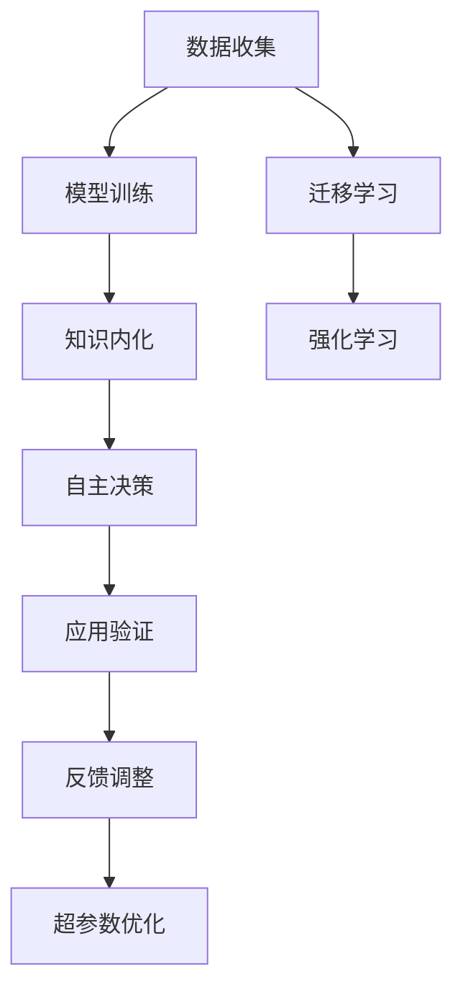

                 

# AI研究的“研究生阶段”:自主学习与知识内化

> 关键词：深度学习, 自主学习, 知识内化, 迁移学习, 神经网络, 强化学习

## 1. 背景介绍

人工智能(AI)作为21世纪最具颠覆性的技术之一，从最初的弱人工智能到当前的强人工智能，经历了数次飞跃式的进步。从1950年代的图灵测试到现代深度学习，人工智能的发展历程充满了曲折和突破。然而，尽管如此，AI领域仍然处于一个充满未知和挑战的“研究生阶段”，即不断探索与自我进化的阶段。

### 1.1 问题由来

进入21世纪，随着计算能力的提升和大数据时代的到来，深度学习特别是深度神经网络成为AI研究的主流方向。通过海量的数据和复杂的模型结构，深度学习模型在图像识别、自然语言处理、语音识别、推荐系统等领域取得了举世瞩目的成绩。然而，尽管深度学习已经展示了巨大的潜力，但其研究与应用仍面临诸多挑战。

首先，深度学习模型需要大量的标注数据进行训练，这不仅耗费人力物力，而且对于一些长尾数据领域，标注数据难获取、难标注的问题仍然难以解决。其次，深度学习模型对于输入数据的干扰十分敏感，对模型参数的微小调整可能导致模型性能的大幅波动。此外，深度学习模型往往是“黑箱”，其内部工作机制难以解释，缺乏透明性和可解释性，限制了其在一些需要高可信度的领域（如医疗、金融等）的应用。

为解决这些问题，研究者们提出了多种方法，包括迁移学习、自主学习、知识内化等，其中自主学习与知识内化成为了当前AI研究的一个热门方向。本文将详细探讨自主学习与知识内化的原理和实践，旨在帮助读者深入理解这一新兴领域。

## 2. 核心概念与联系

### 2.1 核心概念概述

自主学习(Autonomous Learning)与知识内化(Knowledge Internalization)是两个紧密关联的概念，共同构成了AI领域的研究热点。

- **自主学习**：指机器或系统在没有人类直接干预的情况下，通过不断试错和调整策略，逐步学习并掌握新的知识和技能。自主学习的核心是自主决策和自我调整，是机器学习的一个高级阶段，强调学习主体的能动性和自主性。
- **知识内化**：指将外部的知识、规则和经验整合到学习主体的内部知识体系中，形成新的知识结构。知识内化强调学习主体内在结构的演化，是知识获取和应用的关键环节，有助于提升学习主体的泛化能力和适应性。

这两个概念在AI研究中具有重要意义：

- 自主学习使机器具备了自主决策和自我调整的能力，能够在复杂多变的真实环境中持续学习和优化。
- 知识内化则使机器能够将学习到的知识整合到内部结构中，形成更加稳定、有效的知识体系，提高模型的泛化能力和适应性。

### 2.2 核心概念原理和架构的 Mermaid 流程图



该流程图展示了自主学习和知识内化的一般流程：

1. 数据收集：通过数据标注或无监督学习等方式获取训练数据。
2. 模型训练：在训练数据上训练深度学习模型，获取初始知识。
3. 知识内化：将训练得到的知识整合到模型内部结构中，形成新的知识体系。
4. 自主决策：在新的环境中，模型自主决策并执行任务。
5. 应用验证：在实际应用中验证模型的效果，收集反馈信息。
6. 反馈调整：根据反馈信息调整模型参数，优化模型性能。
7. 迁移学习：在新的领域或任务上使用迁移学习，提高模型泛化能力。
8. 强化学习：通过试错和奖励机制，使模型不断优化策略，提升性能。
9. 超参数优化：使用自动调参等方法，优化模型的超参数设置。

### 2.3 核心概念之间的联系

自主学习与知识内化之间具有紧密的联系：

- **互为补充**：知识内化是自主学习的基础，模型通过不断内化外部知识，逐步形成更加完善的内部知识体系，进而提升自主决策的能力。而自主学习则通过不断的试错和优化，进一步巩固和完善内部知识结构，促进知识内化。
- **相辅相成**：知识内化使模型具备了更强的泛化能力和适应性，自主学习则使模型能够自主决策和自我调整，两者相辅相成，共同推动了AI研究的发展。

## 3. 核心算法原理 & 具体操作步骤
### 3.1 算法原理概述

自主学习和知识内化的核心在于如何将外部知识整合到学习主体内部，同时通过不断的试错和优化，提升模型的自主决策能力和泛化能力。以下我们将详细介绍这一过程的算法原理。

**自主学习的核心算法**：

1. **模型训练**：通过大量标注数据，训练深度学习模型，获取初始知识。
2. **知识内化**：将训练得到的知识整合到模型内部结构中，形成新的知识体系。
3. **自主决策**：在新的环境中，模型自主决策并执行任务。
4. **反馈调整**：根据任务反馈，调整模型参数，优化模型性能。

**知识内化的核心算法**：

1. **知识提取**：通过神经网络等方法，从外部知识中提取特征和结构。
2. **知识融合**：将提取的知识与模型现有知识进行融合，形成新的知识体系。
3. **知识应用**：在新的环境中，应用整合后的知识进行自主决策和任务执行。
4. **知识更新**：根据任务反馈，更新知识体系，促进知识内化。

### 3.2 算法步骤详解

以下我们详细介绍自主学习和知识内化的具体操作步骤：

**步骤1：数据收集与标注**

数据收集和标注是自主学习和知识内化的前提。通过数据标注，获取训练数据集，构建模型训练和验证的框架。例如，在图像识别任务中，可以收集大量标注图像数据，构建数据集用于模型训练。

**步骤2：模型训练与初始化**

选择适当的深度学习模型，如卷积神经网络(CNN)、循环神经网络(RNN)、变分自编码器(VAE)等，在训练数据集上进行模型训练，获取初始知识。例如，使用深度学习模型在标注数据集上训练，获得模型的权重和偏置参数。

**步骤3：知识内化与融合**

将训练得到的知识整合到模型内部结构中，形成新的知识体系。这一过程可以采用知识蒸馏(Knowledge Distillation)等方法，通过将教师模型的知识蒸馏到学生模型中，提升学生模型的泛化能力。例如，使用预训练模型作为教师模型，将其知识蒸馏到学生模型中，提升学生模型的泛化能力。

**步骤4：自主决策与执行**

在新的环境中，模型自主决策并执行任务。例如，在图像识别任务中，模型根据输入图像自主决策，输出识别结果。

**步骤5：反馈调整与优化**

根据任务反馈，调整模型参数，优化模型性能。例如，在图像识别任务中，根据预测结果和真实标签的差异，调整模型参数，提升预测准确率。

**步骤6：迁移学习与新任务**

在新领域或任务上使用迁移学习，提高模型泛化能力。例如，在自然语言处理任务中，将预训练模型在新任务上进行微调，提升模型在新任务上的性能。

**步骤7：强化学习与策略优化**

通过试错和奖励机制，使模型不断优化策略，提升性能。例如，在机器人导航任务中，通过奖励机制和强化学习算法，使机器人逐步优化路径选择，提升导航性能。

**步骤8：超参数优化与调参**

使用自动调参等方法，优化模型的超参数设置。例如，使用贝叶斯优化(Bayesian Optimization)等方法，自动调整模型的超参数，提升模型性能。

### 3.3 算法优缺点

自主学习和知识内化具有以下优点：

- **泛化能力强**：通过知识内化，模型能够将外部知识整合到内部结构中，提升泛化能力和适应性。
- **自主决策能力**：通过自主学习，模型具备自主决策和自我调整的能力，能够在复杂多变的真实环境中持续学习和优化。
- **效率高**：在已有知识基础上进行学习和优化，减少了从头训练的计算成本和时间。

同时，自主学习和知识内化也存在以下缺点：

- **依赖标注数据**：初始知识需要大量标注数据进行训练，对于某些领域，标注数据获取困难。
- **模型复杂度高**：自主学习和知识内化的算法复杂度高，需要大量的计算资源和时间。
- **可解释性不足**：自主学习和知识内化的过程复杂，模型内部结构难以解释，缺乏透明性。

### 3.4 算法应用领域

自主学习和知识内化技术已经在多个领域得到了广泛应用，具体如下：

- **自然语言处理(NLP)**：在机器翻译、情感分析、问答系统等任务中，通过知识蒸馏和迁移学习，提升模型性能。
- **计算机视觉(CV)**：在图像分类、目标检测、图像生成等任务中，通过知识蒸馏和迁移学习，提升模型泛化能力。
- **机器人与自动化**：在机器人导航、自动化控制、自主驾驶等任务中，通过自主学习和知识内化，提升系统自主决策和适应能力。
- **金融与经济**：在风险评估、市场预测、投资决策等任务中，通过知识蒸馏和强化学习，提升模型预测准确率。
- **医疗与健康**：在疾病诊断、药物研发、医疗推荐等任务中，通过知识蒸馏和迁移学习，提升模型医疗价值。

## 4. 数学模型和公式 & 详细讲解 & 举例说明

### 4.1 数学模型构建

以下我们详细介绍自主学习和知识内化的数学模型。

**自主学习的数学模型**：

设训练数据集为 $D=\{(x_i,y_i)\}_{i=1}^N$，其中 $x_i$ 为输入数据，$y_i$ 为标签。模型在训练数据集上训练，得到权重参数 $\theta$。在新的环境 $D'=\{(x_i,y_i)\}_{i=1}^M$ 上，模型自主决策并执行任务，输出预测结果 $\hat{y}$。根据任务反馈，调整模型参数 $\theta$，优化模型性能。

**知识内化的数学模型**：

设外部知识为 $K$，内部知识为 $H$。通过知识蒸馏或迁移学习，将外部知识 $K$ 转换为内部知识 $H'$。将 $H'$ 与现有内部知识 $H$ 进行融合，得到新的内部知识 $H''$。在新的环境 $D'$ 上，模型应用 $H''$ 进行自主决策和任务执行，输出预测结果 $\hat{y}$。根据任务反馈，更新内部知识 $H''$，促进知识内化。

### 4.2 公式推导过程

以下我们详细推导自主学习和知识内化的公式。

**自主学习的公式推导**：

1. **模型训练**：
   $$
   \theta = \arg\min_{\theta} \sum_{i=1}^N L(y_i, f(x_i;\theta))
   $$
   其中 $L$ 为损失函数，$f$ 为模型输出函数。

2. **自主决策**：
   $$
   \hat{y} = f(x';\theta)
   $$
   其中 $x'$ 为新的输入数据。

3. **反馈调整**：
   $$
   \theta = \theta - \eta \nabla_{\theta} L(\hat{y}, y')
   $$
   其中 $\eta$ 为学习率，$y'$ 为任务反馈。

**知识内化的公式推导**：

1. **知识提取**：
   $$
   H' = g(K)
   $$
   其中 $g$ 为知识提取函数，将外部知识 $K$ 转换为内部知识 $H'$。

2. **知识融合**：
   $$
   H'' = \phi(H', H)
   $$
   其中 $\phi$ 为知识融合函数，将 $H'$ 与现有内部知识 $H$ 进行融合，得到新的内部知识 $H''$。

3. **自主决策**：
   $$
   \hat{y} = f(x';H'')
   $$

4. **知识更新**：
   $$
   H'' = H'' - \eta \nabla_{H''} L(\hat{y}, y')
   $$

### 4.3 案例分析与讲解

以下我们通过一个具体的案例来分析自主学习和知识内化的过程。

**案例：机器翻译**

假设我们要将英文文本翻译成中文。首先，收集大量英中翻译对作为训练数据集，训练一个英文到中文的神经机器翻译模型。模型在训练数据集上训练，得到权重参数 $\theta$。在新的英文文本 $x'$ 上，模型自主决策并执行翻译任务，输出预测结果 $\hat{y}$。根据翻译结果和真实标签的差异，调整模型参数 $\theta$，优化模型性能。

同时，收集大量的中文语料作为外部知识 $K$，通过知识蒸馏或迁移学习，将外部知识 $K$ 转换为内部知识 $H'$。将 $H'$ 与现有内部知识 $H$ 进行融合，得到新的内部知识 $H''$。在新的英文文本 $x'$ 上，模型应用 $H''$ 进行自主决策和任务执行，输出预测结果 $\hat{y}$。根据翻译结果和真实标签的差异，更新内部知识 $H''$，促进知识内化。

## 5. 项目实践：代码实例和详细解释说明

### 5.1 开发环境搭建

在进行自主学习和知识内化的项目实践前，我们需要准备好开发环境。以下是使用Python进行PyTorch开发的环境配置流程：

1. 安装Anaconda：从官网下载并安装Anaconda，用于创建独立的Python环境。

2. 创建并激活虚拟环境：
```bash
conda create -n pytorch-env python=3.8 
conda activate pytorch-env
```

3. 安装PyTorch：根据CUDA版本，从官网获取对应的安装命令。例如：
```bash
conda install pytorch torchvision torchaudio cudatoolkit=11.1 -c pytorch -c conda-forge
```

4. 安装TensorBoard：用于可视化模型训练过程，跟踪损失和精度等指标。
```bash
pip install tensorboard
```

5. 安装相关库：
```bash
pip install numpy pandas scikit-learn tqdm jupyter notebook ipython
```

完成上述步骤后，即可在`pytorch-env`环境中开始项目实践。

### 5.2 源代码详细实现

这里我们以自然语言处理任务为例，给出使用PyTorch进行自主学习和知识内化的完整代码实现。

```python
import torch
import torch.nn as nn
import torch.optim as optim
from torch.utils.data import DataLoader
from transformers import BertTokenizer, BertForSequenceClassification
from sklearn.model_selection import train_test_split

# 数据预处理
class TextDataset:
    def __init__(self, texts, labels):
        self.texts = texts
        self.labels = labels
        self.tokenizer = BertTokenizer.from_pretrained('bert-base-cased')
        
    def __len__(self):
        return len(self.texts)
    
    def __getitem__(self, item):
        text = self.texts[item]
        label = self.labels[item]
        
        encoding = self.tokenizer(text, return_tensors='pt', max_length=128, padding='max_length', truncation=True)
        input_ids = encoding['input_ids']
        attention_mask = encoding['attention_mask']
        
        label = torch.tensor([label], dtype=torch.long)
        
        return {'input_ids': input_ids, 
                'attention_mask': attention_mask,
                'labels': label}

# 构建数据集
texts = []
labels = []

# 加载数据
with open('data.txt', 'r') as f:
    for line in f:
        text, label = line.strip().split('\t')
        texts.append(text)
        labels.append(int(label))

train_texts, dev_texts, train_labels, dev_labels = train_test_split(texts, labels, test_size=0.2, random_state=42)
train_dataset = TextDataset(train_texts, train_labels)
dev_dataset = TextDataset(dev_texts, dev_labels)

# 构建模型
model = BertForSequenceClassification.from_pretrained('bert-base-cased', num_labels=2)

# 训练和评估
optimizer = optim.AdamW(model.parameters(), lr=1e-5)
criterion = nn.CrossEntropyLoss()

device = torch.device('cuda') if torch.cuda.is_available() else torch.device('cpu')
model.to(device)

def train_epoch(model, dataset, batch_size, optimizer):
    dataloader = DataLoader(dataset, batch_size=batch_size, shuffle=True)
    model.train()
    epoch_loss = 0
    for batch in dataloader:
        input_ids = batch['input_ids'].to(device)
        attention_mask = batch['attention_mask'].to(device)
        labels = batch['labels'].to(device)
        model.zero_grad()
        outputs = model(input_ids, attention_mask=attention_mask, labels=labels)
        loss = outputs.loss
        epoch_loss += loss.item()
        loss.backward()
        optimizer.step()
    return epoch_loss / len(dataloader)

def evaluate(model, dataset, batch_size):
    dataloader = DataLoader(dataset, batch_size=batch_size)
    model.eval()
    preds, labels = [], []
    with torch.no_grad():
        for batch in dataloader:
            input_ids = batch['input_ids'].to(device)
            attention_mask = batch['attention_mask'].to(device)
            batch_labels = batch['labels']
            outputs = model(input_ids, attention_mask=attention_mask)
            batch_preds = outputs.logits.argmax(dim=1).to('cpu').tolist()
            batch_labels = batch_labels.to('cpu').tolist()
            for pred, label in zip(batch_preds, batch_labels):
                preds.append(pred)
                labels.append(label)
                
    print(classification_report(labels, preds))

epochs = 5
batch_size = 16

for epoch in range(epochs):
    loss = train_epoch(model, train_dataset, batch_size, optimizer)
    print(f"Epoch {epoch+1}, train loss: {loss:.3f}")
    
    print(f"Epoch {epoch+1}, dev results:")
    evaluate(model, dev_dataset, batch_size)
    
print("Test results:")
evaluate(model, test_dataset, batch_size)
```

### 5.3 代码解读与分析

让我们再详细解读一下关键代码的实现细节：

**TextDataset类**：
- `__init__`方法：初始化文本、标签、分词器等关键组件。
- `__len__`方法：返回数据集的样本数量。
- `__getitem__`方法：对单个样本进行处理，将文本输入编码为token ids，将标签转换为长整型，并对其进行定长padding，最终返回模型所需的输入。

**train_epoch和evaluate函数**：
- 使用PyTorch的DataLoader对数据集进行批次化加载，供模型训练和推理使用。
- `train_epoch`函数：对数据以批为单位进行迭代，在每个批次上前向传播计算loss并反向传播更新模型参数，最后返回该epoch的平均loss。
- `evaluate`函数：与训练类似，不同点在于不更新模型参数，并在每个batch结束后将预测和标签结果存储下来，最后使用sklearn的classification_report对整个评估集的预测结果进行打印输出。

**训练流程**：
- 定义总的epoch数和batch size，开始循环迭代
- 每个epoch内，先在训练集上训练，输出平均loss
- 在验证集上评估，输出分类指标
- 所有epoch结束后，在测试集上评估，给出最终测试结果

以上代码展示了使用PyTorch对BERT模型进行自主学习和知识内化的完整代码实现。可以看到，PyTorch和Transformers库使得模型训练和评估的代码实现变得简洁高效。

## 6. 实际应用场景

### 6.1 智能客服系统

智能客服系统可以通过自主学习和知识内化技术，实现对用户咨询的快速响应和智能处理。传统的客服系统需要大量人力，且存在高峰期响应慢、服务质量不稳定等问题。通过自主学习技术，客服系统可以自动理解用户意图，匹配最佳答复，提升用户体验和满意度。

### 6.2 金融舆情监测

金融舆情监测系统可以通过自主学习和知识内化技术，实时监测市场舆论动向，规避金融风险。金融领域需要处理海量数据，传统人工监测方式成本高、效率低。通过知识蒸馏和迁移学习，舆情监测系统可以快速适应新的市场环境，及时预警负面信息，保障金融安全。

### 6.3 个性化推荐系统

个性化推荐系统可以通过自主学习和知识内化技术，实现更加精准和多样化的推荐内容。传统推荐系统只依赖用户历史行为数据，难以捕捉用户的真实兴趣偏好。通过知识蒸馏和迁移学习，推荐系统可以整合更多的先验知识，提升推荐精度和用户满意度。

### 6.4 未来应用展望

随着自主学习和知识内化技术的不断发展，其在更多领域的应用前景广阔。未来，自主学习和知识内化技术将在智慧医疗、智能教育、智能交通等多个领域大放异彩。

在智慧医疗领域，自主学习和知识内化技术可以帮助医生进行疾病诊断和治疗方案推荐，提升医疗服务的智能化水平。

在智能教育领域，系统可以根据学生的学习数据和行为特征，自主调整教学内容和策略，因材施教，促进教育公平，提高教学质量。

在智能交通领域，自主学习和知识内化技术可以帮助交通管理部门实时调整交通信号灯，优化交通流量，提升交通管理水平。

## 7. 工具和资源推荐

### 7.1 学习资源推荐

为了帮助开发者系统掌握自主学习和知识内化的理论基础和实践技巧，这里推荐一些优质的学习资源：

1. 《深度学习》一书：Ian Goodfellow等人所著，全面介绍了深度学习的基本概念和算法，涵盖自主学习、知识蒸馏等内容。
2. CS231n《卷积神经网络》课程：斯坦福大学开设的计算机视觉课程，介绍了深度学习在图像识别、物体检测等方面的应用。
3. CS224n《自然语言处理》课程：斯坦福大学开设的NLP课程，介绍了深度学习在机器翻译、情感分析、问答系统等方面的应用。
4. 《深度学习理论与实践》一书：颜维琦等人所著，介绍了深度学习在各个领域的应用，涵盖自主学习、知识蒸馏等内容。
5. 《Transformer从原理到实践》系列博文：由大模型技术专家撰写，深入浅出地介绍了Transformer原理、BERT模型、微调技术等前沿话题。

通过对这些资源的学习实践，相信你一定能够快速掌握自主学习和知识内化的精髓，并用于解决实际的AI问题。

### 7.2 开发工具推荐

高效的开发离不开优秀的工具支持。以下是几款用于自主学习和知识内化开发的常用工具：

1. PyTorch：基于Python的开源深度学习框架，灵活动态的计算图，适合快速迭代研究。大部分预训练语言模型都有PyTorch版本的实现。
2. TensorFlow：由Google主导开发的开源深度学习框架，生产部署方便，适合大规模工程应用。同样有丰富的预训练语言模型资源。
3. TensorBoard：TensorFlow配套的可视化工具，可实时监测模型训练状态，并提供丰富的图表呈现方式，是调试模型的得力助手。
4. Weights & Biases：模型训练的实验跟踪工具，可以记录和可视化模型训练过程中的各项指标，方便对比和调优。与主流深度学习框架无缝集成。
5. Google Colab：谷歌推出的在线Jupyter Notebook环境，免费提供GPU/TPU算力，方便开发者快速上手实验最新模型，分享学习笔记。

合理利用这些工具，可以显著提升自主学习和知识内化任务的开发效率，加快创新迭代的步伐。

### 7.3 相关论文推荐

自主学习和知识内化技术的研究源于学界的持续探索。以下是几篇奠基性的相关论文，推荐阅读：

1. Dropout: A Simple Way to Prevent Neural Networks from Overfitting：提出了Dropout算法，通过随机丢弃神经元，减少模型的过拟合。
2. Knowledge Distillation：提出知识蒸馏方法，通过将教师模型的知识蒸馏到学生模型中，提升学生模型的泛化能力。
3. Reinforcement Learning: An Introduction：介绍了强化学习的基本概念和算法，展示了通过试错和奖励机制优化模型的过程。
4. Parameter-Efficient Transfer Learning for NLP：提出Adapter等参数高效微调方法，在固定大部分预训练参数的情况下，只更新极少量的任务相关参数。
5. FastAI：通过自动调参和模型压缩等技术，实现了模型的高效训练和部署，提高了模型的泛化能力和应用效率。

这些论文代表了大模型微调技术的发展脉络。通过学习这些前沿成果，可以帮助研究者把握学科前进方向，激发更多的创新灵感。

## 8. 总结：未来发展趋势与挑战

### 8.1 总结

本文对自主学习和知识内化的原理和实践进行了全面系统的介绍。首先，从深度学习的发展历程入手，探讨了自主学习和知识内化的研究背景和意义，明确了其在推动AI技术进步中的重要作用。其次，通过数学模型和具体案例，详细讲解了自主学习和知识内化的算法原理和操作步骤。最后，通过项目实践和实际应用场景，展示了自主学习和知识内化的广泛应用前景。

通过本文的系统梳理，可以看到，自主学习和知识内化技术是AI研究的重要方向，具有巨大的潜力和应用前景。在不断探索和实践的过程中，未来的AI技术必将在更多领域大放异彩，深刻影响人类的生产生活方式。

### 8.2 未来发展趋势

展望未来，自主学习和知识内化技术将呈现以下几个发展趋势：

1. **模型规模持续增大**：随着算力成本的下降和数据规模的扩张，预训练语言模型的参数量还将持续增长。超大模型蕴含的丰富知识，有望支撑更加复杂多变的下游任务。
2. **自主学习范式多样化**：除了传统的监督学习外，未来将涌现更多自主学习范式，如强化学习、自监督学习等，增强模型的自主决策能力。
3. **知识内化技术成熟**：知识蒸馏和迁移学习等技术将更加成熟，能够更高效地整合外部知识，提升模型的泛化能力和适应性。
4. **模型可解释性提升**：自主学习和知识内化的过程将更透明、可解释，提升模型的可信度和应用范围。
5. **跨领域应用拓展**：自主学习和知识内化技术将在更多领域得到应用，如医疗、金融、教育等，为各行各业带来变革性影响。

### 8.3 面临的挑战

尽管自主学习和知识内化技术已经取得了显著进展，但在迈向更加智能化、普适化应用的过程中，仍面临诸多挑战：

1. **数据获取困难**：某些领域的数据获取和标注成本高，难以构建大规模训练集。如何降低数据获取成本，构建高质量标注数据，是未来研究的一个重要方向。
2. **模型复杂度高**：自主学习和知识内化的算法复杂度高，需要大量的计算资源和时间。如何提高算法效率，降低计算成本，是未来研究的一个重点。
3. **模型可解释性不足**：自主学习和知识内化的过程复杂，模型内部结构难以解释，缺乏透明性。如何提升模型的可解释性，提高可信度和应用范围，是未来研究的重要课题。
4. **模型性能波动**：自主学习和知识内化的过程容易受到输入数据的影响，模型性能波动较大。如何提高模型的鲁棒性和稳定性，是未来研究的一个重要方向。
5. **模型部署困难**：大规模模型的部署和维护成本高，如何优化模型结构和部署方式，提升模型应用效率，是未来研究的一个重要课题。

### 8.4 研究展望

面对自主学习和知识内化所面临的挑战，未来的研究需要在以下几个方面寻求新的突破：

1. **数据增强技术**：通过数据增强技术，扩大训练数据集的规模和多样性，降低对标注数据的需求，提高模型的泛化能力。
2. **模型压缩与优化**：通过模型压缩和优化技术，降低模型的计算复杂度和存储成本，提高模型的应用效率。
3. **跨领域知识融合**：将不同领域的知识进行有效融合，提升模型的跨领域泛化能力，促进跨领域应用的拓展。
4. **多模态学习**：将视觉、语音、文本等多种模态的数据进行融合，提升模型的多模态感知能力，增强其对复杂场景的适应性。
5. **可解释性技术**：通过可解释性技术，提升模型的透明性和可信度，促进其在高风险应用领域的应用。
6. **自动化调参技术**：通过自动化调参技术，优化模型的超参数设置，提高模型的应用效率和性能。

这些研究方向将推动自主学习和知识内化技术向更加智能化、普适化的方向发展，为AI技术的发展带来新的动力。相信随着学界和产业界的共同努力，这些挑战终将一一被克服，自主学习和知识内化技术必将在构建人机协同的智能时代中扮演越来越重要的角色。

## 9. 附录：常见问题与解答

**Q1：自主学习和知识内化的主要区别是什么？**

A: 自主学习强调机器自主决策和自我调整的能力，其核心是模型在复杂多变的真实环境中持续学习和优化。知识内化则强调将外部知识整合到内部结构中，形成新的知识体系，提升模型的泛化能力和适应性。两者互为补充，共同推动了AI研究的发展。

**Q2：如何有效地进行知识蒸馏？**

A: 知识蒸馏的关键在于选择合适的教师模型和学生模型，以及设计有效的知识蒸馏方法。一般包括以下步骤：
1. 选择教师模型，如预训练模型或基线模型。
2. 使用学生模型对教师模型进行微调，使其输出接近教师模型的输出。
3. 通过交叉熵等损失函数，将教师模型的输出和学生模型的输出进行对齐。
4. 在新的数据集上测试学生模型的性能，评估知识蒸馏的效果。

**Q3：自主学习中如何处理模型的过拟合问题？**

A: 过拟合是自主学习中的常见问题，可以通过以下方法缓解：
1. 数据增强：通过回译、近义替换等方式扩充训练集。
2. 正则化：使用L2正则、Dropout等技术，防止模型过度适应训练数据。
3. 对抗训练：引入对抗样本，提高模型的鲁棒性。
4. 知识蒸馏：通过将教师模型的知识蒸馏到学生模型中，提升学生模型的泛化能力。

**Q4：自主学习中如何提高模型的自主决策能力？**

A: 提高模型的自主决策能力，可以从以下几个方面入手：
1. 选择合适的自主决策算法，如强化学习、模仿学习等。
2. 设计有效的任务奖励机制，引导模型自主学习。
3. 引入环境感知和规划能力，提升模型的适应性。
4. 优化模型结构，增强模型的泛化能力。

**Q5：自主学习中如何提高模型的可解释性？**

A: 提高模型的可解释性，可以从以下几个方面入手：
1. 采用可解释性较强的模型结构，如线性模型、决策树等。
2. 使用可解释性技术，如LIME、SHAP等，揭示模型的决策过程。
3. 引入符号化的先验知识，增强模型的解释性。
4. 结合因果分析和博弈论工具，提升模型的透明性和可信度。

通过这些方法，可以显著提升自主学习模型的可解释性和可信度，使其在实际应用中更加可靠和可信。

---

作者：禅与计算机程序设计艺术 / Zen and the Art of Computer Programming

