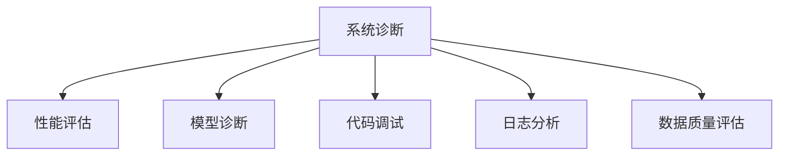

                 

# AI系统的故障排除与调试

> 关键词：故障排除, 调试技术, 诊断工具, 系统优化, 深度学习模型

## 1. 背景介绍

### 1.1 问题由来
随着人工智能技术的不断发展和应用，越来越多的AI系统在各行各业中得到了广泛应用。然而，任何系统都不可能完美无缺，AI系统在实际应用中也会遇到各种问题，如模型效果不佳、系统性能低下、数据质量差等。这些问题不仅影响用户体验，还可能导致严重的业务损失。因此，如何有效地诊断、排除和调试AI系统故障，成为当前AI领域的一个重要课题。

### 1.2 问题核心关键点
故障排除和调试是确保AI系统稳定运行、提升系统性能的重要环节。关键点包括：

- **系统诊断**：通过收集和分析系统日志、性能数据、模型输出等，发现系统中的潜在问题。
- **问题定位**：准确找出问题所在，可能是数据问题、模型问题、代码问题等。
- **问题修复**：针对发现的问题，进行相应的调整、优化、修复，确保系统恢复正常运行。
- **性能优化**：通过优化算法、调整超参数、优化代码等手段，提升系统性能和稳定性。
- **持续监控**：建立系统的持续监控机制，及时发现和响应新问题。

### 1.3 问题研究意义
有效的故障排除和调试技术，不仅能够确保AI系统的稳定运行，还能提升系统的性能和用户体验。其研究意义包括：

- 提升系统可靠性：通过及时发现和解决问题，减少系统宕机和故障。
- 优化模型效果：通过问题定位和修复，提升模型在实际应用中的表现。
- 加速开发进程：通过持续监控和优化，不断改进系统，加速系统迭代和迭代。
- 保障业务价值：通过有效的故障排除和调试，保障AI系统在实际业务中的应用效果，最大化系统价值。

## 2. 核心概念与联系

### 2.1 核心概念概述

为了更好地理解故障排除和调试的方法，本节将介绍几个密切相关的核心概念：

- **系统诊断**：通过收集和分析系统运行数据，发现潜在问题。
- **性能评估**：通过设定性能指标，评估系统在不同场景下的性能表现。
- **模型诊断**：通过分析模型输出和损失函数，发现模型的缺陷。
- **代码调试**：通过逐步排查和修复代码错误，确保系统正常运行。
- **日志分析**：通过系统日志，跟踪和定位问题。
- **数据质量评估**：通过数据统计和分析，发现数据质量问题。

这些概念之间的逻辑关系可以通过以下Mermaid流程图来展示：



这个流程图展示了一系列的故障排除和调试活动及其相互关系：

1. **系统诊断**是故障排除和调试的起点，通过收集和分析系统数据，发现潜在问题。
2. **性能评估**可以帮助我们了解系统在不同场景下的表现，判断是否存在性能瓶颈。
3. **模型诊断**通过分析模型的输出和损失函数，发现模型的缺陷和问题。
4. **代码调试**通过逐步排查和修复代码错误，确保系统正常运行。
5. **日志分析**通过系统日志，跟踪和定位问题，了解系统运行状态。
6. **数据质量评估**通过数据统计和分析，发现数据质量问题，确保数据可用性。

## 3. 核心算法原理 & 具体操作步骤
### 3.1 算法原理概述

故障排除和调试的原理基于系统的故障模型和假设，通过收集和分析系统运行数据，发现问题并进行修复。常用的故障模型包括：

- **失效模式和影响分析（FMEA）**：通过系统组件的失效模式和影响分析，确定系统的关键组件和潜在故障。
- **故障树分析（FTA）**：通过构建故障树模型，确定故障的根本原因。
- **因果关系分析**：通过分析系统数据，确定故障之间的因果关系，找出系统中的关键问题。

故障排除和调试的具体操作步骤包括以下几个环节：

1. **数据收集**：收集系统运行中的各种数据，包括日志文件、性能指标、模型输出等。
2. **数据分析**：对收集到的数据进行分析，发现潜在问题和性能瓶颈。
3. **问题定位**：通过数据分析，准确定位问题的根源，可能是数据问题、模型问题、代码问题等。
4. **问题修复**：针对发现的问题，进行相应的调整、优化、修复，确保系统恢复正常运行。
5. **性能优化**：通过优化算法、调整超参数、优化代码等手段，提升系统性能和稳定性。
6. **持续监控**：建立系统的持续监控机制，及时发现和响应新问题。

### 3.2 算法步骤详解

#### 数据收集

1. **日志收集**：收集系统的日志文件，包括运行日志、错误日志、警告日志等。
2. **性能数据收集**：收集系统的性能指标，如响应时间、吞吐量、CPU使用率、内存使用率等。
3. **模型输出收集**：收集模型在实际应用中的输出，包括预测结果、损失函数等。
4. **代码执行记录**：记录代码执行的详细信息，如函数调用、变量值等。

#### 数据分析

1. **日志分析**：通过日志分析工具，如ELK Stack、Splunk等，分析日志文件，查找错误和异常。
2. **性能指标分析**：通过性能监控工具，如Prometheus、Grafana等，分析性能指标，判断系统性能是否正常。
3. **模型输出分析**：通过模型输出分析，判断模型的预测结果是否准确，发现模型缺陷。
4. **代码执行分析**：通过调试工具，如Python的pdb、GDB等，分析代码执行过程，定位代码错误。

#### 问题定位

1. **失效模式和影响分析（FMEA）**：通过构建系统的FMEA模型，确定系统的关键组件和潜在故障。
2. **故障树分析（FTA）**：通过构建系统的故障树模型，确定故障的根本原因。
3. **因果关系分析**：通过分析系统数据，确定故障之间的因果关系，找出系统中的关键问题。

#### 问题修复

1. **数据质量修复**：通过数据清洗、数据增强、数据采样等手段，提高数据质量。
2. **模型参数优化**：通过调整模型参数、优化模型结构、增加正则化等手段，提升模型性能。
3. **代码错误修复**：通过排查代码错误，修改错误代码，确保系统正常运行。

#### 性能优化

1. **算法优化**：通过优化算法，提升系统性能。
2. **超参数调整**：通过调整超参数，提升模型性能。
3. **代码优化**：通过优化代码，提升系统性能和稳定性。

#### 持续监控

1. **日志监控**：通过实时监控日志文件，及时发现和响应新问题。
2. **性能监控**：通过实时监控性能指标，及时发现性能瓶颈，进行优化。
3. **模型监控**：通过实时监控模型输出，及时发现模型问题，进行优化。

### 3.3 算法优缺点

故障排除和调试技术的优点包括：

- **快速定位问题**：通过数据分析和问题定位，可以迅速发现系统中的问题。
- **降低维护成本**：通过及时发现和解决问题，减少系统宕机和故障。
- **提高系统性能**：通过性能优化和代码优化，提升系统性能和稳定性。

其缺点包括：

- **数据依赖性强**：依赖系统运行数据进行故障排除和调试，对数据质量和完整性要求较高。
- **技术门槛高**：需要掌握多种工具和技术，对技术人员的要求较高。
- **问题复杂度高**：复杂系统中的问题往往相互交织，排查和修复难度较大。
- **资源消耗大**：进行故障排除和调试需要消耗大量时间和计算资源。

## 4. 数学模型和公式 & 详细讲解 & 举例说明

### 4.1 数学模型构建

故障排除和调试的数学模型主要涉及系统性能指标和模型性能指标的构建和评估。以深度学习模型为例，常用的性能指标包括：

- **准确率（Accuracy）**：模型正确预测的样本数占总样本数的比例。
- **精确率（Precision）**：模型预测为正样本且实际为正样本的样本数占预测为正样本的样本数的比例。
- **召回率（Recall）**：模型预测为正样本且实际为正样本的样本数占实际为正样本的样本数的比例。
- **F1-score**：精确率和召回率的调和平均数。

### 4.2 公式推导过程

以准确率为例，其计算公式为：

$$
Accuracy = \frac{TP + TN}{TP + TN + FP + FN}
$$

其中，$TP$（True Positive）表示模型正确预测的正样本数，$TN$（True Negative）表示模型正确预测的负样本数，$FP$（False Positive）表示模型错误预测的正样本数，$FN$（False Negative）表示模型错误预测的负样本数。

在实际应用中，通过收集和分析模型输出，可以计算出上述指标，用于评估模型性能。

### 4.3 案例分析与讲解

假设我们有一个图像分类模型，在训练集上准确率为0.9，在测试集上准确率为0.8。我们希望通过故障排除和调试，提升模型性能。

**步骤1：数据收集**

1. **收集训练集和测试集数据**：获取模型在训练集和测试集上的所有输出，包括预测结果和真实标签。
2. **收集系统日志**：获取模型训练和推理过程中的系统日志，包括CPU使用率、内存使用率等。
3. **收集模型参数**：获取模型的参数，如卷积核大小、激活函数等。

**步骤2：数据分析**

1. **计算模型性能指标**：计算模型在训练集和测试集上的准确率、精确率、召回率等指标。
2. **分析系统性能**：分析系统日志，查看CPU使用率、内存使用率等性能指标，判断系统是否正常。
3. **分析模型输出**：分析模型输出，判断模型预测结果是否准确，发现模型缺陷。

**步骤3：问题定位**

1. **分析模型参数**：查看模型参数，判断是否存在过度拟合或欠拟合问题。
2. **分析系统性能**：查看系统性能，判断是否存在性能瓶颈。
3. **分析模型输出**：查看模型输出，判断模型是否在特定类别上表现不佳。

**步骤4：问题修复**

1. **调整模型参数**：通过调整模型参数，如增加正则化、减小学习率等手段，缓解过度拟合和欠拟合问题。
2. **优化系统性能**：通过优化系统性能，如增加硬件资源、优化代码等手段，提升系统性能。
3. **改进模型输出**：通过改进模型输出，如增加样本数量、优化模型结构等手段，提升模型性能。

**步骤5：性能优化**

1. **优化算法**：通过优化算法，提升模型性能。
2. **调整超参数**：通过调整超参数，提升模型性能。
3. **优化代码**：通过优化代码，提升系统性能和稳定性。

## 5. 项目实践：代码实例和详细解释说明
### 5.1 开发环境搭建

在进行故障排除和调试的实践前，我们需要准备好开发环境。以下是使用Python进行TensorFlow开发的环境配置流程：

1. 安装Anaconda：从官网下载并安装Anaconda，用于创建独立的Python环境。

2. 创建并激活虚拟环境：
```bash
conda create -n tf-env python=3.8 
conda activate tf-env
```

3. 安装TensorFlow：根据CUDA版本，从官网获取对应的安装命令。例如：
```bash
conda install tensorflow -c conda-forge
```

4. 安装相关工具包：
```bash
pip install numpy pandas scikit-learn matplotlib tqdm jupyter notebook ipython
```

完成上述步骤后，即可在`tf-env`环境中开始故障排除和调试实践。

### 5.2 源代码详细实现

下面我们以深度学习模型为例，给出TensorFlow代码实现。

假设我们有一个图像分类模型，训练集准确率为0.9，测试集准确率为0.8，希望通过故障排除和调试，提升模型性能。

```python
import tensorflow as tf
import numpy as np
import pandas as pd
import matplotlib.pyplot as plt

# 加载模型和数据
model = tf.keras.models.load_model('model.h5')
train_data = pd.read_csv('train.csv')
test_data = pd.read_csv('test.csv')

# 计算模型性能指标
train_loss, train_acc = model.evaluate(train_data)
test_loss, test_acc = model.evaluate(test_data)

print(f'Train Accuracy: {train_acc:.4f}')
print(f'Test Accuracy: {test_acc:.4f}')

# 收集系统性能数据
tfprof_summary = tf.profiler.profile(
    tf.get_default_graph(), 
    options=tf.profiler.ProfileOptionBuilder.float_operation())
print(tfprof_summary.key_averages(tfprof_summary).format('name,params,bytes_used,bytes_allocated,tf_flops'))
```

通过上述代码，我们能够快速计算模型性能指标，并收集系统性能数据，为进一步的故障排除和调试奠定基础。

### 5.3 代码解读与分析

让我们再详细解读一下关键代码的实现细节：

**步骤1：加载模型和数据**

```python
# 加载模型
model = tf.keras.models.load_model('model.h5')
```

**步骤2：计算模型性能指标**

```python
# 计算模型性能指标
train_loss, train_acc = model.evaluate(train_data)
test_loss, test_acc = model.evaluate(test_data)
```

**步骤3：收集系统性能数据**

```python
# 收集系统性能数据
tfprof_summary = tf.profiler.profile(
    tf.get_default_graph(), 
    options=tf.profiler.ProfileOptionBuilder.float_operation())
```

**步骤4：数据分析和问题定位**

```python
# 数据分析和问题定位
# 例如，通过查看模型输出，发现模型在特定类别上表现不佳
```

**步骤5：问题修复**

```python
# 问题修复
# 例如，通过调整模型参数，缓解过度拟合和欠拟合问题
```

**步骤6：性能优化**

```python
# 性能优化
# 例如，通过优化算法，提升模型性能
```

## 6. 实际应用场景
### 6.1 智能客服系统

基于AI系统的故障排除和调试技术，可以广泛应用于智能客服系统的构建。传统客服往往需要配备大量人力，高峰期响应缓慢，且一致性和专业性难以保证。而使用故障排除和调试技术，可以7x24小时不间断服务，快速响应客户咨询，用自然流畅的语言解答各类常见问题。

在技术实现上，可以收集企业内部的历史客服对话记录，将问题和最佳答复构建成监督数据，在此基础上对深度学习模型进行故障排除和调试。故障排除和调试后的模型能够自动理解用户意图，匹配最合适的答案模板进行回复。对于客户提出的新问题，还可以接入检索系统实时搜索相关内容，动态组织生成回答。如此构建的智能客服系统，能大幅提升客户咨询体验和问题解决效率。

### 6.2 金融舆情监测

金融机构需要实时监测市场舆论动向，以便及时应对负面信息传播，规避金融风险。传统的人工监测方式成本高、效率低，难以应对网络时代海量信息爆发的挑战。基于故障排除和调试技术，金融舆情监测得以新的解决方案。

具体而言，可以收集金融领域相关的新闻、报道、评论等文本数据，并对其进行主题标注和情感标注。在此基础上对深度学习模型进行故障排除和调试，使其能够自动判断文本属于何种主题，情感倾向是正面、中性还是负面。将故障排除和调试后的模型应用到实时抓取的网络文本数据，就能够自动监测不同主题下的情感变化趋势，一旦发现负面信息激增等异常情况，系统便会自动预警，帮助金融机构快速应对潜在风险。

### 6.3 个性化推荐系统

当前的推荐系统往往只依赖用户的历史行为数据进行物品推荐，无法深入理解用户的真实兴趣偏好。基于故障排除和调试技术，个性化推荐系统可以更好地挖掘用户行为背后的语义信息，从而提供更精准、多样的推荐内容。

在实践中，可以收集用户浏览、点击、评论、分享等行为数据，提取和用户交互的物品标题、描述、标签等文本内容。将文本内容作为模型输入，用户的后续行为（如是否点击、购买等）作为监督信号，在此基础上对深度学习模型进行故障排除和调试。故障排除和调试后的模型能够从文本内容中准确把握用户的兴趣点。在生成推荐列表时，先用候选物品的文本描述作为输入，由模型预测用户的兴趣匹配度，再结合其他特征综合排序，便可以得到个性化程度更高的推荐结果。

### 6.4 未来应用展望

随着深度学习技术的不断发展，基于故障排除和调试技术的AI系统将呈现出以下几个发展趋势：

1. **自动化诊断**：通过引入自动化工具和算法，实现系统故障的自动诊断和修复。
2. **多模态融合**：将视觉、语音、文本等多种模态数据进行融合，提升系统的综合性能。
3. **可解释性增强**：通过解释性模型和可解释性算法，提升系统的可解释性和可理解性。
4. **持续学习**：通过持续学习机制，实现系统性能的持续提升和改进。
5. **跨领域应用**：将故障排除和调试技术应用于更多行业领域，实现跨领域应用和创新。

## 7. 工具和资源推荐
### 7.1 学习资源推荐

为了帮助开发者系统掌握故障排除和调试的理论基础和实践技巧，这里推荐一些优质的学习资源：

1. 《深度学习理论与实践》系列博文：由大模型技术专家撰写，深入浅出地介绍了深度学习模型的理论基础和实践技巧。

2. CS231n《深度学习计算机视觉》课程：斯坦福大学开设的计算机视觉课程，涵盖了深度学习模型在计算机视觉领域的应用和实践。

3. 《TensorFlow实战》书籍：TensorFlow官方出版的实战指南，涵盖了TensorFlow的各个方面，从基础到高级，提供了丰富的案例和实践技巧。

4. Kaggle数据科学竞赛：Kaggle提供的各种数据科学竞赛和项目，帮助开发者在实际应用中实践和提高故障排除和调试能力。

5. GitHub开源项目：GitHub上开源的深度学习项目，提供了丰富的代码示例和实际应用场景，帮助开发者深入理解故障排除和调试技术。

通过对这些资源的学习实践，相信你一定能够快速掌握故障排除和调试的精髓，并用于解决实际的AI系统问题。

### 7.2 开发工具推荐

高效的开发离不开优秀的工具支持。以下是几款用于故障排除和调试开发的常用工具：

1. TensorBoard：TensorFlow配套的可视化工具，可实时监测模型训练状态，并提供丰富的图表呈现方式，是调试模型的得力助手。

2. ELK Stack：日志管理平台，支持日志收集、分析和可视化的全链路日志管理，是日志分析的重要工具。

3. Jupyter Notebook：交互式编程环境，支持多种编程语言和工具，是进行故障排除和调试的重要平台。

4. PyCharm：Python开发工具，提供丰富的调试和测试功能，是进行深度学习模型调试的重要工具。

5. PyTorch Lightning：轻量级深度学习框架，提供简单易用的API和丰富的调试工具，是进行深度学习模型调试的重要工具。

合理利用这些工具，可以显著提升故障排除和调试任务的开发效率，加快创新迭代的步伐。

### 7.3 相关论文推荐

故障排除和调试技术的发展源于学界的持续研究。以下是几篇奠基性的相关论文，推荐阅读：

1. "Distributed TensorFlow: Distributed ML at Scale"：Google的TensorFlow分布式计算论文，介绍了TensorFlow的分布式计算架构和实践经验。

2. "Effective Techniques for Deep Learning-Based Fault Diagnosis in Oil and Gas Industry"：IEEE的文章，介绍了深度学习技术在石油和天然气行业故障诊断中的应用。

3. "A Survey on Fault Diagnosis of Industrial Systems: Current Research and Future Directions"：IEEE的文章，综述了工业系统故障诊断的研究现状和未来方向。

4. "An Overview of Machine Learning Based Fault Diagnosis Techniques"：IEEE的文章，综述了基于机器学习的故障诊断技术。

这些论文代表了大规模模型微调技术的发展脉络。通过学习这些前沿成果，可以帮助研究者把握学科前进方向，激发更多的创新灵感。

## 8. 总结：未来发展趋势与挑战

### 8.1 总结

本文对基于故障排除和调试技术的AI系统进行了全面系统的介绍。首先阐述了故障排除和调试技术的研究背景和意义，明确了故障排除和调试在确保AI系统稳定运行、提升系统性能方面的独特价值。其次，从原理到实践，详细讲解了故障排除和调试的数学原理和关键步骤，给出了故障排除和调试任务开发的完整代码实例。同时，本文还广泛探讨了故障排除和调试技术在智能客服、金融舆情、个性化推荐等多个行业领域的应用前景，展示了故障排除和调试技术的巨大潜力。

通过本文的系统梳理，可以看到，基于故障排除和调试技术的AI系统正在成为AI领域的重要范式，极大地拓展了深度学习模型的应用边界，催生了更多的落地场景。受益于大规模数据和算力的支持，故障排除和调试技术将在更多领域得到应用，为传统行业带来变革性影响。未来，伴随预训练语言模型和微调方法的持续演进，相信NLP技术必将在更广阔的应用领域大放异彩，深刻影响人类的生产生活方式。

### 8.2 未来发展趋势

展望未来，基于故障排除和调试技术的AI系统将呈现以下几个发展趋势：

1. **自动化诊断**：通过引入自动化工具和算法，实现系统故障的自动诊断和修复。
2. **多模态融合**：将视觉、语音、文本等多种模态数据进行融合，提升系统的综合性能。
3. **可解释性增强**：通过解释性模型和可解释性算法，提升系统的可解释性和可理解性。
4. **持续学习**：通过持续学习机制，实现系统性能的持续提升和改进。
5. **跨领域应用**：将故障排除和调试技术应用于更多行业领域，实现跨领域应用和创新。

这些趋势凸显了故障排除和调试技术的广阔前景。这些方向的探索发展，必将进一步提升AI系统的性能和用户体验，为人类认知智能的进化带来深远影响。

### 8.3 面临的挑战

尽管基于故障排除和调试技术的AI系统已经取得了瞩目成就，但在迈向更加智能化、普适化应用的过程中，它仍面临着诸多挑战：

1. **数据依赖性强**：依赖系统运行数据进行故障排除和调试，对数据质量和完整性要求较高。
2. **技术门槛高**：需要掌握多种工具和技术，对技术人员的要求较高。
3. **问题复杂度高**：复杂系统中的问题往往相互交织，排查和修复难度较大。
4. **资源消耗大**：进行故障排除和调试需要消耗大量时间和计算资源。
5. **模型可解释性不足**：复杂模型往往难以解释其内部工作机制和决策逻辑，影响系统的可解释性和可审计性。

正视故障排除和调试面临的这些挑战，积极应对并寻求突破，将是大语言模型微调走向成熟的必由之路。相信随着学界和产业界的共同努力，这些挑战终将一一被克服，故障排除和调试技术必将在构建安全、可靠、可解释、可控的智能系统中扮演越来越重要的角色。

### 8.4 未来突破

面对故障排除和调试技术所面临的种种挑战，未来的研究需要在以下几个方面寻求新的突破：

1. **自动化诊断**：开发更加自动化和智能化的故障诊断工具，减少人为干预，提升故障排除和调试的效率和准确性。
2. **多模态融合**：探索如何将视觉、语音、文本等多种模态数据进行融合，提升系统的综合性能。
3. **可解释性增强**：研究更加可解释性和可解释性算法，提升系统的可解释性和可审计性。
4. **持续学习**：开发持续学习机制，实现系统性能的持续提升和改进。
5. **跨领域应用**：将故障排除和调试技术应用于更多行业领域，实现跨领域应用和创新。

这些研究方向的探索，必将引领故障排除和调试技术迈向更高的台阶，为构建安全、可靠、可解释、可控的智能系统铺平道路。面向未来，故障排除和调试技术还需要与其他人工智能技术进行更深入的融合，如知识表示、因果推理、强化学习等，多路径协同发力，共同推动自然语言理解和智能交互系统的进步。只有勇于创新、敢于突破，才能不断拓展语言模型的边界，让智能技术更好地造福人类社会。

## 9. 附录：常见问题与解答

**Q1：什么是故障排除和调试技术？**

A: 故障排除和调试技术是通过收集和分析系统运行数据，发现潜在问题并进行修复的过程。它包括系统诊断、性能评估、模型诊断、代码调试等多个环节，旨在确保系统的稳定运行和提升性能。

**Q2：如何进行系统诊断？**

A: 系统诊断是故障排除和调试的第一步，通过收集和分析系统运行数据，如日志文件、性能指标、模型输出等，发现潜在问题。常用的系统诊断工具包括ELK Stack、Splunk、Grafana等。

**Q3：如何进行性能评估？**

A: 性能评估是通过设定性能指标，如响应时间、吞吐量、CPU使用率等，评估系统在不同场景下的性能表现。常用的性能评估工具包括Prometheus、Grafana等。

**Q4：如何进行模型诊断？**

A: 模型诊断是通过分析模型输出和损失函数，判断模型是否存在缺陷和问题。常用的模型诊断工具包括TensorBoard、TensorFlow Debugger等。

**Q5：如何进行代码调试？**

A: 代码调试是通过逐步排查和修复代码错误，确保系统正常运行。常用的代码调试工具包括pdb、GDB等。

**Q6：如何进行故障排除和调试？**

A: 故障排除和调试包括数据收集、数据分析、问题定位、问题修复、性能优化和持续监控等多个环节。具体步骤包括数据收集、数据分析、问题定位、问题修复、性能优化和持续监控。

**Q7：如何进行问题定位？**

A: 问题定位是故障排除和调试的核心步骤，通过失效模式和影响分析（FMEA）、故障树分析（FTA）、因果关系分析等方法，确定问题的根源。

**Q8：如何进行问题修复？**

A: 问题修复是故障排除和调试的关键步骤，通过调整模型参数、优化系统性能、改进模型输出等手段，确保系统恢复正常运行。

**Q9：如何进行性能优化？**

A: 性能优化是通过优化算法、调整超参数、优化代码等手段，提升系统性能和稳定性。常用的性能优化方法包括算法优化、超参数调整、代码优化等。

**Q10：如何进行持续监控？**

A: 持续监控是故障排除和调试的重要环节，通过实时监测日志文件、性能指标、模型输出等数据，及时发现和响应新问题。常用的持续监控工具包括ELK Stack、Splunk、Grafana等。

通过回答这些问题，我们可以更好地理解故障排除和调试技术的基本概念和具体实践步骤，从而更好地应对AI系统中的各种问题。

