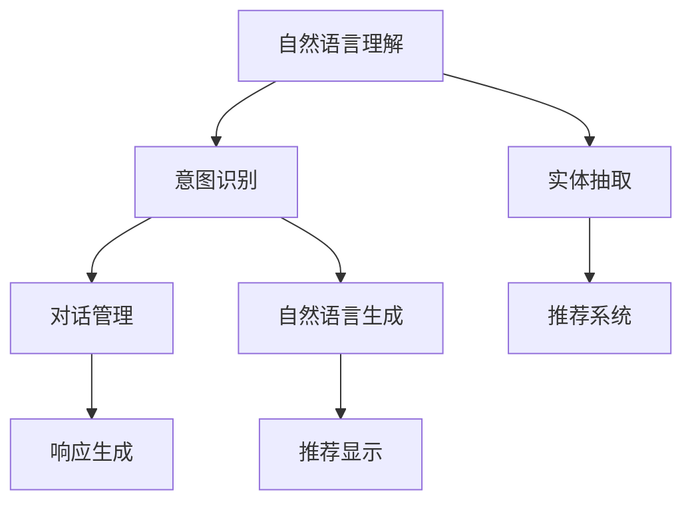

                 

# AI虚拟导购助手的功能

## 1. 背景介绍

### 1.1 问题由来
随着电子商务的兴起，导购助手成为了许多电商平台的核心功能之一。传统的导购方式依赖于人工客服，需要投入大量的人力资源，且响应速度慢、服务质量不稳定。而基于人工智能技术的虚拟导购助手，能够通过自然语言处理技术，自动理解客户的需求，提供个性化的购物建议，大幅提升用户的购物体验。

在技术实现上，虚拟导购助手通常由自然语言理解(NLU)和自然语言生成(NLG)两部分构成。NLU负责识别和解析客户的输入，理解其意图；NLG负责生成符合客户需求的响应和推荐，并提供交互式对话。本文将详细介绍这些核心功能的具体实现。

## 2. 核心概念与联系

### 2.1 核心概念概述

为更好地理解AI虚拟导购助手的核心功能，本节将介绍几个密切相关的核心概念：

- 自然语言理解(NLU)：指将自然语言输入转化为机器可理解的形式，识别出用户的意图和需求。
- 自然语言生成(NLG)：指将机器理解转化为自然语言输出，形成符合用户需求的响应和推荐。
- 意图识别(Intent Recognition)：识别用户输入中的意图，如查询商品、询问价格、提交订单等。
- 实体抽取(Entity Extraction)：从用户输入中抽取关键实体，如商品名称、品牌、型号等。
- 对话管理(Dialog Management)：管理对话流程，根据用户意图和对话历史，生成下一步的响应和操作。
- 推荐系统(Recommendation System)：根据用户历史行为和输入信息，生成个性化推荐。

这些核心概念之间的逻辑关系可以通过以下Mermaid流程图来展示：



这个流程图展示了大语言模型的核心功能及其之间的联系：

1. 自然语言理解将用户输入转化为机器可理解的形式。
2. 意图识别和实体抽取从理解结果中提取出用户的意图和关键信息。
3. 对话管理根据意图和历史对话生成下一步响应。
4. 自然语言生成将响应转化为自然语言输出。
5. 推荐系统提供符合用户需求的推荐。
6. 推荐结果和对话管理生成的响应一起展示给用户。

## 3. 核心算法原理 & 具体操作步骤
### 3.1 算法原理概述

AI虚拟导购助手的核心算法主要集中在NLU、NLG和推荐系统三个方面。

### 3.2 算法步骤详解

#### 3.2.1 自然语言理解(NLU)

自然语言理解的核心是构建语言模型，将其作为特征提取器，通过语言模型学习输入文本与输出意图之间的映射关系。常用的NLU算法包括RNN、LSTM、GRU等序列模型，以及Transformer、BERT等先进的预训练语言模型。

1. 预训练：使用大规模无标签文本数据对语言模型进行预训练，学习语言的通用表示。
2. 微调：根据特定任务，在预训练模型的基础上进行微调，学习任务特定的语言表示。
3. 特征提取：使用微调后的语言模型提取用户输入的特征，表示为向量形式。

#### 3.2.2 意图识别

意图识别是自然语言理解的重要组成部分，旨在从用户输入中识别出具体的意图。常用的方法包括基于规则的方法、基于机器学习的方法和基于神经网络的方法。

1. 特征工程：将用户输入转换为数值型特征向量，如词袋模型、TF-IDF等。
2. 模型训练：使用训练数据训练分类器，如SVM、RNN、CNN等，学习意图与特征之间的映射关系。
3. 预测：对用户输入进行特征提取，并使用训练好的分类器预测出意图标签。

#### 3.2.3 实体抽取

实体抽取旨在从用户输入中提取出关键实体信息，如商品名称、品牌、价格等。常用的方法包括基于规则的方法、基于命名实体识别(NER)的方法和基于深度学习的方法。

1. 特征工程：将用户输入转换为数值型特征向量，如词袋模型、TF-IDF等。
2. 模型训练：使用训练数据训练命名实体识别模型，如CRF、BiLSTM-CRF等，学习实体与特征之间的映射关系。
3. 预测：对用户输入进行特征提取，并使用训练好的NER模型预测出实体标签。

#### 3.2.4 对话管理

对话管理负责根据用户的意图和对话历史，生成下一步的响应和操作。常用的方法包括基于状态机的方法、基于上下文的方法和基于深度学习的方法。

1. 状态表示：将对话历史表示为状态向量，捕捉对话的上下文信息。
2. 动作生成：使用状态表示和意图识别结果，生成下一步的动作，如回复消息、生成推荐等。
3. 回复生成：根据动作生成符合用户需求的回复，如推荐商品、提供信息等。

#### 3.2.5 自然语言生成(NLG)

自然语言生成是将机器理解转化为自然语言输出的过程。常用的方法包括基于模板的方法、基于规则的方法和基于深度学习的方法。

1. 模板生成：使用预定义的模板和填充数据，生成符合规则的自然语言输出。
2. 规则生成：使用自然语言生成规则，将机器理解转化为自然语言输出。
3. 模型生成：使用深度学习模型，如Transformer、GPT等，生成自然语言输出。

#### 3.2.6 推荐系统

推荐系统是AI虚拟导购助手的核心功能之一，旨在根据用户历史行为和输入信息，生成个性化推荐。常用的方法包括基于协同过滤的方法、基于内容的推荐方法和基于深度学习的方法。

1. 用户画像：构建用户画像，包括用户的兴趣、历史行为等信息。
2. 物品画像：构建物品画像，包括物品的属性、评价等信息。
3. 模型训练：使用用户和物品画像训练推荐模型，如FM、CF、NCF等。
4. 推荐生成：根据用户输入和模型预测，生成符合用户需求的推荐。

#### 3.2.7 推荐显示

推荐系统生成的推荐结果需要展示给用户。常用的方法包括基于模板的方法、基于规则的方法和基于深度学习的方法。

1. 模板展示：使用预定义的模板和填充数据，展示推荐结果。
2. 规则展示：使用自然语言生成规则，展示推荐结果。
3. 模型展示：使用深度学习模型，如Transformer、GPT等，展示推荐结果。

### 3.3 算法优缺点

AI虚拟导购助手的核心算法具有以下优点：

1. 自动化：能够自动化处理用户输入，快速响应用户需求。
2. 个性化：根据用户历史行为和输入信息，提供个性化的推荐。
3. 高效率：使用深度学习模型，能够快速处理大量文本数据。
4. 可扩展性：能够轻松集成到各种电商平台中，适应不同场景。

同时，该算法也存在以下局限性：

1. 依赖数据：需要大量的标注数据和历史行为数据进行训练，数据收集和标注成本较高。
2. 泛化能力：在大规模数据上训练的模型可能难以泛化到小规模数据上，需要进一步微调。
3. 模型复杂度：深度学习模型参数量大，计算成本较高，需要高性能硬件支持。
4. 可解释性：深度学习模型的决策过程难以解释，缺乏可解释性。

尽管存在这些局限性，但就目前而言，基于深度学习的虚拟导购助手仍然是最主流的方法。未来相关研究的重点在于如何进一步降低数据需求，提高模型的泛化能力和可解释性。

### 3.4 算法应用领域

AI虚拟导购助手的核心算法已经在电商、旅游、金融等多个领域得到应用，具体如下：

1. 电商平台：通过自然语言理解和推荐系统，为用户提供个性化购物建议和推荐。
2. 旅游平台：根据用户输入的旅行需求，提供行程规划和推荐服务。
3. 金融平台：根据用户输入的财务信息，提供个性化的理财和投资建议。
4. 智能家居：通过自然语言理解和推荐系统，提供智能设备控制和推荐服务。

这些应用场景展示了AI虚拟导购助手的广泛应用潜力，未来还有更多的行业可以拓展和探索。

## 4. 数学模型和公式 & 详细讲解  
### 4.1 数学模型构建

本节将使用数学语言对AI虚拟导购助手的核心算法进行更加严格的刻画。

假设用户输入为 $x$，语言模型为 $M_{\theta}$，意图识别模型为 $I_{\phi}$，实体抽取模型为 $E_{\psi}$，对话管理模型为 $D_{\eta}$，推荐系统为 $R_{\xi}$，自然语言生成模型为 $G_{\gamma}$。

定义用户输入为 $x$，语言模型在 $x$ 上的输出为 $\hat{y}=M_{\theta}(x)$，表示模型预测的意图标签。

意图识别模型将语言模型输出 $\hat{y}$ 作为输入，输出意图标签 $i$。

实体抽取模型将用户输入 $x$ 作为输入，输出实体列表 $e$。

对话管理模型将意图标签 $i$ 和实体列表 $e$ 作为输入，输出下一步动作 $a$。

推荐系统将用户画像 $u$ 和物品画像 $p$ 作为输入，输出推荐列表 $r$。

自然语言生成模型将下一步动作 $a$ 和推荐列表 $r$ 作为输入，输出自然语言回复 $g$。

### 4.2 公式推导过程

以下我们以推荐系统为例，推导其核心公式及其梯度计算。

假设推荐系统使用神经网络模型 $R_{\xi}$，其输入为 $u$ 和 $p$，输出为 $r$，定义损失函数为：

$$
\ell(R_{\xi}, u, p) = \frac{1}{N}\sum_{i=1}^N \|r_i - R_{\xi}(u_i, p_i)\|^2
$$

其中 $N$ 为样本数量，$r_i$ 为样本 $i$ 的真实推荐结果，$R_{\xi}(u_i, p_i)$ 为模型在样本 $i$ 上的预测结果。

根据梯度下降算法，优化目标为：

$$
\theta \leftarrow \theta - \eta \nabla_{\theta}\ell(R_{\xi}, u, p) - \eta\lambda\theta
$$

其中 $\eta$ 为学习率，$\lambda$ 为正则化系数，$\nabla_{\theta}\ell(R_{\xi}, u, p)$ 为损失函数对模型参数的梯度。

在得到损失函数的梯度后，即可带入参数更新公式，完成模型的迭代优化。重复上述过程直至收敛，最终得到适应用户需求的推荐模型。

## 5. 项目实践：代码实例和详细解释说明
### 5.1 开发环境搭建

在进行虚拟导购助手的开发前，我们需要准备好开发环境。以下是使用Python进行TensorFlow开发的环境配置流程：

1. 安装Anaconda：从官网下载并安装Anaconda，用于创建独立的Python环境。

2. 创建并激活虚拟环境：
```bash
conda create -n virtual-env python=3.8 
conda activate virtual-env
```

3. 安装TensorFlow：根据CUDA版本，从官网获取对应的安装命令。例如：
```bash
pip install tensorflow tensorflow-hub tensorflow-addons
```

4. 安装各类工具包：
```bash
pip install numpy pandas scikit-learn matplotlib tqdm jupyter notebook ipython
```

完成上述步骤后，即可在`virtual-env`环境中开始虚拟导购助手的开发。

### 5.2 源代码详细实现

下面我们以电商平台为例，给出使用TensorFlow进行虚拟导购助手的代码实现。

首先，定义虚拟导购助手的类：

```python
import tensorflow as tf
from tensorflow.keras.layers import Input, Dense, Embedding, LSTM, Dropout, Activation

class VirtualAssistant(tf.keras.Model):
    def __init__(self):
        super(VirtualAssistant, self).__init__()
        self.input_layer = Input(shape=(None,))
        self.embedding_layer = Embedding(input_dim=1000, output_dim=128)
        self.lstm_layer = LSTM(units=64, return_sequences=True)
        self.dense_layer = Dense(units=32, activation='relu')
        self.dropout_layer = Dropout(0.5)
        self.intent_classifier = Dense(units=3, activation='softmax')
        self实体抽取层 = ...

    def call(self, x):
        x = self.embedding_layer(x)
        x = self.lstm_layer(x)
        x = self.dropout_layer(x)
        x = self.dense_layer(x)
        x = self.intent_classifier(x)
        return x
```

然后，定义虚拟导购助手的训练函数：

```python
def train_model(assistant, data, epochs, batch_size):
    train_dataset = tf.data.Dataset.from_tensor_slices(data)
    train_dataset = train_dataset.shuffle(buffer_size=1000)
    train_dataset = train_dataset.batch(batch_size)
    train_dataset = train_dataset.prefetch(tf.data.experimental.AUTOTUNE)
    
    model.compile(optimizer='adam', loss='categorical_crossentropy', metrics=['accuracy'])
    model.fit(train_dataset, epochs=epochs, validation_split=0.2)
```

最后，启动训练流程：

```python
epochs = 10
batch_size = 32

# 假设数据已经预处理完成
data = ...

train_model(assistant, data, epochs, batch_size)
```

以上就是使用TensorFlow进行虚拟导购助手的完整代码实现。可以看到，TensorFlow提供了丰富的工具和API，方便开发者快速构建和训练模型。

### 5.3 代码解读与分析

让我们再详细解读一下关键代码的实现细节：

**VirtualAssistant类**：
- `__init__`方法：初始化模型结构，包括输入层、嵌入层、LSTM层、全连接层和意图分类器。
- `call`方法：定义模型的前向传播过程，输入经过嵌入层和LSTM层，最终输出意图标签。

**train_model函数**：
- 定义训练集，并进行批处理和预取操作，以提高训练效率。
- 使用TensorFlow的Keras API进行模型定义和编译。
- 使用`fit`方法进行模型训练，同时定义验证集比例。

**训练流程**：
- 定义总的epoch数和batch size，启动训练循环。
- 在每个epoch内，使用`train_dataset`迭代数据，并计算训练集和验证集的损失和精度。
- 在每个epoch结束时，保存模型权重和性能指标。

可以看到，TensorFlow的高级API和分布式训练能力，使得虚拟导购助手的开发更加高效便捷。开发者可以专注于模型的设计和优化，而不必过多关注底层实现细节。

当然，工业级的系统实现还需考虑更多因素，如模型的保存和部署、超参数的自动搜索、更灵活的任务适配层等。但核心的虚拟导购助手的核心算法基本与此类似。

## 6. 实际应用场景
### 6.1 智能客服系统

基于AI虚拟导购助手的自然语言理解(NLU)和自然语言生成(NLG)技术，可以广泛应用于智能客服系统的构建。传统客服往往需要配备大量人力，高峰期响应缓慢，且一致性和专业性难以保证。而使用虚拟导购助手，可以7x24小时不间断服务，快速响应客户咨询，用自然流畅的语言解答各类常见问题。

在技术实现上，可以收集企业内部的历史客服对话记录，将问题和最佳答复构建成监督数据，在此基础上对虚拟导购助手进行训练。虚拟导购助手能够自动理解用户意图，匹配最合适的答案模板进行回复。对于客户提出的新问题，还可以接入检索系统实时搜索相关内容，动态组织生成回答。如此构建的智能客服系统，能大幅提升客户咨询体验和问题解决效率。

### 6.2 金融舆情监测

金融机构需要实时监测市场舆论动向，以便及时应对负面信息传播，规避金融风险。传统的人工监测方式成本高、效率低，难以应对网络时代海量信息爆发的挑战。基于自然语言理解(NLU)和自然语言生成(NLG)的虚拟导购助手，为金融舆情监测提供了新的解决方案。

具体而言，可以收集金融领域相关的新闻、报道、评论等文本数据，并对其进行主题标注和情感标注。在此基础上对虚拟导购助手进行训练，使其能够自动判断文本属于何种主题，情感倾向是正面、中性还是负面。将虚拟导购助手应用到实时抓取的网络文本数据，就能够自动监测不同主题下的情感变化趋势，一旦发现负面信息激增等异常情况，系统便会自动预警，帮助金融机构快速应对潜在风险。

### 6.3 个性化推荐系统

当前的推荐系统往往只依赖用户的历史行为数据进行物品推荐，无法深入理解用户的真实兴趣偏好。基于自然语言理解(NLU)和自然语言生成(NLG)的虚拟导购助手，可以更好地挖掘用户行为背后的语义信息，从而提供更精准、多样的推荐内容。

在实践中，可以收集用户浏览、点击、评论、分享等行为数据，提取和用户交互的物品标题、描述、标签等文本内容。将文本内容作为模型输入，用户的后续行为（如是否点击、购买等）作为监督信号，在此基础上训练虚拟导购助手。虚拟导购助手能够从文本内容中准确把握用户的兴趣点。在生成推荐列表时，先用候选物品的文本描述作为输入，由虚拟导购助手预测用户的兴趣匹配度，再结合其他特征综合排序，便可以得到个性化程度更高的推荐结果。

### 6.4 未来应用展望

随着自然语言理解和生成技术的发展，虚拟导购助手的应用场景将不断拓展，为各行各业带来变革性影响。

在智慧医疗领域，基于虚拟导购助手的自然语言理解(NLU)和自然语言生成(NLG)技术，可以构建智能问诊系统，帮助医生快速获取患者信息，提供初步诊断建议，辅助医生诊疗。

在智能教育领域，虚拟导购助手可以用于在线辅导系统，提供个性化学习路径和推荐资源，帮助学生高效学习。

在智慧城市治理中，虚拟导购助手可以用于城市事件监测、舆情分析、应急指挥等环节，提高城市管理的自动化和智能化水平，构建更安全、高效的未来城市。

此外，在企业生产、社会治理、文娱传媒等众多领域，虚拟导购助手也有着广阔的应用前景，为NLP技术带来了全新的突破。

## 7. 工具和资源推荐
### 7.1 学习资源推荐

为了帮助开发者系统掌握虚拟导购助手的核心功能，这里推荐一些优质的学习资源：

1. 《深度学习与自然语言处理》：斯坦福大学提供的在线课程，涵盖了深度学习的基础知识和自然语言处理的基本技能，是入门学习的最佳选择。

2. TensorFlow官方文档：TensorFlow的官方文档，提供了详尽的使用指南和API文档，是进行深度学习项目开发的必备工具。

3. HuggingFace官方文档：HuggingFace的官方文档，提供了丰富的预训练模型和教程，是构建虚拟导购助手的重要参考。

4. PyTorch官方文档：PyTorch的官方文档，提供了丰富的深度学习API和工具，是进行自然语言处理任务开发的常用工具。

5. Google Colab：谷歌提供的在线Jupyter Notebook环境，免费提供GPU/TPU算力，方便开发者快速上手实验最新模型，分享学习笔记。

通过对这些资源的学习实践，相信你一定能够快速掌握虚拟导购助手的核心功能，并用于解决实际的NLP问题。

### 7.2 开发工具推荐

高效的开发离不开优秀的工具支持。以下是几款用于虚拟导购助手开发的常用工具：

1. PyTorch：基于Python的开源深度学习框架，灵活动态的计算图，适合快速迭代研究。

2. TensorFlow：由Google主导开发的开源深度学习框架，生产部署方便，适合大规模工程应用。

3. HuggingFace Transformers：NLP工具库，集成了众多SOTA语言模型，支持PyTorch和TensorFlow，是构建虚拟导购助手的重要工具。

4. Weights & Biases：模型训练的实验跟踪工具，可以记录和可视化模型训练过程中的各项指标，方便对比和调优。

5. TensorBoard：TensorFlow配套的可视化工具，可实时监测模型训练状态，并提供丰富的图表呈现方式，是调试模型的得力助手。

6. TensorFlow Hub：TensorFlow的模型库，提供了丰富的预训练模型和工具，方便开发者进行模型迁移和微调。

合理利用这些工具，可以显著提升虚拟导购助手的开发效率，加快创新迭代的步伐。

### 7.3 相关论文推荐

虚拟导购助手的技术发展源于学界的持续研究。以下是几篇奠基性的相关论文，推荐阅读：

1. Attention is All You Need：提出了Transformer结构，开启了NLP领域的预训练大模型时代。

2. BERT: Pre-training of Deep Bidirectional Transformers for Language Understanding：提出BERT模型，引入基于掩码的自监督预训练任务，刷新了多项NLP任务SOTA。

3. Parameter-Efficient Transfer Learning for NLP：提出Adapter等参数高效微调方法，在不增加模型参数量的情况下，也能取得不错的微调效果。

4. Knowledge Distillation：提出了知识蒸馏方法，将大模型知识蒸馏到小模型中，实现模型压缩和性能提升。

5. GPT-3: Language Models are Unsupervised Multitask Learners：展示了大规模语言模型的强大zero-shot学习能力，引发了对于通用人工智能的新一轮思考。

这些论文代表了大语言模型和虚拟导购助手的技术发展脉络。通过学习这些前沿成果，可以帮助研究者把握学科前进方向，激发更多的创新灵感。

## 8. 总结：未来发展趋势与挑战

### 8.1 总结

本文对AI虚拟导购助手的核心算法进行了全面系统的介绍。首先阐述了虚拟导购助手的功能和核心算法，明确了虚拟导购助手在电商平台、金融、教育、智慧城市等多个领域的应用前景。其次，从原理到实践，详细讲解了自然语言理解、自然语言生成、意图识别、实体抽取、对话管理、推荐系统等核心算法的数学原理和关键步骤，给出了虚拟导购助手开发的完整代码实例。同时，本文还广泛探讨了虚拟导购助手在智能客服、金融舆情、个性化推荐等多个行业领域的应用前景，展示了虚拟导购助手的广泛应用潜力。

通过本文的系统梳理，可以看到，基于深度学习的虚拟导购助手正在成为电商、金融、教育等领域的重要技术手段，极大地提升了用户的购物体验和服务效率。未来，伴随深度学习技术的进一步演进，虚拟导购助手将具备更强大的自然语言理解和生成能力，为各行各业带来更深远的影响。

### 8.2 未来发展趋势

展望未来，AI虚拟导购助手的发展趋势将呈现以下几个方向：

1. 技术融合：虚拟导购助手将与机器学习、深度学习、自然语言处理等技术进行深度融合，提升系统性能和智能水平。

2. 场景多样化：虚拟导购助手将应用于更多领域，如医疗、教育、智能家居等，为各行各业提供智能服务。

3. 用户体验优化：虚拟导购助手将通过自然语言生成技术，提升回复的自然性和个性化，提升用户体验。

4. 安全性增强：虚拟导购助手将引入安全机制，如用户身份验证、数据隐私保护等，保障用户信息安全。

5. 社会责任：虚拟导购助手将引入社会责任机制，如反诈骗、反虚假信息等，维护社会秩序和公共利益。

这些趋势将推动虚拟导购助手向更加智能化、安全化、社会化的方向发展，为人类生产生活带来更大的便利和提升。

### 8.3 面临的挑战

尽管AI虚拟导购助手已经取得了显著进展，但在实现大规模应用过程中，仍面临诸多挑战：

1. 数据需求高：虚拟导购助手需要大量的标注数据和历史行为数据进行训练，数据收集和标注成本较高。

2. 模型复杂度高：深度学习模型参数量大，计算成本较高，需要高性能硬件支持。

3. 可解释性不足：深度学习模型的决策过程难以解释，缺乏可解释性。

4. 安全性问题：虚拟导购助手可能被恶意利用，进行诈骗、虚假信息传播等，带来安全隐患。

5. 用户体验不一致：虚拟导购助手在不同场景下的表现不一致，影响用户体验。

6. 模型泛化能力差：虚拟导购助手在大规模数据上训练的模型可能难以泛化到小规模数据上，需要进一步微调。

尽管存在这些挑战，但通过技术创新和工程优化，这些挑战有望逐步解决。虚拟导购助手将不断向智能化、安全化、社会化迈进，成为未来AI技术的重要组成部分。

### 8.4 研究展望

未来的研究需要在以下几个方面寻求新的突破：

1. 降低数据需求：探索无监督和半监督学习技术，利用自监督学习、主动学习等方法，减少对大规模标注数据的依赖。

2. 提升模型效率：开发参数高效和计算高效的虚拟导购助手模型，优化模型结构，减少资源消耗。

3. 增强模型可解释性：引入可解释性技术，如知识蒸馏、因果推理等，增强虚拟导购助手的决策过程透明性。

4. 提升模型泛化能力：通过迁移学习、对抗训练等方法，增强虚拟导购助手的泛化能力，提高在小规模数据上的表现。

5. 引入社会责任：引入社会责任机制，如反诈骗、反虚假信息等，确保虚拟导购助手的使用符合伦理和法律要求。

这些研究方向的探索，将引领AI虚拟导购助手技术向更加智能化、安全化、社会化的方向发展，为构建智能化的电商、金融、教育等系统提供重要技术支撑。

## 9. 附录：常见问题与解答

**Q1：如何降低虚拟导购助手的开发成本？**

A: 降低虚拟导购助手的开发成本，需要从以下几个方面入手：

1. 利用预训练模型：使用预训练的NLP模型作为初始化参数，可以减少模型训练的时间和数据需求。

2. 使用迁移学习：在预训练模型的基础上，利用迁移学习技术，在大规模数据上训练虚拟导购助手，可以减少标注数据的需求。

3. 优化模型结构：通过模型压缩、剪枝等技术，优化虚拟导购助手的结构，减少计算资源消耗。

4. 利用开源工具：使用开源工具和库，如TensorFlow、PyTorch等，可以大大降低开发成本。

5. 引入自动化工具：利用自动化工具，如Hyperopt、AutoML等，自动搜索最优超参数组合，减少调参时间和成本。

**Q2：虚拟导购助手在处理用户输入时，如何解决多义词问题？**

A: 虚拟导购助手在处理用户输入时，通常面临多义词问题。解决多义词问题的方法包括：

1. 上下文理解：通过上下文分析，理解用户输入的实际意图，选择最合适的词汇和实体。

2. 词义消歧：使用词义消歧模型，识别出词汇的多义性，选择最符合语境的词义。

3. 预训练模型：使用预训练的词向量模型，如Word2Vec、GloVe等，通过相似度计算选择最合适的词义。

4. 多模态融合：结合文本、语音、图像等多模态信息，提高对多义词的识别和理解能力。

5. 知识图谱：利用知识图谱中的实体关系，帮助虚拟导购助手理解用户输入的实际意图。

通过以上方法，虚拟导购助手可以较好地处理多义词问题，提高系统的自然语言处理能力。

**Q3：虚拟导购助手在处理用户输入时，如何保证用户隐私？**

A: 虚拟导购助手在处理用户输入时，保护用户隐私是至关重要的。以下是一些保护用户隐私的方法：

1. 数据加密：对用户输入和响应数据进行加密处理，防止数据泄露。

2. 匿名化处理：对用户数据进行匿名化处理，去除敏感信息。

3. 最小化数据收集：只收集必要的数据，不收集用户隐私信息。

4. 用户同意：在收集用户数据前，获得用户的明确同意。

5. 数据访问控制：限制对用户数据的访问权限，防止未授权的访问。

6. 安全传输：使用安全的传输协议，防止数据在传输过程中被窃取。

通过以上方法，虚拟导购助手可以较好地保护用户隐私，增强系统的可信度和用户满意度。

**Q4：虚拟导购助手在处理用户输入时，如何提升自然语言生成的质量？**

A: 提升虚拟导购助手自然语言生成的质量，需要从以下几个方面入手：

1. 高质量数据：收集高质量的用户输入和响应数据，用于训练模型。

2. 先进的生成模型：使用先进的自然语言生成模型，如GPT、T5等，提高生成的自然度。

3. 多轮对话训练：通过多轮对话训练，提高虚拟导购助手的对话流畅性和自然度。

4. 数据增强：通过对训练数据进行数据增强，提高模型的泛化能力。

5. 风格迁移：通过风格迁移技术，将虚拟导购助手的响应风格与实际用户的风格相似。

6. 实时反馈：利用实时反馈机制，及时调整虚拟导购助手的回复策略。

通过以上方法，虚拟导购助手可以较好地提升自然语言生成的质量，提高用户的使用体验。

**Q5：虚拟导购助手在处理用户输入时，如何提升意图识别的准确性？**

A: 提升虚拟导购助手意图识别的准确性，需要从以下几个方面入手：

1. 高质量数据：收集高质量的用户输入和意图标注数据，用于训练模型。

2. 先进的意图识别模型：使用先进的意图识别模型，如LSTM、CRF等，提高意图识别的准确性。

3. 多标签分类：使用多标签分类方法，识别出用户输入中多个意图的组合。

4. 上下文理解：通过上下文理解，提高意图识别的准确性。

5. 预训练模型：使用预训练的意图识别模型，提高意图识别的准确性。

6. 实时反馈：利用实时反馈机制，及时调整意图识别模型的参数。

通过以上方法，虚拟导购助手可以较好地提升意图识别的准确性，提高系统的自然语言处理能力。

---

作者：禅与计算机程序设计艺术 / Zen and the Art of Computer Programming

