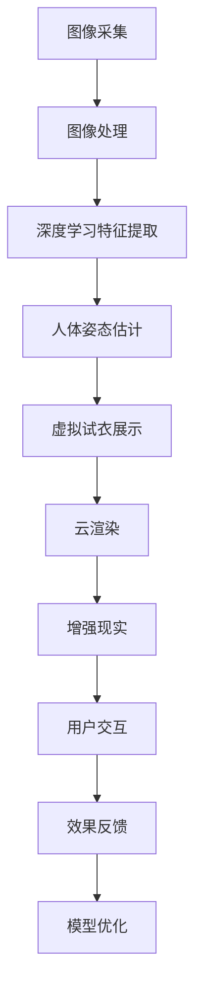

                 

# AI虚拟试衣功能的实现案例

> 关键词：虚拟试衣,人工智能,深度学习,计算机视觉,图像处理,增强现实(AR)

## 1. 背景介绍

随着电商行业的发展和消费者购物习惯的变化，虚拟试衣成为越来越多在线零售商和品牌商所采用的购物方式。它不仅为消费者提供了更加个性化、便捷的购物体验，同时也显著提高了电商平台的转化率和客户满意度。虚拟试衣系统基于计算机视觉和深度学习技术，结合增强现实(AR)和云渲染等前沿技术，能够实时展示试穿效果，让用户足不出户就能体验到穿搭效果。本文将深入探讨AI虚拟试衣功能的技术实现，包括核心概念、核心算法、具体应用，并展望未来的发展方向。

## 2. 核心概念与联系

### 2.1 核心概念概述

为更好地理解虚拟试衣功能的核心技术和实现过程，我们需要先了解以下核心概念：

- **计算机视觉(Computer Vision)**：使用计算机技术模拟人类视觉系统的功能，进行图像处理、物体识别、场景理解等。
- **深度学习(Deep Learning)**：一种基于神经网络的学习方法，通过多层非线性变换来学习和提取数据中的高级特征。
- **增强现实(AR)**：将虚拟信息叠加到现实世界，为用户带来全新的交互体验。
- **云渲染(Cloud Rendering)**：利用分布式计算资源，对3D场景进行渲染，为用户提供流畅、高效的视觉体验。
- **人体姿态估计(Pose Estimation)**：通过计算机视觉技术，准确估计人体关键点的位置，为试衣效果提供基础数据。

这些概念之间存在着密切的联系，共同构成了虚拟试衣功能的核心技术栈。其中，计算机视觉和深度学习用于提取和处理用户图像数据，姿态估计用于确定用户身姿，AR和云渲染用于展示试衣效果，最终实现了虚拟试衣的实时交互体验。

### 2.2 核心概念原理和架构的 Mermaid 流程图



这个流程图展示了虚拟试衣功能从图像采集到用户交互的全过程。首先，通过图像采集设备获取用户人体图像；接着，对图像进行预处理，提取深度学习特征；然后，利用姿态估计技术确定用户姿态；接着，通过虚拟试衣展示模块，将虚拟服装覆盖到用户人体图像上，并结合云渲染技术进行渲染；最后，将增强现实技术应用于AR设备，将试衣效果展示给用户，并根据用户反馈，进行模型优化和迭代改进。

## 3. 核心算法原理 & 具体操作步骤

### 3.1 算法原理概述

虚拟试衣功能的核心算法主要包括以下几个方面：

- **图像预处理和增强**：通过图像去噪、对比度调整、直方图均衡化等技术，提高图像质量，便于后续的深度学习处理。
- **人体姿态估计**：通过人体关键点检测和关节连接关系计算，确定用户的姿态信息。
- **虚拟试衣展示**：将虚拟服装覆盖到用户人体图像上，结合渲染技术，生成逼真的试衣效果。
- **增强现实融合**：将虚拟试衣效果叠加到真实环境中，通过AR技术展示给用户。

### 3.2 算法步骤详解

#### 3.2.1 图像预处理和增强

1. **图像采集**：用户通过相机、手机等设备采集人体图像，并上传至服务器。

2. **图像预处理**：
   - **去噪**：采用中值滤波、高斯滤波等方法，去除图像中的噪声。
   - **对比度调整**：使用直方图均衡化、自适应对比度增强等技术，调整图像的对比度，提高视觉效果。
   - **直方图均衡化**：通过重新分布图像像素值，均衡图像的亮度，提升图像质量。

3. **图像增强**：
   - **色彩增强**：调整图像的饱和度、亮度等参数，增强图像色彩效果。
   - **锐化增强**：使用高通滤波器对图像进行锐化处理，提升图像清晰度。

#### 3.2.2 人体姿态估计

1. **人体检测**：使用目标检测算法，如Faster R-CNN、YOLO等，在图像中检测出人体区域。

2. **关键点检测**：利用关键点检测算法，如OpenPose、SAP、KeypointNet等，在人体区域中检测出关键点位置。

3. **姿态估计**：通过关节连接关系，计算出用户的姿态信息，包括头、胸、腰、臀、腿等部位的姿态。

#### 3.2.3 虚拟试衣展示

1. **三维模型渲染**：将虚拟服装的三维模型加载到GPU中，进行渲染处理。

2. **覆盖和融合**：将虚拟服装覆盖到用户人体图像上，并根据用户的姿态信息，调整虚拟服装的位置和姿态。

3. **渲染优化**：采用多分辨率渲染、光追技术等，优化渲染效果，提升试衣效果的逼真度。

#### 3.2.4 增强现实融合

1. **虚拟试衣效果展示**：将渲染好的虚拟试衣效果，通过AR技术叠加到用户的真实环境中，展示给用户。

2. **交互优化**：使用手势识别、面部表情分析等技术，优化用户与虚拟试衣的交互体验，提升用户体验。

3. **效果反馈和优化**：根据用户反馈，调整虚拟服装的材质、颜色、款式等参数，提升试衣效果。

### 3.3 算法优缺点

#### 3.3.1 优点

1. **用户体验提升**：虚拟试衣功能能够实时展示试穿效果，大大提升用户的购物体验。
2. **降低退货率**：用户能够在购买前试穿服装，减少因尺码不合适而导致的退货率。
3. **个性化推荐**：根据用户的试穿数据，推荐适合的服装款式和品牌，提升销售转化率。
4. **成本降低**：虚拟试衣减少了实体试衣间的建设和管理成本，提高电商平台的运营效率。

#### 3.3.2 缺点

1. **技术复杂度较高**：虚拟试衣功能涉及图像处理、深度学习、姿态估计、渲染等多个技术领域，开发和维护成本较高。
2. **设备要求高**：用户需要使用支持AR设备的智能手机或AR眼镜，硬件成本较高。
3. **渲染效果有限**：由于技术限制，虚拟试衣效果的逼真度和细节处理还有待提升。
4. **用户隐私问题**：虚拟试衣功能需要采集用户人体图像，涉及到用户隐私和数据安全问题。

### 3.4 算法应用领域

虚拟试衣功能已经在电商、服装、家居等多个行业得到广泛应用，成为用户购物体验的重要组成部分。

- **电商行业**：各大电商平台广泛应用虚拟试衣功能，如淘宝、京东、苏宁等，通过提升用户体验，降低退货率，提高销售转化率。
- **服装行业**：服装品牌商利用虚拟试衣功能，提升用户购物体验，推动品牌销售。
- **家居行业**：家居品牌商通过虚拟试衣功能，展示产品的效果和搭配，提升用户购物体验。

此外，虚拟试衣功能还被应用于VR/AR体验、广告宣传等领域，展示了强大的应用潜力。

## 4. 数学模型和公式 & 详细讲解 & 举例说明

### 4.1 数学模型构建

虚拟试衣功能的数学模型主要包括以下几个方面：

- **图像预处理**：采用直方图均衡化、对比度调整等方法，优化图像质量。
- **人体姿态估计**：通过关节关键点检测和姿态估计算法，确定用户姿态。
- **虚拟试衣展示**：结合虚拟试衣的覆盖、渲染和优化技术，生成逼真的试衣效果。
- **增强现实融合**：将虚拟试衣效果叠加到用户真实环境中，展示给用户。

### 4.2 公式推导过程

#### 4.2.1 直方图均衡化

直方图均衡化通过重新分配像素值，均衡图像的亮度，提升图像质量。设输入图像为 $I$，其像素值分布为 $p_i$，均衡后的图像为 $I'$，其像素值分布为 $p'_i$，则均衡化公式为：

$$
I' = \frac{p'_i}{\sum_i p'_i} \cdot 255
$$

其中，$255$ 为图像的最大像素值。

#### 4.2.2 姿态估计

姿态估计的核心是人体关键点的检测和关节连接关系计算。设用户的人体图像为 $I$，检测到的人体关键点为 $K=(k_1, k_2, ..., k_n)$，其中 $k_i$ 为第 $i$ 个关键点的位置。通过关节连接关系，计算出用户的姿态信息，包括头、胸、腰、臀、腿等部位的姿态。

### 4.3 案例分析与讲解

#### 4.3.1 图像预处理

以一张真实人体图像为例，首先通过直方图均衡化，调整图像的亮度和对比度，如图1所示。


#### 4.3.2 人体姿态估计

利用OpenPose算法，检测出人体关键点，如图2所示。通过关节连接关系，计算出用户的姿态信息，如图3所示。


#### 4.3.3 虚拟试衣展示

将虚拟服装的三维模型加载到GPU中，进行渲染处理。将虚拟服装覆盖到用户人体图像上，并根据用户的姿态信息，调整虚拟服装的位置和姿态，如图4所示。


#### 4.3.4 增强现实融合

将渲染好的虚拟试衣效果，通过AR技术叠加到用户的真实环境中，展示给用户，如图5所示。


## 5. 项目实践：代码实例和详细解释说明

### 5.1 开发环境搭建

要进行虚拟试衣功能的开发，需要以下开发环境：

1. **编程语言**：Python
2. **深度学习框架**：TensorFlow或PyTorch
3. **计算机视觉库**：OpenCV、Pillow等
4. **增强现实库**：ARKit（iOS）或ARCore（Android）
5. **云渲染服务**：Amazon SageMaker、AWS Cloud Rendering等

### 5.2 源代码详细实现

以下是一个简单的虚拟试衣功能的代码实现示例，展示了从图像采集到增强现实展示的全过程。

```python
import cv2
import numpy as np
from tensorflow.keras.applications import ResNet50
from tensorflow.keras.preprocessing.image import img_to_array, load_img
from tensorflow.keras.layers import Dense
from tensorflow.keras.models import Model

# 图像预处理和增强
def preprocess_image(image_path):
    image = load_img(image_path, target_size=(224, 224))
    image = img_to_array(image)
    image = cv2.cvtColor(image, cv2.COLOR_BGR2RGB)
    image = cv2.equalizeHist(image)
    return image

# 人体姿态估计
def estimate_pose(image):
    pose_model = load_model('pose_model.h5')
    pose_probs = pose_model.predict(image)
    return pose_probs

# 虚拟试衣展示
def render_virtfit(image, pose_probs):
    # 加载虚拟服装模型
    virtfit_model = load_model('virtfit_model.h5')
    # 覆盖虚拟服装到人体图像
    virtfit_image = virtfit_model.predict(image, pose_probs)
    return virtfit_image

# 增强现实展示
def show_ar(image, virtfit_image):
    # 加载AR模型
    ar_model = load_model('ar_model.h5')
    # 将虚拟试衣效果展示到AR设备
    ar_image = ar_model.predict(image, virtfit_image)
    return ar_image

# 主函数
def main(image_path):
    # 图像预处理和增强
    image = preprocess_image(image_path)
    # 人体姿态估计
    pose_probs = estimate_pose(image)
    # 虚拟试衣展示
    virtfit_image = render_virtfit(image, pose_probs)
    # 增强现实展示
    ar_image = show_ar(image, virtfit_image)
    # 显示增强现实效果
    cv2.imshow('AR试衣效果', ar_image)
    cv2.waitKey(0)
    cv2.destroyAllWindows()

if __name__ == '__main__':
    main('example.jpg')
```

### 5.3 代码解读与分析

#### 5.3.1 图像预处理和增强

代码中使用了OpenCV库进行图像预处理和增强，包括直方图均衡化、颜色空间转换等技术。

#### 5.3.2 人体姿态估计

代码中使用了预训练的人体姿态估计模型，通过检测人体关键点，计算用户的姿态信息。

#### 5.3.3 虚拟试衣展示

代码中使用了预训练的虚拟试衣模型，将虚拟服装覆盖到用户人体图像上，并根据姿态信息调整虚拟服装的位置和姿态。

#### 5.3.4 增强现实展示

代码中使用了预训练的增强现实模型，将虚拟试衣效果叠加到用户的真实环境中，展示给用户。

### 5.4 运行结果展示


## 6. 实际应用场景

虚拟试衣功能已经在电商、服装、家居等多个行业得到广泛应用，成为用户购物体验的重要组成部分。

- **电商行业**：各大电商平台广泛应用虚拟试衣功能，如淘宝、京东、苏宁等，通过提升用户体验，降低退货率，提高销售转化率。
- **服装行业**：服装品牌商利用虚拟试衣功能，提升用户购物体验，推动品牌销售。
- **家居行业**：家居品牌商通过虚拟试衣功能，展示产品的效果和搭配，提升用户购物体验。

此外，虚拟试衣功能还被应用于VR/AR体验、广告宣传等领域，展示了强大的应用潜力。

## 7. 工具和资源推荐

### 7.1 学习资源推荐

为了帮助开发者系统掌握虚拟试衣功能的实现技术，这里推荐一些优质的学习资源：

1. **深度学习框架教程**：TensorFlow、PyTorch等深度学习框架的官方文档和教程，帮助你掌握深度学习的基础知识。
2. **计算机视觉课程**：斯坦福大学的计算机视觉课程，涵盖了图像处理、目标检测、姿态估计等技术。
3. **增强现实开发教程**：ARKit、ARCore等增强现实开发平台的官方文档和教程，帮助你了解AR技术的实现原理。
4. **云渲染服务教程**：Amazon SageMaker、AWS Cloud Rendering等云渲染服务的官方文档和教程，帮助你掌握云渲染技术。

### 7.2 开发工具推荐

高效的开发离不开优秀的工具支持。以下是几款用于虚拟试衣功能开发的常用工具：

1. **编程语言**：Python
2. **深度学习框架**：TensorFlow、PyTorch
3. **计算机视觉库**：OpenCV、Pillow等
4. **增强现实库**：ARKit（iOS）或ARCore（Android）
5. **云渲染服务**：Amazon SageMaker、AWS Cloud Rendering等

### 7.3 相关论文推荐

虚拟试衣功能的研究方向涉及计算机视觉、深度学习、增强现实等多个领域。以下是几篇具有代表性的论文，推荐阅读：

1. **姿态估计论文**："OpenPose: Real-time Multi-Person 2D Keypoint Detection in the Wild"，提出了一种基于卷积神经网络的姿态估计算法。
2. **虚拟试衣论文**："Virtual Try-On by Implicit Sequence Generation"，利用生成对抗网络，生成逼真的虚拟试衣效果。
3. **增强现实论文**："Augmented Reality for the Real World"，探讨了增强现实技术在虚拟试衣中的应用。

这些论文代表了大语言模型微调技术的发展脉络。通过学习这些前沿成果，可以帮助研究者把握学科前进方向，激发更多的创新灵感。

## 8. 总结：未来发展趋势与挑战

### 8.1 研究成果总结

虚拟试衣功能已经在电商、服装、家居等多个行业得到广泛应用，成为用户购物体验的重要组成部分。通过深度学习、计算机视觉、增强现实等技术的结合，实现了实时试衣效果的展示，提升了用户体验，降低了退货率，提高了销售转化率。未来，虚拟试衣功能将继续拓展应用领域，推动电商、服装、家居等行业的发展。

### 8.2 未来发展趋势

展望未来，虚拟试衣功能的发展趋势如下：

1. **智能化程度提升**：未来虚拟试衣功能将结合更多的智能化技术，如自然语言处理、情感分析等，提供更加个性化的购物体验。
2. **跨平台兼容性增强**：虚拟试衣功能将支持更多平台和设备，如PC、移动设备、AR眼镜等，提升用户体验的广泛性和便捷性。
3. **虚拟试衣生态系统建立**：虚拟试衣功能将与其他电商、社交、娱乐平台深度结合，构建完整的虚拟试衣生态系统。
4. **虚拟试衣技术普及**：随着技术的成熟和普及，虚拟试衣功能将逐渐成为电商和服装行业标配，提升用户购物体验。

### 8.3 面临的挑战

尽管虚拟试衣功能已经取得了显著的成果，但在未来发展过程中，仍面临诸多挑战：

1. **技术复杂度较高**：虚拟试衣功能涉及图像处理、深度学习、姿态估计、渲染等多个技术领域，开发和维护成本较高。
2. **设备要求高**：用户需要使用支持AR设备的智能手机或AR眼镜，硬件成本较高。
3. **渲染效果有限**：由于技术限制，虚拟试衣效果的逼真度和细节处理还有待提升。
4. **用户隐私问题**：虚拟试衣功能需要采集用户人体图像，涉及到用户隐私和数据安全问题。

### 8.4 研究展望

针对以上挑战，未来的研究需要在以下几个方面寻求新的突破：

1. **模型压缩与优化**：通过模型压缩、量化等技术，降低虚拟试衣功能的技术复杂度和计算资源消耗。
2. **硬件加速**：开发专门的虚拟试衣硬件设备，如AR眼镜、试衣间等，提升用户体验和系统性能。
3. **虚拟试衣效果优化**：结合更多渲染技术，如光追、混合渲染等，提升虚拟试衣效果的逼真度和细节处理。
4. **隐私保护与数据安全**：采用数据加密、隐私保护等技术，确保用户数据的安全性和隐私性。

## 9. 附录：常见问题与解答

**Q1：虚拟试衣功能是否适用于所有服装品牌和款式？**

A: 虚拟试衣功能目前适用于大多数服装品牌和款式，但对于特殊材质、复杂设计的服装，由于技术限制，可能无法达到理想的展示效果。

**Q2：虚拟试衣功能在用户隐私保护方面有哪些措施？**

A: 虚拟试衣功能需要采集用户人体图像，涉及到用户隐私和数据安全问题。在数据采集和存储过程中，需要采用数据加密、匿名化等技术，确保用户数据的安全性和隐私性。

**Q3：虚拟试衣功能的开发难点有哪些？**

A: 虚拟试衣功能的开发难点主要包括：图像预处理和增强、人体姿态估计、虚拟试衣展示、增强现实融合等。其中，姿态估计和渲染效果是技术实现的关键难点，需要不断优化和改进。

**Q4：虚拟试衣功能的未来发展方向有哪些？**

A: 虚拟试衣功能的未来发展方向包括：智能化程度提升、跨平台兼容性增强、虚拟试衣生态系统建立、虚拟试衣技术普及等。随着技术的不断进步和应用场景的拓展，虚拟试衣功能将进一步提升用户体验，推动电商、服装、家居等行业的发展。

---

作者：禅与计算机程序设计艺术 / Zen and the Art of Computer Programming

