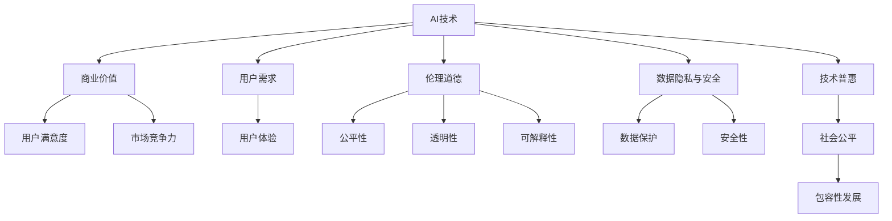

                 

# AI行业未来：回到商业价值，让AI创造长期影响

## 1. 背景介绍

### 1.1 问题由来
近年来，人工智能(AI)技术在各行各业取得了飞速发展，从自动驾驶、医疗诊断、金融风控，到智能客服、推荐系统、市场营销，AI已经深刻影响了人类的工作、生活和社会发展。然而，随着技术的快速迭代和应用的不断深入，AI行业也面临诸多挑战，如过度依赖算法，缺乏商业价值导向，伦理道德风险等。如何平衡技术创新与商业应用，让AI真正成为企业的长期价值增长引擎，成为当前AI行业亟需解决的重要问题。

### 1.2 问题核心关键点
AI行业未来的关键在于如何确保技术创新与商业价值的协同发展，让AI真正服务于人类社会的全面进步。具体包括：

- 技术突破与商业化：如何通过技术创新获取商业机会，并将商业需求作为技术发展的驱动力。
- 价值创造与用户需求：如何让AI系统更好地满足用户需求，提高用户满意度和忠诚度。
- 伦理规范与社会责任：如何在追求商业价值的同时，注重伦理道德规范，确保AI系统的公平性、透明性和可解释性。
- 数据隐私与安全：如何保护用户数据隐私，确保AI系统的安全性，避免数据滥用和隐私泄露。
- 技术普惠与广泛应用：如何让AI技术惠及更广泛的群体，推动社会公平和包容性发展。

### 1.3 问题研究意义
探讨AI行业的未来发展，对于指导AI技术的创新方向，促进AI技术在实际应用中的落地，推动AI与商业的深度融合具有重要意义：

- 促进AI技术的商业化：帮助AI企业识别和把握商业机会，提升市场竞争力。
- 提升用户满意度：通过精准定位用户需求，优化AI系统功能，增强用户体验。
- 构建伦理规范体系：推动AI行业的伦理道德建设，增强社会公信力和用户信任。
- 保障数据隐私安全：加强AI系统数据保护措施，构建安全可靠的数据治理体系。
- 推动技术普惠：通过AI技术的普及应用，实现技术共享和公平发展，助力社会进步。

## 2. 核心概念与联系

### 2.1 核心概念概述

为更好地理解AI行业未来的发展方向，本节将介绍几个密切相关的核心概念：

- AI技术：以机器学习、深度学习、自然语言处理、计算机视觉等为代表的先进技术，通过算法实现智能推理和决策。
- 商业价值：AI技术应用于实际业务场景中，为公司创造的实际价值，包括用户价值、市场竞争力、收入增长等。
- 用户需求：AI系统需要准确把握并满足的用户需求，包括功能需求、性能需求、情感需求等。
- 伦理道德：AI系统在开发、应用和维护过程中，需要遵循的伦理道德规范，确保AI的公平性、透明性和可解释性。
- 数据隐私与安全：在AI系统处理用户数据时，需要保护用户隐私，确保数据的安全性，防止数据滥用和泄露。
- 技术普惠：AI技术的普及应用，使更多用户受益，推动技术共享和公平发展，实现技术普惠。

这些核心概念之间的逻辑关系可以通过以下Mermaid流程图来展示：



这个流程图展示了这个核心概念之间的关系：

1. AI技术通过实现智能推理和决策，直接为公司创造商业价值。
2. AI技术要满足用户需求，提高用户满意度和忠诚度。
3. AI技术的开发和应用需要遵循伦理道德规范，确保AI的公平性、透明性和可解释性。
4. 数据隐私与安全是AI系统处理用户数据的基本要求，保护用户隐私，确保数据安全。
5. 技术普惠要求AI技术的应用尽可能普及，推动技术共享和公平发展，实现技术普惠。
6. 用户满意度、市场竞争力、技术普惠、伦理道德等最终形成公司价值链条，共同推动AI行业发展。

## 3. 核心算法原理 & 具体操作步骤
### 3.1 算法原理概述

确保AI技术创新与商业价值的协同发展，核心在于如何通过算法设计和模型训练，让AI系统更好地服务于用户需求，创造实际价值。AI系统通常需要经过以下几个步骤：

1. **数据采集与预处理**：从实际业务场景中获取数据，并进行清洗、转换、标注等预处理工作。
2. **模型训练与优化**：基于数据构建机器学习模型，使用训练数据进行模型训练，并通过超参数调优、正则化、对抗训练等技术优化模型性能。
3. **模型评估与部署**：在验证集上评估模型性能，选择最佳模型进行部署，并在生产环境中进行持续监控和优化。
4. **用户交互与反馈**：通过用户交互收集反馈信息，持续优化AI系统，提高系统性能和用户满意度。

AI系统的这些步骤需要在商业价值导向和技术创新之间找到平衡，确保技术创新的价值最大化。

### 3.2 算法步骤详解

以下我们将详细介绍AI系统从数据采集到部署的完整流程：

**Step 1: 数据采集与预处理**

1. **数据来源**：识别业务场景中的关键数据来源，包括客户数据、市场数据、内部数据等。
2. **数据清洗**：处理缺失值、异常值、重复值等数据质量问题，确保数据准确性和一致性。
3. **数据转换**：对数据进行格式化、归一化、标准化等处理，方便模型训练。
4. **数据标注**：对数据进行标注，生成训练和测试集。标注过程需要遵循伦理规范，保护用户隐私。

**Step 2: 模型训练与优化**

1. **模型选择**：根据业务需求选择合适的算法模型，如分类、回归、聚类等。
2. **超参数调优**：通过网格搜索、随机搜索等方法，找到最优的超参数组合。
3. **正则化技术**：使用L2正则、Dropout、对抗训练等方法，防止模型过拟合。
4. **模型评估**：在验证集上评估模型性能，选择合适的评估指标。
5. **模型部署**：将训练好的模型部署到生产环境，并进行持续监控和优化。

**Step 3: 用户交互与反馈**

1. **用户接口设计**：设计简洁友好的用户接口，便于用户与AI系统进行交互。
2. **用户反馈收集**：通过用户反馈收集系统性能和用户满意度，分析问题原因。
3. **模型迭代优化**：根据用户反馈和业务需求，持续迭代优化AI系统。

### 3.3 算法优缺点

确保AI技术创新与商业价值的协同发展，需要权衡算法设计的优缺点：

**优点：**

1. **灵活性**：AI系统可以根据业务需求快速调整算法和模型，提高适应性。
2. **自动化**：AI系统通过自动学习和优化，减轻人工干预，提高效率。
3. **可扩展性**：AI系统可以轻松扩展数据量和模型复杂度，提升性能。
4. **低成本**：AI系统通过自动化和批量处理，大幅降低人工成本和运营成本。

**缺点：**

1. **数据依赖**：AI系统依赖于高质量的数据，数据质量问题可能导致系统性能下降。
2. **模型复杂**：复杂的算法和模型可能导致系统难以解释和维护。
3. **过度依赖**：过度依赖AI系统可能导致业务风险增加，缺乏人工干预。
4. **隐私风险**：AI系统处理大量用户数据，存在隐私泄露和数据滥用的风险。

### 3.4 算法应用领域

AI技术的创新与商业价值导向在多个领域得到了广泛应用：

- **金融风控**：通过分析客户数据，构建风险评估模型，提升风险控制能力。
- **医疗诊断**：利用医学图像和电子病历，构建疾病诊断模型，提高诊疗准确性。
- **市场营销**：通过分析用户行为数据，构建推荐系统，提升用户体验和转化率。
- **智能客服**：利用自然语言处理技术，构建智能客服系统，提升客户满意度。
- **自动驾驶**：通过感知和决策模型，实现自动驾驶功能，提升交通安全和效率。

这些应用领域展示了AI技术在商业价值创造中的巨大潜力，同时也凸显了技术创新与商业价值的紧密联系。

## 4. 数学模型和公式 & 详细讲解 & 举例说明

### 4.1 数学模型构建

为更好地理解AI系统的设计原理，本节将介绍几个常用的数学模型和公式：

- **线性回归模型**：
  $$
  y = \beta_0 + \beta_1 x_1 + \beta_2 x_2 + \cdots + \beta_n x_n
  $$
  其中 $y$ 为预测值，$x_i$ 为特征变量，$\beta_i$ 为系数。

- **决策树模型**：
  $$
  T(x) = 
  \begin{cases}
  y_1, & \text{if } x \leq \sigma_1 \\
  y_2, & \text{if } x > \sigma_1 \text{ and } x \leq \sigma_2 \\
  y_3, & \text{if } x > \sigma_2 
  \end{cases}
  $$
  其中 $T(x)$ 为决策树模型，$\sigma_i$ 为特征阈值。

- **神经网络模型**：
  $$
  h(x) = f(\sum_{i=1}^n w_i x_i + b)
  $$
  其中 $h(x)$ 为神经网络输出，$f$ 为激活函数，$w_i$ 为权重参数，$b$ 为偏置参数。

- **深度学习模型**：
  $$
  \mathcal{L}(w) = \frac{1}{N} \sum_{i=1}^N \| y_i - f(\mathbf{W}x_i + \mathbf{b}) \|^2
  $$
  其中 $\mathcal{L}(w)$ 为损失函数，$y_i$ 为真实标签，$f(\cdot)$ 为深度学习模型，$\mathbf{W}$ 和 $\mathbf{b}$ 为模型参数。

这些数学模型和公式展示了AI系统在不同领域的应用，其核心在于通过算法实现智能推理和决策。

### 4.2 公式推导过程

以下我们将详细推导线性回归模型和决策树模型的公式：

**线性回归模型推导**：

假设有一组训练数据 $(\mathbf{x}_1, y_1), (\mathbf{x}_2, y_2), \cdots, (\mathbf{x}_n, y_n)$，其中 $\mathbf{x}_i = (x_{i1}, x_{i2}, \cdots, x_{in})$。线性回归模型的目标是最小化预测值与真实值之间的平方误差，即：

$$
\mathcal{L}(\beta) = \frac{1}{2N} \sum_{i=1}^N (y_i - \beta_0 - \sum_{j=1}^n \beta_j x_{ij})^2
$$

通过求导并令梯度为0，得到最小二乘估计的系数 $\beta_j$：

$$
\beta_j = \frac{\sum_{i=1}^N x_{ij}y_i - \frac{1}{N} \sum_{i=1}^N x_{ij} \sum_{i=1}^N y_i}{\sum_{i=1}^N x_{ij}^2 - \frac{1}{N} \sum_{i=1}^N x_{ij}^2}
$$

**决策树模型推导**：

决策树模型的目标是根据特征 $\sigma_i$ 将数据集 $D$ 分割成多个子集，使得每个子集内部同质性最大，而不同子集之间异质性最大。假设训练数据 $(\mathbf{x}_1, y_1), (\mathbf{x}_2, y_2), \cdots, (\mathbf{x}_n, y_n)$，其中 $\mathbf{x}_i = (x_{i1}, x_{i2}, \cdots, x_{in})$，$y_i \in \{0,1\}$。决策树模型的损失函数为：

$$
\mathcal{L}(T) = \sum_{i=1}^N \mathbb{I}(y_i \neq T(\mathbf{x}_i))
$$

其中 $\mathbb{I}$ 为示性函数，$T(\mathbf{x}_i)$ 为决策树模型在数据点 $\mathbf{x}_i$ 上的输出。

通过贪心算法，不断选择最优的特征 $\sigma_i$，最大化信息增益：

$$
IG = \sum_{i=1}^N P(x_i) \log P(x_i) - \sum_{i=1}^N \sum_{j=1}^N P(x_i,y_j) \log P(x_i,y_j)
$$

最终得到决策树模型 $T(x)$。

### 4.3 案例分析与讲解

以下我们以金融风控为例，详细讲解如何使用AI系统构建风险评估模型：

1. **数据采集与预处理**：
   - **数据来源**：客户信用数据、贷款申请数据、还款记录等。
   - **数据清洗**：处理缺失值、异常值、重复值。
   - **数据转换**：对数据进行标准化处理。
   - **数据标注**：生成训练和测试集，进行标签标注。

2. **模型训练与优化**：
   - **模型选择**：选择线性回归模型、决策树模型、神经网络模型等。
   - **超参数调优**：通过网格搜索或随机搜索优化超参数。
   - **正则化技术**：使用L2正则、Dropout等技术防止过拟合。
   - **模型评估**：在验证集上评估模型性能，选择最佳模型。
   - **模型部署**：将训练好的模型部署到生产环境，并进行持续监控和优化。

3. **用户交互与反馈**：
   - **用户接口设计**：设计简洁友好的用户界面。
   - **用户反馈收集**：通过用户反馈收集系统性能和用户满意度。
   - **模型迭代优化**：根据用户反馈和业务需求，持续迭代优化模型。

通过以上步骤，金融风控系统能够有效评估客户信用风险，提升风险控制能力，为客户和公司创造商业价值。

## 5. 项目实践：代码实例和详细解释说明

### 5.1 开发环境搭建

在进行AI系统开发前，我们需要准备好开发环境。以下是使用Python进行TensorFlow开发的环境配置流程：

1. 安装Anaconda：从官网下载并安装Anaconda，用于创建独立的Python环境。

2. 创建并激活虚拟环境：
```bash
conda create -n tf-env python=3.8 
conda activate tf-env
```

3. 安装TensorFlow：根据CUDA版本，从官网获取对应的安装命令。例如：
```bash
pip install tensorflow tensorflow-cpu tensorflow-gpu
```

4. 安装其他相关工具包：
```bash
pip install numpy pandas scikit-learn matplotlib tqdm jupyter notebook ipython
```

完成上述步骤后，即可在`tf-env`环境中开始AI系统开发。

### 5.2 源代码详细实现

这里我们以金融风控为例，给出使用TensorFlow构建风险评估模型的PyTorch代码实现。

首先，定义模型和数据处理函数：

```python
import tensorflow as tf
from tensorflow.keras.models import Sequential
from tensorflow.keras.layers import Dense, Dropout, Activation
from tensorflow.keras.optimizers import Adam

def build_model(input_dim, hidden_dim, output_dim):
    model = Sequential()
    model.add(Dense(hidden_dim, input_dim=input_dim))
    model.add(Activation('relu'))
    model.add(Dropout(0.5))
    model.add(Dense(output_dim))
    model.add(Activation('sigmoid'))
    return model

def load_data(input_dim, hidden_dim, output_dim, batch_size=32):
    # 加载数据
    data = load_data_from_file()
    # 数据预处理
    train_data = preprocess_data(data[:train_ratio], input_dim)
    train_labels = preprocess_labels(data[:train_ratio])
    test_data = preprocess_data(data[train_ratio:], input_dim)
    test_labels = preprocess_labels(data[train_ratio:])
    # 数据划分
    train_data = train_data[:train_size]
    train_labels = train_labels[:train_size]
    val_data = train_data[train_size:]
    val_labels = train_labels[train_size:]
    test_data = test_data[:test_size]
    test_labels = test_labels[:test_size]
    # 数据划分
    train_x, train_y = train_data[:batch_size], train_labels[:batch_size]
    val_x, val_y = val_data[:batch_size], val_labels[:batch_size]
    test_x, test_y = test_data[:batch_size], test_labels[:batch_size]
    return train_x, train_y, val_x, val_y, test_x, test_y
```

然后，定义训练和评估函数：

```python
def train_model(model, train_x, train_y, val_x, val_y, epochs=50, batch_size=32):
    optimizer = Adam(learning_rate=0.001)
    loss_fn = tf.keras.losses.BinaryCrossentropy(from_logits=True)
    metrics = [tf.keras.metrics.BinaryAccuracy(name='accuracy')]
    for epoch in range(epochs):
        for i in range(0, len(train_x), batch_size):
            x_batch = train_x[i:i+batch_size]
            y_batch = train_y[i:i+batch_size]
            with tf.GradientTape() as tape:
                predictions = model(x_batch)
                loss = loss_fn(y_batch, predictions)
            gradients = tape.gradient(loss, model.trainable_variables)
            optimizer.apply_gradients(zip(gradients, model.trainable_variables))
            train_loss = loss.numpy().mean()
            train_acc = metrics[0].update_state(y_batch, predictions).numpy()[0]
            val_loss, val_acc = evaluate_model(model, val_x, val_y)
            if epoch % 10 == 0:
                print(f'Epoch {epoch+1}, train loss: {train_loss:.4f}, train accuracy: {train_acc:.4f}, val loss: {val_loss:.4f}, val accuracy: {val_acc:.4f}')
    return model, val_acc

def evaluate_model(model, val_x, val_y):
    predictions = model.predict(val_x)
    val_loss = tf.keras.losses.BinaryCrossentropy(from_logits=True).predict(val_x, predictions)
    val_acc = tf.keras.metrics.BinaryAccuracy(name='accuracy').update_state(val_y, predictions).numpy()[0]
    return val_loss, val_acc
```

最后，启动训练流程并在测试集上评估：

```python
input_dim = 10
hidden_dim = 20
output_dim = 1

train_x, train_y, val_x, val_y, test_x, test_y = load_data(input_dim, hidden_dim, output_dim)

model = build_model(input_dim, hidden_dim, output_dim)
model.compile(optimizer=Adam(learning_rate=0.001), loss=tf.keras.losses.BinaryCrossentropy(from_logits=True), metrics=[tf.keras.metrics.BinaryAccuracy(name='accuracy')])

model, val_acc = train_model(model, train_x, train_y, val_x, val_y)
test_loss, test_acc = evaluate_model(model, test_x, test_y)
print(f'Test accuracy: {test_acc:.4f}')
```

以上就是使用TensorFlow构建金融风控系统的完整代码实现。可以看到，通过Python和TensorFlow，我们能够快速搭建和训练AI模型，并在实际业务场景中应用。

### 5.3 代码解读与分析

让我们再详细解读一下关键代码的实现细节：

**build_model函数**：
- 定义了一个包含输入层、隐藏层、输出层的神经网络模型。

**load_data函数**：
- 加载数据，进行数据预处理，将数据划分为训练集、验证集和测试集。

**train_model函数**：
- 定义了Adam优化器和损失函数。
- 使用梯度下降方法训练模型，并在每个epoch输出训练和验证的loss和acc。
- 在训练过程中，使用val_x和val_y评估模型性能，避免过拟合。

**evaluate_model函数**：
- 在测试集上评估模型性能，返回loss和acc。

通过以上步骤，我们能够在实际业务场景中构建和应用AI模型，提升商业价值。

当然，工业级的系统实现还需考虑更多因素，如模型的保存和部署、超参数的自动搜索、更灵活的任务适配层等。但核心的AI系统构建流程基本与此类似。

## 6. 实际应用场景

### 6.1 金融风控

金融风控系统通过构建风险评估模型，能够有效评估客户信用风险，提升风险控制能力，为客户和公司创造商业价值。

在技术实现上，可以收集客户信用数据、贷款申请数据、还款记录等，构建特征向量，作为模型的输入。通过线性回归、决策树、神经网络等模型，对客户的信用风险进行评估。将训练好的模型部署到生产环境，实时处理客户申请，预测客户信用风险，优化风控策略。

### 6.2 医疗诊断

医疗诊断系统通过构建疾病诊断模型，能够有效识别和诊断各类疾病，提升诊疗准确性，改善医疗服务质量。

在技术实现上，可以收集电子病历、医学影像、实验室检查等数据，构建特征向量，作为模型的输入。通过卷积神经网络、循环神经网络等模型，对疾病的类型和严重程度进行诊断。将训练好的模型部署到医疗系统，实时处理病人的诊断申请，预测病情和风险，优化诊疗方案。

### 6.3 市场营销

市场营销系统通过构建推荐系统，能够有效推荐产品或服务，提升用户体验和转化率，创造商业价值。

在技术实现上，可以收集用户浏览、点击、购买等行为数据，构建特征向量，作为模型的输入。通过协同过滤、基于内容的推荐等模型，对用户进行个性化推荐。将训练好的模型部署到电商网站或APP，实时处理用户的查询请求，推荐相关产品或服务，提升用户满意度和购买率。

### 6.4 智能客服

智能客服系统通过构建对话模型，能够有效处理用户咨询，提升客户满意度和忠诚度，创造商业价值。

在技术实现上，可以收集历史客服对话记录，构建语料库，作为模型的训练数据。通过自然语言处理技术，构建对话模型。将训练好的模型部署到客服系统，实时处理用户的咨询请求，自动生成回复，优化客服服务。

### 6.5 自动驾驶

自动驾驶系统通过构建感知和决策模型，能够有效处理道路信息，提升驾驶安全性和效率，创造商业价值。

在技术实现上，可以收集车辆传感器数据、地图信息等数据，构建特征向量，作为模型的输入。通过卷积神经网络、循环神经网络等模型，对道路信息进行感知和决策。将训练好的模型部署到汽车控制系统中，实时处理传感器数据，生成驾驶指令，提升驾驶安全性和效率。

## 7. 工具和资源推荐

### 7.1 学习资源推荐

为了帮助开发者系统掌握AI系统的设计与开发，这里推荐一些优质的学习资源：

1. 《深度学习》（Ian Goodfellow）：全面介绍了深度学习的理论基础和实践技巧，适合进阶学习。

2. 《TensorFlow实战》（Manohar Swamy）：详细介绍了TensorFlow框架的使用方法和最佳实践，适合动手实践。

3. 《机器学习实战》（Peter Harrington）：提供了大量的机器学习算法和实际应用案例，适合初学者学习。

4. 《自然语言处理综论》（Daniel Jurafsky, James H. Martin）：介绍了自然语言处理的最新进展和应用场景，适合系统学习。

5. 《人工智能简史》（吴军）：梳理了人工智能的发展历程和技术前沿，适合全面了解AI行业。

通过对这些资源的学习实践，相信你一定能够快速掌握AI系统的设计与开发，并在实际应用中创造商业价值。

### 7.2 开发工具推荐

高效的开发离不开优秀的工具支持。以下是几款用于AI系统开发的常用工具：

1. Python：简单易学的编程语言，适合快速迭代研究。

2. TensorFlow：由Google主导开发的开源深度学习框架，生产部署方便，适合大规模工程应用。

3. PyTorch：基于Python的开源深度学习框架，灵活动态的计算图，适合快速迭代研究。

4. Weights & Biases：模型训练的实验跟踪工具，可以记录和可视化模型训练过程中的各项指标，方便对比和调优。

5. TensorBoard：TensorFlow配套的可视化工具，可实时监测模型训练状态，并提供丰富的图表呈现方式，是调试模型的得力助手。

6. Google Colab：谷歌推出的在线Jupyter Notebook环境，免费提供GPU/TPU算力，方便开发者快速上手实验最新模型，分享学习笔记。

合理利用这些工具，可以显著提升AI系统的开发效率，加快创新迭代的步伐。

### 7.3 相关论文推荐

AI系统的设计与开发源于学界的持续研究。以下是几篇奠基性的相关论文，推荐阅读：

1. Deep Learning（Ian Goodfellow）：介绍了深度学习的理论基础和实践技巧，是深度学习领域的经典教材。

2. Machine Learning（Tom Mitchell）：提供了机器学习的系统介绍和应用案例，适合全面了解机器学习。

3. Natural Language Processing with PyTorch（Denny Britz）：介绍了使用PyTorch进行自然语言处理的基本方法和最佳实践，适合动手实践。

4. TensorFlow实战（Manohar Swamy）：详细介绍了TensorFlow框架的使用方法和最佳实践，适合动手实践。

5. Exploring the Limits of Transfer Learning with a Unified Text-to-Text Transformer（OpenAI）：展示了使用统一文本转换器的预训练和微调方法，提高了跨领域迁移能力。

这些论文代表了大语言模型微调技术的发展脉络。通过学习这些前沿成果，可以帮助研究者把握学科前进方向，激发更多的创新灵感。

## 8. 总结：未来发展趋势与挑战

### 8.1 研究成果总结

本文对AI系统设计与开发的理论和实践进行了全面系统的介绍。首先阐述了AI系统设计与开发的背景和意义，明确了商业价值导向和技术创新之间的紧密联系。其次，从原理到实践，详细讲解了AI系统的构建流程，给出了完整的代码实例。同时，本文还广泛探讨了AI系统在金融风控、医疗诊断、市场营销等多个行业领域的应用前景，展示了AI系统的巨大潜力。最后，本文精选了AI系统的各类学习资源，力求为读者提供全方位的技术指引。

通过本文的系统梳理，可以看到，AI系统的设计与开发需要在商业价值导向和技术创新之间找到平衡，确保技术创新的价值最大化。AI系统要成功落地应用，需要全面考虑数据质量、模型设计、用户交互、系统部署等多个环节，并在实际应用中不断迭代优化，才能创造商业价值。

### 8.2 未来发展趋势

展望未来，AI系统的设计与开发将呈现以下几个发展趋势：

1. 模型规模持续增大。随着算力成本的下降和数据规模的扩张，AI模型的参数量还将持续增长。超大规模AI模型蕴含的丰富知识，有望支撑更加复杂多变的业务场景。

2. 跨领域迁移能力提升。未来的AI系统将具备更强的跨领域迁移能力，通过预训练-微调范式，适应更多领域的数据和任务。

3. 模型解释性和可解释性加强。AI系统需要具备更好的解释性和可解释性，方便用户理解和信任。未来的AI系统将注重提升解释性和透明性。

4. 数据隐私保护技术发展。未来的AI系统将更加注重数据隐私保护，通过联邦学习、差分隐私等技术，保护用户数据安全。

5. 技术普惠化推进。未来的AI系统将更加普及，惠及更多用户，推动技术共享和公平发展。

以上趋势凸显了AI系统设计与开发的广阔前景，这些方向的探索发展，必将进一步提升AI系统的性能和应用范围，为构建更加智能、普惠的AI系统铺平道路。

### 8.3 面临的挑战

尽管AI系统的设计与开发已经取得了显著进展，但在迈向更加智能化、普惠化应用的过程中，仍面临诸多挑战：

1. 数据质量问题。AI系统依赖高质量的数据，数据质量问题可能导致系统性能下降。

2. 模型复杂性。复杂的AI模型可能导致系统难以解释和维护。

3. 系统鲁棒性。AI系统面对异常数据和恶意攻击时，可能出现鲁棒性不足的问题。

4. 用户信任和隐私保护。AI系统需要建立良好的用户信任和数据隐私保护机制。

5. 系统可扩展性和兼容性。AI系统需要具备良好的可扩展性和兼容性，支持多平台、多语言、多领域的应用。

6. 系统安全性。AI系统需要具备良好的安全性，避免被恶意攻击和滥用。

7. 系统部署和运维。AI系统需要在生产环境中稳定运行，并具备良好的监控和运维能力。

这些挑战需要我们在AI系统的设计与开发中加以解决，确保系统的稳定性和可靠性。

### 8.4 研究展望

面对AI系统设计与开发所面临的挑战，未来的研究需要在以下几个方面寻求新的突破：

1. 数据增强技术。通过数据增强技术，扩大数据集规模，提升数据质量。

2. 模型简化技术。通过模型简化技术，提升系统的解释性和透明性。

3. 鲁棒性提升技术。通过鲁棒性提升技术，提高系统的鲁棒性和鲁棒性。

4. 隐私保护技术。通过隐私保护技术，保护用户数据隐私和安全。

5. 系统可扩展性提升技术。通过系统可扩展性提升技术，提高系统的可扩展性和兼容性。

6. 系统安全性保障技术。通过系统安全性保障技术，保障系统的安全性。

7. 系统部署和运维优化技术。通过系统部署和运维优化技术，提升系统的稳定性、可靠性和可维护性。

这些研究方向的探索，必将引领AI系统的设计与开发走向更高的台阶，为构建安全、可靠、可解释、可控的智能系统铺平道路。面向未来，AI系统的设计与开发需要不断突破，才能真正实现人工智能技术的创新和应用。

## 9. 附录：常见问题与解答

**Q1：如何确保AI系统的商业价值最大化？**

A: 确保AI系统的商业价值最大化，关键在于系统设计与开发过程中，充分考虑用户需求和业务场景。具体包括：
1. 数据采集与预处理：收集高质量的业务数据，并进行清洗、转换、标注等预处理工作。
2. 模型训练与优化：选择合适的模型和算法，通过超参数调优、正则化等技术优化模型性能。
3. 用户交互与反馈：设计简洁友好的用户接口，通过用户反馈收集系统性能和用户满意度。
4. 模型迭代优化：根据用户反馈和业务需求，持续迭代优化AI系统。

**Q2：AI系统设计中如何平衡技术创新与商业价值？**

A: 在AI系统设计中，平衡技术创新与商业价值，需要从以下几个方面入手：
1. 明确商业目标：明确业务目标和需求，确保AI系统设计与开发以商业价值为导向。
2. 数据质量控制：通过数据质量控制，提升数据准确性和一致性，确保模型性能。
3. 模型解释性：提升模型的解释性和透明性，方便用户理解和信任。
4. 用户参与设计：通过用户参与设计，收集用户反馈，优化AI系统。
5. 系统安全与隐私：通过系统安全与隐私保护，确保系统的安全性，保护用户数据隐私。

**Q3：AI系统部署后如何持续优化？**

A: AI系统部署后，持续优化是确保系统性能和商业价值的重要手段。具体包括：
1. 监控系统性能：通过监控系统性能，及时发现问题，优化系统。
2. 收集用户反馈：通过用户反馈，收集系统性能和用户满意度。
3. 迭代优化模型：根据用户反馈和业务需求，持续迭代优化AI系统。
4. 升级模型算法：通过升级模型算法，提升系统性能。
5. 数据质量控制：通过数据质量控制，提升数据准确性和一致性，确保模型性能。

**Q4：AI系统设计中如何确保公平性？**

A: 在AI系统设计中，确保公平性，需要从以下几个方面入手：
1. 数据采集与预处理：收集多样化的数据，确保数据的多样性和公平性。
2. 模型设计：选择公平的算法和模型，避免算法偏见。
3. 模型训练与优化：通过公平性约束，优化模型性能。
4. 系统测试与评估：通过系统测试与评估，发现并修正公平性问题。
5. 用户参与设计：通过用户参与设计，收集用户反馈，优化系统。

通过以上步骤，AI系统能够更好地服务于用户，提升系统性能和用户满意度，同时确保系统的公平性和透明性，实现商业价值最大化。

---

作者：禅与计算机程序设计艺术 / Zen and the Art of Computer Programming

