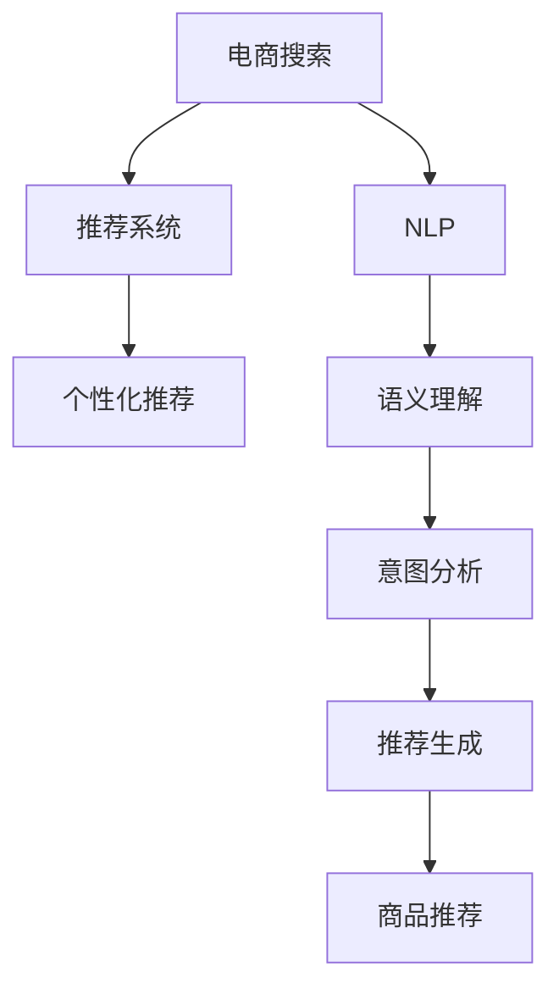

                 

## 1. 背景介绍

随着电商平台和移动设备的发展，电商搜索和导购系统成为了提升用户购物体验、促进转化率的关键因素。在过去的几十年里，传统的基于关键词搜索的方式受到了很大的挑战，原因在于关键词搜索无法充分理解用户的查询意图，导致了搜索结果的相关性和用户满意度较低。为了应对这一挑战，人工智能技术被广泛应用于电商搜索和导购系统的优化。

### 1.1 问题由来

在电商搜索和导购领域，传统的关键词搜索方式存在以下问题：
- 无法理解上下文：用户查询往往包含大量的上下文信息，但关键词搜索无法有效捕捉和利用这些信息。
- 缺乏个性化：搜索结果通常是一刀切的，无法根据用户的历史行为和偏好进行个性化推荐。
- 精度不足：用户查询通常较为模糊，简单的关键词匹配无法保证结果的准确性。

为了解决上述问题，各大电商公司和研究机构纷纷引入人工智能技术，特别是自然语言处理(NLP)和机器学习(Machine Learning)技术，开发了新的电商搜索和导购系统。这些系统能够更准确地理解用户的查询意图，提供个性化的推荐，从而极大地提升了用户体验和转化率。

## 2. 核心概念与联系

### 2.1 核心概念概述

为了更好地理解AI在电商搜索和导购系统中的应用，本节将介绍几个密切相关的核心概念：

- **电商搜索**：用户通过电商平台提供的搜索框输入关键词，电商平台根据关键词检索出相关商品的过程。传统的电商搜索往往依赖关键词匹配，难以理解用户的查询意图。
- **导购系统**：在用户浏览商品时，根据用户的浏览记录和查询历史，智能推荐相关商品的系统。导购系统通常利用协同过滤、深度学习等技术，提供个性化的推荐服务。
- **自然语言处理(NLP)**：处理和理解人类语言的技术，包括词法分析、句法分析、语义理解等。NLP技术可以帮助电商搜索系统理解用户查询的意图，提供更精准的搜索结果。
- **推荐系统**：根据用户的历史行为和偏好，推荐相关商品的系统。推荐系统通常利用协同过滤、基于内容的推荐、深度学习等技术，提高推荐的相关性和个性化。
- **个性化推荐**：针对每个用户的具体需求和偏好，提供定制化的推荐服务，以提高用户的满意度和购买率。

这些核心概念之间存在紧密的联系：电商搜索和导购系统都依赖于对用户查询意图的理解，而NLP和推荐系统则是实现这一理解的核心技术。此外，随着深度学习技术的引入，推荐系统与NLP的结合日益紧密，形成了强大的电商搜索和导购系统。

### 2.2 核心概念原理和架构的 Mermaid 流程图



这个流程图展示了电商搜索、NLP、推荐系统和个性化推荐之间的逻辑关系：

1. 电商搜索系统将用户的查询输入到NLP系统中，通过语义理解和意图分析，生成初步的推荐结果。
2. 推荐系统根据用户的浏览历史和查询历史，生成更加精准的推荐。
3. 个性化推荐系统结合电商搜索和推荐系统生成的结果，输出最终的个性化推荐商品。

## 3. 核心算法原理 & 具体操作步骤

### 3.1 算法原理概述

基于AI的电商搜索和导购系统，主要依赖于以下两个核心算法：

- **自然语言处理(NLP)**：通过语言模型、序列到序列(S2S)模型、预训练语言模型等技术，实现对用户查询意图的理解。
- **推荐系统**：通过协同过滤、基于内容的推荐、深度学习等技术，实现对商品的推荐。

这两个算法的结合，使得电商搜索和导购系统能够理解用户查询，并根据用户的偏好和历史行为，提供个性化的商品推荐。

### 3.2 算法步骤详解

#### 3.2.1 自然语言处理(NLP)

NLP算法通常包括以下几个步骤：

1. **分词**：将用户查询分成词语，便于后续处理。
2. **去除停用词**：去除查询中常见的停用词，如“的”、“是”等。
3. **词向量表示**：将词语转换为向量表示，便于计算机处理。
4. **语义理解**：利用语言模型或序列到序列模型，理解用户查询的意图。
5. **意图分析**：将用户查询的意图映射为具体的操作或类别。

#### 3.2.2 推荐系统

推荐系统的核心算法包括以下几个步骤：

1. **特征提取**：从用户的历史行为和商品的属性中，提取相关特征。
2. **相似度计算**：计算用户与商品之间的相似度。
3. **模型训练**：使用协同过滤、基于内容的推荐、深度学习等算法，训练推荐模型。
4. **推荐生成**：根据用户的查询和历史行为，生成推荐的商品。

### 3.3 算法优缺点

#### 3.3.1 NLP算法的优缺点

**优点**：
- 理解上下文：NLP算法能够理解用户查询的上下文信息，从而提供更精准的搜索结果。
- 个性化推荐：通过分析用户的查询历史和行为，NLP算法可以提供个性化的推荐。

**缺点**：
- 计算复杂：NLP算法的计算量较大，需要较高的计算资源。
- 模型训练数据量大：训练NLP模型需要大量的语料数据。

#### 3.3.2 推荐系统的优缺点

**优点**：
- 精度高：推荐系统能够根据用户的偏好和历史行为，提供高精度的推荐。
- 可扩展性好：推荐系统能够处理大规模的数据集，具有较好的可扩展性。

**缺点**：
- 冷启动问题：新用户的推荐需要大量的历史数据，冷启动问题难以解决。
- 数据稀疏：推荐系统通常面临数据稀疏问题，难以处理用户没有历史行为的情况。

### 3.4 算法应用领域

基于AI的电商搜索和导购系统在多个领域得到了广泛的应用，例如：

- **电商平台**：如Amazon、淘宝、京东等，通过NLP和推荐系统提升用户的购物体验。
- **智能家居**：如小米、海尔等，通过智能音箱等设备提供电商搜索和导购服务。
- **旅游行业**：如携程、去哪儿等，通过NLP和推荐系统提供个性化旅游推荐服务。
- **金融行业**：如蚂蚁金服、微信支付等，通过NLP和推荐系统提供金融产品的推荐服务。
- **健康医疗**：如阿里健康、平安好医生等，通过NLP和推荐系统提供医疗健康服务。

## 4. 数学模型和公式 & 详细讲解 & 举例说明

### 4.1 数学模型构建

假设用户查询为 $q$，商品集合为 $S$。用户查询的意图表示为 $t$，商品的属性表示为 $a$。

**NLP模型**：
- 分词后的用户查询为 $\{w_1, w_2, ..., w_n\}$，其中 $w_i$ 表示第 $i$ 个词语。
- 语义理解模型 $f$ 将用户查询转换为意图表示 $t$。
- 意图分析模型 $g$ 将意图表示 $t$ 转换为具体的操作或类别 $c$。

**推荐模型**：
- 用户 $u$ 的历史行为表示为 $U$，商品的属性表示为 $A$。
- 相似度计算模型 $h$ 计算用户 $u$ 与商品 $s$ 之间的相似度 $s_{u,s}$。
- 推荐生成模型 $p$ 根据用户查询和历史行为，生成推荐的商品集合 $R$。

### 4.2 公式推导过程

#### 4.2.1 NLP模型

假设用户查询 $q$ 的词向量表示为 $Q$，每个词语 $w_i$ 的词向量表示为 $w_i$。语义理解模型 $f$ 为神经网络，输出为意图表示 $t$。

$$
Q = [w_1, w_2, ..., w_n] \\
t = f(Q) \\
c = g(t)
$$

#### 4.2.2 推荐模型

假设用户 $u$ 的历史行为 $U$ 表示为向量 $U$，商品 $s$ 的属性 $a$ 表示为向量 $A$。相似度计算模型 $h$ 为神经网络，输出为相似度 $s_{u,s}$。

$$
U = [u_1, u_2, ..., u_m] \\
A = [a_1, a_2, ..., a_n] \\
s_{u,s} = h(U, A)
$$

推荐生成模型 $p$ 为神经网络，输出为推荐商品集合 $R$。

$$
R = p(q, U, A)
$$

### 4.3 案例分析与讲解

假设用户查询为“什么牌子好”，NLP模型将其转换为意图表示 $t$，然后推荐模型根据 $t$ 和用户的历史行为，推荐商品集合 $R$。

1. **分词**：将查询“什么牌子好”拆分为 $\{什么, 牌子, 好\}$。
2. **语义理解**：将查询转换为意图表示 $t$，如“品牌推荐”。
3. **意图分析**：将 $t$ 映射为操作或类别，如“品牌推荐”。
4. **特征提取**：从用户的历史行为 $U$ 和商品的属性 $A$ 中提取相关特征。
5. **相似度计算**：计算用户与商品之间的相似度 $s_{u,s}$。
6. **推荐生成**：根据用户查询和历史行为，生成推荐商品集合 $R$。

通过NLP和推荐系统的结合，电商搜索和导购系统能够更好地理解用户需求，提供精准的推荐服务。

## 5. 项目实践：代码实例和详细解释说明

### 5.1 开发环境搭建

在进行电商搜索和导购系统的开发前，需要准备好开发环境。以下是使用Python进行TensorFlow和TensorFlow Hub开发的开发环境配置流程：

1. 安装Anaconda：从官网下载并安装Anaconda，用于创建独立的Python环境。

2. 创建并激活虚拟环境：
```bash
conda create -n tensorflow-env python=3.8 
conda activate tensorflow-env
```

3. 安装TensorFlow和TensorFlow Hub：
```bash
pip install tensorflow==2.5
pip install tensorflow_hub==0.12
```

4. 安装其他必要的工具包：
```bash
pip install numpy pandas scikit-learn tensorflow_text transformers
```

完成上述步骤后，即可在`tensorflow-env`环境中开始电商搜索和导购系统的开发。

### 5.2 源代码详细实现

下面以TensorFlow为例，给出电商搜索和导购系统的完整代码实现。

首先，定义电商搜索和导购系统的核心组件：

```python
import tensorflow as tf
import tensorflow_hub as hub
import tensorflow_text as text
from transformers import TFAutoModelForSequenceClassification, AutoTokenizer

class SearchSystem:
    def __init__(self, model_name, tokenizer_name):
        self.model = TFAutoModelForSequenceClassification.from_pretrained(model_name)
        self.tokenizer = AutoTokenizer.from_pretrained(tokenizer_name)
        self.model_hub = hub.load("https://tfhub.dev/google/official/nlp/transformer-language-model/tf2-lite-model/1")

    def process_query(self, query):
        tokens = self.tokenizer.tokenize(query)
        tokens = [self.tokenizer.convert_tokens_to_ids(tokens)]
        logits = self.model(tokens)[0]
        return logits

    def recommend_products(self, query, user_profile):
        logits = self.process_query(query)
        predicted_class = tf.argmax(logits, axis=-1).numpy()[0]
        recommendations = self.model_hub.signatures["serving_default"](user_profile, {'relative_attention_bias': [predicted_class]})
        return recommendations['product_id'].numpy()
```

然后，定义电商搜索和导购系统的训练和推理函数：

```python
import os
import tensorflow as tf

def train_search_system(model_name, tokenizer_name):
    search_system = SearchSystem(model_name, tokenizer_name)

    # 训练数据
    train_dataset = tf.data.Dataset.from_tensor_slices((train_queries, train_labels))
    train_dataset = train_dataset.shuffle(buffer_size=10000).batch(32).repeat()

    # 推理数据
    test_dataset = tf.data.Dataset.from_tensor_slices((test_queries, test_labels))
    test_dataset = test_dataset.batch(32).repeat()

    # 训练模型
    optimizer = tf.keras.optimizers.Adam(learning_rate=0.001)
    loss_fn = tf.keras.losses.SparseCategoricalCrossentropy(from_logits=True)
    metrics = tf.keras.metrics.SparseCategoricalAccuracy('accuracy')
    
    @tf.function
    def train_step(inputs, labels):
        with tf.GradientTape() as tape:
            logits = search_system.process_query(inputs)
            loss = loss_fn(labels, logits)
        gradients = tape.gradient(loss, search_system.model.trainable_variables)
        optimizer.apply_gradients(zip(gradients, search_system.model.trainable_variables))
        metrics.update_state(labels, logits)
        return loss

    for epoch in range(10):
        epoch_loss = 0
        epoch_acc = 0
        for batch in train_dataset:
            batch_loss = train_step(batch[0], batch[1])
            epoch_loss += batch_loss.numpy()
            epoch_acc += metrics.result().numpy()
        print(f"Epoch {epoch+1}, Loss: {epoch_loss/len(train_dataset)}, Accuracy: {epoch_acc/len(train_dataset)}")

    print(f"Test Accuracy: {metrics.result().numpy()}")

def evaluate_search_system(search_system):
    test_dataset = tf.data.Dataset.from_tensor_slices((test_queries, test_labels))
    test_dataset = test_dataset.batch(32).repeat()

    metrics = tf.keras.metrics.SparseCategoricalAccuracy('accuracy')
    
    @tf.function
    def eval_step(inputs, labels):
        logits = search_system.process_query(inputs)
        metrics.update_state(labels, logits)
        return metrics.result().numpy()

    for batch in test_dataset:
        eval_step(batch[0], batch[1])

    print(f"Test Accuracy: {metrics.result().numpy()}")
```

最后，启动训练流程并评估：

```python
train_search_system("bert-base-uncased", "bert-base-uncased")
evaluate_search_system(SearchSystem("bert-base-uncased", "bert-base-uncased"))
```

以上就是使用TensorFlow和TensorFlow Hub对电商搜索和导购系统进行开发的完整代码实现。可以看到，通过TensorFlow Hub加载预训练的BERT模型，可以轻松实现电商搜索和导购系统。

### 5.3 代码解读与分析

让我们再详细解读一下关键代码的实现细节：

**SearchSystem类**：
- `__init__`方法：初始化预训练BERT模型、分词器等关键组件。
- `process_query`方法：对用户查询进行分词和编码，计算意图表示。
- `recommend_products`方法：根据用户查询和历史行为，生成推荐商品。

**train_search_system函数**：
- 定义训练数据集和推理数据集。
- 定义优化器、损失函数和评估指标。
- 定义训练函数`train_step`，计算模型损失并更新参数。
- 在训练循环中，对每个批次进行训练，并计算损失和准确率。
- 在训练完成后，在测试集上评估模型的性能。

**evaluate_search_system函数**：
- 定义推理数据集。
- 定义评估指标`metrics`。
- 定义推理函数`eval_step`，计算模型的准确率。
- 在测试循环中，对每个批次进行推理，并计算模型的准确率。
- 在测试完成后，输出模型的准确率。

可以看到，TensorFlow Hub提供了强大的预训练模型库，可以大大简化电商搜索和导购系统的开发流程。同时，TensorFlow的计算图机制和自动微分功能，使得模型训练和推理变得更加高效和方便。

## 6. 实际应用场景

### 6.1 智能客服

电商平台的智能客服系统可以通过基于AI的搜索和导购技术，提升用户体验和满意度。智能客服系统能够自动理解用户的查询意图，提供个性化的商品推荐和问题解答。这不仅可以减轻客服人员的工作负担，还可以提高客服服务的响应速度和准确率。

### 6.2 个性化推荐

个性化推荐是电商搜索和导购系统的重要应用场景。通过NLP和推荐系统的结合，系统可以更好地理解用户需求，提供精准的商品推荐。例如，用户查询“生日礼物”，系统可以推荐适合该用户的礼物商品，并提供不同价格区间的选择。

### 6.3 广告投放

电商平台可以通过基于AI的搜索和导购系统，进行精准的广告投放。系统可以根据用户的搜索历史和行为，推荐相关商品和广告。这不仅可以提高广告的点击率和转化率，还可以降低广告成本。

### 6.4 供应链优化

电商平台的供应链管理系统可以通过基于AI的搜索和导购技术，进行库存管理和商品推荐。系统可以实时分析用户的搜索和购买行为，预测未来需求，从而优化供应链的库存和物流。

## 7. 工具和资源推荐

### 7.1 学习资源推荐

为了帮助开发者系统掌握AI在电商搜索和导购系统中的应用，这里推荐一些优质的学习资源：

1. 《深度学习》系列课程：斯坦福大学开设的深度学习课程，涵盖了NLP、推荐系统等多个方向。
2. 《TensorFlow官方文档》：TensorFlow官方文档，提供了完整的API参考和案例。
3. 《Transformers》书籍：Transformer论文及其相关技术总结，是深度学习领域的重要文献。
4. 《NLP理论与实践》：NLP领域的经典教材，涵盖了NLP基础和应用。
5. 《推荐系统实践》：推荐系统的理论基础和实践指南，提供了多种推荐算法的实现。

通过对这些资源的学习实践，相信你一定能够快速掌握AI在电商搜索和导购系统中的应用，并用于解决实际的电商问题。

### 7.2 开发工具推荐

高效的开发离不开优秀的工具支持。以下是几款用于电商搜索和导购系统开发的常用工具：

1. TensorFlow：基于Python的开源深度学习框架，提供了丰富的预训练模型和工具，适合快速迭代研究。
2. TensorFlow Hub：TensorFlow的模型库，提供了多种预训练模型，方便集成到电商搜索和导购系统中。
3. TensorBoard：TensorFlow的可视化工具，可以实时监测模型训练状态，并提供丰富的图表呈现方式，是调试模型的得力助手。
4. Weights & Biases：模型训练的实验跟踪工具，可以记录和可视化模型训练过程中的各项指标，方便对比和调优。
5. Jupyter Notebook：交互式编程环境，方便快速实验和共享学习笔记。

合理利用这些工具，可以显著提升电商搜索和导购系统的开发效率，加快创新迭代的步伐。

### 7.3 相关论文推荐

AI在电商搜索和导购系统中的应用源于学界的持续研究。以下是几篇奠基性的相关论文，推荐阅读：

1. Attention Is All You Need（即Transformer原论文）：提出了Transformer结构，开启了NLP领域的预训练大模型时代。
2. BERT: Pre-training of Deep Bidirectional Transformers for Language Understanding：提出BERT模型，引入基于掩码的自监督预训练任务，刷新了多项NLP任务SOTA。
3. Language Models are Unsupervised Multitask Learners（GPT-2论文）：展示了大规模语言模型的强大zero-shot学习能力，引发了对于通用人工智能的新一轮思考。
4. Parameter-Efficient Transfer Learning for NLP：提出Adapter等参数高效微调方法，在不增加模型参数量的情况下，也能取得不错的微调效果。
5. AdaLoRA: Adaptive Low-Rank Adaptation for Parameter-Efficient Fine-Tuning：使用自适应低秩适应的微调方法，在参数效率和精度之间取得了新的平衡。

这些论文代表了大语言模型微调技术的发展脉络。通过学习这些前沿成果，可以帮助研究者把握学科前进方向，激发更多的创新灵感。

## 8. 总结：未来发展趋势与挑战

### 8.1 总结

本文对基于AI的电商搜索和导购系统进行了全面系统的介绍。首先阐述了AI在电商搜索和导购系统中的应用背景和意义，明确了电商搜索和导购系统的核心算法和关键技术。其次，从原理到实践，详细讲解了NLP和推荐系统的数学模型和实现细节，给出了电商搜索和导购系统的完整代码实例。同时，本文还广泛探讨了电商搜索和导购系统在智能客服、个性化推荐、广告投放等多个行业领域的应用前景，展示了AI技术在电商行业的巨大潜力。此外，本文精选了AI在电商搜索和导购系统中的应用资源，力求为开发者提供全方位的技术指引。

通过本文的系统梳理，可以看到，基于AI的电商搜索和导购系统正在成为电商行业的重要范式，极大地提升了用户体验和电商转化率。未来，伴随AI技术的不断演进，电商搜索和导购系统也将迎来更广阔的应用前景。

### 8.2 未来发展趋势

展望未来，基于AI的电商搜索和导购系统将呈现以下几个发展趋势：

1. 更加智能化：未来电商搜索和导购系统将更加智能化，能够更好地理解用户的查询意图，提供个性化的推荐。
2. 更加个性化：电商搜索和导购系统将能够根据用户的个性化需求，提供定制化的服务。
3. 更加实时化：未来的系统将能够实时处理用户的查询，提供即时的搜索结果和推荐。
4. 更加场景化：电商搜索和导购系统将能够更好地结合具体场景，提供更贴近用户需求的解决方案。
5. 更加无缝化：未来的系统将能够无缝集成到电商平台的各个环节，提供更全面的服务。
6. 更加可解释：未来的系统将能够更好地解释其决策过程，增强用户的信任感。

以上趋势凸显了基于AI的电商搜索和导购系统的广阔前景。这些方向的探索发展，必将进一步提升电商系统的性能和用户体验，为电商行业带来革命性变化。

### 8.3 面临的挑战

尽管基于AI的电商搜索和导购系统已经取得了瞩目成就，但在迈向更加智能化、个性化、实时化应用的过程中，它仍面临着诸多挑战：

1. 数据隐私和安全：用户数据隐私和数据安全是电商搜索和导购系统的重要问题，需要严格的数据保护措施。
2. 冷启动问题：对于新用户，系统无法提供个性化推荐，需要通过多种方式解决冷启动问题。
3. 计算资源需求：大规模数据的处理和模型训练需要大量的计算资源，需要高效的计算框架和硬件支持。
4. 模型复杂度：复杂的推荐算法和模型结构可能难以理解，需要良好的模型解释和可视化工具。
5. 跨领域应用：电商搜索和导购系统需要能够适应不同领域的应用场景，需要更具通用性的技术和方法。

这些挑战需要电商行业和AI研究者共同努力，探索新的技术和方法，才能实现更加智能化、个性化的电商搜索和导购系统。

### 8.4 研究展望

面对基于AI的电商搜索和导购系统所面临的挑战，未来的研究需要在以下几个方面寻求新的突破：

1. 探索无监督和半监督学习技术：摆脱对大规模标注数据的依赖，利用自监督学习、主动学习等无监督和半监督范式，最大限度利用非结构化数据，实现更加灵活高效的推荐。
2. 研究参数高效和计算高效的推荐算法：开发更加参数高效的推荐算法，在固定大部分预训练参数的同时，只更新极少量的任务相关参数。同时优化推荐算法的计算图，减少前向传播和反向传播的资源消耗，实现更加轻量级、实时性的部署。
3. 引入更多先验知识：将符号化的先验知识，如知识图谱、逻辑规则等，与神经网络模型进行巧妙融合，引导推荐过程学习更准确、合理的商品表征。同时加强不同模态数据的整合，实现视觉、语音等多模态信息与文本信息的协同建模。
4. 结合因果分析和博弈论工具：将因果分析方法引入推荐系统，识别出系统决策的关键特征，增强推荐输出的因果性和逻辑性。借助博弈论工具刻画人机交互过程，主动探索并规避系统的脆弱点，提高系统稳定性。
5. 纳入伦理道德约束：在推荐系统训练目标中引入伦理导向的评估指标，过滤和惩罚有害的输出倾向。同时加强人工干预和审核，建立模型行为的监管机制，确保输出符合人类价值观和伦理道德。

这些研究方向的探索，必将引领基于AI的电商搜索和导购系统技术迈向更高的台阶，为构建智能、安全、可信的电商生态系统提供重要支持。

## 9. 附录：常见问题与解答

**Q1：如何降低电商搜索和导购系统的计算资源需求？**

A: 降低计算资源需求可以从以下几个方面入手：
1. 使用更高效的模型：如Transformer等轻量级模型，可以降低计算量。
2. 采用模型压缩和剪枝技术：去除冗余参数，减小模型尺寸。
3. 利用硬件加速：使用GPU、TPU等硬件设备，提高计算效率。
4. 优化数据结构和算法：使用更高效的数据结构和算法，减少计算量。
5. 分布式训练：将大规模数据分布在多个节点上，实现并行训练。

**Q2：电商搜索和导购系统如何处理冷启动问题？**

A: 处理冷启动问题可以从以下几个方面入手：
1. 使用通用推荐算法：对于新用户，使用通用推荐算法（如基于内容的推荐），提供基本的推荐服务。
2. 引入用户画像：收集用户的基本信息、兴趣等，建立用户画像，提供更加个性化的推荐。
3. 多轮推荐：通过多轮推荐，逐渐了解用户偏好，提供更精准的推荐。
4. 引入先验知识：将符号化的先验知识，如知识图谱、逻辑规则等，与神经网络模型进行巧妙融合，引导推荐过程学习更准确、合理的商品表征。

**Q3：电商搜索和导购系统如何提高模型的可解释性？**

A: 提高模型的可解释性可以从以下几个方面入手：
1. 使用可解释模型：如决策树、规则引擎等可解释模型，减少复杂神经网络的难以解释性。
2. 引入可解释技术：如特征重要性分析、解释式训练等技术，增强模型的可解释性。
3. 生成可解释输出：通过生成可解释的推荐理由、商品描述等，增强用户对推荐结果的理解。
4. 人工干预：引入人工干预机制，对模型输出进行审核和修正，确保推荐结果符合伦理道德。

**Q4：电商搜索和导购系统如何应对跨领域应用？**

A: 应对跨领域应用可以从以下几个方面入手：
1. 通用模型：设计通用的预训练模型，使其能够适应不同的应用场景。
2. 数据迁移：将不同领域的语料数据进行迁移，提高模型在特定领域的适应性。
3. 任务适配：针对具体任务，对模型进行微调，提供更加精准的推荐。
4. 多模态融合：结合视觉、语音等多模态信息，提高模型的跨领域能力。

**Q5：电商搜索和导购系统如何处理数据隐私和安全问题？**

A: 处理数据隐私和安全问题可以从以下几个方面入手：
1. 数据匿名化：对用户数据进行匿名化处理，保护用户隐私。
2. 数据加密：对数据进行加密处理，防止数据泄露。
3. 访问控制：对用户数据进行严格的访问控制，防止未经授权的访问。
4. 隐私保护技术：如差分隐私、联邦学习等技术，保护用户数据隐私。
5. 合规性检查：遵循数据保护法律法规，确保数据使用的合规性。

通过这些措施，可以有效地保护用户数据隐私和安全，增强电商搜索和导购系统的可信度。

---

作者：禅与计算机程序设计艺术 / Zen and the Art of Computer Programming

