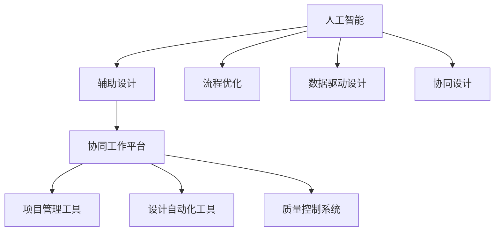

                 

# AI辅助产品设计的流程优化

## 1. 背景介绍

随着人工智能技术的迅速发展，AI辅助设计已经成为现代产品开发不可或缺的一部分。在各行各业，无论是机械、电子、汽车，还是航空航天，AI都正在推动设计流程的优化，提高设计效率，降低设计成本，提升产品质量。然而，在实际应用中，许多设计人员仍面临着数据管理复杂、流程不透明、决策不精准等问题。本文将从多个角度探讨AI辅助产品设计的流程优化方法，提升设计质量和效率，助力企业创新和竞争力的提升。

## 2. 核心概念与联系

### 2.1 核心概念概述

为更好地理解AI辅助产品设计的流程优化，本节将介绍几个密切相关的核心概念：

- **人工智能(AI)**：指通过计算机系统模拟、延伸、扩展人类智能的技术，涉及机器学习、深度学习、计算机视觉等。
- **辅助设计(Aided Design, AD)**：使用计算机辅助完成产品设计流程，提升设计质量和效率的技术，包括CAD、CAM、CAE等。
- **流程优化(Process Optimization)**：通过优化设计流程，消除冗余、瓶颈，提升流程效率和设计质量。
- **数据驱动设计(Data-Driven Design)**：以数据为中心的设计方法，利用数据挖掘、分析等技术，指导设计决策。
- **协同设计(Collaborative Design)**：通过跨部门、跨学科的协作，共享设计资源和信息，提升设计效率和质量。

这些核心概念共同构成了AI辅助产品设计的理论基础，使其能够高效、精准地辅助设计人员完成复杂设计任务。

### 2.2 核心概念原理和架构的 Mermaid 流程图



这个流程图展示了AI辅助设计系统中的核心组件和流程：

1. 人工智能提供智能算法支持。
2. 辅助设计系统提供设计工具和资源。
3. 流程优化技术提升设计效率。
4. 数据驱动设计提供数据支撑。
5. 协同设计实现团队协作。

这些组件通过协同工作平台、项目管理工具、自动化工具和质量控制系统有机结合，形成了一个高效、透明的设计流程。

## 3. 核心算法原理 & 具体操作步骤

### 3.1 算法原理概述

AI辅助产品设计流程优化，基于计算机视觉、自然语言处理、机器学习等技术，通过智能化分析、模拟和优化设计流程，提升设计效率和质量。其核心思想是利用AI算法和大数据分析，对设计流程中的数据进行建模和分析，从而识别瓶颈、优化决策、提升协作效率。

具体来说，流程优化的主要步骤包括：

1. **数据收集与预处理**：收集设计数据、生产数据、用户反馈等，清洗、整合、标注数据。
2. **特征提取与建模**：利用机器学习算法提取数据特征，构建数据模型。
3. **优化算法应用**：通过优化算法（如遗传算法、模拟退火、粒子群等）对设计流程进行模拟和优化。
4. **可视化与反馈**：利用可视化工具展示优化结果，收集设计人员反馈，迭代优化。

### 3.2 算法步骤详解

以下详细说明AI辅助设计流程优化的主要步骤及其具体实现方法。

**Step 1: 数据收集与预处理**
- **数据来源**：设计数据、生产数据、用户反馈、市场调研报告等。
- **数据预处理**：数据清洗（去除噪声、缺失值处理）、数据整合（合并多个数据源）、数据标注（赋予数据标签，如功能需求、设计规范等）。

**Step 2: 特征提取与建模**
- **特征提取**：利用计算机视觉、自然语言处理等技术提取数据特征，如形状、尺寸、颜色、纹理、材料等。
- **模型构建**：选择适当的机器学习算法（如决策树、随机森林、神经网络等）对数据建模。

**Step 3: 优化算法应用**
- **算法选择**：根据优化目标选择合适的算法，如遗传算法、模拟退火、粒子群等。
- **参数设置**：设置算法的超参数，如种群大小、迭代次数、交叉率等。
- **模拟与优化**：利用算法对设计流程进行模拟，优化设计参数和流程路径。

**Step 4: 可视化与反馈**
- **结果展示**：通过可视化工具（如Tableau、Power BI等）展示优化结果，生成图表、报表等。
- **反馈收集**：收集设计人员的反馈，评估优化效果，进行调整和改进。
- **迭代优化**：根据反馈结果，重复进行数据收集、特征提取、模型构建、优化算法应用和结果展示，直至达到满意的设计效果。

### 3.3 算法优缺点

AI辅助产品设计流程优化具有以下优点：
1. **高效**：通过自动化、智能化的分析，大大缩短设计周期，提升设计效率。
2. **精准**：利用数据分析和模型优化，精确识别设计中的问题和瓶颈，提升设计质量。
3. **透明**：通过可视化工具展示优化过程和结果，提高设计决策的透明度和可解释性。
4. **协作**：支持跨部门、跨学科的协作，共享设计资源和信息，提升团队效率。

同时，该方法也存在一定的局限性：
1. **数据依赖**：优化效果高度依赖于数据的完整性和质量，获取高质量数据成本较高。
2. **算法复杂性**：优化算法复杂，需要专业知识和经验，对技术要求较高。
3. **模型泛化**：模型需要具备良好的泛化能力，避免过拟合，对数据样本量有较高要求。
4. **资源消耗**：优化过程涉及大量计算，需要高性能计算资源，对硬件要求较高。

尽管存在这些局限性，但就目前而言，基于AI辅助的产品设计流程优化方法仍是大规模设计中的一种重要手段。未来相关研究的重点在于如何进一步降低对数据和算力资源的依赖，提高模型的泛化能力，优化协作方式，从而实现更加高效、精准的设计流程。

### 3.4 算法应用领域

AI辅助产品设计流程优化方法在多个行业领域中得到了广泛应用，例如：

- **机械设计**：利用计算机视觉技术，自动检测零件尺寸、形状缺陷，提升加工精度。
- **电子设计**：通过自然语言处理技术，自动生成电路设计方案，优化电路性能。
- **汽车设计**：利用机器学习算法，自动分析车辆性能数据，优化设计参数。
- **航空航天**：利用数据驱动设计，优化飞行器气动性能，提升燃油效率。
- **医药设计**：通过模拟退火算法，优化药物分子结构，提升药物效果。

此外，AI辅助设计还应用于新产品开发、旧产品改进、生产工艺优化等多个方面，为企业创新和竞争力提升提供了有力支持。

## 4. 数学模型和公式 & 详细讲解 & 举例说明

### 4.1 数学模型构建

本节将使用数学语言对AI辅助产品设计流程优化过程进行更加严格的刻画。

设设计流程中的参数为 $\theta$，目标函数为 $f(\theta)$，代表设计效果或成本。则设计优化的目标为最小化目标函数：

$$
\theta^* = \mathop{\arg\min}_{\theta} f(\theta)
$$

在实际应用中，$f(\theta)$ 通常是一个复杂的非线性函数，需要借助机器学习算法进行建模和优化。

### 4.2 公式推导过程

以优化汽车设计为例，假设设计中需要优化的一个重要参数为发动机排量 $V$，其影响因素包括发动机体积 $V_{\text{vol}}$、燃油效率 $\eta_{\text{fu}}$、动力性能 $P$ 等。可以构建如下目标函数：

$$
f(V) = \lambda V_{\text{vol}} + (1-\lambda) \frac{P}{\eta_{\text{fu}}}
$$

其中 $\lambda$ 为权衡因子，调节不同因素之间的权重。目标是最小化上述函数，即寻找最优的发动机排量 $V^*$。

根据上述目标函数，利用梯度下降算法对 $V$ 进行迭代优化：

$$
V \leftarrow V - \eta \nabla_{V} f(V)
$$

其中 $\eta$ 为学习率，$\nabla_{V} f(V)$ 为目标函数对 $V$ 的梯度，可通过自动微分技术高效计算。

### 4.3 案例分析与讲解

假设某汽车设计公司想要优化其最新款轿车的燃油效率，目标是提升燃油经济性，同时保证动力性能。根据以上模型，可以收集大量的发动机排量、体积、燃油效率、动力性能等数据，构建数据集 $D$。

将数据集 $D$ 划分为训练集 $D_{\text{train}}$ 和测试集 $D_{\text{test}}$，利用机器学习算法（如神经网络）对 $f(V)$ 进行建模：

$$
f(V) = f_{\theta}(V)
$$

其中 $\theta$ 为模型参数。利用训练集 $D_{\text{train}}$ 对模型进行训练，得到最优的模型参数 $\theta^*$，然后利用测试集 $D_{\text{test}}$ 对模型进行评估：

$$
f^* = f_{\theta^*}(V)
$$

根据评估结果，找到最优的发动机排量 $V^*$，作为设计决策的依据。

## 5. 项目实践：代码实例和详细解释说明

### 5.1 开发环境搭建

在进行AI辅助设计流程优化实践前，我们需要准备好开发环境。以下是使用Python进行TensorFlow开发的环境配置流程：

1. 安装Anaconda：从官网下载并安装Anaconda，用于创建独立的Python环境。

2. 创建并激活虚拟环境：
```bash
conda create -n tf-env python=3.8 
conda activate tf-env
```

3. 安装TensorFlow：根据CUDA版本，从官网获取对应的安装命令。例如：
```bash
conda install tensorflow -c tf -c conda-forge
```

4. 安装各类工具包：
```bash
pip install numpy pandas scikit-learn matplotlib tqdm jupyter notebook ipython
```

完成上述步骤后，即可在`tf-env`环境中开始实践。

### 5.2 源代码详细实现

下面我们以优化发动机排量为例，给出使用TensorFlow对设计流程进行优化的PyTorch代码实现。

首先，定义目标函数：

```python
import tensorflow as tf
import numpy as np

# 定义目标函数
def objective_function(V):
    return V*0.5 - 0.1*V**2 + 1
```

然后，定义优化器：

```python
# 定义优化器
optimizer = tf.keras.optimizers.SGD(learning_rate=0.01)
```

接着，进行模型训练：

```python
# 定义输入变量
V = tf.Variable(1.0, name='V')

# 定义目标函数
def f(V):
    return objective_function(V)

# 定义损失函数
loss = tf.keras.losses.MeanSquaredError()

# 定义优化器
optimizer = tf.keras.optimizers.SGD(learning_rate=0.01)

# 训练模型
for i in range(1000):
    with tf.GradientTape() as tape:
        y = f(V)
    loss_value = loss(y, y)
    grads = tape.gradient(loss_value, V)
    optimizer.apply_gradients(zip([grads], [V]))
    if i % 100 == 0:
        print('Epoch: {}, Loss: {:.3f}'.format(i, loss_value.numpy()))
```

最后，输出优化结果：

```python
print('Optimal V:', V.numpy())
```

以上就是使用TensorFlow对设计流程进行优化的完整代码实现。可以看到，借助TensorFlow的高效计算能力和丰富的优化算法库，我们能够快速构建和训练优化模型，实现设计参数的智能优化。

### 5.3 代码解读与分析

让我们再详细解读一下关键代码的实现细节：

**目标函数**：
- 定义了一个简单的目标函数 $f(V) = V*0.5 - 0.1*V^2 + 1$，用于模拟发动机排量对燃油效率的影响。

**优化器**：
- 使用SGD优化算法，设置学习率为0.01。

**模型训练**：
- 将目标函数封装在`tf.Variable`中，表示可训练的变量。
- 利用`tf.GradientTape`记录梯度信息，计算损失函数。
- 使用`optimizer.apply_gradients`更新模型参数，实现梯度下降。

**训练过程**：
- 循环迭代1000次，每次迭代计算目标函数值和损失函数值。
- 每100次迭代输出一次训练状态。
- 最终输出优化后的发动机排量。

可以看到，TensorFlow提供了丰富的优化算法和工具，使得设计流程优化模型的构建和训练变得简单高效。

当然，工业级的系统实现还需考虑更多因素，如模型的保存和部署、超参数的自动搜索、更灵活的目标函数等。但核心的优化范式基本与此类似。

## 6. 实际应用场景

### 6.1 智能制造

在智能制造领域，AI辅助设计流程优化技术被广泛应用。传统制造业面临生产效率低、成本高、灵活性不足等问题，难以适应市场快速变化的需求。通过AI辅助设计，可以大幅提升制造过程的自动化和智能化水平。

具体来说，可以利用AI技术对制造流程进行优化，自动检测产品缺陷、优化生产参数、预测设备故障，从而提升生产效率和产品质量。例如，利用计算机视觉技术对产品进行检测，实时反馈检测结果，及时调整生产工艺，确保产品质量。

### 6.2 智慧医疗

智慧医疗是AI辅助设计的另一个重要应用领域。医疗设备设计复杂，涉及多学科知识，传统的经验设计方法效率低下。通过AI辅助设计，可以显著提升医疗设备的设计效率和质量。

具体来说，可以收集大量的医疗设备设计数据、临床数据、患者反馈等，利用AI技术进行分析和优化。例如，利用深度学习技术对医疗影像进行分析和标注，自动生成诊断报告，优化设备设计参数。通过这种方式，医生可以更快地制定治疗方案，患者可以得到更精准的医疗服务。

### 6.3 城市规划

城市规划是一项复杂的系统工程，涉及土地利用、交通规划、环境保护等多个方面。通过AI辅助设计，可以实现城市规划的智能化和优化。

具体来说，可以收集城市的历史数据、实时数据、规划数据等，利用AI技术进行分析和优化。例如，利用机器学习技术对交通流量进行预测和分析，优化城市交通规划。通过这种方式，城市规划师可以更科学地进行城市建设和管理，提高城市运行效率和生活质量。

### 6.4 未来应用展望

随着AI辅助设计技术的不断进步，未来将涌现更多创新应用，带来更大的价值：

1. **自动设计**：AI将能够自动完成设计任务，如自动生成建筑设计、自动设计电路板等，极大提升设计效率。
2. **协同设计**：AI将支持跨学科、跨部门的协同设计，共享设计资源和信息，提升团队效率。
3. **优化设计**：AI将能够自动分析设计过程中的数据，识别瓶颈和问题，优化设计参数和流程路径，提升设计质量。
4. **个性化设计**：AI将能够根据用户需求和反馈，自动生成个性化设计方案，满足用户多样化需求。
5. **虚拟设计**：AI将能够构建虚拟设计环境，进行虚拟仿真和测试，提前发现和解决设计问题。

总之，AI辅助设计技术将不断提升设计效率和质量，推动各行各业的设计创新和转型升级。

## 7. 工具和资源推荐

### 7.1 学习资源推荐

为了帮助开发者系统掌握AI辅助产品设计流程优化的理论基础和实践技巧，这里推荐一些优质的学习资源：

1. 《人工智能与大数据》系列博文：由大模型技术专家撰写，深入浅出地介绍了AI算法、优化方法、协同设计等前沿话题。

2. Coursera《机器学习》课程：由斯坦福大学Andrew Ng教授讲授的机器学习课程，涵盖机器学习的基本概念和常用算法。

3. Udacity《深度学习》纳米学位：Udacity与Google合作推出的深度学习课程，涵盖深度学习的基本概念和常用技术。

4. 《Hands-On Machine Learning with Scikit-Learn and TensorFlow》书籍：由Google工程师撰写，详细介绍了TensorFlow的使用方法，以及机器学习算法的应用。

5. GitHub开源项目：GitHub上大量开源的AI辅助设计项目，如AutoCAD、SketchUp等，可以学习实践，提升实战能力。

通过对这些资源的学习实践，相信你一定能够快速掌握AI辅助设计流程优化的精髓，并用于解决实际的设计问题。

### 7.2 开发工具推荐

高效的开发离不开优秀的工具支持。以下是几款用于AI辅助设计流程优化开发的常用工具：

1. TensorFlow：由Google主导开发的深度学习框架，适合进行复杂模型的构建和训练。
2. PyTorch：Facebook开发的深度学习框架，灵活易用，适合研究和实验。
3. AutoCAD：Autodesk开发的经典CAD软件，广泛应用于机械设计、建筑设计等。
4. SolidWorks：Dassault Systèmes开发的CAD软件，广泛应用于产品设计、制造等。
5. Altium Designer：Altium电子公司开发的电路设计软件，广泛应用于电子设计等。

合理利用这些工具，可以显著提升AI辅助设计流程优化的开发效率，加快创新迭代的步伐。

### 7.3 相关论文推荐

AI辅助设计流程优化技术的发展源于学界的持续研究。以下是几篇奠基性的相关论文，推荐阅读：

1. "Data-Driven Design Optimization for Engineering Product"：探讨了数据驱动设计优化在机械设计中的应用，提出了基于神经网络的优化算法。

2. "Design Optimization using Genetic Algorithms"：介绍了遗传算法在产品设计中的优化应用，讨论了算法的具体实现和效果。

3. "Simulation-Based Optimization of Manufacturing Processes"：研究了制造过程的模拟优化方法，提出了基于模拟退火的优化算法。

4. "Collaborative Design and Optimization"：探讨了协同设计在产品设计中的优化应用，讨论了协同设计的实现方法和效果。

5. "Deep Learning in Engineering Design"：介绍了深度学习在产品设计中的应用，讨论了深度学习模型和算法的具体实现和效果。

这些论文代表了大模型辅助设计流程优化技术的发展脉络。通过学习这些前沿成果，可以帮助研究者把握学科前进方向，激发更多的创新灵感。

## 8. 总结：未来发展趋势与挑战

### 8.1 总结

本文对AI辅助产品设计流程优化方法进行了全面系统的介绍。首先阐述了AI辅助设计流程优化的研究背景和意义，明确了优化流程在提升设计效率、质量、创新性等方面的独特价值。其次，从原理到实践，详细讲解了流程优化的数学模型和操作步骤，给出了具体的应用实例。同时，本文还探讨了流程优化技术在智能制造、智慧医疗、城市规划等多个行业领域的应用前景，展示了其广阔的应用空间。此外，本文精选了流程优化技术的各类学习资源，力求为读者提供全方位的技术指引。

通过本文的系统梳理，可以看到，AI辅助设计流程优化方法正在成为现代设计流程的重要范式，极大地提升了设计的效率和质量，助力企业创新和竞争力的提升。未来，伴随AI技术的不断进步，流程优化技术还将不断拓展应用领域，为各行各业的设计创新和升级提供新的动力。

### 8.2 未来发展趋势

展望未来，AI辅助设计流程优化技术将呈现以下几个发展趋势：

1. **智能化**：利用深度学习、强化学习等技术，实现设计过程的智能化和自动化，提升设计效率和质量。
2. **协同化**：支持跨部门、跨学科的协同设计，共享设计资源和信息，提升团队协作效率。
3. **数据驱动**：以数据为中心的设计方法，利用数据挖掘、分析等技术，指导设计决策，提升设计准确性和科学性。
4. **个性化**：根据用户需求和反馈，自动生成个性化设计方案，满足用户多样化需求。
5. **可视化**：利用可视化工具展示设计结果和优化过程，提高设计决策的透明度和可解释性。
6. **多模态**：支持多模态数据的设计优化，如文本、图像、声音等，提升设计的全面性和精度。

以上趋势凸显了AI辅助设计流程优化技术的广阔前景。这些方向的探索发展，必将进一步提升设计流程的效率和质量，为各行各业的设计创新和转型升级提供新的动力。

### 8.3 面临的挑战

尽管AI辅助设计流程优化技术已经取得了瞩目成就，但在迈向更加智能化、普适化应用的过程中，它仍面临着诸多挑战：

1. **数据依赖**：优化效果高度依赖于数据的完整性和质量，获取高质量数据成本较高。
2. **算法复杂性**：优化算法复杂，需要专业知识和经验，对技术要求较高。
3. **模型泛化**：模型需要具备良好的泛化能力，避免过拟合，对数据样本量有较高要求。
4. **资源消耗**：优化过程涉及大量计算，需要高性能计算资源，对硬件要求较高。
5. **协作问题**：协同设计涉及多个部门和学科，需要统一的数据标准和协作流程，协调复杂。
6. **伦理问题**：设计过程中涉及大量用户隐私数据，需要保护用户隐私，遵守伦理规范。

尽管存在这些挑战，但未来随着AI技术的不断进步和实际应用的不断积累，这些问题将逐步得到解决，AI辅助设计流程优化技术必将迎来更加广阔的应用前景。

### 8.4 研究展望

未来，AI辅助设计流程优化技术的研究方向主要包括以下几个方面：

1. **算法优化**：进一步优化现有的优化算法，提升算法效率和优化效果，降低对数据和计算资源的需求。
2. **多模态融合**：研究多模态数据的设计优化方法，提升设计的全面性和精度。
3. **协同设计框架**：研究跨部门、跨学科的协同设计框架，提高协作效率和设计质量。
4. **智能化设计**：研究智能化的设计方法，如自动设计、协同设计等，提升设计效率和创新性。
5. **个性化设计**：研究个性化设计方法，根据用户需求和反馈，生成个性化设计方案，提升用户满意度。
6. **伦理与隐私保护**：研究如何在设计过程中保护用户隐私，遵守伦理规范，提升设计的可信度。

总之，AI辅助设计流程优化技术的研究方向广泛而多样，将不断推动设计流程的优化和创新，为各行各业的设计创新和转型升级提供新的动力。

## 9. 附录：常见问题与解答

**Q1：AI辅助设计流程优化是否适用于所有设计任务？**

A: AI辅助设计流程优化方法在大多数设计任务上都能取得不错的效果，特别是对于数据量较小的任务。但对于一些特定领域的任务，如医学、法律等，仅仅依靠通用语料预训练的模型可能难以很好地适应。此时需要在特定领域语料上进一步预训练，再进行微调，才能获得理想效果。此外，对于一些需要时效性、个性化很强的任务，如对话、推荐等，微调方法也需要针对性的改进优化。

**Q2：AI辅助设计流程优化过程中如何选择合适的优化算法？**

A: 选择合适的优化算法取决于设计问题的复杂度、数据规模、计算资源等因素。常用的优化算法包括遗传算法、模拟退火、粒子群、贝叶斯优化等。一般建议在模型训练初期使用遗传算法等较慢但鲁棒的算法，在模型优化阶段使用梯度下降等较快的算法。此外，还可以根据实际应用场景进行算法选择，如对于多模态数据，可以采用进化策略优化算法。

**Q3：AI辅助设计流程优化过程中如何处理数据噪声和缺失值？**

A: 数据噪声和缺失值是数据预处理中常见的问题。可以通过以下方法处理：
1. 数据清洗：去除明显错误的数据点，补充缺失值。
2. 数据增强：通过数据生成技术，增加数据量和多样性，提高模型泛化能力。
3. 特征工程：选择有效的特征，减少噪声和缺失值的影响。
4. 异常检测：利用异常检测算法，识别和处理异常数据。

这些方法可以有效处理数据噪声和缺失值，提高模型训练效果。

**Q4：AI辅助设计流程优化过程中如何处理模型泛化问题？**

A: 模型泛化问题是指模型在新数据上的表现不如在训练数据上的表现。可以通过以下方法处理：
1. 增加数据量：收集更多的数据，提高模型泛化能力。
2. 正则化：使用L2正则、Dropout等技术，避免过拟合。
3. 数据增强：通过数据生成技术，增加数据量和多样性，提高模型泛化能力。
4. 模型集成：利用多个模型的结果进行集成，提升模型泛化能力。

这些方法可以有效处理模型泛化问题，提高模型的泛化能力和实际应用效果。

**Q5：AI辅助设计流程优化过程中如何处理模型资源消耗问题？**

A: 模型资源消耗问题是指模型在计算和存储上需要大量的资源，难以满足实际应用需求。可以通过以下方法处理：
1. 模型压缩：使用模型压缩技术，减小模型参数量和存储空间。
2. 模型量化：将浮点模型转为定点模型，压缩存储空间，提高计算效率。
3. 分布式训练：利用分布式计算框架，如TensorFlow、PyTorch等，进行并行训练，降低计算资源消耗。
4. 模型并行：利用模型并行技术，将模型划分为多个子模型，并行计算，提高计算效率。

这些方法可以有效处理模型资源消耗问题，提高模型应用效率。

**Q6：AI辅助设计流程优化过程中如何处理协作问题？**

A: 协作问题是指跨部门、跨学科的协同设计过程中，数据标准、协作流程不统一，协调复杂。可以通过以下方法处理：
1. 统一数据标准：制定统一的数据标准和规范，确保数据的可比较性和一致性。
2. 协同设计平台：构建统一的协同设计平台，支持跨部门、跨学科的协同设计。
3. 协同工作流程：制定协同设计的工作流程，明确各环节的职责和任务，确保协同设计的顺利进行。
4. 数据共享机制：建立数据共享机制，确保各部门的共享和访问权限，促进数据的互通和协作。

这些方法可以有效处理协作问题，提升协同设计的效果和效率。

总之，AI辅助设计流程优化技术面临着诸多挑战，但随着技术的发展和实际应用的不断积累，这些问题将逐步得到解决。通过不断的创新和优化，AI辅助设计流程优化技术必将为各行各业的设计创新和转型升级提供新的动力。

---

作者：禅与计算机程序设计艺术 / Zen and the Art of Computer Programming

